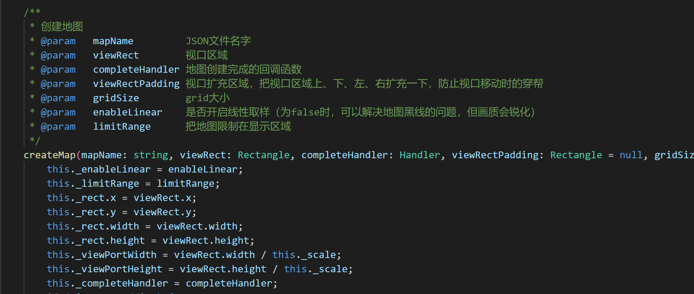

# Use TiledMap map


## 1. Overview

Tiled Map Editor is a free map editor that can be used to edit 2D game maps. The LayaAir engine supports parsing maps exported by Tiled Map. This article will introduce how to use maps exported by Tiled Map Editor in LayaAir engine development.

*Note: This article is only for developers who are familiar with and use the Tiled Map map tool. This article introduces how to use the map exported by Tiled Map Editor in LayaAir engine projects. Please find third-party tutorial documents for the content of the Tiled Map Editor tool itself. *


## 2. Export the Tiled Map supported by the engine

### 2.1 Download and install Tiled Map Editor

After opening the official homepage (http://www.mapeditor.org/), click the `DownLoad at itch.io` button directly to enter the download link (https://thorbjorn.itch.io/tiled).


(Figure 2-1)

If the official website is revised, you can also find the download link directly from the download page http://www.mapeditor.org/download.html.

Find the corresponding system version link, download and install it (*The version used in this document is Tiled 1.9.2*).

**Tips**：

*When you open the download, a payment page for sponsoring the software will pop up. If you don’t want to pay, you can directly click No thanks, just take me to the downloads, which will take you to a free download link.*


### 2.2 Tiled Map format supported by the export engine

The specific usage of the Tiled Map tool will not be discussed in this article. You can search for relevant tutorial documents on Baidu or Google. What has a lot to do with the engine is the format. Developers need to pay special attention. Generally, problems arise because they did not pay attention here.

#### 2.2.1 Requirements for tile layer format when creating a map

Click to create a new map. After setting the initial parameters such as map size and block size, click Save As to save it in the location you specified to complete the creation.

However, the tile layer format requires special attention, because the **LayaAir engine does not support the Base64 tile layer format of the Tiled Map map. **So when creating a new map **must** be in `CSV format`, as shown in Figure 2-2.


(Figure 2-2)

If you made the wrong choice when creating, you can also change the tile layer format to CSV or XML in the properties panel, as shown in Figure 2-3. Base64-related formats are not supported.


(Figure 2-3)


#### 2.2.2 Export to json format

In this example, we directly open the Tiled Map example map orthogonal-outside.tmx (*located in the examples directory of the Tiled Map map installation directory*), as shown in Figure 2-4


(Figure 2-4)

When exporting, we need to choose the json format.

In the file menu of the Tiled tool, click Save As to save the completed Tiled map as a json file type. In this example, it is named `orthogonal.json` (the file name is whatever the developer wants, just keep it consistent later), and click Save , and save it in the **project directory** (in this case, the project root directory \assets\resources\TiledMap\), as shown in Figure 2-5.


(Figure 2-5)


#### 2.2.3 Modify the album path and copy Tiled resources

Just saving it as a json file is not enough, we also need to change the absolute path of the image to a relative path.

We use the IDE to open the `orthogonal.json` we just saved and search for the keyword `image`. We will find that the default atlas path is located in the Tiled installation directory. As shown in Figure 2-6.


(Figure 2-6)

The path must not be in the Tiled installation directory.

Therefore, we need to copy this image to the project directory first, at the same level as the previously saved `orthogonal.json`.

As shown in Figure 2-7.


(Figure 2-7)

At the same time, we need to modify the format of the image file in the IDE to support transparent channels.


(Figure 2-8)

Then change the atlas path in `orthogonal.json` to a relative path, as shown in Figure 2-9


(Figure 2-9)

The preparation phase is over and the coding phase begins...


## 3. LayaAir engine uses Tiled Map map

### 3.1 IDE selects laya.tiledmap component


(Figure 3-1)

As shown in Figure 3-1, the engine class library only supports tiledmap after checking the laya.tiledmap component.


### 3.2 Create TiledMap map

#### 3.2.1 createMap API Description

The `createMap` method in the laya.TiledMap class can create a `TiledMap` map. The basic parameter description is shown in Figure 3-2.

 

(Figure 3-2)


#### 3.2.2 Create map example

```typescript
const { regClass, property } = Laya;

@regClass()
export class Main extends Laya.Script {

	private tMap:Laya.TiledMap;

	onEnable() {

   	 //Create map object
   	 this.tMap = new Laya.TiledMap();
    	//Create Rectangle instance, viewport area
    	var viewRect:Laya.Rectangle = new Laya.Rectangle(0, 0, Laya.stage.designWidth, Laya.stage.designHeight);
    	//Create TiledMap map
    	this.tMap.createMap("resources/TiledMap/orthogonal.json", viewRect, new Laya.Handler(this, this.completeHandler));
	}

	//Add the map to Scene2D
    private onLoaded(): void {
   	 this.tMap.mapSprite().removeSelf();
   	 this.owner.addChild(this.tMap.mapSprite());
    }

    //Callback when map loading is complete
    private completeHandler(e: any = null): void {
   	 this.onLoaded();
    }
}
```

Compile and run the code, and the effect is as shown in Figure 3-3, indicating that the map has been created successfully.


(Figure 3-3)


### 3.3 Control map

To control the map, you must first load the json of the map, and then control it in the callback method. Below we will learn how to use it with examples.

#### 3.3.1 Map zoom

The `scale` attribute in the `laya.map.TiledMap` class can control the zoom ratio of the map. We follow the previous example, add a callback in the `createMap` method, and then use the `scale` attribute to zoom the map.

The sample code is as follows:

```typescript
private onLoaded():void
{
    this.tMap.mapSprite().removeSelf();
    this.owner.addChild(this.tMap.mapSprite());
    //Enlarge the original map 2 times
    this.tMap.scale = 2;
}
```

The running effect is shown in Figure 3-4.


(Figure 3-4)


#### 3.3.2 Set the center point of map zoom

Obviously, the effect in Figure 3-4 is not what we want. After zooming in. Some parts are not shown. This is caused by the default zoom center point being in the center area of ​​the viewport.

##### Viewport area and default zoom center point position

The viewport area is set in the second parameter of the create map method (`createMap`),

```typescript
//Create map object
this.tMap = new Laya.TiledMap();
//Create Rectangle instance, viewport area
var viewRect:Laya.Rectangle = new Laya.Rectangle(0, 0, Laya.stage.designWidth, Laya.stage.designHeight);
//Create TiledMap map
this.tMap.createMap("resources/TiledMap/orthogonal.json", viewRect, new Laya.Handler(this, this.completeHandler));
```

By looking at the code, we find that the viewport is set to (`Laya.stage.designWidth, Laya.stage.designHeight`). The default value of the method `setViewPortPivotByScale` that controls scaling is 0.5. Then the center point position is shown in Figure 3-5.


(Figure 3-5)

When the map is zoomed in twice (`this.tMap.scale = 2;`), since the zoom is performed based on the center points of the x and y axes of the viewport area, the effect shown in Figure 3-6 will be produced after zooming in.


(Figure 3-6)

Next, we will further understand the center point of the scale attribute through the animation 3-7, which shows the scaling effect from 0.1 to 2 times the original image ratio.


(Animation 3-7)


##### Use the `setViewPortPivotByScale` method to set the zoom center point

What was introduced in the previous article is the default zoom center point effect. So how to set and change the zoom center point. The `setViewPortPivotByScale()` method in the `laya.map.TiledMap` class can set the center point of the viewport. The basic API description is shown in Figure 3-8.


(Figure 3-8)

The first parameter of the `setViewPortPivotByScale()` method `scaleX` is the scaling coordinate ratio in the X-axis direction, and `scaleY` is the scaling coordinate ratio in the Y-axis direction.

For example:

```
this.tMap.setViewPortPivotByScale(0.1,0.5);
```

**Code Description**:

Assume the viewport size is 1136*640

- `scaleX` value `0.1` means that the coordinate of the x-axis scaling center point is 113.6 (1136*0.1)
- `scaleY` value `0.5` means that the coordinate of the y-axis scaling center point is 320 (640*0.5)

When the code is running, the x-axis 113.6 and the y-axis 320 are used as the center point coordinates of the viewport for scaling.


##### Set the zoom center point to the upper left corner of the viewport

When the zoom center point of `setViewPortPivotByScale` is set to `0,0`, it is the upper left corner of the viewport. Continuing to use the previous example, the coding is as follows:

```typescript
//Add the map to Scene2D
private onLoaded(): void {
	this.tMap.mapSprite().removeSelf();
	this.owner.addChild(this.tMap.mapSprite());
	//Set the zoom center point to the upper left corner of the viewport
	this.tMap.setViewPortPivotByScale(0,0);
	//Enlarge the original map 2 times
	this.tMap.scale = 2;
}
```

Set the zoom center point to the upper left corner of the viewport, and then zoom in 2 times, the effect is as shown in Figure 3-9.


(Figure 3-9)


### 3.4 Drag the map

When the map is enlarged, it cannot be fully displayed. At this time, you need to drag the map to view all.

In addition to the methods introduced in the previous article, dragging the map also requires the `moveViewPort()` (moving the viewport) method and the `changeViewPort()` (changing the viewport size) method. The basic descriptions of these two APIs are shown in Figures 3-10 and 3-11.


(Figure 3-10)


(Figure 3-11)

Check the code directly below to understand the use of these two methods.

```typescript
const { regClass, property } = Laya;

@regClass()
export class Main extends Laya.Script {

	private tMap:Laya.TiledMap;
	private MapX:number = 0;
	private MapY:number = 0;
	private mLastMouseX:number;
	private mLastMouseY:number;

	onEnable() {

   	 //Create map object
   	 this.tMap = new Laya.TiledMap();
    	//Create Rectangle instance, viewport area
    	var viewRect:Laya.Rectangle = new Laya.Rectangle(0, 0, Laya.stage.designWidth, Laya.stage.designHeight);
    	//Create TiledMap map
    	this.tMap.createMap("resources/TiledMap/orthogonal.json", viewRect, new Laya.Handler(this, this.completeHandler));
	}

	//Add the map to Scene2D
    private onLoaded(): void {
   	 this.tMap.mapSprite().removeSelf();
   	 this.owner.addChild(this.tMap.mapSprite());
    	//Set the zoom center point to the upper left corner of the viewport
    	this.tMap.setViewPortPivotByScale(0,0);
    	//Enlarge the original map 3 times
    	this.tMap.scale = 3;

    	Laya.stage.on(Laya.Event.RESIZE,this,this.resize);
    	Laya.stage.on(Laya.Event.MOUSE_DOWN, this, this.mouseDown);
    	Laya.stage.on(Laya.Event.MOUSE_UP, this, this.mouseUp);
    	this.resize();
    }

    //Callback when map loading is complete
    private completeHandler(e: any = null): void {
   	 this.onLoaded();
    }

	/**
 	* Move map viewport
 	*/
	private mouseMove():void{
    	var moveX:number = this.MapX - (Laya.stage.mouseX - this.mLastMouseX);
    	var moveY:number = this.MapY - (Laya.stage.mouseY - this.mLastMouseY)
    	//Move map viewport
    	this.tMap.moveViewPort(moveX, moveY);
	}
	private mouseUp():void
	{
    	this.MapX = this.MapX - (Laya.stage.mouseX - this.mLastMouseX);
    	this.MapY = this.MapY - (Laya.stage.mouseY - this.mLastMouseY);
    	Laya.stage.off(Laya.Event.MOUSE_MOVE, this, this.mouseMove);
	}
	private mouseDown():void
	{
    	this.mLastMouseX = Laya.stage.mouseX;
    	this.mLastMouseY = Laya.stage.mouseY;
    	Laya.stage.on(Laya.Event.MOUSE_MOVE, this, this.mouseMove);
	}

	/**
 	* Change viewport size
 	* Reset the map viewport area
 	*/    
	private resize():void
	{
    	//Change the viewport size
    	this.tMap.changeViewPort(this.MapX, this.MapY, Laya.stage.designWidth, Laya.stage.designHeight);
	}
}
```


The code running effect is shown in Figure 3-12.


(Animation 3-12)


## 4. Tiled Map usage optimization

### 4.1 Destroy the map

When the Tiled Map is no longer used, it needs to be destroyed using the destroy() method to recycle the occupied memory.

For example:

```
this.tMap.destroy();
```


### 4.2 Cache related

#### 4.2.1 Turn on and off automatic caching

When the LayaAir engine uses `TiledMap`, plots without animation will be automatically cached by default, and the cache type defaults to normal.

```typescript
//Automatically cache plots without animation
this.tMap.autoCache = true;
//The type of automatic caching. It is recommended to use normal when the map is large.
this.tMap.autoCacheType = "normal";
//Eliminate the gaps caused by scaling, that is, remove the black edges
this.tMap.antiCrack = true;
```

The above code attributes are the default values ​​of the engine. In most cases, you can keep the default values ​​without additional settings.

So why introduce it again?

Because sometimes, black edges (gaps) will appear in the cached Tiled map. Despite the `antiCrack` attribute, most black edges caused by normal caching can be eliminated. But if the occasional black border problem remains unresolved. The problem of black edges (gaps) can be solved by turning off automatic caching.


#### 4.2.2 Set cache block size

##### Recommended settings for cache blocks

`TiledMap` maps are composed of unit blocks. If the original size is maintained during caching, performance will be affected when there are many small image blocks. Therefore, it is recommended to turn on the cache block setting and set the size of the cache block to about 512 pixels, which must be an integer multiple of the original small image block.

For example, the single image block size in the example in this article is `16*16`, then the cache block can be set to 32 times 16, which is `512*512`.

If the single image is `15*15`, the cacheable block can be set to `510*510` (34 times), and so on. Try to set it around 512 under the premise of an integer multiple of the original block. Recommended is `512*512`.

##### Specific setting method of cache block

The settings of the cache block need to be set when `createMap` (creating the map). Set the fourth parameter `gridSize`, the example is as follows:

```typescript
//Create a Rectangle instance for the second parameter, the viewport area
var viewRect:Laya.Rectangle = new Laya.Rectangle(0, 0, Laya.Browser.width, Laya.Browser.height);
//Create a Point object instance with a size of 512*512 for the fourth parameter gridSize
var gridSize:Laya.Point = new Laya.Point(512, 512);
//Create TiledMap map
this.tMap.createMap("res/TiledMap/orthogonal.json",viewRect, Laya.Handler.create(this,this.onMapLoaded), null, gridSize);
```


### 4.3 Merge layers

#### 4.3.1 Turn on merged layers

When there are multiple layers in `TiledMap`, turn on the attribute `enableMergeLayer` of the merged layer to merge the layers, which will improve performance.

The way to turn it on is:

```typescript
//Enable layer merging
this.tMap.enableMergeLayer = true;
```

**Tips**:

It should be noted that if you need to operate on the layers before merging, you cannot merge them directly. Because after merging, the layers before merging cannot be operated.


#### 4.3.2 Layer merging and grouping

If the layers are not grouped in `TiledMap`, then when the layers are merged, all the layers will be merged together. Therefore, it is necessary to divide it into multiple layers and operate them separately. Layers can be grouped in a `TiledMap`.

##### `TiledMap` layer grouping method

Open the `TiledMap` map editor, select the layer to be grouped, and add a `string` type attribute named `layer` in the layer's custom property bar. The operation is shown in Figure 4-1.


(Pic 4-1)

Click OK. After the addition is completed, all layers with custom attribute layers added will be added. Set the group name.

For example, if we set the group name of block layer 2 and block layer 3 to layaAir, then the layer named layaAir will be merged into the same layer after `enableMergeLayer` is turned on. The operation is shown in Figure 4-2.


(Figure 4-2)

When merging layers is turned on, the layer attribute can be added to the layer attributes. At runtime, adjacent layers with the same layer attributes will be merged to improve performance.


### 4.4 Remove covered grids

If the underlying grid is occluded, and the occluded plot is not transparent, then the occluded part is directly removed without being rendered, which can improve performance.

The method to enable removal of overwriting is:

```
//Remove the parts covered by non-transparent blocks
this.tMap.removeCoveredTile = true;
```

**Tips**：

If it is opened, it is impossible to operate the removed part. Therefore, you must confirm before turning on this function and no longer operate on the removed part.

##### Prerequisites for `removeCoveredTile` to be enabled

If the `type` attribute is not set for the tile in the Tiled Map, then even if `removeCoveredTile` is turned on, it will be invalid. Therefore, before turning it on, you need to add a custom attribute type for the tile in the `TiledMap` editor and set it to 1.

##### How to set the tile type in Tiled Map

In the tile panel, click tile editing to open the tile terrain editing panel. The operation is shown in Figure 4-3.


(Figure 4-3)

In the tile terrain editing panel, select the terrain, click the `+` icon in the custom attribute bar, and add the `type` attribute of the `int` type. Then click OK to complete the addition. The operation is shown in Figure 4-4.


(Figure 4-4)

After completing the addition, set the `type` attribute value to 1. The operation is shown in Figure 4-5.


(Figure 4-5)

As long as the custom attribute type is set to 1, when `removeCoveredTile` is turned on. When blocked and invisible, they can be removed to improve performance.

