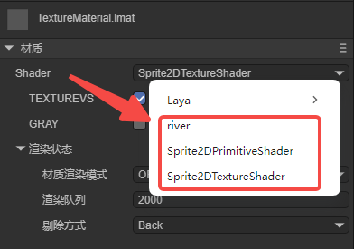
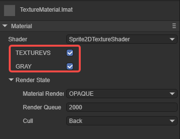
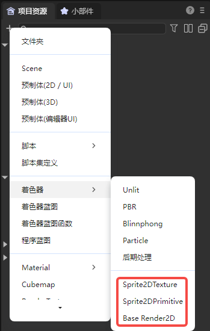
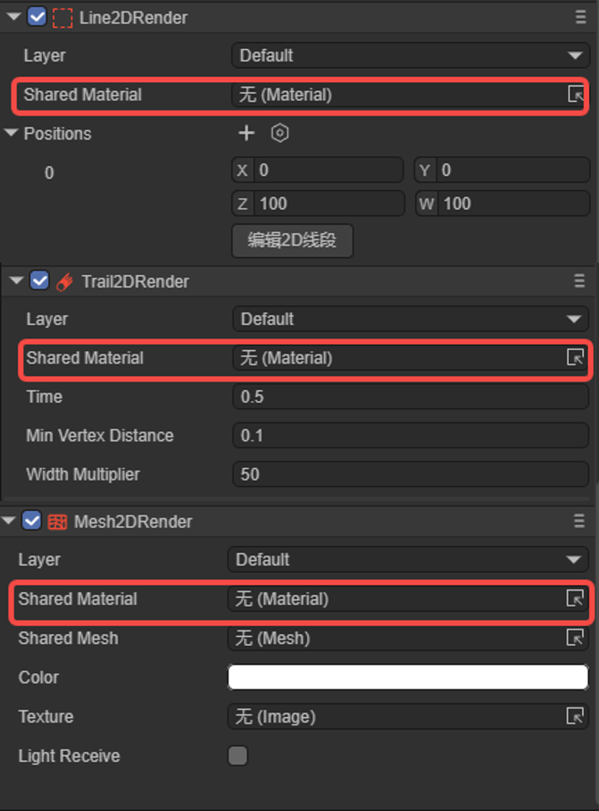

# Custom 2D Shader

## 1. Overview

The 2D custom shader (Shader) is a kind of advanced engine capability. This feature may not be common in the vast majority of projects. However, for those projects that pursue more refined effects and unique styles, the demand for custom shaders also exists.

Currently, LayaAir can implement custom 2D texture rendering (Texture2D) and basic primitive rendering (Primitive).

This documentation is an advanced one. Before reading, you need to have basic knowledge of Shader. You can refer to some concept introductions in the 3D shader [documentation](../../../3D/advanced/customShader/readme.md).


## 2. Structure and Application

### 2.1 Shader File

The Shader in the LayaAir engine mainly centers around the.shader file. In the engine core, the.shader file is the textual representation of the Shader class object. Different.shader files will produce different shading effects, and these.shader files become the core factors for different materials.

Right-click the menu bar in the project resource window -> Select Create -> Select Shader (as shown in Figure 2-1), there are two built-in 2D Shaders to choose from.


(Figure 2-1)

### 2.2 Application Scope

The application of Shader in LayaAir is mainly reflected in the display of different material effects. Through the selection of different Shaders, the materials change, forming different effects. As shown in Figure 2-2, in the "Property Settings" panel of the material resource, you can select a custom Shader, and the Shader in `Laya` in the figure is the built-in Shader of the engine.



(Figure 2-2)

Then, the material file with the shader added can be added to the 2D node. As shown in Figure 2-3, taking Sprite as an example, add the material to the Material property.

> Each 2D component has a Material property.


(Figure 2-3)

To sum up, Shader is applied to the material, and the material is applied to the 2D node.

### 2.3 File Structure

In the LayaAir engine, to customize a.shader file, the following structure is required:

`Shader3D Start/End`: Shader file header/footer.

Used to declare the rendering pass, rendering state, material parameters, etc.,

```glsl
Shader3D Start
{
    //Fill in the attributes of the Shader rendering pass, rendering state, material parameters, etc. here
}
Shader3D End
```

`name`: Shader name

Used to explain the name of the Shader to distinguish the functions and effects of different Shaders. This name is also the name displayed in Figure 2-2.

```glsl
Shader3D Start
{
    //Here, ShaderName is the name of the Shader, not the name of the.shader file
    name: ShaderName 
}
Shader3D End
```

`shaderType`: Shader type (In 2D Shader, it is directly set to 2).

```glsl
Shader3D Start
{
    shaderType:2
}
Shader3D End
```


## 3. uniformMap

The uniform variable is a global variable in the shader program, which remains unchanged during a rendering process and is set and passed to the GPU by the CPU side. Global means that the uniform variable must be unique in each shader program object and can be accessed by any shader (vertex shader, fragment shader) of the shader program at any stage. Moreover, no matter what the uniform value is set to, the uniform will always retain their data until they are reset or updated.

And the uniformMap is a data structure that stores such a bunch of uniform variables, and allows developers to understand the uniform variables used in the Shader more intuitively in a combined form.

### 3.1 Common Variable Types of uniform

Common types of uniform variables: Texture2D, Vector2, Vector4, Float, Matrix4x4.

`Texture2D`: Image type for 2D texture sampling.

`Vector2`: Two-dimensional vector, used for representing 2D coordinate positions.

`Vector4`: Four-dimensional vector, used for representing colors.

`Float`: Floating-point type.

`Matrix4X4`: 4X4 homogeneous matrix.

```glsl
Shader3D Start
{
    name:Sprite2DTextureShader,
    shaderType:2,
    uniformMap:{
        u_MainTex : {type: Texture2D, default: "white"},
        u_SampleTexcoord : {type: Vector2, default:[1,1]},
        u_Color : {type:Vector4, default:[1,1,1,1]},
        u_spend : {type:Float, default:1.0},
        u_defaultMat : {type:Matrix4x4, default:[
        1,0,0,0
        0,1,0,0,
        0,0,1,0,
        0.0,0,
        ]}
    }
}
Shader3D End
```

### 3.2 Common Built-in uniforms in the Engine

> Note: The other uniform variables involved in the engine can be found in the xx.glsl file in the LayaAir engine source code.

| Variable Name   | Description              | Belonging GLSL File (High-level operations are not recommended to be used directly) |
| :-------------- | :----------------------- | ------------------------------------------------------------ |
| u_mmat          | 2D transformation matrix | Sprite2DVertex.glsl                                          |
| u_spriteTexture | Sprite texture           | Sprite2DFrag.glsl                                            |
| u_color         | Color                    | Sprite2DFrag.glsl                                            |
| u_colorAdd      | Color overlay            | Sprite2DFrag.glsl                                            |
| u_clipMatPos    | Clipping position        | Sprite2DVertex.glsl                                          |
| u_clipMatDir    | Clipping direction       | Sprite2DVertex.glsl                                          |
| u_blurInfo      | Blurring information     | Sprite2DFrag.glsl                                            |


## 4. attributeMap

The attributeMap consists of individual attributes. Attributes mainly include two types: basic vertex data and texture-related data, and they are usually read-only. These attribute data are processed in the **vertex shader** and then passed to the fragment shader for the final color calculation. The entire process manages the state and data of the Shader through the `Value2D` class of the engine.

- Basic vertex data:

`a_position`: Vertex position data.

`a_attribColor`: Vertex color data.

- Texture-related data:

`a_posuv`: Composite data containing position and UV coordinates.

`a_attribColor`: Vertex color data.

`a_attribFlags`: Texture flag data.

Regarding attributes, when developers customize the Shader, they usually need to follow the following rules:

(1) Must use the attribute names and structures predefined by the engine.

(2) These attributes can only be used in the vertex shader. If they need to be used in the fragment shader, they need to be passed through varying.

(3) Generally, do not add new attributes at will, just use the predefined ones of the engine directly.

```glsl
Shader3D Start
{
    ......
    attributeMap: {
        a_posuv: Vector4,
        a_attribColor: Vector4,
        a_attribFlags: Vector4,
    },
    ......
}
Shader3D End
```


## 5. defines

### 5.1 Basic Usage

Macro switches can be used to control the Shader instructions of different branch conditions in the vertex shader and the fragment shader. In defines, the basic structure of the macro switch is:

`defineName`: The name of the macro switch.

`type`: Generally bool, true or false triggers two different branches.

`default`: When set to true, it is displayed as checked in the material property settings panel by default; when set to false, it is displayed as unchecked in the material property panel.

`private`: When the value is false, in the Shader window of the material's property settings panel, the macro switch will be displayed as a check switch for developers to control the opening and closing of the macro as needed on the panel; when the private value is true, the check switch is not displayed.

```glsl
Shader3D Start
{
    ......
    defines: {
        TEXTUREVS: { type: bool, default: true, private: false },
        GRAY: { type: bool, default: false, private: false }
    }
    ......
}
Shader3D End
```

The figure 5-1 below shows the effect of the above defines in the material's property settings panel,



(Figure 5-1)

### 5.2 Linkage with uniformMap

The macro switch in defines can be linked with the global attribute in the uniformMap. For example, in the following sample code:

```glsl
Shader3D Start
{
    ......
    uniformMap:{
        //Modify u_mainTex and define A at the same time
        u_mainTex: { type: Texture2D, define: A },

        //Modify u_noiseMap and define B and C at the same time
        u_noiseMap: { type: Texture2D, define: [B,C] }
    },
    defines: {
        A : { type: Bool },
        B : { type: Bool },
        C : { type: Bool }
    }
    ......
}
Shader3D End
```

In the material's property settings panel, adding a texture to u_mainTex will make A checked; adding a texture to u_noiseMap will make B and C checked. The effect is shown in Animated GIF 5-2.


(Animated GIF 5-2)


## 6. styles

In uniformMap or defines, the display details of uniform or define on the UI can be adjusted directly, or these details can be moved to the styles section to make uniformMap and defines more concise.

### 6.1 For uniformMap

Originally in the uniformMap, more details need to be defined. For example (original writing):

```glsl
    uniformMap:{
        u_Number: { type: Float, default:0, alias:"Number",  range:[0,100], fractionDigits: 2 }
    },
```

If there are many details, for the conciseness of the uniformMap, these details can be moved to styles:

```glsl
    uniformMap:{
        u_Number: { type: Float, default:0 }
    },
    styles: {
        u_Number: { caption:"Number", range:[0,100], fractionDigits: 2 }
    },
```

### 6.2 For defines

The more important function of styles is to define attributes that are only used for the UI and do not belong to uniform and define. For example:

```glsl
    defines: {
        RAIN : { type: Bool, default: true },
        SNOWY : { type: Bool, default: false }
    },

    styles: {
        RAIN : { caption: "Rain", inspector : null }, //inspector is null, not displayed in the property panel
        SNOWY : { caption: "Snowy"},
    
        // Define attributes that do not belong to uniform and define
        weather : { caption:"Weather", inspector: RadioGroup, options: { members: [RAIN, SNOWY] }}
    },
```

RAIN and SNOWY are in defines, but in styles, the inspector of RAIN is null, so it is not displayed. SNOWY is displayed normally. Weather is an attribute that is only used for the UI and does not belong to uniform and define. The effect is shown in Figure 6-1.


(Figure 6-1)


## 7. shaderPass

### 7.1 What is shaderPass

The shaderPass can be understood as the rendering scheme of the Shader. Each Shader has at least one shaderPass and can have multiple shaderPasses. It divides the Shader object into multiple parts, which are respectively compatible with different hardware, rendering pipelines and runtime setting information. However, too many shaderPasses can cause a decrease in rendering efficiency and performance bottlenecks.

```glsl
Shader3D Start
{
    .....
    shaderPass:[
        {
            //Shader VS/FS Info here
        }
    ]
}
Shader3D End
```

The shaderPass mainly defines the vertex shader and the fragment shader. For example,

```glsl
Shader3D Start
{
    type:Shader3D,
    name:Sprite2DTextureShader,
    shaderType:2,
    uniformMap:{
    },
    attributeMap: {
        a_posuv: Vector4,
        a_attribColor: Vector4,
        a_attribFlags: Vector4,
    },
    defines: {
        TEXTUREVS: { type: bool, default: true, private: false },
        GRAY: { type: bool, default: false, private: false }
    },
    shaderPass:[
        {
            pipeline:Forward,
            VS:textureVS,
            FS:texturePS
        }
    ]
}
Shader3D End
```

This Shader has only one shaderPass. The content of the vertex shader is textureVS, the content of the fragment shader is texturePS, and the rendering mode is forward rendering.

When implementing the specific vertex shader (VS) and fragment shader (PS), you need to add the start and end flags: `GLSL Start` / `GLSL End`.

```glsl
GLSL Start

#defineGLSL textureVS
    // VS
#endGLSL

#defineGLSL texturePS
    // PS
#endGLSL

GLSL End
```

Among them, #defineGLSL "name" / #endGLSL are the VS and FS fragment markers corresponding to the shaderPass.

### 7.2 Vertex Shader

In the VS fragment, vertex information needs to be obtained and the final vertex position needs to be calculated. The code is as follows:

```glsl
#defineGLSL textureVS

    #define SHADER_NAME Sprite2DTextureShader
    #include "Sprite2DVertex.glsl";
    
    void main() {
        vertexInfo info;
        getVertexInfo(info);
    
        v_cliped = info.cliped;
        v_texcoordAlpha = info.texcoordAlpha;
        v_useTex = info.useTex;
        v_color = info.color;
    
        vec4 pos;
        getPosition(pos);
        gl_Position = pos;
    
    }

#endGLSL
```

`#define SHADER_NAME Sprite2DTextureShader` is a macro definition used to define the name of the shader.

`#include "Sprite2DVertex.glsl"` indicates that the Sprite2DVertex.glsl basic library is included. The "#include" in the LayaAir Shader is similar to the "include" in the C language. Some shader algorithms that the engine has packaged are built into the xxx.glsl file of the engine.

If the built-in glsl of the engine is referenced, it can be referenced directly; if it is a custom.glsl file, it can be placed anywhere under the assets folder. Then the.shader file references the.glsl file through a relative path. Even in the same level directory, it needs to start with./, for example:

```glsl
#include "./abc.glsl";
#include "./path/to/abc.glsl";
#include "../path/abc.glsl";
```

### 7.3 Fragment Shader

In the PS fragment, the actual pixel rendering, that is, shading, needs to be completed. The code is as follows:

```glsl
#defineGLSL texturePS
    #define SHADER_NAME Sprite2DTextureShader
    #if defined(GL_FRAGMENT_PRECISION_HIGH)
        precision highp float;
    #else
        precision mediump float;
    #endif

    #include "Sprite2DFrag.glsl";
    
    void main()
    {
        clip();
        vec4 color = getSpriteTextureColor();
    
        #ifdef GRAY
            float gray = dot(color.rgb, vec3(0.299, 0.587, 0.114)); // Convert to grayscale
            color.rgb = vec3(gray);
        #endif
    
        setglColor(color);
    }

#endGLSL
```

The final effect is shown in the animated GIF 7-1. By controlling whether the image is grayscale through the macro switch, it can be seen that it becomes grayscale after checking.


(Animated GIF 7-1)


## 8. Built-in 2D Shaders in LayaAir-IDE

In LayaAir-IDE, three built-in 2D shaders can be created, as shown in Figure 8-1,



(Figure 8-1)

These three shaders are templates provided for developers and can be changed based on them. But it should be noted that they are three types of shaders and are not universal:

- Texture (uv) type, that is, the 2D texture type. It can be used for material assignment of Sprite, as shown in Figure 8-2. It cannot be used on the BaseRenderNode2D type (for example, Mesh2DRender, Line2DRender, Trail2DRender).


(Figure 8-2)

- Primitive (mesh) type, that is, the 2D graphic type. It can be used for material assignment of Sprite, and the usage position is the same as shown in Figure 8-2. The difference from the first type is that the Primitive type cannot use the default texture, that is, Sprite cannot assign a value to texture.
- BaseRender2D type, that is, the 2D basic rendering type. It can be used to assign materials to the rendering components of Sprite and cannot be used for the material of Sprite in Figure 8-2. BaseRender2D can receive the 2D lighting type and is generally used on the 2D rendering components with BaseRenderNode2D as the base class (for example, Mesh2DRender, Line2DRender, Trail2DRender), as shown in Figure 8-3.



(Figure 8-3)