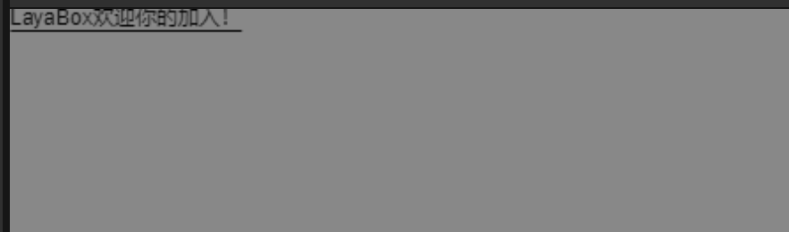

# HTML text


## 1. Overview

HTML text component, just like using HTML language to implement UI. In LayaAir IDE, we can use HTML text components to achieve some more complex UI effects, such as the function of mixing images and text, the function of changing the color of certain text in a paragraph, etc.


## 2. Use in IDE

### 2.1 Add html class library

Before using HTML text, in the project settings, you need to check the laya.html class library, as shown in Figure 2


(figure 2)


### 2.2 Create in node

In a Scene2D Hierarchy window, you can create HTML text under any node or in a blank position by right-clicking the mouse, as shown in animation 2-1.

 

(Animation 2-1)

The HTML text created at this time will not have any effect. We will introduce how to add text content later.


### 2.3 Create in control

Under the 2D label of the control, you can create HTML text under any node, as shown in animation 2-2

 

(Animation 2-2)


### 2.4 InnerHTML attributes


(Figure 2-3)

As shown in Figure 2-3, there is only one Inner HTML attribute in HTML text. We only need to add text content to the attribute.

The text content refers to the HTML language. Let’s take a look at an example, as shown in Figure 2-4.


(Figure 2-4)

As shown in Figure 2-4, it is the running effect of entering the following text in the Inner HTML content

```typescript
<span style='font-weight:bold;font:50px Arial;color:red' href='https://ask.layabox.com'>LayaBox</span>
```

As you can see, the LayaBox text uses Bold bold, the font size is 50 pixels, Arial font, the font color is red, and LayaBox is an underlined text link form


## 3. Used in code

The `Laya.HTMLDivElement` class is located in the laya.html class library. HTML graphic class, used to display html content

```typescript
/**
 * HTML graphic class, used to display html content
 *
 *Supported tags are as follows:
 * a: Link tag, the "link" event will be dispatched after clicking, for example: <a href='alink'>a</a>
 * div: div container tag, such as: <div>abc</div>
 * span: inline element tag, such as: <span style='color:#ff0000'>abc</span>
 * p: line element tag, p tag will wrap automatically, div will not, for example: <p>abc</p>
 * img: image tag, such as: </img>
 * br: Line break tag, such as: <div>abc<br/>def</div>
 * style: style tag, such as: <div style='width:130px;height:50px;color:#ff0000'>abc</div>
 * link: external link style tag, you can load a css file to use as style, for example: <link type='text/css' href='html/test.css'/>
 *
 * The attributes supported by style are as follows:
 * italic:true|false;   				 Is it italic?
 * bold:true|false;   					 Is it bold
 * letter-spacing:10px;   				 word spacing
 * font-family: 宋体;						font
 * font-size:20px;   					 font size
 * font-weight:bold:none;   			 Whether the font is bold, the function is the same as bold
 * color:#ff0000;   					 font color
 * stroke:2px;   						 Font stroke width
 * strokeColor:#ff0000;   				 Font stroke color
 * padding:10px 10px 20px 20px;   		 edge distance
 * vertical-align:top|bottom|middle; vertical alignment
 * align:left|right|center;   			 horizontal alignment
 * line-height:20px;   				 	 line height
 * background-color:#ff0000;   		 	 background color
 * border-color:#ff0000;   			 	 border color
 * width:100px;   						 object width
 * height:100px;   					 	 object height
 *
 * Example usage:
 * var div:HTMLDivElement=new HTMLDivElement();
 * div.innerHTML = "<link type='text/css' href='html/test.css'/><a href='alink'>a</a><div style='width:130px;height:50px;color:#ff0000'>div</div><br/><span style='font-weight:bold;color:#ffffff;font-size:30px;stroke:2px;italic:true;'>span</span><span style='letter-spacing:5px'>span2</span><p>p</p></img>";
 */
 export class HTMLDivElement extends Sprite {
```

Let's see the running effect through some sample code:


### 3.1 Set Bold, Font, FontSize, Color, and Underline in the same text

**[Note: Currently italics, strokes, and span tag embedding are not supported]**

Examples are as follows:

```typescript
var div:Laya.HTMLDivElement = new Laya.HTMLDivElement();
div.innerHTML="<span style='font-weight:bold;" +
"font:24px Arial' " +
"color='red' " +
"href='https://ask.layabox.com'>" +
"LayaBox</span><span>Welcome to join</span>";

Laya.stage.addChild(div);
```

running result:


### 3.2 **Set different fonts and colors in the same text**

Examples are as follows:

```typescript
var htmlD:HTMLDivElement = new HTMLDivElement();
Laya.stage.addChild(htmlD);
htmlD.innerHTML = "<font style='fontSize:30' color='#67fc2c'>Test</font><font style='fontSize:20'>html component</font>";
```

running result:


### 3.3 **Get the actual width and height of html text (contextWidth, contextHeight)**

Examples are as follows:

```typescript
var htmlDiv:HTMLDivElement=new HTMLDivElement();
var html:string = "<span color='#e3d26a'> use</span>";
html += "<span style='color:#FFFFFF;font-weight:bold'>HTMLDivElement</span>";
html += "<span color='#6ad2e3'>Created</span><br/>";
html += "<span color='#d26ae3'>HTML text</span>";
htmlDiv.innerHTML = html;
htmlDiv.pos(50,200);
console.log("The actual width of the text is "+htmlDiv.contextWidth,"The actual height of the text is "+htmlDiv.contextHeight)
Laya.stage.addChild(htmlDiv);
```

running result:


Run output: The actual width of the text is 158.677734375 The actual height of the text is 24


### 3.4 Set the horizontal center alignment of text (align needs to be used in conjunction with width)
**[Note: Vertical center alignment of text is currently not supported. Developers can assign the value of (height of image - height of text)/2 to the Y value of text to perform vertical center alignment alternative settings]**

Examples are as follows:

```typescript
var html3:HTMLDivElement=new HTMLDivElement();
html3.style.lineHeight=30;
html3.style.width=300;
html3.style.align="center";
html3.innerHTML="<br/><span> Test horizontal center alignment</span>";
Laya.stage.addChild(html3);
```

running result:


### 3.5 Implementing hyperlinks

Examples are as follows:

```typescript
var div:HTMLDivElement=new HTMLDivElement();
div.innerHTML="<span href='http://ask.layabox.com/'>LayaBox welcomes you to join!</span>";
div.on(Laya.Event.LINK,this,(data:any)=>{
    Laya.Browser.window.location.href=data;
});
Laya.stage.addChild(div);
```

running result:



Click the text link to open the browser and visit the URL


### 3.6 Implement html page jump

Examples are as follows:

```typescript
var iHtml:HTMLIframeElement = new HTMLIframeElement();
Laya.stage.addChild(iHtml);
iHtml.href="test.html";
```

running result:


### 3.7 Set the line spacing and leading attribute for HtmlDivElement. Note that valign=’middle’ must be set

Examples are as follows:

```typescript
var t:HTMLDivElement = new HTMLDivElement;
Laya.stage.addChild(t);
t.style.valign = "middle";
t.size(60, 120);
t.style.wordWrap = true;
t.style.leading = 10;
t.innerHTML = "akshfkjashfkjhakshjdfhkasjdfhsaf";
```

running result:


### 3.8 Solve the problem of lower English letters on IOS mobile phones (add vertical upward alignment valign:top attribute in style)

Examples are as follows:

```typescript
var html:HTMLDivElement=new HTMLDivElement();
html.innerHTML = "<span style='color:#ffffff;valign:top;'>Friend abc11''31ABC friend</span><span href='http://www.baidu.com' target='_blank '>Baidu</span>";
Laya.stage.addChild(html);
```

running result:


