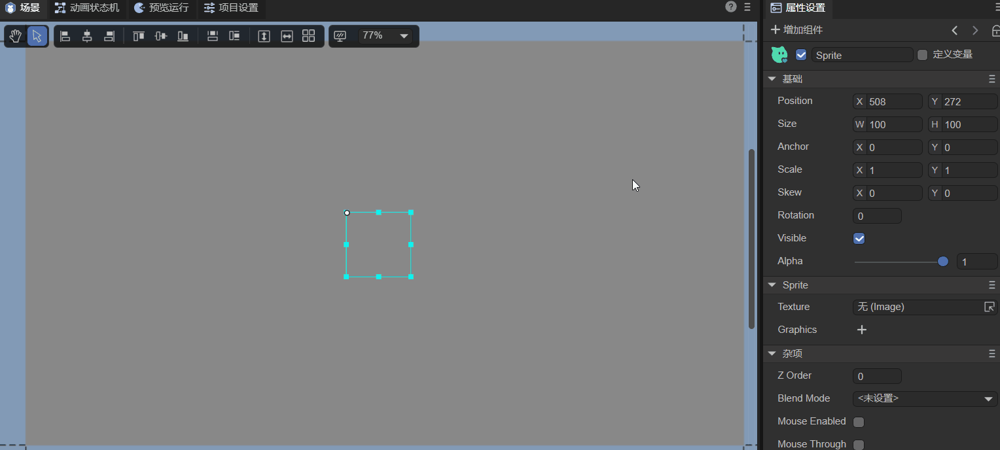
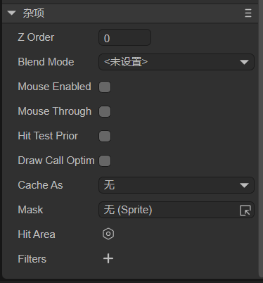
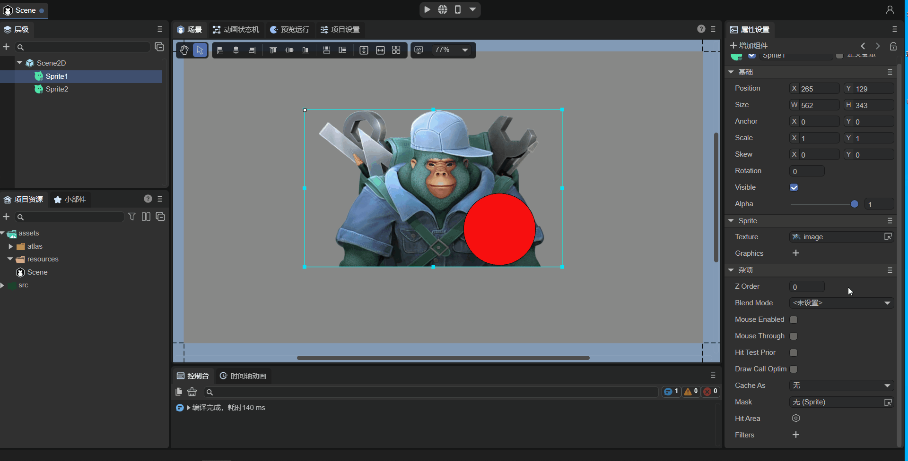
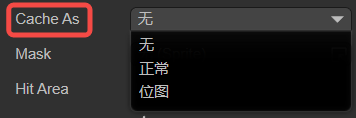
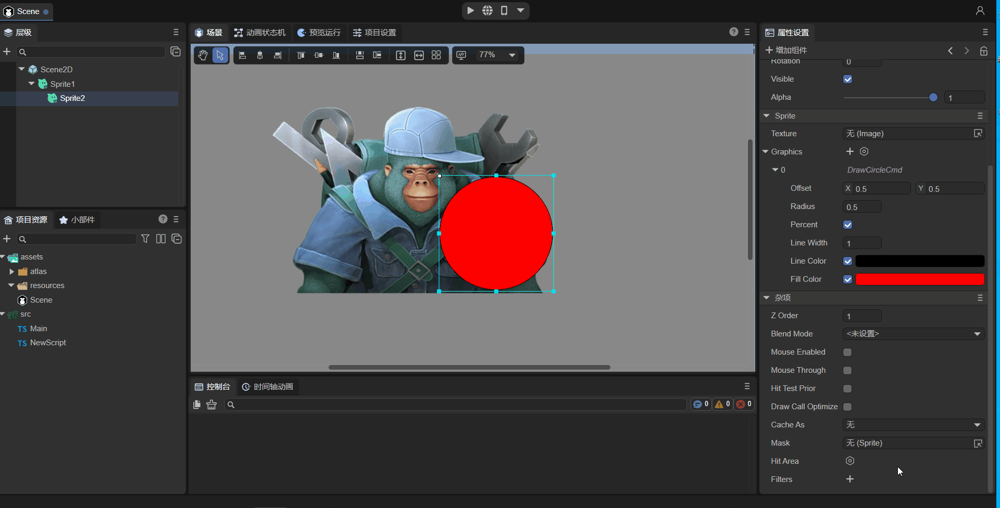
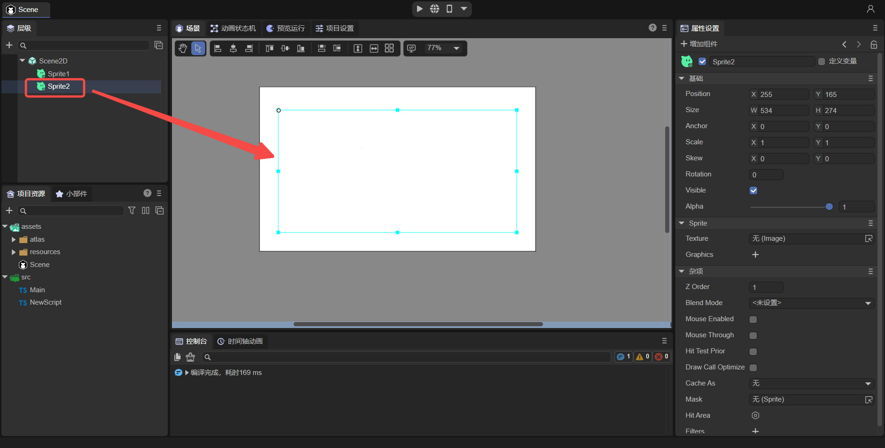
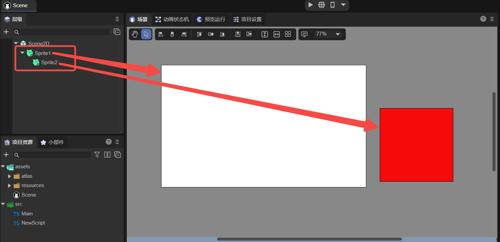
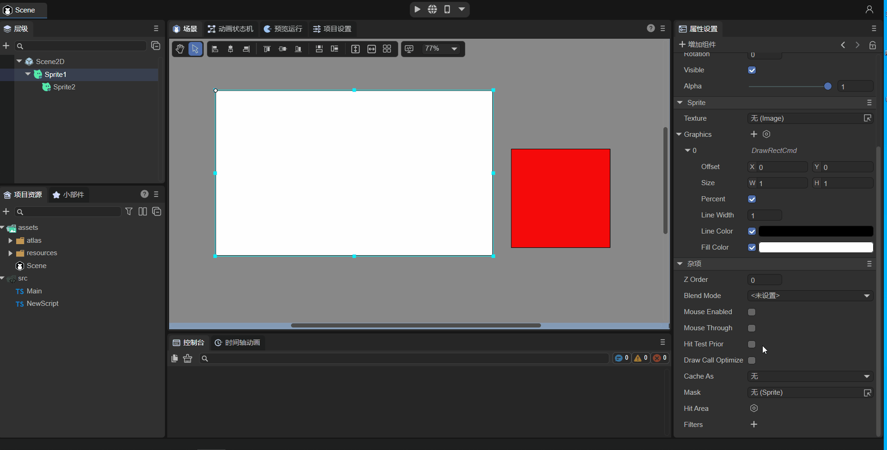
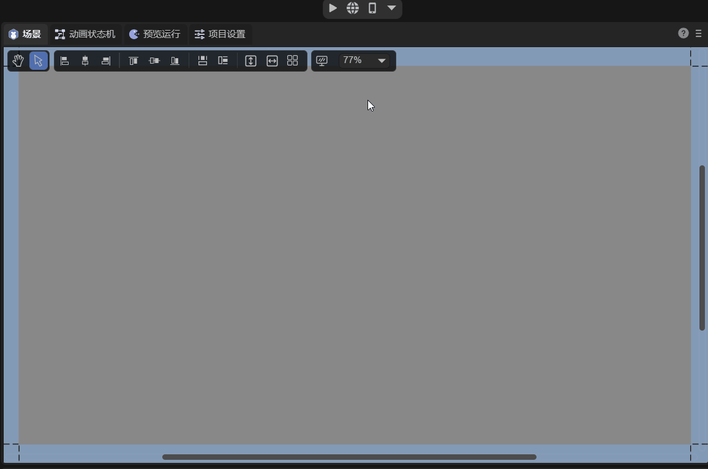

# Sprite


## 1. Overview

The Sprite in the game is a display object that can be controlled on the screen. If the display object on the screen cannot be controlled, it is just a node. To be precise, a Sprite is a 2D image that can be transformed into a controllable animation by changing its own properties, such as angle, position, scaling, color, etc.

`Sprite` is a basic display list node that displays graphics. Pictures or vector graphics can be drawn through `graphics`, which supports rotation, scaling, displacement and other operations. `Sprite` is also a container class and can be used to add multiple child nodes. `Sprite` has been optimized for rendering in different situations, thus ensuring that a class can achieve rich functions while achieving high performance.

In addition, in LayaAir 2D UI, Sprite is the base class of all node objects, as shown in Figure 1-1. The basic functions of the Sprite class will be inherited to all inherited node objects (due to limited space, only the The subclass of the Sprite class part. For all inheritance relationships, please refer to [API document](https://layaair.com/3.x/api/Chinese/index.html?version=3.0.0&type=Core&category=display&class=laya .display.Sprite)), so this article will introduce the basic functions of the Sprite class in detail, and subsequent node objects will not be introduced again.


(Picture 1-1)


## 2. Use in IDE

### 2.1 Create Sprite

#### 2.1.1 Created in Scene2D

In a Scene2D `hierarchy` window, you can create sprites under any node or in a blank position by right-clicking the mouse, as shown in animation 2-1:


(Animation 2-1)

No effect can be seen on the sprite created at this time. In fact, an empty 2D sprite node is created.


#### 2.1.2 Create in control

Under the 2D tag of `Widget`, sprites can be created under any node, as shown in animation 2-2:


(Animation 2-2)


### 2.2 Basic attributes

As shown in Figure 2-3, elves have the following basic attributes:


(Figure 2-3)

| Basic attributes | Function description	|
| -------- | -------------- |
| Position | The position coordinates of the sprite |
| Size 	| The width and height of the sprite	|
| Anchor | Sprite's anchor point	|
| Scale	| Scaling of sprites	|
| Skew 	| The tilt angle of the sprite |
| Rotation | The rotation of the sprite |
| Visible | Whether the sprite is visible |
| Alpha	| Sprite transparency |

Let’s go through a set of operations to see how these attributes are operated, as shown in Figure 2-4:



(Animation 2-4)

Since the sprite at this time is just an empty node and has no display object, the adjustment of Visible and Alpha will not cause any display changes. Let's first take a look at some commonly used basic attributes:

#### 2.2.1 Position

The position of the sprite refers to the position of the canvas where the sprite's anchor point/pivot point is located. Position has two parameters, x and y. The upper left corner of the canvas is the origin. Pointing from left to right is the positive direction of the x-axis, and pointing from top to bottom is the positive direction of the y-axis.

#### 2.2.2 Size

The size of the sprite refers to the width (W) and height (H) of the sprite, in pixels.

#### 2.2.3 Anchor

Before explaining the anchor point, you need to first know the concept of Pivot. The default pivot point of a Sprite object is located at its upper left corner. When setting the position of the Sprite object, it is positioned based on the upper left corner by default.

The pivot point is the reference point, which determines the position of the Sprite on the stage. The pivot point is in pixels. The default X and Y coordinates are (0,0), which means the upper left corner of the picture is used as the reference point. When the default pivot point of the Sprite object is modified, and the position, scale, and rotation of the Sprite object are set, the pivot point is used as the basis, not the default coordinate value of the upper left corner of the Sprite object. Changing the pivot point can control the center of rotation and scaling, and also affects the object position, scaling center, and rotation center.

The anchor point anchor and the pivot point pivot are both reference points, which determine the position of the Sprite on the stage. The anchor point is measured in multiples of the width and height of the Sprite, and the value range is 0~1.

When the anchor point anchor is changed, the pivot point pivot will also change accordingly. Therefore, modifying the anchor point anchor is another simple way to change the pivot point pivot.

#### 2.2.4 Scale

The X and Y of Scale scale horizontally and vertically with the anchor point/pivot point as the center.

The default is 1, no scaling; the larger the positive value, the larger the scaling size.

Zoom to 0, invisible;

`-1` is a mirror. The larger the negative value, the larger the scaled size after mirroring.

#### 2.2.5 Skew

The X and Y of Skew are tilted horizontally and vertically with the anchor point/pivot point as the center.

#### 2.2.6 Rotation

The rotation is centered on the anchor/pivot point, with positive numbers representing clockwise rotation and negative numbers representing counterclockwise rotation.

#### 2.2.7 Visialble

This is a Boolean value. Checking means true and visible. Unchecking means false, which means it is invisible. If the sprite loads the image at this time, it will not be displayed on the canvas.

#### 2.2.8 Transparency Alpha

If the wizard loads an image, transparency can set the transparency of the image, ranging from 0 to 1.


### 2.3 Sprite’s unique properties


(Figure 2-5)

As shown in Figure 2-5, the attributes of the sprite are:

`Texture`: Draw an image or render a texture.

`Graphics`: Draw a graphic or a group of graphics.

#### 2.3.1 Texture of Image

First of all, Sprite's Texture supports drawing by dragging or loading a picture as a texture Texture.

As shown in the animation 2-6, let’s understand the process of dragging a picture into the Texture property:


(Animation 2-6)

> **Note: During the project development process, if you only draw a picture, try to use the Spirte object to draw it through Texture, which has the highest performance. In 2D interface development, pictures need to be edited into "sprite textures". For details, please refer to ["Project Resource Panel Instructions"](../../../basics/IDE/assets/readme.md). **


#### 2.3.2 Texture of RenderTexture

Render Texture is a special type of texture that is constantly updated and rendered at runtime. A typical use of a render texture is to set it as the camera's Target Texture property, which will cause the camera to render to the texture instead of rendering to the screen. It can then be used in Sprite objects like a normal texture.

As shown in the animation 2-7, drag a created rendering texture (for the production method, please refer to [Mixed use of 3D](../../../IDE/uiEditor/use3D/readme.md)) to the Sprite's Texture property.


(Animation 2-7)

> **Note: The rendering texture can only be set through the Texture property of Sprite. The way of setting the rendering texture in any other display object component is incorrect**


#### 2.3.3 Graphics properties

By using the Graphics property, we can draw rectangles, circles, polygons and other graphics, as shown in animation 2-8:


(Animation 2-8)

For the specific introduction to drawing each type of graphics and how to use the code, developers please refer to ["Drawing Graphics"](../../../IDE/uiEditor/graphics/readme.md).


### 2.4 Other attributes

The `Miscellaneous` property panel includes other properties of the sprite, as shown in Figure 2-9:



(Figure 2-9)

| Other attributes	| Function description	|
| ---------------- | ------------------------------------------------------------ |
| Z Order      	| Z sorting, changing this value will reorder all objects in the same container according to the size of the value. The larger the value, the higher it is. The default is 0. If not changed, it will be sorted according to the order of addition |
| Blend Mode   	| Specifies the blending mode to use. Currently only supports "lighter"	|
| Mouse Enabled	| Whether to accept mouse events	|
| Mouse Through	| Whether the collision detection of mouse events with this object is penetrable	|
| Hit Test Prior | Specifies whether mouse event detection should prioritize itself or its sub-objects.	|
| DrawCallOptimize | Whether to turn on DrawCall optimization	|
| Cache Ace	| Whether to enable static cache optimization	|
| Mask         	| Set mask node object	|
| Hit Area     	| Click area	|
| Filters      	| UI filter effect	|

> Among them, Mouse Enabled, Mouse Through, Hit Test Prior, and Hit Area are all explained in "2.4.6 Mouse Operation Related Properties"


#### 2.4.1 Set Z Order

As shown in animation 2-10, we set the Z Order values ​​of two Sprites in the IDE. The default values ​​are both 0, and the ones added later are above. After the change, look at the running effect. It shows that the larger the value, the higher it is.



(Animation 2-10)


#### 2.4.2 Set BlendMode

As shown in the animation 2-11, we set up two Sprites in the IDE. Originally, Sprite2 covered Sprite1. After using the BlendMode as "lighter", look at the running effect. The colors of the two Sprites are superimposed. .


(Animation 2-11)

> **Note: In the IDE, only the lighter mode is supported. Both the original graphics and the new graphics are displayed, and the intersection part is color overlaid**


#### 2.4.3 Setting Draw Call Optim

If true, it means that DrawCall optimization is enabled.

> For the content of DrawCall, please refer to ["Performance Statistics and Optimization"](../../../basics/common/Stat/readme.md).


#### 2.4.4 Set Cache As



(Figure 2-12)

As shown in Figure 2-12, two types of static cache can be set up. Let’s take a look at some instructions for static cache:

**When there are a large number of UIs in the game, and one UI has multiple nodes and the changes are small, it is recommended to use cacheAs (most UIs can be used). **

For example, the LayaAir IDE we use, many panels in the software, such as property setter, resource manager, project manager, etc., have many node sub-objects, but they do not change frequently, so we all use cacheAs for caching. Improved rendering efficiency.

**For complex UI that changes frequently, the UI can be divided into two layers. The layer that changes less often uses cacheAs, and the layer that changes frequently does not use cacheAs. **

For example, if there is a UI with a "countdown" display, we can also divide it into the countdown part and other parts. The other parts will be cacheAs, and the countdown part will not be cacheAs.

> You need to study and understand carefully when using cacheAs during development. Wrong understanding and use of the cache mechanism will actually reduce performance.

`cacheAs`: Cache component, whether to cache static images, reasonable function can improve performance. It has three optional values: "None", "Normal" and "Bitmap".

**"None"**: Indicates no caching.

**"Normal"**: Command caching, which is equivalent to only caching the sub-object traversal process and program command organization, without caching into a bitmap. When rendering each frame of the game, there is no need to traverse the sub-objects again, but Directly render the sub-objects on the graphics card according to the traversed levels. It will not reduce drawcalls and will not increase memory consumption. Rendering performance is average.

**"Bitmap"**: Perform renderTarget caching, which is equivalent to caching the UI composed of multiple sub-objects into a bitmap and submitting it to the graphics card for rendering each frame, reducing drawcalls. Maximum rendering performance. It should be noted that the cached bitmap will increase some additional memory overhead. The larger the cached bitmap, the greater the memory overhead. And the cache bitmap size cannot exceed 2048. This mode also increases CPU overhead when constantly redrawing.

**Tips**: *When cacheAs selects "Normal" and "Bitmap", the sub-object changes and will be automatically re-cached. At the same time, you can also manually call the reCache method to update the cache. *


#### 2.4.5 Set Mask

Mask display is performed according to the shape of the object (bitmap and vector images are supported), and the coordinate system of the mask object is relative to the mask object itself.

As shown in animation 2-13, let's take a look at the operation process of setting the mask. For example, we set a circular mask Sprite2 on the graphic drawn by Sprite1, where Sprite2 is a child node of Sprite1.


(Animation 2-13)


#### 2.4.6 Mouse operation related properties

The properties related to mouse operations are described as follows:

| **Properties**	| **Function description**	|
| :------------- | :----------------------------------------------------------- |
| MouseEnabled | Set to true to accept mouse events, set to false to not accept mouse events (the following attributes will be invalid) |
| Hit Area   	| Click on the area, the custom area only supports circles, rectangles, and polygons	|
| MouseThrough | The default value is false. If set to true, clicking on a blank area (without setting Texture, Image, etc.) can penetrate through it, and is only valid for itself |
| Hit Test Piror | When the value is true and there is no penetration (Mouse Through is false), this node will be detected first. When the value is false, child nodes will be detected first until all nodes on the stage are recursively detected. |

##### **1. Mouse Enabled：**

The default is false. **If you listen to mouse events in script code, the MouseEnabled attribute value of this object and the parent node will be automatically set to true**. However, if the MouseEnabled value of the parent node is manually set to false, even if mouse event monitoring is performed, the MouseEnabled value of the parent node will still be false.

Let's give an example to illustrate this special situation. As shown in Figure 2-14, "Sprite1" is the parent node, "Sprite2" is the child node, and the default MouseEnabled attribute value in the IDE is false.


(Figure 2-14)

At this point, you can add a custom component script under Scene2D and add the following code:

```typescript
const { regClass, property } = Laya;

@regClass()
export class NewScript extends Laya.Script {
	//declare owner : Laya.Sprite3D;

	@property({ type: Laya.Sprite })
	public sprite1: Laya.Sprite;

	@property({ type: Laya.Sprite })
	public sprite2: Laya.Sprite;

	constructor() {
    	super();
	}

	/**
 	* Executed after the component is activated. At this time, all nodes and components have been created. This method is only executed once.
 	*/
	onAwake(): void {
    	this.sprite2.on(Laya.Event.MOUSE_DOWN, this, this.test2);//Set up monitoring, either sprite1 or sprite2 can be used
    	console.log(this.sprite1.mouseEnabled);//Print the value of MouseEnabled of parent node sprite1: true
    	console.log(this.sprite2.mouseEnabled);//Print the value of MouseEnabled of child node sprite2: true
	}
	test2(e: Laya.Event) {
    	console.log('mouseSprite2')
	}
}
```

Although the default MouseEnabled attribute value is false, because the listening mouse event `this.sprite2.on` is set up in the script, the MouseEnabled value of the parent node "Sprite1" and the child node "Sprite2" will automatically become true at this time. The code execution effect is as follows:


(Animation 2-15)

It can be seen that after setting the listener, the printed MouseEnabled value becomes true.

But if the value of MouseEnabled of the parent node "Sprite1" is assigned to false in the code, then even if a listener is set for "Sprite1", its value will not change:

```typescript
const { regClass, property } = Laya;

@regClass()
export class NewScript extends Laya.Script {
	//declare owner : Laya.Sprite3D;

	@property({ type: Laya.Sprite })
	public sprite1: Laya.Sprite;

	@property({ type: Laya.Sprite })
	public sprite2: Laya.Sprite;

	constructor() {
    	super();
	}

	/**
 	* Executed after the component is activated. At this time, all nodes and components have been created. This method is only executed once.
 	*/
	onAwake(): void {
    	this.sprite1.mouseEnabled = false; //The MouseEnabled value of the parent node is false
    	this.sprite1.on(Laya.Event.MOUSE_DOWN, this, this.test1);//Set up monitoring, sprite1
    	this.sprite2.on(Laya.Event.MOUSE_DOWN, this, this.test2);//Set up monitoring, sprite2
    	console.log(this.sprite1.mouseEnabled);//Print the value of MouseEnabled of parent node sprite1: false
    	console.log(this.sprite2.mouseEnabled);//Print the value of MouseEnabled of child node sprite2: true
	}
	test1(e: Laya.Event) {
    	console.log('mouseSprite1')
	}
	test2(e: Laya.Event) {
    	console.log('mouseSprite2')
	}
}
```

However, it should be noted that the MouseEnabled of "sprite2" has not been manually assigned at this time, and still only has the default initial value, so setting a monitor for "sprite2" will make its MouseEnabled value become true.

> For event listening methods, refer to ["Events and Interaction"](../../../basics/common/Event/readme.md).


##### **2. Hit Area：**

If we set a click event on an image, then the rectangle formed by the length and width of the Sprite is its click area. You can also use HitArea to set a customized click area `Hit` (circle, rectangle, polygon) and non-click area `UnHit`, as shown in the animation 2-16 to set the click area:



(Animation 2-16)


##### **3. Mouse Through：**

Give an example to illustrate this property. As shown in Figure 2-17, there are two Sprite nodes in the scene. In order to facilitate the observation of the effect, add a rectangle to the "Graphics" of Sprite1 and set it to white. Sprite2 is on the upper layer of Sprite1, and its size is slightly smaller than Sprite1. If "Texture", "Graphics", etc. are not set for it, Sprite2 is a **blank area**.



(Figure 2-17)

At this time, uncheck "Mouse Through" and listen for mouse press events in the code:

```typescript
onAwake(): void {
    	this.sprite1.on(Laya.Event.MOUSE_DOWN, this, this.test1);//Set up monitoring, sprite1
    	this.sprite2.on(Laya.Event.MOUSE_DOWN, this, this.test2);//Set up monitoring, sprite2
	}
	test1(e: Laya.Event) {
    	console.log('mouseSprite1')
	}
	test2(e: Laya.Event) {
    	console.log('mouseSprite2')
	}
```

At runtime, since Sprite2 is a blank area, we cannot observe it. However, Sprite2 covers the upper layer of Sprite1. If you click the click area of ​​Sprite2, it will be monitored. The effect is as shown in animation 2-18:


(Animation 2-18)

As you can see, the console printed the log of mouseSprite2, but it did not monitor Sprite1 because Sprite2 covered Sprite1 where you clicked.

Check "Mouse Through" of Sprite2 and run it again. The effect is as follows:


(Animation 2-19)

The area clicked is Sprite2, but the console prints mouseSprite1. The reason is that this event passes through Sprite2 (Mouse Through) and acts on the lower Sprite1.


##### **4. Hit Test Prior：**

If the mouse is not within the mouse collision area of ​​the node, the detection of this node and its sub-nodes will be directly interrupted, which can reduce mouse collisions and improve performance. But because of this, the child node will not be able to respond to mouse events when it is outside the collision area of ​​its parent node.

Let's take an example to illustrate. As shown in Figure 2-20, Sprite1 is the parent node and draws a white rectangle. The child node Sprite2 draws a red rectangle outside the parent node.



(Figure 2-20)

The script code in the above "**3. Mouse Through**" remains unchanged. First, uncheck the "Hit Test Prior" of Sprite1, click the sub-node Sprite2, and the console prints two logs of Sprite1 and Sprite2. The effect is as follows:


(Figure 2-21)

The effect in Figure 2-21 shows that when the "Hit Test Prior" value of the parent node is false, the child node will be detected first, and the parent node will respond recursively until the parent node is detected.

Then check the "Hit Test Prior" of Sprite1. At this time, the child node Sprite2 is not within the mouse collision area of ​​the parent node Sprite1. If the mouse is placed on the child node Sprite2, the detection of Sprite1 and Sprite2 will be directly interrupted, and the mouse event cannot be responded to. , the effect is shown in the animation 2-22.



(Animation 2-22)

As you can see, clicking Sprite2 does not respond to mouse events.


#### 2.4.7 Setting Filters

Filters are mainly used to achieve various special effects on images to achieve the best artistic effect. There are many types of filters, but creating different effects requires different filter functions. There is a separate article to explain filters, please refer to ["UI Filter Effect"](../../../IDE/uiEditor/Filter/readme.md).


### 2.5 Script control properties

In the Scene2D property settings panel, add a custom component script. Then, drag the Sprite node into its exposed property entrance, as shown in animation 2-23.


(Animation 2-23)

Then, you can use code to control the Sprite in the component script. The sample code is as follows:

```typescript
const { regClass, property } = Laya;

@regClass()
export class NewScript extends Laya.Script {
	//declare owner : Laya.Sprite3D;

	@property({ type: Laya.Sprite })
	public sprite: Laya.Sprite;

	constructor() {
    	super();
	}

	/**
 	* Executed after the component is activated. At this time, all nodes and components have been created. This method is only executed once.
 	*/
	onAwake(): void {
    	this.sprite.loadImage("atlas/comp/image.png"); //Texture: image path

    	this.sprite.pos(Laya.stage.width >> 1, Laya.stage.height >> 1); //Position: screen center
    	this.sprite.x = Laya.stage.width/2; //Set the positions of x and y respectively
    	this.sprite.y = Laya.stage.height/2;

    	this.sprite.size(512, 313); //Size
    	this.sprite.width = 512; //Set the width and height respectively.
    	this.sprite.height = 313;

    	this.sprite.pivot(this.sprite.width/2, this.sprite.height/2); //Pivot point: the center of the sprite
    	this.sprite.pivotX = this.sprite.width/2; //x and y set the pivot points respectively
    	this.sprite.pivotY = this.sprite.height/2;

    	this.sprite.anchorX = 0.5; //Anchor point: center of sprite
    	this.sprite.anchorY = 0.5;

    	this.sprite.scale(0.5, 0.5); //Scale size
    	this.sprite.scaleX = 2; //Set scaling for x and y respectively
    	this.sprite.scaleY = 2;

    	this.sprite.skew(5, 5); //Slope
    	this.sprite.skewX = 5; //x and y set the slope respectively
    	this.sprite.skewY = 5;

    	this.sprite.rotation = 45; //Rotation angle

    	this.sprite.visible = true; //Is it visible: visible

    	this.sprite.alpha = 0.5; //transparency
	}
}
```


## 3. Used in code

The `Laya.Sprite` class is located in the Core core class library and is encapsulated by the `laya.display.Sprite` class. The LayaAir engine API design is streamlined and ingenious, with only one `Sprite` as the core display class.


### 3.1 Create Sprite

Create a Sprite object instance, the code is as follows:

```typescript
onAwake(): void {
    	let sprite = new Laya.Sprite();
    	//Add to stage
    	Laya.stage.addChild(sprite);
	}
```


### 3.2 Display pictures

The display of images is the basis of game development. The Sprite class used to display images is `Sprite.loadImage` and `Sprite.texture`.

#### 3.2.1 loadImage

```typescript
	/**
 	* <p>Load and display an image. Equivalent to setting the texture attribute after loading the image</p>
 	* <p>Note: Changes in 2.0: Called multiple times, only one picture will be displayed (1.0 will display multiple pictures), and the x, y, width, and height parameters are cancelled. </p>
 	* @param url	 The map's address.
 	* @param complete (optional) loading completion callback.
 	* @return Returns the sprite object itself.
 	*/
	loadImage(url: string, complete?: Handler): Sprite;

```

 Let's take a look at the code example:

```typescript
let sprite = new Laya.Sprite();
// Load and display an image, centered
sprite.loadImage("atlas/comp/image.png", null);
sprite.pos(Laya.stage.width >> 1, Laya.stage.height >> 1);
//Add to stage
Laya.stage.addChild(sprite);
```

#### 3.2.2 set texture

```typescript
	/**
 	* Set a Texture instance and display this image (if there was other drawing before, it will be cleared).
 	* Equivalent to graphics.clear();graphics.drawImage(), but with higher performance
 	* You can also assign an image address, and the image will be automatically loaded and then displayed.
 	*/
	get texture(): Texture;
	set texture(value: Texture);
```

 Let's take a look at the code example:

```typescript
Laya.loader.load("atlas/comp/image.png").then(() => {
	let sprite = new Laya.Sprite();
	//The sprite sets the texture and displays it in the center
	let res = Laya.loader.getRes("atlas/comp/image.png");
	sprite.pos(Laya.stage.width >> 1, Laya.stage.height >> 1);
	sprite.texture = res;
	//Add to stage
	Laya.stage.addChild(sprite);
});
```

The two sample codes 3.2.1 and 3.2.2 have the same operating effect, as shown in Figure 3-1. Developers can use them according to their own needs.


(Figure 3-1)


### 3.3 Basic attributes

Let's look at it with some code examples:


```typescript
let sprite = new Laya.Sprite();
//Load and display an image
sprite.loadImage("atlas/comp/image.png", null);
//Set the starting position of the picture
sprite.pos(20, 20);
//Set anchor point
sprite.anchorX = 0.5;
sprite.anchorY = 0.5;
//Set zoom
sprite.scale(2, 2);
//Rotate
sprite.rotation = 30;
//Add to stage
Laya.stage.addChild(sprite);
```

The running effect is shown in Figure 3-2:


(Figure 3-2)


### 3.4 Other attributes


#### 3.4.1 Set zOrder

The sample code for setting zOrder is as follows:

```typescript
let sp1 = new Laya.Sprite();
Laya.stage.addChild(sp1);
sp1.pos(200, 190);
//Load and display an image 1
sp1.loadImage("resources/layabox.png", null); //You need to put the layabox.png image in the resources folder

let sp2 = new Laya.Sprite();
Laya.stage.addChild(sp2);
//Load and display an image 2
sp2.loadImage("atlas/comp/image.png", null);

//Set zOrder
sp1.zOrder = 1;
sp2.zOrder = 0;
```

Let's take a look at the results:


(Figure 3-3)

It can be seen that sp1 was originally the child node added first, and sp2 was the child node added later. Originally sp2 would overwrite sp1, but by modifying zOrder, sp1 will be displayed at the top.


#### 3.4.2 Set BlendMode

The sample code for setting BlendMode is as follows:

```typescript
let sp1 = new Laya.Sprite();
Laya.stage.addChild(sp1);
//Load and display an image 1
sp1.loadImage("atlas/comp/image.png", null);
let sp2 = new Laya.Sprite();
Laya.stage.addChild(sp2);
//Load and display an image 2
sp2.loadImage("resources/layabox.png", null);
sp2.pos(200, 190);
//Set blendMode
sp2.blendMode = "lighter";
```

Let's take a look at the results:


(Figure 3-4)

Comparing with Figure 3-3, you can see that after using the blendMode of "lighter", the color of the sp2 picture and the color of sp1 are superimposed.


#### 3.4.3 Set autoSize

Specify whether to automatically calculate width and height data. The default value is false . Sprite width and height default to 0 and will not change as the drawing content changes. If you want to obtain the width and height based on the drawing content, you can set this property to true. The sample code is as follows:

```typescript
let sprite = new Laya.Sprite();
//Add to stage
Laya.stage.addChild(sprite);
sprite.autoSize = true;
```


#### 3.4.4 Caching as static images

The sample code is as follows:

```typescript
let sprite = new Laya.Sprite();
Laya.stage.addChild(sprite);
//Cache as static image
sprite.cacheAs = "bitmap"
```


#### 3.4.5 Set mask

The code example is as follows:

```typescript
let sprite = new Laya.Sprite();
Laya.stage.addChild(sprite);
sprite.loadImage("atlas/comp/image.png", null);
   	 
//Create mask
let mask = new Laya.Sprite();
sprite.addChild(mask);
mask.graphics.drawCircle(200, 200, 100, "#FFFFFF");

//Add mask to image
setTimeout(() => {
    sprite.mask = mask; //Wait for 1 second to perform masking
}, 1000);
```

The running effect is as follows:



(Animation 3-5)

 

#### 3.4.6 Set the click area hitArea

There are many attributes related to mouse operations, but the code usage is similar. Here we take hitArea as an example. The sample code is as follows:

```typescript
let sp = new Laya.Sprite();
Laya.stage.addChild(sp);
//Load and display an image
sp.loadImage("atlas/comp/image.png", null);
//Set the click event of the image
sp.on("click", this, () => {
    Laya.Tween.to(sp, { scaleX: 0.5, scaleY: 0.5 }, 100);
});
//Set the mouse click area
let hitArea: Laya.HitArea = new Laya.HitArea();
hitArea.hit.drawRect(0, 0, 100, 100, "#00ff00");
sp.hitArea = hitArea;
```

Let's take a look at the results:


(Animation 3-6)

It can be seen that the click area has a click effect, but other areas have no effect. If hitArea is not set, click events can be accepted as long as it is within the image range.


