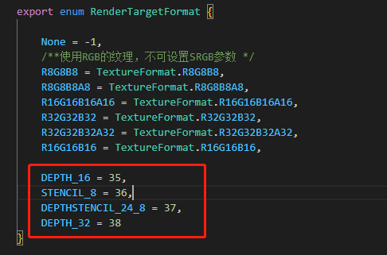
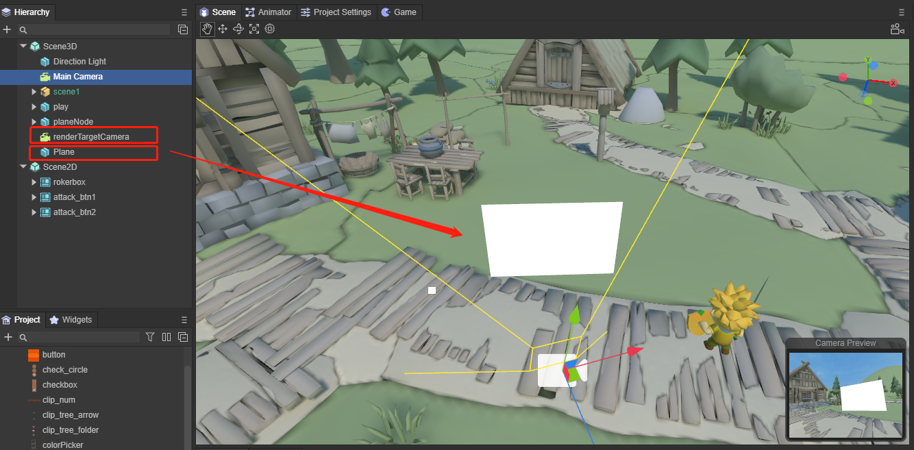

# Article Learn to use a 3D camera

## 1. Overview

We all know that movies present stories and images to the audience through cameras.

The virtual 3D world also requires a virtual camera to present three-dimensional images and plots to users or players. In 3D games, the Camera is equivalent to the eye, through which you see the world, and all scenes are rendered through the Camera. That is to say, if there is no camera in the scene, no objects will be displayed in the game screen. The camera in the scene can also be placed in a child node in the scene, such as being added to the protagonist character model, which can also present a 3D picture.

In the LayaAir engine, we can have one camera or multiple cameras working at the same time, depending on the actual needs of our developers.

In this article, we will learn how to control the LayaAir engine 3D camera and introduce the functions of daily use of the camera.


## 2. Camera in IDE

Let's first understand what the parameters of the camera in a 3D scene are, and refer to it by creating a 3D-RPG project, as shown in Figure 2-1


(Figure 2-1)

When we create a new 3D scene, the engine automatically adds a main camera `Main Camera` under the Scene3D node. Of course, you can also add more cameras. When we select the main camera as shown in Figure 2-1, a `Camera Preview` window will appear in the Scene window to display the field of view seen by the main camera. This is convenient for us to preview when we move or rotate the camera. , the field of view in the preview will change accordingly, and of course other parameter settings will also change, which we will explain in detail later.

As shown in Figure 2-2, the camera in LayaAir has the following parameter settings. These parameters can well meet the needs of the project. The red parameters will be our commonly used settings.


(Figure 2-2)


## 3. Transformation

As shown in Figure 2-2, the parameters in the top red area are the position and rotation of the camera. They are different from objects in other scenes. The position and rotation of the camera are not only their own parameters, but can also affect our Vision changes.

### 3.1 Movement and rotation

Usually we can adjust the position of the camera by moving and rotating under the Scene window, as shown in animation 3-1.


(Animation 3-1)

You can also position the camera in another way, as shown in the animation 3-2. First move the scene in the Scene window, find the position and angle that suits you, click the Main Camera node, and press Ctrl+Shift+F at the same time. The camera's position and angle will change to the point you positioned.


(Animation 3-2)

The above is just adjusting the position of the camera in the editor, probably the initial position of the camera when initializing the scene.


### 3.2 Follow the move

In 3D games, we often need to adjust the camera position through code. For example, the camera always follows the movement and rotation of the protagonist to make adjustments, as shown in animation 3-3.


(Animation 3-3)

It can be handled through code. Add the CameraControll script under the Main Camera node. As the protagonist moves, the position of the camera also moves synchronously. The code is as follows:

```typescript
const { regClass, property } = Laya;

@regClass()
export default class CameraControll extends Laya.Script {
	@property( { type: Laya.Sprite3D } )
	public target: Laya.Sprite3D;
	private camera: Laya.Camera;
	public distanceUp: number = 0.5; //Vertical height parameter between camera and target
	public distanceAway: number = 10; //Horizontal distance parameter between camera and target
	public smooth: number = 2;//Position smooth movement interpolation parameter value
	public camDepthSmooth: number = 20
	public curpos: Laya.Vector3;
	private delatpos: Laya.Vector3;
	constructor() {
    	super();
	}

	/**
 	* Executed after the component is activated. At this time, all nodes and components have been created. This method is only executed once.
 	* This method is a virtual method and can be overridden when used.
 	*/
	onAwake(): void {
    	this.curpos = new Laya.Vector3();
	}

	/**
 	* Executed before executing update for the first time, it will only be executed once
 	* This method is a virtual method and can be overridden when used.
 	*/
	onStart(): void {
    	this.camera = this.owner as Laya.Camera;
    	if (this.target) {
        	this.target.transform.position.cloneTo(this.curpos);
        	this.delatpos = new Laya.Vector3();
    	}
	}

	/**
 	* Executed when each frame is updated, try not to write large loop logic here or use the getComponent method
 	* This method is a virtual method and can be overridden when used.
 	*/
	onUpdate(): void {
    	if (!this.target || !this.camera) return;
    	this.target.transform.position.vsub(this.curpos, this.delatpos);
    	this.camera.transform.position.vadd(this.delatpos, this.delatpos);
    	this.camera.transform.position = this.delatpos;
    	this.target.transform.position.cloneTo(this.curpos);
	}

}
```


## 4. Projection


(Pic 4-1)

There are two options for the projection method of the camera phase effect, namely the default perspective mode and the orthogonal mode Orthographic. In LayaAir IDE, choose which method to use by checking Orthographic.

### 4.1 Perspective perspective mode

When we do not check Orthographic, we use the Perspective method, which is also the most commonly used method. The observation volume of perspective projection is the viewing frustum, which uses a set of radial projection lines generated by the projection center to project three-dimensional objects onto the projection plane. This perspective mode is a camera imaging mode that simulates the human eye's near-large and far-small visual effects, as shown in animation 4-2.


(Animation 4-2)

`Field of view` is the field of view, as you can see from the animation picture 4-2. By modifying Field Of View, you can adjust the field of view range in perspective mode, from 4 to 120 degrees. Field Of View is only available when perspective projection is used. efficient.

The clipping plane is the plane perpendicular to the direction of the camera's field of view. Use the two sub-parameters of the near clipping plane and the far clipping plane to set the camera rendering range. The parts beyond the range will not be rendered and displayed, as if they were cropped.

`Near Plane` is the near clipping plane, which refers to the clipping plane closest to the direction of the camera's field of view. Anything smaller than this distance will not be rendered.

`Far Plane` is a far clipping plane, which refers to the clipping plane farthest from the camera's field of view. Anything larger than this distance will not be rendered.

These two parameters are also only valid when using perspective projection. As shown in the animation 4-3, let’s take a look at the effect of modifying these two parameters.


(Animation 4-3)


### 4.2 Orthographic Orthographic mode

The observation volume in orthogonal projection mode is a regular cuboid, which uses a set of parallel projections to project three-dimensional objects onto the projection plane, as shown in Figure 4-4.


(Figure 4-4)

`Orthographic Vertical Size` is the field of view size, used to set the field of view size in orthogonal mode, as shown in animation 4-5. Orthographic Vertical Size is only effective in Orthogonal mode.


(Animation 4-5)


## 5. Render


(Figure 5-1)

### 5.1 Clear flag

When rendering, each camera will first store the color and depth information, that is, ColorBuffer and DepthBuffer, and then directly read the color and depth information in the buffer in the next frame instead of calculating it in real time. When using multiple cameras, a large amount of rendering data will accumulate since each camera stores its own color and depth information in the buffer.

Therefore, `Clear Flags` (clear flag) can determine whether to clear the buffer information stored before the current rendering. This property function has four options (Sky, SolidColor, DepthOnly, Nothing). The specific buffer information they clear is introduced below. .

-Sky sky box

Skybox is the default option, which means **clear** the **color and depth information** of all camera buffers before the current rendering and use the skybox instead. If no skybox is specified, the default clear color (the color of the Clear Color property) is displayed.

- SolidColor solid color

Indicates **clearing** the **color and depth information** of all camera buffers before the current rendering, using the clear color (the color of the Clear Color attribute) instead, and any empty part on the screen will display the current camera s color.

- Nothing does not clear

Indicates that this option **does not clear** the camera buffer information, and **color and depth information** are all retained. Doing so will cause the results of each frame of rendering to be superimposed on the next frame.

It seems that this option is not necessary. In fact, it is not commonly used, but it is still used in some specific situations, such as using it in conjunction with a custom shader.

- DepthOnly Depth only

It means that **only clear** the **depth information** of all camera buffers before the current rendering, and **retain** the **color information** of all camera buffers.

This function is very practical. If you want to render the images from multiple cameras into the same image, you can use the DepthOnly option.

For example, add a new camera Camera2 to the scene, use DepthOnly for Clear Flag, set the field of view of Camera2 toward the protagonist, and click Run. As you can see, the rendering of the scene remains unchanged, and the skybox is still used, but the main camera is the field of view seen by the protagonist, but the protagonist is also displayed on the screen, which is what Camera2 sees, that is, the depth information is retained. .

> When Clear Flags' DepthOnly is turned on, the LayaAir engine will be controlled by the camera's rendering sequence. The default rendering order is the rendering order of nodes. Developers can also change the rendering order through the renderingOrder of the LayaAir engine camera.

If the Clear Flags of the first camera are set to Skybox, then the Clear Flags of the second camera are set to DepthOnly. At this time, the rendering order of the first camera needs to be before the rendering order of the second camera, as shown in Figure 5-2, Main Camera The node is above the Camera2 node, so the renderings of the two cameras will be merged together.


(Figure 5-2)

If the order is reversed and Camera2 renders first, although only the depth information is cleaned up, the color information is retained. However, the post-rendered Main Camera will clear all the depth and color of the previous buffer, so there is no way to see the merged images.

Multiple cameras can be used in the same scene, and when loaded into the scene, they will produce their own game views. In the games we have encountered before, such as the two-player 3D game, two 3D cameras are used. The left half of the screen displays one player and the right half of the screen displays the other, which greatly enriches the gameplay. However, the disadvantage of multiple cameras is that it consumes a lot of performance. The number of model triangles and the number of DrawCalls will increase exponentially. Several more cameras will cause several times more performance loss, so developers need to consider it appropriately.


### 5.2 High dynamic lighting rendering

High dynamic range image (High-Dynamic Range) is referred to as HDR. HDR can provide more dynamic range and image details than ordinary images, and it can better reflect the visual effects in the real environment.

`Enable HDR` is used to turn on the high dynamic range rendering function of the camera. The default is unchecked, which means HDR is not turned on by default.

Since HDR needs to be based on webGL 2.0, when we release products on some platforms that do not support webGL 2.0, we need to remove this option or turn off the camera's HDR in the engine.


> Turning on HDR will also invalidate the anti-aliasing function of the LayaAir engine. If you need to turn on the anti-aliasing function, you cannot turn on HDR.


### 5.3 Anti-aliasing

`MSAA`: Multisampled anti-aliasing. MSAA first comes from OpenGL. Specifically, MSAA only performs super-sampling anti-aliasing processing on the data in the Z-buffer (Z-Buffer) and the stencil buffer (Stencil Buffer). It can be simply understood as anti-aliasing only the edges of polygons.

`FXAA`: Fast approximate anti-aliasing. The basic principle of FXAA is the same as MSAA, which is to eliminate aliasing caused by high-contrast interfaces by extracting color information around the pixel interface and completing blending. However, FXAA leaves the pixel extraction and mixing process to the ALU in the GPU, so the memory bandwidth it occupies is much lower than traditional MSAA.


### 5.4 Culling Mask

In LayaAir, you can set the corresponding Layer for each node. If not set, it will be the default Default layer. As shown in Figure 5-3, it is the protagonist node, which uses the Default layer by default.


(Figure 5-3)

`Culling Mask` is a setting for layer rendering culling, usually used in conjunction with DepthOnly.

For example, if the Cube node is set to an independent cube layer and the Culling Mask selects the cube layer, then during rendering, other node objects of the camera will be eliminated, just like the mask effect, only the node objects on the cube layer will be retained. In this way, when the cameras are merged and displayed, only the node objects on the retained layer will be merged. As shown in Figure 5-4,


(Figure 5-4)

> When setting the Culling Mask in the code, you can specify a single layer or mix multiple layers, for example:
>
> xx.cullingMask=Math.pow(2,0)|Math.pow(2,1); //This code represents the rendering display of layer 0 and layer 1.


## 6. Output


(Figure 6-1)

### 6.1 View rectangle

The view rectangle is a function that controls the position and size of the camera's view on the screen through the four values ​​`X\Y\W\H`. These four values ​​all use the screen coordinate system. The value range is 0~1, and decimals can be set.

The specific parameter description is:

- X: starting point of horizontal position
- Y: vertical position starting point
- W: Width
- H: height

It should be noted that in LayaAir, it represents the position of the upper left corner of the screen (0,0). As shown in Figure 6-2,


(Figure 6-2)

If we set the starting point of the horizontal position of the screen


(Figure 6-3)


### 6.2 Depth map

`Depth Texture Mode`: Depth texture mode.

- `None`: Do not generate depth map.
- `Depth`: Generate depth map. This mode causes the depth texture generated by the camera to only carry depth information. The depth texture contains the distance (depth value) of each pixel relative to the camera.
- `DepthNormals`: Generate depth + normal map. In this mode, the depth texture generated by the camera not only carries depth information, but also contains normal information of the object surface.
- `DepthAndDepthNormals`: This mode is a combination of Depth and DepthNormals. In this mode, the camera will generate a texture containing both depth information and depth normal information. This type of depth texture stores not only the depth value (distance from the camera) of each pixel, but also the normal information.

`Depth Texture Format`: The default value of camera depth format and depth texture is DEPTH_16. With the widespread use of depth, some developers will find that 16-bit depth is no longer enough. Now 24-bit and 32-bit depth modes have been added. value. Used to set the **depthTextureFormat** property.



(Figure 6-4)


### 6.3 Target texture

The target texture refers to the **RenderTarget** property of the camera. It places the camera's view on a texture that can be applied to another object. This makes it easy to create effects such as mirrors and surveillance cameras. Note that cameras using this property will disable rendering to the screen.

> Related functions include [Rendering Texture](../../IDE/uiEditor/use3D/readme.md).


### 6.4 Others

`Opaque Pass`: After turning on opaquePass, non-transparent object maps will be generated. u_cameraOpaqueTexture can be introduced in Shader to obtain non-transparent pictures of the camera rendering pipeline. Using the non-transparent object mapping function, you can achieve effects such as glass refraction, water surface refraction, and heat waves.

`Enable Blit Depth`: Set whether to use the built-in depth map (if turned on, the depth map can only be used in post-production, not in the rendering process).


## 7. Using the camera through code

### 7.1 How to create a ray from a camera

Create a ray from the camera using the camera's **viewportPointToRay** method. The generated ray starts from a point on the near clipping plane of the camera and goes to a point on the far clipping plane. The reverse extension of this ray passes through the camera's origin.

```typescript
	/**
 	* Computes rays generated from screen space.
 	* @param point The position of screen space.
 	* @param out Output ray.
 	*/
	viewportPointToRay(point: Vector2, out: Ray): void {
    	this._rayViewport.x = this.viewport.x;
    	this._rayViewport.y = this.viewport.y;
    	this._rayViewport.width = ILaya.stage._width;
    	this._rayViewport.height = ILaya.stage._height;
    	Picker.calculateCursorRay(point, this._rayViewport, this._projectionMatrix, this.viewMatrix, null, out);
	}
```

Referring to the 3D-RPG project, we add a piece of code. When the mouse clicks on the screen, a ray will be emitted. The point where this ray hits will create a cube. The code and effect are as follows:

```typescript
    //In the onStart() method under the CameraControll.ts class, add mouse press monitoring
    //Laya.stage.on(Laya.Event.MOUSE_DOWN,this, this.onMouseDown);
    
    
    //Mouse click event, processing emitted rays, detecting collision objects
    onMouseDown(e: Laya.Event) {

    	let point = new Laya.Vector2();
   	 point.x = Laya.stage.mouseX;
    	point.y = Laya.stage.mouseY;
   	 //generate ray
    	let ray = new Laya.Ray(new Laya.Vector3(0, 0, 0), new Laya.Vector3(0, 0, 0));
   	 this.camera.viewportPointToRay(point,ray);
   	 //Get the object that the ray collides with
    	let outs : any[] = [];
   	 this.scene.physicsSimulation.rayCastAll(ray,outs);
   	 //If it collides with an object
   	 if (outs.length !== 0)
   	 {
   		 for (let i = 0; i <  outs.length; i++){
   			 //Add a cube where the ray hits
            	let box = new Laya.MeshSprite3D(Laya.PrimitiveMesh.createBox(1, 1, 1));
            	box.transform.position = new Laya.Vector3(outs[i].point.x, outs[i].point.y, outs[i].point.z);
            	this.scene.addChild(box);
        	}
   	 
   	 }
    }
```


(Animation 7-1)


### 7.2 Visible mask layer

The use of Culling Mask was also mentioned in Section 5.4 earlier. When we make games, we can also use code to achieve the "invisibility" effect.

Still using the 3D-RPG project as an example, we first set up two Layers.


(Figure 7-2)

Then change the Layers of these two rooms to Building1 and Building2, as shown in Figures 7-3 and 7-4.


(Figure 7-3)


(Figure 7-4)

We add the following code to the CameraControll.ts class:

```typescript
    private layerIndex: number = 0;
    onMouseDown(e: Laya.Event)
	{
    	//Clear all layers
    	this.camera.removeAllLayers();
    	this.layerIndex++;
    	//Set the visual layer
    	this.camera.addLayer(this.layerIndex%2+ 1);
    }
```

The effect is shown in the animation 7-5.


(Animation 7-5)


### 7.3 Capture target

When creating a camera, we often need to adjust the position of the camera to align and display a certain three-dimensional object or display a certain area. For beginners, spatial thinking has not yet formed a habit, and it will take a lot of time to adjust the position. LayaAir's 3D transformation provides a lookAt() method for capturing the target and automatically adjusting the 3D object to the target point. The camera can also use it to achieve our purpose of adjusting the viewing angle.

```typescript
    /**
     * Observe the target location.
     * @param target Observation target.
     * @param up up vector.
     * @param isLocal Whether it is local space.
     */
    lookAt(target: Vector3, up: Vector3, isLocal: boolean = false, isCamera: boolean = true): void
```

Similarly, in our 3D-RPG project, we switch the visible area by clicking the mouse. The code is as follows:

```typescript
	//In the CameraControll.ts class script, add 3 node objects and drag 3 different houses and buildings into the properties.
	@property( { type: Laya.Sprite3D } )
	public target1: Laya.Sprite3D;
	@property({ type: Laya.Sprite3D })
	public target2: Laya.Sprite3D;
	@property({ type: Laya.Sprite3D })
	public target3: Laya.Sprite3D;   
	private _up = new Laya.Vector3(0, 1, 0);    
```

```typescript
    private index: number = 0;
    //Similarly, add mouse events to modify the camera's orientation to the three buildings
    onMouseDown(e: Laya.Event)
	{
    	this.index++;
    	if (this.index % 3 === 1 ){
        	//Camera captures model target
        	this.camera.transform.lookAt(this.target1.transform.position, this._up);
    	}
    	else if (this.index % 3 === 2){
        	//Camera captures model target
        	this.camera.transform.lookAt(this.target2.transform.position, this._up);
    	}
    	else{
        	//The camera captures the model target
        	this.camera.transform.lookAt(this.target3.transform.position,this._up);
    	}
    }
```

The effect is as follows:


(Animation 7-6)


### 7.4 aspect ratio

We generally do not set the aspect ratio of the screen manually. The aspect ratio is automatically set through calculation during operation. However, in some special cases when you need to manually set the aspect ratio, you can set it manually. If you need to reset the aspect ratio and go back to automatically changing the aspect ratio, just set this value to 0.

```typescript
//Manually set aspect ratio
camera.aspectRatio = 2;
```

```typescript
//reset
camera.aspectRatio = 0;
```


### 7.5 Target Texture

We still use the 3D-RPG project as an example. Main Camera is the main rendering camera of the scene, and a new renderTargetCamera is added as the camera with the RenderTarget attribute turned on. At the same time, add a Plane to the scene, facing the main camera, as shown in Figure 7-7.



(Figure 7-7)

Next, we add Plane and renderTargetCamera to the CameraControll.ts script,

```typescript
	@property({ type: Laya.Camera })
	public renderTargetCamera: Laya.Camera;
	@property({ type: Laya.Sprite3D })
	public plane: Laya.Sprite3D;
```

And add code in onStart():

```typescript
    	//Select the rendering target as texture
    	this.renderTargetCamera.renderTarget = Laya.RenderTexture.createFromPool(512, 512, Laya.RenderTargetFormat.R8G8B8A8, Laya.RenderTargetFormat.DEPTH_16, false, 1);
    	//Rendering order
    	this.renderTargetCamera.renderingOrder = -1;
    	//Clear mark
    	this.renderTargetCamera.clearFlag = Laya.CameraClearFlags.Sky;
    	//Create an UnlitMaterial material
    	var mat1: Laya.UnlitMaterial = new Laya.UnlitMaterial();
   	 mat1.albedoColor = new Laya.Color(1.0, 1.0, 1.0, 1.0);
   	 mat1.cull = Laya.RenderState.CULL_NONE;
    	//Specify the plane's material as the created material
   	 this.plane.getComponent(Laya.MeshRenderer).sharedMaterial = mat1;
    	//Specify the texture as the render target of the camera
    	mat1.albedoTexture = this.renderTargetCamera.renderTarget;
```

> In the LayaAir engine, the smaller the rendering order renderingOrder is, the higher the rendering priority is.

The running effect is shown in the animation 7-8. There is an additional camera view in the scene and is placed on the Plane as a texture.


(Animation 7-8)


