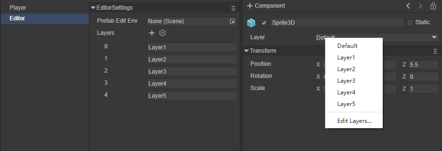
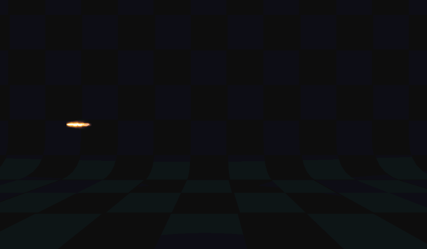

# Use 3D sprite (Sprite3D)

## 1. Overview

Sprite3D is the basic node object of 3D, just like Sprite is the basic node object of 2D. It is the parent class of all 3D nodes in LayaAir3D. It contains many basic functional attributes of 3D sprites. In addition, it is also the container of all 3D components and scripts. .

In the LayaAir 3.0 editor, we can create a Sprite3D by right-clicking the mouse, as shown in animation 1-1


(Animation 1-1)

The created Sprite3D will have an empty node under Scene3D in the editor scene, as shown in Figure 1-2


(Figure 1-2)

Basically, the most important purpose of creating a Sprite3D empty node is to serve as a root node. There will be many root nodes with different functions in a project for our management. In addition, you can also use Sprite3D to add components. Below we will introduce the use of Sprite3D in detail.


## 2. Properties and functions


(Figure 2-1)

In Figure 2-1, you can see what attributes Sprite3D, as the most basic 3D node, has. Other richer 3D nodes have these attributes.


### 2.1 Node name


(Figure 2-2)

In Figure 2-2, any node has a name. You can easily find out whether there is a child node with a certain name under a node by using the name. The following method is usually called to get the child node: getChildByName("xxx")

```typescript
	/**
 	* Get the child node object based on the name of the child node.
 	* @param name The name of the child node.
 	* @return node object.
 	*/
	getChildByName(name: string): Node {
    	for (let child of this._children) {
        	if (child && child.name === name)
            	return child;
    	}
    	return null;
	}
```

When we find the child node, we can also do some basic operations on the node, such as deleting its own method removeSelf()

```typescript
	/**
 	* Delete itself from the parent container. If it has been deleted, no exception will be thrown.
 	* @return current node (Node) object.
 	*/
	removeSelf(): Node {
    	this._parent && this._parent.removeChild(this);
    	return this;
	}
```

For specific basic methods of a Sprite3D, you can refer to [Basic properties of Node nodes] (../../basics/common/Node/readme.md).


### 2.2 Whether to activate


(Figure 2-3)

In Figure 2-3, any node can be activated in the scene by checking whether it is activated. When a node is not activated, all the following child nodes will also be inactivated along with the root node. Of course we can also control it through code

```typescript
	/**
 	* Get whether it is activated.
 	* @return Whether it is activated.
 	*/
	get active(): boolean
    
	/**
 	* Set whether to activate.
 	* @param value whether to activate.
 	*/
	set active(value: boolean)
```


### 2.3 Whether it is static


(Figure 2-4)

As shown in Figure 2-4, whether it is static. In the game scene, each Sprite3D has two states: static or dynamic. When an object is marked as static, it ensures that the object is a static and non-moving object in the game scene, and then during the running process of the game Let the game have a smoother running experience. Generally speaking, it is better to mark objects that are completely stationary in the scene as static. This static means that no movement, scaling, rotation, etc. occurs during the running of the game. Generally, the nodes used for baking are marked as static.

Marking static is often done to improve efficiency. For example, collision detection of static objects is faster. At the same time, multiple static objects using the same material only use one drawcall when drawing, thus saving CPU. In terms of lighting calculation, static objects are also faster.

In addition, when Static is checked, the editor will ask whether to change the static flags of all sub-objects at the same time, as shown in Figure 2-5


(Figure 2-5)

Of course, you can also use code to control

```typescript
	/**
 	* Whether it is static.
 	*/
	get isStatic(): boolean

	/**
 	* Whether to set it to static.
 	*/
	set isStatic(value: boolean)
```


### 2.4 Mask layer


(Figure 2-6)

In Figure 2-6, it is the layer `Layer` where the sprite is located. The rendering camera can control the visible mask layer and control whether the sprite is rendered or not. You can refer to the camera documentation. There are examples of the camera selecting different mask layers after setting different object mask layers. As shown in animation 2-7


(Animation 2-7)

As shown in Figure 2-8, by clicking Layer, you can select Default, Layer1, etc. that have been customized by the editor, or you can edit the Layer layer again.



(Figure 2-8)

It can also be set through code

```typescript
	/**
 	* Mask layer.
 	*/
	get layer(): number

	set layer(value: number)
    
	//Add a display layer (add a mask for the camera)
    this.camera.addLayer(5);
```


### 2.5 Transformation

Transform components determine the position, rotation, and scale of each sprite in the scene. At the same time, it has the same relationship between child and parent nodes as the Node node, making the transformation operation more flexible. Each sprite has a `Transform3D`.


(Figure 2-9)

We can also manually adjust the transformation of the sprite in the editor


(Figure 2-10)


(Figure 2-11)

Figure 2-10 is used to adjust the rotation of the sprite, and Figure 2-11 is used to adjust the scaling of the sprite.


(Figure 2-12)

Figure 2-12 can be used to adjust the position, rotation and scaling of the sprite at the same time.

Transform through code

```typescript
//Translation
this.position1.setValue(-1.5, 0, 0.0);
this.sprite3d.translate(this.position1);
//Rotate
this.rotate1.setValue(0, 60, 0);
this.sprite3d.rotate(this.rotate1, false, false);
//Zoom
var scale = this.sprite3d.localScale;
scale.setValue(0.1, 0.1, 0.1);
this.sprite3d.localScale = scale;
```


## 3. Child-parent relationship

Sprite3D inherits from Node node and is the parent class of all 3D objects in LayaAir3D. With some examples, we can understand the child-parent relationship.


(Animation 3-1)

By clicking the button, the parent node moves and you can see that the child nodes also move accordingly.

```typescript
this.layaMonkeyParent.transform.translate(new Laya.Vector3(-0.2, 0, 0);
```

 

 (Animation 3-2)

By clicking the button to move the child node, you can see that the parent node has not moved.

```typescript
this.layaMonkeySon.transform.translate(new Laya.Vector3(-0.2, 0, 0);
```


## 4. Clone

Regarding cloning, several interfaces are provided in LayaAir3D. The more commonly used method is the `clone` method

```typescript
	/**
 	* clone.
 	* @return Clone copy.
 	*/
	clone(): Node {
    	var dstSprite3D: Node = Sprite3D._createSprite3DInstance(this);
    	Sprite3D._parseSprite3DInstance(this, dstSprite3D, this, dstSprite3D);
    	return dstSprite3D;
	}
```


(Animation 4-1)

Clone a monkey through code

```typescript
//Clone a monkey
let sp = this.layaMonkeyParent.clone() as Laya.Sprite3D;
//Set the coordinates of the cloned monkey
sp.transform.position = new Laya.Vector3(1,0,0);
//Add to scene
this.scene.addChild(sp);
```

Secondly, here is a detailed explanation of the unique cloning interface `instantiate` in Sprite3D.

```typescript
	/**
 	* Create a clone instance of the sprite.
 	* @param original The original sprite.
 	* @param   parent	parent node.
 	* @param worldPositionStays Whether to maintain its own world transformation.
 	* @param position world position, effective when worldPositionStays is false.
 	* @param rotation World rotation, effective when worldPositionStays is false.
 	* @return Clone instance.
 	*/
	static instantiate(original: Sprite3D, parent: Node = null, worldPositionStays: boolean = true, position: Vector3 = null, rotation: Quaternion = null): Sprite3D {
    	var destSprite3D: Sprite3D = (<Sprite3D>original.clone());
    	(parent) && (parent.addChild(destSprite3D));
    	var transform: Transform3D = destSprite3D.transform;
    	if (worldPositionStays) {
        	var worldMatrix: Matrix4x4 = transform.worldMatrix;
        	original.transform.worldMatrix.cloneTo(worldMatrix);
        	transform.worldMatrix = worldMatrix;
    	} else {
        	(position) && (transform.position = position);
        	(rotation) && (transform.rotation = rotation);
    	}
    	return destSprite3D;
	}
```

- original: original sprite.

- parent: parent node.

- worldPositionStays: Whether to maintain its own world transformation.

- position: world position, effective when worldPositionStays is false.

- rotation: world rotation, effective when worldPositionStays is false.

This method can carry parent node information, world position information and world rotation information when cloning.


(Animation 4-2)

Instantiate a monkey through code

```typescript
//sprite3d instantiate cloning method
let layaMonkey_clone1 = Laya.Sprite3D.instantiate(this.layaMonkeyParent, this.scene, false, new Laya.Vector3(-2, 0, 0), new Laya.Quaternion(0, -90, 0));
this.scene.addChild(layaMonkey_clone1);
```


## 5. Add components

In LayaAir, you can add the `Component` component to any 3D object, as shown in animation 5-1


(Animation 5-1)

`Component` Component is the base class for content attached to all 3D objects.

Components can also be added through code, and the object needs to use the `addComponent` method.

```typescript
//Add Rigidbody3D component
let rigidBody = this.layaMonkeyParent.addComponent(Laya.Rigidbody3D) as Laya.Rigidbody3D;
//Create a box shape collider
var boxShape = new Laya.BoxColliderShape(1, 1, 1);
//Set the collision shape of the box
rigidBody.colliderShape = boxShape;
//use gravity
rigidBody.overrideGravity = true;
//Gravity is downward -10
rigidBody.gravity = new Laya.Vector3(0,-10,0);
```


(Animation 5-2)

As shown in Figure 5-2, add the `Rigidbody3D` component and set the effect of gravity (you need to check the physics-related "Engine Module" in the "Project Settings").


## 6. Add script

In the development of the 3D world, the script class will be used in many places. Add a script to Sprite3D. As shown in animation 6-1.


(Animation 6-1)

We can add a script to the Main Camera to control the camera through the mouse and keyboard. This script is very practical in the actual development process. In Figure 6-2, this script is added to the display camera.


(Figure 6-2)

The code of the script is:

```typescript
const { regClass, property } = Laya;

@regClass()
export class CameraMoveScript extends Laya.Script3D {

    /** @private */
    protected _tempVector3: Laya.Vector3 = new Laya.Vector3();
    protected lastMouseX: number = 0;
    protected lastMouseY: number = 0;
    protected yawPitchRoll: Laya.Vector3 = new Laya.Vector3();
    protected resultRotation: Laya.Quaternion = new Laya.Quaternion();
    protected tempRotationZ: Laya.Quaternion = new Laya.Quaternion();
    protected tempRotationX: Laya.Quaternion = new Laya.Quaternion();
    protected tempRotationY: Laya.Quaternion = new Laya.Quaternion();
    protected isMouseDown: boolean = false;
    protected rotaionSpeed: number = 0.00006;
    protected camera: Laya.BaseCamera = new Laya.Camera;
    protected scene: Laya.Scene3D = new Laya.Scene3D;

    speed: number = 0.01;

    constructor() {
   	 super();
    }

    /**
     * @private
     */
    protected _updateRotation(): void {
   	 if (Math.abs(this.yawPitchRoll.y) < 1.50) {
   		 Laya.Quaternion.createFromYawPitchRoll(this.yawPitchRoll.x, this.yawPitchRoll.y, this.yawPitchRoll.z, this.tempRotationZ);
   		 this.tempRotationZ.cloneTo(this.camera.transform.localRotation);
   		 this.camera.transform.localRotation = this.camera.transform.localRotation;
   	 }
    }

    /**
     * Listen to mouse events
     */
    onAwake(): void {
   	 Laya.stage.on(Laya.Event.MOUSE_DOWN, this, this.mouseDown);
   	 Laya.stage.on(Laya.Event.MOUSE_UP, this, this.mouseUp);
   	 this.camera = (<Laya.Camera>this.owner);
    }

    /**
     * Monitor keyboard events
     */
    onUpdate(): void {
   	 var elapsedTime: number = Laya.timer.delta;
   	 if (!isNaN(this.lastMouseX) && !isNaN(this.lastMouseY) && this.isMouseDown) {
   		 Laya.InputManager.hasKeyDown(87) && this.moveForward(-this.speed * elapsedTime);//W
   		 Laya.InputManager.hasKeyDown(83) && this.moveForward(this.speed * elapsedTime);//S
   		 Laya.InputManager.hasKeyDown(65) && this.moveRight(-this.speed * elapsedTime);//A
   		 Laya.InputManager.hasKeyDown(68) && this.moveRight(this.speed * elapsedTime);//D
   		 Laya.InputManager.hasKeyDown(81) && this.moveVertical(this.speed * elapsedTime);//Q
   		 Laya.InputManager.hasKeyDown(69) && this.moveVertical(-this.speed * elapsedTime);//E

   		 var offsetX: number = Laya.stage.mouseX - this.lastMouseX;
   		 var offsetY: number = Laya.stage.mouseY - this.lastMouseY;

   		 var yprElem: Laya.Vector3 = this.yawPitchRoll;
   		 yprElem.x -= offsetX * this.rotaionSpeed * elapsedTime;
   		 yprElem.y -= offsetY * this.rotaionSpeed * elapsedTime;
   		 this._updateRotation();
   	 }
   	 this.lastMouseX = Laya.stage.mouseX;
   	 this.lastMouseY = Laya.stage.mouseY;
    }

    /**
     * Release monitoring
     */
    onDestroy(): void {
   	 Laya.stage.off(Laya.Event.MOUSE_DOWN, this, this.mouseDown);
   	 Laya.stage.off(Laya.Event.MOUSE_UP, this, this.mouseUp);
    }

    protected mouseDown(e: Laya.Event): void {
   	 this.camera.transform.localRotation.getYawPitchRoll(this.yawPitchRoll);
   	 this.lastMouseX = Laya.stage.mouseX;
   	 this.lastMouseY = Laya.stage.mouseY;
   	 this.isMouseDown = true;
    }

    protected mouseUp(e: Laya.Event): void {
   	 this.isMouseDown = false;
    }

    protected mouseOut(e: Laya.Event): void {
   	 this.isMouseDown = false;
    }

    /**
     * Move forward.
     * @param distance moving distance.
     */
    moveForward(distance: number): void {
   	 this._tempVector3.x = this._tempVector3.y = 0;
   	 this._tempVector3.z = distance;
   	 this.camera.transform.translate(this._tempVector3);
    }

    /**
     * move to the right.
     * @param distance moving distance.
     */
    moveRight(distance: number): void {
   	 this._tempVector3.y = this._tempVector3.z = 0;
   	 this._tempVector3.x = distance;
   	 this.camera.transform.translate(this._tempVector3);
    }

    /**
     * Move up.
     * @param distance moving distance.
     */
    moveVertical(distance: number): void {
   	 this._tempVector3.x = this._tempVector3.z = 0;
   	 this._tempVector3.y = distance;
   	 this.camera.transform.translate(this._tempVector3, false);
    }

}

```

The runtime effect is shown in Figure 6-3.


(Animation 6-3)


## 7. Introduction to various rendering sprites

### 7.1 MeshSprite3D sprite

`MeshSprite3D` is the most commonly used **static mesh sprite** in the engine, which can render models based on pre-made or customized mesh data in art software. For example, the various building models and mountain rocks in the scene in Figure 7-1 are generally `MeshSprite3D`


(Figure 7-1)

Usually we create simple Mesh grid 3D objects in practice, as shown in Figure 7-2


(Figure 7-2)

These Mesh grids can also be added through code

```typescript
//cube
var box = new Laya.MeshSprite3D(Laya.PrimitiveMesh.createBox(0.5, 0.5, 0.5));
this.scene.addChild(box);
box.transform.position = new Laya.Vector3(2.0, 0.25, 0.6);
box.transform.rotate(new Laya.Vector3(0, 45, 0), false, false);

//sphere
var sphere = new Laya.MeshSprite3D(Laya.PrimitiveMesh.createSphere(0.25, 20, 20));
this.scene.addChild(sphere);
sphere.transform.position = new Laya.Vector3(1.0, 0.25, 0.6);

//Cylinder
var cylinder = new Laya.MeshSprite3D(Laya.PrimitiveMesh.createCylinder(0.25, 1, 20));
this.scene.addChild(cylinder);
cylinder.transform.position = new Laya.Vector3(0, 0.5, 0.6);

//capsule body
var capsule = new Laya.MeshSprite3D(Laya.PrimitiveMesh.createCapsule(0.25, 1, 10, 20));
this.scene.addChild(capsule);
capsule.transform.position = new Laya.Vector3(-1.0, 0.5, 0.6);

//Cone
var cone = new Laya.MeshSprite3D(Laya.PrimitiveMesh.createCone(0.25, 0.75));
this.scene.addChild(cone);
cone.transform.position = new Laya.Vector3(-2.0, 0.375, 0.6);

//flat
var plane = new Laya.MeshSprite3D(Laya.PrimitiveMesh.createPlane(6, 6, 10, 10));
this.scene.addChild(plane);
```


### 7.2 SkinnedMeshSprite3D sprite

`SkinnedMeshSprite3D` is the **Skinned Animation Mesh Sprite** in the engine, which can generate motion deformations based on the mesh data pre-produced by the art software and the animation data of the Animator component. Commonly used for characters, monsters, etc. with skin animation. Compared with `MeshSprite3D`, it has the ability to generate mesh deformation.


(Figure 7-3)


### 7.3 Particle3D sprite

`Particle3D` is the 3D **particle wizard** in the engine, which can produce wonderful and cool particle effects based on the particle parameters edited by artists. Generally used for various character skill special effects or scene special effects such as flames and smoke.


(Animation 7-4)

 

### 7.4 PixelLine sprite

 `PixelLine` is the **pixel line wizard** in the engine, which can generate pixel lines of any color based on the drawing data of the script. Generally used for guidance effects in scenes or project debugging data.


(Figure 7-5)


### 7.5 Trail sprite

`Trail` is the **tailing sprite** in the engine, which can produce dynamic trailing effects based on the movement trajectory of the sprite. Generally used to display various trajectory trailing effects.



(Animation 7-6)


 


