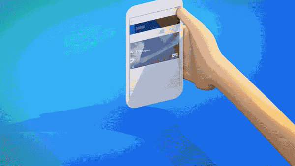

# WebXR usage instructions


## 1. Introduction to WebXR

WebXR is a set of standards that support rendering 3D scenes to present a virtual world (virtual reality, also known as VR) or to add graphics images to the real world (augmented reality, also known as AR). The WebXR Device API implements the core of the WebXR feature set, managing the selection of an output device, rendering a 3D scene to the selected device at the appropriate frame rate, and managing motion vectors created using input controllers.

At the engine level, the scene is rendered in 3D by calculating the perspective applied to the scene to render the scene from each user's perspective, taking into account the conventional distance between eyes, and then rendering the scene twice, once for each eye . The resulting image (the scene is rendered twice on one frame, half for each eye) is then displayed to the user. As shown in Figure 1.


(figure 1)


## 2. Current status and prospects of WebXR

We can understand XR as the collective name for VR and AR. Whether it is VR equipment for pure virtual world immersion experience or AR equipment for enhanced display experience in the real world, they have begun to enter people's lives, and the number of people buying equipment continues to increase. This is just like the early state of smartphones. As the devices become lighter and lighter, the wearing experience becomes more and more friendly, and I believe their popularity will become wider and wider.

Of course, we must also recognize the current XR devices. If the popularity is to reach the scale of smartphones, there are still many hard targets to be achieved. For example, in order to restore the visual experience of the real world, the field of view (FOV) of the VR device must be considered. The horizontal angle that a person's single eye can see without obstruction is about 150°, and the vertical angle is about 120°. If we want to achieve a retina-level high-definition display with a FOV experience close to this, then we need 8K for one eye and a visual display size of 16K for both eyes. This pressure on the transmission bandwidth and hardware performance of the web side cannot be solved in the short term. Even if millisecond-level eye tracking technology is used, it still needs to reach a physical resolution of 4K for one eye and 8K for both eyes. Taking into account the popularity of 5G and the improvement of hardware performance, the carrying and wearing experience of the product, etc. It will take at least a few years before you can barely reach the basic threshold of the national level.

Although it cannot reach the level of universal application at present and in the near future, VR's hardware configuration, wearing experience, platform content quality and other ecology are obviously getting better, so the number of users is also growing. Coupled with the waves of popularity of the concept of the Metaverse in 2021, the capital market is more optimistic about the future prospects of this immersive experience. Therefore, the era of 2D display (without a sense of real space) will sooner or later transition to the era of immersive 3D display. Understanding and deploying XR in advance and taking the lead in entering the blue ocean field is an opportunity that cannot be missed.

The LayaAir engine started to support the WebXR standard in version 2.13 and can run directly in the browsers of mainstream VR devices or in the mobile Chrome browser that supports the WebXR standard.


## 3. LayaAir engine WebXR application

#### 3.1 Display on mobile phone

##### 3.1.1 Mobile browser supporting webXR

When running on a mobile phone, a VR box that can clamp the mobile phone can meet the needs of VR display. As shown in animation 2.



(Animation 2)

Since the current browsers on mobile phones are not friendly to webXR support, the currently known WebXR browser environments are only Chrome Android 79 or above and Samsung Internet 11.2 or above. And you also need to go over the wall to download the services necessary for webXR to run. In terms of interactive operation, there is currently no very mature supporting equipment. Therefore, in addition to watching movies, VR on mobile phones is not suitable for the application scenarios of our current ordinary mobile phones for interactive games. Unless it is for demonstration needs such as 3D exhibition halls without interaction, we do not VR development based on mobile phones is not recommended.


##### 3.1.2 Prepare webXR running environment

The hardware device when this document was written was the OPPO iQOO model, and the browser environment used was Chrome 96.

You also need to download and install the Google Play app store through the VPN of Hong Kong, China. Then search and install Google Play Services For AR and Google VR services in the app store.

> The running environment does not need to be exactly the same as this article. It is enough to install the Google Play app store and the latest version of the Chrome browser (Android).

After completing the above preparations, links based on the webXR standard can be displayed normally.


##### 3.1.3 How to use LayaAir to develop webXR standard products

Regarding the display of webXR, the official webXR website already has all the sample codes. The main processes are described here. You can also go to the official website examples to view the complete sample source code.

First of all, scene loading, camera control, script addition, UI, etc. are no different from writing ordinary 3D games (so I won’t introduce this part).

Before starting VR mode,

Usually developers need to determine whether the current environment supports the VR mode of webXR, and then decide whether to activate the VR mode or activate the UI button to activate the VR mode.

The API to support VR is: `WebXRExperienceHelper.supportXR("immersive-vr")`

```
//Determine whether the browser supports VR mode. There are three modes: immersive-vr\immersive-ar\inline
this.changeActionButton.visible = await WebXRExperienceHelper.supportXR("immersive-vr");
```

immersive-vr is the parameter of VR mode. If it is AR mode, the parameter can be changed to immersive-ar. This document only introduces VR mode.

If it is detected that the VR environment is supported, you can enter VR mode directly, or activate the UI button to enter VR mode and enter VR mode by listening for clicks on the button.

```typescript
/** Initialize XR */
async initXR(){
  //Create a webXR camera
  let caInfo : WebXRCameraInfo = new WebXRCameraInfo();
  //Set the far cutting plane
  caInfo.depthFar = this.camera.farPlane;
  //Set the near cutting plane
  caInfo.depthNear = this.camera.nearPlane;
  //Apply for XR interaction and pass in the information needed for VR
  let webXRSessionManager = await WebXRExperienceHelper.enterXRAsync("imersive-vr","local",caInfo);
  //Set up WebXR camera
  WebXRExperienceHelper.setWebXRCamera(this.camera, webXRSessionManager);
}
```

Through the above code, the VR display can be completed.


#### 3.2 Display and interaction in Oculus

##### 3.2.1 Code part

Whether it is a mobile browser or an Oculus VR device, since they are all based on the WebXR standard, the developer's code process is the same no matter where it is displayed.

However, compared to mobile browsers, dedicated VR headsets such as Oculus are not only a natural webXR environment (no need to install additional XR services), but are also very user-friendly in terms of interactive operations. This is also our recommended VR development and experience. environment.

Therefore, in this section, we will no longer introduce the VR display part, but directly introduce the interactive part.

```typescript
/** Initialize XR */
async initXR(){
  //Create a webXR camera
  let caInfo : WebXRCameraInfo = new WebXRCameraInfo();
  //Set the far cutting plane
  caInfo.depthFar = this.camera.farPlane;
  //Set the near cutting plane
  caInfo.depthNear = this.camera.nearPlane;
  //Apply for XR interaction and pass in the information needed for VR
  let webXRSessionManager = await WebXRExperienceHelper.enterXRAsync("imersive-vr","local",caInfo);
  //Set up WebXR camera
  let webXRCameraManager = WebXRExperienceHelper.setWebXRCamera(this.camera, webXRSessionManager);
  //Note, here begins the control interaction for VR entry handle input
  let webXRInput = WebXEExperienceHelper.setWebXRInput(webXRSessionManager, webXRCameraManager);
  this.bindMeshRender(webXRInput);
}
bindMeshRender(webXRInput:WebXRInputManager){
    	let rightControl = Laya.loader.getRes("res/OculusController/controller.gltf") as Sprite3D;
    	let leftControl = Laya.loader.getRes("res/OculusController/controller-left.gltf") as Sprite3D;
    	let pixelright = new PixelLineSprite3D(20,"right");
    	let pixelleft = new PixelLineSprite3D(20,"left");
    	this.scene.addChild(rightControl);
    	this.scene.addChild(leftControl);
    	this.scene.addChild(pixelright);
    	this.scene.addChild(pixelleft);
    	webXRInput.bindMeshNode(leftControl,WebXRInput.HANDNESS_LEFT);
    	webXRInput.bindMeshNode(rightControl,WebXRInput.HANDNESS_RIGHT);
    	webXRInput.bindRayNode(pixelleft,WebXRInput.HANDNESS_LEFT);
    	webXRInput.bindRayNode(pixelright,WebXRInput.HANDNESS_RIGHT);
    	//Get the frame loop scheme of xrInput
    	webXRInput.getController(WebXRInput.HANDNESS_RIGHT).on(WebXRInput.EVENT_FRAMEUPDATA_WEBXRINPUT,this,this.getRightInput);
    	webXRInput.getController(WebXRInput.HANDNESS_LEFT).on(WebXRInput.EVENT_FRAMEUPDATA_WEBXRINPUT,this,this.getLeftInput);
    	/**
     	* 0		trigger
     	* 1		side trigger
     	* 3 	Joystick pressed
     	* 4		X, A key
     	* 5		Y, B key
     	*/
    	//Left controller listening
    	let leftXRInput = webXRInput.getController(WebXRInput.HANDNESS_LEFT);
    	//Button event listening of the left controller
    	leftXRInput.addButtonEvent(0,ButtonGamepad.EVENT_TOUCH_OUT,this,this.LeftbuttonEvent0);
    	// Pay attention to different triggers of the same button
    	leftXRInput.addButtonEvent(1,ButtonGamepad.EVENT_TOUCH_STAY,this,this.LeftbuttonEvent1);
    	leftXRInput.addButtonEvent(1,ButtonGamepad.EVENT_TOUCH_OUT,this,this.LeftbuttonEvent1_1);
    	leftXRInput.addButtonEvent(3,ButtonGamepad.EVENT_TOUCH_OUT,this,this.LeftbuttonEvent3);
    	leftXRInput.addButtonEvent(4,ButtonGamepad.EVENT_TOUCH_ENTER,this,this.LeftbuttonEvent4);
    	leftXRInput.addButtonEvent(5,ButtonGamepad.EVENT_TOUCH_OUT,this,this.LeftbuttonEvent5);
    	// Monitor the joystick event of the left controller
    	leftXRInput.addAxisEvent(1,AxiGamepad.EVENT_OUTPUT,this,this.LeftAxisEvent);
    	//Right controller listens
    	let rightXRInput = webXRInput.getController(WebXRInput.HANDNESS_RIGHT);
    	//Button event listening of the right controller
    	rightXRInput.addButtonEvent(0,ButtonGamepad.EVENT_PRESS_ENTER,this,this.RightbuttonEvent0);
    	rightXRInput.addButtonEvent(0,ButtonGamepad.EVENT_PRESS_VALUE, this, this.rightTriggerOn);
    	// Pay attention to different triggers of the same button
    	rightXRInput.addButtonEvent(1,ButtonGamepad.EVENT_PRESS_STAY,this,this.RightbuttonEvent1);
    	rightXRInput.addButtonEvent(1,ButtonGamepad.EVENT_PRESS_OUT,this,this.RightbuttonEvent1_1);
    	rightXRInput.addButtonEvent(3,ButtonGamepad.EVENT_PRESS_OUT,this,this.RightbuttonEvent3);
    	rightXRInput.addButtonEvent(4,ButtonGamepad.EVENT_PRESS_ENTER,this,this.RightbuttonEvent4);
    	rightXRInput.addButtonEvent(5,ButtonGamepad.EVENT_PRESS_OUT,this,this.RightbuttonEvent5);
    	// Monitor the joystick event of the right controller
    	rightXRInput.addAxisEvent(1,AxiGamepad.EVENT_OUTPUT,this,this.RightAxisEvent);
	}
/** For omitted codes, please go to the official website for examples **/
```

> The above code is not all the code. For all the codes for oculus display and interaction, please go to the official website examples to view.


##### 3.2.2 demo test tips

After the code is compiled, go directly to the browser that comes with Oculus Quest and enter the test address to run the test effect.

> Reminder: Account activation for Oculus Quest devices also requires VPN circumvention.
>
> The default state in the example is normal mode. You need to click the button to switch to WebXR mode. At this time, you can view the VR example and interact with the controller.

After setting the game area of ​​the VR device, open the browser of the VR device and jump to the address of the WebXRController example. Wait for the example to load and run. The default state in the example is normal mode. You also need to click the button to switch to WebXR mode. This You can view VR examples and interact with controllers.


**Controller interaction description for example:**

- Ray detection and picking up objects

The left and right controllers and rays are visible in the VR scene. Objects can be detected and picked up through rays. The specific operation is to point the end or direction of the ray to the object to be picked up, and **continuously** press the side triggers of the left and right controllers. Lock object.

- Adjust the distance from the picked object

After picking up the object, you can adjust the distance to the object through the buttons on the controller; on the right controller, the "B" key increases the distance to the object, and the "A" key decreases the distance to the object; on the left controller On the top, the "Y" key increases the distance to the object, and the "X" key decreases the distance to the object. It should be noted that the X and Y buttons of the left controller are TOUCH type events, which are sensitive to triggering and can be triggered by touching the buttons.

- Adjust the rotation speed of picked objects

After picking up the object, you can control the rotation speed of the object through the trigger button on the controller; the trigger range of the right controller is a linear range, and the rotation speed can be controlled by the force applied to the trigger in the range of 0~1; the left controller The trigger event of the controller can also be in a linear range. In order to distinguish the event trigger, the left controller trigger is set to a fixed value and cannot be adjusted by the left trigger.

- Adjust the rotation angle of the picked object on the x and y axes

After picking up the object, you can use the joystick on the controller to adjust the rotation angle of the object on the x-axis and y-axis. The logic of the two controller joysticks is consistent. The forward and backward movement of the joystick adjusts the angle of the object on the x-axis; Moving the rod left and right adjusts the angle of the object on the y-axis.

- Controller event monitoring


Controller event monitoring is mainly divided into two categories: TOUCH and PRESS. The event monitoring and implementation logic are as follows:

EVENT_TOUCH_ENTER and EVENT_PRESS_ENTER: The corresponding monitoring is the X and A keys of the left and right controllers. The logical difference is that the X key can be triggered by lightly touching it, and the A key needs to be pressed to trigger.

EVENT_TOUCH_STAY and EVENT_PRESS_STAY: The corresponding monitoring is the side trigger button of the left and right controller, which needs to be continuously touched or pressed.

EVENT_TOUCH_OUT and EVENT_PRESS_OUT: The corresponding monitoring is the Y and B keys of the left and right controllers. The logical difference is that the Y key is lightly pressed to leave and the B key is pressed to leave.

EVENT_PRESS_VALUE: There is a range of events corresponding to the right trigger output type. The logic is implemented to return a floating value based on the pressing force of the trigger.

