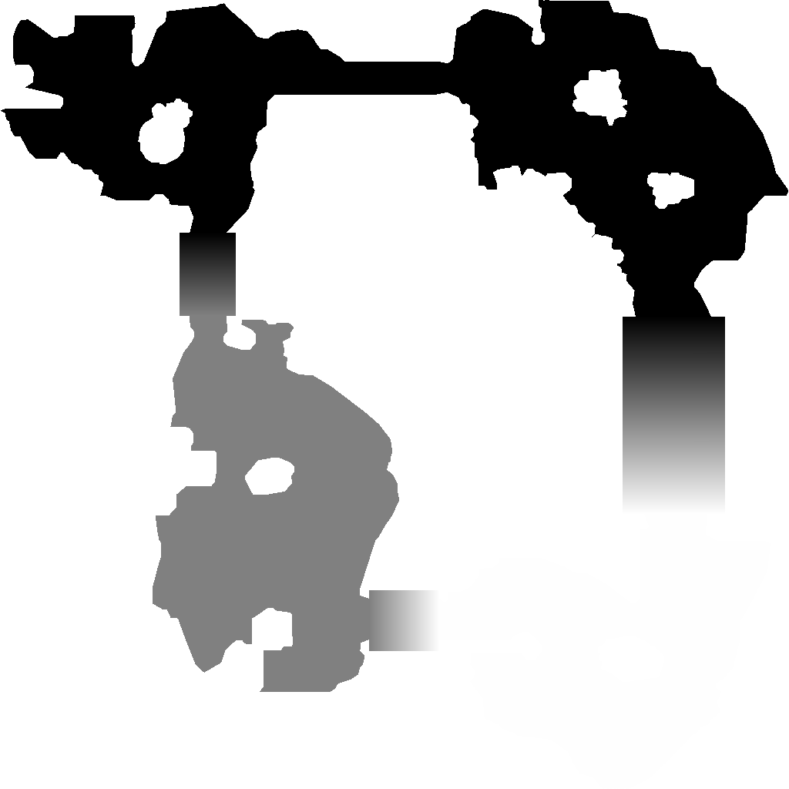

# 3D pathfinding


## 1. Overview

This article will explain the pathfinding problem in 3D scenes. Using the animation 1-1 as a reference example, we will explain the issues that need to be considered when finding paths and moving in 3D scenes.


(Animation 1-1)

In the scene in animation 1-1, there are several boxes with LayaBox textures as the target point for the character to move. Every time the mouse clicks on the ground, the character starts to move to the next box target point. During the movement, the terrain is high and low, and there are different obstacles, indicating that some places are not walkable, so the A* algorithm needs to be used to find the shortest walking route. So basically this example has covered the issues involved in the terrain, character movement, path finding, etc. in the 3D scene. We have listed the following points. Next, we will introduce these points respectively.

- **A*Pathfinding**

- **Terrain Handling**

- **Character Movement**


## 2. A* pathfinding

In the 2D introductory example of the LayaAir3.0 engine, as shown in Figure 2-1, there is an example of 2D A* pathfinding. Developers can also use this example to understand how to use it in 2D projects, such as moving Shown in Figure 2-2


(Figure 2-1)


(Animation 2-2)


### 2.1 A* algorithm

The working principle of the A* algorithm will not be introduced here. Developers can search the Internet for the specific implementation of the algorithm. Simply put, the A* algorithm is a very commonly used path finding and graph traversal algorithm. It has better performance and accuracy.

If you want to use A* as a pathfinding solution, you first need to download [astar.js](https://github.com/bgrins/javascript-astar/blob/master/astar.js ) from the official website at https://github.com/bgrins/javascript-astar 

Then put astar.js in the bin directory of the project and introduce it in index.html, as shown below

```typescript
    <script type="text/javascript" src="astar.js"></script>
```


### 2.2 Used in A* code

After adding the A* class library, let’s take a look at how it is used in the code

Let’s first look at a basic A* code example

```typescript
    var graph = new Graph([
   	 [1,1,1,1],
   	 [0,1,1,0],
   	 [0,0,1,1]
    ]);
	var start = graph.grid[0][0];
	var end = graph.grid[1][2];
	var result = astar.search(graph, start, end);
	// result is an array containing the shortest path
```

1. `graph` is a terrain data class in the A* class. 1 in the data indicates passable plots, and 0 indicates impassable plots. Therefore, this data indicates the walkable and non-walkable nodes of the character. Similarly, Complex scene terrain can also be divided into unit-length plots to serve as regional data for characters to walk.

2. `start` is the starting point coordinates

3. `end` is the end point coordinates

4. astar is the A* algorithm class, used to calculate the shortest route from the starting point to the ending point.

5. Result is the result calculated through the A* algorithm class. It is an array that stores each coordinate point in order.

As you can see, the A* code is relatively simple to use.


### 2.3 Terrain data import

For walkable plot data in complex scenes, it is impossible for us to mark the information of each node in the form of an array in the code. This is too large, so it can be produced through a picture with only black and white. And convert it into map data through code

As shown in Figure 2-3, this image only has 64x64 pixels and can store 4096 plot information. White represents the area that can be walked, and black represents the area that cannot be walked.


(Figure 2-3)

Through the following code, you can read this image and put the color values ​​​​in an array

```typescript
	/**
 	* Calculate the AStart grid through image data
 	*/
	private createGridFromAStarMap(texture): any {
    	var textureWidth = texture.width;
    	var textureHeight = texture.height;
    	var pixelsInfo = texture.getPixels();
    	var aStarArr = [];
    	var index = 0;
    	for (var w = 0; w < textureWidth; w++) {
        	var colaStarArr = aStarArr[w] = [];
        	for (var h = 0; h < textureHeight; h++) {
            	var r = pixelsInfo[index++];
            	var g = pixelsInfo[index++];
            	var b = pixelsInfo[index++];
            	var a = pixelsInfo[index++];
            	if (r == 255 && g == 255 && b == 255 && a == 255)
                	colaStarArr[h] = 1;
            	else {
                	colaStarArr[h] = 0;
            	}
        	}
    	};
    	return aStarArr;
	}
```

Then through the following code, you can initialize the map data of A*

```typescript
//Read terrain map
this.aStarMap = Loader.getTexture2D("res/threeDimen/scene/TerrainScene/Assets/AStarMap.png");
//Get map data
var aStarArr = this.createGridFromAStarMap(this.aStarMap);
//Use astar to initialize map data
this.graph = new (window as any).Graph(aStarArr);
this.opts = [];
this.opts.closest = true;
this.opts.heuristic = (window as any).astar.heuristics.diagonal;
```


### 2.4 Obtain the shortest path

Each time the mouse clicks on the ground, a call to obtain the shortest path is initiated through the mouse event:

```typescript
//Set the mouse pop-up event response
Laya.stage.on(Event.MOUSE_UP, this, function (): void {
	//Start and target points
	var start = this.graph.grid[this.startPoint.x][this.startPoint.y];
	var end = this.graph.grid[this.endPoint.x][this.endPoint.y];
	//Call the A* serach method to obtain the shortest path
	this._everyPath = (window as any).astar.search(this.graph, start, end, {
    	closest: this.opts.closest
	});
}
```

At this point, A* pathfinding has been introduced from configuring the class library, initializing map data, specifying the coordinates of the starting target point, and obtaining the shortest path. Let's take a look at the processing of high and low terrain in the scene.


## 3. Terrain processing

In the process of making 3D scenes, we often create terrain modeling through a pre-rendered grayscale image. The terrain creation process will not be introduced here. With the terrain model, it is impossible for the character to automatically walk on the terrain. We need to obtain the terrain data so that the character can move at the real coordinate position through the A* algorithm.


### 3.1 Height map

The height of each point on the terrain is represented as a column of values ​​in a matrix. This matrix can be represented by a grayscale image called a heightmap. A grayscale image is a picture that uses two-dimensional graphics to represent three-dimensional height changes. Darker colors near black represent lower points, and lighter colors near white represent higher points.



(Figure 3-1)

As shown in Figure 3-1, the upper left corner is close to pure black and is the lowest point of the terrain. The lower right corner is close to pure white and is the highest point of the terrain. The corresponding scene map is shown in Figure 3-2.


(Figure 3-2)

With the height map and terrain model, let's take a look at how to obtain terrain data in Laya


### 3.2 **Mesh terrain 3D sprite `MeshTerrainSprite3D`**

In the Laya engine, the mesh terrain 3D sprite class `MeshTerrainSprite3D` can create a `TerrainMeshSprite3D` instance from the mesh to read the properties of the height map.

```typescript
    /**
     * Create a TerrainMeshSprite3D instance from the mesh and read the height map properties from the image.
     * @param mesh mesh.
     * @param image height map.
     * @param name name.
     * @returns terrain rendering node
     */
    static createFromMeshAndHeightMap(mesh: Mesh, texture: Texture2D, minHeight: number, maxHeight: number, name: string = null): MeshTerrainSprite3D {
   	 var meshTerrainSprite3D: MeshTerrainSprite3D = new MeshTerrainSprite3D(mesh, null, name);
   	 meshTerrainSprite3D._initCreateFromMeshHeightMap(texture, minHeight, maxHeight);
   	 return meshTerrainSprite3D;
    }
```

`mesh`: network data of the entire terrain

`texture`: is a terrain height map

`minHeight`: minimum height

`maxHeight`: Maximum height

Finally, we get the `MeshTerrainSprite3D` object, which is used to store the height data of the terrain.

In the code, it is used like this:

```typescript
//Read the height map
var heightMap = Loader.getTexture2D("res/threeDimen/scene/TerrainScene/Assets/HeightMap.png");
//Initialize MeshTerrainSprite3D
this.terrainSprite = MeshTerrainSprite3D.createFromMeshAndHeightMap((<Mesh>meshSprite3D.meshFilter.sharedMesh), heightMap, 6.574996471405029, 10.000000953674316);
```


### 3.3 Update world matrix

```typescript
//Update terrainSprite world matrix (for the walkable area world matrix)
this.terrainSprite.transform.worldMatrix = meshSprite3D.transform.worldMatrix;
```

Assign the world matrix of the scene model to the `MeshTerrainSprite3D` object to initialize the x, z-axis data of the terrain


### 3.4 Get the grid index of the integer

Obtain the coordinate points of the plot on the map through the coordinate points of the terrain x and z axes

```typescript
	/**
	* Get the grid index of the integer
	*/
	private getGridIndex(x: number, z: number, out: Vector2) {
    	var minX = this.terrainSprite.minX;
    	var minZ = this.terrainSprite.minZ;
    	var cellX = this.terrainSprite.width / this.aStarMap.width;
    	var cellZ = this.terrainSprite.depth / this.aStarMap.height;
    	var gridX = Math.floor((x - minX) / cellX);
    	var gridZ = Math.floor((z - minZ) / cellZ);
    	var boundWidth = this.aStarMap.width - 1;
    	var boundHeight = this.aStarMap.height - 1;
    	(gridX > boundWidth) && (gridX = boundWidth);
    	(gridZ > boundHeight) && (gridZ = boundHeight);
    	(gridX < 0) && (gridX = 0);
    	(gridZ < 0) && (gridZ = 0);
    	out.x = gridX;
    	out.y = gridZ;
	}
```

When searching for the shortest path in the A* algorithm, you need to pass in the coordinates of the starting point and the target point, so you can get the plot coordinates by calling the getGridIndex method.

```typescript
//Call the getGridIndex method to get the grid index
this.getGridIndex(this.path[this.curPathIndex % this.pointCount].x, this.path[this.curPathIndex++ % this.pointCount].z, this.startPoint);
this.getGridIndex(this.path[this.nextPathIndex % this.pointCount].x, this.path[this.nextPathIndex++ % this.pointCount].z, this.endPoint);
//Initialize start and end coordinate points
var start = this.graph.grid[this.startPoint.x][this.startPoint.y];
var end = this.graph.grid[this.endPoint.x][this.endPoint.y];
```


### 3.5 Get the real coordinates in the world coordinate system

Through the starting point and the shortest path searched by the A* algorithm, the real coordinate array of the terrain is obtained, which is used for each walking world coordinate of the character.

```typescript
	/**
 	* Get the real coordinates in the world coordinate system
 	*/
	private getRealPosition(start, path): any {
    	this.resPathLength = path.length;
    	var minX = this.terrainSprite.minX;
    	var minZ = this.terrainSprite.minZ;
    	var cellX = this.terrainSprite.width / this.aStarMap.width;
    	var cellZ = this.terrainSprite.depth / this.aStarMap.height;
    	var halfCellX = cellX / 2;
    	var halfCellZ = cellZ / 2;

    	this.resPath[0].x = start.x * cellX + halfCellX + minX;
    	this.resPath[0].y = start.y * cellZ + halfCellZ + minZ;

    	if (this.resPath.length < path.length) {
        	var diff: number = path.length - this.resPath.length;
        	for (var j: number = 0; j < diff; ++j) {
            	var newPoint: Vector2 = new Vector2();
            	this.resPath.push(newPoint);
        	}

    	}

    	for (var i = 1; i < path.length; i++) {
        	var gridPos = path[i];
        	this.resPath[i].x = gridPos.x * cellX + halfCellX + minX;
        	this.resPath[i].y = gridPos.y * cellZ + halfCellZ + minZ;
    	}
    	return 0;
	}
```


### 3.6 Initialize target point

Several cubic boxes are placed in the scene as the character's walking target points. When the mouse is clicked, the character will move from the current target point to the next target point. The path array is used to store the coordinates of all target points.

```typescript
private initPath(scene: Scene3D): void {
	for (var i: number = 0; i < this.pointCount; i++) {
	var str: string = "path" + i;
   this.path.push(((<MeshSprite3D>scene.getChildByName('Scenes').getChildByName('Area').getChildByName(str))).transform.localPosition);
	}
}
```


## 4. Character movement

Character movement actually means changing the character's position within a short period of time. In our example, the character's position change is performed through Tween by looping to check the character's walking route every 40 milliseconds.

```typescript
	//Enable scheduled repeated execution
	Laya.timer.loop(40, this, this.loopfun);

	private loopfun(): void {
   	 //resPath, array of each world coordinate position that the character needs to move
    	if (this.resPath && this.index < this.resPathLength) {
        	//AStar pathfinding location
        	this._position.x = this.resPath[this.index].x;
        	this._position.z = this.resPath[this.index++].y;
        	//HeightMap gets height data
        	this._position.y = this.terrainSprite.getHeight(this._position.x, this._position.z);
        	if (isNaN(this._position.y)) {
            	this._position.y = this.moveSprite3D.transform.position.y;
        	}

        	this._tarPosition.x = this._position.x;
        	this._tarPosition.z = this._position.z;
        	this._tarPosition.y = this.moveSprite3D.transform.position.y;

        	//adjust direction
        	this.layaMonkey.transform.lookAt(this._tarPosition, this._upVector3, false);
        	//Due to resource specifications, it needs to be rotated 180 degrees.
        	this.layaMonkey.transform.rotate(this._rotation2, false, false);
        	//Adjust position
        	Tween.to(this._finalPosition, { x: this._position.x, y: this._position.y, z: this._position.z }, 40);
        	this.moveSprite3D.transform.position = this._finalPosition;
    	}
	}
```

At this point, we have made preparations for the character's terrain data, pathfinding algorithm, character movement, etc. in the scene. Through the following complete code example, the pathfinding process of the 3D scene can be realized. Developers can use the following Learn more about the code.


## 5. Final code


```typescript
/**
 * Based upon https://github.com/bgrins/javascript-astar
 */
export class AStarFindPath {

	private terrainSprite: MeshTerrainSprite3D;
	private layaMonkey: Sprite3D;
	private path: Vector3[];
	private _everyPath: any[];
	private _position: Vector3 = new Vector3(0, 0, 0);
	private _upVector3: Vector3 = new Vector3(0, 1, 0);
	private _tarPosition: Vector3 = new Vector3(0, 0, 0);
	private _finalPosition: Vector3 = new Vector3(0, 0, 0);
	private _rotation: Vector3 = new Vector3(-45, 180, 0);
	private _rotation2: Vector3 = new Vector3(0, 180, 0);
	private index: number = 0;
	private curPathIndex: number = 0;
	private nextPathIndex: number = 1;
	private moveSprite3D: Sprite3D;
	private pointCount: number = 10;
	private scene: Scene3D;

	//Variables used for pathfinding
	private aStarMap: any;
	private graph: any;
	private opts: any;
	private resPath: Array<Vector2> = new Array<Vector2>();
	private resPathLength: number;

	private startPoint: Vector2;
	private endPoint: Vector2;
	constructor() {
    	//Initialize the engine
    	Laya3D.init(0, 0);
    	Laya.stage.scaleMode = Stage.SCALE_FULL;
    	Laya.stage.screenMode = Stage.SCREEN_NONE;
    	//Display performance panel
    	Stat.show();

    	this.path = [];
    	this.startPoint = new Vector2();
    	this.endPoint = new Vector2();
    	for (var i: number = 0; i < 20; ++i) {
        	var newVec: Vector2 = new Vector2();
        	this.resPath.push(newVec);
    	}

    	//Preload all resources
    	var resource: ILoadURL[] = [{ url: "res/threeDimen/scene/TerrainScene/XunLongShi.ls", priority: 1 },
    	{ url: "res/threeDimen/skinModel/LayaMonkey/LayaMonkey.lh", priority: 1 },
    	{ url: "res/threeDimen/scene/TerrainScene/Assets/HeightMap.png", priority: 1, constructParams: [1024, 1024, 1, false, true] },
    	{ url: "res/threeDimen/scene/TerrainScene/Assets/AStarMap.png", priority: 1, constructParams: [64, 64, 1, false, true] }
    	];

    	Laya.loader.load(resource, Handler.create(this, this.onLoadFinish));
	}

	private onLoadFinish(): void {
    	//Initialize the 3D scene
    	this.scene = (<Scene3D>Laya.stage.addChild(Loader.createNodes("res/threeDimen/scene/TerrainScene/XunLongShi.ls")));

    	//Generate path points based on the blocks in the scene
    	this.initPath(this.scene);

    	//Get the walkable area model
    	var meshSprite3D: MeshSprite3D = (<MeshSprite3D>this.scene.getChildByName('Scenes').getChildByName('HeightMap'));
    	//Hide the walkable area model
    	meshSprite3D.active = false;
    	var heightMap = Loader.getTexture2D("res/threeDimen/scene/TerrainScene/Assets/HeightMap.png");
    	//Initialize MeshTerrainSprite3D
    	this.terrainSprite = MeshTerrainSprite3D.createFromMeshAndHeightMap((<Mesh>meshSprite3D.meshFilter.sharedMesh), heightMap, 6.574996471405029, 10.000000953674316);
    	//Update terrainSprite world matrix (for the walkable area world matrix)
    	this.terrainSprite.transform.worldMatrix = meshSprite3D.transform.worldMatrix;

    	//Read the data of the wall
    	this.aStarMap = Loader.getTexture2D("res/threeDimen/scene/TerrainScene/Assets/AStarMap.png");

    	//Use astar to organize data
    	var aStarArr = this.createGridFromAStarMap(this.aStarMap);
    	this.graph = new (window as any).Graph(aStarArr);
    	this.opts = [];
    	this.opts.closest = true;
    	this.opts.heuristic = (window as any).astar.heuristics.diagonal;

    	//Initialize the mobile unit
    	this.moveSprite3D = (<Sprite3D>this.scene.addChild(new Sprite3D()));
    	this.moveSprite3D.transform.position = this.path[0];


    	//Initialize the little monkey
    	this.layaMonkey = (<Sprite3D>this.moveSprite3D.addChild(Loader.createNodes("res/threeDimen/skinModel/LayaMonkey/LayaMonkey.lh")));

    	var tmpLocalScale: Vector3 = this.layaMonkey.transform.localScale;
    	tmpLocalScale.setValue(0.5, 0.5, 0.5);
    	var aniSprite3d: Sprite3D = (<Sprite3D>this.layaMonkey.getChildAt(0));

    	//Get animation components
    	var animator: Animator = (<Animator>aniSprite3d.getComponent(Animator));
    	//Create action state
    	var state: AnimatorState = new AnimatorState();
    	//Action name
    	state.name = "run";
    	//Action playback start time
    	state.clipStart = 40 / 150;
    	//Action playback end time
    	state.clipEnd = 70 / 150;
    	//Set action
    	state.clip = animator.getDefaultState().clip;
    	//Add an action state to the animation component
    	animator.getControllerLayer(0).addState(state);
    	//Play animation
    	animator.play("run");

    	//Create BlinnPhong material
    	var mat: BlinnPhongMaterial = (<BlinnPhongMaterial>((<SkinnedMeshSprite3D>this.layaMonkey.getChildAt(0).getChildAt(0))).skinnedMeshRenderer.sharedMaterial);
    	//Set albedo intensity
    	mat.albedoIntensity = 8;
    	//Set the position of the monkey elf
    	this.layaMonkey.transform.position.cloneTo(this._finalPosition);

    	//Initialize camera
    	var moveCamera: Camera = (<Camera>this.moveSprite3D.addChild(new Camera()));
    	var tmpLocalPosition: Vector3 = moveCamera.transform.localPosition;
    	tmpLocalPosition.setValue(-1.912066, 10.07926, -10.11014);
    	moveCamera.transform.localPosition = tmpLocalPosition;
    	moveCamera.transform.rotate(this._rotation, true, false);
    	moveCamera.addComponent(CameraMoveScript);

    	//Set the mouse pop-up event response
    	Laya.stage.on(Event.MOUSE_UP, this, function (): void {
        	this.index = 0;
        	//Get each generated path
        	this.getGridIndex(this.path[this.curPathIndex % this.pointCount].x, this.path[this.curPathIndex++ % this.pointCount].z, this.startPoint);
        	this.getGridIndex(this.path[this.nextPathIndex % this.pointCount].x, this.path[this.nextPathIndex++ % this.pointCount].z, this.endPoint);
        	var start = this.graph.grid[this.startPoint.x][this.startPoint.y];
        	var end = this.graph.grid[this.endPoint.x][this.endPoint.y];

        	this._everyPath = (window as any).astar.search(this.graph, start, end, {
            	closest: this.opts.closest
        	});
        	if (this._everyPath && this._everyPath.length > 0) {
            	this.getRealPosition(start, this._everyPath);
        	}
    	});
    	//Enable scheduled repeated execution
    	Laya.timer.loop(40, this, this.loopfun);
	}

	private loopfun(): void {
    	if (this.resPath && this.index < this.resPathLength) {
        	//AStar pathfinding location
        	this._position.x = this.resPath[this.index].x;
        	this._position.z = this.resPath[this.index++].y;
        	//HeightMap gets height data
        	this._position.y = this.terrainSprite.getHeight(this._position.x, this._position.z);
        	if (isNaN(this._position.y)) {
            	this._position.y = this.moveSprite3D.transform.position.y;
        	}

        	this._tarPosition.x = this._position.x;
        	this._tarPosition.z = this._position.z;
        	this._tarPosition.y = this.moveSprite3D.transform.position.y;

        	//adjust direction
        	this.layaMonkey.transform.lookAt(this._tarPosition, this._upVector3, false);
        	//Due to resource specifications, it needs to be rotated 180 degrees.
        	this.layaMonkey.transform.rotate(this._rotation2, false, false);
        	//Adjust position
        	Tween.to(this._finalPosition, { x: this._position.x, y: this._position.y, z: this._position.z }, 40);
        	this.moveSprite3D.transform.position = this._finalPosition;
    	}
	}

	private initPath(scene: Scene3D): void {
    	for (var i: number = 0; i < this.pointCount; i++) {
        	var str: string = "path" + i;
        	this.path.push(((<MeshSprite3D>scene.getChildByName('Scenes').getChildByName('Area').getChildByName(str))).transform.localPosition);
    	}
	}

	/**
	* Get the grid index of the integer
	*/
	private getGridIndex(x: number, z: number, out: Vector2) {
    	var minX = this.terrainSprite.minX;
    	var minZ = this.terrainSprite.minZ;
    	var cellX = this.terrainSprite.width / this.aStarMap.width;
    	var cellZ = this.terrainSprite.depth / this.aStarMap.height;
    	var gridX = Math.floor((x - minX) / cellX);
    	var gridZ = Math.floor((z - minZ) / cellZ);
    	var boundWidth = this.aStarMap.width - 1;
    	var boundHeight = this.aStarMap.height - 1;
    	(gridX > boundWidth) && (gridX = boundWidth);
    	(gridZ > boundHeight) && (gridZ = boundHeight);
    	(gridX < 0) && (gridX = 0);
    	(gridZ < 0) && (gridZ = 0);
    	out.x = gridX;
    	out.y = gridZ;
	}

	/**
 	* Get the real coordinates in the world coordinate system
 	*/
	private getRealPosition(start, path): any {
    	this.resPathLength = path.length;
    	var minX = this.terrainSprite.minX;
    	var minZ = this.terrainSprite.minZ;
    	var cellX = this.terrainSprite.width / this.aStarMap.width;
    	var cellZ = this.terrainSprite.depth / this.aStarMap.height;
    	var halfCellX = cellX / 2;
    	var halfCellZ = cellZ / 2;

    	this.resPath[0].x = start.x * cellX + halfCellX + minX;
    	this.resPath[0].y = start.y * cellZ + halfCellZ + minZ;

    	if (this.resPath.length < path.length) {
        	var diff: number = path.length - this.resPath.length;
        	for (var j: number = 0; j < diff; ++j) {
            	var newPoint: Vector2 = new Vector2();
            	this.resPath.push(newPoint);
        	}

    	}

    	for (var i = 1; i < path.length; i++) {
        	var gridPos = path[i];
        	this.resPath[i].x = gridPos.x * cellX + halfCellX + minX;
        	this.resPath[i].y = gridPos.y * cellZ + halfCellZ + minZ;
    	}
    	return 0;
	}

	/**
 	* Calculate the AStart grid through image data
 	*/
	private createGridFromAStarMap(texture): any {
    	var textureWidth = texture.width;
    	var textureHeight = texture.height;
    	var pixelsInfo = texture.getPixels();
    	var aStarArr = [];
    	var index = 0;
    	for (var w = 0; w < textureWidth; w++) {
        	var colaStarArr = aStarArr[w] = [];
        	for (var h = 0; h < textureHeight; h++) {
            	var r = pixelsInfo[index++];
            	var g = pixelsInfo[index++];
            	var b = pixelsInfo[index++];
            	var a = pixelsInfo[index++];
            	if (r == 255 && g == 255 && b == 255 && a == 255)
                	colaStarArr[h] = 1;
            	else {
                	colaStarArr[h] = 0;
            	}
        	}
    	};
    	return aStarArr;
	}
}
```


