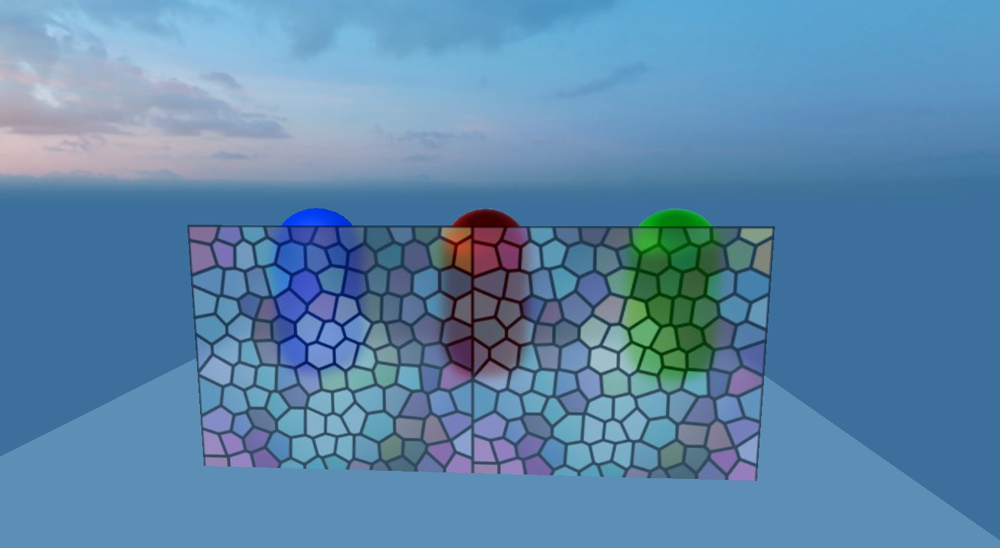
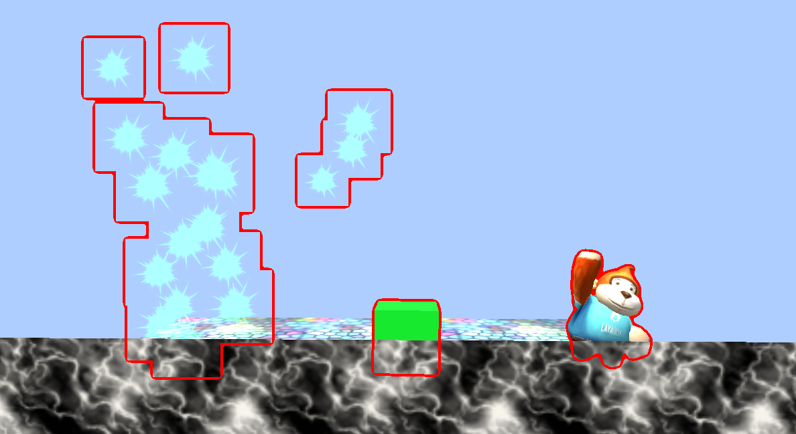

# CommandBuffer document

### 1. Introduction

CommandBuffer is the rendering command buffer, which saves the rendering command list. When we add some rendering instructions to the CommandBuffer, we can control the rendering process and execute these instructions at the time we want. The command buffer sets the render target or draws a given mesh, which can be set to be executed at different points during camera rendering.

CommandBuffer is a high-end 3D rendering function used to expand the rendering effects of the LayaAir engine rendering pipeline. It is very useful when realizing effects such as frosted glass (transparent glass blur), outline perspective strokes or edge light effects, beach footprints, depth of field, etc. Everyone who knows it knows that CommandBuffer is very powerful and is also a rendering often used in 3A-level masterpieces. function, and there will be no additional loss of functions, and some effects are even more performance-efficient than other solutions. It is a rendering extension function that can also be used to enhance 3D rendering effects in small game platforms.

### 2. Usage steps

#### 1. After creating the CommandBuffer, add rendering instructions to the CommandBuffer

Add the code interface as follows:

```typescript
var buf:CommandBuffer = new CommandBuffer();buf.setRenderTarget(renderTexture);buf.drawRender(renders[i],materials[i],0);
```

#### 2. CBuffer needs to be bound to the rendering event of the Camera. The Camera events currently supported by laya are as follows:

```typescript
BeforeForwardOpaque = 0, //Before rendering non-transparent objects, BeforeSkyBox = 2, //Before rendering sky boxes, BeforeTransparent = 4, //Before rendering transparent objects, BeforeImageEffect = 6, //Before post-processing, AfterEveryThing = 8, // After all rendering
```

The interface for adding CommandBuffer to camera events is as follows:

```typescript
this.camera.addCommandBuffer(this.cameraEventFlag,this.commandBuffer);
```

The interface to delete CommandBuffer is as follows:

```typescript
this.camera.removeCommandBuffer(this.cameraEventFlag,this.commandBuffer);
```

CommandBuffer is a rendering instruction set. This rendering instruction set is composed of independent rendering instructions one by one.

```typescript
setShaderData//Set shader data, you can set the texture vector number in the shader, etc. setGlobalShaderData//Set global data, which can be used for all shaderblitScreenQuad//Render the source texture to the target rendering texture instruction through the full-screen quadrilateral. blitScreenQuadByMaterial//Render the source texture to the target rendering texture through the full-screen quadrilateral instruction setRenderTarget//Set the instruction rendering target. After calling, all rendering will be rendered to the picture bound by the method clearRenderTarget//Clean up the bound rendering texture drawMesh// Render a MeshdrawRender//Render a Render
```

You can combine different rendering instructions and put them into different rendering processes. Let’s analyze the official examples to better understand the usage of CommandBuffer.

### 3.Usage examples

#### 3.1.BlurryGlass example (frosted glass example)

##### Renderings

 

##### Example principle

Frosted glass is a transparent material, and the three capsules behind it are all opaque materials, so we need to take out all the rendering objects behind the frosted glass model every frame, blur them, and then sample the picture according to the screen UV to the frosted glass, and it can be achieved Such effect

##### Sample code

```typescript
createCommandBuffer(camera:Camera){
	//When you need to get the camera rendering result before rendering a transparent object, so call the following attribute true
	camera.enableBuiltInRenderTexture = true;
	//Create CommandBuffer
	var buf:CommandBuffer = new CommandBuffer();
	//Create a screen RenderTexture that needs to be blurred
	var viewPort:Viewport = camera.viewport;
 	//Create a new RenderTexture
	var renderTexture = RenderTexture.createFromPool(viewPort.width,viewPort.height,RenderTextureFormat.R8G8B8,RenderTextureDepthFormat.DEPTHSTENCIL_NONE);
	this.texture = renderTexture;
	//Copy the current rendering result to the created RenderTexture
buf.blitScreenTriangle(null,renderTexture);
	//Get the blur shader
	var shader:Shader3D = Shader3D.find("blurEffect");
	//Set fuzzy parameters
var shaderValue:ShaderData = new ShaderData();
	//down Sample level sets the downsampling level
	var downSampleFactor:number = 4;
	var downSampleWidth:number = viewPort.width/downSampleFactor;
	var downSampleheigh:number = viewPort.height/downSampleFactor;
	//Set blur material parameters
	var texSize:Vector4 = new Vector4(1.0/viewPort.width,1.0/viewPort.height,viewPort.width,downSampleheigh);
	shaderValue.setNumber(BlurEffect.SHADERVALUE_DOWNSAMPLEVALUE,1);
	shaderValue.setVector(BlurEffect.SHADERVALUE_TEXELSIZE,texSize);
	//Create downsampling RenderTexture1
	var downRenderTexture = RenderTexture.createFromPool(downSampleWidth,downSampleheigh,RenderTextureFormat.R8G8B8,RenderTextureDepthFormat.DEPTHSTENCIL_NONE);
	//Downsampling command stream
	buf.blitScreenTriangle(renderTexture,downRenderTexture,null,shader,shaderValue,0);
	//Create downsampling RenderTexture2
	var blurTexture:RenderTexture = RenderTexture.createFromPool(downSampleWidth,downSampleheigh,RenderTextureFormat.R8G8B8,RenderTextureDepthFormat.DEPTHSTENCIL_NONE);
	blurTexture.filterMode = FilterMode.Bilinear;
	//Horizontal blur
	buf.blitScreenTriangle(downRenderTexture,blurTexture,null,shader,shaderValue,1);
	//vertical blur
	buf.blitScreenTriangle(blurTexture,downRenderTexture,null,shader,shaderValue,2);
	//Horizontal blur
	buf.blitScreenTriangle(downRenderTexture,blurTexture,null,shader,shaderValue,1);
	//vertical blur
	buf.blitScreenTriangle(blurTexture,downRenderTexture,null,shader,shaderValue,2);
	//At this point, the blurred image has been generated in downRenderTexture
	//Set global uniform variables
	var globalUniformNameID:number = Shader3D.propertyNameToID("u_screenTexture");
	//Assign the global variable u_screenTexture to the blurred image
	buf.setGlobalTexture(globalUniformNameID,downRenderTexture);
	//Add commandBuffer to the rendering process
	camera.addCommandBuffer(CameraEventFlags.BeforeTransparent,buf);
	//Recycle used RenderTexture
	RenderTexture.recoverToPool(downRenderTexture);
	RenderTexture.recoverToPool(blurTexture);
	return;
  }
```

#### 3.2.OutLine example (outline stroke)

##### Rendering:

 

##### Example principle:

After the rendering is completed, bind another black Rendertexture, redraw the particles, Box, and monkey as pure red, and then blur the image. Subtract the unblurred image from the blurred image color to get the rendering border. Finally, the rendering border Add it back to the rendered canvas to achieve the outline effect.

##### code show as below

```typescript
createDrawMeshCommandBuffer(camera:Camera,renders:BaseRender[],materials:Material[]):CommandBuffer{
	var buf:CommandBuffer = new CommandBuffer();
	//Set true when you need to get the camera rendering effect in the process
	camera.enableBuiltInRenderTexture = true;
	//Create a Rendertexture as large as the screen
	var viewPort:Viewport = camera.viewport;
	var renderTexture = RenderTexture.createFromPool(viewPort.width,viewPort.height,RenderTextureFormat.R8G8B8A8,RenderTextureDepthFormat.DEPTHSTENCIL_NONE);
	//Set RenderTexture as render target
	buf.setRenderTarget(renderTexture);
	//Clear the color of the render target to black and do not clean up the depth
	buf.clearRenderTarget(true,false,new Vector4(0,0,0,0));
	//Render the incoming Render to the texture
	for(var i = 0,n = renders.length;i<n;i++){
  	buf.drawRender(renders[i],materials[i],0);
	}
	//Create a new RenderTexture
 	var subRendertexture = RenderTexture.createFromPool(viewPort.width,viewPort.height,RenderTextureFormat.R8G8B8A8,RenderTextureDepthFormat.DEPTHSTENCIL_NONE);
	//Copy the result of renderTexture to subRenderTexture
 	buf.blitScreenQuad(renderTexture,subRendertexture);
	//Set fuzzy parameters
 	var downSampleFactor:number = 2;
 	var downSampleWidth:number = viewPort.width/downSampleFactor;
 	var downSampleheigh:number = viewPort.height/downSampleFactor;
	var texSize:Vector4 = new Vector4(1.0/viewPort.width,1.0/viewPort.height,viewPort.width,downSampleheigh);
	//Create blur material
	var blurMaterial:BlurMaterial = new BlurMaterial(texSize,1);
	//Create downsampling RenderTexture1
 	var downRenderTexture = RenderTexture.createFromPool(downSampleWidth,downSampleheigh,RenderTextureFormat.R8G8B8,RenderTextureDepthFormat.DEPTHSTENCIL_NONE);
	//Downsampling Use 0SubShader of blurMaterial material to render Rendertexture to DownRendertexture
 	buf.blitScreenQuadByMaterial(renderTexture,downRenderTexture,null,blurMaterial,0);
 	//Create downsampling RenderTexture2
	var blurTexture:RenderTexture = RenderTexture.createFromPool(downSampleWidth,downSampleheigh,RenderTextureFormat.R8G8B8,RenderTextureDepthFormat.DEPTHSTENCIL_NONE);
	blurTexture.filterMode = FilterMode.Bilinear;
	//Horizontal blur uses 1SubShader of blurMaterial material
	buf.blitScreenQuadByMaterial(downRenderTexture,blurTexture,null,blurMaterial,1);
	//vertical blur 2SubShader using blurMaterial material
	buf.blitScreenQuadByMaterial(blurTexture,downRenderTexture,null,blurMaterial,2);
	//Horizontal blur uses 1SubShader of blurMaterial material
	buf.blitScreenQuadByMaterial(downRenderTexture,blurTexture,null,blurMaterial,1);
	//vertical blur 2SubShader using blurMaterial material
	buf.blitScreenQuadByMaterial(blurTexture,downRenderTexture,null,blurMaterial,2);
	//Insert the set image command stream into the command stream, and the image data of blurMaterial will be set when called.
	buf.setShaderDataTexture(blurMaterial._shaderValues,BlurMaterial.SHADERVALUE_SOURCETEXTURE0,downRenderTexture);
	buf.setShaderDataTexture(blurMaterial._shaderValues,BlurMaterial.ShADERVALUE_SOURCETEXTURE1,subRendertexture);
	//caculate edge calculate edge image
	buf.blitScreenQuadByMaterial(blurTexture,renderTexture,null,blurMaterial,3);
	//Re-import the image
	buf.setShaderDataTexture(blurMaterial._shaderValues,BlurMaterial.SHADERVALUE_SOURCETEXTURE0,renderTexture);
	//Copy the camera rendering result to subRendertexture, using blurMaterial's 4-channel shader
	buf.blitScreenQuadByMaterial(null,subRendertexture,null,blurMaterial,4);
	//Reassign subRenderTexture to the camera's rendering result
	buf.blitScreenQuadByMaterial(subRendertexture,null);
	return buf;
  }
```


