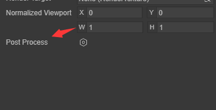
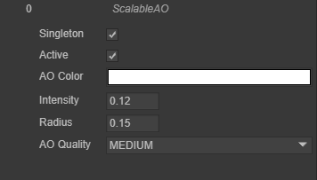
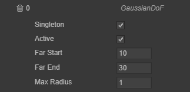

# Post-processing

## 1. Post-processing overview

Post-processing is one of the essential technologies in modern games. PostProcessing usually processes the results after the ordinary scene rendering is completed, processing one or several Textures to obtain a new Texture.

PostProcessing's rendering Pipeline is the same as ordinary model rendering. The difference is that it is usually just a simple copy in the vertex shader, and the main logic is written in the fragment shader.

The images below show the scene with and without post-processing applied.

 

> Scenes without post-processing applied

 

> Apply post-processed scenes

## 2. Add a built-in post-processing effect

1. Select the camera object in the Scene that needs to be added with post-processing effects.

 

Figure 2-1

2. PostProcess component in the component panel of the camera object

 

Figure 2-2

3. Select the instantiated PostProcess component

 

Figure 2-3

4. Add appropriate post-processing effects in Effects

 

Figure 2-4

## 3. Engine built-in post-processing type: ScalableAO

The ambient occlusion effect is used to calculate the points in the scene that are exposed to ambient lighting. It then darkens areas that are hidden from ambient light, such as creases, holes, and spaces between close objects.

You can achieve the ambient occlusion effect in two ways: In real time as a full-screen post-processing effect. Real-time ambient occlusion effects can be resource-intensive. Its impact on processing time depends on screen resolution and effect properties.

 

Figure 3-1

Expandable ambient occlusion parameter types:

| Parameter type |	Parameter explanation	|
| :--------: | :------------------------------------------: |
| AO Color |	Set the color of ambient occlusion	|
| Intensity  |          	Ambient occlusion produces intensity	|
| Radius | Set the radius of the sampling point to control the scope of the ambient occlusion area |
| AO Quality |	Ambient occlusion effect quality (high-medium-low three levels)	|

## 4. Engine built-in post-processing type: Bloom

The Bloom effect causes bright areas in an image to glow. To do this, it creates rim lights that extend from bright areas to your image. This simulates the effect a real-world camera would have when light floods the lens. The Bloom effect also has a Grunge feature, which you can use to apply a full-screen layer of dirt or dust to diffract the Bloom effect.

 

Pic 4-1

Bloom parameter types:

| 	Parameter Type 	|                       	Parameter explanation	|
| :--------------: | :----------------------------------------------------------: |
|  	Clamp   	|          	Set the clamp pixel value to control the Bloom amount	|
|  	Color   	|                  	Choose a Bloom color	|
|	Fast Mode 	|                       	Quick mode	|
|   Dirt Texture   |        	Choose a dirty texture to add smudges or dust to your footage	|
|	Intensity 	|                  	Set lens dirty intensity	|
|	Threshold 	|          	Set the brightness level to filter out pixels below this level	|
|	Soft Knee 	| Sets a progressive threshold for transitions between below/above threshold (0 = hard threshold, 1 = soft threshold). |
|	Diffusion 	|      	Sets the range of the veil effect in a screen resolution-independent manner.	|
| Anamorphic Ratio | Set the ratio to scale Bloom vertically (range [-1,0]) or horizontally (range [0,1]). This simulates the effect of an anamorphic lens. |

## 5. Engine built-in post-processing type: GaussianDoF

Depth of field is a common post-processing effect that simulates the focal length characteristics of a camera lens. In real life, cameras can only focus sharply on objects within a certain distance; objects closer or further from the camera will be somewhat out of focus. Not only does this blur provide a visual clue as to the distance of an object, but it also introduces Bokeh, a term used to describe the pleasant visual artifacts that appear when bright areas of an image are out of focus.

 

Figure 5-1

GaussianDoF parameter type:

| Parameter type | Parameter explanation	|
| ---------- | ---------------- |
| Far Start | Depth of field start value	|
| Far End	| Depth of field end value	|
| Max Radius | Maximum blur depth of field radius |

## 6. Engine custom post-processing type

After writing your own post-processing effect in the 3.0 engine, add the keyword **@regClass()** before the class definition to explicitly display the customized post-processing effect in the Camera's post-processing component. in the effects list

Figure 6-1

 

Figure 6-2

