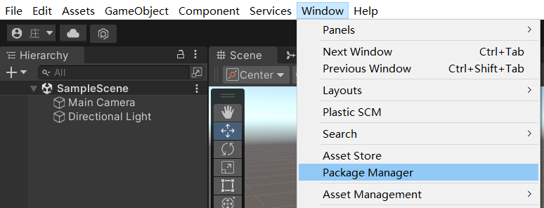
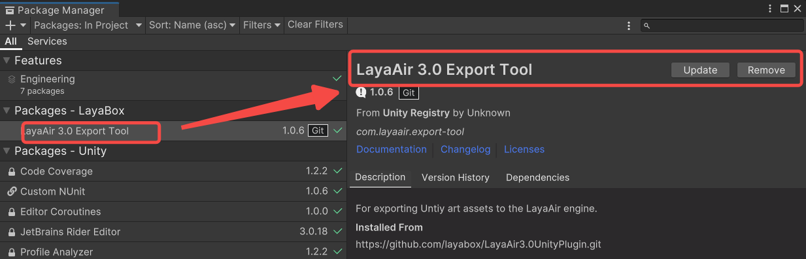
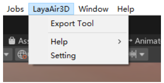
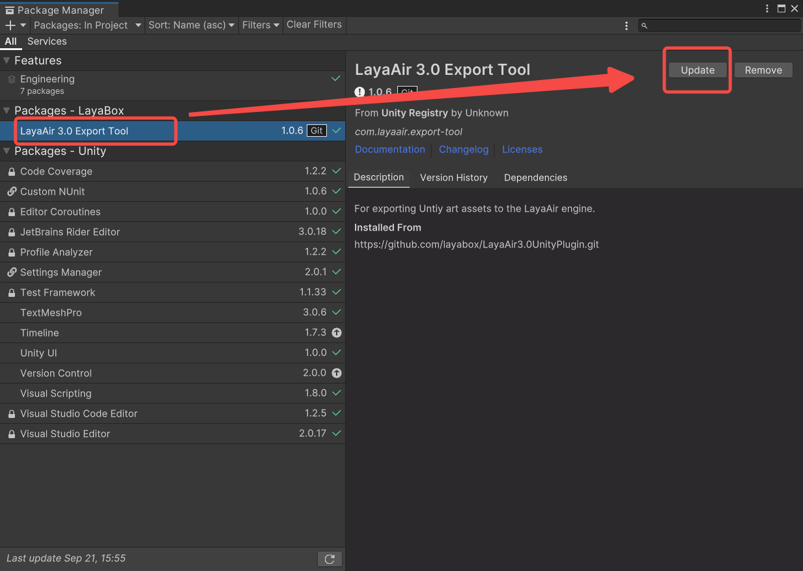
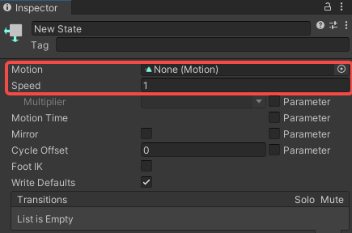

# Unity resource export plug-in

## 1. About plug-ins
The main reason for adopting the Unity plug-in solution is to support developers to seamlessly migrate the resources purchased in the Unity Resource Mall to LayaAir IDE for related development work. The Unity Resource Mall has a certain amount of exquisite and high-quality art. Resources, using the Untiy resource export plug-in can migrate these exquisite art resources to the IDE of the LayaAir engine for development. It is undoubtedly an invisible help for some small and beautiful projects, and can also allow high-quality developers with Unity experience You can enter the HTML5 and mini-game industries at a lower learning cost.

Plug-in project address: https://github.com/layabox/LayaAir3.0UnityPlugin.git

## 2. Import LayaAir’s Unity plug-in

There is a function in Unity to import custom packages. Through this function, you can import the exclusive function package provided by the LayaAir engine into Unity to export the scenes and resources edited in Unity, and then use them for 3D development of the LayaAir engine. The process of importing this customized LayaAir function package into Unity can be regarded as installing a Unity plug-in that exports LayaAir engine resources. This section will introduce this process in detail.

### 2.1 Installing the plug-in for the first time in the project

After opening a Unity project, if the plug-in has not been installed, you need to open the `Window->Package Manager` window under the Unity menu bar, as shown in Figure 2-1.

(Figure 2-1)

Then, as shown in Figure 2-2, in the opened window, click the `+` button in the upper left corner and select `Add package from git URL`.

(Figure 2-2)

Fill in the Git address of the plug-in (`https://github.com/layabox/LayaAir3.0UnityPlugin.git`) and click `Add`, as shown in Figure 2-3.

(Figure 2-3)

After clicking, the plug-in will be installed automatically. The effect after the installation is completed is shown in Figure 2-4.

(Figure 2-4)

After the plug-in is installed, you can see an additional `LayaAir3D` in the menu bar, as shown in Figure 2-5. This shows that the import has been successful.

(Figure 2-5)

### 2.2 Plug-ins have been updated

If LayaAir officially updates the plug-in, and the resource export plug-in is already installed in the developer's Unity project, the developer only needs to update it. As shown in Figure 2-6, find the `LayaAir 3.0 Export Tool` plug-in in the `Package Manager` window and click `Update` to update it.

(Figure 2-6)

> If you want to remove the plugin, just click `Remove`.

### 2.3 Reminder for plug-in import and installation

For developers who are not familiar with Unity, please be reminded that the LayaAir engine Unity resource export plug-in is not universal for all projects imported at one time. After each new project is created, the above process of importing the LayaAir plug-in package must be repeated.

Also note:

**1. Reminder about color space:**

LayaAir is a linear color space. For developers whose Unity color space is set to Gamma, the export effect may be inconsistent with LayaAir. Developers need to confirm whether Unity is set to Linear color space.

You can use the following steps to view the settings of Unity color space: `Editor -> Project Setting -> Player -> Other Setting -> Color Space`, the operation is shown in Figure 2-7.

(Figure 2-7)

**2. Reminder about normal map**

Unity's normal map has been compressed. When exporting, the LayaAir IDE preview may be inconsistent with Unity. Users who customize Shader need to pay attention to the normal transformation.

## 3. Functions of resource export plug-in

### 3.1 Scene export

(Figure 3-1) Scene export panel

#### 3.1.1 Node settings

**Ignore inactive nodes**: If this option is checked, inactive nodes such as Camera in Figure 3-2 will not be exported.

(Figure 3-2)

#### 3.1.2 Model settings

**Ignore vertex UV**: If this option is checked, there will be no UV information in the exported Mesh data.

**Ignore vertex color**: If this option is checked, the exported Mesh data will have no vertex color information.

**Ignore vertex normals**: If this option is checked, the exported Mesh data will have no vertex normal information.

**Ignore vertex tangents**: If this option is checked, the exported Mesh data will have no vertex tangent information.

**Automatically generate UV1**: If this option is checked, the exported Mesh data UV Set is set to UV1.

#### 3.1.3 Other settings

**Customized export root directory**: If you check this option, as shown in Figure 3-3, you can set the resource path exported by the plug-in (fill in the absolute path in the text box).

(Figure 3-3)

### 3.2 Preset export

(Figure 3-4) Preset export panel

#### 3.2.1 Node settings

**Ignore inactive nodes**: If this option is checked, inactive nodes such as Camera in Figure 3-5 will not be exported.

(Figure 3-5)

**Export first-level nodes in batches**: If this option is checked, nodes similar to those in Figure 3-6 will eventually be exported as the LayaMonkey root node.

(Figure 3-6)

#### 3.2.2 Model settings

**Ignore vertex UV**: If this option is checked, there will be no UV information in the exported Mesh data.

**Ignore vertex color**: If this option is checked, the exported Mesh data will have no vertex color information.

**Ignore vertex normals**: If this option is checked, the exported Mesh data will have no vertex normal information.

**Ignore vertex tangents**: If this option is checked, the exported Mesh data will have no vertex tangent information.

**Automatically generate UV1**: If this option is checked, the exported Mesh data UV Set is set to UV1.

#### 3.2.3 Other settings

**Customized export root directory**: If you check this option, as shown in Figure 3-7, you can set the resource path exported by the plug-in (fill in the absolute path in the text box).

(Figure 3-7)

### 3.3 Help

In the help menu item, the lower-level menus include `Study Document Study` and `Q&A Community Answers`, which are external link menu items to facilitate developers to quickly enter the corresponding official website page. There is also a `plug-in version About LayaAir`, as shown in Figure 3-8.

(Figure 3-8)

## 4. Scene object export support list

In addition to the export settings on the LayaAir engine plug-in's own panel, we also need to pay attention and must understand which of Unity's function panels can be exported and which are not supported.

Because the Unity plug-in of the LayaAir engine does not support export of all Unity functions. After all, the design and structure of our LayaAir engine is different from Unity's engine. Although the 3D scene is edited and exported based on the Unity editor, we need to use it according to the support rules of the LayaAir engine plug-in.

In this section, we will comprehensively introduce the functions in Unity supported by the LayaAir engine and plug-ins. If it is not mentioned in the support list in this section, it is not currently supported. Therefore, if you are a developer who is new to Unity, you do not need to learn all of them when learning how to use Unity tools. You can just search and learn the support content involved in this section as keywords.

> The LayaAir engine plug-in will also be constantly updated. After upgrading to a new engine version, you can pay attention to the version update log and changes in this document.

### 4.1 Basic properties of the Inspector panel

In Unity's Inspector panel, you can view and edit almost everything in the Unity editor. Next, let's first take a look at the basic common properties of the Inspector panel.

(Pic 4-1)

In the basic properties in Figure 4-1, LayaAir export support is as follows:

| Unity’s Inspector basic properties	| Instructions on whether LayaAir supports exporting	|
| :-------------------------- | :------------------------------------------------------- |
| GameObject Name (node ​​name) | Supported	|
| Static	| Only supports checked or unchecked	|
| Layer	| Only supports the export of layer serial numbers. Developers can also set Layer in the LayaAir engine |
| Position	| Support (including: X, Y, Z)	|
| Rotation	| Support (including: X, Y, Z)	|
| Scale	| Support (including: X, Y, Z)	|

> Comparing the above figure and table, we see that `Tag` is not supported. `Static` and `Layer` are partially supported. There will be no further reminders, just pay attention to the support status in the table.

Here is a special mention. After static is checked, all is selected, that is, Everything, as shown in Figure 4-2. But in fact, the LayaAir engine only supports Lightmap Static and Batching Static, so if developers don’t select Everything, can they only check these two? Of course it doesn't work. We actually only recognize the status of Static checked or unchecked. If you select it here separately, the export will have no effect.

(Figure 4-2)

### 4.2 Camera properties

(Figure 4-3)

In the Unity camera properties in Figure 4-3, LayaAir export support is as follows:

| Unity camera properties	| Instructions on whether LayaAir supports exporting	|
| :---------------------------------- | :----------------------------------------------------------- |
| Clear Flags	| Support (including: Skybox (Background color), Solid Color (Background color), Depth only, Don’t Clear) |
| Projection	| Support (including: Perspective (Field of View), Orthographic (size)) |
| Clipping Planes	| Support (including: Near point, Far point)	|
| Viewport Rect (standard view rectangle)	| Support (including: X, Y, W, H)	|
| Allow HDR (allow rendering of high dynamic color images) | Support	|

> Culling Mask is invalid when set in Unity, but it is supported in layaAir engine. The default value is equivalent to Everything in Unity. The layer ID can also be set through the engine's cullingMask.

### 4.3 Lighting-related attributes

#### 4.3.1 Light attribute Light

(Figure 4-4)

In the Unity light properties in Figure 4-4, LayaAir export support is as follows:

| Unity light properties	| Instructions on whether LayaAir supports exporting	|
| :---------------------- | :----------------------------------------------------------- |
| Type	| Partially supported (including: Spot light (Range illumination range, Spot Angle spotlight cone angle), Directional parallel light, Point point light (Range illumination range)) |
| Color (light color)	| Support	|
| Mode (light mode)	| Support (including: Realtime real-time lighting, Baked light map, Mixed mixed light source) |
| Intensity (light intensity) | Support	|
| Shadow Type | Supported (including: Soft Shadows, Hard Shadows)	|

#### 4.3.2 Properties of reflection probe Reflection Probe

(Figure 4-5)

When the Reflection Probe component is added to Unity, in the properties in Figure 4-5, LayaAir export support is as follows:

| Unity’s reflection probe related configuration properties	| Instructions on whether LayaAir supports exporting	|
| :--------------------------------------------- | :----------------------------------------------------------- |
| Type	| Partially supported (including: Baked baking mode, Custom mode)	|
| Runtime settings	| Partially supported (including: Importance weight parameter, Intensity brightness, Box projection box offset reflection, Box Size reflection probe size, Box Offset reflection probe offset) |
| Cubemap capture settings | Supported	|

### 4.4 Model-related attributes

Regarding the attributes of the model, ordinary models and skeletal models are supported respectively.

#### 4.4.1 Ordinary model

Ordinary models require the Mesh Filter component and the Mesh Render component, which are introduced separately below.

**Mesh Filter**

(Figure 4-6)

In the Unity grid filter properties in Figure 4-6, LayaAir export support is as follows:

| Unity's skinned mesh rendering properties | Instructions on whether LayaAir supports export |
| :---------------------- | :------------------------ |
| Mesh	| support	|

**Mesh Renderer**

(Figure 4-7)

(Figure 4-8)

In the properties of Unity's Mesh Render component in Figure 4-7, LayaAir export support is as follows:

| Unity's mesh rendering properties	| Instructions on whether LayaAir supports exporting	|
| :------------------------------- | :----------------------------------------------------------- |
| Materials	| Support (including: Size, Element material ball elements)	|
| Lightmap Static (static light map) | Partially supported (including: Lightmaps map (Baked Lightmap baked light map (Lightmap Index, Tiling X, Tiling Y, Offset X, Offset Y))) |

#### 4.4.2 Skeleton model

The Mesh and Mesh Renderer of the skeletal model are no longer separated and are merged into the component `Skinned Mesh Renderer`, as shown in the following figure:

(Figure 4-9)

In the properties of Unity's Skinned Mesh Renderer component in Figure 4-9, LayaAir export support is as follows:

| Unity's skinned mesh rendering properties | Instructions on whether LayaAir supports export	|
| :---------------------- | :--------------------------------------------------------- |
| Mesh	| Support	|
| Root Bone (bone root node) | Support	|
| Bounds	| Support (including: Center (X, Y, Z), Extent range (X, Y, Z)) |
| Materials	| Support (including: Size, Element material ball elements)	|

#### 4.4.3 Material

Regarding the material of the model, here we introduce the commonly supported material types.

|          	**Classification**          	|               	**Material**	|
| :--------------------------------: | :------------------------------------------: |
|       	Build in pipeline	|            	Standard material	|
|                                	| Ulit Color/Texture/Cut Out/ Transparent material |
|          	URP pipeline	|             	URP Lit material	|
|                                	|             	URP Ulit material	|
|           	skybox	|       	Procedural procedural skybox	|
|                                	|               	6 Eight	|
|                                	|           	Panoramic panorama	|
| Old version shaders (for compatibility reasons only, not recommended) |	Diffuse Fast             	|
|                                	|               	Diffuse                	|
|                                	|            	Diffuse Detail            	|
|                                	|            	Bumped Diffuse            	|
|                                	|           	Bumped Specular            	|

> Except for the material Shader provided above, other materials in Unity cannot be used in the LayaAir engine.

### 4.5 Texture properties

In the `Assets` panel, find the 2D image resource and set the texture properties for it.

(Figure 4-10)

In the Unity texture properties in Figure 4-10, LayaAir export support is as follows:

| Unity texture properties	| Instructions on whether LayaAir supports exporting	|
| :------------------------------ | :----------------------------------------------------------- |
| Generate Mip Maps (Generate Mipmap) | Partially supported (only the checked state is supported)	|
| Wrap Mode	| Partial support (including: Repeat, Clamp forced stretching)	|
| Filter Mode	| Support (including: Point filtering, Bilinear filtering, Trilinear filtering) |
| Aniso Level	| Support	|

### 4.6 Animation properties

In terms of animation, LayaAir supports the export and use of some properties of the `Animator` component and the associated `Animator Controller` panel.

#### 4.6.1 Aniamtor component

(Figure 4-11)

In the Unity animation properties in Figure 4-11, LayaAir export support is as follows:

| Unity animation properties	| Instructions on whether LayaAir supports exporting	|
| :------------------------ | :----------------------------------------------------------- |
| Controller (Animation Controller) | Support	|
| Culling Mode (culling mode) | Partially supported (including: Always Animate always plays, Cull Completely completely eliminated) |

#### 4.6.2 Animator Controller State

Double-click the Controller in the Aniamtor component properties to open the animation controller panel, select `State` (state), and you can see the panel shown in Figure 4-12.

(Figure 4-12)

In the State property of the Unity animation controller in Figure 4-12, LayaAir export support is as follows:

| Unity's animation controller State property | Instructions on whether LayaAir supports export |
| :------------------------- | :------------------------ |
| Motion (selected animation)	| support	|
| Speed ​​(animation playback speed)	| Support	|

### 4.7 Prefab

As shown in Figure 4-13, prefabs in Unity support exporting, but the properties (lights, materials, etc.) contained in the exported prefab must be properties supported by the plug-in, that is, the properties listed in this section.

(Figure 4-13)

## 5. Model export file and loading display

After understanding the functions and usage rules of the plug-in, we can edit and export it in Unity, but what do the exported file names represent and how are they loaded and used. This section begins with an introduction.

### 5.1 Description of export file types

| **File suffix** | **Export file type description**	|
| :------------- | :----------------------------------------------------------- |
| **.ls**    	| Scene file, select the file type generated when exporting the `Scene3D` category. Complete scene information will be exported, including various data, light maps, models, positions, etc. required for the scene. Therefore, when you need to export scene-related settings, you must use the Scene3D category to export, and you can see the file with the `.ls` suffix. |
| **.lh**    	| Preset file, select the file type generated when exporting the `Preset Sprite3D` category. Compared with scene files with the `.ls` suffix, there will be a lack of information related to scene rendering such as ambient light, environmental reflection, scene fog effects, etc. |
| **.lm**    	| Model data file, usually converted from FBX format.	|
| **.lmat**	| Material data file is the material information set for the model in Unity. When loading a `.ls` or `.lh` file, the .lmat file will be automatically loaded to generate the material. Can be loaded using the BaseMaterial class. |
| **.last year**	| Animation data file. If there is animation on the model, the animation configuration file will be generated after exporting, which contains animation frame data. Loading can be done using the AnimationClip class. |
| **.jpg**   	| Texture image files in JPEG format.	|
| **.png**   	| Texture image file in PNG format.	|
| **.hdr**   	| HDR format picture files required for panoramic skybox	|

### 5.2 Loading display
If the exported Unity resources are to be displayed through the LayaAir engine without considering other logic, the resources need to be loaded first.

#### 5.2.1 Scene loading display
When we want to export the entire scene, we can select the scene and set the export path. As shown in Figure 5-1, it is recommended that the export path be set to the `assets` folder under the project directory of the LayaAir IDE project. As for the directory under the assets directory, it is up to the developer to decide.

(Figure 5-1)

After exporting, just open the `.ls` file in the IDE to load the scene.

After opening the scene, the exported scene does not have ambient light information. You need to find the baking switch under the Scene3D level. As shown in Figure 5-2, click `Bake` to precompute the ambient light sh data of the current scene.
In this way, the effect after baking is the effect we want.

(Figure 5-2)

#### 5.2.2 Default loading display
As shown in Figure 5-3, the preset export is mainly used when the entire scene does not need to be fully exported and only certain node resources are needed. Or some node resources need to be exported independently for reuse or dynamic use of code.

(Figure 5-3)

## 6. Frequently Asked Questions

If you encounter the error message below, the reason is that some packages are missing.

(Figure 6-1)

At this time, you need to open the package manager `Package Manager` in the `Window` menu. After opening, as shown in Figure 6-2, search for editor, then select the two packages "Editor Coroutines" and "Version Control" and add them.

(Figure 6-2)

