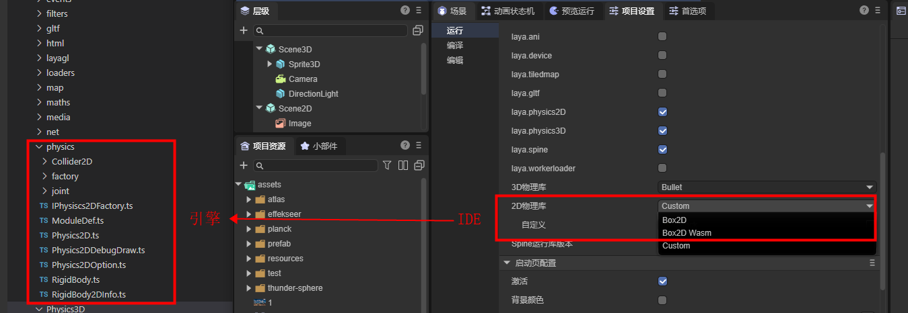
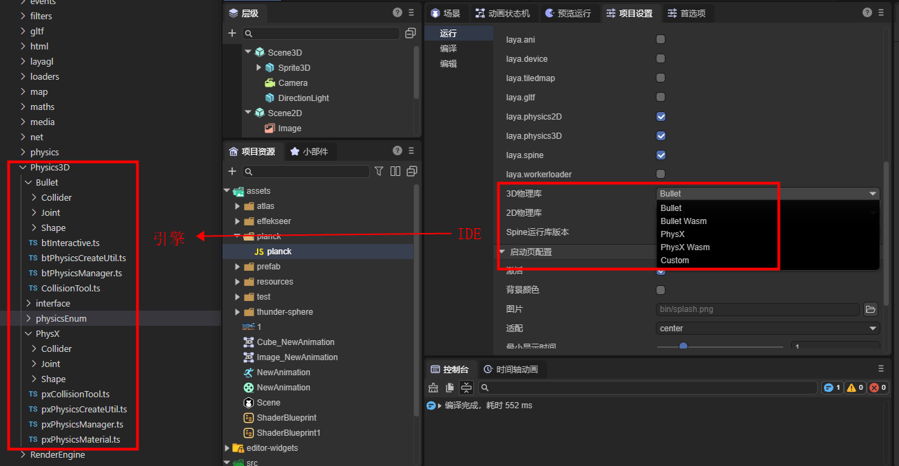
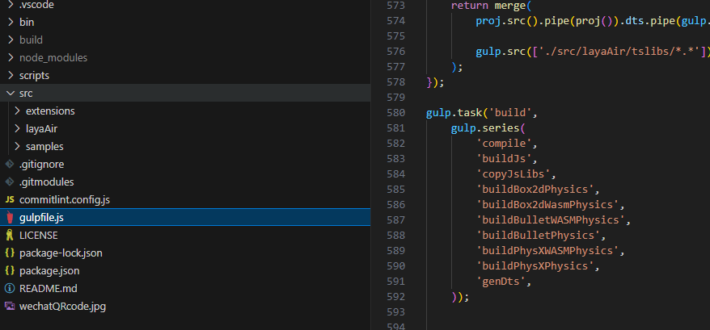
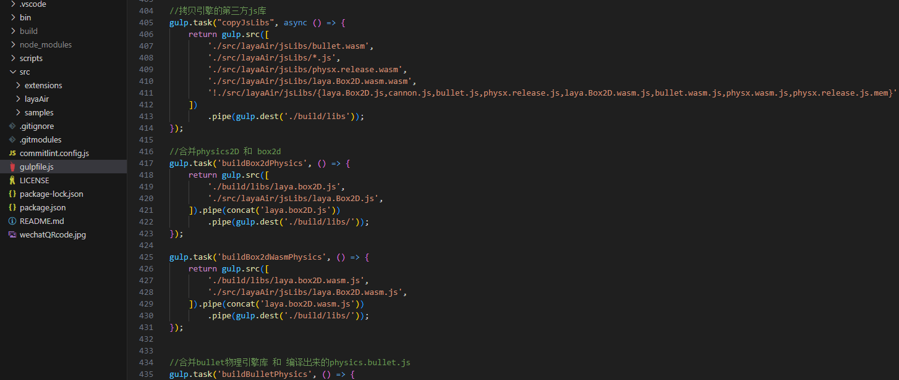
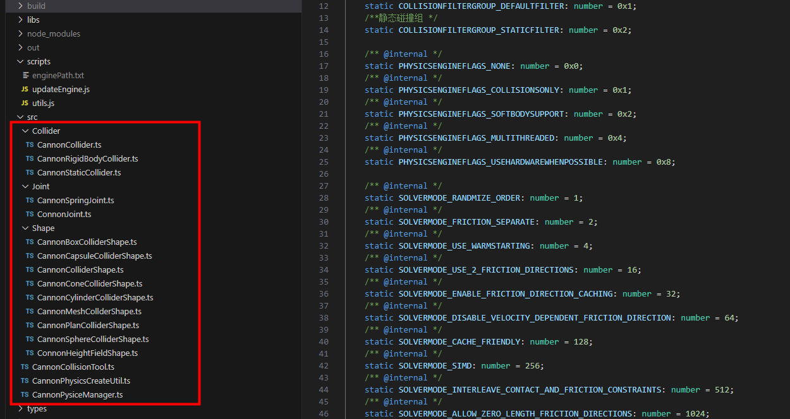
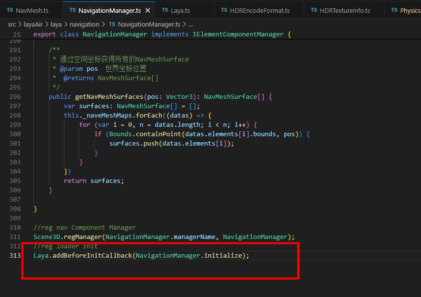
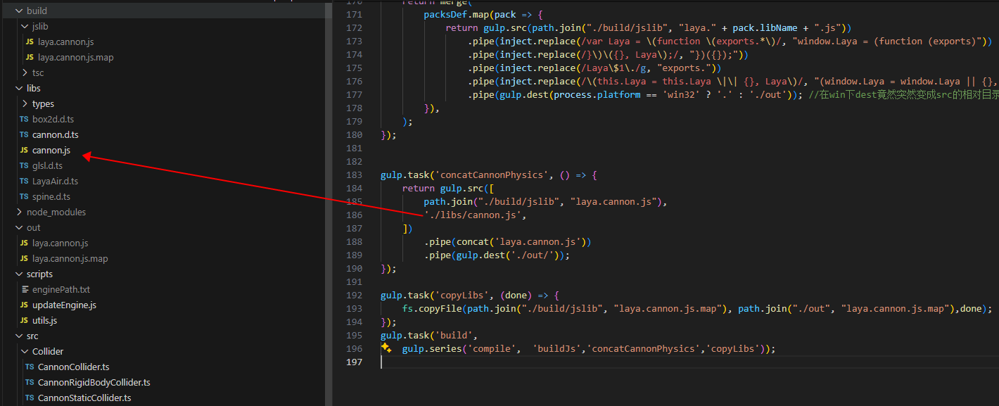
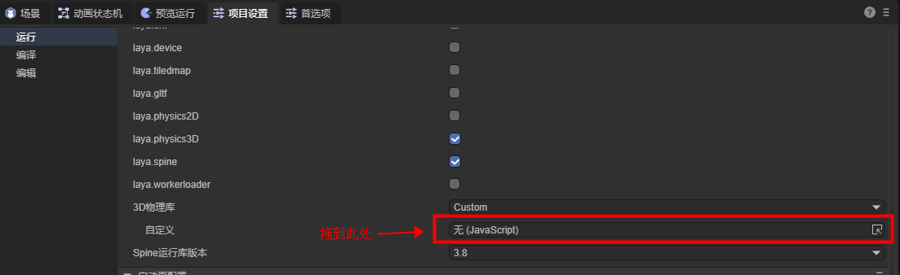

# Custom Physics Engine Library

## 1. Understanding the Built-in Physics Engine

### 1.1 Which Classes Correspond to the Built-in Physics Engine

The LayaAir3 engine has a built-in Box2D physics engine for 2D, corresponding to the classes in the Physics directory of the engine source code, as shown in Figure 1-1:

 

(Figure 1-1)

In 3D, it has built-in Bullet and PhysX physics engines, corresponding to the classes in the Physics3D directory of the engine source code, as shown in Figure 1-2.

 

 (Figure 1-2)

### 1.2 Compiling the Engine as a Physics Library

The built-in physics engine is not directly using a third-party physics engine as it is.

Instead, the interfaces of the third-party physics engine and the interfaces of the LayaAir engine need to be connected one by one, that is, the third-party physics engine is built into the LayaAir engine. In this way, developers can finally switch to use various physics engines directly through the physics interface of the LayaAir engine. And in the IDE, through the way of physical components, visual editing can be carried out.

The physics engine that developers ultimately use is a complete physics library that integrates and packages the physical docking classes based on the third-party physics engine and the LayaAir engine.

The custom physics engine library and the built-in physics engine library of the engine have the same docking process. The only difference is that the built-in engine is docked and built into the open-source engine by the official developers of the engine, while the custom engine is a physics engine library that is docked and integrated by the project developers themselves by understanding and referring to the docking process and interfaces of the engine.

Next, let's understand which class files need to be compiled and integrated into an independent physics engine library by analyzing the compilation script in the engine source code.

First, we open the `build` task in the gulp script. Just by the name of the sub-task, we can clearly see the sub-task `copyJsLibs` for copying the third-party engine library and various sub-tasks for processing the physics engine library, as shown in Figure 2-1.

 

(Figure 2-1)

If you view the code of the task, it will be more clearly seen that in the `copyJsLibs` task, the file rule to be processed is specified by `gulp.src()`, and then the files that meet the conditions are copied to the specified directory through `gulp.dest()` according to this rule. In the task code of the physics engine library, it can also be intuitively seen that each LayaAir physics engine library is a new library after the combination of the LayaAir engine's physics engine docking code and the third-party physics engine JS library.

 

(Figure 2-2)

Of course, in addition to the corresponding third-party physics engine library, a complete physics engine implementation also has basic physical functions such as physical components. These are used as the basic library of the physics engine. Both 2D and 3D have the basic library of the physics engine, namely `laya.physics2D.js` and `laya.physics3D.js`, as shown in Figure 2-3.

 

(Figure 2-3)

By analyzing the compilation process of the engine library, we can understand that the built-in physics engine is divided into three parts: the implementation of the physical basis and physical components of the LayaAir engine, the adaptation library (docking code) of the LayaAir engine and the physics engine, and the third-party physics engine library.

Ultimately, the implementation of the physical basis and physical components of the LayaAir engine forms the LayaAir engine physical basis library, and the LayaAir engine physical adaptation library and the third-party physical library are combined into a complete physical engine library.

## 2. The Process of Customizing the Physics Engine Library

After understanding the structure of the built-in physics engine of LayaAir, in this section, let's understand what developers need to do in the process of customizing the physics engine library.

> Customizing the physics engine requires the ability to read and write engine code. If the custom docking cannot be completed, you can contact WeChat LayaAir_Engine for commercial customization

### 2.1 Select and Obtain the Third-Party Physics Engine Library

Although the built-in physics engines such as Box2D, Bullet, and PhysX are all top-notch and well-known engines internationally. However, some developers also have some specific needs. For example, in some projects, a highly accurate physics engine is not required, only some basic physical characteristics are needed, but the engine library is required to be relatively lightweight. Through the way of customizing the engine library, these developers can choose the most suitable engine for the project.

For example, 2D lightweight physics engine **matter.js** and 3D lightweight physics engine **cannon.js**, etc.

Developers can obtain the source code or compiled engine library of these physics engines by themselves from open-source websites.

Whether compiling the source code into an engine library or obtaining a ready-made JS engine library, the preparation work of one of the three parts of the physics engine library introduced in the previous section, the "third-party physics engine library", is completed.

### 2.2 Adapt the Third-Party Physics Engine

For the other two parts, the LayaAir engine physical basis library does not require developers to rewrite, and the compiled library of the engine can be used by default.

Developers only need to dock the adaptation library of the physics engine. In order to help everyone understand how to dock the third-party physics engine more conveniently, outside the LayaAir engine library, we independently open-sourced a physics engine adaptation library **LayaAir3Physics-Cannon** with the adaptation access of the Cannon physical library as an example, so that developers can understand the entire adaptation process more concisely.

The specific operations are as follows:

First, we clone the project source code of our adapted Cannon.js library through Git. The address is: https://github.com/layabox/LayaAir3Physics-Cannon.git

After cloning the source code project to the local, we configure the compilation environment of the project according to [Open Source Usage Documentation (README.zh-CN.md)](https://github.com/layabox/LayaAir3Physics-Cannon/blob/master/README.zh-CN.md).

In this project source code, the `src` directory is not so complicated. Here only includes the code for the physical engine adaptation. As shown in Figure 3-1:

 

(Figure 3-1)

When we read and understand the adaptation source code under `src`, we can use this source code as a reference to adapt other physics engine libraries.

During the adaptation process, one point needs to be reminded emphatically. If developers need to insert their own initialization process in the scene initialization process, for example, some physics engines use wasm and need to download resources in the initialization stage, then the `Laya.addBeforeInitCallback()` needs to be used to register the method. The code usage example is shown in Figure 3-2.

  

(Figure 3-2)

### 2.3 Merge into a Complete Physics Engine Library

After the adaptation work is completed, developers can refer to the gulp script in the Cannon adaptation source code to compile the physical engine adaptation source code and then merge it with the third-party physical engine library into an independent physical engine library.

In the cannon adaptation source code, we can refer to the build process in the gulp script to analyze what needs to be done.

Here we still take the Cannon source code project as an example and focus on describing which several pieces of work need to be done.

First, developers put the obtained third-party physical engine library in the libs directory,

In this example, `cannon.js` is the original library file of the third-party physical engine. As shown in Figure 3-3, developers can modify gulp to replace it with their own third-party physical engine library.

 

(Figure 3-3)

Second, after the adaptation is completed, modify the generated file name of the adaptation library in the gulp script, replace laya.cannon with the name of their own physical engine library, and then execute the script. The script will automatically complete the compilation and the merging and output of the engine library.

## 3. Using the Custom Physics Engine Library

The merged engine library can be placed in the assets directory under the resource panel of the IDE,

Then for the `2D engine library` or `3D engine library` option, first set `Custom`, and then drag and drop the custom physics engine library file to the custom input box, as shown in Figure 4-1:

 

So far,

The basic process of the custom engine has been introduced.