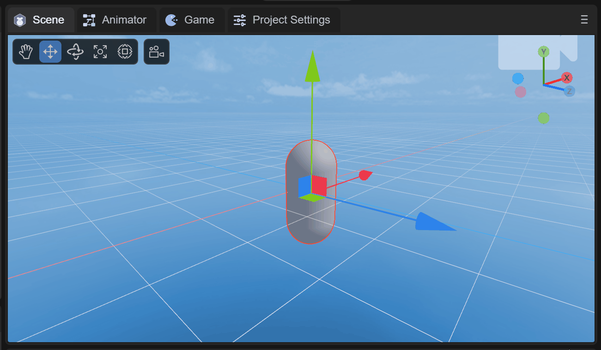
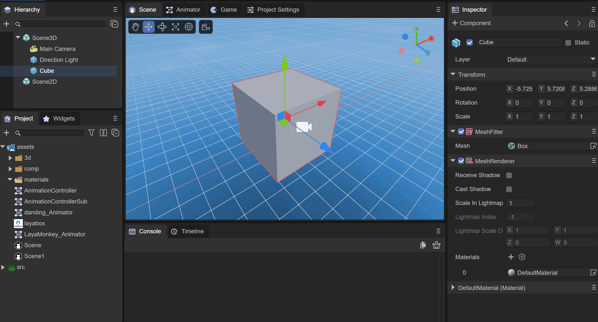
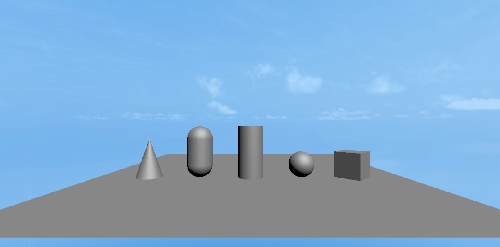

# 3D basic display object


## 1. Overview

3D basic display objects are very important auxiliary tools in the 3D development environment. They are the foundation that can help developers learn and use them in 3D scenes. Often for beginners, by creating and operating 3D basic display objects, they can quickly Understand the basic knowledge of 3D and be familiar with the 3D development environment. At the same time, when there are no other model resources, you can quickly establish concepts, build scenes, add different components, and quickly become familiar with code development. For skilled developers, through 3D basic display objects, they can easily simulate and implement some development needs, or use them to display some development logic, which can greatly improve work efficiency.

Currently, the types of 3D basic display objects that can be created in LayaAir IDE are:

- **Cube**
- **Sphere**
- **Cylinder**
- **Capsule**
- **Cone**
- **Plane**


(Picture 1-1)

As shown in Figure 1-1, let’s take a look at how to create and use these 3D basic objects in the IDE and code.


## 2. Creation and use in IDE

For junior developers, learning to simply create and use 3D basic objects in the IDE is a very important step!


### 2.1 Create objects

In the Hierarchy panel of a 3D scene, you can create a 3D display object under any node or in a blank position by right-clicking the mouse, as shown in animation 2-1.


(Animation 2-1)


The creation of these six basic objects will not be demonstrated one by one. We can choose to create them through the menu as shown in Figure 2-2.


(Figure 2-2)


### 2.2 Basic transformation usage

Movement, rotation, and scaling are the most basic transformation operations for 3D objects, as shown in animation 2-3.



(Animation 2-3)


### 2.3 Property settings

Each 3D basic object has a `MeshRenderer` component. Shadow effects are created by setting `Receive Shadow` to the plane that receives the shadow and `Cast Shadow` to the cube that generates the shadow, as shown in animation 2-4.


(Animation 2-4)

> For shadows, in addition to setting the MeshRenderer of the 3D basic object, you also need to ensure that the Shadow Mode of the Direction Light is not None.


### 2.4 Add components

Each 3D basic object can add components to achieve advanced functions. By adding the 3D physical component Rigidbody3D to the cube, checking the gravity attribute, and finally adding a collision box, the effect of simulating free fall can be achieved, as shown in animation 2-5. Show,


(Animation 2-5)

You can see the effect of the cube falling when running.


(Animation 2-6)

> To run the physical component, you need to check the corresponding engine module in the project settings panel.


### 2.5 Add materials and textures

Each 3D basic object can set the `albedo Texture` texture by creating `Material` and specifying the newly created material in the `MeshRenderer` component, as shown in animation 2-7.



(Animation 2-7)


## 3. Code Creation and Use

Creating and using 3D basic objects through code is also the process by which we understand and become familiar with the LayaAir engine.


### 3.1 Code Creation

#### 3.1.1 `PrimitiveMesh`

Class for creating simple grids

> NOTE: This is not yet the Sprite3D seen in the final scene.

Use `createBox` as an example to see how the API creates a grid:

```typescript
/**
* Create Box grid.
* @param long radius
* @param height number of vertical layers
* @param width number of horizontal layers
* @return
*/
static createBox(long: number = 1, height: number = 1, width: number = 1): Mesh
```

As you can see, through the `createBox` method, you can create a Box grid, and you can also create different vertical and horizontal heights

Therefore, different types of Mesh grids can be created through code:

```typescript
//cube
let box = Laya.PrimitiveMesh.createBox(0.5, 0.5, 0.5);
//sphere
let sphere = Laya.PrimitiveMesh.createSphere(0.25, 20, 20);
//Cylinder
let cylinder = Laya.PrimitiveMesh.createCylinder(0.25, 1, 20);
//capsule body
let capsule = Laya.PrimitiveMesh.createCapsule(0.25, 1, 10, 20);
//Cone
let cone = Laya.PrimitiveMesh.createCone(0.25, 0.75);
//flat
let plane = Laya.PrimitiveMesh.createPlane(6, 6, 10, 1));
```

The created object is a Mesh grid. If we want to create a Sprite3D object that can be seen in the scene, we also need to use the `Laya.MeshSprite3D` class


#### 3.1.2 `MeshSprite3D`

Using the `MeshSprite3D` class, you can pass in the Mesh object through the constructor method to create a `Sprite3D` object that can be seen in the scene, and it is also a `Sprite3D` with a Mesh shape.

The construction method is as follows:

```typescript
/**
* Create a <code>MeshSprite3D</code> instance.
* @param mesh mesh, the default material used by the mesh will be loaded at the same time.
* @param name name.
*/
constructor(mesh: Mesh = null, name: string = null) {
	super(name);
	this._meshFilter = this.addComponent(MeshFilter);
	this._render = this.addComponent(MeshRenderer);
	(mesh) && (this._meshFilter.sharedMesh = mesh);
}
```

The `MeshSprite3D` object creates `MeshFilter` (mesh filter) and `MeshRenderer` (mesh renderer) components.

Finally, we create and add it to the scene through `MeshSprite3D`, the code is as follows:

```typescript
//cube
//Create Box network
let box: Laya.Mesh = Laya.PrimitiveMesh.createBox(0.5, 0.5, 0.5);
//Create MeshSprite3D network
let boxMeshSprite3D: Laya.MeshSprite3D = new Laya.MeshSprite3D(box);
//Add to scene
this.scene.addChild(boxMeshSprite3D);
// 3D transformation
boxMeshSprite3D.transform.position = new Laya.Vector3(2.0, 0.25, 0.6);
boxMeshSprite3D.transform.rotate(new Laya.Vector3(0, 45, 0), false, false);

//sphere
let sphere: Laya.Mesh = Laya.PrimitiveMesh.createSphere(0.25, 20, 20);
let sphereMeshSprite3D: Laya.MeshSprite3D = new Laya.MeshSprite3D(sphere);
this.scene.addChild(sphereMeshSprite3D);
sphereMeshSprite3D.transform.position = new Laya.Vector3(1.0, 0.25, 0.6);

//Cylinder
let cylinder:Laya.Mesh = Laya.PrimitiveMesh.createCylinder(0.25, 1, 20);
let cylinderMeshSprite3D: Laya.MeshSprite3D = new Laya.MeshSprite3D(cylinder);
this.scene.addChild(cylinderMeshSprite3D);
cylinderMeshSprite3D.transform.position = new Laya.Vector3(0, 0.5, 0.6);

//capsule body
let capsule:Laya.Mesh = Laya.PrimitiveMesh.createCapsule(0.25, 1, 10, 20);
let capsuleMeshSprite3D: Laya.MeshSprite3D = new Laya.MeshSprite3D(capsule);
this.scene.addChild(capsuleMeshSprite3D);
capsuleMeshSprite3D.transform.position = new Laya.Vector3(-1.0, 0.5, 0.6);

//Cone
let cone:Laya.Mesh = Laya.PrimitiveMesh.createCone(0.25, 0.75);
let coneMeshSprite3D: Laya.MeshSprite3D = new Laya.MeshSprite3D(cone);
this.scene.addChild(coneMeshSprite3D);
coneMeshSprite3D.transform.position = new Laya.Vector3(-2.0, 0.375, 0.6);

//flat
let plane:Laya.Mesh = Laya.PrimitiveMesh.createPlane(6, 6, 10, 10);
let planeMeshSprite3D: Laya.MeshSprite3D = new Laya.MeshSprite3D(plane);
this.scene.addChild(planeMeshSprite3D);
```

The runtime effect is as follows:



(Figure 3-1)


### 3.2 Basic transformation usage

Using the `Transform3D` class, you can perform basic transformations on 3D basic objects. The code example is as follows:

> The cube in the code is boxMeshSprite3D in Section 3.1.2.

```typescript
//Change the world coordinates of the cube
cube.transform.position = new Laya.Vector3(0, 0, 0);
//Translation of cube
cube.transform.translate( new Laya.Vector3(1, 1, 1));
//Rotation of cube
cube.transform.rotate(new Laya.Vector3(0, 45, 0), false, false);
//Scale of cube
cube.transform.setWorldLossyScale( new Laya.Vector3(2, 2, 2));
```


### 3.3 Property settings

By setting the properties of the `MeshRenderer` component, you can set `Receive Shadow` for the plane that receives the shadow and `Cast Shadow` for the cube that generates the shadow to create a shadow effect. The code example is as follows:

```typescript
//cube creates shadow
cube.meshRenderer.castShadow = true;
//Create plane
let plane = this.scene.addChild(new Laya.MeshSprite3D(Laya.PrimitiveMesh.createPlane(6, 6, 10, 10)));
//Plane receives shadow
plane.meshRenderer.receiveShadow = true;
```

> It is necessary to ensure that the Shadow Mode of Direction Light is not None.


### 3.4 Add components

Each 3D basic object can achieve advanced functions by adding components through code. By adding the 3D physical component Rigidbody3D to the cube, setting the gravity attribute, and finally adding a collision box, the effect of simulating free fall can be achieved. The code example is as follows:

```typescript
//Add Rigidbody3D component
let rigidbody3D : Laya.Rigidbody3D = cube.addComponent(Laya.Rigidbody3D);
//Set gravity
rigidbody3D.overrideGravity = true;
//Create a box shape collider
let boxShape: Laya.BoxColliderShape = new Laya.BoxColliderShape(1, 1, 1);
//Set the collision shape of the box
rigidbody3D.colliderShape = boxShape;
```

> To run the physical component, you need to check the corresponding engine module in the project settings panel.


### 3.5 Add materials and textures

Each 3D basic object can add materials and textures through code. The code example is as follows:

```typescript
//Preload texture resources
let resource: string = "layabox.png";
Laya.loader.load(resource).then( ()=>{
	//Create BlinnPhong material
	let materialBill: Laya.BlinnPhongMaterial = new Laya.BlinnPhongMaterial;
	cube.meshRenderer.material = materialBill;
	//Load texture for material
	let tex = Laya.Loader.getTexture2D("layabox.png");
	//Set the texture
	materialBill.albedoTexture = tex;
} );
```

The runtime effect is as follows:


(Figure 3-2)

