# navMesh

> Version >= LayaAir 3.2

## 一、Profile

In game development, 3D pathfinding is a crucial feature, especially in games that require simulating characters or objects automatically navigating and moving within a three-dimensional space. 3D pathfinding enables game characters to intelligently find the optimal path from one point to another in complex 3D environments while avoiding obstacles and other potential hindrances.

Starting from LayaAir 3.2, a new navMesh is introduced for implementing pathfinding in 3D scenes. In many games, NPCs navigate by running pathfinding algorithms within the navigable areas of the game world. For example, a navigation mesh is a two-dimensional triangular mesh that provides a simple description of the boundaries of navigable areas and connectivity information for path finders.

To implement a navigation mesh in LayaAir-IDE, developers need to add the corresponding navMesh components. Before using it, developers need to check the relevant modules in the project settings panel, as shown in Figure 1-1.

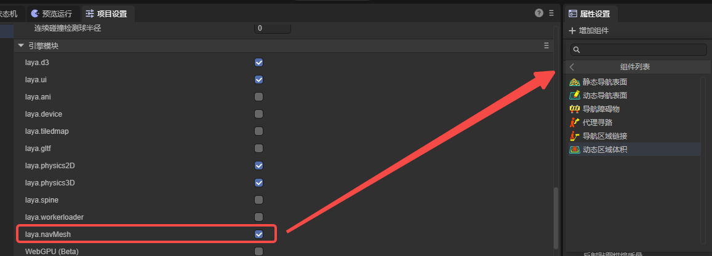

(Figure 1-1)

The following components are used to implement a simple 3D pathfinding.

## 二、Navigation & Pathfinding

To implement a pathfinding process, it is necessary to add navigation meshes, agents, and others. The navigation mesh represents the areas within which characters can move, while agents represent the entities undergoing navigation (such as characters, NPCs, vehicles, etc.). Additionally, navigation area links can be used to enable some special functionalities.

### 2.1 Nav Mesh Surface

As shown in Figure 2-1, there is a simple terrain scene composed of a Plane and several cubes forming Gates. To implement pathfinding navigation in this scene, you first need to add a `Nav Mesh Surface` component to the root node of the terrain.

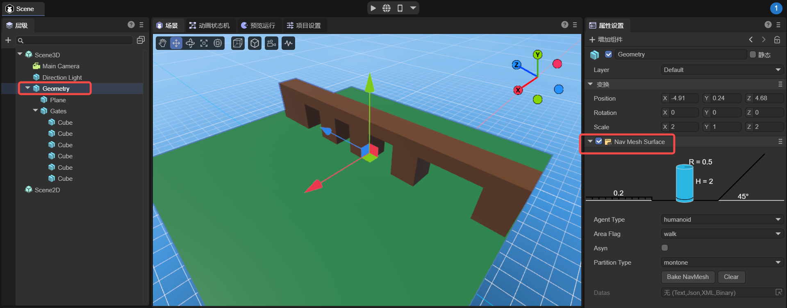

（Figure 2-1）

The static navigation surface component added is used to generate a navigation mesh which is essential for implementing pathfinding. It converts walkable surfaces in the environment (ground, platforms, slopes, etc.) into a polygon mesh, containing data that is globally static.

The static navigation surface component added in LayaAir-IDE is shown in Figure 2-2. Below, we will introduce its properties.

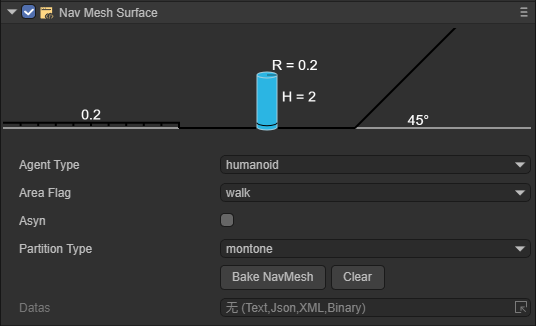

（Figure 2-2）

Below, we will introduce its properties.

#### 2.1.1 agentType

It is used to specify the agent type for pathfinding on the Nav Mesh Surface. In the pathfinding system, an agent is an abstract concept that represents the entities navigating the terrain, such as characters, NPCs, vehicles, etc., in a game. Different types of agents have various characteristics and restrictions during pathfinding, such as size, mode of movement, and types of areas they can traverse. The purpose of specifying agent types is to allow developers to flexibly set and adjust local pathfinding parameters based on different types of pathfinding subjects in the game, to meet the game's requirements.

The default value is Humanoid, indicating navigation settings suitable for humanoid characters, which applies to most game scenarios involving humanoid navigation.

As shown in Figures 2-3, developers can open the configuration interface and add custom agent types by selecting the `open Agent Settings` option.

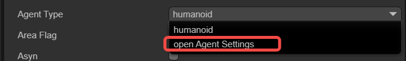

（Figure 2-3）

The configuration page for agents is shown in Figure 2-4.

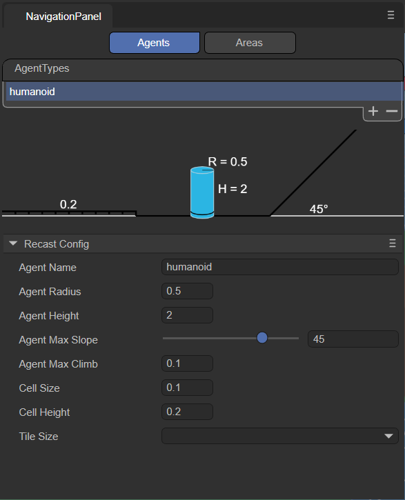

（Figure 2-4）

Note that this page is not for adjusting the agent itself, but rather for adjusting the terrain applicable to that agent. The meanings of the various parameters are explained below:

##### `agentName`：

Name of the Agent type applicable on the navigation mesh surface. The name entered here will be consistent with the option name at the agentType, as shown in Figure 2-5.

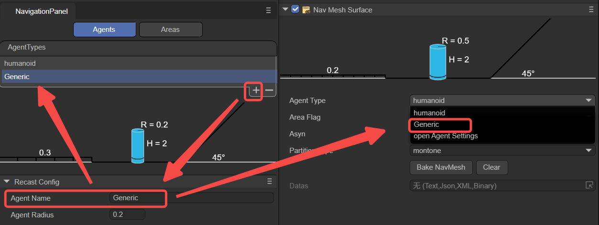

（Figure 2-5）

##### `agentRadius`：

This value determines the minimum distance between the Agent and obstacles during navigation. A larger radius will keep the Agent at a greater distance from obstacles. This parameter adjusts the parameter R shown in Figure 2-6.

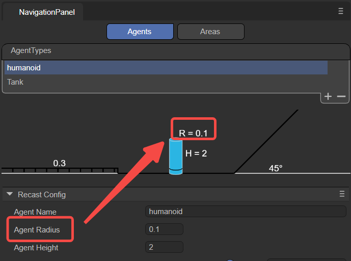

（Figure 2-6）

##### `agentHeight`：

This value determines the height of the space that the Agent can pass through. Agents can only navigate in areas where the height is equal to or greater than their own height. This parameter adjusts the parameter H shown in Figure 2-7.

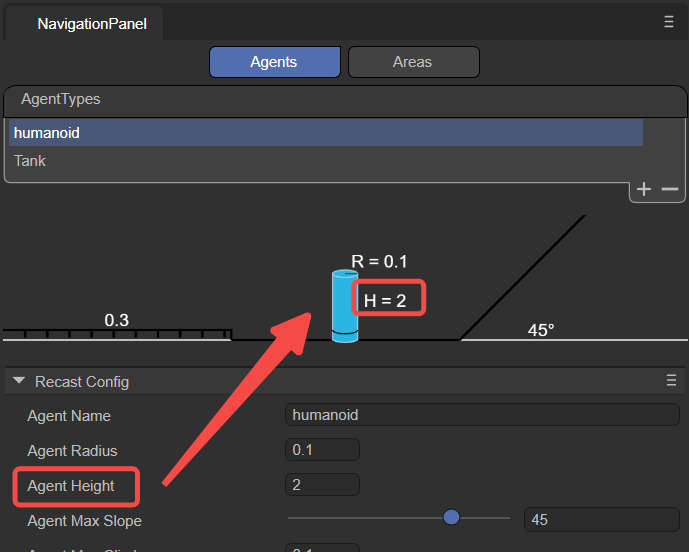

（Figure 2-7）

##### `agentMaxSlope`：

The maximum slope angle that the Agent can navigate. Slopes steeper than this angle will be considered impassable areas.

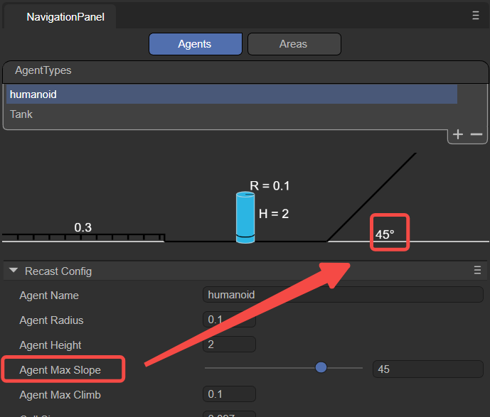

（Figure 2-8）

##### `agentMaxClimb`：

The maximum height an Agent can climb. This value determines the maximum height of the vertical wall surfaces that the Agent can climb.

##### `cellSize`：

Cell size of the navigation mesh. Smaller cell sizes produce a more detailed navigation mesh, but increase memory usage and computational cost.

##### `cellHeight`：

Height of each cell in the navigation mesh. Smaller cell heights result in a more accurate navigation mesh, allowing characters to navigate more precisely in the vertical direction, such as over steps or slopes, but also increase memory usage.

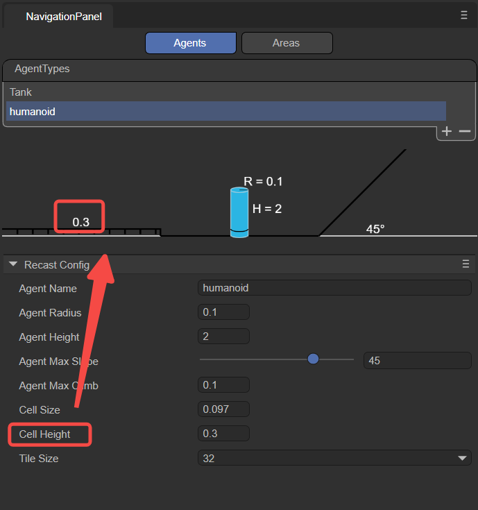

（Figure 2-9）

##### `tileSize`：

Tile size of the navigation mesh. The navigation mesh can be divided into multiple tiles, allowing for more efficient generation and loading of navigation data in large scenes.

#### 2.1.2 areaFlag

It is used to mark the area type of the current Nav Mesh Surface, such as walkable areas, water, obstacle zones, etc. The areaFlag can influence the agent's preferences and avoidance behaviors towards different areas during pathfinding.

As shown in Figure 2-10, developers can click on the `open Area Settings` option to open the configuration interface and add new custom areaFlag types.

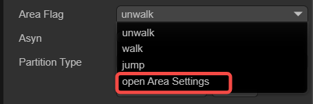

（Figure 2-10）

The configuration interface for Areas is shown in Figure 2-11.

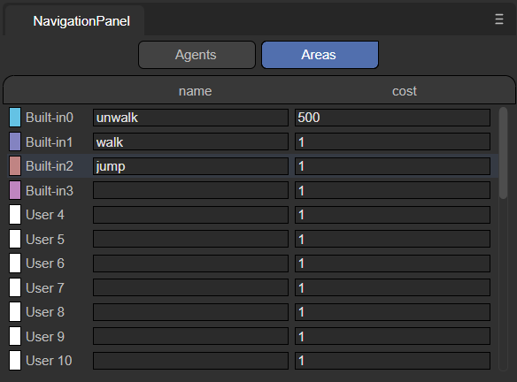

（Figure 2-11）

Below is an explanation of the meanings of each parameter.

##### `name`：

Name of the area type: The name filled here should match that selected in the areaFlag option, as shown in Figure 2-12.

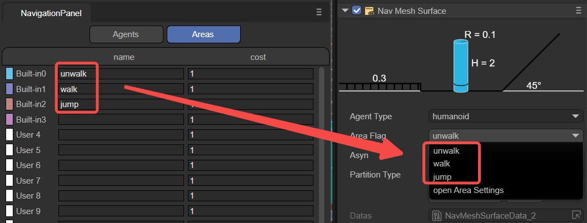

（Figure 2-12）

Developers can also add custom names through the name value, allowing developers to specify actions performed by the agent when it passes through this Area in the code.

##### `cost`：

Define the relative cost or difficulty for the agent to cross this type of surface during navigation. It is usually a positive number, where a higher value indicates a higher cost or more difficulty to traverse the surface. For instance, the cost of moving across water might be set at 5, whereas the cost for ordinary ground might be set at 1, indicating that crossing water is more difficult compared to ordinary ground.

Overall, by setting different areaFlags, developers can control how agents interact with various surface types during navigation. Agents will prioritize paths with lower Costs, avoiding surfaces with higher Costs. Developers can set appropriate areaFlag and Cost values for different surface types according to their needs, to influence the navigation behavior of agents.

#### 2.1.3 asyn

Indicates whether to enable the function of generating navigation meshes asynchronously. When "Async" is checked, the process of generating the navigation mesh will proceed asynchronously in the background, without blocking the execution of the main thread. Enabling asynchronous generation ensures that only one tile is generated per frame during gameplay, enhancing the smoothness of scene loading and editing.

#### 2.1.4 partitionType

Used to specify the partitioning method for navigation meshes, as shown in Figure 2-13, there are three options: Monotone, Watershed, and Layers.

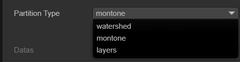

（Figure 2-13）

##### `Monotone`：

The Monotone partitioning algorithm divides the NavMesh surface into convex polygonal regions. It produces NavMesh regions with simple shapes and smooth edges, suitable for simple scenes or when high accuracy in NavMesh shape is not required. Monotone partitioning generates NavMesh quickly and uses relatively less memory. However, for complex scenes, it may generate NavMeshes that are not precise enough.

##### `Watershed`：

The Watershed partitioning algorithm divides the NavMesh surface into different regions based on a height map. By simulating the process of water flowing from high to low areas, it splits the NavMesh surface into multiple "watersheds." Watershed partitioning better adapts to complex scenes, producing more precise and natural NavMesh regions. Compared to Monotone partitioning, Watershed partitioning has slower NavMesh generation speed and uses more memory, making it suitable for scenes with higher demands on NavMesh quality.

##### `Layer`：

The Layer partitioning algorithm divides the NavMesh surface according to a specified hierarchical structure. By setting the Layer properties, different game objects can be assigned to different layers, thus creating a layered NavMesh. NavMeshes between layers are independent, and agents can only navigate and move within the same layer. Layer partitioning is suitable for scenarios requiring different navigation rules for different areas, such as separating indoors from outdoors. When using Layer partitioning, it is important to correctly set the game objects' Layer properties to ensure proper NavMesh generation.

Overall, choosing the appropriate partitionType depends on the specific requirements of the project and the complexity of the scene. For simple scenes or cases where NavMesh quality is not a major concern, Monotone partitioning can be used. For complex scenes or when more precise NavMesh is needed, Watersheed partitioning can be utilized. If different navigation rules need to be applied to different areas, Layer partitioning should be considered. It is advisable to test and compare different partitionTypes during development to choose the most suitable partitioning strategy based on actual results and performance requirements.

#### 2.1.5 datas

After clicking the `Bake NavMesh` button, it is possible to bake all renderable nodes and their sub-node models, except for dynamic nodes. This means that the generation of the navigation mesh (baking) is manually triggered and will commence immediately after clicking the `Bake NavMesh` button. The resulting file (.bin) will be saved in a newly created folder within the assets directory (named after the scene where the model is located). Ultimately, as shown in Figure 2-14, this file will automatically be added to the datas attribute.

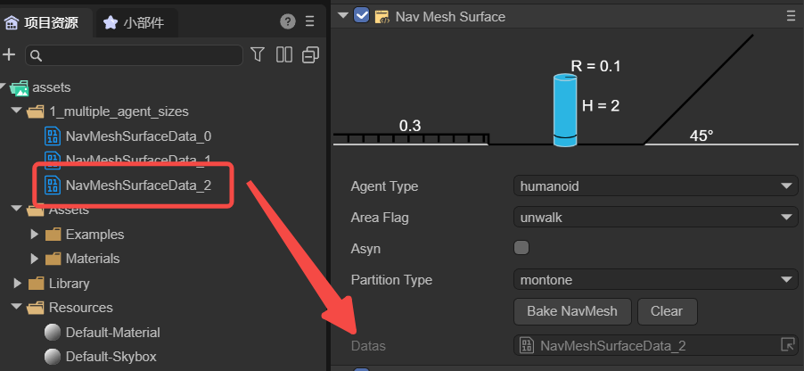

（Figure 2-14）

Generally speaking, baking a navigation mesh is often done after the scene editing is complete to ensure that the navigation mesh is consistent with the latest state of the scene. If there are any movements, rotations, or other changes made to the scene nodes and sub-nodes, it is necessary to rebake the node data (it cannot exist within prefabs, and if dragged into the scene from a prefab, the data must be rebaked). This is because the baked navMeshSurface will not dynamically change with the scene. Developers can first click the `clear` button to clear the existing datas, and then rebake.

### 2.2 NavModifleBase

Sometimes, a scene requires dynamic nodes such as moving floors or temporary obstacles. These necessitate changes to the navigation mesh in response to the modifications in the nodes. The `Nav Mesh Modifier Surface` and `Nav Mesh Obstacles` components can achieve this functionality. Both inherit from the dynamic node base class `NavModifleBase`, whose data can be dynamically added under the `NavMeshSurface` class nodes, facilitating dynamic changes in scene paths. The two subclasses are introduced below.

#### 2.2.1 Nav Mesh Modifier Surface

The Dynamic Navigation Surface component is used to dynamically modify the navigation mesh, allowing for a more dynamic and interactive game scene. For example, if it is necessary to move certain areas of the navigation mesh during game runtime, a Dynamic Navigation Surface component can be added to that area. This area will overlay or modify the existing navigation mesh, and users can customize the shape of the modification area, as well as mark types of walkable areas.

As shown in Figure 3-1, a Plane2 plane is added to the scene's Geometry, and a Dynamic Navigation Surface component is attached to it.

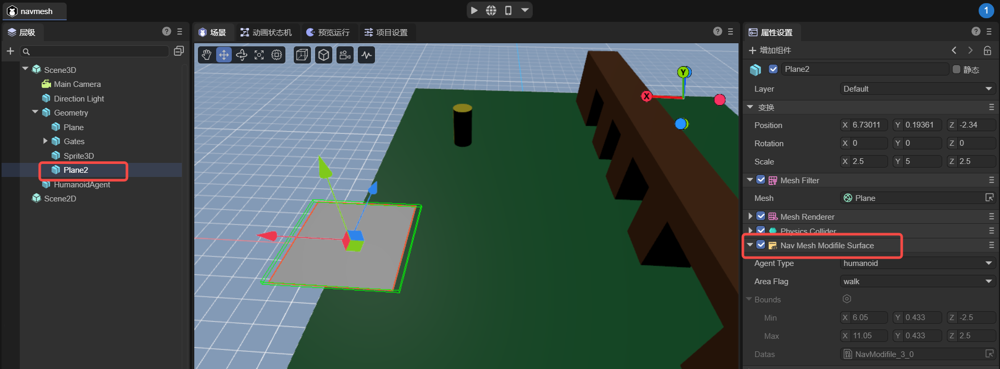

（Figure 3-1）

It should be noted that Plane2 needs to be positioned under the Geometry's child nodes and baked with Geometry before the project runs. Thus, Plane2 will generate a navigation mesh as shown in Figure 3-2.

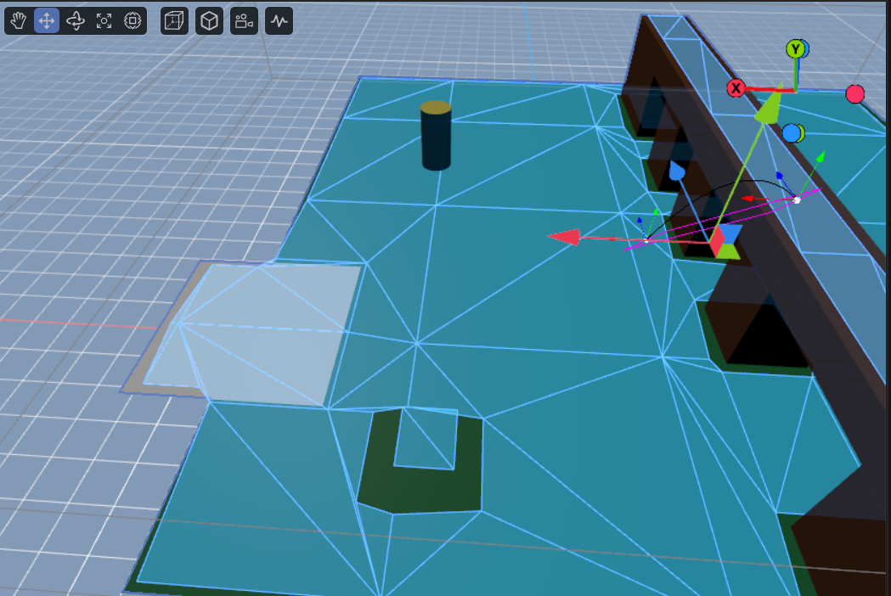

（Figure 3-2）

Although the navigation meshes of both Geometry and Plane2 are baked together, Geometry’s navigation mesh is static, whereas Plane2’s navigation mesh is dynamic. That is, during project runtime, Geometry's navigation mesh will not move with its model, but Plane2’s navigation mesh will move with its model.

If developers need to add dynamic navigation meshes through code, these must be pre-baked and stored in prefabs so they can be dynamically added during project runtime.

Furthermore, the node's own position, rotation, and scale do not affect data changes, but the position, rotation, and scale of all child nodes do affect data changes. If nodes are added or removed, the rendering nodes need to be re-baked.

#### 2.2.2 Nav  Mesh Obstacles

The Navigation Obstacle component is used to represent components that act as obstacles in the pathfinding process. By placing obstacle objects in the scene and setting the type and shape of the obstacles, they can influence the generation of the navigation mesh and pathfinding calculations.

As shown in Figure 3-3, obstacles shaped as boxes and cylinders have been implemented. Here, the bounds represent the terrain area, which does not require manual configuration and is automatically generated after baking.

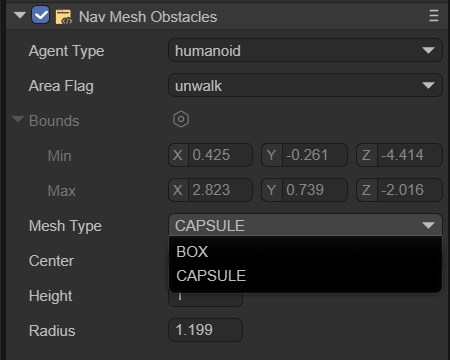

（Figure 3-3）

##### BOX

As shown in Figure 3-4, the box-shaped obstacle allows setting two parameters: Center and Size.

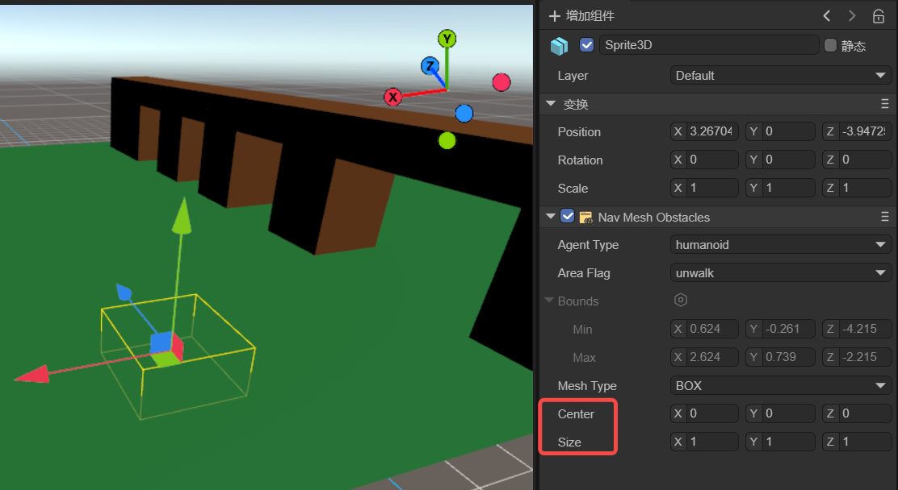

（Figure 3-4）

`center`：Center refers to the central position of the box.

`size`：Size refers to the width, height, and length of the box. These values can be adjusted to match the size of the obstacle.

##### CAPSULE

As shown in Figure 3-5, the cylindrical-shaped obstacle allows setting three parameters: Center, Height, and Radius.

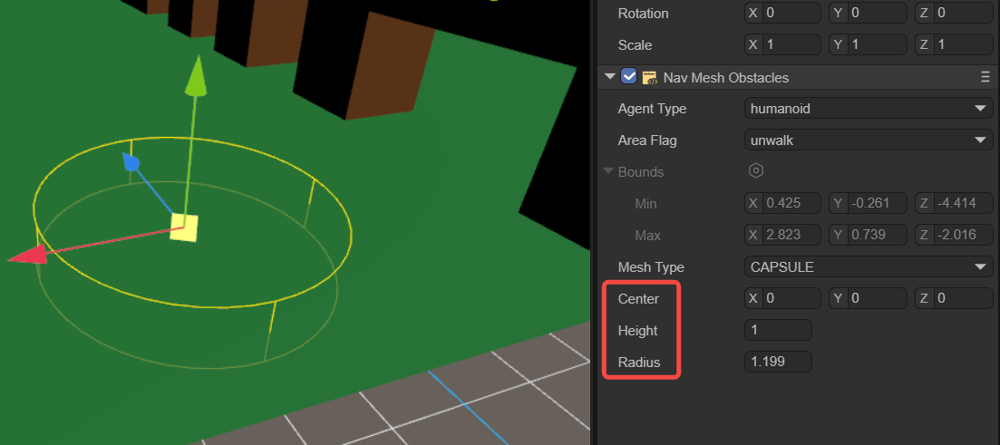

（Figure 3-5）

`center`：Center refers to the central position of the cylinder.

`height`：Height affects the vertical height of the cylinder.

`radius`：Radius is the radius of the cylinder's base.

### 2.3 Nav Agent

Navigation agent pathfinding is a component in navigation systems used to control pathfinding entities, such as characters or objects (referred to as navigation agents), as they move and navigate across a navigation mesh. It is the principal component through which the pathfinding entity interacts with the navigation system, and is responsible for managing the entity's movement, obstacle avoidance, and route planning. This component is key to enabling pathfinding entities to autonomously navigate and move within complex environments. It works in coordination with other navigation components (such as static navigation surfaces and navigation obstacles) to deliver a comprehensive navigation solution.

Navigation agents are solely cylindrical in shape, which simplifies calculations and substantially reduces the complexity of their forms. Additionally, the cylindrical shape lacks sharp edges, which allows the agent to move more smoothly in the environment, avoiding being caught or struggling to cross over small obstacles. Overall, the use of a cylindrical shape for the Nav Agent's collision geometry is a result of balancing navigation performance, adaptability, and resource consumption.

As shown in Figure 4-1, once the agentType is selected, developers can adjust several properties of the navigation agent.

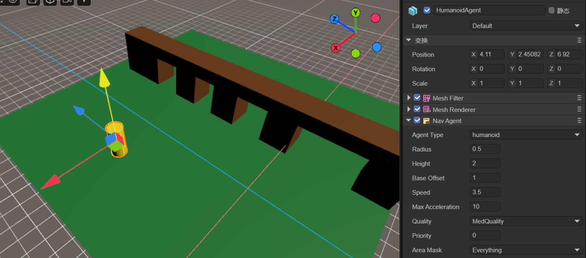

（Figure 4-1）

`Radius`：Set the agent's collision radius. This determines the occupation area of the agent on the navigation mesh and affects its collision detection with obstacles.

`Height`：Set the agent's collision height. This determines the agent's height on the navigation mesh and affects its collision detection with obstacles.

`Base Offset`：Set the agent's vertical offset on the navigation mesh. This allows the agent's collider to hover at a certain height above the navigation mesh.

`Speed`：Set the agent's maximum movement speed. A higher speed allows the agent to reach the target point faster.

`Max Acceleration`：Set the agent's maximum acceleration. This determines the agent's acceleration when starting to move, stopping, or changing direction.

`Quality`：Define the agent's avoidance quality. This affects the accuracy and efficiency of the path calculation on the navigation mesh; higher quality can produce more accurate and optimized paths but may increase computational costs.

`Priority`：Set the agent's avoidance priority. Higher priorities allow the agent to have a higher priority in pathfinding and obstacle avoidance. The smaller the number, the higher the priority.

`Area Mask`：Set the types of navigable areas the agent can pass through. This can restrict the agent to move only within specific types of areas.

### 2.4 Nav Mesh Link

Navigation Area Link Component is a part of the navigation system used to connect two different navigational grid surfaces. It allows for the creation of links between navigation grids by specifying the starting point and the endpoint of movement, enabling characters to move along these links, thereby facilitating pathfinding between different navigation areas. This is particularly useful in game scenes, especially when there are multiple discontinuous walkable areas such as platforms, floors, etc.

As shown in Figure 5-1, when an agent needs to find a path from the lower plane to the upper plane, the Navigation Area Link Component is used.

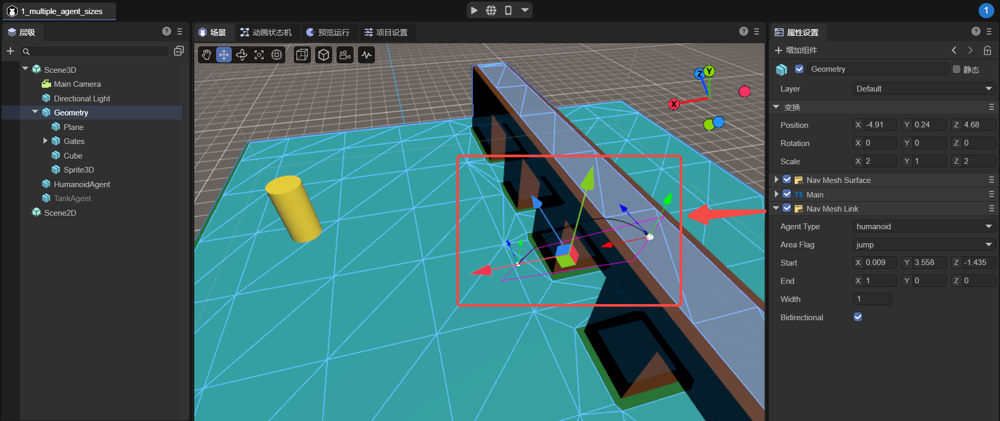

（Figure 5-1）

`start`：The start position of the link specifies the location and direction of the link's starting point, and the link will begin from this position.

`end`：The end position of the link specifies the location and direction of the link's endpoint, and the link will conclude at this position.

`width`：The width of the link determines the size of the passable area of the link.

`bidirectional`：Whether it is a bidirectional link. If not selected, the link can only be one way; agents can only move from the starting point to the endpoint, not from the endpoint to the starting point.

### 2.5 Nav Mesh Modifier Volume

The Dynamic Volume Component is a component used in navigation systems to modify the properties of the navigation mesh within a volumetric area. It allows the definition of a three-dimensional area in the scene, typically represented by a box collider, which can be resized and moved.

Developers can set different areaFlags for the modification area, setting a distinct cost value for this area. This cost value affects the cost calculation when finding a path through this area. A higher cost value will make characters tend to avoid the area, whereas a lower cost value will encourage characters to pass through it.

For instance, as shown in Figure 6-1, the agent moves from point A to point B and encounters a dynamic volume in the middle, with its areaFlag set to 'unwalk', indicating it is impassable. Thus, the agent will navigate around this area during pathfinding.

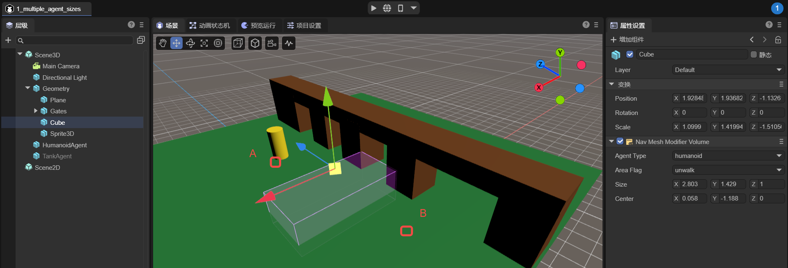

（Figure 6-1）
