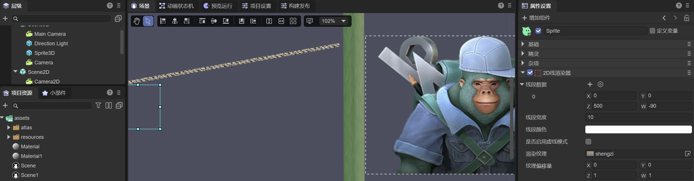
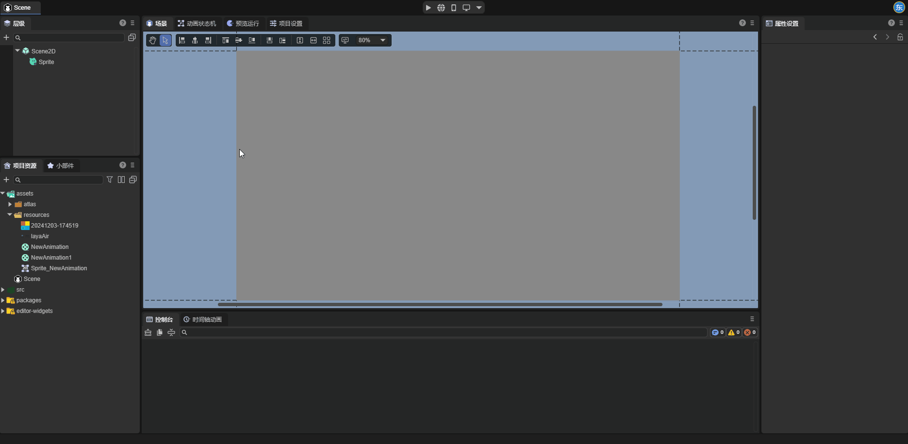
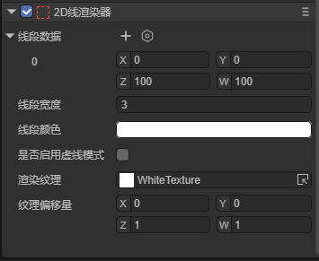
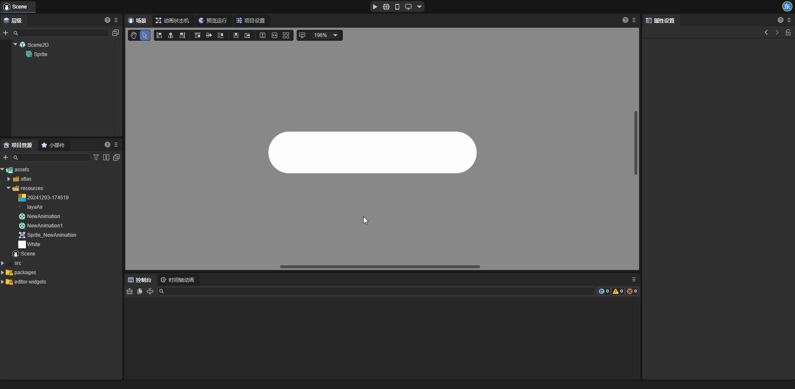
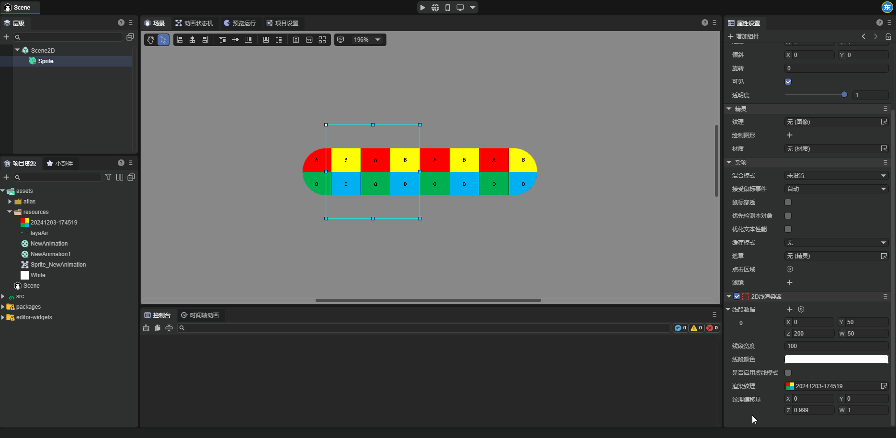
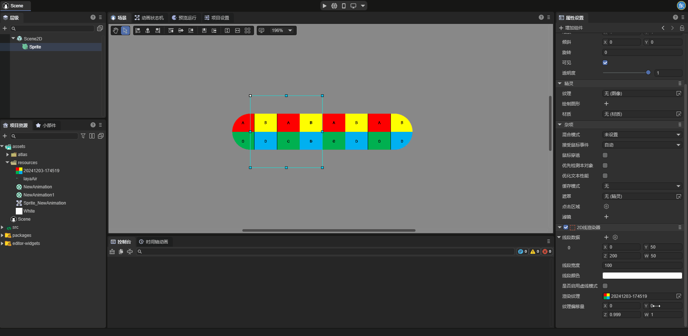
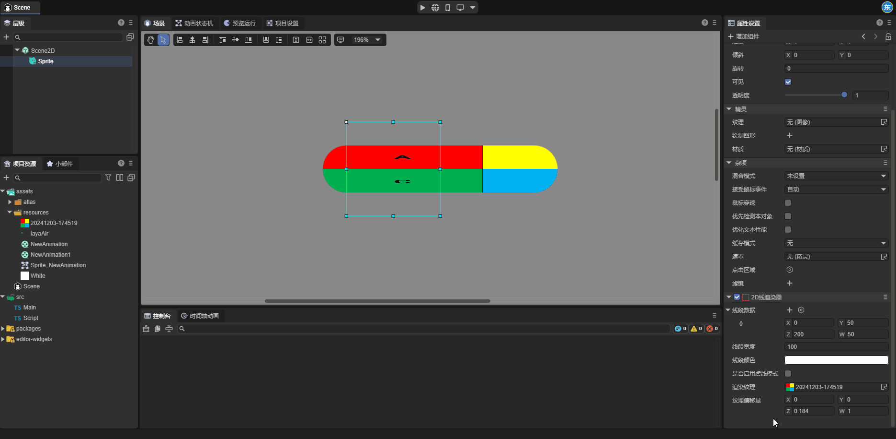
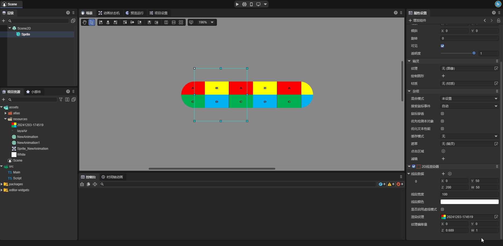
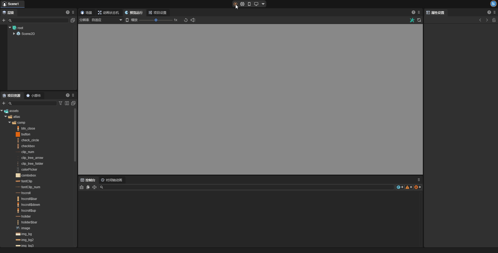

# 2D Line Renderer
## 1. Overview

Although the LayaAir engine provides the Graphics API for drawing line segments and polyline, starting from LayaAir 3.3, a more advanced 2D line renderer (Line2DRender) is provided. It not only has the ability to draw lines like Graphics but also supports creating dashed lines and setting materials and textures for line segments, enabling 2D lines to receive light and have more stunning line shape effects, such as ropes, gradient lines, line borders, and dynamic textures on the lines, etc.

Note: Considering performance, when it can be achieved with Graphics, it is recommended to use Graphics for drawing lines first.



(Figure 1-1)

As shown in Figure 1-1, we have created ropes, gradient lines, and image borders in the scene through the line renderer. Let's start to introduce how to create and use the line renderer in the IDE.

## 2. Creation and Use in the IDE

### 2.1 Adding the 2D Line Renderer Component

Select a 2D node and add a 2D line renderer component (Line2DRender) to the node in the property settings panel.



(Figure 2-1-1)

After the component is added to the node, a line segment will be created by default.

### 2.2 Property Settings

As shown in Figure 2-2-1, the 2D line renderer has the following properties:

 

(Figure 2-2-1)

| Property                                          | Function                                                     |
| ------------------------------------------------- | ------------------------------------------------------------ |
| Render Layer (layer)                              | Used for the layer affected by the layer mask of the 2D light component |
| Material (sharedMaterial)                         | Set a custom 2D shader material. If not set, the engine will use the default material |
| Line Segment Data (positions)                     | Each set of data represents a line segment on the 2D node, where the `X,Y` values are the start point of the line segment, and the `Z,W` values are the end point of the line segment. Developers can also visually edit the start and end points of the line segment in the editing 2D line segment state. |
| Line Width (lineWidth)                            | The width of the line segment, in pixels; the width of the line segment will not change with the scaling of the node. |
| Line Color (color)                                | The color of the line segment, which, together with the rendered texture and material, determines the final display effect of the line segment. |
| Whether to Enable Dashed Mode (enableDashedModle) | After enabling this property, the line segment will become a dashed line. |
| Dashed Length (dashedLength)                      | A property that can be set after enabling the dashed mode. This property determines the length of each cycle of the dashed line. |
| Percentage of Dashed Interval (dashedPercent)     | The percentage of the non-blank area in the dashed line to the length of the line segment. |
| Dashed Offset (dashedOffset)                      | The overall left or right movement distance of each cycle on the dashed line. |
| Render Texture (texture)                          | The texture applied to the line segment. This property will be explained in detail later |
| Texture Offset (tillOffset)                       | Represents the offset and scaling values of the texture on the line segment. The `X,Y` values are the offset values of the texture; the `Z,W` values are the scaling values of the texture. |

### 2.3 Render Texture of the Line Segment

The 2D line renderer can set the render texture (Texture) for the line segment to achieve effects such as gradient lines. Developers can set the texture of the line segment in the IDE.

Here, for ease of observation, we set the line width to 100.



(Figure 2-3-1)

The set texture will be displayed on the line segment in a loop. Developers can set the texture offset (TillOffset) by themselves. The `X,Y` values in the texture offset are used to control the offset of the texture, and the `Z,W` values are used to control the scaling of the texture. Here, we intuitively feel the usage of the texture offset through four examples.

When we change the `X` attribute value of the texture offset, as shown in Figure 2-3-2, the texture translates along the direction of the line segment:



(Figure 2-3-2)

When we change the `Y` attribute value of the texture offset, as shown in Figure 2-3-3, the texture translates perpendicularly to the direction of the line segment:



(Figure 2-3-3)

When we change the `Z` attribute value of the texture offset, as shown in Figure 2-3-4, it can be found that the texture scales along the direction of the line segment:



(Figure 2-3-4)

When we change the `W` attribute value of the texture offset, as shown in Figure 2-3-5, it can be found that the texture scales perpendicularly to the direction of the line segment:



(Figure 2-3-5)

### 2.4 Comparing the 2D Line Renderer and Graphics for Drawing Line Segments

There is another tool, Graphics, in the LayaAir engine that can be used to draw line segments.


Here we compare the differences between the two.

The first is creating dashed lines. For the 2D line renderer, after the developer enables the Whether to Enable Dashed Mode property, the line segment will become a dashed line, while Graphics cannot draw dashed lines when drawing line segments.

The second is the render texture. The 2D line renderer can set the render texture to achieve various effects (such as gradient lines, ropes, etc.), while Graphics cannot set the render texture when drawing line segments.

The third is that the objects of the properties are different. The properties set by the 2D line renderer will act on all line segments in the renderer, while each line segment in Graphics has independent property values.

## 3. Using the 2D Line Renderer Component in Code

During the game development process, developers can also dynamically create the line renderer component and create arbitrary graphic line segments through script code. The example code is as follows:

```typescript
const { regClass} = Laya;

@regClass()
/**
 * The drawing line example script based on the 2D line renderer
 * Note: The events of the script are based on the width and height of the node, so the drawn graphics are also within the width and height range.
 */
 export class DrawLine extends Laya.Script {

    declare owner: Laya.Sprite;

    line2DRender: Laya.Line2DRender;
    lastMousePos: number[] = [];
    isDrawing: boolean = false; // Mark whether it is currently drawing

    // Executed after the component is activated. At this time, all nodes and components have been created. This method is executed only once
    onEnable(): void {
        // Add the 2D line renderer component
        this.line2DRender = this.owner.addComponent(Laya.Line2DRender);
        // Set the width of the line
        this.line2DRender.lineWidth = 5;
    }

    // Start drawing when the mouse is pressed
    onMouseDown(evt: Laya.Event): void {
        this.isDrawing = true;
        // Record the starting point
        this.lastMousePos[0] = evt.stageX - this.owner.x;
        this.lastMousePos[1] = evt.stageY - this.owner.y;
    }

    // Stop drawing when the mouse is released
    onMouseUp(): void {
        this.isDrawing = false;
        this.lastMousePos.length = 0; // Clear the previous point
    }

    // Draw the line segment when the mouse moves (only when pressed)
    onMouseMove(evt: Laya.Event): void {
        if (!this.isDrawing || this.lastMousePos.length === 0) return;

        const x = evt.stageX - this.owner.x;
        const y = evt.stageY - this.owner.y;
     
        // Add the line segment
        this.line2DRender.addPoint(this.lastMousePos[0], this.lastMousePos[1], x, y);
     
        // Update the coordinates of the last point
        this.lastMousePos[0] = x;
        this.lastMousePos[1] = y;
    }
 }
```

After saving the above code, drag it to the sprite node in the scene and run it. The effect is as follows:



(Figure 3-1)