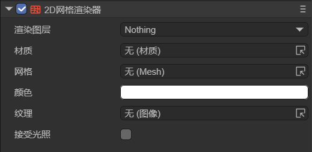
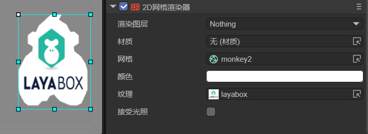
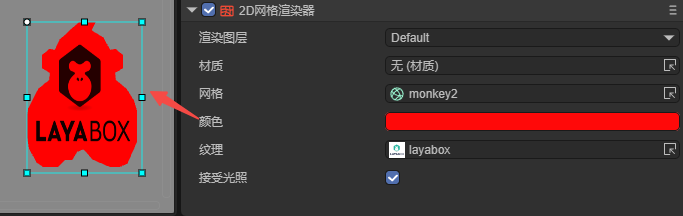

# 2D Grid Render

## 1. Introduction

The Mesh 2D Render is used to display and render 2D Mesh  in 2D scenes. It supports texture rendering, allows setting the rendering color, and can add custom materials and receive 2D lighting effects. Developers can use it to create complex 2D graphic effects, support custom grid shapes, and is suitable for making 2D game elements that require precise grid control.

In game development, the Mesh 2D Render can achieve more complex and detailed visual effects in 2D games. For example, creating 2D characters with special lighting effects, creating 2D objects with complex shapes, and implementing complex 2D special effects.

In conclusion, this component can help developers break through the limitations of traditional 2D rendering and create more rich and unique effects.

## 2. Usage in LayaAir-IDE

In LayaAir-IDE, create a sprite and add the Mesh 2D Render component to the sprite, as shown in Animation 2-1.


(Animation 2-1)

The component properties after addition are shown in Figure 2-2,



(Figure 2-2)

Among them, the `Render Layer` and `Receive Lighting` properties are related to lighting. For specific usage, refer to the documentation of [2D Light](../../BaseLight2D/readme.md). The following introduces other properties separately:

### 2.1 Materials

The Mesh 2D Render supports adding custom materials. In LayaAir-IDE, the default created material is Basic 2D Rendering (BaseRender2D), as shown in Figure 2-3,


(Figure 2-3)

Add the material to the material property of the Mesh 2D Render. Developers can also change this shader template to customize the effect.

> For the usage of 2D shader, please refer to the documentation [Custom 2D Shader](../../../../../2D/advanced/customShader/readme.md).

As shown in Figure 2-4, a gradient effect is achieved using a custom Shader,


(Figure 2-4)

The code of this shader is as follows,

```glsl
Shader3D Start
{
    type:Shader3D,
    name:baseRender2D,
    enableInstancing:true,
    supportReflectionProbe:true,
    shaderType:2,
    uniformMap:{
        u_gradientDirection: {type: Vector2, default:[1,1]},    // Gradient direction
        u_gradientStartColor: {type:Vector4, default:[1,1,1,1]},       // Gradient start color
        u_gradientEndColor: {type:Vector4, default:[1,1,1,1]}        // Gradient end color    
    },
    attributeMap: {
        a_position: Vector4,
        a_color: Vector4,
        a_uv: Vector2,
    },
    defines: {
        BASERENDER2D: { type: bool, default: true }
    }
    shaderPass:[
        {
            pipeline:Forward,
            VS:baseRenderVS,
            FS:baseRenderPS
        }
    ]
}
Shader3D End

GLSL Start
#defineGLSL baseRenderVS

    #define SHADER_NAME baseRender2D
    
    #include "Sprite2DVertex.glsl";
    
    void main() {
        vec4 pos;
        // Calculate the position first, and then perform clipping
        getPosition(pos);
        vertexInfo info;
        getVertexInfo(info);
    
        v_texcoord = info.uv;
        v_color = info.color;
    
        #ifdef LIGHT_AND_SHADOW
            lightAndShadow(info);
        #endif
    
        gl_Position = pos;
    }

#endGLSL

#defineGLSL baseRenderPS
    #define SHADER_NAME baseRender2D
    #if defined(GL_FRAGMENT_PRECISION_HIGH) 
    precision highp float;
    #else
    precision mediump float;
    #endif

    #include "Sprite2DFrag.glsl";
    
    void main()
    {
        clip();
        vec4 textureColor = texture2D(u_baseRender2DTexture, v_texcoord);
    
        // Calculate the gradient factor
        float gradientFactor = dot(v_texcoord, normalize(u_gradientDirection)) * 0.5 + 0.5;
        
        // Blend the gradient colors
        vec4 gradientColor = mix(u_gradientStartColor, u_gradientEndColor, gradientFactor);
        textureColor *= gradientColor;
        
        #ifdef LIGHT_AND_SHADOW
            lightAndShadow(textureColor);
        #endif
    
        textureColor = transspaceColor(textureColor);
        setglColor(textureColor);
    }

#endGLSL
GLSL End
```


### 2.2 Mesh

2D Mesh  can be created in two ways. One method is the built-in method of LayaAir-IDE. As shown in Figure 2-5, in the project resource panel, right-click on the image where the grid needs to be created and select "Create 2D Grid".


(Figure 2-5)

The other method is through code creation. Refer to the code of `generateCircleVerticesAndUV` and `generateRectVerticesAndUV` in Section 3.

### 2.3 Textures and Colors

The texture selection does not necessarily have to be the same as the image selected when creating the grid. For example, the image used when creating the grid is shown in Figure 2-6,


(Figure 2-6)

The texture can use the image shown in Figure 2-7,


(Figure 2-7)

The final effect is shown in Figure 2-8,



(Figure 2-8)

The color can also be changed, and the effect is shown in Figure 2-9,



(Figure 2-9)

## 3. Usage via Code

Create a new script in LayaAir-IDE, add it to the Scene2D node, and add the following code to achieve the effect of a Mesh 2D Render:

```typescript
const { regClass, property } = Laya;

@regClass()
export class Mesh2DRender extends Laya.Script {

    @property({type: Laya.Sprite})
    private layaMonkey: Laya.Sprite;

    // Executed when the component is enabled, for example, after the node is added to the stage
    onEnable(): void {
        Laya.loader.load("resources/layabox.png", Laya.Loader.IMAGE).then(() => {
            this.setMesh2DRender();
        });
    }

    // Configure the Mesh 2D Render
    setMesh2DRender(): void {
        let mesh2Drender = this.layaMonkey.getComponent(Laya.Mesh2DRender);
        // Add the grid
        mesh2Drender.sharedMesh = this.generateCircleVerticesAndUV(100, 100);
        let tex = Laya.loader.getRes("resources/layabox.png");
        mesh2Drender.texture = tex;
        // mesh2Drender.color = new Laya.Color(0.8, 0.15, 0.15, 1);
        // mesh2Drender.lightReceive = true;
    }

    /**
     * Generate a circular 2D grid
     * @param radius The radius of the circle
     * @param numSegments The number of segments the circle is divided into. The more segments, the smoother the circle
     */
    private generateCircleVerticesAndUV(radius: number, numSegments: number): Laya.Mesh2D {
        // 2π
        const twoPi = Math.PI * 2;
        // Vertex array
        let vertexs = new Float32Array((numSegments + 1) * 5);
        // Index array
        let index = new Uint16Array((numSegments + 1) * 3);
        var pos = 0;

        // Generate vertices on the circumference
        for (let i = 0; i < numSegments; i++, pos += 5) {
            const angle = twoPi * i / numSegments;
            // Calculate vertex coordinates
            var x = vertexs[pos + 0] = radius * Math.cos(angle);
            var y = vertexs[pos + 1] = radius * Math.sin(angle);
            vertexs[pos + 2] = 0; // The z coordinate is always 0 (2D)
            // Calculate UV coordinates
            vertexs[pos + 3] = 0.5 + x / (2 * radius); // Map x from [-radius, radius] to [0,1]
            vertexs[pos + 4] = 0.5 + y / (2 * radius); // Map y from [-radius, radius] to [0,1]
        }
        // Center of the circle
        vertexs[pos] = 0;
        vertexs[pos + 1] = 0;
        vertexs[pos + 2] = 0;
        vertexs[pos + 3] = 0.5;
        vertexs[pos + 4] = 0.5;

        // Generate triangle indices
        for (var i = 1, ibIndex = 0; i < numSegments; i++, ibIndex += 3) {
            index[ibIndex] = i;
            index[ibIndex + 1] = i - 1;
            index[ibIndex + 2] = numSegments;
        }
        // Handle the last triangle: Connect the last vertex, the first vertex, and the center of the circle
        index[ibIndex] = numSegments - 1;
        index[ibIndex + 1] = 0;
        index[ibIndex + 2] = numSegments;
        // Vertex declaration
        var declaration = Laya.VertexMesh2D.getVertexDeclaration(["POSITION,UV"], false)[0];
        let mesh2D = Laya.Mesh2D.createMesh2DByPrimitive([vertexs], [declaration], index, Laya.IndexFormat.UInt16, [{ length: index.length, start: 0 }]);
        return mesh2D;
    }
}
```

The final effect is shown in Figure 3-1,


(Figure 3-1)

The example given is a circular grid. The following is the writing of a rectangular grid,

```typescript
    /**
     * Generate a rectangular 2D grid
     * @param width The width of the rectangle
     * @param height The height of the rectangle
     */
    private generateRectVerticesAndUV(width: number, height: number): Laya.Mesh2D {
        const vertices = new Float32Array(4 * 5);
        const indices = new Uint16Array(2 * 3);
        let index = 0;
        vertices[index++] = 0;
        vertices[index++] = 0;
        vertices[index++] = 0;
        vertices[index++] = 0;
        vertices[index++] = 0;

        vertices[index++] = width;
        vertices[index++] = 0;
        vertices[index++] = 0;
        vertices[index++] = 1;
        vertices[index++] = 0;

        vertices[index++] = width;
        vertices[index++] = height;
        vertices[index++] = 0;
        vertices[index++] = 1;
        vertices[index++] = 1;

        vertices[index++] = 0;
        vertices[index++] = height;
        vertices[index++] = 0;
        vertices[index++] = 0;
        vertices[index++] = 1;

        index = 0;
        indices[index++] = 0;
        indices[index++] = 1;
        indices[index++] = 3;

        indices[index++] = 1;
        indices[index++] = 2;
        indices[index++] = 3;

        const declaration = Laya.VertexMesh2D.getVertexDeclaration(["POSITION,UV"], false)[0];
        const mesh2D = Laya.Mesh2D.createMesh2DByPrimitive([vertices], [declaration], indices, Laya.IndexFormat.UInt16, [{ length: indices.length, start: 0 }]);
        return mesh2D;
    }
```

Just replace `generateCircleVerticesAndUV` in the example code, and the effect is shown in Figure 3-2.


(Figure 3-2)

