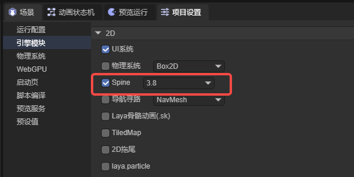
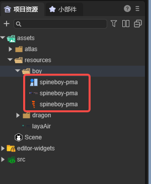
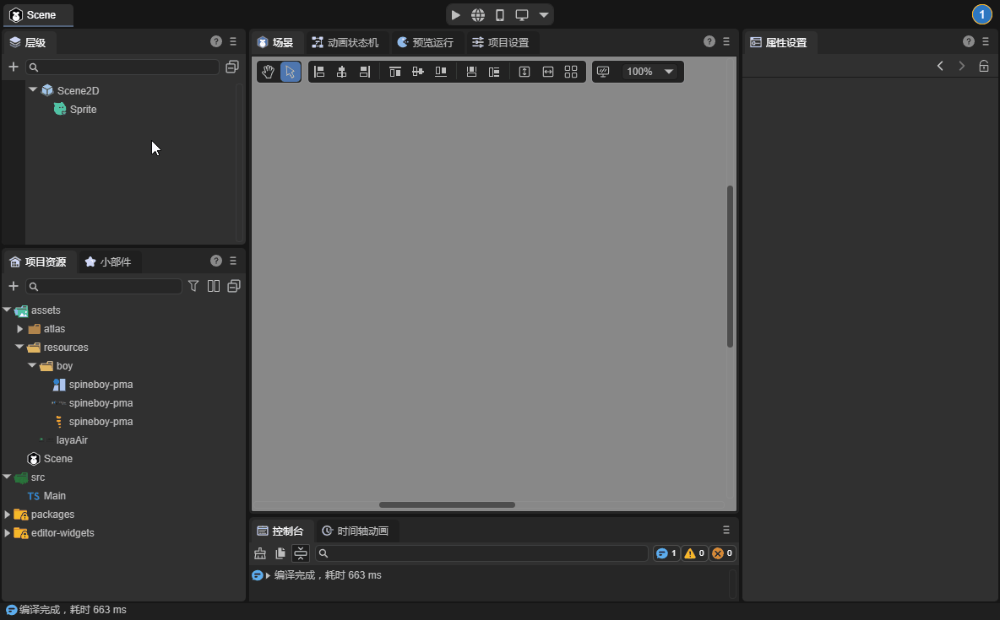
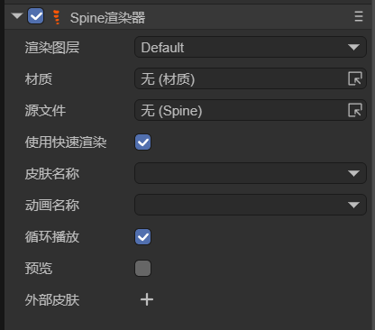
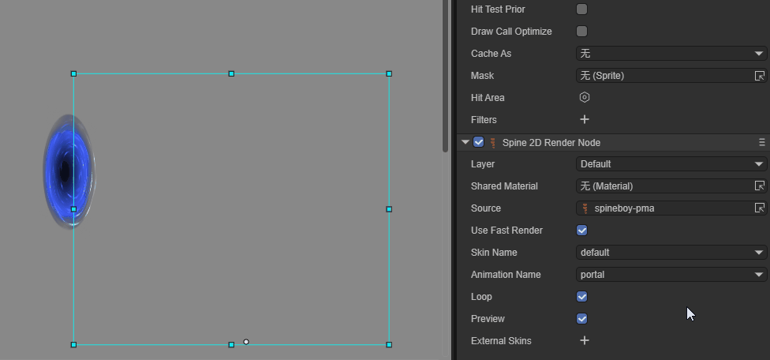

# Spine Skeletal Animation

## 1. Overview

Spine skeletal animation is one of the frequently used skeletal animations in games. The Spine tool is used to bind images to bones and then control the bones to achieve the animation.

How to create Spine skeletal animation graphics will not be introduced here. Interested developers can visit the [Spine official website](http://zh.esotericsoftware.com/).

The LayaAir IDE supports the addition, preview, and running of Spine skeletal animations. Before using it, it is necessary to check the class library in the IDE and select the version of Spine.

> Starting from version 3.2, it supports directly dragging Spine resources from the resource library into the hierarchy or scene to automatically create Spine rendering nodes and Spine components.



(Figure 1-1)

Currently, LayaAir supports versions 3.7, 3.8, 4.0, and 4.1. Next, we will explain the usage in the IDE by using the Spine animation of version 3.8.


## 2. Using Spine Animation in the IDE

### 2.1 Copy the spine resource to the project

As shown in Figure 2-1, we put the completed Spine animation resource in the assets directory. Here, we use the example downloaded from the Spine official website for demonstration,



(Figure 2-1)


### 2.2 Add the spine animation component

In the LayaAir IDE, the skeletal animation can be achieved by adding components. First, create a 2D node, and then add a spine component on the component, as shown in the animation 2-2,



(Animation 2-2)


### 2.3 Attributes

Let's first take a look at the attributes of the Spine animation component, as shown in Figure 2-3



(Figure 2-3)

| Attribute Name  | Attribute Explanation                                        |
| --------------- | ------------------------------------------------------------ |
| Layer           | Can be associated with the 2D lighting system by setting different layer values. Different layers can receive different lighting effects. |
| Shared Material | Supports [custom shaders](../../../../../2D/advanced/customShader/readme.md) to set the rendering effect of the Spine animation. |
| Source          | The configuration file of the spine animation, that is, the.skel file or.json file. |
| Use Fast Render | Enabled by default. Enabling this value for some complex Spines may result in rendering errors, such as when the number of bone controls for a certain vertex is greater than 4. |
| Skin Name       | The name of the skeletal animation.                          |
| Animation Name  | The name of the played animation.                            |
| Loop            | Whether to play in a loop.                                   |
| Preview         | Whether to preview in the IDE.                               |
| External Skins  | Used to load and manage external Spine skin resources.       |

Then the animation resource can be dragged in. First, drag the.skel file into the `Source` attribute, check the `Preview` attribute, and the animation will be seen in the IDE. Check `Loop Play` to set whether to loop the animation, and you can also select the animation name to switch animations. As shown in the animation 2-4,



(Animation 2-4)


## 3. Spine Animation in Code

When using in code, first load the Spine animation resource and then add the spine component.

Code example:

```typescript
const { regClass, property } = Laya;

@regClass()
export class NewScript extends Laya.Script {

    @property({ type: Laya.Sprite })
    public sprite: Laya.Sprite;
    
    private spine: Laya.Spine2DRenderNode;
    private index: number = -1;
    
    // Executed after the component is activated. At this time, all nodes and components have been created. This method is executed only once
    onAwake(): void {
    
        // Load the Spine animation resource
        Laya.loader.load("resources/boy/spineboy-pma.skel").then(() => {
            // Add the spine component
            this.spine = this.sprite.addComponent(Laya.Spine2DRenderNode);
            this.spine.source = "resources/boy/spineboy-pma.skel";
            this.spine.animationName = "walk";
        });
    }
}
```

In addition, the GPU rendering optimization of spine is enabled by default, and no additional operations are required by developers. If you want to turn it off for testing, you can use the following code:

```typescript
// Turn off GPU skeletal animation optimization
Laya.SketonOptimise.normalRenderSwitch = true;
```