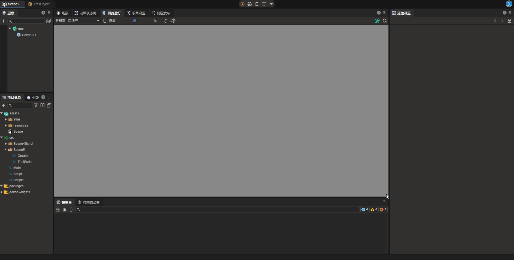
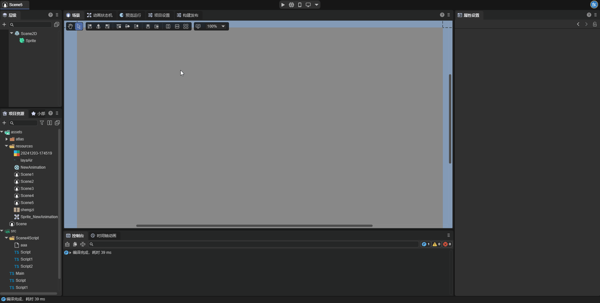
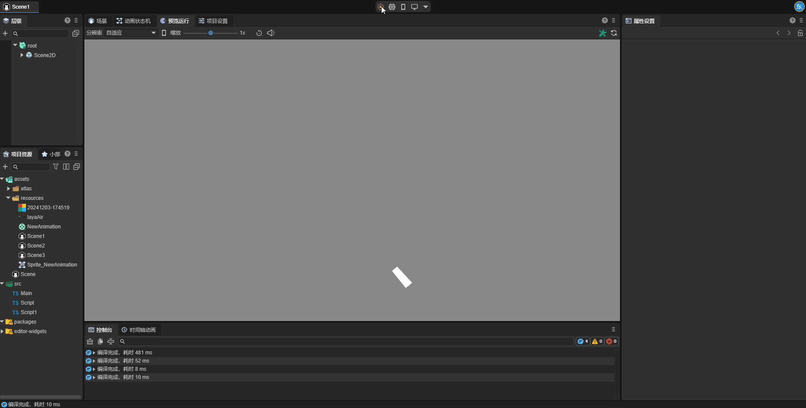
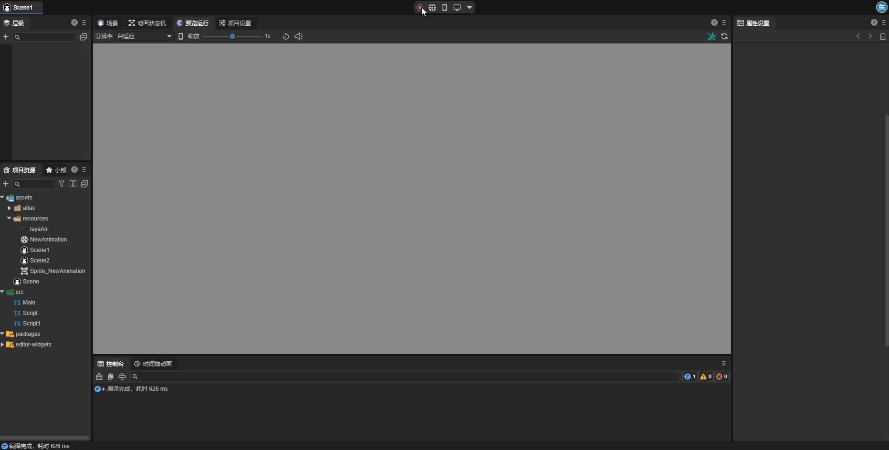
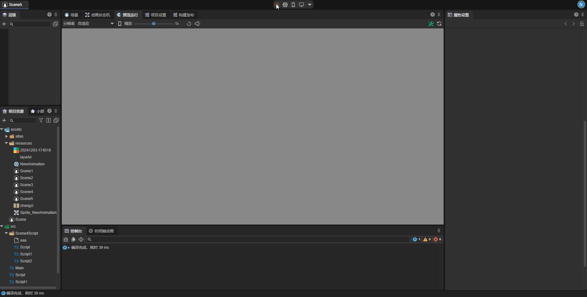
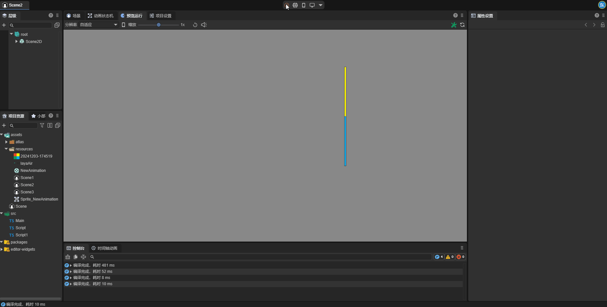
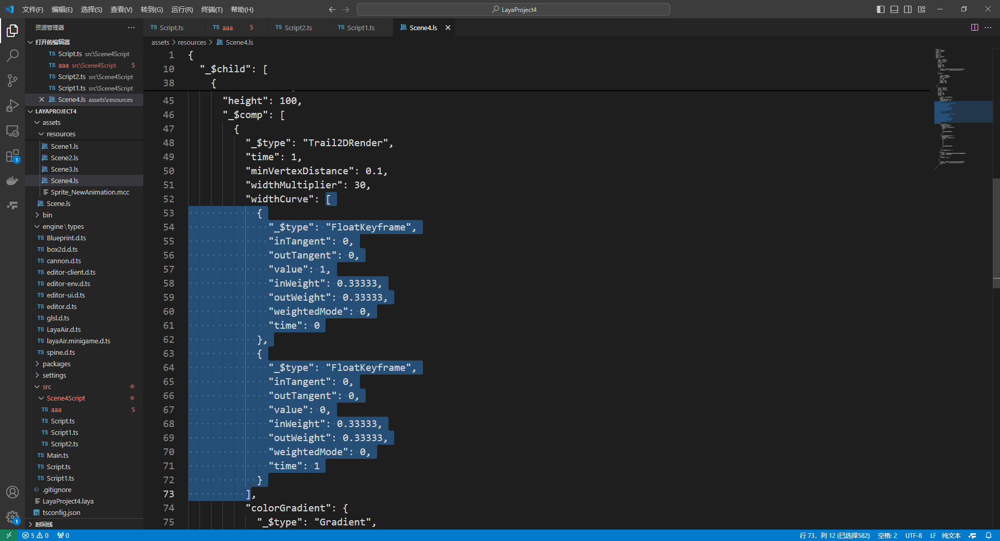
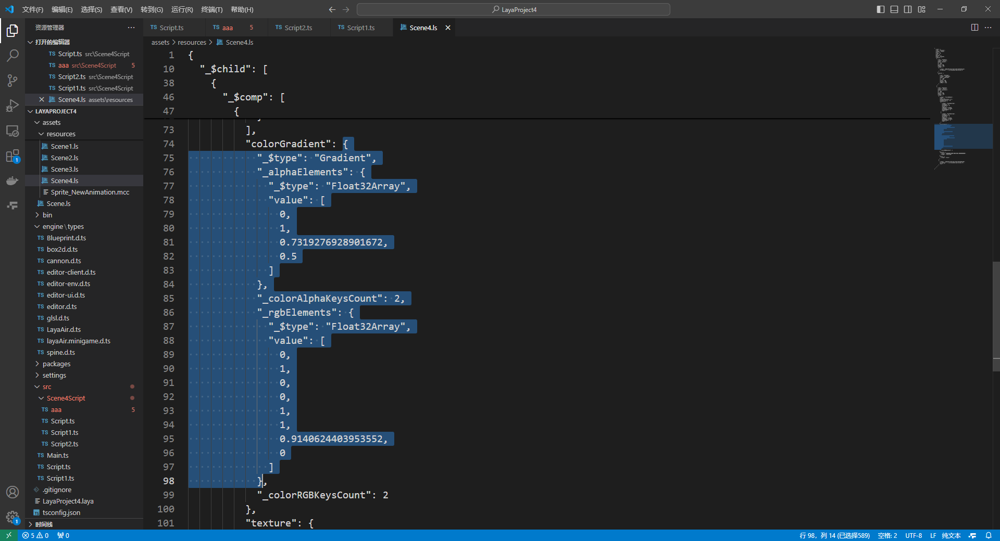
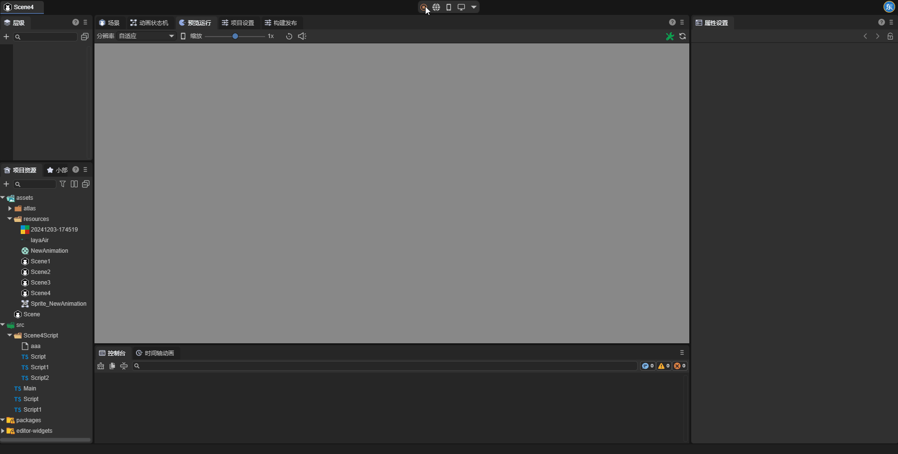

# 2D Trail Renderer (Trail2DRender)

The 2D trail renderer can create a polygonal trail behind a moving game object. With this component, we can enhance the sense of motion of the game object and highlight the path or position of the object's movement.



## 1. Creating the Trail2DRender Component via LayaAir IDE

### 1.1 Creating Trail2DRender

Through the IDE's visual operation, the 2D trail renderer (Trail2DRender) can be directly added to the 2D node in the property setting panel.



The 2D trail renderer requires enabling the 2D trail module in the engine module to be used. When developers add the 2D trail renderer to the node, this module will be automatically enabled. Developers can also manually start this module.


### 1.2 Attributes in Trail2DRender

As shown in Figure 1-2-1, the 2D trail renderer has the following attributes:


(Figure 1-2-1)

| Attribute | Function |
| --- | --- |
| layer | The layer affected by the layer mask of the 2D light component |
| sharedMaterial | Set the custom 2D shader material. If not set, the engine will use the default material |
| time | The life cycle of the midpoint of the trail (in seconds) |
| minVertexDistance | The minimum distance between two points in the trail |
| widthMultiplier | The total width of the trail (in pixels) |
| widthCurve | A normalized value that determines the width of different positions of the trail |
| color | Set the color of the trail, which will be mixed and superimposed with the gradient color of the trail to form the final color |
| colorGradient | Set the gradient color of the trail, which will be mixed and superimposed with the color of the trail to form the final color |
| textureMode | Control how the texture should be applied to the trail. There are two modes: Stretch and Tile |
| texture | The texture applied to the trail. The specific effect is affected by the texture mode (textureMode) |

### 1.3 Attribute Explanations

Let's explain some of the attributes in Trail2DRender below.

#### 1.3.1 minVertexDistance

In principle, the 2D trail generates a series of vertices based on the movement trajectory of the object, and then generates the image rendered in the scene based on the positions of these vertices, eventually forming the trail. The `minVertexDistance` attribute determines the distance between the vertices. The smaller the distance between the vertices, the smoother the trail; conversely, the stiffer the trail. Let's have an intuitive understanding of this attribute through two examples:

When `minVertexDistance` is set to `0.1`, as shown in Figure 1-3-1-1:



(Figure 1-3-1-1)

When `minVertexDistance` is set to `100`, as shown in Figure 1-3-1-2:



(Figure 1-3-1-2)


#### 1.3.2 widthCurve

The `widthMultiplier` attribute determines the overall width of the trail, while the `widthCurve` attribute defines the actual width of each part of the trail based on the `widthMultiplier` attribute. In the IDE, developers can double-click the connection line to create a new keyframe and drag the points of the keyframe to set the width curve. When the trail creates vertices, it samples on the width curve. Therefore, the accuracy of the trail width is also related to the `minVertexDistance` attribute.


(Figure 1-3-2-1)

The running effect is as follows:



(Figure 1-3-2-2)


#### 1.3.3 textureMode

The `textureMode` attribute determines how the texture will be applied to the trail.

**Stretch**: Stretch mode. In this mode, the texture will be stretched to cover the entire length of the trail. No matter how the length of the trail changes, the texture will only be displayed once. The longer the trail, the more the texture is stretched. It is suitable for continuous texture expressions such as light effects to avoid the sense of texture breakage.




**Tile**: Tile mode. In this mode, the texture is laid in a repetitive manner along the length of the trail. The longer the trail, the more times the texture repeats, and the texture will maintain the original proportion. It is suitable for cases where the trail needs to present continuous patterns or textures, such as stripes, gradients, or repetitive patterns. Ensure that the texture details do not distort when the length of the trail changes.


Note: If you want to use the `Tile` mode of the trail, the tiling mode of the trail texture needs to be set to `Repeat`. The texture can only be set to `Repeat` when the width and height are both powers of 2. Developers can turn the texture into a power of 2 by setting the `Non-Power-of-2 Scaling` attribute of the texture.


## 2. Using Trail2DRender in Code

During the game's running process, developers can dynamically create the trail renderer component through code and set various attributes of the trail. The sample code is shown as follows:

```typescript
const { regClass, property } = Laya;

@regClass()
/**
 * Sample code for adding a 2D trail renderer to a node
 */
 export class NewScript extends Laya.Script {
    declare owner: Laya.Sprite;

    private _trail2D: Laya.Trail2DRender;

    // Width curve data obtained from the scene file
    private _widthCurve: any[];
    // Color gradient data obtained from the scene file
    private _gradient: any;

    // Executed after the component is activated. At this time, all nodes and components have been created. This method is executed only once
    onAwake(): void {
        // Add the 2D trail renderer to the node
        this._trail2D = this.owner.addComponent(Laya.Trail2DRender);
        // Set the fade-out time
        this._trail2D.time = 1;
        // Set the minimum distance
        this._trail2D.minVertexDistance = 0.1;
        // Set the width multiplier
        this._trail2D.widthMultiplier = 50;
        // Set the width curve
        this.setWidthCurve(this._widthCurve);
        // Set the color gradient
        this.setColorGradient(this._gradient);
        // Set the texture mode
        this._trail2D.textureMode = Laya.TrailTextureMode.Stretch;
        // Set the texture
        this._trail2D.texture = Laya.Texture2D.whiteTexture;
        // Laya.loader.load("Enter the path of the texture here").then((res) => {
        //     this._trail2D.texture = res;
        // });
        // Set the line segment color
        this._trail2D.color = new Laya.Color(1, 1, 1, 1);
    }

    // Control the object to move to the right
    onUpdate(): void {
        this.owner.x += 5;
    }

    // Set the width curve
    setWidthCurve(value: any[]) {
        // Create a new width curve
        const floatKeyframe: Laya.FloatKeyframe[] = [];

        for (let i = 0; i < value.length; i++) {
     
            // Create a new keyframe
            let keyframe = new Laya.FloatKeyframe();
            // Set the attributes of the keyframe
            keyframe.inTangent    =    value[i].inTangent;
            keyframe.outTangent   =    value[i].outTangent;
            keyframe.value        =    value[i].value;
            keyframe.inWeight     =    value[i].inWeight;
            keyframe.outWeight    =    value[i].outWeight;
            keyframe.time         =    value[i].time;
     
            // Add the keyframe to the array
            floatKeyframe.push(keyframe);
        }
     
        // Apply the width curve to the trail
        this._trail2D.widthCurve = floatKeyframe;
    }

    // Set the color gradient
    setColorGradient(value: any) {
        // Create a new color gradient
        const gradient = new Laya.Gradient();

        // Set the Alpha value of the color gradient
        for (let i = 0; i < value._alphaElements.value.length;) {
            gradient.addColorAlpha(value._alphaElements.value[i], value._alphaElements.value[i + 1]);
            i += 2;
        };
     
        // Set the RGB value of the color gradient
        for (let i = 0; i < value._rgbElements.value.length;) {
            let color = new Laya.Color(value._rgbElements.value[i + 1], value._rgbElements.value[i + 2], 			                                                    value._rgbElements.value[i + 3]);
            gradient.addColorRGB(value._rgbElements.value[i], color);
            i += 4;
        };
     
        // Apply the color gradient to the trail
        this._trail2D.colorGradient = gradient;
    }
 }
```
 In the `onAwake` method, the code adds the 2D trail renderer to the node. Developers can set various attributes as needed. Among them, the two attributes `widthCurve` and `colorGradient` are relatively special. Setting these two values directly in the code may not be intuitive enough. Therefore, two methods are set in the code to set these two values from the data saved in the scene file.

First, we create a scene unrelated to the project. In the scene, create a 2D sprite and add the 2D trail renderer component. Adjust the width curve and color gradient in the property setting panel until the desired effect is achieved and save the scene file. Find the scene file in the project resource panel, right-click - Open the project in the code editor.

Set the width curve attribute: In the opened scene file, search for `widthCurve`, and copy the attribute value shown in Figure (2-1) to the `_widthCurve` attribute in the script.



(Figure 2-1)

Set the color gradient attribute: In the opened scene file, search for `colorGradient`, and copy the attribute value shown in Figure (2-2) to the `_gradient` attribute in the script.



(Figure 2-2)

Run and view the effect. The upper trail is the trail created through code, and the lower trail is the trail created through the IDE. It can be seen that the two effects are consistent.



(Figure 2-3)