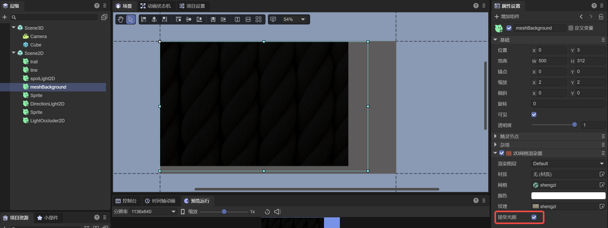
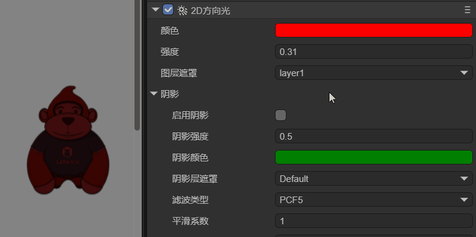

# 2D Lighting and Meshes

> Author: Charley

2D lighting has a very important value in the production of game effects. It can not only create a scene atmosphere, enhance the layering of the picture, and enrich the visual effect through different light colors, intensities, and forms. It also has the functions of enhancing the immersion of the game, guiding the player's attention, highlighting important elements, etc. The rational use of 2D lighting can effectively improve the overall quality and player experience of the game.

Starting from the LayaAir3.3 version, we have supported 2D lighting, such as several components like 2D DirectionLight2D, 2D SpriteLight2D, 2D FreeformLight2D, and 2D SpotLight2D. In this chapter, we specifically introduce how to use the lighting and the common properties of the base class of these lighting components.

## 1. The Relationship Between Lighting and Meshes

2D lighting must act on 2D meshes to produce effects. To enable the lighting effect, it is necessary to add the 2D Mesh Renderer (Mesh2DRender) component on the target sprite node and check the "Accept Lighting" option, so that this node can receive the light. As shown in Figure 1-1.

 

(Figure 1-1)

When the Mesh Renderer component enables accepting lighting, in the absence of a light source, the object will appear in a black state, which is the same principle as in the real world where objects are not visible when there is no light.

Adding any type of light source can illuminate these black areas, and different types of light sources will produce different lighting effects. For example, the **Directional Light** provides global lighting from a specific direction, while the **Spotlight** produces a local range of lighting effects. The effect is shown in Figure 1-2.

 

(Figure 1-2)

## 2. Common Properties of Lighting Components

In the previous text, we mentioned four types of lighting components, all of which inherit from the BaseLight2D base class. Before introducing the unique properties of each lighting component, let's first understand these common properties.

### 2.1 Light Color (Color)

The light color determines the display color of the lighting. Set any color, and the light source will emit light of the corresponding color.

### 2.2 Light Intensity (Intensity)

The light intensity is used to control the brightness of the lighting. As shown in the animation 2-1, the larger the intensity value, the higher the brightness of the lighting.

 

(Animation 2-1)

### 2.3 Layer Mask

Each Mesh Renderer has a rendering layer property. By setting the layer mask of the lighting, you can specify which rendering layers this light source affects. As shown in Figure 2-2, you can set the affected layers through multiple selections.

 

(Figure 2-2)

### 2.4 Shadows

Although shadows are a common property of lighting, it mainly works in conjunction with the light occluder. For information on shadows, please jump to another document ["2D Light Occluder and Shadows"](../LightOccluder2D/readme.md)

## 3. Advanced Usage

### 3.1 Code Application of Layer Mask

In the engine, the judgment of the light's irradiation on the mesh layer is implemented based on the `bitwise AND` operation.

For example, `2 & 4` is 0 and cannot be illuminated. `3 & 1` is not 0 and can be illuminated.

#### 3.1.1 luminate Specified Layers

The LayaAir3-IDE provides a Default layer by default (with a value of 0). Suppose we create a new Background layer (with a value of 1). To allow the light to illuminate both of these layers simultaneously, it can be achieved in the following way:

1. Use the left shift operation to obtain the power of 2 of each layer
2. Combine these values through the bitwise OR operation
3. Assign the result to the layer mask property

The example code is as follows:

```typescript
const { regClass, property } = Laya;

@regClass()
export class lightTest extends Laya.Script {
    declare owner: Laya.Sprite;

    @property({ type: Laya.Sprite })
    light1: Laya.Sprite;
    
    @property({ type: Laya.Sprite })
    mesh1: Laya.Sprite;
    
    @property({ type: Laya.Sprite })
    mesh2: Laya.Sprite;
    
    private light1Render: Laya.FreeformLight2D;
    private mesh1Render: Laya.Mesh2DRender;
    private mesh2Render: Laya.Mesh2DRender;


    // Executed after the component is activated. At this time, all nodes and components have been created. This method is executed only once
    onAwake(): void {
        this.light1Render = this.light1.getComponent(Laya.FreeformLight2D);
        this.mesh1Render = this.mesh1.getComponent(Laya.Mesh2DRender);
        this.mesh2Render = this.mesh2.getComponent(Laya.Mesh2DRender);
    
        // Set mesh1 on layer 0 (Default layer)
        this.mesh1Render.layer = 0;
        // Set mesh2 on layer 1 (the first custom layer)
        this.mesh2Render.layer = 1;
        // Let the mask of the light interact with the specified layers 0 and 1 and only illuminate layers 0 and 1
        this.light1Render.layerMask = 1 << 0 | 1 << 1;
    }
}
```

#### 3.1.2 luminate All Layers

If we have more than these two layers and want to illuminate all layers through code, the example is as follows:

```typescript
// Based on the previous example code, only modify the layerMask
// -1 can illuminate all layers
this.light1Render.layerMask = -1;
```

#### 3.1.3 Exclude Specified Layers

If we want to be more flexible and exclude layers 1 and 2 while illuminating all layers, the example is as follows:

```typescript
// Based on the previous example code, only modify the layerMask
// To exclude certain layers (such as layers 1 and 2), all other layers can be illuminated
this.light1Render.layerMask = -1 ^ (1 << 1) ^ (1 << 2);
```

### 3.2 APIs in the Engine

In addition to the commonly used properties displayed in the IDE, the lighting base class of the engine also exposes some other APIs, such as light rotation, light scaling, etc. In the documentation of the lighting components, we try to provide code usage references for the commonly used APIs as much as possible.

| Name                     | Description                                              |
| ------------------------ | -------------------------------------------------------- |
| lightRotation            | Rotation angle of the light                              |
| lightScale               | Scaling value of the light                               |
| showLightTexture         | Whether to display the light texture                     |
| getLightType             | Get the type of the light                                |
| getGlobalPosX            | Get the X coordinate value of the light's world position |
| getGlobalPosY            | Get the Y coordinate value of the light's world position |
| setLayerMaskByList       | Set the light layer mask by list                         |
| isLayerEnable            | Whether the light is enabled for the specified layer     |
| setShadowLayerMaskByList | Set the shadow layer mask by list                        |
| isShadowLayerEnable      | Whether the shadow is enabled for the specified layer    |
| renderLightTexture       | Render the light texture                                 |

## 4. Usage of Lighting Components

The general introduction to lighting is here. For other 2D lighting component application documents, please click the link to jump and view.

### [2D Directional Light](../DirectionLight2D/readme.md)

### [2D Sprite Light](../SpriteLight2D/readme.md)

### [2D Freeform Light](../FreeformLight2D/readme.md)

### [2D Spotlight](../SpotLight2D/readme.md)