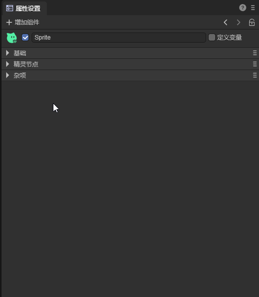
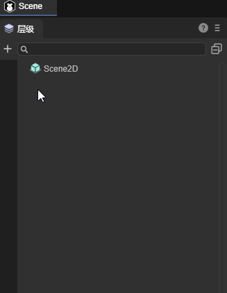
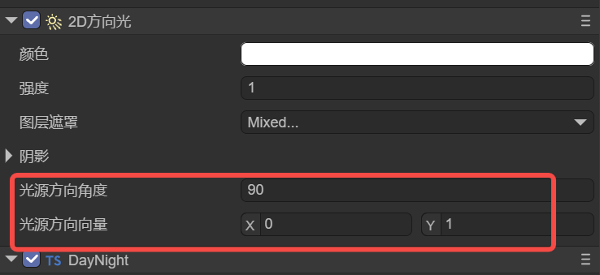
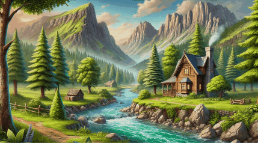

# 2D Directional Light

> Author: Charley, Meng Xingyu

Before reading this document, please first read the base class document of 2D lighting ["2D Lighting and Meshes"](../BaseLight2D/readme.md).

The 2D Directional Light (DirectionLight2D) is used in game development to simulate a parallel light source from a specific direction. It is often used to represent light effects such as sunlight or moonlight with large-scale uniform illumination. It can provide a unified light direction and shadow effect for objects in the scene, enhance the three-dimensional and layering of the picture, and support dynamic changes to represent the passage of time or weather changes. Compared to point lights and spotlights, the illumination range of the directional light is infinitely large, and it is more suitable for scenes with global illumination requirements, such as open-world, forest, desert and other environments, improving the overall picture atmosphere and visual expressiveness.

## 1. Adding the Directional Light Component

### 1.1 Adding through the Component List

As shown in the animation 1-1, in the property setting panel, click "Add Component", select "2D Lighting -> 2D Directional Light" to add the directional light component.

 

(Animation 1-1)

### 1.2 Adding through the Hierarchy Panel

As shown in the animation 1-2, in the hierarchy panel, add a 2D lighting node.

 

(Animation 1-2)

## 2. The Light Source Direction of the Directional Light

The directional light has a unique property, which is the direction of the light source. This characteristic property has two representation methods, which can be represented by the angle or by the vector. Both are actually defining the direction of the light source. As shown in Figure 2-1.

 

(Figure 2-1)

| Property Name   | Chinese Name of the Property  | Property Description                                         |
| --------------- | ----------------------------- | ------------------------------------------------------------ |
| directionAngle  | Light Source Direction Angle  | Set the light direction based on the angle value, which has an impact on the shadow. When a new angle value is set, the light source direction vector is automatically updated. |
| directionVector | Light Source Direction Vector | Set the light direction precisely based on the two-dimensional vector, which has an impact on the shadow. When a new vector is set, the light source direction angle is automatically updated. |

The light source direction angle and the light source direction vector are always synchronized. The "Light Source Direction Angle" is more suitable for intuitive angle control, and the "Light Source Direction Vector" is more suitable for mathematical calculation and direction determination.

The direction of the light source, from the effect. It is meaningless without adding shadows. We can add shadows to view the influence of the change of the light source direction on the shadows. As shown in the animation 2-2,


(Animation 2-2)

## 3. Code Usage

When we have created the mesh background that accepts the directional light and the node of the directional light.

We can add a script to this node of the directional light, and realize the dynamic logic of the lighting through the control of the script.

For example, by controlling the color intensity property of the directional light, a simple day and night alternation effect can be achieved.

The example code is as follows:

```typescript
const { regClass } = Laya;

@regClass()
export class DayNight extends Laya.Script {
    declare owner: Laya.Sprite;

    private lightComp: Laya.DirectionLight2D;
    private dayTime: number = 0;
    private dayDuration: number = 24; // Seconds for a complete cycle
    
    private displayText: Laya.Text; // Text to display the current time
    
    onAwake(): void {
        this.lightComp = this.owner.getComponent(Laya.DirectionLight2D);
    
        // Initialize the text component
        this.displayText = new Laya.Text();
        this.displayText.color = "#ffffff";
        this.displayText.font = "Arial";
        this.displayText.fontSize = 24;
        this.displayText.bold = true;
        this.displayText.x = 10; // For example, set in the upper left corner of the screen
        this.displayText.y = 10;
        this.owner.scene.addChild(this.displayText); // Add the text display in the scene
    }
    
    onUpdate(): void {
        // Update the time
        this.dayTime = (this.dayTime + Laya.timer.delta / 1000) % this.dayDuration;
        const totalMinutes = Math.floor((this.getAdjustedProgress()) * 24 * 60);
        const hours = Math.floor(totalMinutes / 60);
        const minutes = totalMinutes % 60;
        const timeString = `${this.padNumber(hours)}:${this.padNumber(minutes)}`;
        // Update the text display
        this.displayText.text = `Time: ${timeString}`;
    
        // Calculate the light intensity at the current time
        const timeProgress = this.dayTime / this.dayDuration;
        this.updateLightByTime(timeProgress);
    }
    private padNumber(num: number): string {
        return num < 10? `0${num}` : `${num}`;
    }
    private getAdjustedProgress(): number {
        return (this.dayTime) % this.dayDuration / this.dayDuration;
    }
    private updateLightByTime(progress: number): void {
        let intensity = 0;
        if (progress < 0.125) {
            intensity = 0.2;
        } else if (progress < 0.375) {
            const t = (progress - 0.125) / 0.25;
            intensity = 0.2 + t * 0.8;
        } else if (progress < 0.708) {
            intensity = 1.0;
        } else if (progress < 0.833) {
            const t = (progress - 0.708) / 0.125;
            intensity = 1.0 - t * 0.8;
        } else {
            intensity = 0.2;
        }
        this.lightComp.intensity = intensity;
    }
}
```

The dimming effect in the example is shown in the animation 3-1,

 

(Animation 3-1)