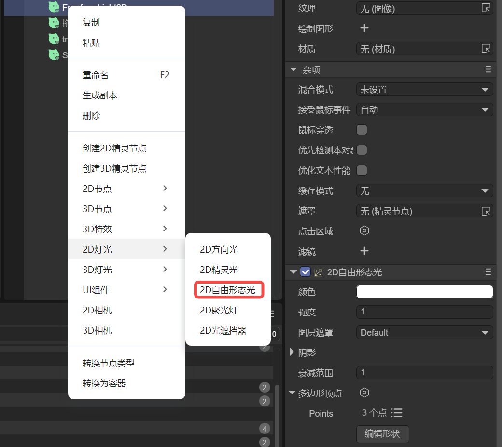
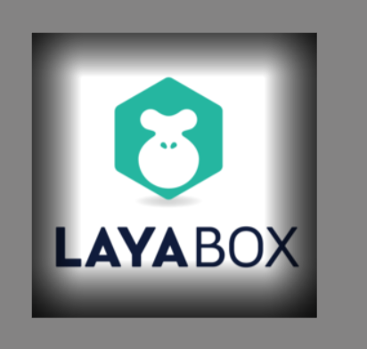
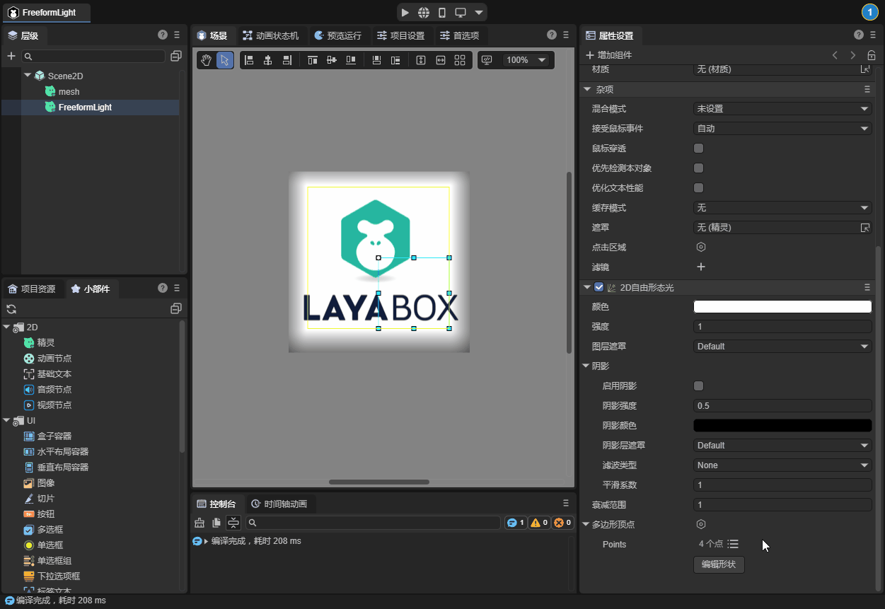
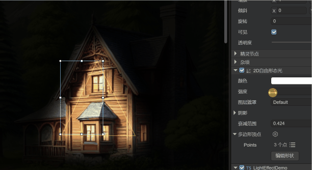

# 2D Freeform Light

> Author: Charley

This document only introduces the unique properties of the freeform light. The common properties of the light are introduced in the base class document of the light. If you have not read it, please click here to view: [<<2D Lighting and Meshes>>](../BaseLight2D/readme.md).

## 1. Application Scenarios

The **2D Freeform Light (FreeformLight2D)** is a 2D light type that supports customizing the shape of the light source. By setting multiple vertex positions, developers can freely define the geometric shape of the light source to achieve irregular lighting effects, as shown in Figure 1-1. This type of light is very suitable for presenting complex or irregular light and shadow scenes, providing great flexibility and creative space.

 

(Figure 1-1)

For example, in the following application scenarios:

### 1.1 **Irregular Light Source**

Suitable for simulating non-standard-shaped light sources, such as light rays emerging from cracks, irregular rays of light, etc.

### 1.2 **Dynamic Light and Shadow Effects**

In scenarios where the shape of the light source needs to be dynamically adjusted, the freeform light can generate changing light and shadow effects in real-time by modifying the vertices, such as simulating the light and shadow changes of water waves or the dynamic rays of a magic array.

### 1.3 **Scene Atmosphere Rendering**

Used to enhance the scene atmosphere, such as simulating the mottled light and shadow projected through the gaps of leaves, the light rays transmitted through complex window panes, etc., increasing the immersion and detail expression of the environment.


## 2. Usage in LayaAir-IDE

### 2.1 Adding Freeform Light

The 2D Freeform Light can be directly added by right-clicking in the layer panel, "2D Lighting" -> "2D Freeform Light", as shown in Figure 2-1.

  

(Figure 2-1)

In addition to the addition in the hierarchy panel, you can also first create a node, and then from the component list, find "2D Lighting" -> "2D Freeform Light" to directly add this component to the node.

### 2.2 Polygon Vertices

In addition to the common lighting properties, the 2D Freeform Light has two unique properties. One of them is the "Polygon Vertices". Through this property, users can freely control the shape of the light.

After adding the component of the freeform light, the IDE sets a rectangular light shape by default. Developers can view and edit the vertices through the vertex data list button. As shown in Figure 2-2:

 

(Figure 2-2)

The effect of the rectangular light is shown in Figure 2-3.

  

(Figure 2-3)

In addition to modifying the vertex data in the vertex list, we can also click the "Edit Shape" button for visual vertex shape editing. As shown in the animation 2-4,

 

(Animation 2-4)

In the editing mode, you can **drag the yellow vertex block** to change the vertex position. Press and hold **Ctrl + left mouse button on the keyboard** to click on the line segment to add a vertex. Press and hold Alt + left mouse button on the keyboard to delete the vertex.

After the editing is completed, click the blank area to exit the editing mode.

### 2.3 Attenuation Range

The attenuation range is used to control the distance at which the light gradually weakens from the center to the outside until it completely disappears. A smaller value results in faster light attenuation and a smaller lighting range, suitable for local light source effects; a larger value results in slower light attenuation and a larger lighting range, suitable for scenarios covering a larger area. The value range is 0-10. The effect is shown in the animation 2-5.

 

(Animation 2-5)


## 3. Usage via Code

If we need to dynamically add vertices and set the attenuation range through code, or even use the API in the engine's light base class, we have also prepared a script example for your reference.

The example code is as follows:

```typescript
const { regClass } = Laya;
@regClass()
export class LightEffectDemo extends Laya.Script {
    declare owner: Laya.Sprite;

    private lightComp: Laya.FreeformLight2D;
    private rotateSpeed: number = 2;  // Increase the rotation speed
    private scaleTime: number = 0;
    private scaleSpeed: number = 3;   // Increase the scaling speed
    private intensity: number = 1.8;  // Define the light intensity
    
    onAwake(): void {
        // Get the FreeformLight2D component
        this.lightComp = this.owner.getComponent(Laya.FreeformLight2D);
    
        // The vertices of the light are usually recommended to be visually configured in the IDE. Here, it is to demonstrate how to dynamically set the vertex data through code to facilitate the need for dynamic adjustment of the light shape.
        /** Set the vertex data of the free light to form a beautiful polygonal shape **/
        const polygon = new Laya.PolygonPoint2D();
        polygon.addPoint(0, -150);    // Top
        polygon.addPoint(20, -30);    // Top right inner side
        polygon.addPoint(150, -30);   // Top right
        polygon.addPoint(30, 10);     // Top right inner side
        polygon.addPoint(100, 150);   // Bottom right
        polygon.addPoint(10, 30);     // Inner side at the bottom
        polygon.addPoint(-100, 150);  // Bottom left
        polygon.addPoint(-30, 10);    // Bottom left inner side
        polygon.addPoint(-150, -30);  // Top left
        polygon.addPoint(-20, -30);   // Top left inner side
        this.lightComp.polygonPoint = polygon;
    
        // Increase the light intensity and set the light color
        this.lightComp.falloffRange = 3;       // Increase the attenuation range
        this.lightComp.color = new Laya.Color(1.0, 0.9, 0.6, 1);  // Set the light color
        this.lightComp.intensity = this.intensity; // Apply the light intensity
    }
    
    onUpdate(): void {
        // Implement the light rotation animation
        this.lightComp.lightRotation += this.rotateSpeed * Laya.timer.delta / 1000;
        // Implement the light scaling animation
        this.scaleTime += Laya.timer.delta / 1000 * this.scaleSpeed;
        const scale = 1 + Math.sin(this.scaleTime) * 0.5;  // Increase the scaling variation amplitude
        this.lightComp.lightScale.setValue(scale, scale);
    }
}
```

The running effect is shown in the animation 3-1,

 

(Animation 3-1)