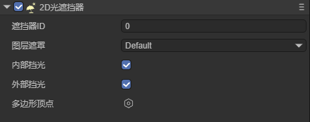
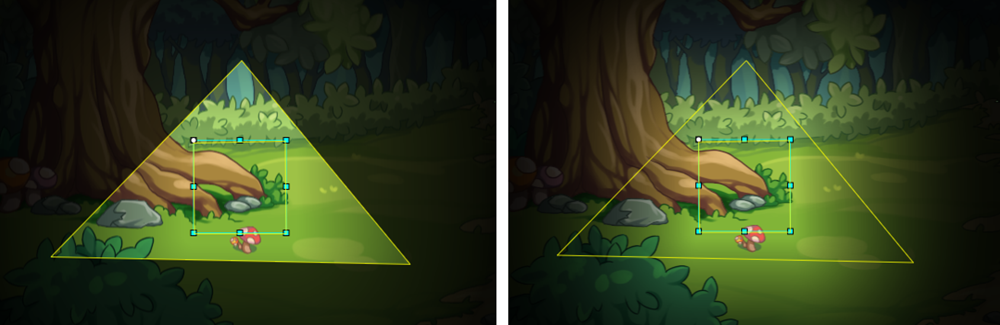
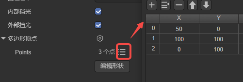
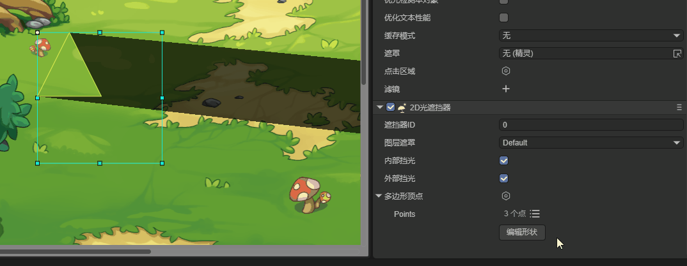
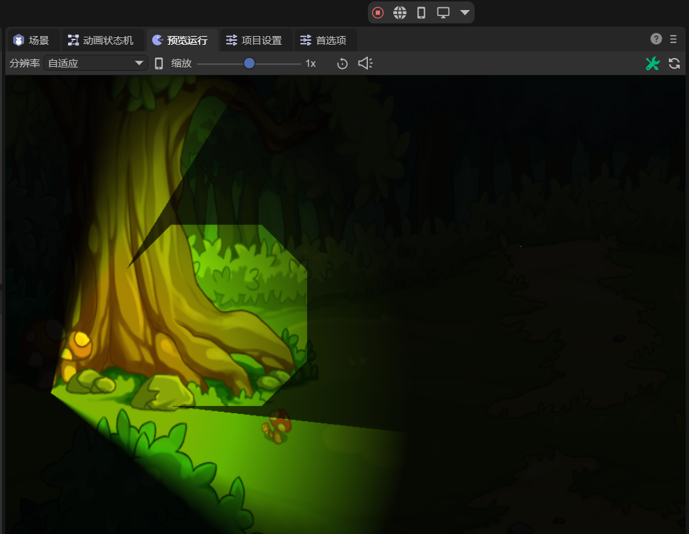

# 2D Light Occluder

Before viewing this document, please first read the introduction of shadows in the 2D lighting [Common Properties](../BaseLight2D/readme.md) document.

## 1. Introduction

The 2D Light Occluder (LightOccluder2D) is used to create light occlusion effects in 2D scenes. It can define arbitrary polygonal areas to block the propagation of light, thereby generating shadow effects.

In game development, the 2D Light Occluder defines the occlusion area through polygonal vertices and automatically calculates the intersection of light and the occluder. It can handle complex light projection and occlusion calculations and can be used to simulate the occlusion of light by walls, objects, etc.

## 2. Usage in LayaAir-IDE

To use the 2D Light Occluder in LayaAir-IDE, first, you need to add [2D Lighting](../BaseLight2D/readme.md) (Directional Light, Sprite Light, Freeform Light, Spotlight) and check "Enable Shadows", as shown in Figure 2-1, to display the effect,


(Figure 2-1)

The explanations of the related properties of shadows are as follows:

| Property Name      | Explanation                                                  |
| ------------------ | ------------------------------------------------------------ |
| ShadowEnable       | Controls whether to enable the shadow effect.                |
| ShadowStrength     | Controls the intensity of the shadow. The larger the value, the darker the shadow. |
| ShadowColor        | Sets the color of the shadow.                                |
| ShadowLayerMask    | Controls which layers will produce shadows.<br />Regarding the influence of layers, developers need to note that the display of shadows requires setting the layers of two components.<br />One is the layerMask of various lights, and the other is the layerMask of the 2D Light Occluder, because shadows are the combined effect of these two components. |
| ShadowFilterType   | The more the number of samples, the smoother the shadow edge, but the greater the performance consumption.<br />None: No filtering processing, the shadow edge is completely sharp. The calculation efficiency is the highest, but the visual effect is the worst, suitable for performance-sensitive scenarios<br />PCF5: Uses 5 sampling points for blurring processing. The shadow edge has a certain smoothing effect, but the blurring degree is limited, suitable for scenarios with medium blurring requirements. The calculation cost is low, balancing performance and quality.<br />PCF9: Uses 9 sampling points for blurring processing. The shadow edge has a stronger smoothing effect, suitable for scenarios with high-quality light and shadow. The calculation cost is moderate, and the visual effect is significantly improved. <br />PCF13: Uses 13 sampling points for blurring processing, which is one of the highest-quality blurring algorithms. The shadow edge is very soft, suitable for scenarios with extremely high visual quality requirements. The calculation cost is high, but the effect is very delicate. |
| ShadowFilterSmooth | Controls the blurring degree of the shadow edge. The larger the value, the blurrier the shadow edge. |

Then add the 2D Light Occluder component on the node, as shown in Figure 2-2, so that this node has the shading effect.



(Figure 2-2)

As shown in Figure 2-3, it is a node with a light occluder, and under the illumination of the directional light, the shadow effect is produced.


(Figure 2-3)

`Layer Mask`: Used to control which layers the light occluder affects. It needs to be combined with the "Layer Mask" of 2D lighting and the "Shadow Layer Mask" of shadows. That is, there are two requirements for the display of shadows regarding layers. One is the "Layer Mask" of the light to ensure that the objects on this layer can be affected by the light, and the other is the "Shadow Layer Mask" in the shadow property to ensure that the shadow can be displayed on this layer.

> The layer mask is set through bitwise operations, and the setting method is the same as the method given in [Common Properties](../BaseLight2D/readme.md).

`Internal Occlusion`: Whether to generate occlusion effects when the light source is inside the light occluder. After checking, the light source will also generate occlusion when it is inside the light occluder, as shown in Figure 2-4 (left); if not checked, the light source will not generate shading effect when it is inside the light occluder, as shown in Figure 2-4 (right). (In Figure 2-4, the small square is 2D Freeform Light, and the large triangle is 2D Light Occluder)



(Figure 2-4)

`External Occlusion`: Controls whether only the outer contour of the light occluder generates occlusion effects. After checking, only the outer contour generates occlusion, as shown in Figure 2-5 (left); if not checked, the entire light occluder area generates occlusion, as shown in Figure 2-5 (right). (The triangular area in Figure 2-5 is the 2D Light Occluder)


(Figure 2-5)

`Polygon Vertices`: Used to define the shape of the light occluder, and build a polygon by adding multiple vertices. LayaAir-IDE provides two methods for editing vertices,

The first is to click the vertex list and input the vertex coordinates for editing (in clockwise order), as shown in Figure 2-6,



(Figure 2-6)

The second is to click the "Edit Shape" button, as shown in the animation 2-7. After clicking, it enters the editing mode. Place the mouse on the vertex to drag and change the vertex position. Press and hold Ctrl + left mouse button on the keyboard to add a vertex. Press and hold Alt + left mouse button on the keyboard to delete the vertex. After the editing is completed, click the blank area to exit the editing mode.



(Animation 2-7)

## 3. Usage via Code

Create a new script in LayaAir-IDE, add it to the Scene2D node, and add the following code to achieve the effect of a light occluder:

```typescript
const { regClass, property } = Laya;

@regClass()
export class LightOccluder extends Laya.Script {

    private spotLight: Laya.Sprite = new Laya.Sprite();
    private background: Laya.Sprite = new Laya.Sprite();
    private lightOccluder: Laya.Sprite = new Laya.Sprite();
    
    private backgroundTexture: string = "resources/bg2.png";
    
    // Executed when the component is enabled, such as when the node is added to the stage
    onEnable(): void {
        Laya.loader.load(this.backgroundTexture).then(() => {
            this.createLightOccluder();
            this.createSpotLight();
            this.createBackground();
        });
    }
    
    // Create a 2D light occluder
    createLightOccluder(): void {
        this.lightOccluder.pos(233, 265);
        this.owner.addChild(this.lightOccluder);
        let lightOccluderComponent = this.lightOccluder.addComponent(Laya.LightOccluder2D);
        lightOccluderComponent.canInLight = true;
        lightOccluderComponent.outside = true;
        let poly: Laya.PolygonPoint2D = new Laya.PolygonPoint2D();
        // Add multiple vertices to create an irregular shape (clockwise)
        poly.addPoint(-50, -100);
        poly.addPoint(50, -100);
        poly.addPoint(100, -50);
        poly.addPoint(100, 50);
        poly.addPoint(50, 100);
        poly.addPoint(-50, 100);
        poly.addPoint(-100, 50);
        poly.addPoint(-100, -50);
        lightOccluderComponent.polygonPoint = poly;
    }
    
    // Create a spotlight
    createSpotLight(): void {
        this.spotLight.pos(50, 350);
        this.spotLight.rotation = 70;
        this.owner.addChild(this.spotLight);
        let spotLightComponent = this.spotLight.addComponent(Laya.SpotLight2D);
        spotLightComponent.color = new Laya.Color(0.937, 1, 0);
        spotLightComponent.intensity = 1.25;
        spotLightComponent.innerRadius = 100;
        spotLightComponent.outerRadius = 500;
        spotLightComponent.innerAngle = 90;
        spotLightComponent.outerAngle = 120;
        // Enable shadows
        spotLightComponent.shadowEnable = true;
    }
    
    // Create a background
    createBackground(): void {
        this.owner.addChild(this.background);
        let tex = Laya.loader.getRes("resources/bg2.png");
        let mesh2Drender = this.background.addComponent(Laya.Mesh2DRender);
        mesh2Drender.sharedMesh = this.generateRectVerticesAndUV(1000, 1000);
        mesh2Drender.texture = tex;
        mesh2Drender.lightReceive = true;
    }
    
    // Generate a rectangle
    private generateRectVerticesAndUV(width: number, height: number): Laya.Mesh2D {
        const vertices = new Float32Array(4 * 5);
        const indices = new Uint16Array(2 * 3);
        let index = 0;
        vertices[index++] = 0;
        vertices[index++] = 0;
        vertices[index++] = 0;
        vertices[index++] = 0;
        vertices[index++] = 0;
    
        vertices[index++] = width;
        vertices[index++] = 0;
        vertices[index++] = 0;
        vertices[index++] = 1;
        vertices[index++] = 0;
    
        vertices[index++] = width;
        vertices[index++] = height;
        vertices[index++] = 0;
        vertices[index++] = 1;
        vertices[index++] = 1;
    
        vertices[index++] = 0;
        vertices[index++] = height;
        vertices[index++] = 0;
        vertices[index++] = 0;
        vertices[index++] = 1;
    
        index = 0;
        indices[index++] = 0;
        indices[index++] = 1;
        indices[index++] = 3;
    
        indices[index++] = 1;
        indices[index++] = 2;
        indices[index++] = 3;
    
        const declaration = Laya.VertexMesh2D.getVertexDeclaration(["POSITION,UV"], false)[0];
        const mesh2D = Laya.Mesh2D.createMesh2DByPrimitive([vertices], [declaration], indices, Laya.IndexFormat.UInt16, [{ length: indices.length, start: 0 }]);
        return mesh2D;
    }
}
```

The final effect is shown in Figure 3-1,



(Figure 3-1)