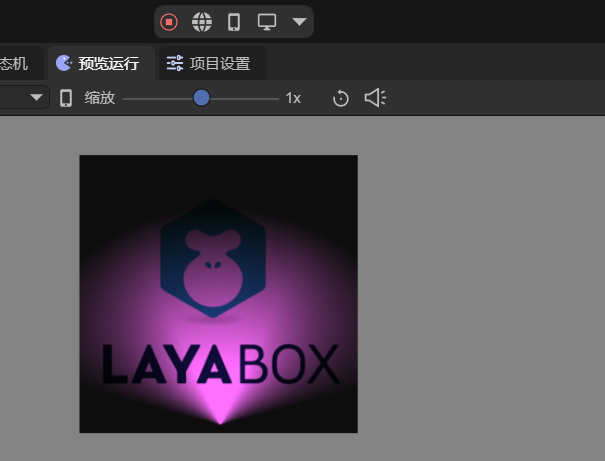

# 2D Spotlight

Before viewing this document, please first read the document of 2D lighting [Common Properties](../BaseLight2D/readme.md).

## 1. Introduction

The 2D Spotlight (SpotLight2D) can create a spotlight-like lighting effect in a 2D scene, allowing for fine control over the angle and direction of the selected light source. This component can create a fan-shaped area of lighting effect, control the lighting range by adjusting the inner and outer radii and angles, and support real-time rendering and update of the lighting.

In 2D games, the spotlight can achieve effects such as flashlights, searchlights, stage lights, etc., creating spotlight illumination in the scene and creating a special lighting atmosphere.

## 2. Usage in LayaAir-IDE

In LayaAir-IDE, add a sprite, and then add a 2D Spotlight component on the sprite, as shown in Figure 2-1.


(Figure 2-1)

The effect of a 2D Mesh Renderer receiving the spotlight is shown in Figure 2-2,


(Figure 2-2)

The unique properties of the 2D Spotlight are as follows:

`Inner Radius`: The radius of the inner circle. The light intensity within this radius does not attenuate. The larger the value, the larger the fully bright area in the center. However, if it is set too large, most of the area will be very bright.

`Outer Radius`: The radius of the outer circle. The farthest distance that the light can reach, determining the overall coverage range of the entire light. The larger the value, the larger the coverage range of the light.

> The light intensity gradually decreases from the inner radius to the outer radius. If the difference between the outer radius and the inner radius is too small, the transition area will be very narrow.

`Inner Angle`: The inner fan-shaped angle. The light intensity within this angle does not attenuate. The larger the value, the larger the fan-shaped area in the center. A smaller value creates a more focused beam effect, and a larger value creates a more divergent lighting effect.

`Outer Angle`: The outer fan-shaped angle. The maximum spread angle of the light, determining the overall spread angle of the light fan. The larger the value, the larger the diffusion angle of the light.

> The light intensity gradually decreases from the inner angle to the outer angle. If the difference between the outer angle and the inner angle is too small, the edge transition is more abrupt.

`Attenuation Intensity`: Controls the attenuation speed of the light intensity in the transition area (from the inner radius to the outer radius, from the inner angle to the outer angle), with a value range of 0-10. The larger the value, the faster the light intensity attenuates, and the softer the edge. The smaller the value, the slower the light intensity attenuates, and the more gradual the transition.

For a more intuitive understanding, let R represent the outer radius, r represent the inner radius, β represent the outer angle, and α represent the inner angle. The schematic diagram of each property is as follows:


(Figure 2-3)

For the properties of the spotlight, there are some restrictions. LayaAir will automatically limit these parameters within a reasonable range. The outer radius must be greater than or equal to the inner radius, and the outer angle must be greater than or equal to the inner angle.

## 3. Usage via Code

Create a new script in LayaAir-IDE, add it to the Scene2D node, and add the following code to achieve the effect of a 2D Spotlight:

```typescript
const { regClass, property } = Laya;

@regClass()
export class SpotLight extends Laya.Script {

    @property({ type: Laya.Sprite })
    private spotLight: Laya.Sprite;
    
    // Executed when the component is enabled, such as when the node is added to the stage
    onEnable(): void {
        this.setSpotLight();
    }
    
    // Create the spotlight
    setSpotLight(): void {
        this.spotLight.pos(336, 280);
        let spotLightComponent = this.spotLight.getComponent(Laya.SpotLight2D);
        spotLightComponent.color = new Laya.Color(1, 0.812, 1);
        spotLightComponent.intensity = 1.0;
        spotLightComponent.innerRadius = 50;
        spotLightComponent.outerRadius = 200;
        spotLightComponent.innerAngle = 50;
        spotLightComponent.outerAngle = 150;
    }
}
```

Let this spotlight illuminate a 2D mesh. The final effect is shown in Figure 3-1,



(Figure 3-1)