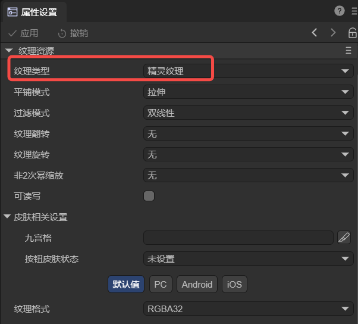
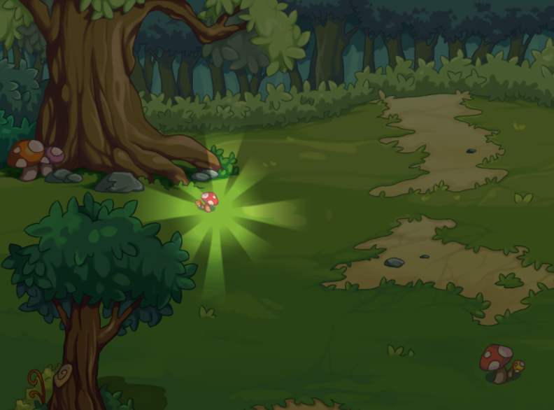
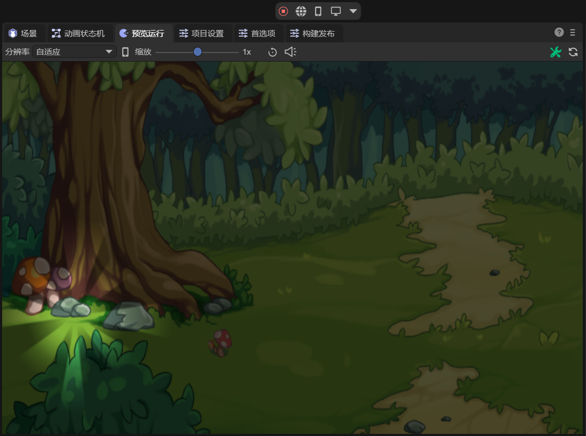

# 2D Sprite Light

> Author: Meng Xingyu

Before viewing this document, please first read the document of 2D lighting [Common Properties](../BaseLight2D/readme.md).

## 1. Introduction

The 2D Sprite Light (SpriteLight2D) is a custom light type based on sprite textures. By assigning a specific texture to the additional property of the sprite light, a light source with a unique shape and appearance can be generated. Due to its flexibility and high controllability of visual effects, this light type has been widely used in 2D game development, especially in scenarios that require precise control of the shape and performance of the light source.

This light type can meet the following requirements:

(1) Specific lighting effects:

When the shape and appearance of the light source are desired to be exactly the same as a certain texture, such as a lantern, torch, or any other light source with a specific shape.

(2) Enhancement of environmental details:

In scenarios where environmental details and atmosphere need to be enhanced, such as light shining through windows, light spots reflected on the water surface, etc., the sprite light source can provide additional visual layers.

(3) Special effects and visual cues:

In scenarios where the light source is needed to indicate specific events or state changes, such as alarms, magic effects, or indications of health status.

## 2. Usage in LayaAir-IDE

In LayaAir-IDE, add a sprite, and then add a 2D Sprite Light component on the sprite, as shown in Figure 2-1.

 

(Figure 2-1)

This light component has only one `Sprite Light Texture` property that is unique, and the remaining properties are [Common Properties](../BaseLight2D/readme.md).

This property is used to set the sprite texture to define the shape and appearance of the light. The image set here needs to be set as the sprite texture after import, as shown in Figure 2-2.

 

(Figure 2-2)

For example, if a light source is needed to prompt in a certain part of the scene, as shown in Figure 2-3, 

 

(Figure 2-3)

There are two lights in the figure. One is the 2D Directional Light for global illumination (the intensity of the Directional Light here is lowered to highlight the Sprite Light), and the other is the Sprite Light for highlighting a certain part of the scene. It should be noted that the background in the scene must be able to receive light to have the lighting effect.

It can be found that the advantage of the Sprite Light is that as long as there is an image, a light source of a specific shape can be specified.

## 3. Usage via Code

Create a new script in LayaAir3-IDE, add it to the Scene2D node, and add the following code to achieve the effect of a 2D Sprite Light:

```typescript
const { regClass, property } = Laya;

@regClass()
export class SpriteLight extends Laya.Script {

    @property({type: Laya.Sprite})
    private spriteLight: Laya.Sprite;
    
    @property({type: Laya.Sprite})
    private directLight: Laya.Sprite;
    
    @property({type: Laya.Sprite})
    private background: Laya.Sprite;
    
    // Executed when the component is enabled, such as when the node is added to the stage
    onEnable(): void {
        // Load resources
        Laya.loader.load("resources/spritelight.png", Laya.Loader.IMAGE).then(() => {
            this.setSpriteLight();
            this.setDirectLight();
            this.setBackground();
        });
    }
    
    // Configure the sprite light
    setSpriteLight(): void {
        this.spriteLight.pos(100,350);
        let spritelightComponent = this.spriteLight.getComponent(Laya.SpriteLight2D);
        spritelightComponent.color = new Laya.Color(1, 1, 1);
        spritelightComponent.intensity = 0.5;
        let tex = Laya.loader.getRes("resources/spritelight.png");
        spritelightComponent.spriteTexture = tex;
    }
    
    // Configure the directional light
    setDirectLight(): void {
        let directlithtComponent = this.directLight.getComponent(Laya.DirectionLight2D);
        directlithtComponent.color = new Laya.Color(1, 1, 1);
        directlithtComponent.intensity = 0.2;
    }
    
    // Configure the background
    setBackground(): void {
        let mesh2Drender = this.background.getComponent(Laya.Mesh2DRender);
        mesh2Drender.sharedMesh = this.generateRectVerticesAndUV(1000, 1000);
        mesh2Drender.lightReceive = true;
    }
    
    // Generate a rectangle
    private generateRectVerticesAndUV(width: number, height: number): Laya.Mesh2D {
        const vertices = new Float32Array(4 * 5);
        const indices = new Uint16Array(2 * 3);
        let index = 0;
        vertices[index++] = 0;
        vertices[index++] = 0;
        vertices[index++] = 0;
        vertices[index++] = 0;
        vertices[index++] = 0;
    
        vertices[index++] = width;
        vertices[index++] = 0;
        vertices[index++] = 0;
        vertices[index++] = 1;
        vertices[index++] = 0;
    
        vertices[index++] = width;
        vertices[index++] = height;
        vertices[index++] = 0;
        vertices[index++] = 1;
        vertices[index++] = 1;
    
        vertices[index++] = 0;
        vertices[index++] = height;
        vertices[index++] = 0;
        vertices[index++] = 0;
        vertices[index++] = 1;
    
        index = 0;
        indices[index++] = 0;
        indices[index++] = 1;
        indices[index++] = 3;
    
        indices[index++] = 1;
        indices[index++] = 2;
        indices[index++] = 3;
    
        const declaration = Laya.VertexMesh2D.getVertexDeclaration(["POSITION,UV"], false)[0];
        const mesh2D = Laya.Mesh2D.createMesh2DByPrimitive([vertices], [declaration], indices, Laya.IndexFormat.UInt16, [{ length: indices.length, start: 0 }]);
        return mesh2D;
    }
}
```

The final effect is shown in Figure 3-1,

 

(Figure 3-1)