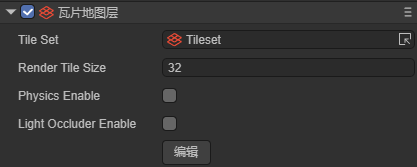
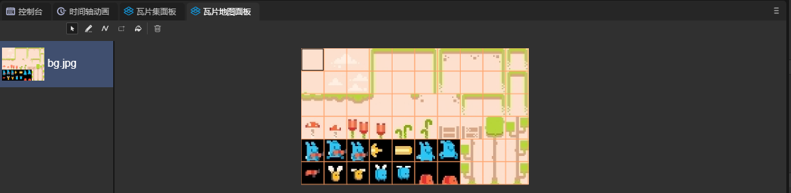
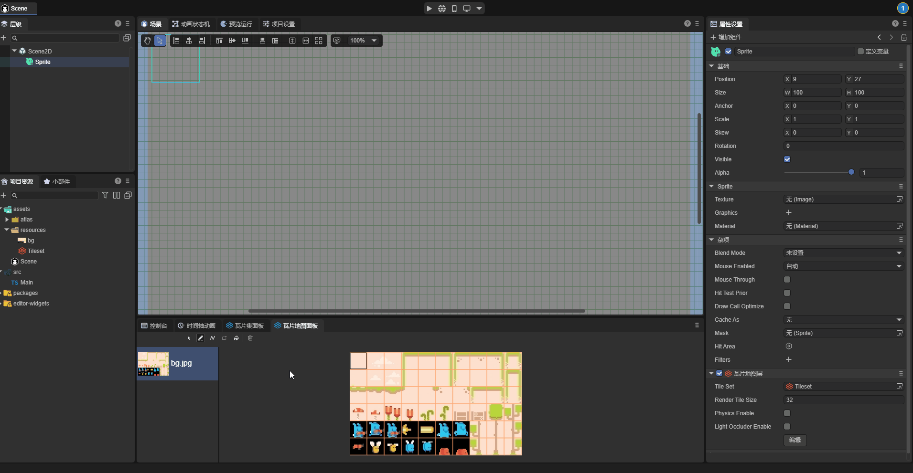
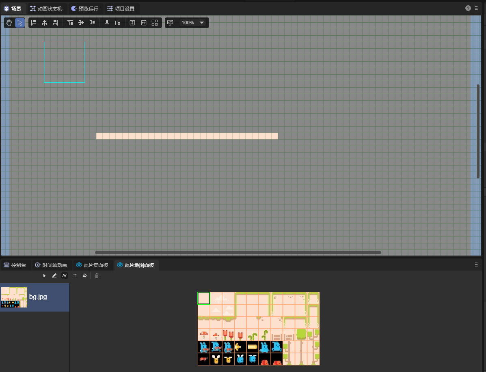
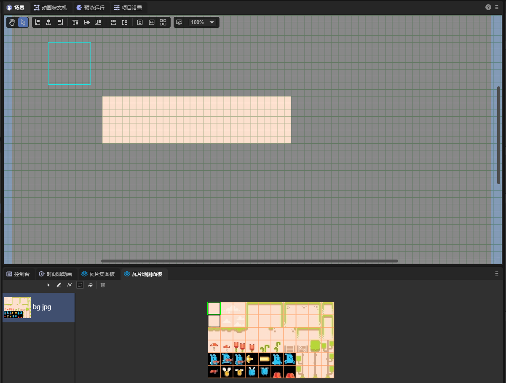
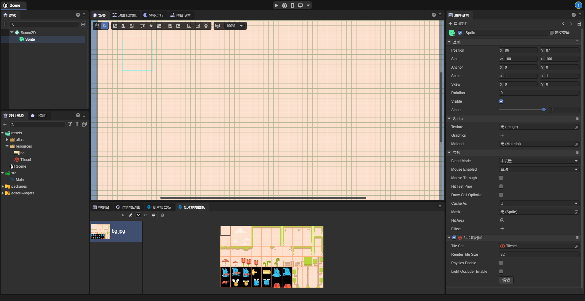

# Tile Map Layer

Before using the tile map layer component, please read the documentation of the [**Tile Map**](..\..\..\assets\TileSet\readme.md) resource first.

## 1. Overview

The tile map (Tilemap) is a tile grid used to create the game layout. Using tile maps in game development has many advantages. First, tile maps can draw the layout by "drawing" tiles onto the grid, which is much faster than placing individual 2D nodes one by one. Secondly, tile maps allow for larger levels because it is optimized at the algorithm level for drawing a large number of tiles. Finally, developers can add physical collisions, light occlusion, etc. to the tiles to add more functionality to the tile map.

## 2. Tile Map Component

Before creating a tile map, developers need to set up the [**Tile Map Resources**](..\..\..\assets\TileSet\readme.md) first, then add a node in the hierarchy panel and add a tile map layer (TileMapLayer) component to it, as shown in Figure 2-1,

(Figure 2-1)

`Tile Set`: The previously set tile set.

`Render Tile Size`: The size of the rendered tile, used to control the render size of each tile in the tile map, the unit is "pixel", and the default value is 32 pixels.

`Physics Enable`: Whether to enable the physics system, used to control whether the physics system of the tile map is enabled. When enabled, the tile map will have features such as physical collisions.

`Light Occluder Enable`: Whether to enable light occlusion, used to control whether the light occlusion system of the tile map is enabled. When enabled, the tile map can have an occlusion effect on 2D lighting.

`Edit`: After clicking the edit button, the scene panel will become grid-like, as shown in Figure 2-2, for editing the tile map.

(Figure 2-2)

## 3. Tile Map Panel

When editing the tile map, it is necessary to operate in combination with the tile map panel, as shown in Figure 3-1,

(Figure 3-1)

Draw: Tiles can be drawn directly in the scene, as shown in Animation 3-2.

(Animation 3-2)

Delete: It can be like an eraser to clear unnecessary tiles, as shown in Animation 3-3.

(Animation 3-3)

Line: A straight line can be drawn using the selected tiles, as shown in Figure 3-4.

(Figure 3-4)

Rectangle: As shown in Figure 3-5, a rectangular area can be framed using tiles.

(Figure 3-5)

## 4. Multi-Layer Tile Map

Sometimes, developers need to add multi-layer tile maps. For example, the bottom layer is for the background, the middle layer is for buildings, and the top layer is for characters, etc. To implement a multi-layer tile map, multiple nodes need to be added, and one node is one layer of the tile map.

As shown in Figure 4-1, draw the background with tiles on the bottom layer,

(Figure 4-1)

As shown in Figure 4-2, add characters on the upper layer.

(Figure 4-2)