# 2D Pathfinding

## 1. Overview

In modern game development, the automatic pathfinding feature has become one of the indispensable basic functions. Whether it's the automatic movement of characters, the patrol of NPCs, or the following of pets, a pathfinding system is required. Click on a position in the scene, and the character (Agent) will automatically find a path to reach the destination. There may be many obstacles during the pathfinding process, and the character will automatically bypass the obstacles to reach the end point.

LayaAir provides developers with a 2D pathfinding solution. There can be many ways to implement automatic pathfinding. One of the more traditional ones is to use the "A* pathfinding" algorithm, which is used in many web games and client games. This technology can also be used for pathfinding in LayaAir. Refer to the method provided [here](../../../../basics/IDE/importJsLibrary/readme.md).

This article introduces the built-in 2D pathfinding system NavMesh2D in LayaAir. Before using it, first, you need to check the "Navigation and Pathfinding" module in the "Project Settings" panel, as shown in Figure 1-1,

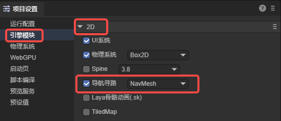

(Figure 1-1)

The 2D pathfinding system is implemented through two components: 2D navigation mesh surface (NavMesh2DSurface) and 2D navigation agent (Nav2DAgent). The 2D navigation mesh surface defines the navigation mesh, representing the area where the character can move. The 2D navigation agent defines the pathfinding agent, which is used to represent the main object of pathfinding (characters, NPCs, vehicles, etc.).


## 2. 2D Navigation Mesh Surface

As shown in Figure 2-1, there is a 2D scene with a terrain background. There are mountains, lakes, paths, etc. in the scene,


(Figure 2-1)

### 2.1 Component Properties

On this terrain background layer, add a sprite to create a navigation mesh. Add the `2D Navigation Mesh Surface` component to the sprite, as shown in Figure 2-2,

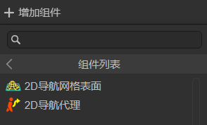

(Figure 2-2)

The added component is shown in Figure 2-3,

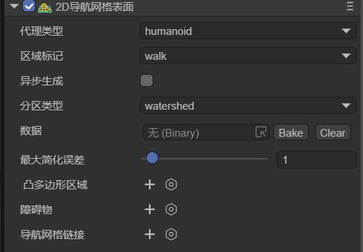

(Figure 2-3)

The properties are introduced respectively:

#### 2.1.1 Agent Type `agentType`

Used to specify the type of agent for pathfinding on this navigation surface. In the pathfinding system, an agent is an abstract concept used to represent the main object of pathfinding, such as characters, NPCs, and vehicles in the game. Different types of agents have different characteristics and limitations during pathfinding, such as size, movement mode, and types of accessible areas. The role of agent type is to enable developers to flexibly set and adjust local pathfinding parameters according to different types of pathfinding objects in the game to meet the needs of the game.

The default value is Humanoid (humanoid character), indicating the navigation settings suitable for humanoid characters and is suitable for most humanoid character navigation in games.

As shown in Figure 2-4, developers can open the configuration interface by selecting the `open Agent Settings` option and add a custom agent type.

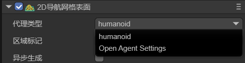

(Figure 2-4)

The configuration page of Agents is shown in Figure 2-5,


(Figure 2-5)

Note that this page is not to adjust the agent itself but to adjust the terrain applicable to this agent. The meanings of its parameters are introduced below,

`agentName`: The name of the Agent type applicable to the navigation mesh surface. The name entered here will be the same as the name of the option at the agent type, as shown in Figure 2-6.

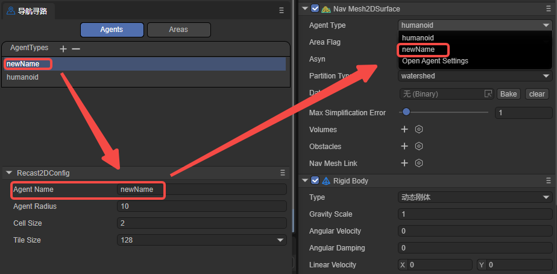

(Figure 2-6)

`agentRadius`: This value determines the minimum distance between the Agent and obstacles during navigation. A larger radius will keep the Agent at a greater distance from obstacles.

`cellSize`: The cell size of the navigation mesh. A smaller cell size will generate a more detailed navigation mesh but will increase memory usage and computational cost.

`tileSize`: The tile size of the navigation mesh. The navigation mesh can be divided into multiple tiles for more efficient generation and loading of navigation data in large scenes.

#### 2.1.2 Area Flag `areaFlag`

Used to mark the area type of the current static navigation surface, such as walkable areas, water, obstacle areas, etc. Area flags can affect the agent's preferences and avoidance behavior for different areas during pathfinding.

As shown in Figure 2-7, developers can open the configuration interface by clicking the `open Area Settings` option and add a custom area flag type.


(Figure 2-7)

The configuration interface of Areas is shown in Figure 2-8,

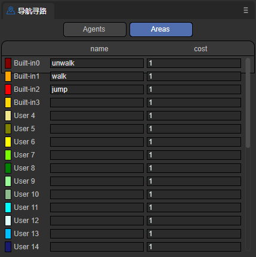

(Figure 2-8)

`name`: The name of the area type. The name entered here will be the same as the name of the option at the area flag, as shown in Figure 2-9.


(Figure 2-9)

`cost`: Specifies the relative cost or difficulty for the agent to traverse this type of surface during navigation. Usually, it is a positive number. A higher value indicates a higher cost or difficulty to pass through the surface. For example, the Cost of the water surface can be set to 5, while the Cost of the ordinary ground can be set to 1, indicating that it is more difficult for the agent to cross the water surface compared to the ordinary ground.

In general, by setting different areaFlags, you can control how the agent interacts with different types of surfaces during navigation. The agent will prefer paths with lower Cost during pathfinding and avoid surfaces with higher Cost. Developers can set appropriate areaFlags and Cost values for different surface types according to their own needs to affect the agent's navigation behavior.

#### 2.1.3 Asynchronous Generation `asyn`

Indicates whether to enable the asynchronous generation of navigation. When asynchronous baking is checked, the generation process of the navigation mesh will be performed asynchronously in the background without blocking the execution of the main thread. Enabling asynchronous generation can ensure that only one tile is generated per frame during game runtime, improving the fluency of scene loading and editing.

#### 2.1.4 Partition Type `partitionType`

Used to specify the partitioning method of the navigation mesh. As shown in Figure 2-10, there are three options: Monotone (monotone partitioning), Watershed (watershed partitioning), and Layer (hierarchical partitioning).

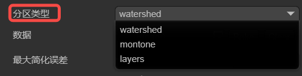

(2-10)

`Monotone`: Uses the monotone polygon partitioning algorithm. The created navigation mesh area has a simple shape and smooth edges and is suitable for simple scenes. Monotone partitioning generates navigation meshes faster and occupies relatively less memory. However, for complex scenes, Monotone partitioning may produce less precise navigation meshes.

`Watershed`: Compared with Monotone partitioning, Watershed partitioning generates navigation meshes slower and occupies relatively more memory. However, Watershed partitioning can better adapt to complex scenes and generate more precise and natural navigation mesh areas and is suitable for scenes with high requirements for navigation mesh quality.

`Layers`: Suitable for scenes where different pathfinding rules need to be applied to different areas.

#### 2.1.5 Data `datas`

Click the `Bake` button to pop up the baking panel, as shown in Figure 2-11. Select the child nodes to be baked from the hierarchy panel (the surface node has added the 2D navigation mesh surface component), drag them into the baking panel, and select the nodes for baking as needed.


(Figure 2-11)

`Active`: Indicates whether the node participates in the generation of the navigation mesh. When checked, the data of this node will be used to generate the navigation mesh. When unchecked, this node will be completely ignored.

`Bake From`:

- Graphics generates the navigation mesh from the graphic data of the Sprite. For example, as shown in Figure 2-12,

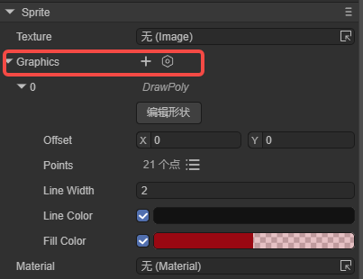

(Figure 2-12)

- Physics generates the navigation mesh from the physical collider data. For example, as shown in Figure 2-13,

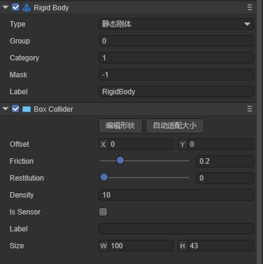

(Figure 2-13)

- MeshRender generates the navigation mesh from the mesh data. For example, as shown in Figure 2-14,

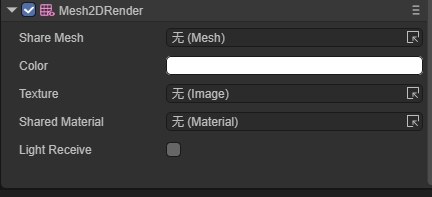

(Figure 2-14)

- None does not use any existing data.

After setting, click the `Bake` button in the upper right corner to generate the navigation mesh file. If you need to re-select the nodes, click `Clear`.

The final baking result (.bin file) will be saved in a new folder created in the assets directory (named after the scene where the node is located). Moreover, the baked file will be automatically added to the datas property.

Generally, baking the navigation mesh is usually performed after the scene editing is completed to ensure that the navigation mesh is consistent with the latest scene state. If the positions of scene nodes and their child nodes are moved, or rotated, etc., the node data needs to be re-baked (cannot exist in the prefab. If it is dragged into the scene from the prefab, the data needs to be re-baked). Because the baked navigation mesh will not change dynamically with the scene. Developers can first click the `clear` button to clear the original datas data and then re-bake.

#### 2.1.6 Maximum Simplification Error `maxSimplificationError`

Defines the maximum error value allowed when simplifying the polygon border, mainly used to control the degree of simplification of the navigation mesh. This value affects the generation quality of the navigation mesh. A larger value results in a higher degree of simplification, generating a rougher navigation mesh with better performance. A smaller value results in a lower degree of simplification, generating a more accurate navigation mesh but with greater performance consumption.

A larger value reduces the complexity of the navigation mesh and improves the pathfinding performance. Therefore, for simple scenes, a larger value can be used. But the value should not be set too large, otherwise, it may lead to inaccurate pathfinding.

A smaller value retains more details and improves the accuracy of pathfinding. Therefore, for scenes that require precise pathfinding, it is recommended to use a smaller value. But do not set it too small, which may cause unnecessary performance overhead.

#### 2.1.7 Convex Polygon Area `volumes`

Represents a component used in the navigation system to modify the properties of the navigation mesh within a certain area. It allows defining an area in the scene and adjusting its size, shape, position, etc. There is no need to re-bake after setting, and the parameters are shown in Figure 2-15.

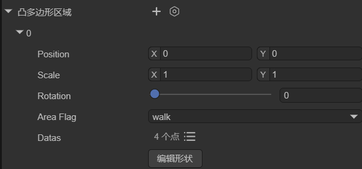

(Figure 2-15)

`Position`: Sets the position of the dynamic area.

`Scale`: Sets the scale of the dynamic area.

`Rotation`: Sets the rotation of the dynamic area.

`AreaFlag`: Sets the area flag of the dynamic area.

`Datas`: Sets the vertex positions and number of the shape of the dynamic area.

`Edit Shape`: After clicking, you can edit the shape of the dynamic area in the scene by dragging with the mouse.

Developers can set the modified area to a different area flag (areaFlag), that is, set a different cost value (cost) for this area. This cost value will affect the cost calculation when passing through this area during pathfinding. A higher cost value will make the character tend to avoid this area, while a lower cost value will encourage the character to pass through this area.

For example, as shown in Figure 2-16, when the agent moves from point A to point B, there is a dynamic area in the middle, and its area flag is unwalk, indicating that it is not walkable (the orange part indicates the walk area). Then the agent will bypass this area during pathfinding.


(Figure 2-16)

#### 2.1.8 Obstacles `obstacles`

Used to represent the areas regarded as obstacles during pathfinding. By placing obstacle areas in the scene and setting the size and shape of the obstacles, it affects the generation of the navigation mesh and the calculation of pathfinding. The parameters are shown in Figure 2-17.


(Figure 2-17)

`Position`: Sets the position of the obstacle.

`Scale`: Sets the scale of the obstacle.

`Rotation`: Sets the rotation of the obstacle.

`AreaFlag`: Sets the area flag of the obstacle.

`MeshType`: Sets the type of the obstacle: box, cycle, mesh.

`Edit Shape`: After clicking, you can move the obstacle in the scene by dragging with the mouse.

As shown in Figure 2-18, the box-type obstacle can change the navigation mesh without re-baking (the orange part is the previously baked navigation mesh).

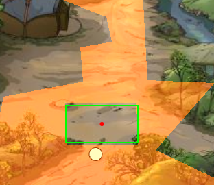

(Figure 2-18)

#### 2.1.9 Navigation Mesh Link `navMeshLink`

A component used to connect two different navigation mesh surfaces. It allows creating links between navigation meshes. By specifying the start and end points during movement, the character can move on these links and thus perform pathfinding between different navigation areas. The parameters are shown in Figure 2-19,


(Figure 2-19)

`AreaFlag`: Sets the area flag of the navigation area link.

`Start`: The starting position of the link, specifying the position and direction where the link starts. The link will start from this starting position.

`End`: The ending position of the link, specifying the position and direction where the link ends. The link will end at this ending position.

`Width`: The width of the link, determining the size of the passable area of the link.

`Bidirectional`: Whether it is a two-way link. If not checked, the link can only be one-way. The agent can only go from the start point to the end point and cannot go from the end point to the start point.

As shown in Figure 2-20, when the agent needs to find a path from the area on the left to the area on the right, the navigation area link component is required.

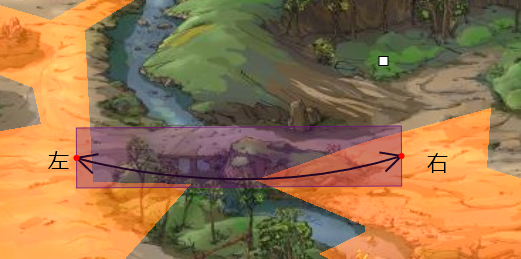

(Figure 2-20)

### 2.2 Generate Navigation Area

To implement pathfinding navigation in the scene of Figure 2-1, you first need to generate a pathfinding area based on the terrain. Taking baking the graphics area as an example, you first need to outline the terrain using the graphics property of the sprite, as shown in Figure 2-21. Use the sprite to outline the mountain path (this is only for demonstration and does not strictly control the boundary).


(Figure 2-21)

The graphics of node sprite(7) is the same size as the background, and the 2D navigation mesh surface component is added to the node surface. The area flag is set to walk. The baking settings are shown in Figure 2-22,

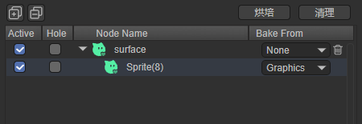

(Figure 2-22)

The final baking effect is shown in Figure 2-23, which is all the passable areas.

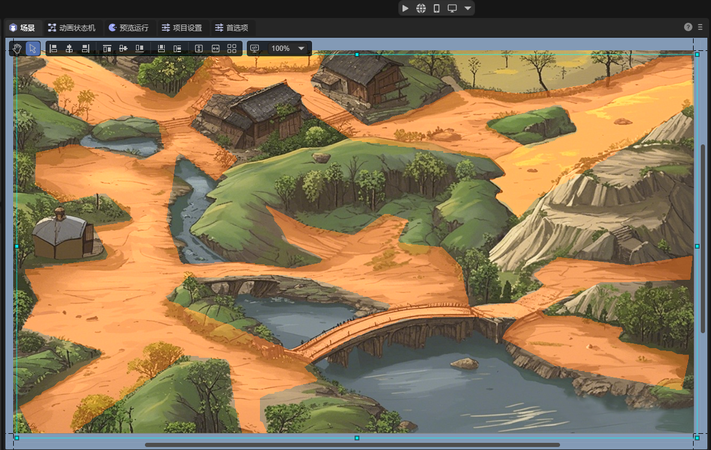

(Figure 2-23)


## 3. 2D Navigation Agent

The navigation agent is a component used in the navigation system to control the movement and pathfinding of pathfinding objects such as characters or objects on the navigation mesh. It is the main component for the interaction between the pathfinding object and the navigation system and is responsible for handling the movement, obstacle avoidance, and path planning of the pathfinding object. This component is the key to achieving autonomous pathfinding and movement of the pathfinding object in a complex environment.

The navigation agent is only circular, which simplifies calculations and greatly simplifies complex shapes. Moreover, the circle has no sharp corners, making the agent move more smoothly in the environment and less likely to get stuck or cross small obstacles.

### 3.1 Component Properties

Create a node in the scene and add the 2D navigation agent component to it, as shown in Figure 3-1,


(Figure 3-1)

After selecting the `agent type`, developers can adjust some properties of this navigation agent:

| Chinese Property Name | English Property Name | Property Explanation |
| ------------ | ---------------- | ------------------------------------------------------------ |
| Radius | Radius | Sets the collision radius of the agent. It determines the occupied area of the agent on the navigation mesh and affects its collision detection with obstacles. |
| Speed | Speed | Sets the maximum movement speed of the agent. A larger speed allows the agent to reach the destination point faster. |
| Max Acceleration | Max Acceleration | Sets the maximum acceleration of the agent. This determines the acceleration when the agent starts moving, stops moving, or changes direction. |
| Avoidance Quality Level | Quality | Defines the avoidance quality of the agent. It affects the accuracy and efficiency of the path calculation of the agent on the navigation mesh. A higher quality can generate a more accurate and optimized path but may increase the computational cost. |
| Avoidance Priority Level | Priority | Sets the avoidance priority of the agent. A higher priority allows the agent to have a higher priority during pathfinding and obstacle avoidance. The smaller the value, the higher the priority. |
| Navigation Area Type | Area Mask | Sets the types of navigation areas that the agent can pass through. It can restrict the agent to move only within specific types of areas. |

### 3.2 Character Pathfinding

First, you can create a Sprite node (Hit) in the scene and draw a graphic to display the position clicked by the mouse. Use another Sprite node (allow) and draw a graphic to represent the character for pathfinding, as shown in Figure 3-2,


(Figure 3-2)

Create a custom component script on the surface node in Figure 2-21:

```typescript
import Sprite = Laya.Sprite;
import Component = Laya.Component;
import Nav2DAgent = Laya.Nav2DAgent;

const { regClass, property } = Laya;

@regClass()
export class TestSprite extends Laya.Script {

    // Used to display the position clicked by the mouse
    @property({ type: Laya.Sprite })
    public hit: Sprite;
    
    private _temp: Sprite;
    private _allAgent: Nav2DAgent[] = [];
    
    private findCompents(lists: any[], sprite: Sprite, componentType: typeof Component) {
        let comp = sprite.getComponent(componentType);
        if (comp!= null) {
            lists.push(comp);
        }
        for (var i = 0; i < sprite.numChildren; i++) {
            let child = sprite.getChildAt(i) as Sprite;
            this.findCompents(lists, child, componentType);
        }
    }
    
    // Executed after the component is activated. At this time, all nodes and components have been created, and this method is executed only once
    onAwake(): void {
        let sprite = this.owner as Laya.Sprite;
        //sprite.cache = true;
        this._temp = new Laya.Sprite();
        this.owner.scene.addChild(this._temp);
        this.findCompents(this._allAgent, sprite.scene, Nav2DAgent);
    }


    onMouseClick(evt: Laya.Event): void {
        let pos = new Laya.Vector2(evt.stageX, evt.stageY);
        console.log("click", pos);
        this._temp.graphics.clear();
        this._allAgent.forEach((agent) => {
            agent.destination = pos;
            let paths = agent.getCurrentPath();
            if (paths.length >= 2) {
                let points: any = []
                paths.forEach((point) => {
                    points.push(point.pos.x, point.pos.z);
                });
                this._temp.graphics.drawLines(0, 0, points, "#00000030", 5);
            }


        })
        this.hit.pos(pos.x, pos.y);
    }
}
```

In this way, the position clicked by the mouse is the destination, and the character will automatically avoid obstacles and reach the destination. The effect is shown in the animation 3-3,

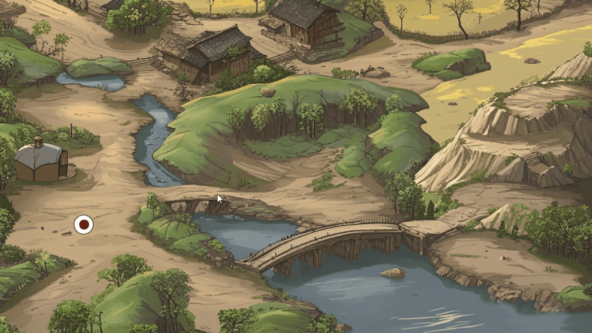

(Animation 3-2)