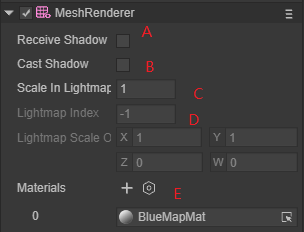
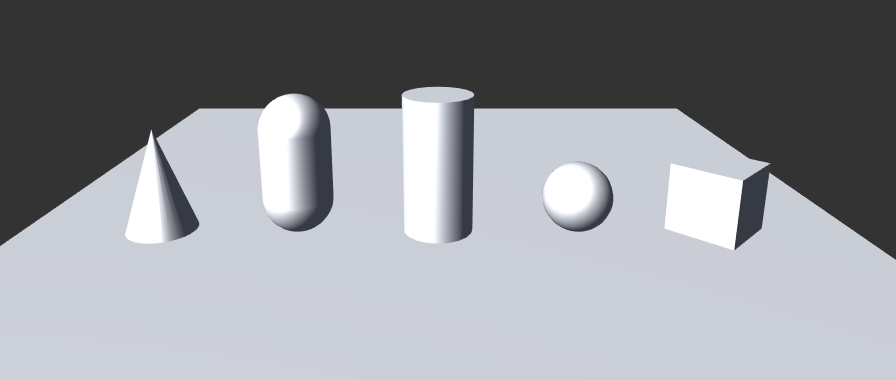

# Mesh of component system

## 1.Mesh

### 1.1 Mesh Overview

Mesh refers to the mesh data of the model. The 3D model is made up of polygons, and a complex polygon is actually made up of multiple triangles. So the surface of a 3D model is composed of multiple triangular faces connected to each other. In three-dimensional space, the collection of data that constitute the vertices of these triangles and the index data of the triangles is a Mesh.

 

Figure 1.1

#### 1.2 Mesh data

A mesh data contains a lot of data information. Common vertices, normals and other data in Shader are obtained from Mesh data.

A standard grid data consists of the following attributes:

- Vertex: a collection of positions in three-dimensional space
- Topology: the basic fragment type of Mesh
- Index: Index data, a collection of integers describing vertex combination fragments

**Vertex: vertex data**

Each vertex can have the following attribute contents:

- position vertex

The vertex position indicates the specific position of the vertex in the model space. This value is used in the engine to determine the surface of the Mesh. All meshes require this vertex attribute and is a must.

- normal normal

Vertex normals represent the direction pointing directly "out" from the surface at the vertex location.

- tangent

A vertex tangent represents the direction along which the "u" (horizontal texture) axis of the surface at the vertex location points.

- color color

Vertex color represents the base color of the vertex (if any).

- uv coordinates

A mesh can contain up to eight sets of texture coordinates. Texture coordinates are often called UVs, and these collections are called channels.

- Bones (optional)

In a skinned mesh, the blend index represents which bones affect the vertices, and the bone weight describes how much those bones affect the vertices.

**Topology: fragment topology**

The topology of the mesh defines the structure of the index buffer, which in turn describes how vertex positions are combined into faces. Each topology type uses a different number of elements in the index array to define a single face

LayaAir supports the following mesh topologies:

- Triangle
- Quad
- Lines
- Points

**Index Data: Index data**

The index array contains integers that reference elements in the vertex position array. These integers are called indices

For example, for a grid containing an indexed array of the following values:

0,1,2,3,4,5

If the mesh has a triangle topology, then the first three elements (0,1,2) identify one triangle and the last three elements (3,4,5) identify another triangle. There is no limit to the number of faces a vertex can contribute. This means that the same vertex can appear multiple times in the index array.

## 2.Mesh component--MeshRenderer

The Mesh Renderer component is used to render meshes. This component is used in conjunction with the Mesh Filter component on the same game object; the Mesh Renderer component renders the mesh referenced by the Mesh Filter component.

In the engine code, the MeshRenderer class inherits from the BaseRender component class.

### 2.1 Mesh Renderer Inspector

 

Figure 2-1

A: Specify whether the Render displays cast shadows

B: Specify whether and how the renderer casts shadows when a suitable light shines on the Render.

C: LightMap zoom size

D: LightMap index number

E: Render material list

### 2.2 Material of MeshRenderer

**The difference between Material and Share Material**‘

> Material

When we reference and modify this property, LayaAir will return the first instantiated material under the Render and assign it to the current MeshRederer component.

So, what is the first instantiated material?

Each MeshRenderer component has a Materials property. This array determines how many material components can be placed under the object. The default is 1.

When there are many materials on the same object, we can manually change the upper and lower position relationship of the material components. The first instantiated material here refers to the first material component from top to bottom on the object, not MeshRenderer.materials[0], which means that every time we reference it, a new material will be generated. into memory. However, the original property settings of the shader in our project will not be changed after the reference.

> Share Material

When we change Renderer.sharedMaterial, all objects using this material ball will be changed, and the changed settings will be saved in the project

Assume that cube01 and cube02 share a material redMat. When we want to modify the properties of the material on cube01 through sharedMaterial, the corresponding properties on cube02 will also be modified.

> Summary

When using MeshRenderer.material, each call will generate a new material into memory.

When using Renderer.sharedMaterial, a new material will not be generated, but the original material will be modified directly, and the modified settings will be saved to the project. It is generally not recommended to use this to modify. When a certain material ball is only used by one game object, you can use this to modify it. It is also best to save the original attribute settings before modifying, and restore the original settings immediately after use to prevent the next time. The previous setting information will remain on the loaded gameobject.

If it is a game object like the protagonist that needs to modify many material properties or shader properties, you can use material for the first time, which can dynamically generate a material instance, and then use shared material to dynamically modify the newly generated material. , and no new material will be created

## 3.Mesh component--MeshFilter

The Mesh Filter component contains a reference to the mesh. This component works with a Mesh Renderer component on the same GameObject; the Mesh Renderer component renders the mesh referenced by the Mesh Filter component.

### 3.1 MeshFilter Inspector Quote

Figure 3-1

**Mesh Properties**

Reference to a mesh resource To change the mesh resource referenced by the MeshFilter component, select the arrow identifier next to the mesh name to invoke the picklist to select the desired Mesh mesh.

**Note**: When you change the mesh referenced by a Mesh Filter component, the settings of other components on this game object do not change. For example, the MeshRenderer component does not update its settings, which may cause the engine to render the mesh with unexpected properties. If this happens, adjust the settings of other components as needed

## 4. Create a simple Mesh through PrimitiveMesh

 In the course to quickly start the 3D journey, we have used the **createBox** method of **PrimitiveMesh** to create a box model. In this lesson, we introduce this class to create other basic models and use transform to adjust it. Location. More detailed usage can be found in [View API](https://layaair.ldc.layabox.com/api2/Chinese/index.html?category=Core&class=laya.d3.resource.models.PrimitiveMesh).

What should be noted when creating is that the engine loaded into the scene comes with a model, and the pivot point is at the center of the model, so we use the center point of the model as a reference to move, rotate, and scale. When loaded into a scene, the model will be placed at the world coordinate origin of the scene by default.

```typescript
//Create an empty node to place each model
sprite3D = scene.addChild(new Laya.Sprite3D());
//cube
var box = sprite3D.addChild(new Laya.MeshSprite3D(Laya.PrimitiveMesh.createBox(0.5, 0.5, 0.5)));
box.transform.position = new Laya.Vector3(2.0, 0.25, 0.6);
box.transform.rotate(new Laya.Vector3(0, 45, 0), false, false);
//sphere
var sphere = sprite3D.addChild(new Laya.MeshSprite3D(Laya.PrimitiveMesh.createSphere(0.25, 20, 20)));
sphere.transform.position = new Laya.Vector3(1.0, 0.25, 0.6);
//Cylinder
var cylinder = sprite3D.addChild(new Laya.MeshSprite3D(Laya.PrimitiveMesh.createCylinder(0.25, 1, 20)));
cylinder.transform.position = new Laya.Vector3(0, 0.5, 0.6);
//capsule body
var capsule = sprite3D.addChild(new Laya.MeshSprite3D(Laya.PrimitiveMesh.createCapsule(0.25, 1, 10, 20)));
capsule.transform.position = new Laya.Vector3(-1.0, 0.5, 0.6);
//Cone
var cone = sprite3D.addChild(new Laya.MeshSprite3D(Laya.PrimitiveMesh.createCone(0.25, 0.75)));
cone.transform.position = new Laya.Vector3(-2.0, 0.375, 0.6);
//flat
var plane = sprite3D.addChild(new Laya.MeshSprite3D(Laya.PrimitiveMesh.createPlane(6, 6, 10, 10)));
```

The effect is as shown in Figure 2-2:


Figure 2-2


