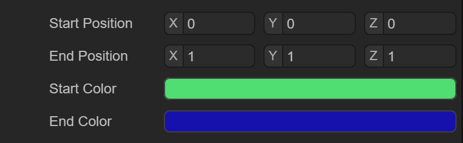

# Pixel lines


## 1. Overview

Pixel Line (Pixel Line) can also be called pixel line 3D sprite. It is a way to draw 3D sprite by rendering a set of colored lines, as shown in Figure 1-1


(Picture 1-1)

As shown in Figure 1-1, these are the six grid modes of 3D basic display objects provided by IDE. It is a drawing method that uses lines to display the grid.


## 2. Creation and use in IDE

### 2.1 Create pixel line 3D sprite

In the Hierarchy window of a 3D scene, under any node or in a blank position, you can create a pixel line 3D sprite by right-clicking the mouse, as shown in animation 2-1.


(Animation 2-1)

The pixel line 3D sprite created at this time does not have any effect. In fact, an empty 3D sprite node is created and the Pixel Line Renderer component is added. Let’s learn about pixel line rendering. Device component information


### 2.2 Property settings

As shown in Figure 2-2, the pixel line renderer has the following properties


(Figure 2-2)

Since the `Pixel Line Renderer` component inherits from the `Base Renderer` component, the pixel line renderer itself has some basic properties, as shown in Figure 2-3


(Figure 2-3)

Basic properties such as Receive Shadow `Receive Shadow`, shadow generation settings `Case Shadow` and the scaling and offset of the light map will not be introduced here.


### 2.3 Pixel line material

First, we create a new Material under Asset. By default, the Shader of Material is `BlinnPhone`. Next, we drag this Material into the material properties of the pixel line renderer, as shown in animation 2-4.


(Animation 2-4)

The second step is to modify the shader of `BlinnPhone` to `Laya.Unlit` shader and check `Vertex Color`


(Animation 2-5)

With the material in place, all that remains is to add pixel line data.


### 2.4 Pixel line data

There are two points in pixel line data, the maximum number of pixel lines and pixel line data, as shown in Figure 2-6

   

(Figure 2-6)

Max Line Count: Maximum number of lines

Pixel Lines Datas: Pixel line data

> Note: The number of pixel line data cannot exceed the maximum number of lines.

By default, a pixel line data has been added. The white line from the (0, 0, 0) point to the (0, 0, 0) point is just a point, and we cannot see the effect.

We can modify the End Position and color, as shown in Figure 2-7



(Figure 2-7)

After modification, we can see a most basic pixel line, as shown in Figure 2-8


(Figure 2-8)


At this point, the pixel line renderer has been introduced. Usually it is impossible for us to add each pixel line to draw a grid through the IDE. Often we will do it through code. Here we introduce how to use the code.


## 3. Creation and use in code

`PixelLineSprite3D` is a pixel line 3D sprite class provided by the LayaAir engine. Let’s take a look at the most important methods of this class.


### 3.1 Construction method

As you can see from the code below, when initializing a `PixelLineSprite3D` constructor, the code has helped us add the `PixelLineRenderer` component and set the `UnlitMaterial` material and check the use of `VertexColor`, as shown in section 2.3 above. The process of manually adding materials is automatically done in the code.

```typescript
	/**
 	* Create an instance of <code>PixelLineSprite3D</code>.
 	* @param maxCount The maximum number of line segments.
 	* @param name name.
 	*/
	constructor(maxCount: number = 2, name: string = null) {
    	super(name);

    	this._render = this.addComponent(PixelLineRenderer);
    	this._geometryFilter = (this._render as PixelLineRenderer)._pixelLineFilter;
    	(this._render as PixelLineRenderer).maxLineCount = maxCount;
    	let material = this._render.material = new UnlitMaterial();
    	material.enableVertexColor = true;
	}
```


### 3.2 AddLine()

`PixelLineSprite3D` has directly called `addLine()` of the `PixelLineRenderer` component. It seems that you can directly set the point position and color.

```typescript
	/*
 	* Add a line.
 	* @param startPosition initial point position
 	* @param    endPosition   	end point position
 	* @param    startColor   	Initial point color
 	* @param    endColor   	End point color
 	*/
	addLine(startPosition: Vector3, endPosition: Vector3, startColor: Color, endColor: Color): void {
    	(this._render as PixelLineRenderer).addLine(startPosition, endPosition, startColor, endColor);
	}
```


### 3.3 Tool.linearModel()

Usually we can use the `addLine()` method to convert complex grid data into pixel line data. We can write a Tool tool class to facilitate conversion:

```typescript
//Tool tool class
export class Tool {
    private static transVertex0: Vector3 = new Vector3();
    private static transVertex1: Vector3 = new Vector3();
    private static transVertex2: Vector3 = new Vector3();
    private static corners: Vector3[] = [];
    //Linear model conversion method
    static linearModel(sprite3D: Sprite3D, lineSprite3D: PixelLineSprite3D, color: Color): void {
   	 if (sprite3D instanceof MeshSprite3D) {
   		 var meshSprite3D: MeshSprite3D = <MeshSprite3D>sprite3D;
   		 //Get the grid data of the Sprite3D object
   		 var mesh: Mesh = meshSprite3D.meshFilter.sharedMesh;
   		 var positions: Array<Vector3> = [];
   		 //Copy and fill position data into array
   		 mesh.getPositions(positions);
   		 //Copy and get a copy of the grid index
   		 var indices = mesh.getSubMesh(0).getIndices();
   		 
   		 for (var i: number = 0; i < indices.length; i += 3) {
   			 //Get 3 location data each time
   			 var vertex0: Vector3 = positions[indices[i]];
   			 var vertex1: Vector3 = positions[indices[i + 1]];
   			 var vertex2: Vector3 = positions[indices[i + 2]];
   			 //Convert a three-dimensional vector to another normalized three-dimensional vector through a matrix
   			 Vector3.transformCoordinate(vertex0, meshSprite3D.transform.worldMatrix, this.transVertex0);
   			 Vector3.transformCoordinate(vertex1, meshSprite3D.transform.worldMatrix, this.transVertex1);
   			 Vector3.transformCoordinate(vertex2, meshSprite3D.transform.worldMatrix, this.transVertex2);
   			 //Draw 3 pixel lines
   			 lineSprite3D.addLine(this.transVertex0, this.transVertex1, color, color);
   			 lineSprite3D.addLine(this.transVertex1, this.transVertex2, color, color);
   			 lineSprite3D.addLine(this.transVertex2, this.transVertex0, color, color);
   		 }
   	 }
    }
}
```


### 3.4 Code usage

By using the tool class Tool.linearModel with the following code, the grid data of a PixelLineSprite3D object can be set to pixel line data:

```typescript
   	 //Create a sphere
   	 var sphere: MeshSprite3D = (<MeshSprite3D>this.sprite3D.addChild(new MeshSprite3D(PrimitiveMesh.createSphere(0.25, 20, 20))));
   	 sphere.transform.position = new Vector3(0.0, 0.75, 2);
   	 //Create a pixel line 3D sprite
   	 var sphereLineSprite3D: PixelLineSprite3D = (<PixelLineSprite3D>this.lineSprite3D.addChild(new PixelLineSprite3D(3500)));
   	 //Convert the mesh data of the sphere to pixel line data
   	 Tool.linearModel(sphere, sphereLineSprite3D, Color.GREEN);
```


At this point, the pixel line code part has been introduced. Often we can also convert an external model into pixel line data for use, which can enrich the display effect in actual projects.

As shown in animation 3-1, the pixel line effect of the external model is displayed.


(Animation 3-1)

 


