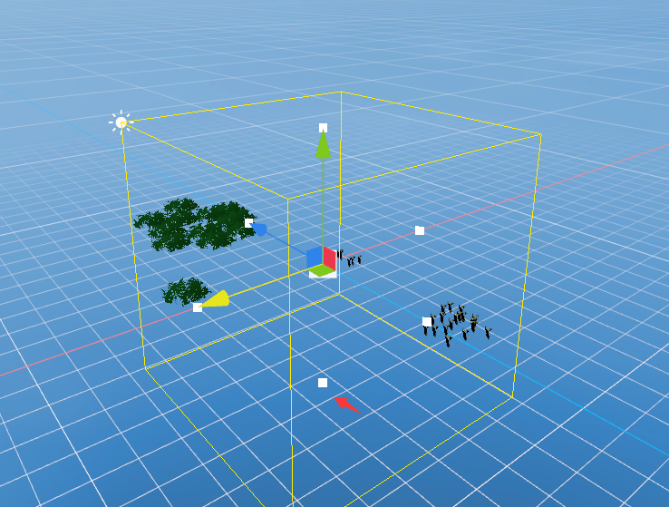

# Static Batch Volume component

In the Object's inspect panel, add a component, select the Rendering option, and find the Static Batch Volume component.

 

figure 1

Drag the small white dot in the Scene window to select the appropriate Volume size.

 

figure 2

Use of Static Batch Volume component:

After selecting the appropriate size for the Volume box above in the Scene, in the component's details panel, check Static Instance Batch, and then click reBatch. The selected objects in the Volume will perform Batch operations, optimize Draw Call, and improve operation. For efficiency, check the CheckLOD option and enable LOD Cull Rate Array to take over the object LOD group in the Volume. At this time, the LOD judgment of all objects in the Volume is no longer based on a single rendering object, but based on the LOD judgment of the Volume. The system will calculate Volume and Rate calculated in the field of view to select different LOD levels.

Rebatch will be automatically called in Game, and all objects in the Volume will automatically determine and perform Static Batch Instance operations.

 

image 3

 

Figure 4

