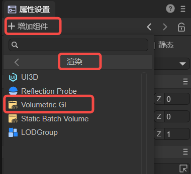
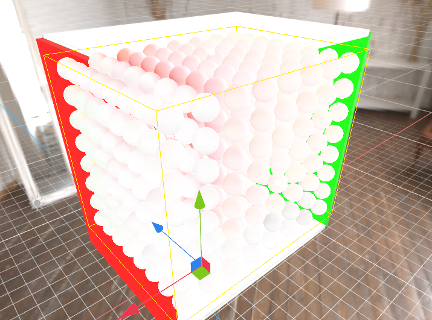
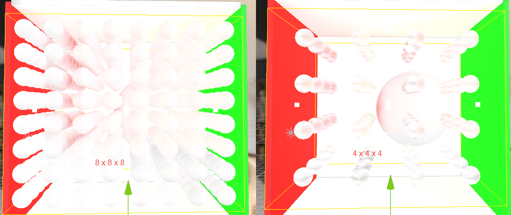

# Volumetric GI

## 1. Volumetric GI Overview

Volumetric Global Illumination (Volumetric GI) refers to a technique used in computer graphics to simulate the interaction of light with participating media such as fog, smoke, or volumetric clouds. It is designed to capture the scattering and indirect lighting effects caused by media in a realistic way.

Volumetric GI can enhance the visual quality and realism of a scene by taking into account the spread of light in participating media. It takes into account the scattering properties of the medium and calculates how light bounces and interacts with surrounding objects and surfaces. This technique is particularly useful for creating atmospheric effects, dynamic lighting scenes, and photorealistic renderings of translucent or volumetric materials.

There are various algorithms and methods used to implement volumetric GI, including:

1. Voxel-based methods: These techniques discretize three-dimensional space into a grid of voxels and simulate the propagation of light within the voxels. The voxel-based representation captures the density and scattering properties of the medium, allowing for realistic results.

2. Light Marching: This technique involves projecting light through participating media and accumulating light contributions along the path of the light. Indirect illumination can be calculated by repeatedly sampling the medium and evaluating its scattering properties.

3. Screen space methods: These methods utilize screen space information, such as depth and normal buffers, to approximate volumetric GI effects. They often employ various filtering and blending techniques to simulate diffuse and indirect lighting within the participating media.

3. Precomputed volumetric technology: In some cases, precomputed light transmission data can be used to accelerate the rendering of volumetric GI. This involves precomputing light interactions in participating media and storing them in data structures for efficient lookup during rendering.

Volumetric GI is a computationally intensive process that can require significant resources, especially for real-time applications. Therefore, it is often used selectively or combined with other lighting techniques to achieve the desired visual effect.

Overall, volumetric GI plays a vital role in creating realistic and immersive environments by accurately simulating the interaction of light with participating media. It adds depth, atmosphere and natural lighting effects to virtual scenes, enhancing the overall visual quality and realism.

## 2.Volumetric GI component

### 2.1 Create a Volumetric GI component

Volumetric GI components can be added to Sprite3D objects in the scene, and the engine's Volumetric GI components can provide real-time GI effects within the scope of the Volume.

In the property settings panel, the way to create a Volumetric GI component is as shown in Figure 2-1: Add component -> Rendering -> Volumetric GI.

(Figure 2-1)

(Figure 2-2)

### 2.2 Volume Bound

Only objects within the Volume Bound range will be affected by Volumetric GI. A certain number of probes are evenly distributed in the Volume Bound to collect surrounding spherical harmonic information.

(Figure 2-3)

### 2.3 Volumetric GI specific parameters

`Bound Min`: Controls the Bound surface in the negative direction of the X, Y, and Z axes.

`Bound Max`: Controls the Bound surface in the positive direction of the X, Y, and Z axes.

`Importance` Weight: Control the weight ratio between different Volumetrics.

`Probe Counts`: The number of Porbe arrangements in Bound.

Figure 2-4 shows the Probe arrangement of different orders of magnitude:

(Figure 2-4)

`Normal Bias`: The inward offset of the surface along the normal line to reduce errors caused by encountering the same pixel sampling.

`View Bias`: The offset of the surface along the direction of the field of view to reduce errors caused by encountering the same pixel sampling.

