# Shader Blueprint

## 1. Blueprint Overview

### 1.1 Creating the Blueprint

Right-click in the Assert window and select "Shader BluePrint" from the Create menu to create a blueprint file.

> When the blueprint file is not opened, the corresponding Shader file for the blueprint file is not created; the Shader file is created when the blueprint file is opened to complete the mapping correspondence between the blueprint and the Shader.

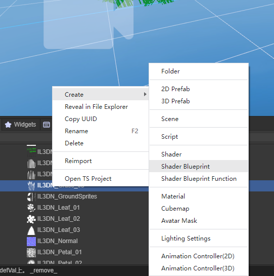

Figure 1-1

### 1.2 Blueprint Interface Preview

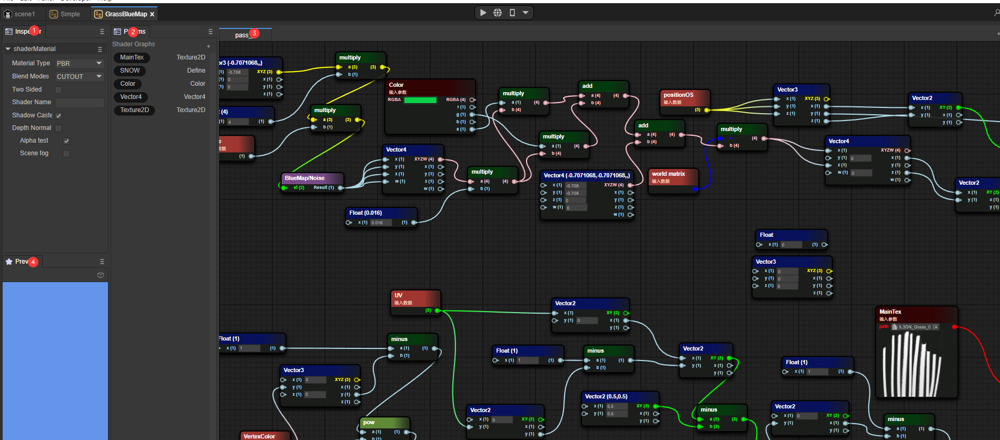

Figure 1-2

1. Inspector window of the blueprint file
2. Blueprint Params window
3. Blueprint Pass window
4. Blueprint preview window

## 2. Similarities and Differences with Shader

### 2.1 Three Fixed Basic Material Types

#### 2.1.1 PBR

Common Shader attributes:

- NormalWS

The world normal calculates the lighting result of each vertex in the world coordinate.

- alphaTest

After enabling the AlphaTest switch, the Shader determines whether to discard the pixel through the value of alophatest.

- AlbedoColor

The surface color (excluding lighting).

- Metallica

Metallicity, the value that describes the metallic property of an object. In fact, it controls to what extent the surface is like "metal". For pure surfaces, the value of metallicity may be 0 or 1. Most objects in reality are actually between this interval.

- Smoothness

Smoothness, which describes the smoothness of an object. Usually, it can be determined according to the blurriness or clarity of reflection or the extent or density of specular reflection highlights.

- Occlusion

The ambient occlusion parameter. Ambient occlusion is a kind of effect that approximates the attenuation of light due to occlusion. This is a subtle manifestation that makes corners and cracks darker to create a more natural and realistic appearance.

- Emission

Self-illuminating color.

- Anisotropy

The anisotropy parameter. Increasing the number of samplings to supplement the details displayed on the model in the texture.

- Alpha

Transparency. When the TRANSPARENT rendering mode is selected, different transparencies will be selected based on the Alpha value.

Figure 2-1 shows the fragment shader content of the Shader blueprint of the PBR material type.

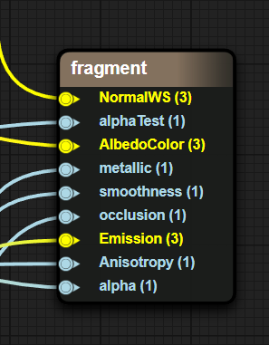

Figure 2-1

#### 2.1.2 UnLit

NormalWS

The world normal calculates the lighting result of each vertex in the world coordinate.

AlphaTest

After enabling the AlphaTest switch, the Shader determines whether to discard the pixel through the value of alophatest.

Color

Base color.

Alpha

Transparency. When the TRANSPARENT rendering mode is selected, different transparencies will be selected based on the Alpha value.

Figure 2-2 shows the fragment shader content of the Shader blueprint of the UnLit material type.

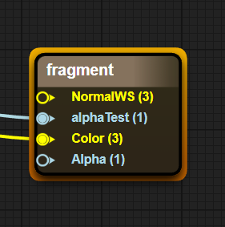

Figure 2-2

#### 2.1.3 Blinnphong

- NormalWS

The world normal calculates the lighting result of each vertex in the world coordinate.

- AlphaTest

After enabling the AlphaTest switch, the Shader determines whether to discard the pixel through the value of alophatest.

- DiffuseColor

Diffuse color (the color of the area where there is no lighting).

- SpecularColor

Specular color (the color of the area where there is lighting).

- Shininess

Surface smoothness.

- Gloss

Surface roughness.

- Aplha

Transparency. When the TRANSPARENT rendering mode is selected, different transparencies will be selected based on the Alpha value.

Figure 2-3 shows the fragment shader content of the Shader blueprint of the Blinnphong material type.

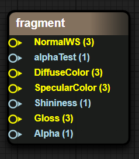

Figure 2-3

### 2.2 Material Blending Modes

- OPAQUE (Opaque)

  The final color = Source color. This means that the material will be drawn in front of the background.

- CUTOUT (Cutout)

  If the sampled Alpha value in the texture > AlphaTestValue, the final color is the source color; otherwise, the pixel is discarded.

- TRANSPARENT (Transparent)

  The final color = Source color opacity + Destination color (1 - opacity).

- ADDTIVE (Additive Blending)

  The final color = Source color + Destination color

- ALPHABLENDED (Alpha Blended)

  This means that the object is in a semi-transparent mode, but the blending mode of the final pixel shading is different. The AlphaBlended blending mode is SrcAlpha * SrcColor + (1 - SRCAlpha) * DstColor. Generally, SrcAlpha comes from the Alpha value of the texture.

### 2.3 ShaderName 

The input in the ShaderName text box is ShaderName.

### 2.4 ShadowCaster

The shadow calculation switch. When this switch is turned on,

### 2.5 DepthNormal

The DepthNormal switch. When this switch is turned on, the DepthNormal Pass is added to calculate the normal information of the scene (this function may be used in some post-processing).

### 2.6 AlphaTest

The Alpha test switch. When this switch is turned on, the Value function of the AlphaTest variable in the fragment shader is enabled. Transparent clipping is enabled. Pixels that trigger the alphatest Value condition are directly discarded and not filled with color.

### 2.7 SceneFog

The scene fog effect switch. When this switch is turned on, the sceneFog is enabled to calculate the range of the fog effect through the w value in the screen space.

## 3. Simple Examples

### 3.1 Display a Simple Model

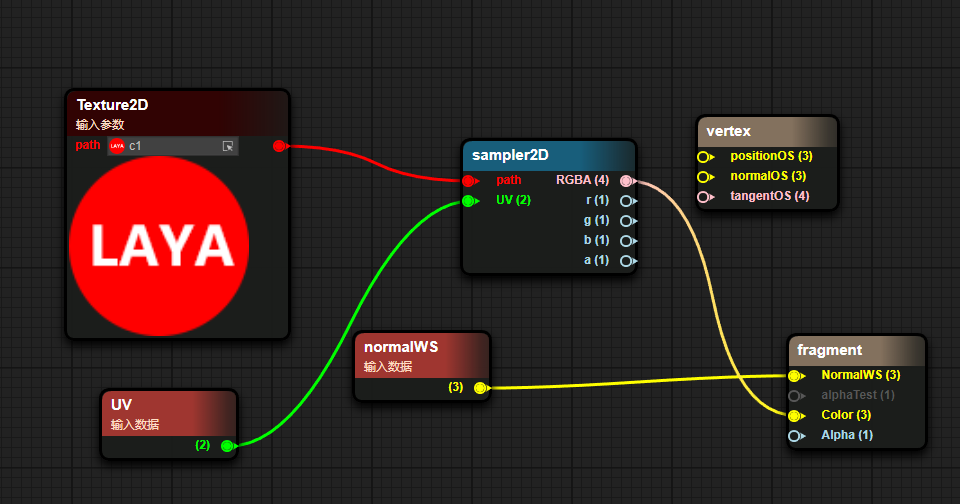

Figure 3-1

1. Pass in a texture through Params.
2. Pass in the texture through UV sampling.
3. Use the color sampled from the texture as the Color passed into Unlit.
4. Pass the world normal into the world normal input of Unlit.

The result of the blueprint is shown as follows

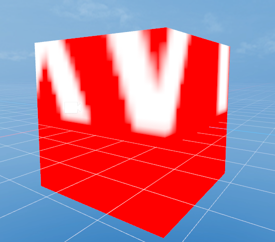

Figure 3-2

### 3.2 Display a Simple Blinnphong Material Ball

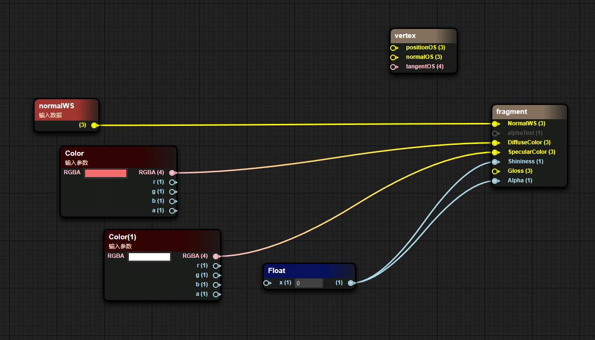

Figure 3-3

1. Pass in the world normal.
2. Pass in the surface color through Params.

The result of the blueprint is shown as the figure

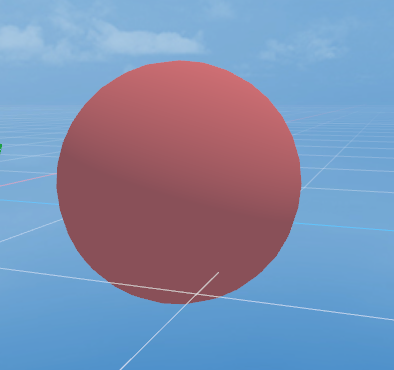

Figure 3-4

## 4. Transmission mode of node data

In the blueprint, on the left side of a node is the input data, and on the right side is the output data.

The input data can come from a source data, Params variable or the output of other nodes.

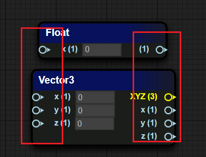

## 5. Common node types

### 5.1 Coordinate Types

| Coordinate Type | Coordinate Interpretation                                                   |
| -------------- | --------------------------------------------------------------------------- |
| PositionWS     |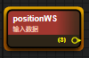 Vertex world coordinates in world space |
| normalWS       |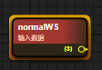 Vertex normal world coordinates in world space |
| tangentWS      |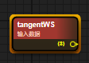 Vertex tangent world coordinates in world space |
| biNormalWS     |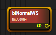 Vertex binormal world coordinates in world space |
| worldMat       |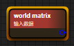 World space matrix |

### 5.2 Camera Class

| Attribute Type | Attribute Explanation |
| ---- | ---- |
| viewDirection |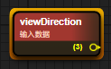 View vector (mathematical representation of the line of sight in 3D world space) |
| cameraPosition |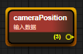 World space coordinates of the camera position |
| cameraDirection |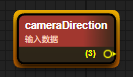 Forward direction of the camera |
| cameraUp |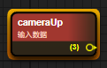 Up direction of the camera |
| cameraNear |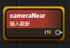 Size of the camera's near plane |
| cameraFar |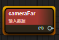 Size of the camera's far plane |

### 5.3 Mathematical Class

| Attribute Type | Attribute Explanation |
| ---- | ---- |
| add / minus / multiply / divide |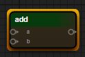 Four arithmetic operations |
| sin / cos / tan |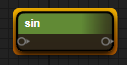 Trigonometric functions |
| clamp |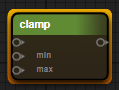 Clamp the value within the range of min and max |
| mix / max |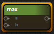 Minimum value, maximum value |
| step / smoothstep |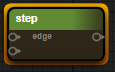 x > value : 0.0 : 1.0 |
| pow |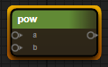 Power |
| dot / cross |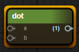 Dot product of vectors, cross product of vectors |

### 5.4 Texture Class

| Attribute Type | Attribute Explanation |
| ---- | ---- |
| sampler2D |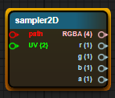 Ordinary sampling of 2D texture maps |
| samplerCube |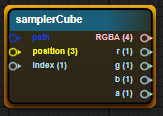 Sampling of 3D CubeMap |
| sampler2DNormal (OpenGL) |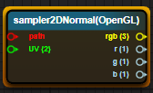 Sampling of normal maps (GL has the origin at the bottom - left corner) |
| sampler2DNormal (Directx) |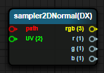 Sampling of normal maps (DX has the origin at the top - left corner) |

### 5.5 Color Class

| Attribute Explanation | Attribute Type |
| ---- | ---- |
| GammaToLinear |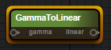 Conversion from gamma space to linear space |
| LinearToGamma |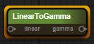 Conversion from linear space to gamma space |

## 6. Common Param Types

Add a Params variable. Select the "+" in the Params window and choose the corresponding Params variable type

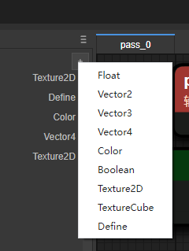

Figure 6-1

### 6.1 Float

Define a float value and try using a float type object in the Inspector panel first

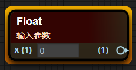

Figure 6-2

### 6.2 Texture2D

Define a value of 2D texture and display a 2D texture type object in the Inspector panel

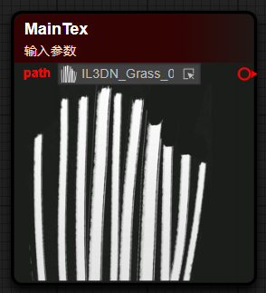

Figure 6-3

### 6.3 Vector2/3/4

Define a vector type, which is divided into Vector2, Vector3, and Vector4 according to the different component quantities

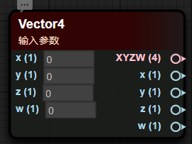

Figure 6-4

### 6.4 Color

Define a color value, which usually has data of four components: RGBA

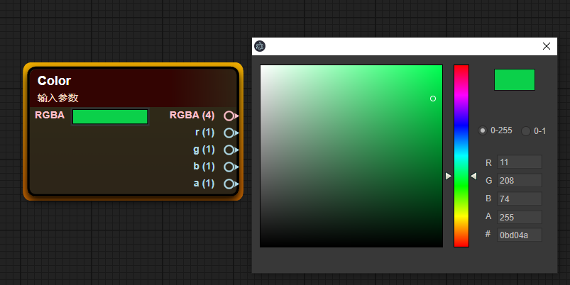

Figure 6-5

### 6.5 Define

Macro definition is used to execute different result contents based on different trigger results of macro conditions, and its efficiency is higher than if-else

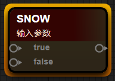

Figure 6-6

## 7. Custom Functions

#### 7.1 Creating Blueprint Functions

Right-click in the Project window and select the Create menu, and choose Shader BluePrint Function to create a blueprint function

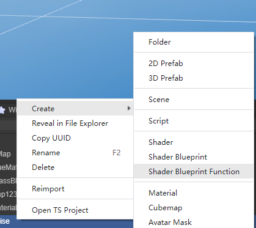

Figure 7-1

#### 7.2 Adding Parameters

In the blueprint editing window, right-click on the blank space, select the ShaderFunction option, and select the Input In tab

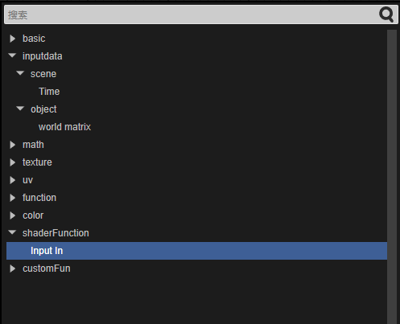

Figure 7-2

#### 7.3 Automatic Return Value

In the final Default Output Result node, the data type entered determines the output type of the Shader function. The function blueprint will automatically determine the output type, as shown in the following figure

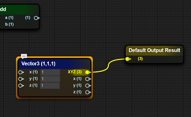

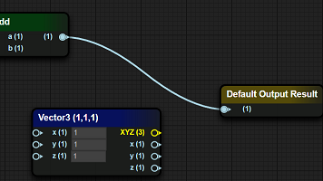

Figure 7-3

#### 7.4 Calling Functions in Functions

In the blueprint function interface, right-click at the position where the blueprint function node needs to be placed, and in the CustomFun-BlueMap item, select the function defined when creating the blueprint function (the file name of the blueprint function)

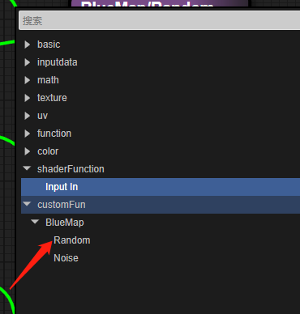

Figure 7-4

## 8. Advanced Examples

> Simple Grass

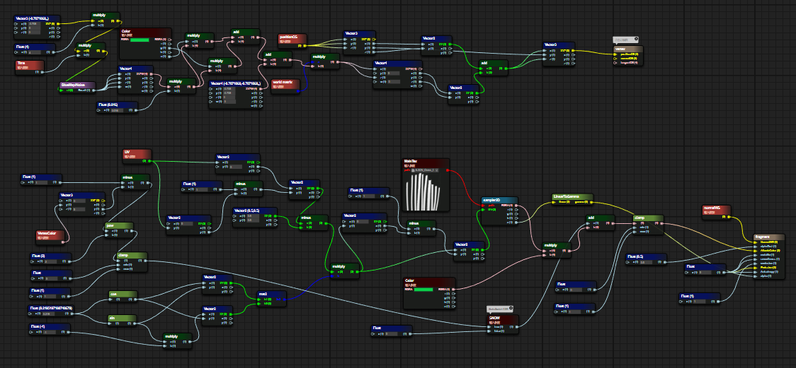

Figure 8-1

### **8.1 Vertex Shader Fragment**

1. Use Perlin noise to simulate a Vec4 vector

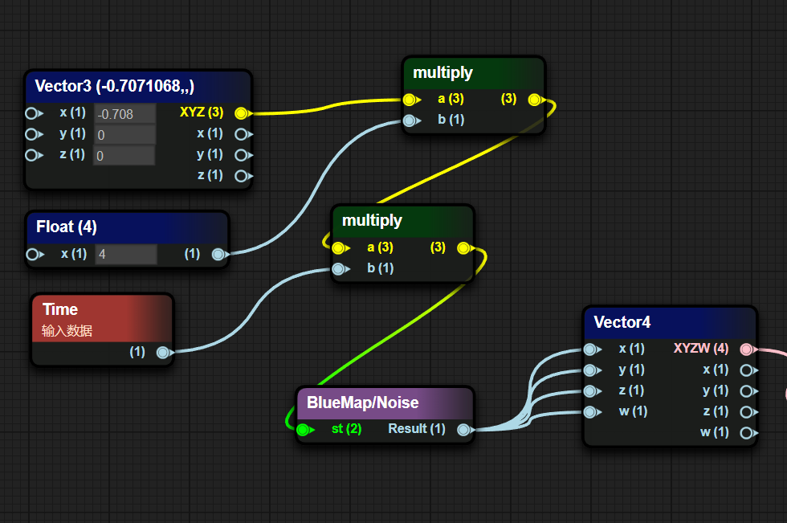

Figure 8-2

2. Perform some special transformations on the noise value

Reduce the generated noise value by 0.016, multiply it by the g channel and a channel of the externally passed Color respectively, sum the results of the multiplications respectively, add the obtained sum to a disturbance value, and finally multiply by the world matrix

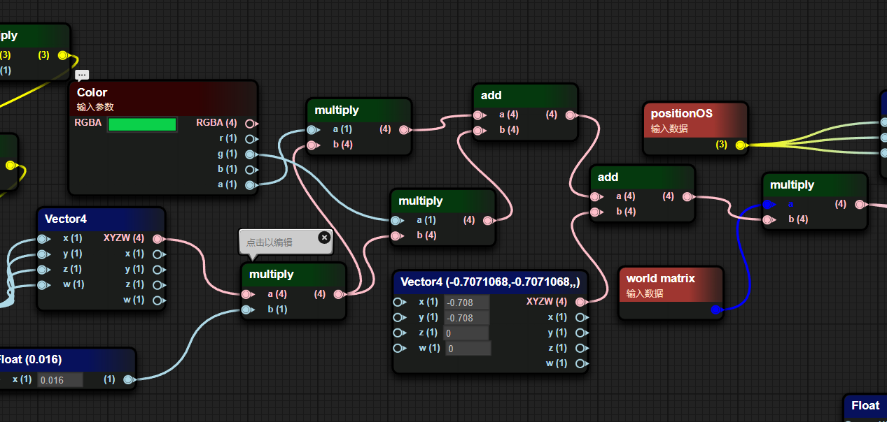

Figure 8-3

3. Take the xz component of the result multiplied by the world matrix and add it to the xz component of positionOS as the new xz component of positionOS

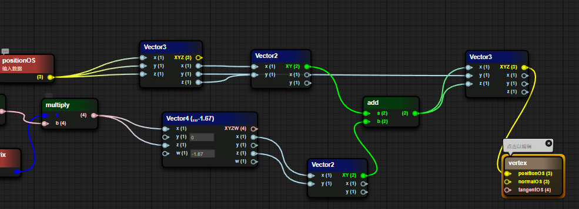

Figure 8-4

### 8.2 Fragment Shader Fragment

1. Determine whether the SNOW macro is enabled. When the macro is enabled, calculate the result of 1 - the square of the g value of the vertex color in the (0, 1) range. When the macro is disabled, the value is 0

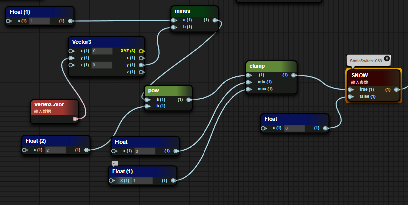

Figure 8-5

2. Multiply the offset UV coordinates by a 2x2 matrix composed of a trigonometric function and then offset back to the original position

Figure 8-6

3. Sample the grass texture map, extract the A channel and convert it to the gamma value as the Alpha value of the grass and pass it to the PBR function. The Albedo value is the product of the passed color value and the texture sampling value plus the value determined by the macro

Figure 8-7

The result of the blueprint is shown as follows

Figure 8-7

## Expansion: Shortcut Operations

| Node Type | Generation Method |
| ---- | ---- |
| Quickly generate a float node | Long - press the number key 1, and left - click at the position where you want to place it |
| Quickly generate a Vector2 node | Long - press the number key 2, and left - click at the position where you want to place it |
| Quickly generate a Vector3 node | Long - press the number key 3, and left - click at the position where you want to place it |
| Quickly generate a Vector4 node | Long - press the number key 4, and left - click at the position where you want to place it |
| Quickly generate an If node | Long - press the letter key i, and left - click at the position where you want to place it |
| Quickly generate a bool node | Long - press the letter key b, and left - click at the position where you want to place it |
| Quickly generate a sampler2D node | Long - press the letter key t, and left - click at the position where you want to place it |