# Program Blueprint

> Version >= 3.2 beta3

Before using the blueprint, you first need to check the blueprint module in the project settings panel of LayaAir-IDE.

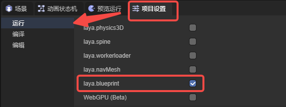

## 1. Creating a Blueprint

Under the project resource directory, create a blueprint by clicking the "+" or right-clicking,

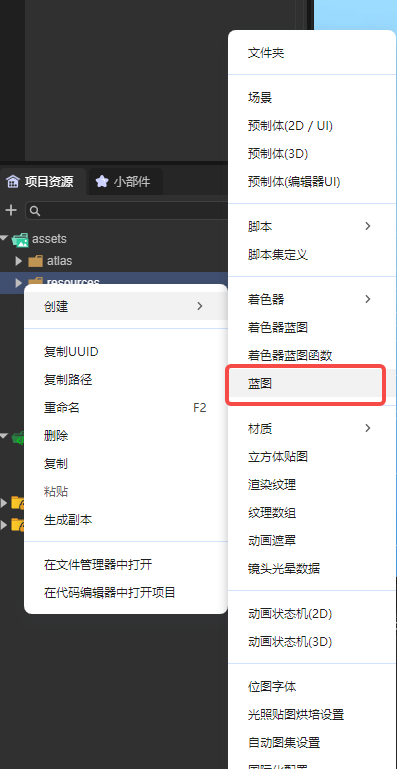

(Figure 1-1)

Then double-click the class that the blueprint is to inherit, and the blueprint file will be created.

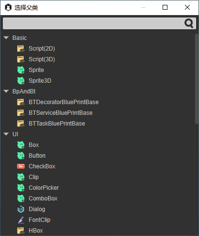

(Figure 1-2)

Double-click the created blueprint file to open the blueprint editor.

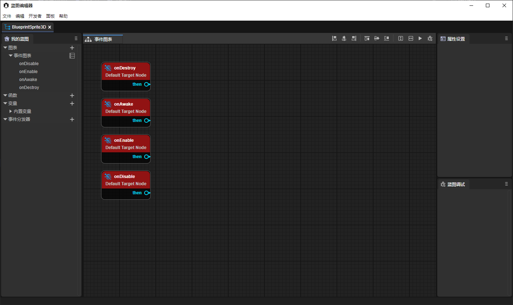

(Figure 1-3)

Different blueprint files have different usage methods:

- Blueprints that inherit Sprite3D can be directly dragged into the 3D scene for use (can also be dragged into the hierarchy directory of the 3D scene).

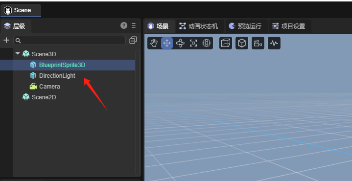

(Figure 1-4)

- Blueprints that inherit UI-derived classes can be directly dragged into the 2D scene for use (can also be dragged into the hierarchy directory of the 2D scene).

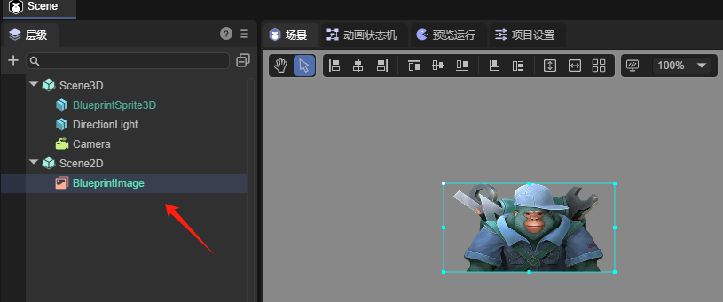

(Figure 1-5)

- Blueprints that inherit components will be automatically filled in the component list of the IDE and can also be directly dragged to the property panel for direct addition (the same usage method as script components in the IDE).

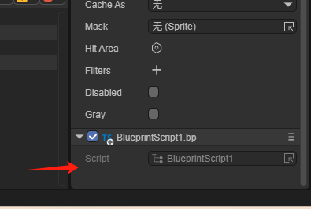

(Figure 1-6)

## 2. The Use of the Blueprint Editor

### 2.1 Node Types

- Event nodes, including some lifecycle methods (the entry point of blueprint operation), have only output pins.

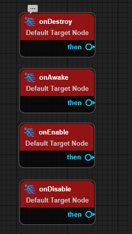

(Figure 2-1)

- Function nodes have an execution type input pin (excute), a target type pin (target), and an execution type output pin (then).

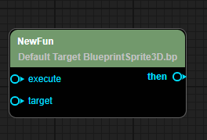

(Figure 2-2)

- Branch nodes, including Sequence, Branch, forLoop, forEach.

Sequence is used for sequential execution without waiting for asynchronous operations.

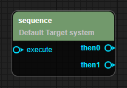

(Figure 2-3)

Branch is used for judgment.

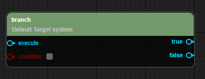

(Figure 2-4)

forLoop(withBreak) is used to create a loop structure.

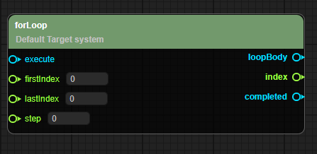

(Figure 2-5)

forEach(withBreak) is used to traverse all elements.

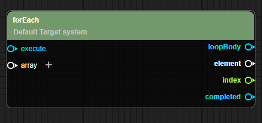

(Figure 2-6)

- Parameter nodes, including some mathematical formulas, get of variables, etc.

Parameter nodes are only triggered by the input parameters of the function node being referenced. The output execution type pin can only be connected to one execution type pin (for example, one then can only be connected to one execute. If a second execute is forcibly connected, the previous connection will be broken). The input parameter type pin can also only be connected to one parameter type output pin.

As shown in the example in Figure 2-7, when the blueprint node triggers the onEnable lifecycle, it starts to print "game start", then waits for 2 seconds (here, add is the parameter node, and the result of 1 + 1 is input to waitTime), and then sequentially executes and prints "3", and prints "4" after 2 seconds.

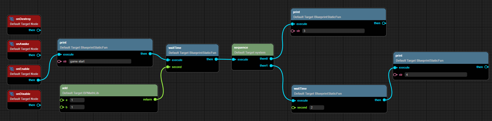

(Figure 2-7)

### 2.2 Blueprint Editing

#### 2.2.1 Creating a New Blueprint Event Graph

As shown in Figure 3-1, click the plus sign on the right side of the graph to add a new event graph and rename the event graph.

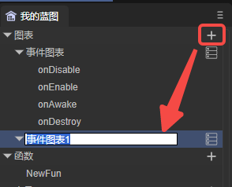

(Figure 3-1)

After creation, double-click to open the newly created event graph,

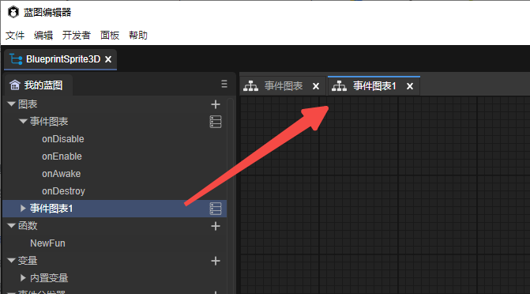

(Figure 3-2)

#### 2.2.2 Adding Blueprint Nodes

As shown in the animated GIF 4-1, you can add blueprint nodes by right-clicking and support searching for nodes.

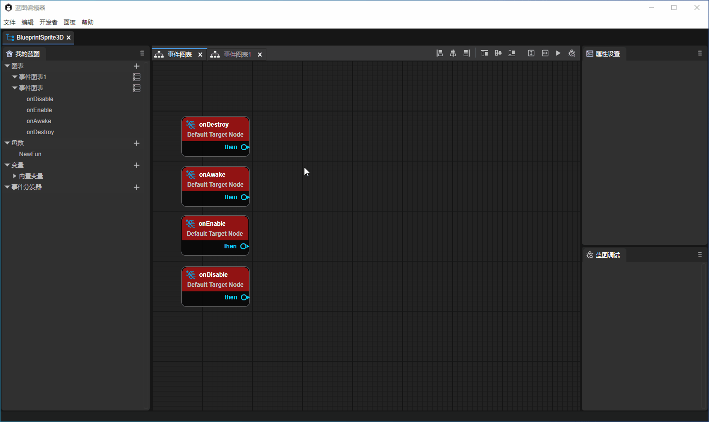

(Animated GIF 4-1)

The blueprint editor also supports aligning nodes after multi-selecting nodes. You can use the function shown in Figure 4-2,

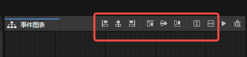

(Figure 4-2)

> This operation is the same as the basic interaction of the UI editor. You can refer to [ "UI Editor Basic Interaction" ](../../uiEditor/basic/readme.md).

#### 2.2.3 Creating Functions

As shown in Figure 5-1, the blueprint supports creating static functions and ordinary functions.

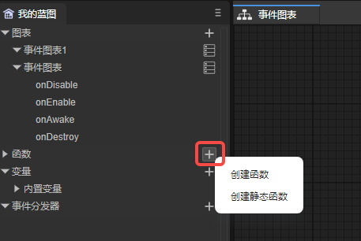

(Figure 5-1)

After creating the function, you can rename the function. Double-click to enter the function editing. As shown in the animated GIF 5-2. After entering the function editing, there will be a default entry execution node of the function.

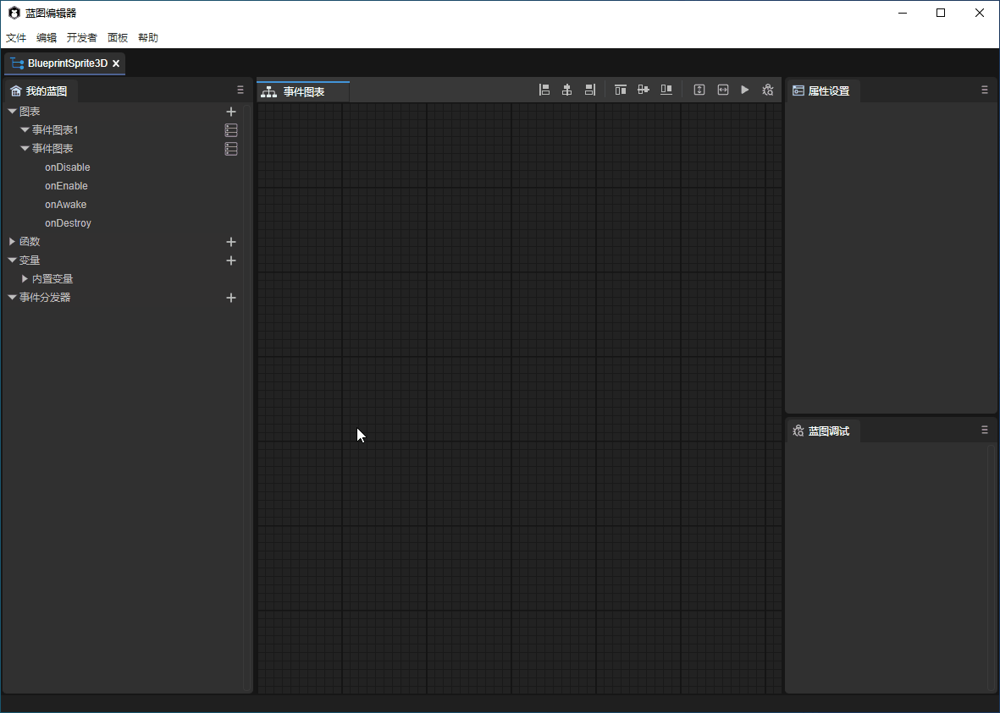

(Animated GIF 5-2)

You can also add function parameters and return nodes in the left attribute panel,

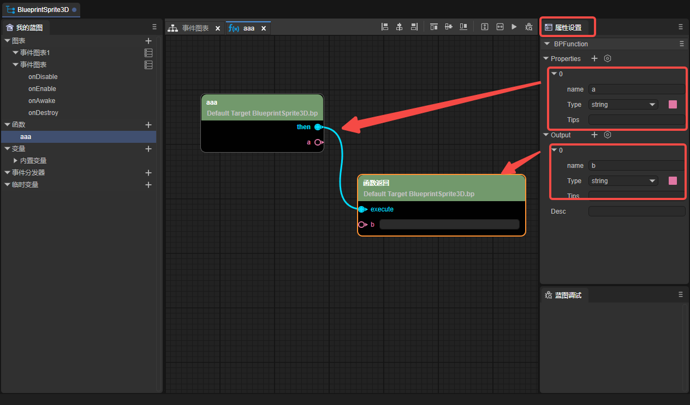

(Figure 5-3)

#### 2.2.4 Creating Variables

Support creating variables and static variables,

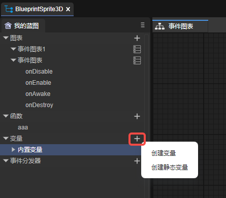

(Figure 6-1)

After creating the variable, you can rename the variable. The eye icon on the right (as shown in Figure 6-2) can control whether the variable is externally visible,

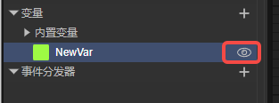

(Figure 6-2)

Drag the variable into the panel, and you can choose whether to set or get the variable.

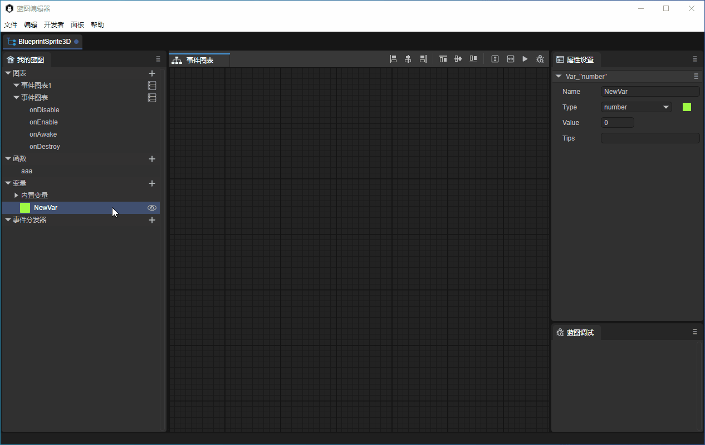

(Animated GIF 6-3)

If it is to get the variable, then this variable entry has only one target, and the exit is the value of this variable.

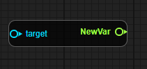

(Figure 6-4)

If it is to set the variable, then the variable entry will have (execute, target, set) and the exit will have (then and return),

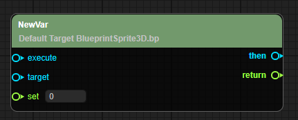

(Figure 6-5)

If it is a static variable, the target cannot be set.

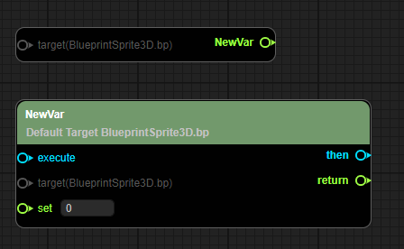

(Figure 6-6)

#### 2.2.5 Creating Event Dispatchers

Click the "+" icon in Figure 7-1 to create an event dispatcher,

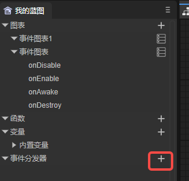

(Figure 7-1)

After the event dispatcher is created and dragged into the panel, it will be divided into (call, bind, unbind, unbind all, event).

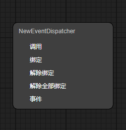

(Figure 7-2)

#### 2.2.6 Quick Positioning

As shown in the animated GIF 8-1, on the "My Blueprint" panel on the left, double-click the event graph, variable, and event dispatcher to quickly position to the corresponding node.

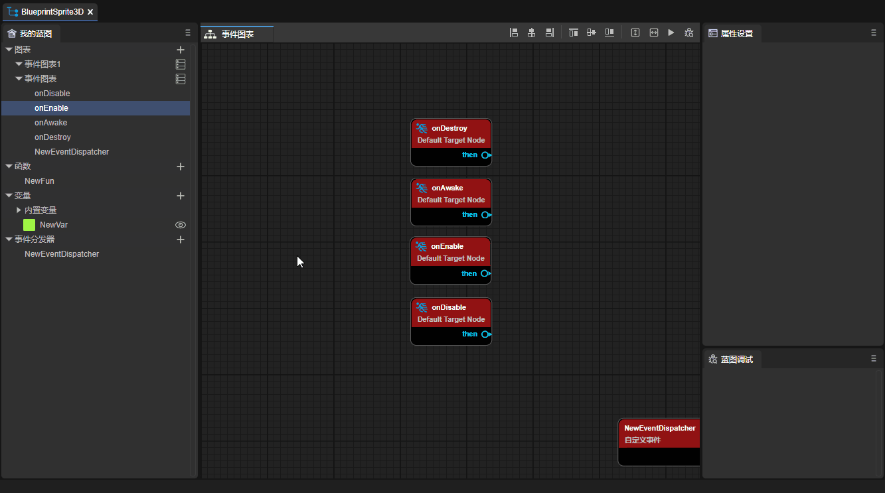

(Animated GIF 8-1)

#### 2.2.7 Comments

Comments are divided into node comments and range comments.

- Node comments

Move the mouse to the node, and then click the bubble in the upper left corner of the node to enter the comment, as shown in Figure 9-1.

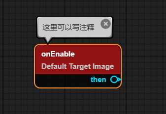

(Figure 9-1)

- Range comments

Select multiple nodes and then right-click to select range comments.

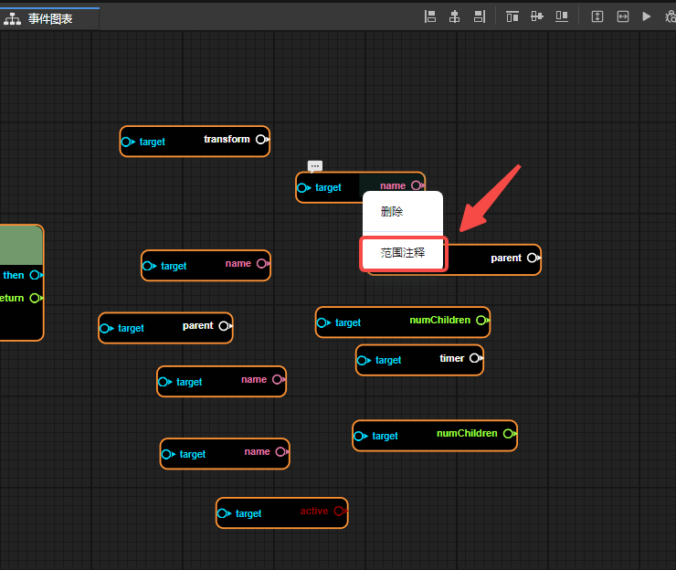

(Figure 10-1)

After clicking the range comment, you can modify the color of the comment in the property panel. Drag the range comment, and all nodes within the range comment will move along.

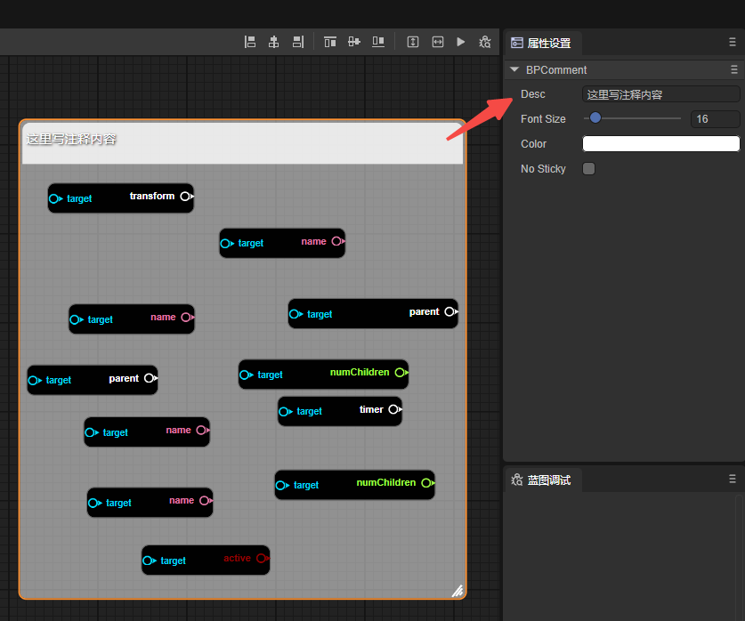

(Figure 10-2)

### 2.3 Blueprint Debugging

Right-click on the node to be debugged, and then select Add Breakpoint to add a breakpoint to the node. After the breakpoint is successfully added, a red dot will appear in the upper right corner of the node.

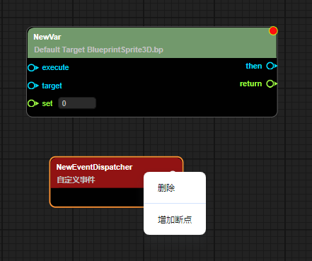

(Figure 11-1)

Then click Debug,

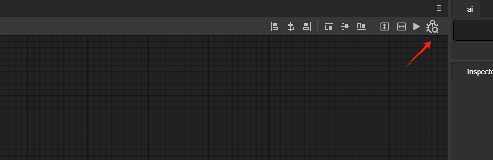

(Figure 11-2)

As shown in the animated GIF 11-3, when the program runs to this node, it will stop.

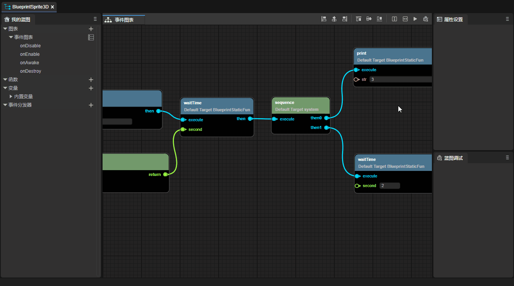

(Animated GIF 11-3)

## 3. Blueprint Decorators

> For the use of custom component scripts and basic decorators, please refer to [ "Entity Component System"  ](../../../basics/common/Component/readme.md).

In custom component scripts, using blueprint decorators can expose classes, functions, variables, etc. to the blueprint editor.

### 3.1 Class

The decorator identifier `@bpClass` needs to be used before the class definition. The sample code is as follows:

```typescript
const { bpClass } = BP;

@bpClass({
    name:"TestBluePrint",
    canInherited: true,
    extends:"Script"
})

export class TestBluePrint extends Laya.Script {
}
```

It should be noted that only when the constructor is registered can an instance of this class be created in createNew in the blueprint editor, as shown in Figure 12-1.

```typescript
const { bpClass } = BP;

@bpClass({
    name: "TestBluePrint",
    canInherited: true,
    extends: "Script",
    construct: {
        params: [
            {
                "name": "testParams",
                "type": "string"
            }
        ]
    }
})

export class TestBluePrint extends Laya.Script {

    constructor(testParams: string) {
        super();
    }

}
```

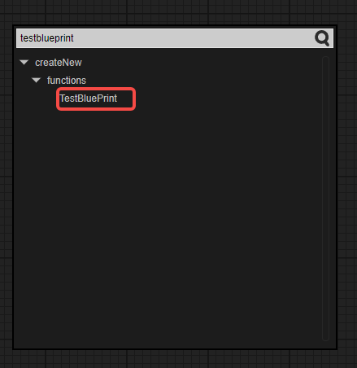

(Figure 12-1)

### 3.2 Properties

Use the decorator identifier `@bpProperty` before the variable and the decorator identifier `@bpAccessor` before get and set. The sample code is as follows:

```typescript
const { bpClass, bpAccessor, bpProperty } = BP;

@bpClass({
    name: "TestBluePrint",
    extends: "Script",
    construct: {
        params: [
            {
                "name": "testParams",
                "type": "string"
            }
        ]
    }
})

export class TestBluePrint extends Laya.Script {

    constructor(testParams: string) {
        super();
    }
    
    // Properties
    @bpProperty({
        "type": "boolean"
    })
    aaa: boolean = true;
    
    // Static properties
    @bpProperty({
        "type": "boolean",
        "modifiers": {
            "isStatic": true
        }
    })
    static bbb: boolean = true;
    
    // get & set
    @bpAccessor({
        "type":"string"
    })
    get testParams():string{
        return "test";
    }
    
    set testParams(value:string){
        console.log(value);
    }
    
    // Static get & set
    @bpAccessor({
        "type":"string",
        "modifiers": {
            "isStatic": true
        }
    })
    static get testStaParams():string{
        return "test";
    }
    
    static set testStaParams(value:string){
        console.log(value);
    }

}
```

After creating an instance of the TestBluePrint class through createNew, as shown in the animated GIF 12-2, these properties can be used.

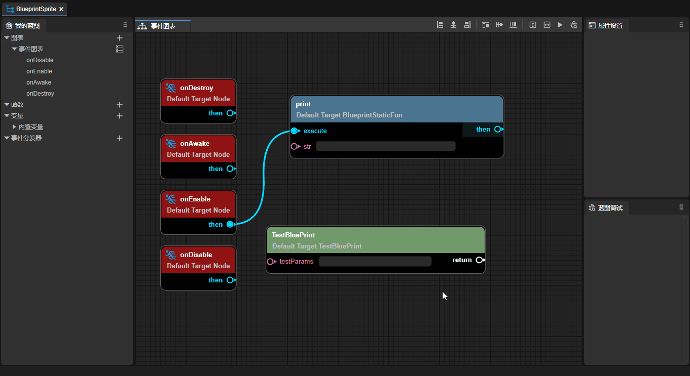

(Animated GIF 12-2)

### 3.3 Functions

Use the decorator identifier `@bpFunction` before the function. The sample code is as follows:

```typescript
const { bpClass, bpFunction } = BP;

@bpClass({
    name:"TestBluePrint",
    extends:"Script",
    construct: {
        params: [
            {
                "name": "testParams",
                "type": "string"
            }
        ]
    }
})

export class TestBluePrint extends Laya.Script {

    constructor(testParams: string) {
        super();
    }
    
    // Function
    @bpFunction({
        params: [
            {
                name: "PrimaryAssetId",
                type: "string"
            }
        ],
        returnType: "string"
    })
    testFunction(PrimaryAssetId: string): string {
        return "";
    }
    
    // Static function
    @bpFunction({
        params: [
            {
                name: "PrimaryAssetId",
                type: "string"
            }
        ],
        modifiers: {
            isStatic: true
        },
        returnType: "void"
    })
    static testStaFunction(PrimaryAssetId: string) {
    }

}
```

After creating an instance of the TestBluePrint class through createNew, these methods can be used, as shown in Figure 12-3.

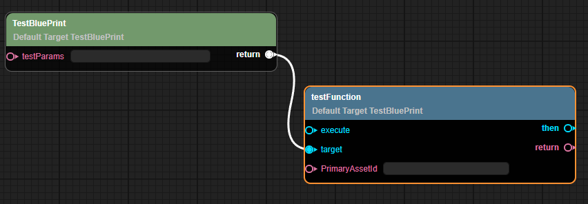

(Figure 12-3)

### 3.4 Events

You need to add events in the `@bpClass` tag. The sample code is as follows:

```typescript
const { bpClass, bpFunction } = BP;

@bpClass({
    name: "TestEvents",
    extends: "Sprite",
    construct: {
        params: [
            {
                "name": "eee",
                "type": "string"
            }
        ]
    },
    events: [{
        name: "onTest",
        params: [{ name: "name", type: "string" }]
    },
    {
        name: "onEventTest",
        params: [{ name: "name", type: "string" }]
    }]
})

export class Main extends Laya.Sprite {

    constructor(eee: string) {
        super();
    }
    
    onTest(name: string, type: string) {
        this.event('onTest', 'test');
    }
    
    @bpFunction({
        params: [{ name: "name", type: "string" }],
        type: "event",
        returnType: "void"
    })
    onEventTest(name: string) {
    }

}
```

After creating an instance of the TestBluePrint class through createNew, you can see these events, as shown in Figure 12-4.

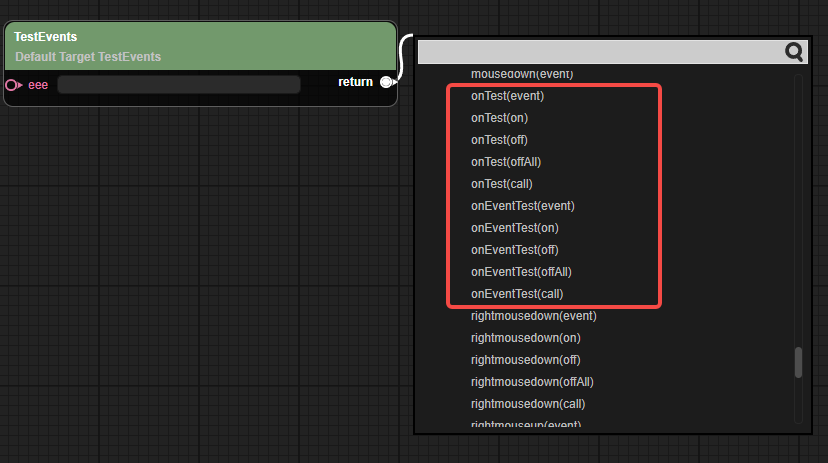

(Figure 12-4)