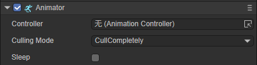
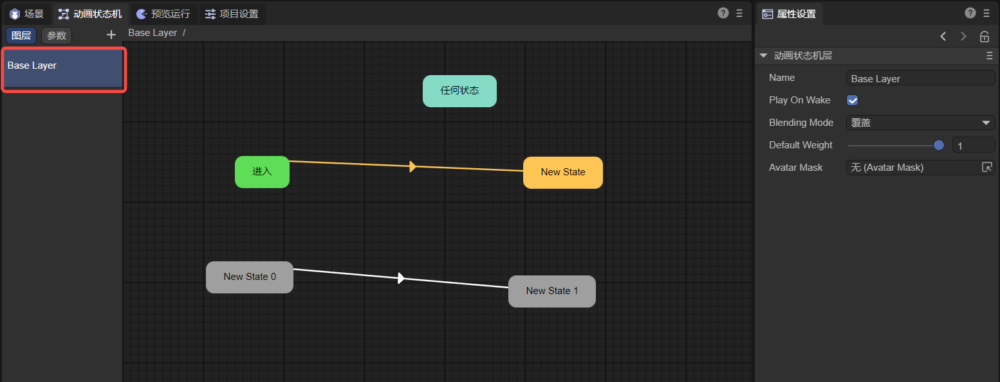
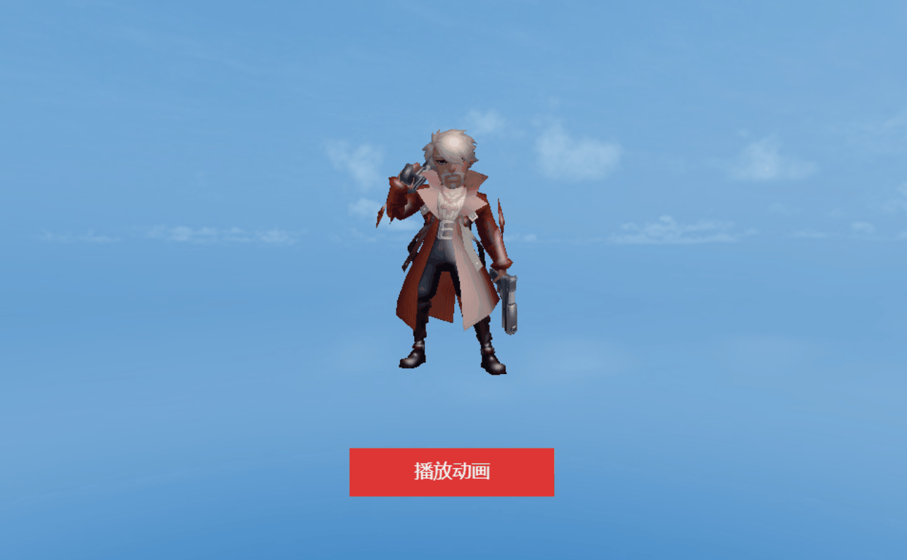

# Detailed explanation of animation state machine

LayaAir IDE's animation state machine, suitable for 2D and 3D.

For the function introduction in this article, if it is a common operation between 2D and 3D, 3D will be used as an example by default. If there are differences between 2D and 3D, additional explanations will be given for the differences.

> As the version is upgraded, some details of the screenshots in the document may be slightly different. The actual version of the IDE shall prevail. If the changes are major, we will make adjustments in time. If the changes are not made in time, please contact the official customer service for feedback.


## 1. Overview

Let’s first understand what an animation state machine is and its components, and then we’ll learn more about each part later.

First of all, the animation state machine `Animator` allows us to define animation states and switching conditions between animation states to drive 3D objects to play different animations and show different behaviors. Then the animation state machine consists of the following parts:

- Animation state machine component `Animator Component`: It is a component on Sprite3D, used to control the interface of the animation state machine.
- Animation state machine file `Animator Controller`: It is a file used to execute the entire state machine logic, drive the animation state to run, and perform state switching. At the same time, the driving parameters are defined. These parameters can be driven by code logic, and then the animation can be driven by these parameters.
- Animation state `Animator State`: It is an animation state of the state machine. It is used to execute the logic of animation, define the properties of animation playback, and can change the playback position, time, level, etc. of a single animation.
- Animator Transition `Animator Transition`: consists of parameters and comparison conditions. When the conditions are met, it will switch to the corresponding animation state. For each state, multiple transitions to other states can be created.

Through the following figure, you can clearly understand the relationship between these four parts, as shown in Figure 1-1:


(Picture 1-1)


## 2. Animation state machine component

Objects that we need to play animations and use animation state machines need to add the `Animator` component. This component is an interface for controlling the animation state machine. Let's take a look at the `Animator` component.


#### 2.1 Node addition in the scene

Any node added in the scene can add animation state machine components. The following introduction takes cube as an example. First create a cube node in the scene. After **selecting the cube node**, you can add the `Animator` component in the `Add Component` panel of the editor. As shown in animation 2-1:


(Animation 2-1)


#### 2.2 Added to prefab

We can not only add animation state machine components to nodes in the scene, but also create them in prefabs.

> If you don’t understand prefabs, please check the prefab documentation first [<<Prefab Module>>](../../prefab/readme.md).

From an operational point of view, there is no essential difference between creating on the scene and creating in a prefab.

The main differences are:

- Node creation in the scene is suitable for animations only used once.
- Created in prefabs, suitable for situations where animations need to be reused multiple times.


#### 2.3 Added by default

In some cases, the `Animator` component will be automatically added to the node, as shown in Figure 2-2. When we import an FBX model file into the scene, the `Animator` component has been added by default.


(Figure 2-2)


#### 2.4 Component properties

The properties of the `Animator` component are shown in Figure 2-3:



(Figure 2-3)

`Controller`: The `Animator Controller` file used. When there is an `Animator` component, the animation state machine still cannot be opened. We need to create an animation state machine file, which will be introduced in detail in the next chapter.

`Culling Mode`: Culling mode, `Always Animate` means that animation playback updates will be performed even if the camera is invisible, `Cull Completely` means that all updates of the animation will be stopped when the camera is invisible.

`Sleep`: Whether to stop updating when the animation is completed. Because in LayaAir, the last frame will still be looped after the animation is completed, so check Sleep to stop the update. For example, add a translation animation to a cube in the scene, as shown in animation 2-4. Finally, you will see that the cube is no longer moving.


(Animation 2-4)

At this time, uncheck the Sleep option and add an animation script to the CubeAnimation animation node. The added code is as follows:

```typescript
...
import Vector3 = Laya.Vector3;
...

export class AnimationScript extends Laya.AnimatorStateScript {
	...
	private model: Laya.Sprite3D;
    
	/**@internal */
	setPlayScriptInfo(animator: Laya.Animator | Laya.Animator2D, layerindex: number, playstate: Laya.AnimatorState | Laya.AnimatorState2D) {
    	...
    	this.model = animator.owner as Laya.Sprite3D;//Get the Cube node
	}

	...
    
    /**
	* Executed when the animation state exits.
	*/
	onStateExit(): void {
    	console.log("Animation exited");
    	//Translation operation
    	let position = new Vector3(1, 1, 1);
    	this.model.transform.translate(position);
	}
}
```

In the script, when the animation ends, the model is translated. However, since the Sleep option is not checked, the last frame will still be looped continuously after the animation is played, which is the final still state of animation 2-4. Therefore, it is impossible to control the position of the Cube to achieve the translation effect. When Sleep is checked, after the animation is completed, the panning effect can be displayed.


## 3. Animation state machine file

`Animator Controller` is a file used to execute the entire state machine logic, drive the animation state to run, and perform state switching.


#### 3.1 Create animation state machine file

In the Project panel, an animation state machine file can be created in any directory. As shown in animation 3-1:


(Animation 3-1)


#### 3.2 Automatically create animation state machine files

For an Fbx model file with mesh and animation information, as shown in Figure 3-2, during the import process of the Fbx file, the LayaAir 3.0 editor has recognized that the Fbx file has the `Animator` attribute, and can set whether it can be Turn on compression.


 (Figure 3-2)

When we drag the Fbx model into the scene, the animation state machine component is automatically added. Open the `Timeline Animation` panel and the animation state machine file will be automatically created, as shown in Figure 3-3:


(Figure 3-3)

In this case, LayaAir 3.0 has automatically created the `Animator Controller` file for us, and the next step is to edit the animation state machine.


#### 3.3 Open animation state machine

When we click on the animation state machine file, we can click on the `Animation State Machine` panel to open the animation state machine, as shown in Figure 3-4.


(Figure 3-4)

The Sprite3D class of the LayaAir 3D engine provides the `getComponent()` method to obtain components on the model. When an animated model is loaded and created, the engine assigns the `Animator (animation state machine)` animation component by default, so we can get it like this:

```typescript
//Get state machine
this.animator = this.target.getComponent<Laya.Animator>(Laya.Animator);
```

> Note: This code comes from the "Animator" scene of "3D Getting Started Example".


#### 3.4 Edit animation state machine

 In the `Animation State Machine` panel, you can perform some regular operations, as shown in the animation 3-5. In the next chapter, we will introduce the introduction and operation of the animation state.


(Animation 3-5)


#### 3.5 Animation state machine layering

By default, an animation state machine file has only one default layer `BaseLayer`, as shown in Figure 3-6. For example, for the regular actions of a character model (standby, running, attacking), we only need one default layer. .



(Figure 3-6)

But we can also create more layers. What kind of problems can multiple layers be used to solve? Just imagine if you want to develop a third-person shooting game, then you definitely want the animation of the body to be divided into upper and lower parts. The upper part will animate based on the aiming position and whether to shoot, and the lower part will animate based on movement. Therefore, more complex requirements can be solved by layering. As shown in Figure 3-7, we added another layer and named it Layer1.


(Figure 3-7)

##### 3.5.1 Layer properties

Each layer has some parameter attributes, as shown in Figure 3-8:


(Figure 3-8)

**1.**`Name`: The name of the layer.

**2.**`Play On Wake`: Whether to play the animation of this layer by default.

**3.**`Blending Mode`: Animation blending method:

- `Override`: Override, which means that the animation of the current layer will overwrite the animation of other layers. For example, when shooting and playing, the right hand cannot play other animations;
- `Additive`: Add, indicating that the amount of the animation of the current layer is added to the animation of other layers. For example, when shooting is played, the shaking of the hand running or standing will also be retained.

**4.**`Default Weight`: The weight of the animation layer, the default Base Layer must be 1. If it is set to 0, the animation of the current layer will not play, and if it is 1, it will play. Between 0 and 1, a similar fusion situation will be used to play the animation, such as the situation of shooting while moving as mentioned before. If it is set to 0.5, it will shoot. When the animation is playing, the hand will only be raised to near the neck.

Through code, we can get the desired layer by using Animator's `animator.getControllerLayer(layerIndex)` method, which is defined as follows:

```typescript
	/**
 	* Get the controller layer.
 	*/
	getControllerLayer(layerInex: number = 0): AnimatorControllerLayer {
    	return this._controllerLayers[layerInex];
	}    
```

To give an example of using this method:

```typescript
//Get the BaseLayer layer AnimatorControllerLayer
let animatorControllerLayer : Laya.AnimatorControllerLayer = this.animator.getControllerLayer(0);
//Get the default animation state of the current BaseLayer layer
let defaultState = animatorControllerLayer.defaultState;
```

**5.**`Avatar Mask`: Action mask. After masking, the selected upper layer action will block the lower layer action. Let’s illustrate with a specific example:

Suppose there are two layers, as shown in Figure 3-9, fight and congratulate,


(Figure 3-9)

After setting the Blending Mode attribute to overwrite, the action of the congratulate layer will overwrite the action of the fight layer. The congratulate effect is shown in Figure 3-10.


(Animation 3-10)

The coverage at this time is to cover all the fight actions. If you want the upper body to be in fight action and the lower body to be in congratulate action, then action masking is needed. First, let’s take a look at the fight action in Figure 3-11 for easy comparison. .


(Animation 3-11)

In the project resource panel, after adding `AvatarMask`, as shown in Figure 3-12, you can add prefab or model resources. Here, select the prefab and click the `Import Skeleton` button.


(Figure 3-12)

After importing the skeleton, the selected part is the place to be masked. As shown in Figure 3-13, the skeleton of the lower body is checked here, so the movement of the lower body needs to be blocked.


(Figure 3-13)

Originally, the action of the congratulate layer would block the action of the fight layer, and all would be blocked. Now, add AvatarMask to the congratulate layer. According to the settings just made, the congratulate layer only blocks the lower body movements of the fight layer. That is, the upper body is still the movements of the fight layer and is not covered, and the movements of the lower body are blocked and become the movements of the congratulate layer. The effect is shown in the animation 3-14.


(Animation 3-14)

As you can see, the upper body is in fight action and the lower body is in congratulate action. This is how action masking is used.

> This is just the most basic usage. If there is only one animation layer, such as adding an animation mask to the lower body of the fight animation layer, then only the lower body animation will be displayed at this time.


##### 3.5.2 Layer parameters

Each layer can add some parameters, as shown in Figure 3-15. These parameters are specifically used in animation switching. We will introduce them in Chapter 5 Animation Switching.


(Animation 3-15)

Currently in LayaAir, we can add these three parameters:

- `Float`: floating point number
- `Bool`: Boolean
- `Trigger`: Trigger


## 4. Animation status

Animation state `Animator State` is an animation state in the animation state machine. Each state corresponds to an animation, so it is called animation state. It is used to execute the logic of animation, define the properties of animation playback, and can change the playback position, time, etc. of a single animation. Our game logic state may consist of a series of animation states.


#### 4.1 System status

When the animation state machine is created, 2 system states will be created by default, as shown in Figure 4-1:


(Pic 4-1)

Any state `AnyState`: When we need to perform a switch when the condition is met, no matter which state it is, we can define the switch to start from this state.

Enter `Entry`: Enter the state. When entering an animation state machine, the switch from this state to the default state will be performed first.

When creating a **sub-state machine**, one more exit state will be created by default, as shown in Figure 4-2:


(Figure 4-2)

> Please refer to Chapter 7 for the content of sub-state machines.

Exit `Exit`: When you need to exit the sub-state machine, you can perform a switch to this state.


#### 4.2 Create animation state

##### 4.2.1 Create new animation state

In the animation state machine panel, right-click on a blank space and click Create Empty Node. As shown in animation 4-3:


(Animation 4-3)

##### 4.2.2 Drag into an animation state

In the Project panel, you can drag an action file under Fbx to the Animator panel, as shown in animation 4-4:


(Animation 4-4)

At this point, we can already play an animation automatically. This is the most basic and simple usage. No additional work is required to make LayaMonkey move!


(Animation 4-5)


#### 4.3 Animation state attributes

As each animation state in the animation state machine, we can make separate settings for this state, as shown in Figure 4-6:


(Figure 4-6)

##### 4.3.1 Basic attributes

`Name`: The name of the animation state, which can be used to play animations in code.

`Is Looping`: Whether to loop.

`Speed`: animation playback speed.

`Cycle Offset`: Cycle offset, an offset value based on the start time of playback, only applies to the first playback of the animation (between 0-1).

`Clip Start`: The starting playback position of the animation file (between 0-1).

`Clip End`: The stop position of the animation file (between 0-1).

`Clip`: animation file (.lani).

> Note: The parameter "Cycle Offset" does not affect the integrity of animation playback. For example, if "Clip Start" is set to 0, "Clip End" is set to 1, and "Cycle Offset" is set to 0.8, then the animation will start playing from the position 0.8. Playing to the 0.8 position counts as a loop.

Usually the animation files contained in the Fbx file will be automatically associated by dragging them into Animator, as shown in Figure 4-7:


(Figure 4-7)

##### 4.3.2 Switch list

`AnimatorTransition`: Lists all animation switches that connect this animation state to other animation states, as shown in Figure 4-8:


(Figure 4-8)

Standalone `New State -> New State 0` can open the AnimatorTransition detailed panel. Double-click `New State -> New State 0` to rename it, as shown in animation 4-9:


(Animation 4-9)

##### 4.3.3 solo and mute

Solo and mute: Two check boxes. Solo means that only this switch is effective. Mute is equivalent to disabling this animation switch, as shown in Figure 4-10:


(Figure 4-10)

**Notice:**

> Both solo and mute can be multi-selected, but the priority is in the order of addition, which will be explained in 5.5 Switching Priority.

> If the condition is met, it takes precedence over Solo/Mute. When the condition is not met, there will still be no transition. This will be explained in 5.5 Switching Priority.


## 5. Animation switching

The process of transitioning from one state to another is animation switching, which consists of parameters and comparison conditions. When the conditions are met, it will switch to the corresponding animation state. For each state, multiple transitions to other states can be created.


#### 5.1 Create animated transitions

After we create the animation state, by right-clicking the mouse on the previous state and selecting Connection, a point of connection will be created. Drag the mouse to the subsequent animation state and lift the mouse to create an animation switch. Click When this connection is established, click the delete key on the keyboard to delete the connection. As shown in animation 5-1:


(Animation 5-1)

When we connect New State 0, New State 1, and New State 2 from New State, New State will continue to switch to New State 0 without adding any conditions, because New State 0 is the first to connect.


#### 5.2 Set as default

When we create multiple animation states, if we want to set a certain animation state as the entry state, we can right-click the animation state and select Set as Default, as shown in Figure 5-2:


(Animation 5-2)

> Note: When we create the first animation state, this state will be set as the default state by default. Of course, we can change other animation states to the default state at any time.


#### 5.3 Animation switching properties

When you click on a connection, you can see the properties of animation switching, as shown in Figure 5-3, which are used to handle the animation adjustment effect of animation switching.


(Figure 5-3)

`Exit Time`: This time is a normalized time of 0-1, used to define the percentage of time during animation playback. For example, 0.85 means that when the animation reaches 85%, the animation will start switching. The logical function of Exit Time is similar to the float parameter, but it cannot be set.

`Transstartoffset`: This time is a normalized time of 0-1, the time offset of the target state, that is, the time point from which the target state animation starts to be played. For example, 0.5 means that the target state starts playing animation from 50%.

`Transduration`: This time is a normalized time of 0-1, used to define the percentage of time that the next animation state will continue to play when the state switches to the target state. For example, 0.15 means that when the animation reaches 15% of the target animation, the switching animation will stop.

**Notice:**

> - During the transition time, animation 1 and animation 2 play at the same time. When the transition time ends, animation 1 stops playing completely, and animation 2 enters the next switching period.
>
> - When the transition time is 0, animation 1 will switch directly to animation 2.
>

`Exit By Time`: Whether to enable Exit Time to take effect. If not checked, the animation will switch directly to the next animation.

Animation 5-3-1 and Animation 5-3-2 are the comparison effects of checking Exit Time and not checking it respectively. Obviously, if not checking, the animation will not be connected.

 

(Animation 5-3-1)												 (Animation 5-3-2)


#### 5.4 Animation switching conditions

State switching can have one condition, multiple conditions, or no conditions. If there is no condition for switching, the animation system will also use Exit Time as the only condition and trigger the switch when the time is reached. If there are multiple conditions, all conditions must be met before switching is triggered.

Currently in LayaAir, we can add these three parameters:

##### 5.4.1 Float: Floating point number

As shown in the animated picture 5-4, let's take a look at how to set the Float condition. First, we must define a Float parameter. Secondly, in the condition, you can select the Float parameter. Less or Greater will be selected on the right, and finally you can fill in the value. Then the meaning of animation 5-4 is that when Float is greater than 0.5, switch New State to New State0.

> Note: When defining this Float parameter, you can set a default value, such as 1. Then if the condition is that the Float parameter is Greater 0.5, the condition will be directly entered and the state will be switched directly during runtime.


 (Animation 5-4)

The conditions can be met through code, the code is as follows:

```typescript
//Set the value of the "Float" parameter to meet the conditions for switching states.
this.animator.setParamsNumber( "Float" , 2 );
```

The running effect is as shown in Figure 5-5:


(Animation 5-5)

##### 5.4.2 Bool：Boolean

As shown in the animated picture 5-6, let's take a look at how to set the Bool condition. First, we must define a Bool parameter (either true or false). Secondly, in the condition, we can select the Bool parameter, and finally we can check true or false. . Then the meaning of animation 5-6 is that when Bool is true, switch New State to New State0.

> Note: When defining this Bool parameter, you can set a default value, such as true. Then if the condition is the Bool parameter true, the condition will be directly marked, and the state will be switched directly during runtime.


(Animation 5-6)

The conditions can be met through code, as follows:

```typescript
//Set the value of the "Bool" parameter to meet the conditions for switching states.
this.animator.setParamsBool( "Bool" , true );
```

The running effect is as shown in Figure 5-7:


(Animation 5-7)

##### 5.4.3 Trigger: 

As shown in the animated picture 5-8, let's take a look at how to set the Trigger condition. First, we must define a Trigger parameter (either true or false). Secondly, in the condition, we can select the Trigger parameter. Then we can use triggers through code later to switch New State to New State0.


(Figure 5-8)

The conditions are met through code, as follows:

```typescript
//Trigger "Trigger" to meet the conditions for switching states
this.animator.setParamsTrigger( "Trigger" );
```

The running effect is as shown in Figure 5-9:


(Animation 5-9)

##### 5.4.4 Use of multiple parameters

Of course we can define multiple parameters, but in this case it is more efficient to name the parameters. Modify the name as shown in the animation 5-10:


(Animation 5-10)

After modifying the name, you can edit the switching conditions more clearly, as shown in Figure 5-11:


(Figure 5-11)

**Note: As long as one of these conditions is met, the animation switch can be triggered, not the relationship between AND**


#### 5.5 Switch priority

If there are multiple animation states in one animation state, let's take a look at the priority.

- When there are no conditions or when all conditions are met, solo and mute are not selected, as shown in Figure 5-12:


(Figure 5-12)

At this time, the Stand animation will be played after the Attack animation is played, because the Stand animation is the first one.


- When there are no conditions or when all conditions are met, if someone chooses solo, as shown in Figure 5-13:


(Figure 5-13)

At this time, the Run animation will be played after the Attack animation is played, because solo is selected for the Run animation.


- When there are no conditions or when all conditions are met, if solo is selected, as shown in Figure 5-14:


(Figure 5-14)

At this time, the Stand animation will be played after the Attack animation is played, because even if solo is selected, only one animation switch can be selected, and Stand is the first one in sequence.


- If the conditions for Attack->Stand are not met, the conditions for Attack->Run are met, but solo is still selected as shown in Figure 5-14 above.

At this time, the Run animation will be played after the Attack animation is played, because the conditions of Attack->Stand are not met.


- When there are no conditions or when all conditions are met, if solo is selected and mute is selected in Attack->Stand, as shown in Figure 5-15:


(Figure 5-15)

At this time, the Run animation will be played after the Attack animation is played, because Attack->Stand selects mute.


- When there are no conditions or when all conditions are met, if solo and mute are both selected, as shown in Figure 5-16:


(Figure 5-16)

At this time, the Attack animation will not switch to any state after playing.


## 6. Animation playback and scripts

In the above chapters, we only need to use simple code to control the state machine to meet the conditions and play the specified animation state. In addition, we can also control the animation playback through code.


#### 6.1 Playback Control

After obtaining the animation state machine component and adding multiple animation states, how to play one of the animations? There are several ways to control and switch actions:

##### 6.1.1 Play()

Check out the `play()` method in the Animator animation component. The specific method parameters are as follows:

```typescript
/**
* Play animation.
* @param name If null, the default animation will be played, otherwise the animation clip will be played by name.
* @param layerIndex layer index.
* @param normalizedTime Normalized playback start time.
*/
play(name: string | null = null, layerIndex: number = 0, normalizedTime: number = Number.NEGATIVE_INFINITY)
```

This is the most basic way to play animation in the animation state machine, through the following code:

```typescript
//Animation state machine, directly play the Run animation state
this.animator.play("Run");
```

Take a look at the running effect, as shown in animation 6-1:


(Animation 6-1)

The starting position of the animation can also be specified through the parameters of Play():

```typescript
//Animation state machine, directly plays the Stand animation state, starting from the 50% position
this.animator.play("Stand", 0 , 0.5);
```

Take a look at the running effect, as shown in Figure 6-2. Every time the mouse clicks the button, the Stand animation can start playing from the 50% position.

 

(Animation 6-2)

Of course, we can also modify the properties of the animation state through code to play different effects:

```typescript
//Get the BaseLayer layer of the animation state machine, and you can also get other layers
let acl: Laya.AnimatorControllerLayer = this.animator.getControllerLayer(0);
//Get an animation state
let state = acl.getAnimatorState("Stand");
//Set the name of the action state
state.name = "Stand_new";
//Set the start time of action state playback (the start time and end time are set to a percentage value of 0-1) The time point to be intercepted / the total duration of the animation
state.clipStart = 10/40;
//Set the end time of action state playback
state.clipEnd = 20/40;
//Whether animation playback loops
state.clip.islooping = true;
//Animation state machine, directly play the Stand_new animation state
this.animator.play("Stand_new");
```

Take a look at the running effect, as shown in Figure 6-3:


(Animation 6-3)

##### 6.1.2 crossFade()

Animation over blending is used to smoothly transition from one animation state to another within a given amount of time. If one animation jumps to another completely different animation in a short amount of time, the transition usually behaves satisfactorily.

Let’s first take a look at the `crossFade()` method in the Animator animation component. The specific method parameters are as follows:

```typescript
	/**
 	* Perform fusion transition playback between the current animation state and the target animation state.
 	* @param name Target animation state.
 	* @param transitionDuration transition time, this value is the normalized time of the current animation state, the value is between 0.0~1.0.
 	* @param layerIndex layer index.
 	* @param normalizedTime Normalized playback start time.
 	*/
	crossFade(name: string, transitionDuration: number, layerIndex: number = 0, normalizedTime: number = Number.NEGATIVE_INFINITY)
```

Called through code as follows:

```typescript
//Animation state machine, transition and merge into Run animation state
this.animator.crossFade("Run", 0.3);
```

Take a look at the running effect, as shown in Figure 6-4, mixing the standby animation and running animation.


(Animation 6-4)

##### 6.1.3 Pause animation

Now that we’ve talked about playing the animation, let’s talk about the pause animation. You can directly use the playback speed of the animation to control the pause and playback of the animation. You can directly set the playback speed of the animation to be paused to 0. To continue playing, you only need to reset the speed to 1.

```typescript
//pause animation
this.animator.speed = 0.0;
//Play animation
this.animator.speed = 1.0;
//Play animation at half speed
this.animator.speed = 0.5;
```

Take a look at the running effect, as shown in the animation 6-5:

 

(Animation 6-5)


#### 6.2 Get playback status

To obtain animation playback status, you need to first use Animator's `animator.getControllerLayer(layerIndex)` method:

```typescript
	/**
 	* Get the controller layer.
 	*/
	getControllerLayer(layerInex: number = 0): AnimatorControllerLayer {
    	return this._controllerLayers[layerInex];
	}    
```

After obtaining `AnimatorControllerLayer`, use the `getCurrentPlayState()` method:

```typescript
	/**
 	* Get the current playback status.
 	* @return animation playback status.
 	*/
	getCurrentPlayState(): AnimatorPlayState {
    	return this._playStateInfo!;
	}
```

After obtaining `AnimatorPlayState`, there are three commonly used methods to obtain the playback state as follows:

```typescript
	/**
	* The normalized time of the playback state, the integer is the number of loops, and the decimal is the single playback time.
	*/
	get normalizedTime(): number {
   	 return this._normalizedTime;
	}

	/**
	* The duration of the current animation, in seconds.
	*/
	get duration(): number {
   	 return this._duration;
	}

	/**
	* Animation state machine.
	*/
	get animatorState(): AnimatorState {
   	 return this._currentState!;
	}
```

Usually we can use `normalizedTime` to determine whether an animation state has finished playing, such as the following code:

```typescript
const { regClass, property } = Laya;

@regClass()
export class Main extends Laya.Script {
	@property( { type: Laya.Label } )
	private label: Laya.Label;  
	@property( { type: Laya.Sprite3D } )
	private target: Laya.Sprite3D;

	private animator : Laya.Animator;

	onStart() {
    	this.label.on( Laya.Event.CLICK, this, this.test );
    	//Get state machine
    	this.animator = this.target.getComponent<Laya.Animator>(Laya.Animator);
	}

	//To run the running animation of the state machine, you can use the action fusion method
	test(e: Laya.Event)
	{
    	//Animation state machine, transition and merge into Run animation state
    	this.animator.crossFade("Run", 0.1);
    	//Wait for the animation to complete
    	Laya.timer.frameLoop(1,this,()=>{
        	//If the current playback state has been played once
        	if(this.animator.getControllerLayer(0).getCurrentPlayState().normalizedTime >= 1){
            	//Return to standing state
            	this.animator.crossFade("Stand", 0.1);
            	Laya.timer.clearAll(this);
        	}
    	});   	 
    }
}
```

Take a look at the running effect, as shown in the animation 6-6:

 

(Animation 6-6)


#### 6.3 Using status scripts

For our development needs, being able to play and switch animation states is not enough. We may also need to implement more requirements in each state. For example, when entering or leaving the next state, playing different sound effects, then by adding animation State scripts can be easily implemented, as shown in Figure 6-7. One or more state scripts can be added to each state.


(Figure 6-7)

##### 6.3.1 Create script

Let's look at animation 6-8 to see how to create an animation script for a standing state. First, create an animation script in the `Project Resources->src` directory, then select the Stand state, and click the `+` button under `Scripts` to hang the animation script you just created.


(Animation 6-8)

##### 6.3.2 Script usage

Let's take a look at the animation script we just created. The initial code is as follows:

```typescript
const { regClass } = Laya;
interface AnimatorPlayScriptInfo {
	animator: Laya.Animator | Laya.Animator2D;
	layerindex: number;
	playState: Laya.AnimatorState | Laya.AnimatorState2D;
}
/**
 * Inherited from AnimatorStateScript (animation state script)
 * @author ...
 */
 @regClass()
export class AnimationScript extends Laya.AnimatorStateScript {
	/**Animation status information */
	playStateInfo: AnimatorPlayScriptInfo = { animator: null, layerindex: -1, playState: null };

	/**@internal */
	setPlayScriptInfo(animator: Laya.Animator | Laya.Animator2D, layerindex: number, playstate: Laya.AnimatorState | Laya.AnimatorState2D) {
    	this.playStateInfo.animator = animator;
    	this.playStateInfo.layerindex = layerindex;
    	this.playStateInfo.playState = playstate;
	}
	constructor() {
    	super();

	}


	/**
 	* Executed when the animation state starts.
 	*/
	onStateEnter(): void {
    	console.log("Animation started playing");
	}

	/**
 	* Animation status is running
 	* @param normalizeTime 0-1 animation playback status
 	*/
	onStateUpdate(normalizeTime: number): void {
    	console.log("Animation status updated");
	}

	/**
	* Executed when the animation state exits.
	*/
	onStateExit(): void {
    	console.log("Animation exited");
	}

}
```

The AnimationScript script inherits from Laya.AnimatorStateScript. `setPlayScriptInfo` is a life cycle function through which the animation components, animation state machine hierarchy, and animation state machine of the current script can be obtained.

```typescript
 /**illustrate
 	* setPlayScriptInfo is a life cycle function. If you want to obtain animation state machine information, you must call it.
 	* @param animator animation component of the current script
 	* @param layerindex The animation state machine level where the current script is located
 	* @param playState the animation state machine of the current script
 	*/
 	setPlayScriptInfo(animator: Laya.Animator | Laya.Animator2D, layerindex: number, playstate: Laya.AnimatorState | Laya.AnimatorState2D) {
     	this.playStateInfo.animator = animator;
     	this.playStateInfo.layerindex = layerindex;
     	this.playStateInfo.playState = playstate;
 	}
```

This script also has three methods:

- onStateEnter: executed when the animation state starts;

- onStateUpdate: The animation state is running, and the length of time for the current state execution can be obtained in the method normalizeTime;

- onStateExit: Executed when the animation state exits;

We can override these methods to execute our own logic when the animation state changes. Simply add some code to see the effect:

```typescript
const { regClass } = Laya;
interface AnimatorPlayScriptInfo {
	animator: Laya.Animator | Laya.Animator2D;
	layerindex: number;
	playState: Laya.AnimatorState | Laya.AnimatorState2D;
}

/**
 * Inherited from AnimatorStateScript (animation state script)
 * @author ...
 */
@regClass()
export class AnimationScript extends Laya.AnimatorStateScript {
	/**Animation status information */
	playStateInfo: AnimatorPlayScriptInfo = { animator: null, layerindex: -1, playState: null };

	private isShow: boolean = false;
	private _label: Laya.Label;
	/**@internal */
	setPlayScriptInfo(animator: Laya.Animator | Laya.Animator2D, layerindex: number, playstate: Laya.AnimatorState | Laya.AnimatorState2D) {
    	this.playStateInfo.animator = animator;
    	this.playStateInfo.layerindex = layerindex;
    	this.playStateInfo.playState = playstate;
    	this._label = animator.owner.scene.scene2D.getChildByName("Label");
	}
	constructor() {
    	super();
	}

	/**
 	* Executed when the animation state starts.
 	*/
	onStateEnter(): void {
    	console.log("Animation started playing");
    	this._label.text = "Start animation";
	}

	/**
 	* Animation status is running
 	* @param normalizeTime 0-1 animation playback status
 	*/
	onStateUpdate(normalizeTime: number): void {
    	console.log("Animation status updated: " + normalizeTime);
    	if (normalizeTime > 0.5 && !this.isShow) {
        	this.isShow = true;
        	this._label.text = "Run the animation halfway";
    	}
	}

	/**
	* Executed when the animation state exits.
	*/
	onStateExit(): void {
    	console.log("Animation exited");
    	this._label.text = "Exit running animation";
	}

}
```

The actual operation effect is as shown in the animation 6-9.


(Animation 6-9)


## 7. Sub-state machine

A sub-state machine is to create a new state machine inside the state machine. This new state machine is called a sub-state machine.

The function of this state machine is to create another set of states to facilitate the management of complex animation states. For example, the character in the game has standby/run/attack/defense when standing, and another set of standby/run/attack/defense when crouching. Then squatting is a sub-state, because squatting, running, squatting and attacking are all based on the squatting state, so they can independently become a sub-state machine.


#### 7.1 Create sub-state machine

As shown in the animation in Figure 7-1, right-click the blank position of the state machine and select Create Node Directory. A node named "New StateMachine" will be generated, which is the sub-state machine. Double-click the sub-state machine to enter the sub-state machine panel. In this panel, you can see three states: enter, any state and exit. These three states belong to the sub-state machine, not the parent state machine. The parent state machine only has entry and any states.


(Animation 7-1)

Similarly, we can rename the sub-state machine, as shown in Figure 7-2:


(Animation 7-2)


#### 7.2 Edit sub-state machine

For example, we want to put all the character's attack and skill animations into the child state machine and classify them into one category as the character's attack state, while the parent state machine is only used to handle states such as standby, running, dizziness, death, and victory. Then we enter the child state machine, drag in animations such as attacks and skills and connect them, the same as the previous parent state machine. As shown in animation 7-3:


(Animation 7-3)


#### 7.3 Entering the sub-state machine

Drag an Attack (Take 001) animation into it. At this time, the `Enter` state will be connected to this animation, indicating that the default state of the sub-state machine is Attack. As shown in Figure 7-4:


(Figure 7-4)

Then return to the parent state machine and connect Idle to the child state machine, which is actually equivalent to connecting the `enter` state in the child state machine. Operate as shown in Figure 7-5:


(Animation 7-5)


#### 7.4 Exit sub-state machine

If we hope that after the Attack animation ends, the function of the child state machine is completed, and the child state machine exits, returns to the parent state machine, and returns to the Idle state, this process belongs to exiting the child state machine.

In the parent state machine, after returning to the state of the child state machine, you need to continue connecting to other states to make the animation continuous, as shown in animation 7-6:


(Animation 7-6)


