# Detailed explanation of timeline animation editing

>  Author：charley

The timeline animation editor of LayaAir IDE is suitable for editing 2D and 3D animations.

For the function introduction in this article, if it is a common operation between 2D and 3D, 3D will be used as an example by default. If there are differences between 2D and 3D, additional explanations will be given for the differences.

> As the version is upgraded, some details of the screenshots in the document may be slightly different. The actual version of the IDE shall prevail. If the changes are major, we will make adjustments in time. If the changes are not made in time, please contact the official customer service for feedback.

## 1. Open the timeline animation editor

### 1.1 Create animation

#### 1.1.1 Node creation animation in the scene

Any node added to the scene can create animations. The following introduction takes cube as an example. First create a cube node in the scene. After **selecting the cube node**, you can see the "`Create`" button in the `Timeline Animation Panel (Timeline)` below the editor. As shown in Figure 1-1:


(Picture 1-1)

Click the `Create` button in Figure 1-1, and the interface shown in Figure 1-2 will pop up, reminding the user to set the animation name (here renamed to "ani3d.lani").


(Figure 1-2)

> [!Tip]
>
> The suffix of 3D animation files is .lani, and the suffix of 2D animation files is .mc

After saving the name, you can see the timeline animation editing panel, animation components, state machine, and animation files, which means the animation is created successfully. As shown in Figure 1-3:


(Figure 1-3)

#### 1.1.2 Creating animations in prefabs

Not only can we create animations on nodes in the scene, we can also create animations in prefabs.

> If you don’t understand prefabs, please check the [<<Prefab module>>](../../prefab/readme.md) document first.

From an operational point of view, there is no essential difference between creating animations on the scene and creating animations in prefabs.

**The main differences are:**

- Animations created by nodes in the scene are suitable for situations where only one animation is used.

- Animations created in prefabs are suitable for situations where animations need to be reused multiple times.

#### 1.1.3 Animation file suffix

The suffix name of animation files created by 3D is `.lani`, and the file suffix of 3D animation controller (also called animation state machine) is `.controller`

The suffix of animation files created in 2D is `.mc`, and the suffix of 2D animation state machine files is `.mcc`.

> When publishing WeChat mini games and other platforms that have restrictions on suffixes, the IDE publishing function will automatically modify the suffix. Developers only need to know it and still use relative paths according to the above standards. The engine will automatically adapt the file suffix according to different platforms.

#### 1.1.4 Naming rules for animation state machine files

When creating an animation for a **node** for the first time, not only an animation file named by the developer will be created, but an animation state machine file will also be automatically created.

The state machine file naming is composed of `animation node name_animation name`. The effect is shown in Figure 1-4.


(Figure 1-4)

### 1.2 Directly start the animation panel

If the animation component has been bound to the node, there is no need to create animation, just click the **Start Animation Panel** button below. As shown in Figure 1-5:


(Figure 1-5)

### 1.3 Nodes that do not support animation components

Scene root nodes `Scene2D` and `Scene3D` do not support animation creation.

### 1.4 Add animation component

When an animation has been created and you just want to reuse the created animation on a certain node, you can directly open the existing animation by adding an animation component.

Take the Sphere node as an example for introduction.

First, select the sphere node, click Add Component in the property panel on the right, and select the Animator component. You can only see Animator in the 3D node. If it is a 2D node, you can only select Animator2D.

> [!Tip|label:Tips]
>
> Animator2D is a 2D animation component, and Animator is a 3D animation component.

The operation sequence is shown in the animation 1-6:


(Figure 1-6)

Then, the Animator component can be seen in the properties panel. Click the Controller in the Animator component and select the existing animation state machine. As shown in Figure 1-7:


(Figure 1-7)

##### 1.4.1 When there is an animation state machine and animation files:

Take the "Sphere_ani3d1" animation state machine as an example. After selection, the animation will be bound to the Sphere node. If there is an animation state machine and an animation file, click Start Animation in the animation editing panel after refreshing. As shown in Figure 1-8:


(Figure 1-8)

##### 1.4.2 When there is an animation state machine but no animation file:

If there is no animation in the animation state machine, after adding the animation component and setting up the state machine, and then click `Start`, you will be reminded that there is no animation file, and a window to create a new animation file will automatically pop up.

As shown in Figure 1-9:


(Figure 1-9)

If you want to use an existing animation, just drag the animation file from the resource window to the state machine view window. The effect is shown in Figure 1-10.


(Figure 1-10)

## 2. Basic concepts of timeline animation editor

### 2.1 Key frames and empty frames

#### 2.1.1 Key frames

The key frame refers to the frame where the key action occurs in the change of object movement, that is, the frame where the attribute values ​​are stored.


(Figure 2-1)

#### 2.1.2 Empty frame

An empty frame means that nothing is set in this frame, usually the frame between two adjacent key frames.


(Figure 2-2)

#### 2.1.3 The difference between key frames and empty frames

Keyframes: Determine the effect changes of the animation based on the attribute values ​​stored in the keyframes.

Empty frame: The engine will calculate the attribute value during playback based on the interpolation algorithm, which is used for the transition between two key frames of the animation.

### 2.2 Current frame

The frame where the current frame pointer is located is also the frame selected by the current mouse click.

In addition, the location of the current frame pointer is also displayed at the bottom of the editor window. Taking the example shown in Figure 2-3, the current frame is located at frame 6.

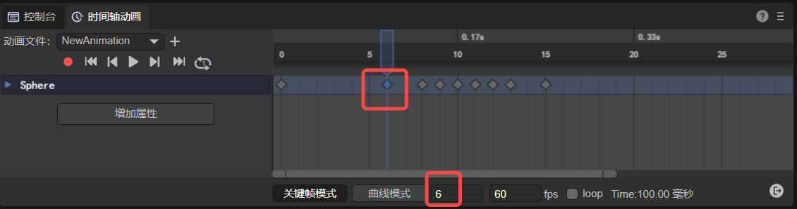

(Figure 2-3)

### 2.3 Playback frame rate

Refers to the number of animation frames played per second. As shown in Figure 2-4, the default value is 60.


(Figure 2-4)

### 2.4 Animation node properties

The properties of the animation node are shown on the left side of Figure 2-5. When pointing to a certain key frame, and then adjusting the property value, the adjusted property value can be stored in the frame and used as the basis for changing the key frame effect.


(Figure 2-5)

### 2.5 Curve, tangent, weight

#### 2.5.1 Curve

**definition:**

A curve is an interpolation algorithm connection between two keyframes used for frame transition.

**effect:**

An attribute interpolation algorithm used between two key frames to adjust the transition effect between animation key frames.

**Exterior:**

Curve lines are the transition algorithm effect of attribute values ​​between key frames. The IDE uses the cubic Bezier curve (also called third-order Bezier curve) algorithm to draw. The drawing principle is shown in the animation 2-6.

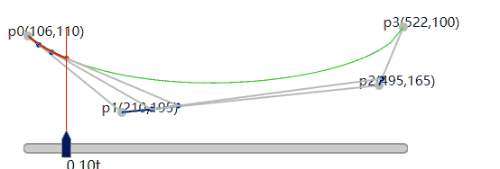  

(Animation 2-6)

In the animation 2-6, the red line is the appearance of the final interpolation algorithm curve effect, p0 is the starting frame, p3 is the ending frame, and the vertical red pointer is the movement speed of the current frame based on the curve.

The adjustment of the curve is determined by p1 and p2, which in turn are determined by the tangent and weight.

The appearance of the curve can be expressed in a curve form or a straight line form, as shown in Figure 2-7, both of which are drawn using the cubic Bezier curve algorithm.

  

(Figure 2-7)

> [!Tip|label:Tips]
>
> The curves drawn by the Bezier curve algorithm mentioned above are all adjustable curves. The built-in easing curve template of 2D animation is not a Bezier curve algorithm.

#### 2.5.2 Curve tangent

In the animation 2-6 above, the line segment from p0 to p1 is the tangent to p0, and the line segment from p2 to p3 is the tangent to p3. The position of the tangent will affect the shape of the curve.

The effect corresponding to the animation editor is shown in animation 2-8.


(Animation 2-8)

#### 2.5.3 Curve weight

Curve weight refers to the length of the tangent to the curve. The shortest value cannot be lower than 0, and the longest value cannot exceed 1. That is, the length between the two key frames p0 to p3 in the animation 2-6 above.

Pay attention to the animation in Figure 2-9. When the weight length is changed, the third line of the tips will also display the current weight value.


(Animation 2-9)

> Here we only demonstrate the concept of weight adjustment. Section 6.1.2 below will introduce in detail how to adjust the curve weight.

### 2.6 scale

The scale is divided into horizontal scale and vertical scale. The horizontal scale refers to the scale of the animation frame, and the vertical scale refers to the scale of the animation attribute value. As shown in Figure 2-10.


(Figure 2-10)

## 3. Basic interaction of the timeline animation editing panel

### 3.1 Multiple selection

#### 3.1.1 Frame selection

Keep pressing the left mouse button to make a frame selection and select all within the mouse selection.

#### 3.1.2 Multiple selection of consecutive areas

Shift + mouse click to select all within the specified first and last frames and attribute range.

#### 3.1.3 Interval multiple selection

ctrl + mouse click, whichever one you click selects.

#### 3.1.4 Exclusion

ctrl + mouse click. When selected, hold down ctrl + mouse click to exclude the item.

#### 3.1.5 Multiple selection release

Universal: selected first and last frames

Curve: Displays the selected highest and lowest attribute values, as well as the first and last frames. As shown in Figure 3-1:


(Figure 3-1)

### 3.2 Left mouse button

#### 3.2.1 Click (change current frame)

Change the current frame position, the mouse click is the current frame.

#### 3.2.2 Double click

**Add animation event:**

Double-click the area shown in Figure 3-2 to add animation events. Multiple animation events can be dispatched in one frame.


(Figure 3-2)

**Add Keyframes:**

Double-click the area shown in Figure 3-3 to add keyframes.


(Figure 3-3)

#### 3.2.3 Drag and drop

**Drag single frame:**

Select a keyframe and drag it to change the position of the current keyframe.

**Batch drag and drop multiple frames:**

You can also select multiple keyframes in batches and drag them to change the overall position.

### 3.3 Right mouse button

#### 3.3.1 Keyframe mode

1. Add keyframes: Right-click the keyframe panel area to bring up the keyframe addition menu. For example, in the red 1 area shown in Figure 3-4, the number in brackets represents the frame on which it is added.


(Figure 3-4)

2. Add animation events: Right-click the area between the frame scale and the keyframe panel, as shown in Figure 3-5, to bring up the 'Add animation event' menu. The number in brackets represents the frame on which it is added.


(Figure 3-5)

3. Click to select a keyframe, and right-click to bring up the current keyframe function menu. As shown in Figure 3-6:


(Figure 3-6)

4. Right-click the area (3) to bring up the attribute addition menu. As shown in Figure 3-7:


(Figure 3-7)

#### 3.3.2 Curve mode

1. In curve mode, right-click the blank area to bring up the curve automatic positioning menu. As shown in Figure 3-8:


(Figure 3-8)

2. In curve mode, right-click the keyframe to bring up the curve function menu. As shown in Figure 3-9:


(Figure 3-9)

3. In curve mode, right-click the curve to bring up the curve positioning menu. As shown in Figure 3-10:


(Figure 3-10)

### 3.4 Scroll wheel operation

#### 3.4.1 Frame display scaling

In keyframe mode, use the scroll wheel directly to zoom the frame scale panel with the mouse pointer as the center. As shown in animation 3-11:


(Animation 3-11)

#### 3.4.2 Attribute display scaling

In curve mode, use `Ctrl+Scroll Wheel` to zoom the attribute scale panel with the mouse pointer as the center. As shown in animation 3-12:


(Animation 3-12)

#### 3.4.3 Frame and attribute scaling at the same time

In curve mode, directly scrolling the wheel will zoom the frame and attribute scale panels simultaneously with the mouse pointer as the center. As shown in animation 3-13:


(Animation 3-13)

#### 3.4.3 Vertical scrolling of animation properties panel

When there are multiple properties beyond the display area of ​​the property panel, you can directly use the mouse wheel to scroll the property panel vertically for ease of operation. As shown in animation 3-14:


(Animation 3-14)

#### 3.4.4 Vertical scrolling of animation frame panel

When the mouse is on the animation frame panel, rolling the mouse wheel directly will only zoom the frame panel.

When we also need to scroll vertically, we can press and hold `Ctrl + scroll mouse wheel` in the animation frame panel to perform vertical scrolling operation, as shown in animation 3-15:


(Animation 3-15)


## 4. Attribute settings

### 4.1 Added attributes

#### 4.1.1 Add via button

As shown in Figure 4-1:


(Pic 4-1)

#### 4.1.2 Add by right-clicking

As shown in Figure 4-2:

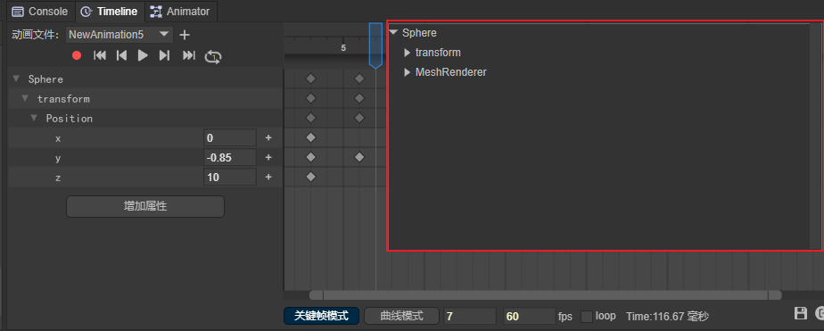

(Figure 4-2)

#### 4.1.3 Add by recording

First, click the red recording button. When the scale bar turns red, it means that it has entered the recording state. At this time, by adjusting the Transform parameter on the right, you can add the corresponding attributes in the timeline animation editor. The operation is shown in Figure 4-3:


(Figure 4-3)

**Differences between 2D animation properties and 3D animation properties:**

> [!Note]
>
> Each property value in 2D animation allows a single setting. The Vector attribute is indispensable in 3D animation, and it will be automatically added if deleted.
>
> 2D animation is in recording mode by default. For 3D animation, you need to click the record button to turn on the recording mode.

### 4.2 Keyframe attribute settings

#### 4.2.1 Direct input in attribute input box

Enter the value directly in the input box. As shown in Figure 4-4:

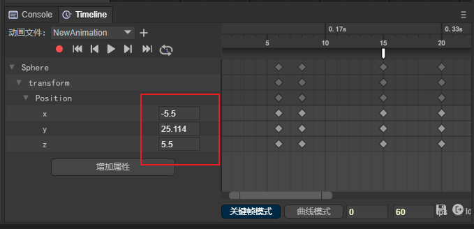

(Figure 4-4)

#### 4.2.2 Swipe input in attribute input box

Place the mouse on the input box. When the cursor changes to a two-way arrow, hold down the left button and drag the mouse left or right to change the value.

#### 4.2.3 Synchronous input in recording mode

Method 1: In recording mode, drag and drop input in the view window. As shown in Figure 4-5:
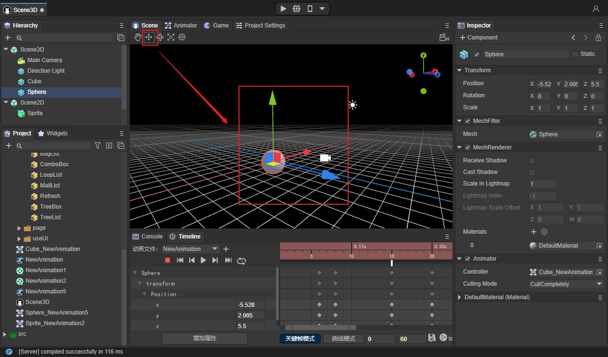

(Figure 4-5)

Method 2: In recording mode, enter in the properties window. As shown in Figure 4-6:


(Figure 4-6)

## 5. General operations of frame panel

### 5.1 Keyframe management

#### 5.1.1 Added

**Add in the Animation Frames panel:**

When there are already attributes in the animation frame panel, add keyframes by double-clicking or right-clicking the area shown in Figure 5-1.

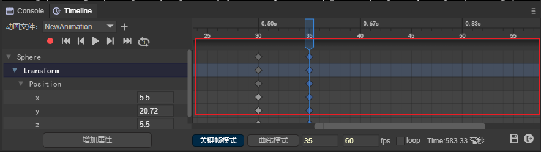

(Figure 5-1)

**Add in animation properties panel:**

Click the "+" sign on the right side of the property in the animation properties panel to add, as shown in Figure 5-2:


(Figure 5-2)

#### 5.1.2 Delete

Select the keyframe with the mouse and delete it through the "delete" shortcut key or the "Delete selected shortcut key" button in the right-click menu.

#### 5.1.3 Copy

Select the keyframe with the mouse and copy it with "ctrl+C".

#### 5.1.4 Paste

Select a blank frame with the mouse and copy it with "ctrl+V".

#### 5.1.5 Mobile

Select the keyframe with the mouse, hold down the left button and drag it.

### 5.2 Keyframe batch management

#### 5.2.1 Batch panning

Batch panning refers to moving the selected keyframes horizontally as a whole, while the spacing between keyframes remains unchanged.

The operation method is to batch select keyframes, and then hold down the left mouse button to perform batch panning. As shown in animation 5-3:

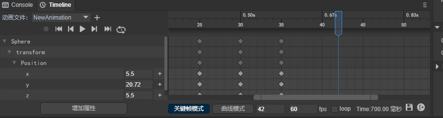

(Animation 5-3)

#### 5.2.2 Insert move

Inserting movement means inserting a blank frame between every two key frames among all selected key frames. Therefore, the position of the first frame remains unchanged, but the spacing between all subsequent key frames becomes larger or smaller.

**Increased spacing:**

Select multiple keyframes and insert blank frames. As shown in animation 5-4:


(Animation 5-4)

> In order to facilitate the understanding of animation 5-4, right-click operation is adopted, but it is recommended to use the shortcut key F5 to insert a blank frame.

**Spacing reduction:**

Select multiple keyframes and delete blank frames. When all blank frames between two key frames are deleted, deletion will stop. But it does not affect the continued deletion of other keyframes. As shown in animation 5-5:


(Animation 5-5)

> In order to facilitate the understanding of animation 5-5, right-click operation is used, but it is recommended to use the shortcut key Shift + F5 to insert a blank frame.

#### 5.2.3 Batch deletion

Select keyframes in batches, and then delete them in batches through the shortcut key "delete" or the `Delete selected keyframes` option in the right-click menu. As shown in animation 5-6:


(Animation 5-6)

### 5.3 Blank frame insertion

#### 5.3.1 Single insertion of blank frame

Add: Select a keyframe and use the shortcut key "F5" or the "Insert Blank Frame" button in the right-click menu.

Delete: Select a keyframe and use the shortcut key "shift + F5" or the "Delete Blank Frame" button in the right-click menu.

#### 5.3.2 Batch insertion of blank frames

Added: Select multiple keyframes through the shortcut key "F5" or the "Insert Blank Frame" button in the right-click menu.

Delete: Select multiple keyframes and use the shortcut key "shift + F5" or the "Delete Blank Frames" button in the right-click menu.

### 5.4 Animation events

#### 5.4.1 Added

In the area shown in Figure 5-7 in the frame panel, you can add animation events by double-clicking or clicking the "Add Animation Event" button in the right-click menu.

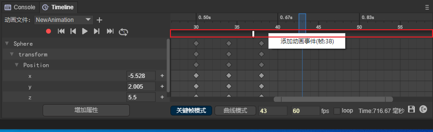  

(Figure 5-7)

#### 5.4.2 Delete

When the animation event is selected with the mouse, the animation event can be deleted through the shortcut key "delete" or "Remove Animation Event" in the right-click menu.

> Please see Part 9 for the specific use of animation events.

### 5.5 Keyframe jump


(Figure 5-8)

**Jump to first frame**

Click the button shown in (1) in Figure 5-8 to quickly jump to the first frame.

**Jump to previous keyframe**

Click the button shown in (2) in Figure 5-8 to quickly jump to the previous frame.

**Jump to next keyframe**

Click the button shown in (3) in Figure 5-8 to quickly jump to the next frame.

**Jump to last frame**

Click the button shown in (4) in Figure 5-8 to quickly jump to the last frame.

### 5.6 Frame panel scaling

#### 5.6.1 Scroll bar scaling

Left zoom: Pull the left scroll bar to zoom the frame scale to the left of the current keyframe.

Right zoom: Pull the right scroll bar to zoom the frame scale to the right of the current key frame.

The scroll bar is shown in Figure 5-9:

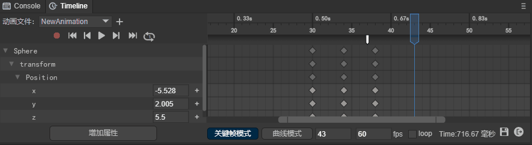

(Animation 5-9)

#### 5.6.2 Wheel zoom

1. Place the mouse on the frame scale and slide the wheel. At this time, the frame scale will zoom in and out with the current scale where the mouse is located as the center. As shown in animation 5-10:


(Animation 5-10)

2. Place the mouse on the attribute scale and slide the wheel. At this time, the attribute scale will be zoomed with the current scale where the mouse is located as the center. As shown in animation 5-11:


(Animation 5-11)

> Regarding locking a certain scale panel for wheel zoom, please scroll up to see section 3.5 Shortcut Keys.

## 6. Curve mode operation

### 6.1 Animation Curve Adjustment

#### 6.1.1 Using animation curve template

Animation curve templates can be divided into two types, namely built-in curve algorithms and custom curve algorithms.

After using the built-in curve algorithm, the curve cannot be adjusted at will.

Using a custom curve algorithm, the curve can be adjusted at will.

How to open the curve template: Right-click the keyframe in curve mode and click "Use Animation Curve Template" in the right-click menu to open the curve template interface.

> [!Tip|label:Tips]
>
> The built-in curve algorithm only supports 2D animation.

##### Built-in curve algorithm:

**Linear:**Linear animation, that is, uniform speed. Start at the same speed and end at the same speed. The animation curve is shown in Figure 6-1:


(Figure 6-1)

**EaseIn:** Entry easing curve, the animation starts at a low speed and continues to accelerate during the process. The animation curve is shown in Figure 6-2:


(Figure 6-2)

**EaseOut:** The exit easing curve, which keeps decelerating during the animation and ends at a low speed. The animation curve is shown in Figure 6-3:


(Figure 6-3)

**EaseInOut:**Ease the curve on both sides. The animation starts at a low speed, accelerates and then decelerates, and exits at a low speed. The animation curve is shown in Figure 6-4:


(Figure 6-4)

##### Customized curve algorithm:

**Custom：**

If the built-in curve template cannot meet the needs, developers can directly select the Custom curve mode and then modify the curve trajectory in the panel area. As shown in Figure 6-5:

After modification, you can save it for reuse.


(Figure 6-5)

#### 6.1.2 Tangential adjustment


(Figure 6-6)

**Weights**:

- Default weight: The default value of the curve weight is one-third of the total length of the weight, which is the engine optimization position. The Hermite interpolation algorithm is used, which has better performance. Recommended Use.

    

  (Figure 6-7)

- Custom weight: When the lock weight is not checked, it is a custom weight. Custom weights are more flexible, but the performance is not as good as the default weights.

  

  (Animation 6-8)

- Lock weight: After using a custom weight, if you want to keep this weight, you can lock the weight and only adjust the tangent position.

  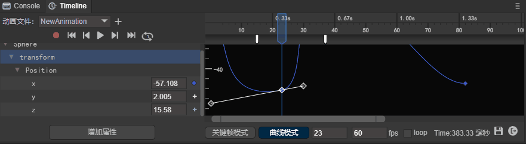

  (Animation 6-9)

**Function**:

- Left tangent: adjust the tangent setting parameters on the left side of the current keyframe.
- Right tangent: adjust the tangent setting parameters on the right side of the current keyframe.
- Two tangents: Adjust the tangent setting parameters on both sides of the current keyframe.

**Interpolation Transition**:

- Linear: Adjust the curve angle to make the curve appear as a straight line.

  

  (Figure 6-10)

- constant: Adjust the curve angle to make the curve appear as a right-angled polyline.

  

  (Figure 6-11)

#### 6.1.3 Smoothing

Unchecked state: Both sides of the keyframe can be adjusted by setting the left and right tangent lines of the curve respectively without affecting each other. However, the transition may not be smooth enough and form a sharp angle. As shown in Figure 6-12:
  

(Figure 6-12)

Checked state: The curve tangents are set simultaneously on both sides of the keyframe. When checked, the transition will be smoother.

#### 6.1.4 Level

Unchecked state: Custom curve tangent.

Checked state: After checked, the tangent line of the curve will quickly return to the horizontal position.


(Animation 6-13)

### 6.2 Curve positioning

#### 6.2.1 Position input on curve

Right-click the curve and click the "Locate to Input" option in the right-click menu to quickly locate the parameter represented by the curve. Taking the green curve as an example, after clicking "Locate to Input", you can find that the green curve represents the change of the X parameter. As shown in Figure 6-14:

  

(Animation 6-14)

#### 6.2.2 Automatic positioning

When the curve cannot be seen in the display area of ​​the curve panel due to a series of mouse operations, right-click and select "Auto Position" to quickly display the curve. As shown in animation 6-15:

   

(Animation 6-15)

### 6.3 Curve display filtering

#### 6.3.1 Filter specified curves in the animation properties panel

Double-click the parameter in the animation properties panel to quickly find the specified curve. As shown in animation 6-16:

  

(Animation 6-16)

#### 6.3.2 Filter specified curves in the curve panel

In the curve panel, select a curve, right-click, and select "Show only current curve" in the right-click menu to filter to the specified curve. As shown in animation 6-17:


(Animation 6-17)

## 7. Play animation

### 7.1 Animation panel playback

#### 7.1.1 Single playback

Click the play button to play the animation, which defaults to a single playback.

Click the button as shown in Figure 7-1 to play the animation.


(Figure 7-1)

#### 7.1.2 Loop playback

The animation preview defaults to single play mode. When we see a number 1 in the middle of the loop icon, it means it is in single play mode. As shown in Figure 7-2.


(Figure 7-2)

After clicking the single playback state button, the button is in the loop icon state, as shown in Figure 7-3. At this time, the animation can be played in an infinite loop.


(Figure 7-3)

#### 7.1.3 Cancel loop playback

After clicking the loop playback status button, the current loop playback status will be stopped. At this time, the number 1 can be seen in the middle of the loop icon, indicating that the loop playback has been canceled and returned to the single playback mode.


(Figure 7-3)

> Please note that when the single playback mode is changed to the loop playback mode, since it is not currently in the playback state, it will not automatically change to the loop playback state.

### 7.2 Check the running effect

The playback preview in the IDE is just the basic effect of the animation. In most cases, the animation is also combined with code interaction logic. At this time, it needs to be run in the browser to view the final running effect.

Click the button shown in Figure 7-4 to view the preview effects on different platforms.

  

(Figure 7-4)

Since the animation component cannot be played independently and must be hung in the scene, the animation can be played by directly running the scene where the animation is located.

> If you want to view the animation effect independently, you need to create a test scene with animation effect and hang it in the test scene.

### 7.3 Loop playback during runtime

The loop playback preview in the IDE has nothing to do with whether it loops during runtime.

If you need to loop playback during runtime, you need to check the loop state in Figure 7-5.

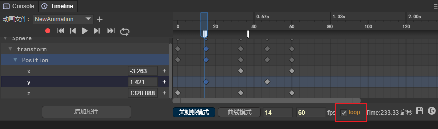  

(Figure 7-5)

If loop is unchecked, it will be played once during runtime.

## 8. Others

### 8.1 Save animation

As shown in Figure 8-1, click the save icon below the timeline animation editor. It should be noted here that if you do not save it, the animation will be played according to the unsaved effect at runtime.


(Figure 8-1)

### 8.2 Exit animation editor

Click the exit icon below the timeline animation editor to exit the animation editor. As shown in Figure 8-2:

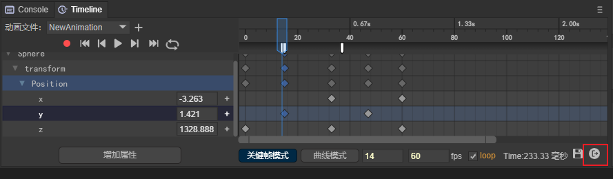

(Figure 8-2)

### 8.3 Summary of shortcut keys

| Shortcut keys	| Function	|
| -------------- | ------------------------------------------------------------ |
| F5	| Insert blank frame	|
| Shift + F5 	| Delete blank frames	|
| Delete     	| Delete keyframes	|
| Ctrl + c   	| Copy keyframes	|
| Ctrl + v   	| Paste keyframes	|
| Ctrl+Scroll Wheel	| In keyframe mode, the animation property panel and animation frame panel scroll vertically at the same time<br />In curve mode, the frame scale panel is locked (no zooming), with the mouse pointer as the center, and there is no limit to the accuracy of the scaling attribute scale panel. |
| Alt+scroll wheel	| In curve mode, the attribute scale panel is locked (no scaling), with the mouse pointer as the center, and the accuracy of the frame scale panel is unlimited. (Unlimited zoom will cause the zoom to no longer be centered on the mouse pointer before zooming when the zoom is stretched to 0 frames visible) |
| Alt+Shift+Scroll Wheel | In curve mode, lock the attribute scale panel (without zooming), center the mouse pointer, and limit the accuracy of the zoom frame scale panel. (Always keep the mouse pointer as the center for zooming. When the zoom is stretched to 0 frames and visible, the scale precision is prohibited from being reduced, and only the scale precision is allowed to be enlarged) |
| Shift      	| In curve mode, keep holding down the Shift key to move keyframes and always maintain horizontal displacement. Both single and batch movements are valid. |
| Ctrl       	| In curve mode, keep holding down the Ctrl key to move keyframes and always maintain vertical displacement. Both single and batch movements are valid. |

## 9. Use animation events

In Section 5.4, we introduced the operations of adding and deleting animation events. Let’s take a look at how to use animation events.

### 9.1 Property settings

After adding the animation event, click the white event icon to set the animation event properties in the property panel on the back side of the IDE, as shown in Figure 9-1


(Figure 9-1)

Event Name: The name of the event method called in the script

Params: Parameters (strings) passed when calling the event method in the script. You can set multiple

As shown in Figure 9-2, for example, add an "event1" method name to this event, add two parameters, "a", "1", and click Save below


(Figure 9-2)

### 9.2 Monitoring in scripts

After setting the animation event properties, in order to listen to the events and parameters, you need to add a script to the animation node.

Let’s look at how to add a script to an animation node through animation 9-3.


(Animation 9-3)

After adding the script, you can monitor the events and parameters in the script. The script code is as follows:

```typescript
const { regClass, property } = Laya;

@regClass()
export class Script extends Laya.Script {
	//declare owner : Laya.Sprite3D;

	constructor() {
    	super();
	}

	event1(p1:any, p2:any): void {
    	console.log("event1",p1,p2);
	}
}
```

Create the event1 method in the script and receive two parameters. Finally, we run the animation and see the results:

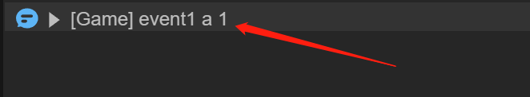

(Figure 9-4)

