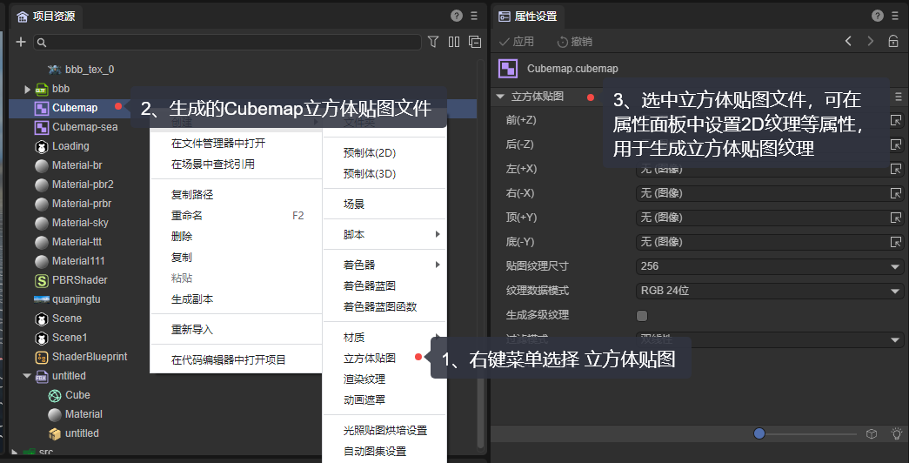
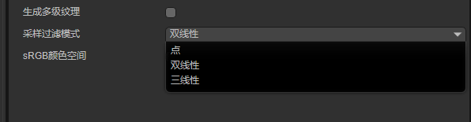
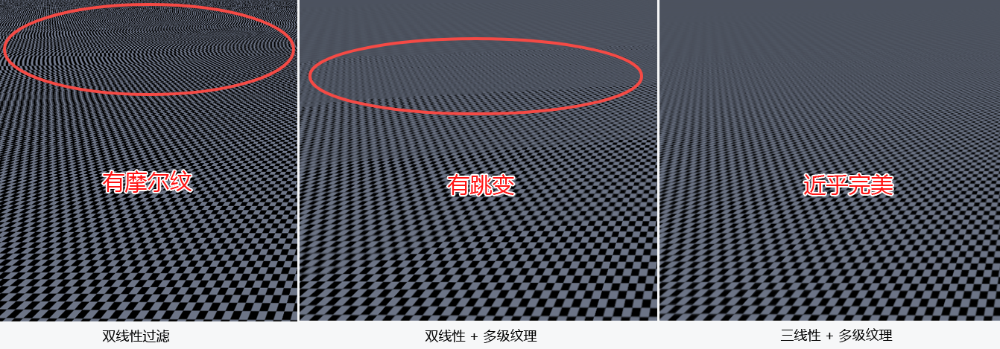

# Settings and applications of cubemaps

> Author: Charley

## 1. First introduction to cube maps

### 1.1 Application scenarios of cube map

**Skybox** and **Environment Reflection** in 3D scene production are application scenarios of cube maps, and the effect is shown in Figure 1.

(figure 1)

### 1.2 What is cube map

As the name suggests, cube mapping is a multi-texture combination mapping map based on a cube structure. The six square 2D textures represent each face of the cube respectively. According to the direction of the world coordinate system, each face is: front (positive z-axis direction), back (negative z-axis direction), left (positive x-axis direction), Right (negative direction of x-axis), top (positive direction of y-axis), bottom (negative direction of y-axis).

If the texture of this cube is expanded into a plane, the schematic effect is as shown in Figure 2:

(figure 2)

If the developer wants to directly use an unfolded 2D texture set as a cube map, LayaAir does not support it. How to create a cube map, we continue reading.

## 2. Creation and application of cube map

### 2.1 Create cube map file

The project resource panel of the LayaAir engine provides the creation process of cube map resource files.

Proceed as follows:

In the `Project Resources` panel --> **Click** `Cubemap` in the right-click menu --> `Name` the generated cubemap,

The creation process is shown in Figure 3:

(image 3)

### 2.2 Set the texture of the cube

After setting the textures for the six faces (front, back, left, right, top, bottom) of the cubemap, click Apply. Only then will the corresponding cube map texture be generated and be used normally.

After setting the texture, you can preview the effect of the cube map in real time. The effect is shown in Figure 4:

(Figure 4)

> Each time you click Apply, the texture of the cube map will be regenerated, so it is normal for the progress panel that is importing the cube map to pop up.

## 3. Other cube map settings

### 3.1 Texture size

The size of the map texture refers to the texture size of each face. For example, if it is set to 1024, it means that the texture of each face is 1024*1024.

### 3.2 Texture data mode

What mode is used for each pixel data of the texture is set here, as shown in Figure 5. In terms of color, it can be seen that they are all based on the red, green, and blue (RGB) color model. The difference lies in A and M, and the placeholder.

(Figure 5)

#### 3.2.1 RGB and RGBA

RGB represents the data mode without a transparent channel, and RGBA represents the data mode with a transparent channel. These two are the more commonly used texture data modes. The following digits represent the number of bytes occupied. For example, RGBA32 bits represent R8G8B8A8, that is, red (Red), green (Green), blue (Blue), and Alpha (transparency). Each of these four channels is represented by 8 bits (that is, one byte). The total is 32 bits.

The higher the number of bits occupied, the more subtle color changes can be expressed. However, it will also lead to an increase in video memory usage. Additionally, higher-bit color models are not supported on some low-end or older devices.

#### 3.2.2 RGBM

The M of RGBM represents brightness. This is a compressed format used to store High Dynamic Range (HDR) images in low bit depth textures. It separates and compresses the color information (RGB) and brightness (M) information of HDR images to reduce the amount of data stored and transmitted.

The RGBM mode is mainly used to store and process HDR ambient lighting information, which is very useful for processing ambient lighting, because ambient lighting usually contains a large number of highlight areas, and the color information of these areas is easily lost in the ordinary RGB mode.

However, RGBM needs to combine RGB and M to get the final color. Therefore, additional calculation processing is required, and when the color range is very large, it may lead to insufficient color accuracy and, in some cases, color deviation.

### 3.3 Generate multi-level textures

Cubemap supports `Generate multi-level texture` by checking, which is not checked by default.

> If you don’t know about multi-level textures, continue reading. If you are already familiar with it, you can skip it.

#### 3.3.1 What is multi-level texture

The English name for multi-level texture is Mipmap, which is a pre-generated texture image sequence. The basic idea is to generate a series of reduced versions of a texture, each version being half the size of the previous version.

For example, if the size of the original texture is 256x256 pixels, then the multi-level texture will generate 128x128, 64x64, 32x32, 16x16, 8x8, 4x4, 2x2, 1x1 pixel versions, arranged in a pyramid shape at different resolutions. The effect is shown in Figure 6:

(Figure 6)

> The original dimensions of multi-level textures must be a power of 2

#### 3.3.2 Use multi-level texture to eliminate moiré

The moiré phenomenon is mainly due to the fact that when the texture map is mapped to the surface of the object, if the object is far away from the observer or the surface of the object is relatively small, the resolution of the texture may exceed the pixel resolution of the screen, which results in high resolution in the texture. Video details (such as small lines or dot patterns) cannot be accurately represented on the screen and are forcibly compressed or ignored. When these high-frequency details are compressed or ignored, it is possible to produce the effect of two similar and regular patterns superimposed together, forming a moiré pattern similar to ripples. In addition, if the texture map itself is not filtered properly, the moiré phenomenon may be aggravated.

The use of multi-level texture (Mipmap) can effectively eliminate the moiré phenomenon. The effect is shown in Figure 7.

(Figure 7)

#### 3.3.3 Advantages and disadvantages of applying multi-level textures

The application of multi-level textures (Mipmap) has significant advantages in visual effects, rendering efficiency and resource usage. It can effectively eliminate moiré and other visual problems and improve rendering efficiency.

However, these advantages come with some disadvantages, such as increased storage requirements because each texture needs to store a series of mipmap levels, which increases the memory usage. At the same time, generating mipmaps requires some additional calculations, which increases preprocessing time. Also, visual discontinuities or other problems may occur at the boundaries of mipmap level switching.

### 3.4 Filter mode

To apply a texture map to a 3D model surface, you need to associate a 2D image (texture) with the 3D model surface through texture mapping technology.

The process of texture mapping mainly includes the steps of texture coordinate generation, texture sampling, and texture application. Texture filtering is in the color extraction process of texture sampling.

The LayaAir engine supports three sampling filtering modes, namely point filtering, bilinear filtering, and trilinear filtering. As shown in Figure 8:

(Figure 8)

#### 3.4.1 Point filtering

Point filtering is also called adjacent point filtering. This is the simplest filtering mode. It directly selects the color of the nearest texture element as the color of the sampling point.

For example, in Figure 9-1, you can see four pixels, and the plus sign represents the texture coordinates. The center of the upper-left texel is closest to the texture coordinates, so it is selected as the sample color.

(Figure 9-1)

This filtering mode is very efficient when amplifying, but there will be obvious mosaic phenomenon. When zooming out, noise flickering and aliasing will occur, and the performance overhead will increase.

#### 3.4.2 Bilinear filtering

Bilinear filtering can effectively reduce aliasing compared to point filtering.

It is based on nearest neighbor filtering and obtains the color of the sampling point by weighting the average of the colors of the four surrounding texture elements. The effect is shown in Figure 9-2:

  

(Figure 9-2)

Although bilinear filtering will cause blurring when the texture mapping is enlarged, the effect is much better than point filtering mosaic. The comparison effect is shown in Figure 9-3.

(Figure 9-3)

#### 3.4.3 Trilinear filtering

Although the effect of bilinear filtering is better than point filtering, the problem of long-distance noise still exists, so bilinear filtering usually needs to be combined with multi-level textures to solve the noise and moiré problems.

However, when processing different levels of textures, a jump phenomenon may occur. This blurred to clear dividing line will be more obvious during movement.

Therefore, trilinear filtering is based on bilinear filtering and performs bilinear filtering between levels of multi-level textures to obtain the color of the sampling point so that it transitions smoothly and no longer appears abrupt. The effect is shown in Figure 9-4.

  

(Figure 9-4)

> In terms of performance consumption, the order from small to large is: point filtering --> bilinear filtering --> trilinear filtering

### 3.5 sRGB color space

sRGB (standard red, green, and blue) is a standardized RGB (red, green, and blue) color space that is widely used in computer graphics and display fields. It defines a standard Gamma correction curve (Gamma0.45) for mapping linear RGB values ​​to non-linear display brightness. Nonlinear mapping can better adapt to the human eye's perception of brightness, making colors look more natural and balanced in different brightness ranges.

In addition, since the design of the sRGB color space takes into account the perceptual characteristics of the human eye, the defined color gamut is relatively small within the visible color range. Applicable to most common display devices and used to ensure color consistency on different devices.

It should be noted that it also has some disadvantages, including limited color range (cannot cover all visible colors), limited contrast (the gap between the brightest and darkest color space is relatively small), and is not suitable for processing high dynamic range (HDR) content, problems such as color distortion or unnatural transitions may occur when processing linear workflows.

