# Tile Map

## 1. Preface

Tile maps (Tilemap) are composed of tiles and can be used to create the map layout of a game. Using tile maps to create game scenes is much more efficient than adding 2D nodes one by one in the scene, and larger maps can be created. Tile maps can also add more powerful functions such as collision, occlusion, and lighting.

Before using tile maps, we first need to create a `TileSet`. `TileSet` is a collection of tile sets, which can include multiple tile sets and their related data.

In this section, we use the following tile sheet as an example:

This image is from [Pixel Line Platformer · Kenney](https://kenney.nl/assets/pixel-line-platformer) 

## 2. Using TileSet

### 2.1 Creating TileSet

Create a TileSet in the project resource panel:

After creation, open the tile set panel in the panel bar:

We can set various properties of the TileSet in the tile set panel:

All the properties in the TileSet are related to tiles. Therefore, let's first learn how to create a tile set.

### 2.2 Adding Tile Sets

First, we need to prepare an atlas. Here we use the example image in the first section and drag this tilesheet to the tile area in the tile set panel, as shown in the figure:

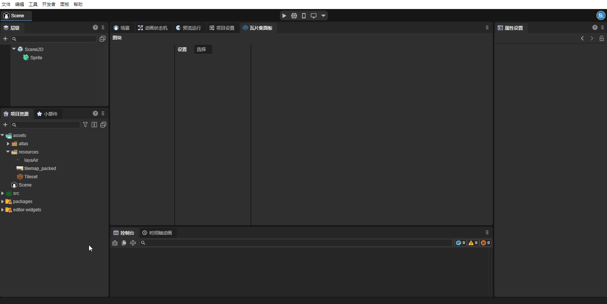

After adding the atlas, the tile set divided by attributes appears in the panel. We still need to create it as tiles to use it normally. Select the part to be created, right-click - Create Tile:

Here let's understand the attributes related to creating tiles:

**`ID`**: Multiple tile sets can be created in one TileSet. This attribute is the index of each tile set.

**`Atlas`**: The atlas used by this tile set.

**`Texture Region Size`**: The size of the texture region, representing the size of each tile on the atlas.

**`Margin`**: Margin, the area on the edge of the atlas that should not be selected as a tile, used to remove the useless area on the edge of the atlas.

**`Separation`**: Spacing, the distance between each tile on the atlas, used to remove the auxiliary lines and other useless areas between tiles.

### 2.3 Attributes of TileSet

The attributes of TileSet will act on each tile:

**`Tile Shape`**: Tile shape. This attribute determines the shape of the tiles in the scene and the way the system divides the atlas. The default tile shape is `TILE_SHAPE_SQUARE (Rectangle)`. Developers can also select other attributes according to the tile shape: `TILE_SHAPE_ISOMETRIC (Rhombus)`, `TILE_SHAPE_HALF_OFFSET_SQUARE (Half-offset Rectangle)`, and `TILE_SHAPE_HEXAGON (Hexagon)`.

In the following figure, we set this attribute to `TILE_SHAPE_HEXAGON (Hexagon)`, and you can see the effect of this attribute:

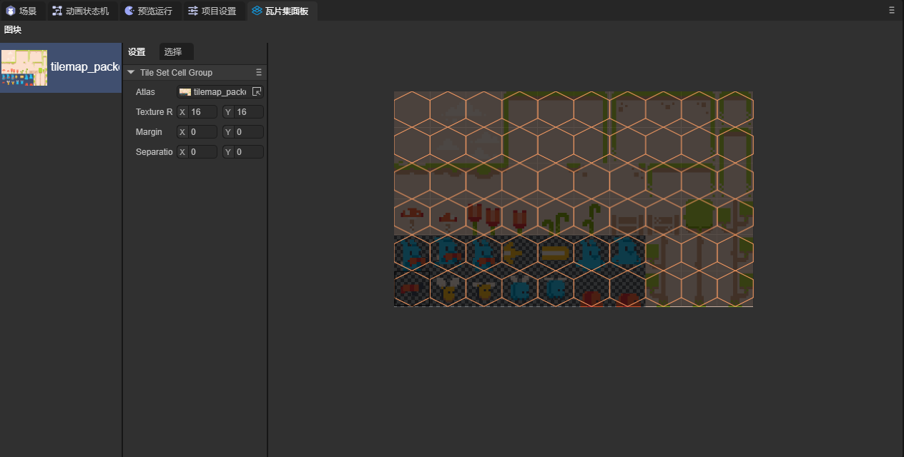

**`Tile Size`**: The size of each tile in the scene. Generally, this value should be consistent with `Texture Region Size`.

**`Custom Layers`**: Custom layers. Developers can add custom attributes to tiles by adding custom layers.

First, create a `Custom Layers` in the attribute setting panel of TileSet and set the name and attribute type:

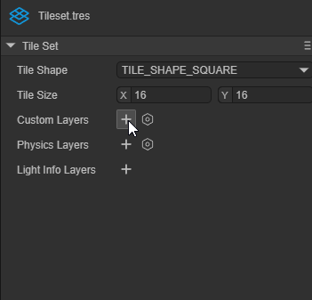

Then select a tile in the tile set panel and click to select. At the bottom of the panel, you can see the attributes we set. The attributes of each tile are independent, and developers can set the attribute values by themselves:

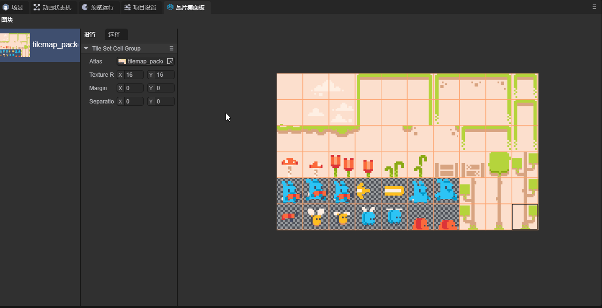

**`Physics Layers`**: Physical layers. Enable tiles to have physical effects. Its attribute values are as follows:

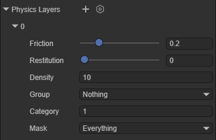

`Friction`: Friction coefficient. `Restitution`: Restitution coefficient. `Density`: Density. `Group`: Collision group. `Category`: Collision category. `Mask`: Collision mask.

After adding the physical layer, developers can add collision shapes to the tiles: Select a tile in the tile set panel, click to select, and at the bottom of the panel, you can add collision shapes to the tiles:

If you want the physical effect to take effect, you also need to enable the `Physics Enable` attribute in the Tile Map Layer component

At this time, we set tiles in the scene and can see the physical effect:

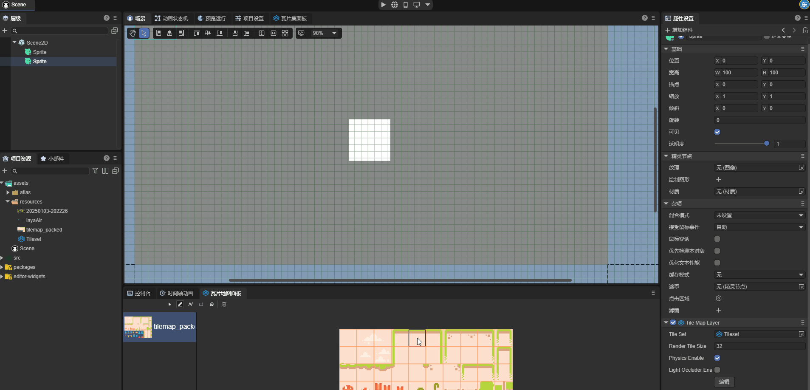

**`Light Info Layers`**: Light occlusion layers. Enable the tile map to interact with 2D light components.

Create a `Light Info Layers` in the attribute setting panel of TileSet and set a name for it:

Select a tile in the tile set panel, click to select, and at the bottom of the panel, you can add shapes to the tiles:

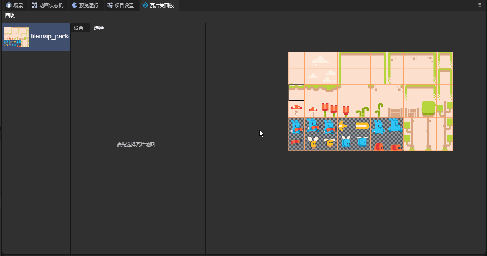

If you want this attribute to take effect, you need to enable the `Light Occluder Enable` attribute in the Tile Map Layer.

Next, add this tile to the scene. For the part related to lighting, you can refer to the document [2D Lights and Meshes](..\..\Component\2D\BaseLight2D\readme.md). The effect is as follows:

You can see the shadow generated by the light.

### 2.4 Tile Attributes

In this section, let's learn about the attributes of tiles. Select a tile in the tile set panel, and in the selection interface, you can see the attributes of this tile:

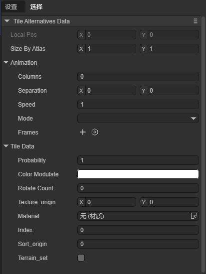

**`Size By Atlas`**: Set how many pieces in the atlas a tile will consist of.

Here we select a tile and set the `Size By Atlas` attribute of this tile to (2, 3),

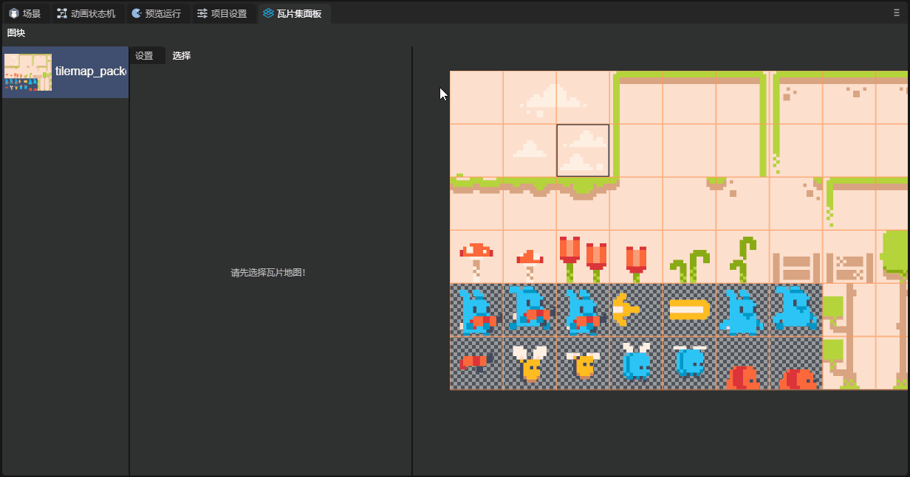

You can see that a 2*3 area in the atlas forms a tile. Place this tile in the scene:

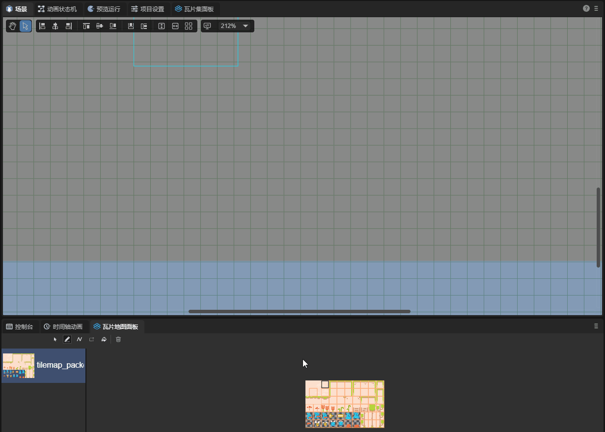

Let's explain the usage of Animation in the tile map below:

To use Animation, first, we create a tile set, but do not create tiles, as shown in the figure:

Next, we select a tile and create it. The animation information will be saved on this tile. Here we selected the picture in the first column of the fifth row:

Select this tile and add frames for it. Here we added five frames. The tile map will automatically select five tiles to the right of this tile as animation frames starting from this tile. The parameter of the frame attribute is the duration of this frame:

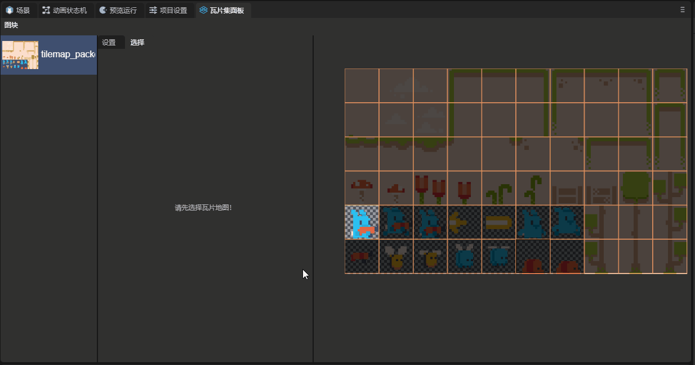

Add this tile to the scene and you can observe the effect:

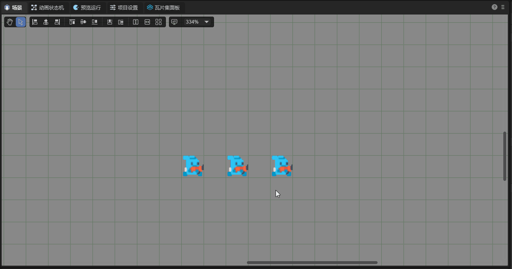

Next, let's introduce other attributes in Animation:

**`Columns`**: The number of frames selected from each row in the animation. When the value is zero, the animation will select frames from the same row. Otherwise, it will automatically change rows.

**`Seperation`**: The number of frames skipped when selecting frames in the X and Y directions starting from the selected tile.

**`Mode`**: Determine the playback mode of the animation.

`DEFAULT`: Start from the first frame;

`Random_Start_Times`: Start from a random frame.

Let's introduce the attributes in Tile Data below

**`Color Modulate`**: Control the color of the tile.

**`Texture_origin`**: The center position of the texture. When the tile is added to the scene, the center of the tile will always be in the center of the tile block, but the position of its texture can be changed.

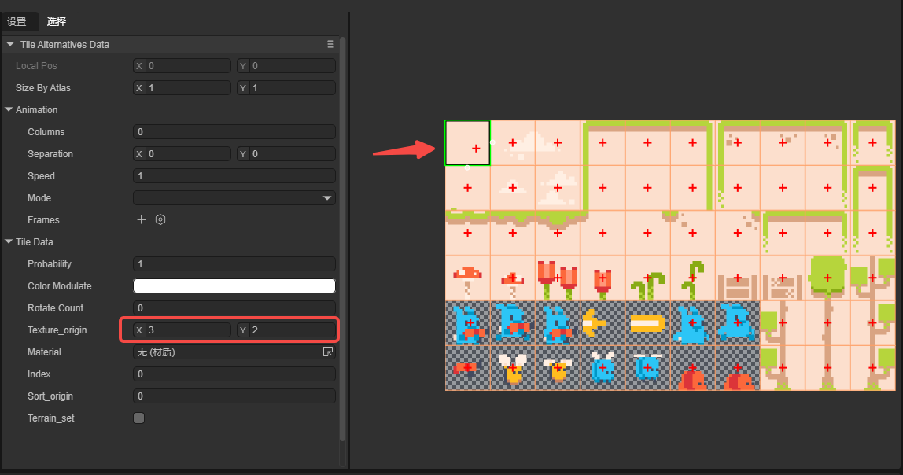

You can see that the position of the texture has shifted.

**`Material`**: The material of the tile.

**`Index`**: The index of the tile.

### 2.5 Creating Alternate Tiles

For an already created tile block, developers can create an alternate tile for this tile block:

The alternate tile has three unique attributes:

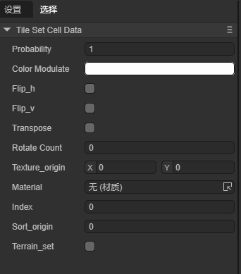

**`Flip_h`**: Vertical flip.

**`Flip_v`**: Horizontal flip.

**`Transpose`**: Mirror flip along the diagonal.

## 3. Application of Tile Map Resources

For the specific application of tile map resources, please jump to the documentation of the [Tile Map Layer](../../Component/2D/TileMapLayer/readme.md) component