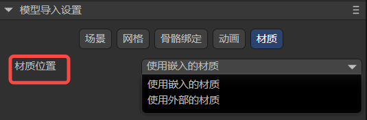

# Model import settings

> Author: Charley && Meng Xingyu

## 1. Model import and setting

For third-party models, LayaAir3-IDE currently only supports model formats with the suffixes **fbx, gltf, and glb**.

Drag or copy the models with the above suffixes into the assets directory of the project resources, and the import progress panel will pop up, as shown in Figure 1-1. When the progress is completed, the panel will be automatically closed. It means the import is complete.

(Picture 1-1)

After these models are imported into the IDE, they will be automatically converted into a format that can be recognized by the LayaAir engine. For example, when you click on a model that has been imported into the IDE, we can observe in the properties panel that the model file is converted to a .lh suffix, and the grid file is converted to With the .lm suffix, the material file is converted into a file with the .lmat suffix. As shown in Figure 1-2:

(Figure 1-2)

> LayaAirIDE also supports importing LayaAir models (.lh and .lm suffixes) exported by other projects or Unity plug-ins. This article mainly refers to external model files. If there is a need for lm grid configuration, this document is also applicable.

When using these models, just drag the model directly to the scene or hierarchy panel. The operation is as shown in the animation 1-3:

(Animation 1-3)

When imported for the first time, the attribute parameters used are all default values.

If we want to modify the settings of the model, we can select a model, and then modify the imported attributes of the model in the `Property Settings Panel`. Click `Apply` after each modification, and the import settings will be re-made based on the modified attribute values.

The operation is shown in Figure 1-4:

(Figure 1-4)

## 2. Model scene (Scene) import settings instructions

A model may contain a lot of information, such as scene-related information such as cameras and light sources, as well as meshes, animations, materials, bones, etc. We classify this information, starting with the scene-related settings.

### 2.1 Model scaling Scale Factor

Model scaling is mainly used to preprocess the model size according to the target scene scale to make it meet the design requirements and optimize the scaling relationship between different models.

For example, you can adjust the model to the physical size that meets your needs through the settings here. The effect comparison is shown in Figure 2-1:

(Figure 2-1)

### 2.2 Convert Units

The default unit after the model is imported is meters.

If you change the unit to centimeters, there will be a checked associated option `Size Unit Converter` that is checked by default. The purpose of the default check is to maintain the visual size of the current model and only change the unit of the model.

If checked and unchecked, the scene will feel magnified 100 times. The effect comparison is shown in Figure 2-2:

(Animation 2-2)

### 2.3 Import model built-in data (visibility, camera, light source)

If the art has visibility, camera, and light attribute settings when making the model, LayaAir3-IDE will not import them by default. It is recommended to add and set them in the scene of LayaAir-IDE.

When developers have these built-in data requirements for using the model, they can also check these options, as shown in Figure 2-3. Re-import it by clicking **Apply**.

(Figure 2-3)

### 2.4 Add LOD Group Add LOD Group

When LOD data exists in the model, checking this option will export the LOD data and automatically create a LODGroup component to set the Lod data when using the model. The effect after adding is shown in the animation 2-4.

(Animation 2-4)

## 3. Instructions for importing the model’s mesh (Mesh)

### 3.1 Easier-to-understand attribute descriptions

There are some attribute settings that are easier to understand, as shown in Figure 3-1.

(Figure 3-1)

We provide an overview via tables.

| Chinese attribute name | English attribute name	| Property description	|
| ------------ | -------------------- | ------------------------------------------------------------ |
| Dynamic reading and writing	| read Write       	| When dynamic read and write is checked, developers are allowed to dynamically access or modify the model data at runtime (for example, when pinching a face, the mesh vertex information that needs to be changed belongs to the modified model data).  It should be noted that enabling `dynamic reading and writing` will increase memory usage.  So, if your model does not need to be modified at runtime, please do not turn this option on to save memory. |
| Mesh compression	| mesh Compress    	| If checked, the grid data can be compressed to reduce the size of the grid file.  It should be noted that the compressed mesh will be stored in the temporary directory of the IDE, and the original model will not change.  The change in volume reduction can only be seen after publishing. |
| Standardized weights | Standardized weights | Adjust the total weight to 1 by adjusting the weight correction. It is used to solve problems such as possible distortion of the model beyond a certain range. It is recommended to keep it checked.  If you can ensure that there will be no problems when applying the model, you can also uncheck it. After unchecking, the original data of the model will be maintained and the original effect of the model will be obtained. |
| Import Morph Target | Import Morph Target | Import the morph target (also called Blend Shape) data in the model. |

### 3.2 Index data format index Format

Index data is used to determine the position of vertices in the vertex buffer, thereby building the shape of the geometry. This property is used to control the precision and range of these index data, thereby affecting the performance and quality of rendering.

As shown in Figure 3-2, this attribute has three options: **Auto, UInt16-bit, and UInt32**-bit.

(Figure 3-2)

**Auto**: Automatic is the default option. In this mode, LayaAir will automatically decide which data format to use based on the number of vertices. By default, UInt16 will be used first. When the number of vertices exceeds 65535, it will automatically switch to UInt32 data format. .

**UInt16**: This means that the index data is represented by a 16-bit unsigned integer (0~65535). Using a 16-bit index saves memory and is sufficient to express the vertex index in most cases. However, when the number of vertices of the model exceeds 65535, it needs to be split into multiple sub-meshes for rendering, which may increase the number of draw calls.

**UInt32**: This means that the index data is represented using a 32-bit unsigned integer (0~4294967295). Using 32-bit indexes can support larger models and avoid splitting into multiple subgrids, but will take up more memory.

### 3.3 Processing normals and tangents

In terms of the ability to handle normal effects, there are mainly three related attributes, namely **normal**, **normal calculation mode**, and **tangent**, as shown in Figure 3-3:

(Figure 3-3)

#### 3.3.1 Normal `Normal`

The **normal** attribute has three options, **import**`import`, **calculate**`calculate`, and **none**`none`. As shown in Figure 3-4.

(Figure 3-4)

**Import** means using the predefined normal data in the model file. This means that if the model file contains normal information, LayaAir will directly use these normal data for rendering. If the model has no normal data or the normal data is incorrect, you may get incorrect lighting effects.

**Calculation** means that the normal data of the model will be recalculated when the model is imported. This may be useful in certain situations, such as when the model's normal data is incomplete or inaccurate. Recalculating normals may consume some computing resources, but it ensures that the model is lit correctly.

Whether it is importing or calculating, you need to set the associated attribute **Normal Calculation Mode**, and selecting **None** will completely ignore the normal data of the model, and the vertices will not be imported. The attribute `normal calculation mode` will not be displayed in the IDE. **None** This option may be used for specific rendering needs, either by manually editing the normals in LayaAir or using a script to calculate the normals. Failure to do so means that when rendering, no normal data will be available, potentially resulting in incorrect lighting visuals.

#### 3.3.2 Normal Calculate Mode`Normal Calculate Mode`

**Normal calculation mode** has two options: **unweighted**unweight and **area weighted**areaWeight. As shown in Figure 3-5.

(Figure 3-5)

**Unweighted**, meaning the normal will be calculated as a simple average of adjacent vertices. This means that the normal of each vertex is only affected by its neighboring vertices, regardless of the size or angle of the face. This works well for smooth surfaces, but normal discontinuities may occur at sharp corners or separated edges.

**Area weighting** will weight the average of the normals of adjacent vertices according to the size of the face. This produces smoother normal transitions on sharply angled surfaces, reducing normal discontinuities.

#### 3.3.3 Tangents`Tangents`

Tangent data is a key part of advanced effects like normal maps and normal mapping. Normal maps simulate high detail by storing normal information on the model's surface. Tangent data helps calculate pixel normals, giving objects visual bump detail. So **Tangent** is the same as **Normal Calculation Mode**. Only when the normal line exists (not set to **None**), it will be displayed on the property panel.

Tangents define the tangent vectors for each vertex on the model surface. They are **none**`none`, **calculate**`calculate`, and **import**`import` respectively. As shown in Figure 3-6.

(Figure 3-6)

**None** means tangent data will not be calculated or imported. This means that no tangent data will be available during rendering, potentially affecting the correctness of effects such as normal maps. If this is not a problem, select this option to save memory used by vertices.

**Calculation** means recalculating the tangent vector when importing the model. This can be useful when using effects such as normal mapping and normal mapping, as tangent vectors need to be used with normals and texture coordinates. Recalculating tangents may consume some computing resources, but it ensures the correctness of the rendering effect.

**Import** will use the predefined tangent data in the model file. This means that if the model file contains tangent information, LayaAir will directly use these tangent data for rendering. If the model has no tangent data or the tangent data is incorrect, you may get incorrect normal mapping effects.

### 3.4 UV1

When the model is imported, the UV1 that comes with the model can be imported by default. As shown in Figure 3-7,

(Figure 3-7)

You can check **Standardized UV1**`Standardized UV1`. After checking, when the model is imported, its own UV1 will have the standard for light map baking. Otherwise, the UV1 imported by default will not start the light map baking process. If UV1 is not used for light map baking, you do not need to check this option.

If the developer's model does not come with UV1, you can select the Generate option to generate a UV1 through the IDE's algorithm to support the light map, as shown in Figure 3-8.

 B

(Figure 3-8)

The following is the configuration of its subkeys:

#### 3.4.1 Maximum chart area size max Chart Area

The maximum chart area size is a parameter in the lightmap generation process that controls the maximum chart area. A graph is the basic unit used in algorithms to organize patches. This parameter limits the total area of ​​patches contained in a single chart to control the size of the chart.

This parameter plays a role in the chart generation process and is used to control the chart generation and merging process. The algorithm checks whether the area of ​​each chart exceeds the value of `maxChartArea`. If it exceeds, it will limit the generation or merging of charts. If the maximum chart area size is set to 0 (the default), it means there is no area limit and the chart can be any size.

Smaller values ​​result in more graphs, each containing fewer patches. Larger values ​​may produce fewer large charts.

(Figure 3-9)

> The effect in Figure 3-9 is based on Xatlas

#### 3.4.2 Maximum boundary length max Boundary Length

During the lightmap generation process, the maximum boundary length is used to constrain the merging and generation of charts.

In the algorithm, it will be judged whether the boundary length after generating or merging two charts exceeds the preset maximum boundary length limit. If it exceeds, it will be restricted and the merge will not be performed or the generation will be aborted to control the boundaries of the generated chart. Compactness.

By default, the value of the maximum border length is 0, which means that there is no limit on the maximum border length of the chart.

> [!Tip]
>
> The **maximum chart area size** in the previous section and the **maximum boundary length** in this section are both attributes that limit the size of the chart. Even if any one parameter does not limit it and the other sets a limit, it will not The effect will be based on the lower limit of the two.

#### 3.4.3 normal deviation weight normal deviation weight

The normal deviation weight is an important parameter used to control the cost calculation in the patch charting process during the light map generation process.

During the graphing process of patches, the algorithm will traverse each face in the current graph area and determine which faces can be added as candidate faces to the graph generation. The basis for calculation is called cost.

The angular deviation between the surface normal and the best-fitting normal of the chart (the average normal vector of the entire chart) is one of the factors that affects the cost. When it exceeds a certain angle range (about 45 degrees), it is considered to be larger. Cost, is directly excluded from the generation queue. If the angle is not exceeded, the cost will be multiplied by the normal deviation weight value and used as a basis for further calculations. Therefore, the normal deviation weight is one of the important parameters that affects the normal angle deviation cost and chart generation.

When the normal deviation weight value is larger, the normal deviation has a greater impact on chart generation. A larger value makes the graph generation algorithm more inclined to select patches with more consistent normals to be assigned to the same graph, so that the generated graph is smoother in the normal direction. However, too high a value may result in chart generation that is too conservative and fails to take full advantage of favorable polygon structures.

On the contrary, the smaller the normal deviation weight value, the graph generation algorithm will tolerate a certain degree of normal deviation during the patch graphing process. This means that the algorithm may assign patches with widely different normals into the same graph, even though their normal directions are not exactly the same. Might be suitable for some scenarios that require more variation.

#### 3.4.4 Maximum number of iterations max Iteration

Maximum iterations is a parameter that controls the number of iterations during chart generation and optimization. Iteration is an important step in the chart generation algorithm, which continuously optimizes the generated charts through multiple iterations to achieve better results.

More iterations mean the algorithm will have more opportunities to adjust and optimize the chart, potentially producing a better chart layout. However, too many iterations may increase the computational cost and time overhead of the algorithm.

A lower number of iterations may be more time efficient, but the resulting graph may not be as optimized as with more iterations.

Developers can set here to control the number of iterations of chart generation and optimization to balance computational efficiency and the quality of generated results.

#### 3.4.5 texels Per Unit

The Texels Per Unit parameter defines the number of texels contained in each unit of space (for example, a 1x1 unit rectangle). This parameter is used during lightmap generation to control the texture density of the chart.

Specifically, it affects the size distribution of charts within texture atlases. In the lightmap generation algorithm, the value of texels per unit is taken into account when determining the position and size of the map within the texture atlas. **If the value is greater than 0,** the algorithm will allocate the texture area of ​​the chart according to the given value so that it has a higher resolution on the texture. **If the value is 0**, the algorithm estimates an appropriate value based on the surface area of ​​the chart and the given resolution so that the chart is properly represented on the texture.

In effect, this parameter affects the mapping quality of the chart in the final texture atlas. Higher values ​​will result in the chart having a higher resolution on the texture, making details clearer, but will also increase the size of the final texture atlas. Lower values ​​make the chart less resolution on the texture, but can reduce the size of the texture atlas. Therefore, adjusting the `texels per unit` parameter can provide a trade-off between chart quality and texture atlas size.

#### 3.4.6 Margin padding

Margin is the extra pixel space added around the chart. These extra pixels are used to extend the boundaries of the chart to ensure there is enough space between them and no overlap occurs.

> The literal translation of padding is filling, but we more often understand it as margin, which is somewhat similar to the concept of padding in CSS.

Expanding margins provides better texture sampling boundaries, reduces color mixing between charts, and improves edge rendering.

When used, the margin values ​​can be adjusted as needed to trade off rendering quality and atlas size. Reasonable values ​​will generally provide better rendering, but increasing the margins too much may cause the atlas to become too large, taking up more memory.

## 4. Instructions for importing the model’s bone binding (Rig)

The bone binding when importing the model has two setting options: maximum number of bones per vertex and maximum bone weight, as shown in Figure 4.

(Figure 4)

### 4.1 Max Bones/Vertex

As the name suggests, this is used to set the maximum number of bones that can be bound to each vertex, that is, the maximum number of bones that each vertex can be affected by.

This parameter is directly related to the complexity and expressiveness of the character model's animation. If the value of **Maximum number of bones per vertex** is set high, it means that each vertex can be affected by more bones, and more complex and detailed animation effects can be produced. But it will also increase the computational burden of the game, which may lead to performance degradation. We need to weigh it according to the actual situation and needs.

### 4.2 Max Bone Weight

Maximum bone weight is used to limit the maximum weight value given by a single bone to each vertex.

What are bone weights? When we skin a character model, we need to decide how each bone affects the vertices of the model. This is the weight, for example a weight of 0.5 here means that this bone will have 50% influence on this point.

Typically developers set different weights for each bone to fine-tune how they affect the animation and shape of the model.

The **maximum bone weight** here is used to limit the set bone weight to not exceed the value here. When it exceeds the value here, the weight setting here will be adopted.

## 5. Model animation (Animator) import settings instructions

After checking `Animation Data Compression`, as shown in Figure 5. The volume of animation data can be compressed according to configuration.

(Figure 5)

The minimum ignore value means that if the value exceeds the set value, the keyframe will be ignored by the algorithm, thereby achieving the purpose of reducing animation data.

There are three ignored dimensions, namely displacement, scaling and rotation.

Ignored input values ​​are in degrees.

## 6. Instructions for importing model materials (Materials)

Material position is used to set the access position source of the model material. There are two options. As shown in Figure 6.

(Figure 6)

Select **Use embedded material** to directly use the material embedded in the model file.

Select **Use external materials** and click `Apply`, the materials inside the model file will be extracted to the outside of the model and used as material resources outside the model.

