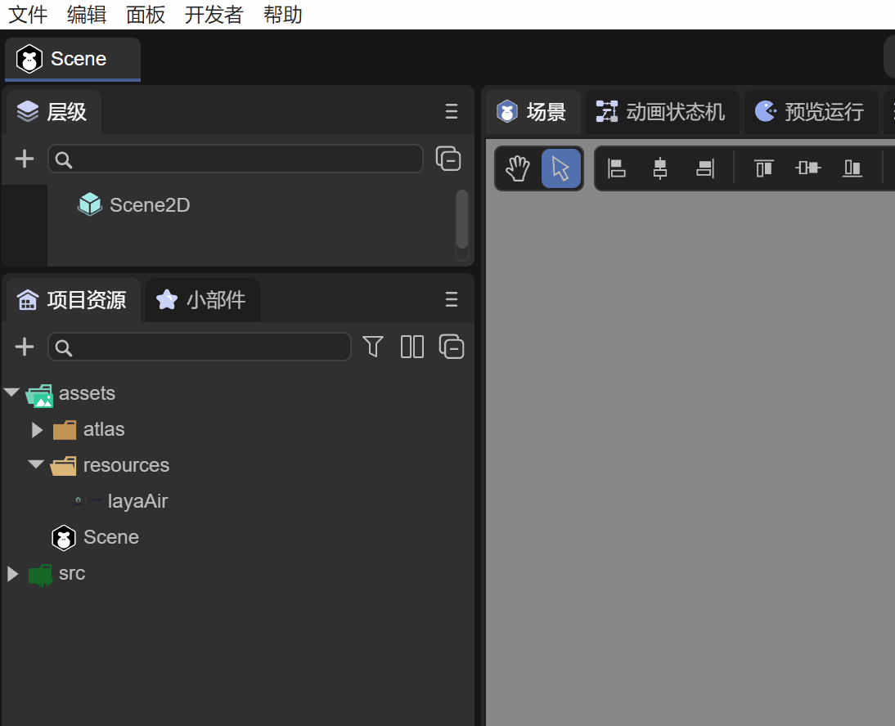
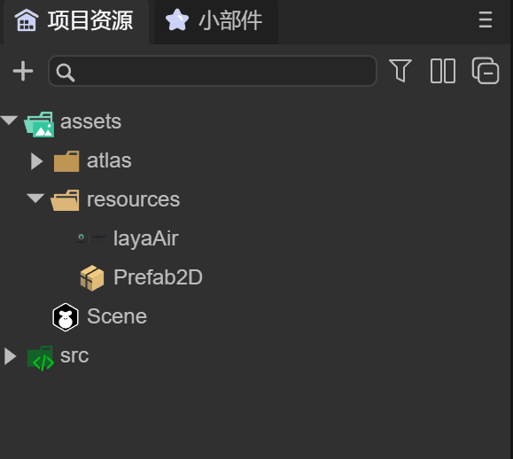
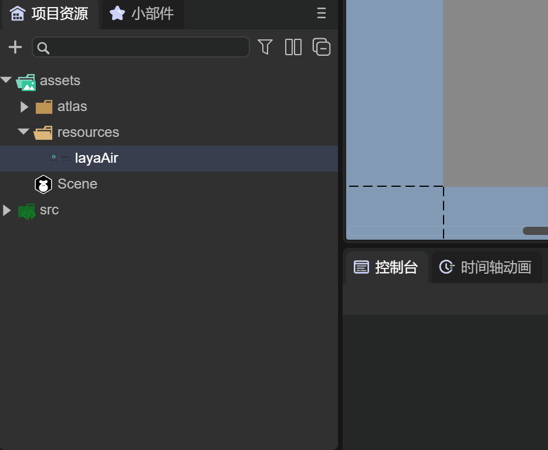
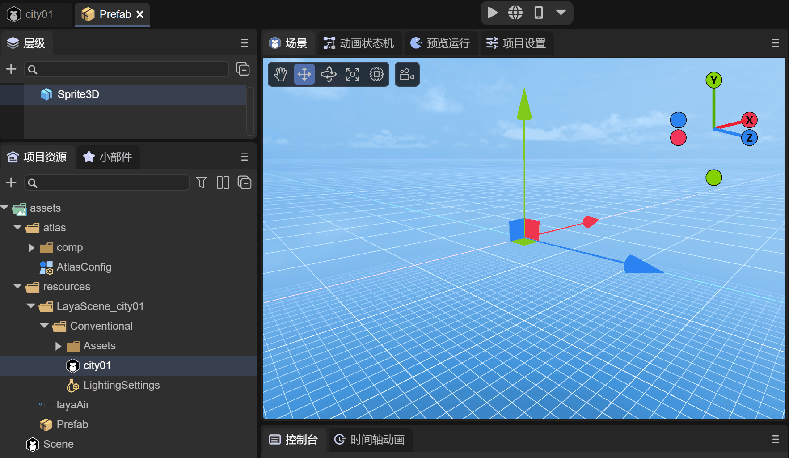
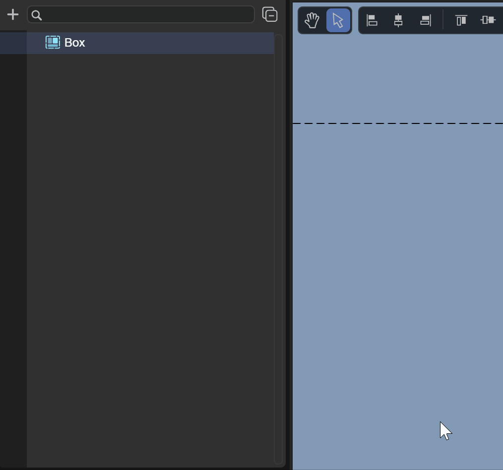
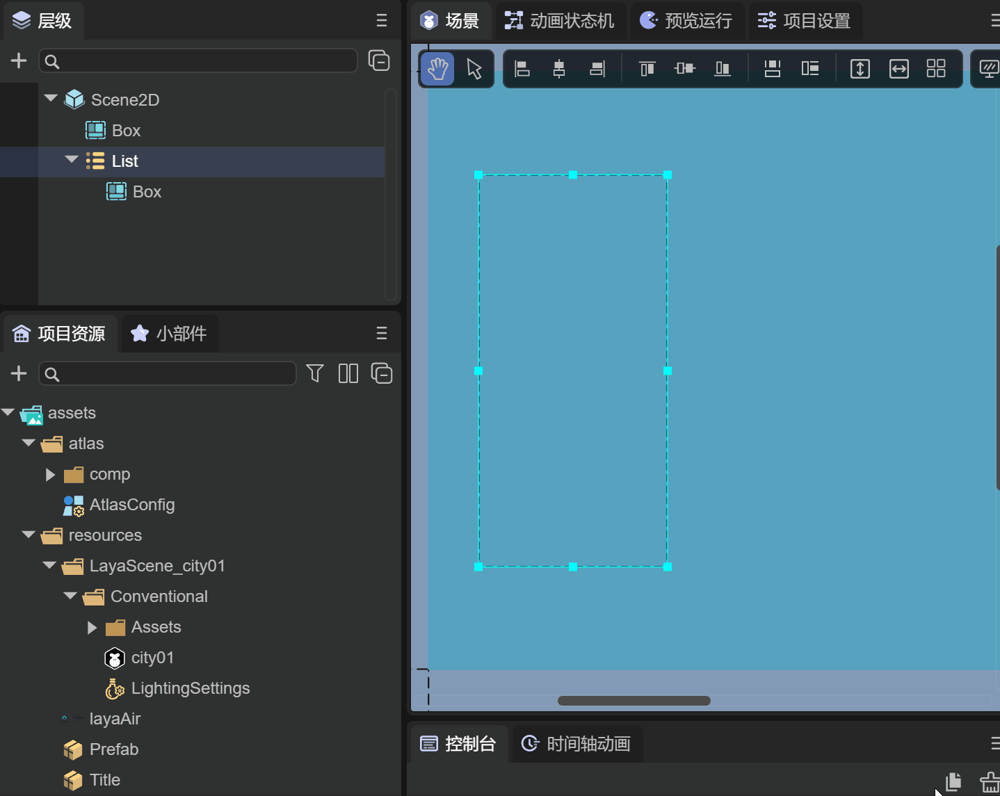
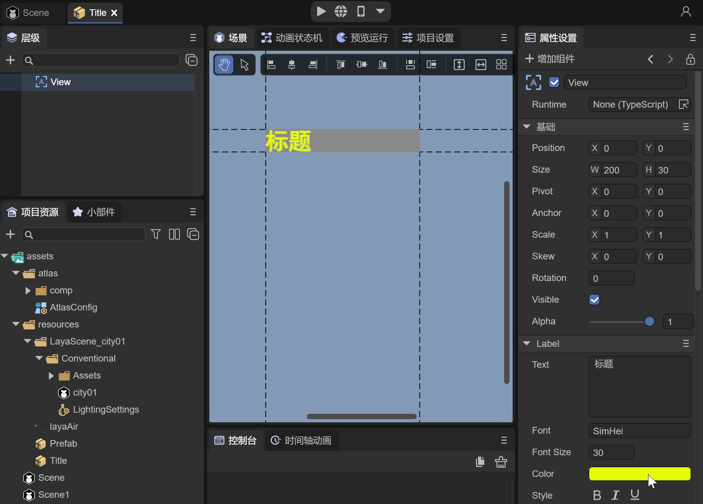
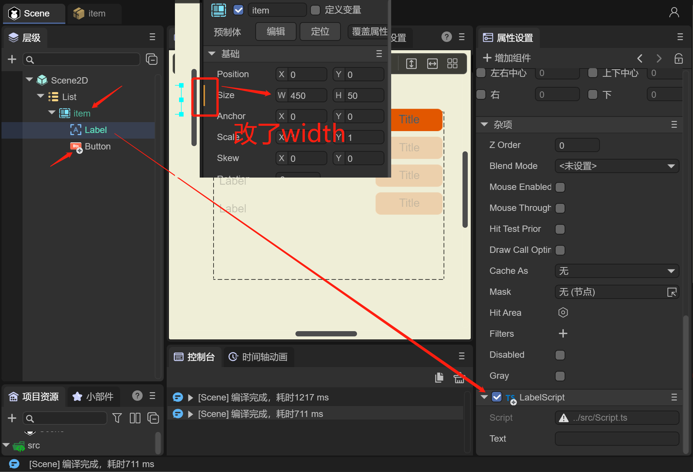
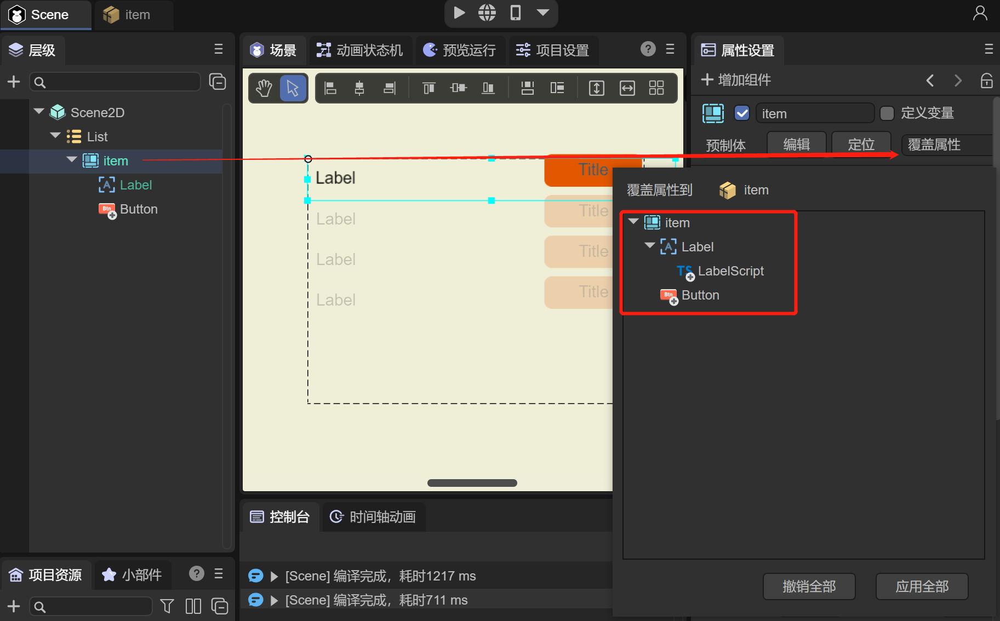
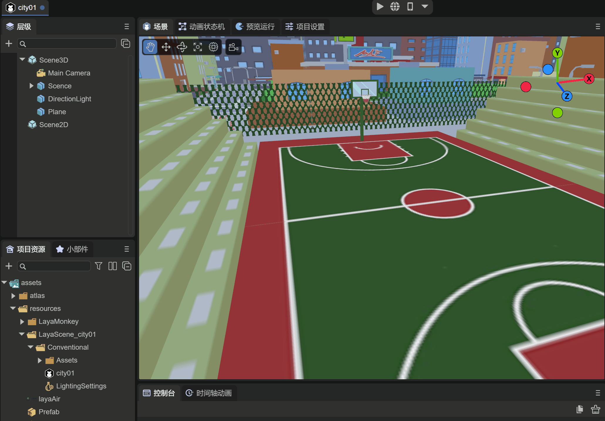

# Prefab Module


## 1. Overview

During project development, situations like the following often occur:

(1) At the project initiation stage, the art department defines a series of standard font colors and font sizes for application in various UIs. One day, the art department suddenly decides to change the default font color and font size. UI producers then need to modify all interfaces, which is very troublesome. **In such cases, using prefabs can easily handle this. By modifying only one place, it can affect the entire project.**

(2) Different 2D interfaces have the same local layout, and it is hoped that by modifying it once, the same layout in multiple interfaces will change together. **In such cases, using prefabs can easily cope with it.**

(3) In 3D project development, certain objects that are reused in the same scene or different scenes, such as models, textures, animations, etc., are all set up. We hope that when using them, they can be loaded with code directly. **In such cases, only by using prefabs can it be achieved.**

For similar demands as above, LayaAirIDE provides 2D prefabs and 3D prefabs. Next, this article will introduce how to use these two types of prefabs.


## 2. Creation in the IDE

The process of creating prefabs can only be completed in the IDE. Usually, after creating a prefab, the file has a suffix of ".lh". This section introduces how to create prefabs (2D) and prefabs (3D) in the IDE

### 2.1 Creating Prefabs (2D)

Prefabs (2D) are used in the development process of 2D interfaces, usually for repeatedly used 2D components, local interfaces, etc.

As shown in Animated GIF 2-1, under the assets of the project resources in the IDE, developers can select the directory where they want the prefab to be stored. In this directory, right-click and create Prefab (2D) in the menu

 

(Animated GIF 2-1)

After creating the prefab, developers usually need to rename it so that the function of the prefab can be identified by the name, as shown in Animated GIF 2-2

 

(Animated GIF 2-2)

Click on the Title prefab, and you can see that there is a root node "Box", as shown in Figure 2-3

 

(Figure 2-3)

Developers can create 2D components under Box or convert the Box node into other 2D components for use. We will introduce this in detail later


### 2.2 Creating Prefabs (3D)

The process of creating a Prefab 3D is the same as that of Prefab 2D, as shown in Animated GIF 2-4

  

(Animated GIF 2-4)

The difference is that when double-clicking to open Prefab 3D, the root node is "Sprite3D", which is the 3D sprite object we need to create. At the same time, the right side of Figure 2-5 is the default IDE scene with the skybox provided by the IDE

 

(Figure 2-5)


### 2.3 Modifying the Prefab Editing Scene

Developers can change the editing scene of the 3D prefab in the following way, as shown in Animated GIF 2-6

 

(Animated GIF 2-6)

For example, we have a 3D city scene. In the project settings of the IDE, click the Edit option. In the Prefab Editing Scene, drag in the 3D city scene file. At this time, when looking at the scene window of the prefab again, you can see that the scene has changed to the 3D city. In this case, it is more convenient for developers to make 3D prefabs more flexibly in the scene


## 3. Using Prefabs

### 3.1 2D Prefabs

In the first section, it was mentioned that during the development process, many interfaces use fonts similar to the title. Developers are best to implement this through prefabs. When there is a demand to change the font of all interface titles, only one modification to the prefab is needed.

#### 3.1.1 Converting Node Types

Since the default root node of the created prefab is Box, if the title is created under Box, then this Box node is redundant. If a large number of titles are created in the interface, many Boxes will be created, which is strongly not recommended considering performance. Therefore, we hope to use the node conversion to change Box to the Label component. As shown in Animated GIF 3-1

 

(Animated GIF 3-1)


#### 3.1.2 Setting the Font

Next, there is no need to introduce the production process of the title here. As shown in Figure 3-2, we temporarily create a yellow 30-point bold font as the title and rename it to Title


(Figure 3-2)


#### 3.1.3 Using Prefabs in the IDE

When the prefab is made, it can be dragged into the interface we want to use in the IDE, as shown in Animated GIF 3-3

 

(Animated GIF 3-3)

There is a List in the scene. We hope that there will be a title in the item. We drag the Title prefab under the Box of the List as the Label title of the item of the List. It can be seen that in the node, the Label name color is green, indicating that this node is a prefab node. Of course, all nodes under this node will be green.


#### 3.1.4 Modifying Prefab Properties

When the demand is to change all the titles to red, that is, by modifying once, multiple interfaces change together. Then only the color of the text needs to be modified in the Title prefab, as shown in Animated GIF 3-4

 

(Animated GIF 3-4)

After modifying the prefab, the modification effect can be seen in the scene interface using the prefab. Of course, the effect can also be directly run in the prefab interface. When developers finish editing and close the prefab interface, remember to save the prefab file, otherwise, when opening this prefab next time, the previous changes will be lost.

New UI components can also be added to the prefab. Similarly, the newly added UI components in the scene are synchronized. This is not shown here. Developers can try it themselves.

> Note: Any scripts added on UI components can also be synchronized to the scene, but the runtime class under the prefab cannot be synchronized


#### 3.1.5 Overriding Prefab Properties

If we operate the prefab node in the scene, such as adding a new UI component, modifying the properties of the UI component, and attaching a script to the UI component, as shown in Figure 3-3

 

(Figure 3-3)

For example, there is an item node in the List under the scene that is a prefab. We have made several changes under the List, which are marked in Figure 3-3

- Added the LabelScript script to the Label component (marked with a "+" sign)

- Modified the width property of the item node (indicated by a yellow line in the property setting panel)

- Added the Button component (marked with a "+" sign)

These modifications can also be overwritten to the prefab. Let's see how to operate. As shown in Figure 3-4

 

(Figure 3-4)

Click on the item node, and in the property panel on the right, click the `Override Properties` button to open the operation panel of `Override Properties to item`

Since there were three operations before, when we click on item, LabelScript, and Button, we can see, as shown in Figure 3-8

 

(Figure 3-8) 

The IDE records these three modification operations. We can `Undo` or `Apply` each item separately, or directly `Undo All` or `Apply All`

After clicking Apply or Apply All for each operation, when returning to the item prefab window, the three modifications will be updated and saved to the prefab, as shown in Figure 3-9

 

(Figure 3-9) 

Through the above operations, using the method of overriding prefab properties can also achieve the effect of modifying the prefab.


> Note: If the prefab sets a relative layout, then when using this prefab object on the scene, the relative layout on the scene cannot be set to null (it is not allowed by the IDE to uncheck or force the code to set it to null, and it is also useless). It is based on the relative layout in the prefab. 
>
> However, if the relative layout value is modified in the scene, it is based on the settings in the scene. For example, the top of the prefab is set to 10, and when the prefab is used in the scene, the top is changed to 20. Then during runtime, the scene takes 20 as the benchmark.


#### 3.1.6 Using Prefabs in Code

Adding prefabs through code is as simple as using a component. As shown in Figure 3-5, we hope to put the Title prefab under the Box

 

(Animated GIF 3-5)

The sample code is as follows:

```typescript
const { regClass, property } = Laya;

@regClass()
export class ScriptA extends Laya.Script {
    //declare owner : Laya.Sprite3D;

    @property( { type: Laya.Box } )
    private box: Laya.Box;
    
    constructor() {
        super();
    }
    
    onStart(): void {
    
        //Load the prefab file
        Laya.loader.load("resources/Title.lh").then( (res)=>{
            //Create the prefab
            let label: Laya.Label = res.create();
            //Add the prefab Label font to the box node
            this.box.addChild( label );
        } );
    }
}
```

The running effect is shown in Figure 3-6

 

(Figure 3-6)


### 3.2 3D Prefabs

The usage process of 3D prefabs is the same as that of 2D prefabs. Here we will not introduce how to make prefabs. Let's take a look at the usage effect of 3D prefabs through the following examples

#### 3.2.1 Use in the IDE

Suppose we have created a 3D prefab and made LayaMonkey by adding components such as models, materials, animation state machines, etc., as shown in Figure 3-7

 

(Figure 3-7)


At this time, the made LayaMonkey can be dragged into any scene, as shown in Animated GIF 3-8

 

(Animated GIF 3-8)


#### 3.2.2 Use in Code

Using 3D prefabs through code is the most common way. Often, enemies in game battles are constantly created through code. Like the situation of dragging LayaMonkey in the IDE mentioned above, let's implement it with code as follows:

```typescript
const { regClass, property } = Laya;

@regClass()
export class Main extends Laya.Script {

    @property( { type : Laya.Camera } )
    private camera: Laya.Camera;  
    @property( { type : Laya.Scene3D } )
    private scene: Laya.Scene3D;
    
    onStart() {
        console.log("Game start");
        //Load the prefab file
        Laya.loader.load("resources/Prefab.lh").then( (res)=>{
            //Create the prefab
            let monkey: Laya.Sprite3D = res.create();
            //Add the prefab to the scene
            this.scene.addChild( monkey );
            monkey.transform.position = new Laya.Vector3(-28.9354,0.3,-63.20264);
        } );
    }
}

```

The running effect is shown in Animated GIF 3-9

 

(Animated GIF 3-9)


## 4. Preloading Prefabs

During the development process, we will implement various functions by creating a large number of prefabs. Therefore, a prefab can also be understood as a collection of resources. When loading prefab files through code, the associated resources can also be loaded together. Therefore, during the project startup loading process, all prefabs can be loaded first, just like preloading scenes. The engine will load the associated resources together.

In the 2D beginner sample code of LayaAir, it can be seen that the implementation code for preloading a group of prefabs is as follows:

```typescript
import { LoadingRTBase } from "./LoadingRT.generated";

const { regClass, property } = Laya;
@regClass()
export default class LoadingRT extends LoadingRTBase {
    onAwake(): void {
        Laya.loader.load(
            // First load the ones needed for this scene
            ["resources/UI/image.png", "resources/UI/progress.png", "resources/UI/progress$bar.png"]
        ).then(() => {
            let resArr: Array<any> = [

                { url: "resources/prefab/uiDemo/useUI/ChangeTexture.lh", type: Laya.Loader.HIERARCHY },
                { url: "resources/prefab/uiDemo/useUI/MouseThrough.lh", type: Laya.Loader.HIERARCHY },
                { url: "resources/prefab/uiDemo/useUI/PhysicalCollision.lh", type: Laya.Loader.HIERARCHY },
                { url: "resources/prefab/uiDemo/useUI/Progress.lh", type: Laya.Loader.HIERARCHY },
                { url: "resources/prefab/uiDemo/useUI/TextShow.lh", type: Laya.Loader.HIERARCHY },
                { url: "resources/prefab/uiDemo/page/IframeElement.lh", type: Laya.Loader.HIERARCHY },
                { url: "resources/prefab/uiDemo/page/UsePanel.lh", type: Laya.Loader.HIERARCHY },
                { url: "resources/prefab/uiDemo/list/BagList.lh", type: Laya.Loader.HIERARCHY },
                { url: "resources/prefab/uiDemo/list/ComboBox.lh", type: Laya.Loader.HIERARCHY },
                { url: "resources/prefab/uiDemo/list/LoopList.lh", type: Laya.Loader.HIERARCHY },
                { url: "resources/prefab/uiDemo/list/MailList.lh", type: Laya.Loader.HIERARCHY },
                { url: "resources/prefab/uiDemo/list/Refresh.lh", type: Laya.Loader.HIERARCHY },
                { url: "resources/prefab/uiDemo/list/TreeBox.lh", type: Laya.Loader.HIERARCHY },
                { url: "resources/prefab/uiDemo/list/TreeList.lh", type: Laya.Loader.HIERARCHY },
                { url: "resources/prefab/uiDemo/animation/AtlasAni.lh", type: Laya.Loader.HIERARCHY },
                { url: "resources/prefab/uiDemo/animation/FrameAni.lh", type: Laya.Loader.HIERARCHY },
                { url: "resources/prefab/uiDemo/animation/SkeletonAni.lh", type: Laya.Loader.HIERARCHY },
                { url: "resources/prefab/uiDemo/animation/TimelineAni.lh", type: Laya.Loader.HIERARCHY },
                { url: "resources/prefab/uiDemo/animation/TweenAni.lh", type: Laya.Loader.HIERARCHY },
                { url: "resources/prefab/uiDemo/interactive/Astar.lh", type: Laya.Loader.HIERARCHY },
                { url: "resources/prefab/uiDemo/interactive/Joystick.lh", type: Laya.Loader.HIERARCHY },
                { url: "resources/prefab/uiDemo/interactive/ShapeDetection.lh", type: Laya.Loader.HIERARCHY },
                { url: "resources/prefab/uiDemo/interactive/tiledMap.lh", type: Laya.Loader.HIERARCHY },

                { url: "resources/prefab/Bullet.lh", type: Laya.Loader.HIERARCHY },
                { url: "resources/prefab/closeBtn.lh", type: Laya.Loader.HIERARCHY },
                { url: "resources/prefab/ComboList.lh", type: Laya.Loader.HIERARCHY },
                { url: "resources/prefab/defaultButton.lh", type: Laya.Loader.HIERARCHY },
                { url: "resources/prefab/defaultLabel.lh", type: Laya.Loader.HIERARCHY },
                { url: "resources/prefab/DropBox.lh", type: Laya.Loader.HIERARCHY },
                { url: "resources/prefab/LoopImg.lh", type: Laya.Loader.HIERARCHY },
                { url: "resources/prefab/role.lh", type: Laya.Loader.HIERARCHY },

                { url: "resources/prefab/ani/cd.lh", type: Laya.Loader.HIERARCHY },
                { url: "resources/prefab/ani/refresh.lh", type: Laya.Loader.HIERARCHY },

            ];


            // The load of 3.0 can load 2D and 3D resources simultaneously
            Laya.loader.load(resArr, null, Laya.Handler.create(this, this.onLoading, null, false)).then(() => {
                // After loading is completed, processing logic
                this.progress.value = 0.98;
                console.log("Loading completed", this.progress.value);
                // There are too few things preloaded. To delay for one second for local viewing effect, real projects do not need to delay
                Laya.timer.once(1000, this, () => {
                    // Jump to the entrance scene
                    Laya.Scene.open("Scenes/Index.ls"); // Do not use Laya.Scene.open("./Scenes/Index.ls");
                });

            });

            // Listen for loading failures
            Laya.loader.on(Laya.Event.ERROR, this, this.onError);
        });
    }

    /**
     * Print an error when there is an error
     * @param err Error message
     */
    onError(err: string): void {
        console.log("Loading failed: " + err);
    }

    /**
     * Listen during loading
     */
    onLoading(progress: number): void {
        // When approaching the completion of loading, make the display progress a little slower than the actual progress. This is reserved for the automatic loading when opening the scene, especially when there are many scene resources to be opened and not all are placed in the preload, and some need to be automatically loaded again.
        if (progress > 0.92) this.progress.value = 0.95;
        else this.progress.value = progress;
        console.log("Loading progress: " + progress, this.progress.value);
    }
}
```

Through the above code, it can be seen in the debugging tool of the browser that the engine will load all the resources of the prefabs.