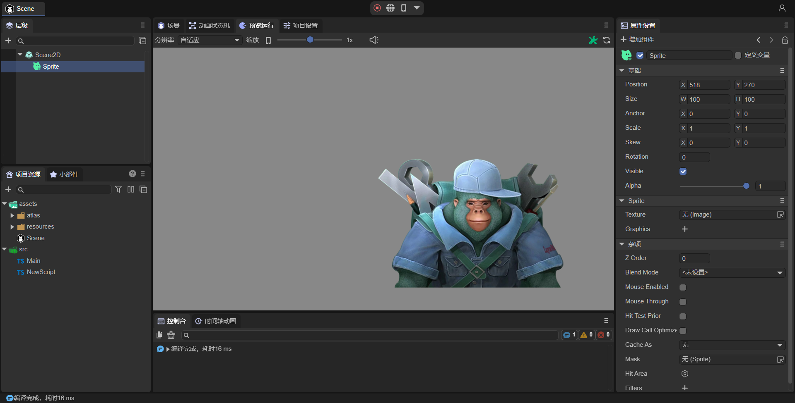
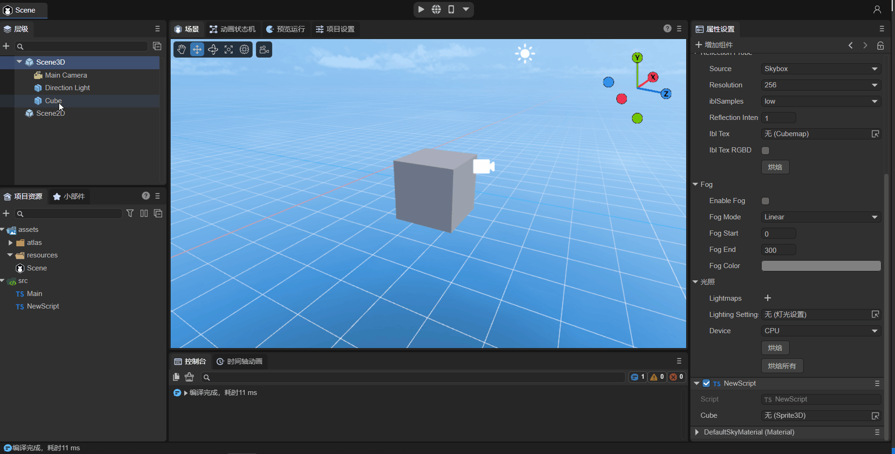

# Code Usage of Component Properties

The addition and recognition of components have been introduced in the previous article [ "Component Decorator Description" ](../decorators/readme.md). This subsection further helps everyone understand the basics of component-based development through several usage examples of common types of properties.

## 1. Node Type Method

LayaAir is divided into 2D node and 3D node types. When set to 2D node Laya.Sprite, 3D nodes cannot be used as its property value. When set to 3D node Laya.Sprite3D, 2D nodes cannot be used as its property value.

### 1.1 Usage of 2D Nodes

First, as shown in Animation 1-1, drag the already added 2D node Sprite in the scene into the property exposed by @property, and in this way, the node is obtained.


(Animation 1-1)

Then the properties of the node can be changed using code in the script. For example, add texture to the Sprite. The sample code is as follows:

```typescript
const { regClass, property } = Laya;

@regClass()
export class NewScript extends Laya.Script {

    @property({ type : Laya.Sprite})
    public spr: Laya.Sprite;
    
    onAwake(): void {
        this.spr.size(512, 313); // Set the size of the Sprite
        this.spr.loadImage("atlas/comp/image.png"); // Add texture
    }

}
```

The effect is shown in Figure 1-2:



(Figure 1-2)


### 1.2 Basic Usage of 3D Nodes

First, as shown in Animation 1-3, drag the already added 3D node Cube in the scene into the property exposed by @property, and in this way, the node is obtained.



(Animation 1-3)

Then the properties of the node can be changed using code in the script. For example, the Cube can be rotated around itself. The sample code is as follows:

```typescript
const { regClass, property } = Laya;

@regClass()
export class NewScript extends Laya.Script {

    @property({ type : Laya.Sprite3D})
    public cube: Laya.Sprite3D;
    
    private rotation: Laya.Vector3 = new Laya.Vector3(0, 0.01, 0);
    
    onStart() {
        Laya.timer.frameLoop(1, this, ()=> {
            this.cube.transform.rotate(this.rotation, false);
        });
    }
}
```

The effect is shown in Animation 1-4:


(Animation 1-4)


### 1.3 Advanced Usage of 3D Nodes

```typescript
    @property( { type :Laya.Sprite3D } ) // Node type
    public p3d: Laya.Sprite3D;

    onAwake(): void {
    
        this.p3d.transform.localPosition = new Laya.Vector3(0,5,5);
        let p3dRenderer = this.p3d.getComponent(Laya.ShurikenParticleRenderer);
        p3dRenderer.particleSystem.simulationSpeed = 10;
    }
```

By exposing the @property( { type :Laya.Sprite3D } ) node type property and dragging in the particle node, the particle node object can be obtained. The transform can be directly modified, while the simulationSpeed property is obtained through getComponent(Laya.ShurikenParticleRenderer).particleSystem.


## 2. Usage of Component Type

```typescript
    @property( { type : Laya.ShurikenParticleRenderer } ) // Component type
    public p3dRenderer: Laya.ShurikenParticleRenderer;

    onAwake(): void {
    
        (this.p3dRenderer.owner as Laya.Sprite3D).transform.localPosition = new Laya.Vector3(0,5,5);
        this.p3dRenderer.particleSystem.simulationSpeed = 10;
    }
```

By exposing the @property( { type : Laya.ShurikenParticleRenderer } ) component type property and dragging in the particle node, the ShurikenParticleRenderer component of the particle can be obtained. The transform can be modified through (this.p3dRenderer.owner as Laya.Sprite3D), while the simulationSpeed property is obtained through this.p3dRenderer.particleSystem.

> Laya.ShuriKenParticle3D cannot be directly used as the property type because it cannot be recognized by the IDE. Only node and component types can be recognized.
>
> Even if the type is set to Laya.Sprite3D, although the IDE marks the property as a Sprite3D node, it cannot be converted to a Laya.ShuriKenParticle3D object.


## 3. Prefab Type Properties

When using Laya.Prefab as a property, for example:

```typescript
@property( { type : Laya.Prefab } ) // Object for loading Prefab
private prefabFromResource: Laya.Prefab;
```

At this time, it is necessary to drag the prefab resource from the assets directory as shown in Animation 3-1. At runtime, the loaded instantiated prefab will be directly obtained.


(Animation 3-1)