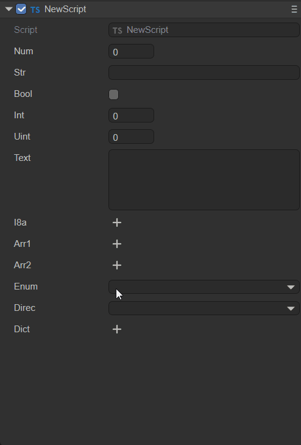
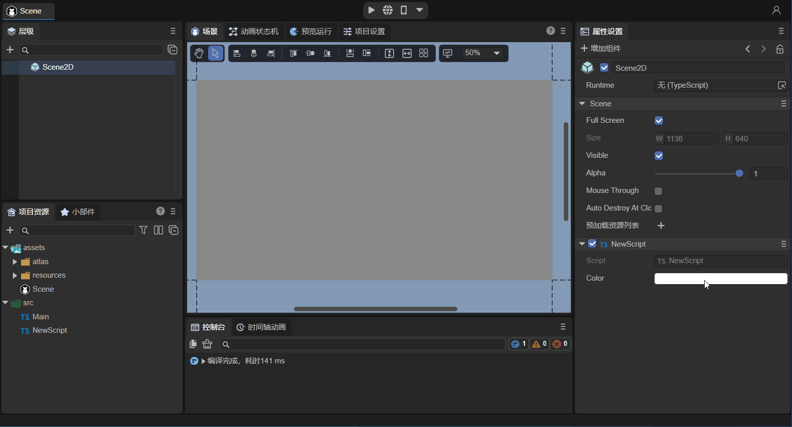
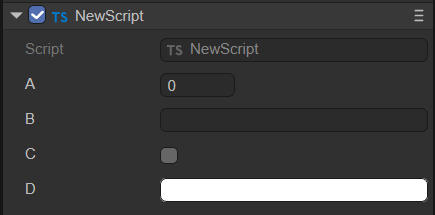
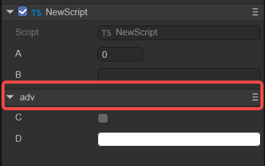
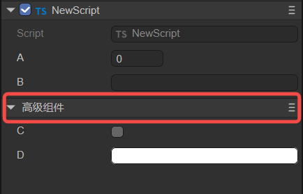
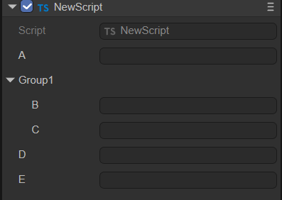

# Component Decorator Description

In LayaAir-IDE, if you want to display the properties of the component script within the IDE, it needs to be achieved through the rules of decorators. When developers consult this document, they can first learn the [ "Entity Component System" ](../../../basics/common/Component/readme.md) document. The following introduces four types of decorators respectively.

## 1. @regClass()

For the component scripts written by developers, the decorator identifier `@regClass()` needs to be used before the class definition. The sample code is as follows:

```typescript
const { regClass } = Laya;

@regClass()
export class Script extends Laya.Script {
}
```

As shown in the animation 1-1, only with the above decorator identifier, the custom component script defined by the developer will be recognized by the IDE as a component and can be added by the `Property Settings Panel -> Add Component -> Custom Component Script` of the node (entity).


(Animation 1-1)

> Only one class in a TS file can use @regClass().
>
> The classes marked with @regClass() will be compiled within the IDE environment. However, during final publishing, if this class is not referenced by other classes, not added to the node, or the prefab/scene it is in is not published, this class will be trimmed.


## 2. @property()

### 2.1 Regular Use of Component Properties

When developers want to expose the properties of the component to the outside world through the IDE for editing and data input. The decorator identifier `@property()` needs to be used before the class property definition. The sample code is as follows:

```typescript
const { regClass, property } = Laya;

@regClass()
export class NewScript1 extends Laya.Script {
    // Standard writing of decorator properties, suitable for complete functional requirements such as displaying Tips or Chinese aliases for properties in the IDE
    @property({ type: String, caption: "Alias for display in the IDE", tips: "This is a text object, only text can be entered" }) 
    public text1: string = "";

    // Shortened way of writing decorator property types, suitable for the requirement of only defining types
    @property(String)   
    public text2: string = "";
    
    constructor() {
        super();
    }
}
```
`@property()` is the decorator identifier recognized by the IDE for component properties and displayed on the IDE property panel, and the type is a parameter that the decorator property identifier must carry.

If we do not need to write a tips description for the property or redefine an alias displayed in the IDE for the property, etc. Then the shortened way as shown in the above example is sufficient.

> If there is a syntax warning for the shortened way, please use the new version of the IDE and solve it through the `Developer -> Update Engine d.ts File` function of the IDE, or use the standard writing to solve it.

### 2.2 Decorator Use for Property Accessors

Sometimes, developers control the read and write behavior of properties through property accessors (getters) and property setters.

When both the property accessor and the property setter exist, the decorator property identifier `@property()` is directly used before the property accessor. At this time, the component property is the same as the regular usage method introduced in the previous subsection, and it is both readable and writable.

If the script only has a property accessor, then this property is read-only and can only be displayed in the IDE but not edited.

The sample code for the use of the decorator when both the getter and the setter exist is as follows:

```typescript
const { regClass, property } = Laya;

@regClass()
class Animal {
    private _weight: number = 0;
    
    @property( { type : Number } )
    get weight() : number {
        return this._weight;
    }
    
    set weight(value: number) {
        this._weight = value;
    }
}
```


### 2.3 Whether to Serialize and Save

After defining as a component property through the decorator, by default, both the property name and value will be serialized and saved in the scene file or prefab file where the component is added. For example, after adding the custom component in scene.ls, open this scene.ls through vscode, and you can find the component property names and values serialized and saved, as shown in the animation 2-1.


(Animation 2-1)

Serializing and saving not only makes it convenient to view and edit component property values intuitively in the IDE. During the running stage, the serialized stored values can also be directly used. For complex data structures, directly using the serialized values can also save the overhead caused by generating the data structure. Therefore, sometimes, even if it is not necessary to display and edit on the property panel, it can also be set as a component property through the decorator and the value can be serialized and stored in the scene or prefab file.

However, sometimes our component properties are only for convenience in understanding and adjustment in the IDE. When used, these values are actually not needed. Therefore, control over whether to serialize and save is also provided. When defining the decorator property, **If the serializable parameter in the object parameter is set to false, the property will not be serialized**.

For example, the developer's requirement is to serialize and save the radian value, but the radian value is not intuitive when adjusting the value manually. At this time, the angle value can be directly entered in the IDE but not saved, and only the converted radian value is stored. The sample code is as follows:

```typescript
const { regClass, property } = Laya;

@regClass()
export class Main extends Laya.Script {
    @property({ type: Number })
    _radian: number = 0;  // Properties with an underscore are not displayed in the IDE by default and are only used to store the entered radian
    
    @property({ type: Number, caption: "Angle", serializable: false }) // Here, serializable is set to false, so degree will not be saved in the scene file
     get degree() {
        return this._radian * (180 / Math.PI);// Since it is not serialized, the stored radian in _radian needs to be calculated back to the angle for display in the IDE property panel
    }
    set degree(value: number) {
        this._radian = value * (Math.PI / 180);// Convert the entered angle value to a radian and store it in _radian.
    }
    
    onStart() {
        console.log(this._radian); 
    }
}
```


### 2.4 Whether Component Properties Are Displayed in the IDE

By default, the decorator property rule only marks non-underscore class properties as component properties of the IDE.

For properties with an underscore, they are actually not displayed in the IDE. At this time, the value of this component property is only to save the value to the scene file. This has been mentioned above and has been applied in the examples.

> If there is no requirement for serializing and saving to the scene file for properties with an underscore, there is no need to use decorators.

If developers want to display properties with an underscore in the IDE as well, it can be achieved. Set the parameter private to false in the passed object of the modifier property identifier.

The sample code is as follows:

```typescript
@property({ type: "number", private: false })
_velocity: number = 0;
```

The private parameter can not only display underscore properties but also make non-underscore properties not appear in the IDE property panel by setting private to true.

Here, we slightly modify the radian conversion example from the previous text. The code is as follows:

```typescript
const { regClass, property } = Laya;

@regClass()
export class Main extends Laya.Script {
    @property({ type: Number, private: true })
    radian: number = 0;  // After setting private to true, radian will not appear in the IDE property panel and is only used to store the entered radian
    
    @property({ type: Number, caption: "Angle", serializable: false }) // Here, serializable is set to false, so degree will not be saved in the scene file
     get degree() {
        return this.radian * (180 / Math.PI);// Since it is not serialized, the stored radian in radian needs to be calculated back to the angle for display in the IDE property panel
    }
    set degree(value: number) {
        this.radian = value * (Math.PI / 180);// Convert the entered angle value to a radian and store it in radian.
    }
    
    onStart() {
        console.log(this.radian); 
    }
}
```


### 2.5 Types of Decorator Property Identifiers

The types of decorator property identifiers support engine object types (such as: Laya.Vector3, Laya.Sprite3D, Laya.Camera, etc.), custom object types (requiring marking `@regClass()`), and basic types of the TS language.

#### 2.5.1 Engine Object Types

The understanding of engine object types is relatively simple. After exposing the component property, directly pass in the value of the corresponding type. For example, for Laya.Sprite3D, only 3D nodes can be passed in. Trying to drag in 2D nodes or resources is prohibited.

The common usage examples of engine object types are as follows:

```typescript
const { regClass, property } = Laya;

@regClass()
export class Main extends Laya.Script {

    @property( { type:Laya.Camera } ) // Camera type
    private camera: Laya.Camera;  
    
    @property( { type:Laya.Scene3D } ) // 3D scene root node type
    private scene3D: Laya.Scene3D;
    
    @property( { type:Laya.DirectionLightCom } ) // DirectionLight component type
    private directionLight: Laya.DirectionLightCom;
    
    @property( { type:Laya.Sprite3D } ) // Sprite3D node type
    private cube: Laya.Sprite3D;  
    
    @property( { type:Laya.Prefab } ) // Object obtained by loading Prefab
    private prefabFromResource: Laya.Prefab;    
    
    @property( { type:Laya.ShurikenParticleRenderer } ) // ShurikenParticleRenderer component type
    private particle3D: Laya.ShurikenParticleRenderer;  
    
    @property( { type:Laya.Node } ) // Node type
    private scnen2D: Laya.Node; 
    
    @property( { type:Laya.Box } ) // Obtain Box component
    private box: Laya.Box; 
    
    @property( { type:Laya.List } ) // Obtain List component
    private list: Laya.List; 
    
    @property( { type:Laya.Image } ) // Obtain Image component
    private image: Laya.Image; 
    
    @property( { type:Laya.Label } ) // Obtain Label component
    private label: Laya.Label; 
    
    @property( { type:Laya.Button } ) // Obtain Button component
    private button: Laya.Button; 
    
    @property( { type:Laya.Sprite } ) // Obtain Sprite component
    private sprite: Laya.Sprite; 
    
    @property( { type:Laya.Animation } ) // Obtain Animation component
    private anmation: Laya.Animation; 
    
    @property( { type:Laya.Vector3 } ) // Laya.Vector3 type
    private vector3 : Laya.Vector3;
}
```

As shown in the animation 2-2, drag the already added Image in the scene into the Image property exposed by @property, and in this way, the node is obtained, and then the properties of Image can be controlled by code in the script.

> For code usage of properties, refer to [ "Code Usage of Component Properties" ](../componentProperties/readme.md).


(Animation 2-2)


#### 2.5.2 Custom Object Types

Custom object types refer to setting a custom imported object. Expose the component property according to the decorator property identifier of this object.

For example, the following two TS codes:

```typescript
//MyScript.ts
const { regClass, property } = Laya;

import Animal from "./Animal";

@regClass()
export class MyScript extends Laya.Script  {
    @property({ type : Animal })
    animal : Animal;
}
```

```typescript
//Animal.ts
const { regClass, property } = Laya;

@regClass()
export default class Animal {
    @property({ type : Number })
    weight : number;
}
```

The component script MyScript references the Animal object and sets the type of the decorator property identifier to Animal. Although Animal is not a component script inherited from Laya.Script, since it is referenced by the component script MyScript and exposed to the IDE, the class definition of Animal also needs to be marked with `@regClass()`, and the properties marked with `@property()` in this class can also appear in the IDE property panel.


#### 2.5.3 Basic Types of the TS Language

Finally, there are the commonly used basic types of the TS language. However, it should be noted that basic types need to be described using strings. Only numbers, strings, and boolean types can be marked using their object types.

| Type                         | Type Writing Demonstration                                   | Type Description                                             |
| ---------------------------- | ------------------------------------------------------------ | ------------------------------------------------------------ |
| Number Type                  | "number"                                                     | Can also be marked with Number for this type                 |
| Single-line String Text Type | "string"                                                     | Can also be marked with String for this type                 |
| Boolean Value Type           | "boolean"                                                    | Can also be marked with Boolean for this type                |
| Integer Type                 | "int"                                                        | Equivalent to { type: Number, fractionDigits: 0 }            |
| Positive Integer Type        | "uint"                                                       | Equivalent to { type: Number, fractionDigits: 0, min: 0 }    |
| Multi-line String Text Type  | "text"                                                       | Equivalent to { type: string, multiline: true }              |
| Any Type                     | "any"                                                        | The type will only be serialized and cannot be displayed or edited. |
| Typed Array Type             | Int8Array, Uint8Array,<br />Int16Array, Uint16Array,<br />Int32Array, Uint32Array, Float32Array | Supports 7 types of typed array types                        |
| Array Type                   | ["number"], ["string"]                                       | Use square brackets to contain the array element type        |

The usage example code is as follows:

```typescript
const { regClass, property } = Laya;

// Enumeration
enum TestEnum {
    A,
    B,
    C
};
// String-form Enumeration
enum Direction {
    Up = 'UP',
    Down = 'DOWN',
    Left = 'LEFT',
    Right = 'RIGHT'
};

@regClass()
export class Script extends Laya.Script {

    @property(Number)// Number type, equivalent to { type : "number" }
    num : number;
    
    @property(String)// Single-line string text type, equivalent to { type: "string"}
    str : string;
    
    @property(Boolean)// Boolean value type, equivalent to { type: "boolean"}
    bool : boolean;
    
    @property("int")// Integer type, equivalent to { type: Number, fractionDigits: 0 }
    int : number; 
    
    @property("uint") // Positive integer type, equivalent to { type: Number, fractionDigits: 0, min: 0 }
    uint : number; 
    
    @property("text")// Multi-line string text type, equivalent to { type: String, multiline: true }
    text : string; 
    
    @property("any")// Any type will only be serialized and cannot be displayed and edited.
    a : any; 
    
    @property(Int8Array)// Typed array type, in addition to Int8Array, Uint8Array, Int16Array, Uint16Array, Int32Array, Uint32Array, and Float32Array are also supported, and the usage is similar
    i8a: Int8Array;
        
    @property({ type: ["number"] })// Array type, use square brackets to contain the array element type
    arr1: number[];
    
    @property({ type: ["string"] })// Array type, use square brackets to contain the array element type
    arr2: string[];
    
    // Ordinary enumeration type (can be written in a shortened way), will be displayed as a dropdown box for users to select
    @property(TestEnum)
    enum: TestEnum;
    
    // String-form enumeration, cannot use the shortened way, such as: @property(Direction). Must use the standard writing as follows with the type parameter specified
    @property({ type: Direction })
    direc: Direction;
    
    // Dictionary type, an array parameter needs to be used to set the type. The Record type in the following example needs to be placed in a string as the first element of the array parameter, and the second element of the array parameter is the type of the dictionary input value, which is used to determine the input control type of the property panel
    @property({ type: ["Record", Number] })
    dict: Record<string, number>; 

}
```

The example effect is shown in the animation 2-3:



(Animation 2-3)


### 2.6 Input Controls for Component Property Values

The IDE has built-in input controls such as number (numeric input), string (string input), boolean (checkbox), color (color box + color palette + color picker), vec2 (XY input combination), vec3 (XYZ input combination), vec4 (XYZW input combination), asset (select resource), etc.

Under normal circumstances, the IDE will automatically select the corresponding property value input control based on the component property type.

However, in some cases, it is also necessary to forcibly specify the input control. For example, if the data type is string, but it actually represents a color, the default control for editing string is not suitable. In this case, you need to set the parameter inspector of the component property identifier to "color". The sample code is as follows:

```typescript
// Display as color input (if the type is Laya.Color, this definition is not required. If it is a string type, it is required)
@property({ type: String, inspector: "color"})
color: string;
```
> Note: The color obtained by the above method is the color value of the 2D component, such as: rgba(217, 232, 0, 1) 

The effect is shown in Animation 2-4:



(Animation 2-4)

If the inspector parameter is null, no property input control will be constructed for the property, which is different from setting the hidden parameter to true. Hidden being true means creating but being invisible, while inspector being null means not creating at all.


### 2.7 Component Property Classification and Sorting

The properties of the component will be displayed uniformly by default under the property classification column with the name of the component script, as shown in Figure 2-5:



(Figure 2-5)

If developers want to categorize certain properties within the component, it can be achieved through the object parameter of the decorator property identifier catalog. The sample code is as follows:

```typescript
    @property({ type : "number" })
    a : number;

    @property({ type: "string"})
    b : string;

    @property({ type: "boolean",catalog:"adv"})
    c : boolean;

    @property({ type: String, inspector: "color",catalog:"adv"})
    d: string;
```

As can be seen from the above code, when the same catalog name ("adv") is set for multiple properties (c and d), they will be classified according to the catalog name. The effect is shown in Figure 2-6:



(Figure 2-6)

If we want to give this classification another Chinese alias, it can be achieved through the parameter catalogCaption. The sample code is as follows (modify the d property in the above example):

```typescript
    @property({ type: String, inspector: "color",catalog:"adv", catalogCaption:"Advanced Component"})
    d: string;
```

The effect is shown in Figure 2-7:



(Figure 2-7)

When facing multiple component property classifications, we can also customize the display order of the columns through the parameter catalogOrder. The smaller the value, the earlier it is displayed. If not provided, it will be in the order of property appearance. The sample code is as follows:

```typescript
    @property({ type : "number", catalog:"bb", catalogOrder:1 })
    a : number;

    @property({ type: "string"})
    b : string;

    @property({ type: "boolean", catalog:"adv"})
    c : boolean;

    @property({ type: String, inspector: "color", catalog:"adv", catalogCaption:"Advanced Component", catalogOrder:0})
    d: string;
```

The effect is shown in Figure 2-8:


(Figure 2-8)

> For the property classification name catalogCaption and the property classification sort catalogOrder, configuration is only required in any property with the same catalog name. It is not necessary to configure all properties once.


### 2.8 Summary of Decorator Property Identifier Parameters

The parameter roles of the commonly used decorator property identifiers introduced above (in bold are those mentioned above), and here we summarize all the parameters.

| Parameter Name             | Parameter Usage Example                                                 | Description                                                         |
| ------------------ | ------------------------------------------------------------ | ------------------------------------------------------------ |
| name               | name: "abc"                                                  | Generally not required to be set                                  |
| **type**           | type: "string"                                               | The type of the input value that the component property can have. Refer to the introduction above.                       |
| **caption**        | caption: "Angle"                                              | Alias of the component property, commonly in Chinese. It can be not set. By default, the component property name will be used.     |
| **tips**           | tips: "This is a text object. Only text can be entered."      | Tips description of the component property, used to further describe the role and other uses of the property.         |
| **catalog**        | catalog:"adv"                                                | Set the same value for multiple properties to display them in the same column.         |
| **catalogCaption** | catalogCaption:"Advanced Component"                            | Alias of the property classification column. If not provided, the column name will be used directly.                 |
| **catalogOrder**   | catalogOrder:0                                               | The display order of the column. The smaller the value, the earlier it is displayed. If not provided, it will be in the order of property appearance. |
| **inspector**      | inspector: "color"                                           | Input control of the property value. Built-in ones include: number, string, boolean, color, vec2, vec3, vec4, asset |
| hidden             | hidden: "!data.a"                                            | True for hidden, false for displayed. A boolean value can be directly used, or an expression can be used. By putting the conditional expression in a string, the boolean type operation result is obtained.<br />In the string expression, data is a fixed-named variable, which is the data collection of all registered properties of the current type. All js syntax can be used in the expression, but engine-related types cannot be referenced, and global objects such as Laya cannot be used. |
| readonly           | readonly: "data.b"                                           | True for read-only. A boolean value can be directly used, or an expression can be used. By putting the conditional expression in a string, the boolean type operation result is obtained. (The format of the expression is the same as above) |
| validator          | validator: "if (value == data.text1) return 'Cannot be the same as the value of text1'" | An expression can be used and put in a string. For example, in the example, if the value entered in the IDE is the same as the value of text1, "Cannot be the same as the value of text1" will be displayed. |
| **serializable**   | serializable: false                                         | Control whether the component property is serialized and saved. True: serialized and saved, false: not serialized and saved |
| **multiline**      | multiline: true                                              | For string type, whether it is multi-line input. True: yes, false: no |
| password           | password: true                                               | Whether it is password input. True: yes, false: no. Password input will hide the entered content. |
| submitOnTyping     | submitOnTyping: false                                        | If set to true, each character input will be submitted once. If set to false, it will only be submitted once when the input is completed and the text input box loses focus by clicking elsewhere. |
| prompt             | prompt: "Text prompt information"                              | There will be a prompt message in the text box before entering the text. |
| enumSource         | enumSource: [{name:"Yes", value:1}, {name:"No",value:0}]     | The component property is displayed and input in the form of a dropdown box. |
| reverseBool        | reverseBool: true                                            | Reverse the boolean value. When the property value is true, the checkbox is displayed as unchecked. |
| nullable           | nullable: true                                               | Whether null values are allowed. The default is true. |
| **min**            | min: 0                                                       | For numeric types, the minimum value of the number. |
| max                | max: 10                                                      | For numeric types, the maximum value of the number. |
| range              | range: [0, 5]                                                | For numeric types, the component property is displayed and input in a range by a slider. |
| step               | step: 0.5                                                    | For numeric types, the minimum change precision value when the mouse slides or the wheel scrolls in the input box. |
| **fractionDigits** | fractionDigits: 3                                            | For numeric types, the number of decimal places reserved for the property value. |
| percentage         | percentage: true                                             | When the range parameter is set to [0,1], setting percentage to true will display as a percentage. |
| fixedLength        | fixedLength: true                                            | For array types, fix the array length and do not allow modification. |
| arrayActions       | arrayActions: ["delete", "move"]                             | For array types, it can limit the operations that the array can perform. If not provided, it means the array allows all operations. If provided, only the listed operations are allowed. The provided types are: "append", "insert", "delete", "move" |
| elementProps       | elementProps: { range: [0, 10] }                             | Applicable to array type properties. Here, the properties of the array elements can be defined. |
| showAlpha          | showAlpha: false                                             | For color types, it indicates whether the modification of the transparency a value is provided. True: provided, false: not provided. |
| defaultColor       | defaultColor: "rgba(217, 232, 0, 1)"                         | For color types, define a default color value when it is not null. |
| colorNullable      | colorNullable: true                                          | For color types, setting to true can display a checkbox to determine whether the color is null. |
| isAsset            | isAsset: true                                                | Indicates that this property references a resource. |
| assetTypeFilter    | assetTypeFilter: "Image"                                     | When it is a resource type, set the type of the loaded resource. |
| useAssetPath       | useAssetPath: true                                           | When the property type is string and resource selection is performed, this option determines whether the property value is the original path of the resource or in the format of res://uuid. The default is false. If it is true, it is the original path of the resource. Generally, it is not used because if the resource is renamed, the path will be lost. |
| position           | position: "before x"                                         | The default display order of the property is the order in which it appears in the type definition. Position can artificially change this order. The available sentence patterns are: "before x", "after x", "first", "last" |
| **private**        | private: false                                               | Control whether the component property is displayed in the IDE. False: displayed, true: not displayed. |
| addIndent          | addIndent:1                                                  | Increase the indentation. The unit is the level, note that it is not pixels. |
| onChange           | onChange: "onChangeTest"                                     | When the property changes, the function named onChangeTest is called. The function needs to be defined on the current component class. |

The code example is as follows (only the ones not introduced above are listed):

```typescript
    // Hidden control
    @property({ type: Boolean })
    a: boolean;
    @property({ type: String, hidden: "!data.a" })//Put the conditional expression!data.a in the string. If a is true (checked in the IDE), then!data.a returns false. At this time, the hidden property indicates display.
    hide: string = "";

    // Read-only control
    @property({ type: Boolean })
    b: boolean;
    @property({ type: String, readonly: "data.b" })//Put the conditional expression data.b in the string. If b is true (checked in the IDE), then data.b returns true. At this time, the readonly property indicates read-only.
    read: string = "";

    // Data checking mechanism
    @property(String)
    text1: string;
    @property({ type: String, validator: "if (value == data.text1) return 'Cannot be the same as the value of a'" })
    text2: string = "";

    // Password input
    @property({ type: String, password: true })
    password: string;

    // If true or default, the text input is submitted each time; otherwise, it is submitted only when it loses focus.
    @property({ type: String, submitOnTyping: false })
    submit: string;

    // Prompt information for input text
    @property({ type: "text", prompt: "Text prompt information" })
    prompt: string;

    // Display as dropdown box
    @property({ type: Number, enumSource: [{name:"Yes", value:1}, {name:"No",value:0}] })
    enumsource: number;

    // Reverse boolean value
    @property({ type: "boolean", reverseBool: true })
    reverseboolean : boolean;

    // Allow null values
    @property({ type: String, nullable: true })
    nullable: string;

    // Control the precision and range of numeric input
    @property({ type: Number, range:[0,5], step: 0.5, fractionDigits: 3 })
    range : number;

    // Display as percentage
    @property({ type: Number, range:[0,1], percentage: true })
    percent : number;

    // Fixed array length
    @property({ type: ["number"], fixedLength: true })
    arr1: number[];

    // Allowed operations of the array
    @property({ type: ["number"], arrayActions: ["delete", "move"] })
    arr2: number[];

    // Limit the maximum and minimum values when editing array elements
    @property({ type: [Number], elementProps: { range: [0, 100] } })
    array1: Array<Number>;
    // If it is a multi-dimensional array, elementProps also needs to be used in multiple layers.
    @property({ type: [[Number]], elementProps: { elementProps: { range: [0, 10] } } })
    array2: Array<Array<Number>>;

    // Do not provide modification of the transparency a value
    @property({ type: Laya.Color, showAlpha: false })
    color1: Laya.Color;

    // When it is a color type, defaultColor defines a default value when it is not null.
    @property({ type: String, inspector: "color", defaultColor: "rgba(217, 232, 0, 1)" })
    color2: string;

    // Display a checkbox to determine whether the color is null
    @property({ type: Laya.Color, colorNullable: true })
    color3: Laya.Color;

    // Load the Image resource type and set the resource path format
    @property({ type: String, isAsset: true, assetTypeFilter: "Image" })
    resource: string;

    // The x property appears before the testposition property
    @property({ type: String })
    x: string;
    // The position can be used to artificially arrange the testposition property to be displayed before the x property.
    @property({ type: String, position: "before x" })
    testposition: string;

    // Increase the indentation. The unit is the level.
    @property({ type: String, addIndent:1 })
    indent1: string;
    @property({ type: String, addIndent:2 })
    indent2: string;

    // When the property changes, the function named onChangeTest is called.
    @property({ type: Boolean, onChange: "onChangeTest"})
    change: boolean;
    onChangeTest() {
        console.log("onChangeTest");
    }
```


### 2.9 Special Usage of Decorator Property Identifiers

> In addition to the basic parameter properties listed above, @property also has some special combination usages.

- Nested Arrays or Dictionaries for Type Properties

The examples are as follows:

```typescript
    @property([["string"]])
    test1: string[][] = [["a", "b", "c"], ["e", "f", "g"]];

    @property([["Record", "string"]])
    test2: Array<Record<string, string>> = [{ name: "A", value: "a" }, { name: "B", value: "b" }];

    @property({ type: ["Record", [Number]], elementProps: { elementProps: { range: [0, 10] } } })
    test3: Record<string, number[]> = { "a": [1, 2, 3], "b": [4, 5, 6] };

    @property(["Record", [Laya.Prefab]])
    test4: Record<string, Laya.Prefab[]>;
```

One of its important applications is to implement dynamic dropdown boxes. In Section 3.2.8 above, two methods were introduced to implement dropdown boxes: One is to set the property type to Enum, and the other is to set enumSource to an array. Both of these methods can implement a fixed dropdown option list. But if you want the option list to be dynamic, the following method can be used:

```typescript
    // This property provides a get method that returns the dropdown options. This data is generally only used in the editor, so it is set not to be saved.
    @property({ type: [["Record", String]], serializable: false })
    get itemsProvider(): Array<Record<string, string>> {
        return [{ name: "Item0", value: "0" }, { name: "Item1", value: "1" }];
    }
    // Set enumSource to a string, indicating that the property with this name is used as the dropdown data source.
    @property({ type: String, enumSource: "itemsProvider" })
    enumItems: string;
```


## 3. @runInEditor

In addition to exposing component properties on the IDE property panel, developers can also use the decorator identifier `@runInEditor` to trigger the lifecycle methods (such as onEnable, onStart, and all other component script lifecycle methods) when the component is loaded in the IDE. The sample code is as follows:

```typescript
const { regClass, property, runInEditor } = Laya;

@regClass() @runInEditor     // Pay attention here. It should be placed before the class. It doesn't matter whether @regClass() or @runInEditor comes first.
export class NewScript extends Laya.Script {
    @property({ type: Laya.Sprite3D })
    sp3: Laya.Sprite3D;

    constructor() {
        super();
    }

    onEnable() {
        console.log("Game onStart", this.sp3.name);
    }
}
```

Unless there are special requirements, we do not recommend doing this. On the one hand, static objects are more conducive to editing within the IDE. On the other hand, for performance optimization in the scene editor, the frame rate refresh is much slower than normal operation, so the effect will be significantly different from normal operation.


## 4. @classInfo()

The decorator identifier `@classInfo()` mainly has two functions:

### 4.1 Adding to the Component List in the IDE

The custom component scripts of developers are default located under `Add Component -> Custom Component Script` in the `Property Settings` panel, as shown in Animation 4-1.


(Animation 4-1)

If we want to add this component to our defined component list category in this `component list`, the decorator identifier `@classInfo()` can be used. The sample code is as follows:

```typescript
const { regClass, property, classInfo } = Laya;

@regClass()
@classInfo( {
    menu : "MyScript",
    caption : "Main",
})
export class Main extends Laya.Script {

    onStart() {
        console.log("Game start");
    }
}
```

Then we save the code and return to the IDE, and we will find that the custom category has appeared in the component list. As shown in Animation 4-2.


(Animation 4-2)

### 4.2 Property Grouping

Suppose that 5 properties A, B, C, D, and E are exposed using the decorator, and the display effect is as follows:


(Figure 4-3)

When there are many properties, they can be grouped for display, and @classInfo() is needed. @classInfo() can add non-data type properties for the type. For example, to display the two properties B and C in one group, the implementation method is as follows:

```typescript
const { regClass, property, classInfo } = Laya;

@regClass()
@classInfo({
    properties: [
        {
            name: "Group1",
            inspector: "Group",
            options: {
                members: ["b", "c"]
            },
            position: "after a"
        }
    ]
})
export class NewScript extends Laya.Script {

    @property(String)
    public a: string = "";

    @property(String)
    public b: string = "";

    @property(String)
    public c: string = "";

    @property(String)
    public d: string = "";

    @property(String)
    public e: string = "";

}
```

Among them, members specifies the list of property names belonging to this group. If there are many properties, this format ["b~c"] can also be used, representing all properties from property b to property c. Position is optional and indicates where this group is displayed. The display effect is as follows:



(Figure 4-4)