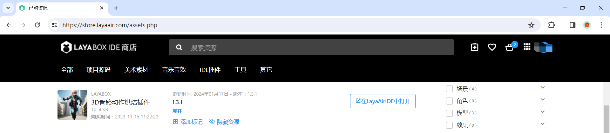
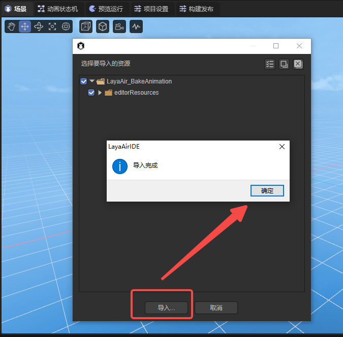
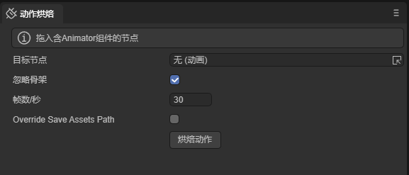

# 3D Skeletal Animation Baking Plugin

## 1. Plugin Overview

Animation baking is a special animation optimization solution. It pre-calculates all animations once; pre-computes all bone nodes and stores them in memory; the GPU directly reads the matrix values of the corresponding nodes from the memory; and performs rendering. By using animation baking, CPU consumption can be reduced because the GPU animation efficiency is higher than the CPU animation. For scenes that use a large number of skeletal animations, performance can be greatly improved.

- Advantage: High performance, can be used in scenes with a large number of skeletal animations;

- Disadvantage: Animations cannot be smoothly switched between each other, and animation masks and other functions cannot be used;

## 2. Usage Instructions

### 2.1 Import the Plugin

After adding the resource `from the IDE resource store to my resources`, in the list of `Purchased Resources`, click `Open in LayaAirIDE`, a browser control to call the IDE will pop up, and then click `Open LayaAirIDE` again, as shown in Figure 2-1.

(Figure 2-1)

After that, the control will invoke LayaAir3-IDE and pop up the window for importing resources. Click `Import` in the window. When the import is completed, a prompt panel for the completion of the import will pop up. Click `OK` to complete the import of the plugin. As shown in Figure 2-2.

(Figure 2-2)

The interface after the import is completed is shown in Figure 2-3:

(Figure 2-3)

**Plugin Update**

When the plugin developer releases a new version, the version will not be automatically updated for the plugin users (some users may not want to upgrade). Therefore, the plugin developer needs to manually click to update in the resource store. After the update, click `"Open in LayaAirIDE"` again to re-import and open the new version of the plugin.

### 2.2 Specific Usage

Refer to the [Detailed Explanation of Animation Baking](../../../animationEditor/aniBake/readme.md) document for details.