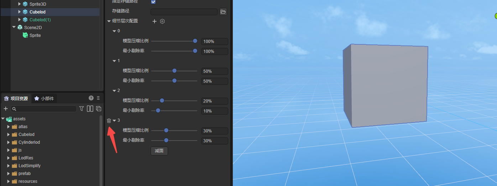

# Level of detail (LOD) surface reduction tool plug-in

> Author: Charley

Welcome to the Level of Detail (LOD) surface reduction tool plug-in. This plug-in has powerful model optimization functions, which can help developers reduce the performance pressure of game engines when displaying 3D models.

## 1. Plug-in overview

### 1.1 Introduction to plug-ins

LOD is the abbreviation of "Level of Detail", usually translated as "level of detail", and some documents will also be translated as "level of detail". It is the same thing. It is a method used in computer graphics to handle large-scale scenes. A general technical solution.

In this plan, it is believed that the complexity of the model should be dynamically adjusted based on factors such as the distance between the viewpoint and the model, the size of the model's projection on the screen, and other factors. In this way, close, large, and important models are represented with high-resolution details, while distant, small, and unimportant models are represented with low-resolution details.

With the help of the LOD technology solution, the computer only needs to display the scene details currently visible from the camera angle, which reduces the computational burden and the performance requirements of the hardware equipment. While ensuring the image quality and animation smoothness, it allows for a larger Scenes and more complex scenery settings, which to a certain extent improve the expressiveness and user experience of games or other visualization products.

LOD is commonly used in video games, virtual reality, city simulation and other fields. In a game, for example, the farther the character is from you, the fewer polygons the model will have and the blurr the texture will be. The closer the character is to you, the more polygons the model will have and the clearer the texture will be. This can make full use of hardware performance and provide Better gaming experience.

The LOD face reduction plug-in officially produced by Layabox is used to create and manage the level of detail (LOD) of 3D models and reduce the number of model Mesh faces. LOD technology can greatly improve the performance of 3D games and applications by adjusting the number of polygons displayed based on an object's distance in the 3D scene. This plug-in effectively reduces the number of renderings and reduces the computing pressure on GPU hardware when complex models exist. It is especially suitable for devices running with limited hardware resources.

### 1.2 Main functions

(figure 1)

- **Level generation and deletion**: Users can set multiple LOD levels and delete new levels.
- **Model surface reduction and compression**: Level of detail surface reduction tool, which can automatically calculate the number of triangles in the model and generate reduced models at each level based on the compression ratio.
- **Specified level culling rate**: For each level of model, you can customize the ratio conditions for optimizing culling in the scene.

## 2. Instructions for use

### 3.1 Import plug-in

After we add the resources from the IDE resource store to My Resources, in the list of purchased resources, click Open in LayaAirIDE, and the browser control for calling the IDE will pop up. Click Open LayaAirIDE again. , the operation process is shown in Figure 2-1.

(Figure 2-1)

After the above operation, the control will launch LayaAir3-IDE and a window for importing resources will pop up.

We click `Import` in the window. When the import is completed, a prompt panel indicating that the import is completed will pop up. Click `OK` to complete the import of the plug-in. The operation is shown in Figure 2-2.

(Figure 2-2)

The interface after the import is completed is shown in Figure 2-3:

(Figure 2-3)

##### Plug-in update

After the plug-in developer launches a new version, it will not actively update the version for plug-in users (some users may not want to upgrade), so plug-in developers need to manually click update in the resource store. After updating, click "" in LayaAir IDE Open" will re-import and open the new version of the plug-in. The operation is shown in Figure 2-4.

### 3.2 Parameter description

#### 3.2.1 Target types and area reduction targets

The target object of LOD subtraction is specified by two parameters,

The first is the target type. The three types supported by this item are: node (Node), prefab (prefab), and model mesh (Mesh).

The second is the area reduction target. The area reduction target is the specific resource to be reduced. The target resource for area reduction will be controlled according to the target type.

For example, for node types, you can only drag 3D node objects from the `Hierarchy Panel` to the subtraction target, while for prefabs and model meshes, you can only drag the corresponding types of resources from the `Project Resource Panel`. As shown in Figure 3-1:

(Figure 3-1)

#### 3.2.2 Preserve boundaries

The concept of `preserving boundaries' means that during the process of simplifying the model, the vertices located at the topological boundaries are not moved. Topological boundary vertices are those that are on the edge of a triangle but have no paired triangle.

The vertices of the boundary are important feature points, and moving these vertices may seriously change the shape of the model and even cause visual errors. Through the `preserve boundary` function, the model can be simplified while maintaining the overall shape and relative accuracy of the model. This feature can be useful when simplifying part of a large mesh.

When using, if this function is checked, the tool will keep the vertices located on the boundary unchanged when generating the LOD model, and only move and simplify other vertices and elements, without oversimplifying the edges of the model. This ensures that after the model is simplified, its boundaries remain intact and prevents the visual impact of changes in the shape of the boundaries.

#### 3.2.3 Specify storage path

Clicking the `Reduction surface` button will generate the model resources after surface reduction. By default, they are generated to the root directory under assets (named with the mesh name as the directory).

When `Specify storage path` is checked, the input box for the storage path will appear, as shown in Figure 3-2, which is used to customize a directory as the model directory generated after surface reduction.

(Figure 3-2)

#### 3.2.4 Level of detail configuration

The configuration of level of detail (LOD) is mainly divided into three modules: increase or decrease of level of detail, model compression ratio configuration, and minimum culling rate.

##### Adding and deleting levels of detail

The default setting of the tool is 3 levels of detail. Layer 0 represents the original level with values ​​​​100%, 1 represents the level setting of 50% ratio, and 2 represents the level setting of 10% ratio.

If you want to add levels, click the plus sign, as shown in Figure 3-3.

(Figure 3-3)

If you want to delete a level, click the delete icon in front of the level ID, as shown in Figure 3-4.

(Figure 3-4)

##### Model compression ratio configuration

For each level, you can set a different compression ratio, 100% is the original size, no compression. If it is lower than 100%, the mesh of the model will be compressed according to the proportion.

##### Minimum rejection rate

The minimum culling rate means that at the corresponding level of detail, if its size on the screen is lower than the set minimum viewing angle ratio, the object will be completely culled, that is, it will no longer be rendered. This helps optimize rendering performance and reduce resource consumption.

The proportion of the culling rate is related to the relative size of the model displayed in the 3D scene, and is generally described in the form of a percentage. Generally, the closer an object is to the camera, the larger it will appear on the screen, and vice versa. For example, if the LOD minimum culling is set to 50%, this means that the model height is half of the scene's display height. When the proportion of a model is less than 50%, those models with a proportion greater than or equal to this proportion in the LOD group will not be rendered, and the next level model in the LOD group will be rendered instead.

In short, the minimum culling rate is used to determine which level of detail model is rendered, typically using a more detailed high-resolution model when the object is close to the camera, using a lower-resolution model at a distance, or keeping only the outline of the model to reduce rendering overhead.

