# 2D Particle Editor

## 1. The Foundation of 2D Particle Editor

In the LayaAir engine, the 2D particle system can be used to simulate non-fixed forms such as rain, snow, smoke, fog, fire, etc. These effects are often difficult to achieve with a single image and require a combination of multiple images. The smallest unit in this combination is the 2D particle.

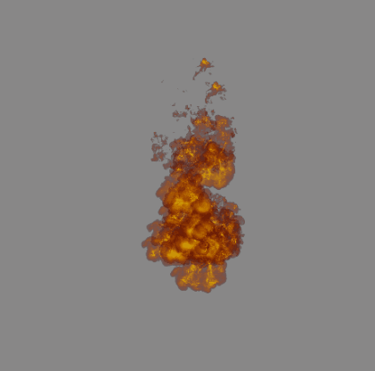

## 2. Creating 2D Particles in LayaAir Engine

Developers can create a sprite node in 2D and then add a 2D particle renderer to this node in the property setting panel.

## 3. The Use of 2D Particles

### 2D Particle Renderer

**`Rendering Layer`**: The layer affected by the layer mask of the 2D lighting component.

**`Material`**: Set the custom 2D shader material. If not set, the engine will use the default material.

### Particle System

#### Parameter Mode

Before explaining each module of the particle system, let's first explain the parameter mode of the particle attributes.

**`Constant`**: Set a constant value for the attribute, which does not change during the entire lifetime of the particle.

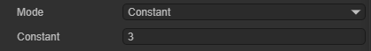

**`TwoConstants`**: Set a maximum and a minimum value as the constant range. The actual attribute value of each particle will randomly change within this constant range.

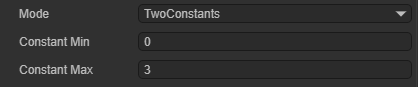

**`Curve`**: Set a curve. The attribute value of each particle will change along the curve as the particle's lifetime progresses.

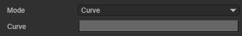

The horizontal coordinate is the particle's lifetime, which is a normalized value; the vertical coordinate is the attribute value.

**`TwoCurves`**: Set two curves as the upper and lower limits of the attribute value. During the particle's lifetime, the particle will take values on the two curves as the attribute value range at this moment and randomly take a value within this range as the attribute value.

**`Color`**: Set a fixed color as the attribute value.

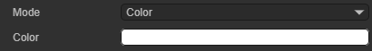

**`TwoColors`**: Set two fixed color values. The actual attribute value of each particle is randomly linearly interpolated from these two color values.

**`Gradient`**: Set a color gradient. During the particle's lifetime, the actual attribute value of each particle will change according to the color gradient.

**`TwoGradients`**: Set two color gradients. During the particle's lifetime, the particle will take values on the two color gradients and randomly linearly interpolate the obtained two color values as the attribute value at this moment.

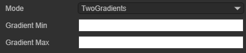

#### General

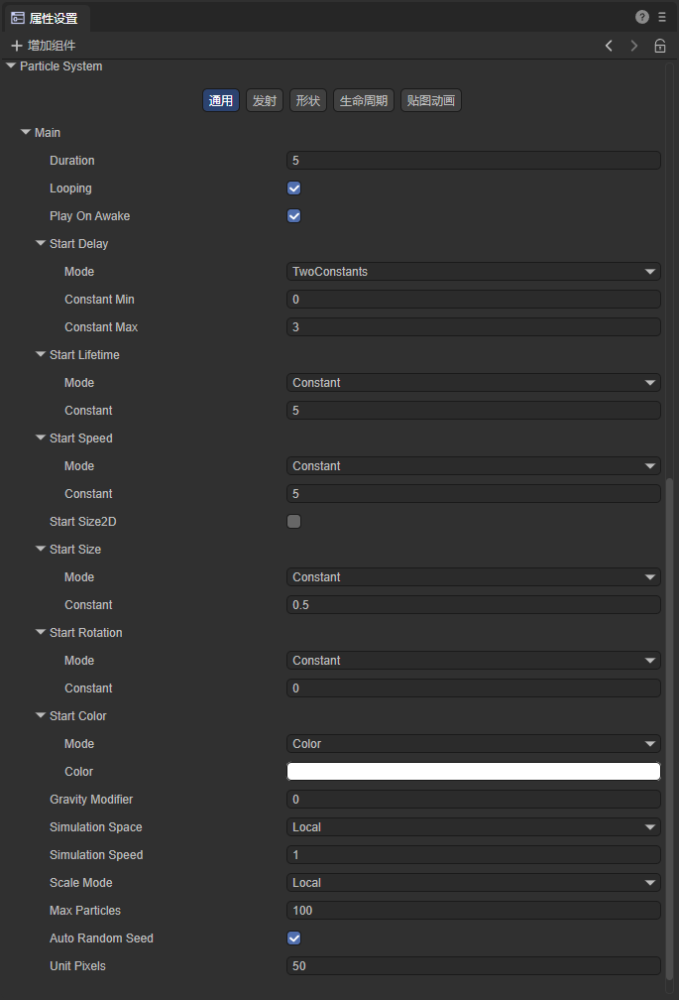

**`Duration`**: The duration of the particle system's operation. After reaching the set time, the system stops emitting particles.

*Note: `Duration` is not the lifetime of a single particle. The lifetime of a single particle will be introduced below.*

**`Loop`**: When enabled, the particle system will restart and repeat the cycle after its duration ends.

**`Play On Awake`**: When enabled, the particle system will automatically start when the object it belongs to is created.

**`Start Delay`**: After enabling this attribute, the system will delay for a period of time before starting to emit particles. There are two modes to choose from: `Constant` and `TwoConstants`.

**`StartLifeTime`**: The lifetime of each particle, indicating how long the particle disappears after being emitted. There are two modes to choose from: `Constant` and `TwoConstants`.

**`Start Speed`**: The initial speed of each particle, only representing the magnitude of the particle speed, not the direction. There are two modes to choose from: `Constant` and `TwoConstants`.

**`Start Size2D`**: When this attribute is not enabled, the `Start Size` attribute determines the initial size of the particle;

`Start Size`: The initial size of each particle. There are two modes to choose from: `Constant` and `TwoConstants`.

**`Start Size2D`**: When this attribute is enabled, developers can set the size of the particle on the X-axis `Start Size X` and the Y-axis `Start Size Y` respectively.

`Start Size X`: The initial size of each particle on the X-axis. There are two modes to choose from: `Constant` and `TwoConstants`.

`Start Size Y`: The initial size of each particle on the Y-axis. There are two modes to choose from: `Constant` and `TwoConstants`.

**`Start Rotation`**: The initial rotation angle of each particle. There are two modes to choose from: `Constant` and `TwoConstants`.

**`Start Color`**: The initial color of each particle. There are two modes to choose from: `Color` (color value) and `TwoColors` (color transition)

**`Gravity Modifier`**: Set the physical gravity value. The movement of particles will be affected by the gravity value.

**`Simulation Space`**: Control whether particles follow the movement of the particle emitter. There are two modes to choose from: `Local` and `World`.

`Local`: After the particle is generated, it follows the movement of the particle emitter's coordinates. In this mode, the movement of the particle emitter is reflected on each particle.

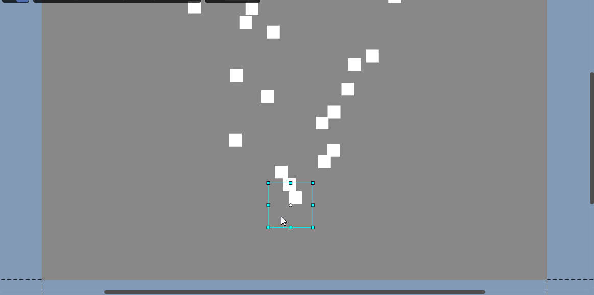

`World`: After the particle is generated, it does not follow the particle emitter and moves directly in the world coordinate system.

**`Simulation Speed`**: Adjust the speed of the entire particle system update.

**`Scale Mode`**: Control the particle's scaling mode. There are two modes to choose from: `Hierarchy` and `Local`.

`Hierarchy`: Affected by both the node where the particle system component is located and its parent node.

`Local`: Only affected by the node where the particle system component is located.

**`Max Particles`**: The maximum number of particles in a system. When the number of particles reaches the limit value, the system stops generating particles until the emitted particles disappear.

**`Auto Random Seed`**: Automatic particle random seed. When enabled, each playback will be different. After unchecking, you can fill in the seed value to create repeatable effects. Different values result in slightly different particle emission performances.

**`Unit Pixels`**: The size of one unit in the particle system corresponding to the screen pixel.

#### Emission

**`Enable`**: Whether to enable the emission module. Only when this attribute is enabled, the system will emit particles. When creating a new particle system, this attribute is enabled by default.

**`Rate Over Time`**: The number of particles emitted by the system per second.

**`Rate Over Distance`**: The number of particles emitted per unit distance moved.

**`Bursts`**: The burst emitter is used to control the particle system to generate a specified number of particles at specified time points. Multiple burst emitters can be added to a particle system.

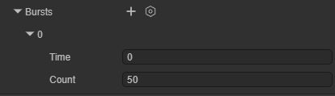

There are two attributes on the burst emitter:

`Time`: The time of the particle burst emission, counted in seconds from the start of the particle system.

`Count`: The number of particles emitted in the burst. The particles emitted by the burst are also limited by the `Max Particles` attribute.

The effect of the burst emitter is as shown. It can be seen that the particle system creates a large number of particles in an instant.

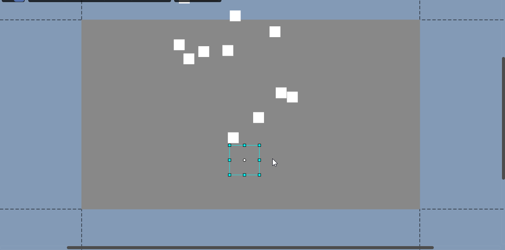

#### Shape

This module is used to control the initial position of the particles and the direction of the initial velocity of the particles. The particles are generated at random positions within the shape range.

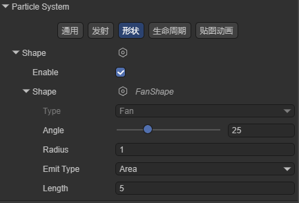

**`Enable`**: Whether to enable the Shape module. After enabling this attribute, the particles are generated at random positions within the Shape range. After disabling this attribute, the particles are generated at the anchor point of the node to which the component belongs.

**`Shape`**: The shape of the particle emitter. There are four shapes to choose from, and each shape has different attribute values.

**`FanShape`**: Fan-shaped area. The particles move outward like the light of a flashlight from a fan-shaped area.

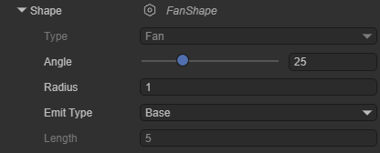

`Angle`: The angle of the center angle of the fan.

`Radius`: The radius of the fan.

`Emit Type`: The position where the particles are emitted. Base: The particles are emitted at random positions within the inner radius of the fan. Area: The particles are emitted at random positions within the fan area.

`Length`: Valid when `Emit Type` is `Area`, used to control the width of the fan area.

By adding a burst emitter to the particle renderer, we can clearly see the shape of the emitter.

**`Circle2DShape`**: Circular area. The particles are emitted in all directions.

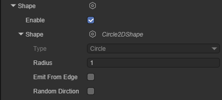

`Radius`: The radius of the circle.

`Emit From Edge`: Emit from the edge. When this attribute is enabled, the particles are only emitted at the radius of the circle.

`Random Dirction`: Random direction. When this attribute is not enabled, the velocity direction of the particles is the vector from the center of the circle to the particle generation position; when this attribute is enabled, the velocity direction of the particles is random.

**`Box2DShape`**: Box-shaped area. All particles are emitted in one direction.

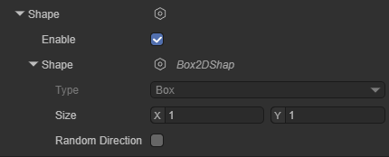

`Size`: The size of the box.

`Randomize Direction`: Random direction. When this attribute is enabled, the particles will move in a random direction instead of the same direction.

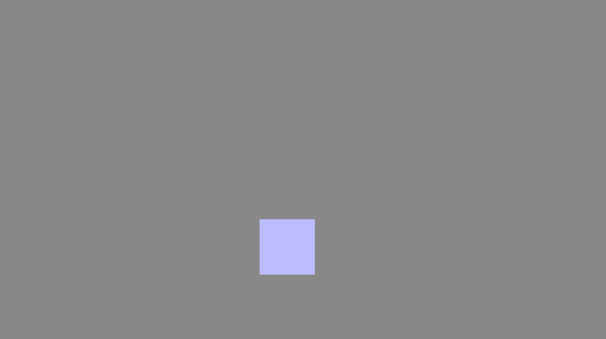

**`SemicircleShape`**: Semi-circular area.

`Radius`: The radius of the semi-circle.

`Emit From Edge`: Emit from the edge. When this attribute is enabled, the particles are only emitted at the radius of the circle.

`Random Dirction`: Random direction. When this attribute is not enabled, the velocity direction of the particles is the vector from the center of the circle to the particle generation position; when this attribute is enabled, the velocity direction of the particles is random.

#### Lifetime

The following attributes are used to control the changes in the state of a single particle during its lifetime:

**`Velocity2D Over LifeTime`**: The change of the particle's velocity over its lifetime.

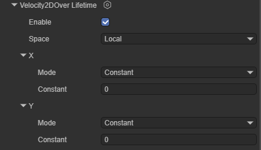

`Enable`: Whether to enable this attribute.

`Space`: Whether the reference space of this attribute is the local space or the world space.

`X`: Linear velocity on the X-axis. There are two modes to choose from: `Constant` and `TwoConstants`.

`Y`: Linear velocity on the Y-axis. There are two modes to choose from: `Constant` and `TwoConstants`.

**`Color Over LifeTime`**: The change of the particle's color over its lifetime.

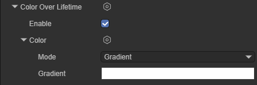

`Enable`: Whether to enable this attribute.

`Color`: The color value of the particle. There are four modes to choose from: `Color`, `Gradient`, `TwoColors` and `TwoGradients`

**`Size2D Over LifeTime`**: The change of the particle's size over its lifetime.

`Enable`: Whether to enable this attribute.

`Separate Axes`: Whether to control the size on each axis separately.

`Size`: When the `Separate Axes` attribute is not enabled, this value can be set to control the overall size of the particle. There are four modes to choose from: `Constant`, `Curve`, `TwoConstants` and `TwoCurves`.

`X`: When the `Separate Axes` attribute is enabled, set this value to control the size of the particle in the X-axis direction. There are four modes to choose from: `Constant`, `Curve`, `TwoConstants` and `TwoCurves`.

`Y`: When the `Separate Axes` attribute is enabled, set this value to control the size of the particle in the Y-axis direction. There are four modes to choose from: `Constant`, `Curve`, `TwoConstants` and `TwoCurves`.

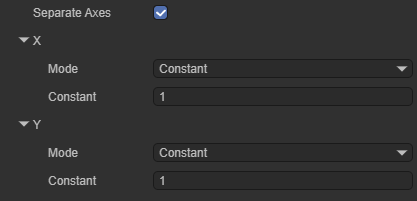

**`Rotation Over LifeTime`**: The change of the angular velocity of the particle's rotation over its lifetime.

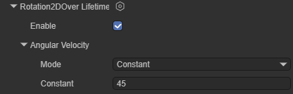

**`Enable`**: Whether to enable this attribute.

**`Angular Velocity`**: The angular velocity of the particle's rotation, in degrees. There are four modes to choose from: `Constant`, `Curve`, `TwoConstants` and `TwoCurves`.

#### Texture Animation

**`Enable`**: Whether to enable this attribute.

**`Tiles`**: The number of tiles the texture is divided into in the X (horizontal) and Y (vertical) directions.

**`Animation`**: The animation mode can be set to the entire sheet (the entire atlas as an animation sequence) or a single row (each row represents a separate animation sequence).

**`Frame`**: This attribute determines how the animation frame of the particle changes over its lifetime. There are four modes to choose from: `Constant`, `Curve`, `TwoConstants` and `TwoCurves`.

**`Start Frame`**: The starting frame offset of the animation

**`Cycles`**: The number of cycles of the animation within the particle's lifetime.

*Note: Texture animation requires creating the corresponding material and setting the texture to be used.*

### Particle Shader

Select Particle2D on the `Shader` attribute to add the built-in 2D particle shader of Laya.

**`Texture`**: Specify the texture used by the particle.

**`Material Rendering Mode`**: Set the rendering mode

`Opaque`: The default setting, suitable for ordinary solid objects without transparent areas.

`Cutout`: Allows the creation of transparent effects with hard edges between opaque and transparent areas. In this mode, there are no semi-transparent areas, and the texture is either 100% opaque or invisible. This is useful when using transparency to create the shape of materials, such as leaves or torn and ragged cloth.

`Transparent`: Suitable for rendering realistic transparent materials, such as transparent plastic or glass. In this mode, the material itself will adopt the transparency value (based on the alpha channel of the texture and the alpha of the hue color), but the reflections and lighting highlights will remain visible in full clarity, just like a real transparent material.

`Additive`: Overlay mode.

`AlphaBlended`: Transparent blending mode.

`Custom`: Custom rendering mode.

**`Render Queue`**: Used to set the rendering queue of the shader. The larger the value, the later the rendering.

**`Culling Mode`**: Determine the culling mode of the particle.

## 4. Creating a 2D Particle

In this section, we help developers understand the usage of 2D particles by creating an example of a 2D particle.

### 4.1 Creating a Prefab

Generally speaking, particle effects need to be reused, so we can make the particle effect into a prefab. Here we create a 2D prefab.

Open this prefab, convert it to a 2D sprite node, and add a 2D particle renderer to it.

### 4.2 Adding Materials to Particles

Create a basic 2D rendering Shader in the project resource panel:

Open this material and change the shader used by this material to Particle2D:

Add this material to the 2D particle renderer:

Add the texture map needed to the `Texture` attribute of the material:

The used texture map:

After setting, we can already see the texture map of the particle:

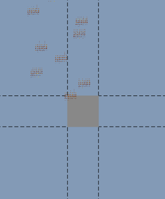

Obviously, the effect of the particle is not correct. We still need to set the sequence frame animation for it:

### 4.3 Setting Sequence Frame Animation

Find the Particle System column in the property setting panel, select texture animation, and create an instance:

Set the number of tiles divided by the texture in the horizontal and vertical directions:

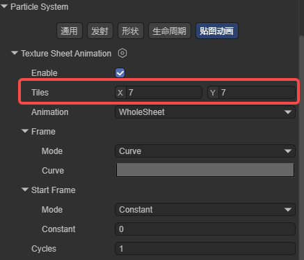

After setting the sequence frame animation, the particle effect is as follows:

It can be seen that there is already a flame animation on the particle, but we still need to adjust the flame effect.

### 4.4 Setting Basic Attributes

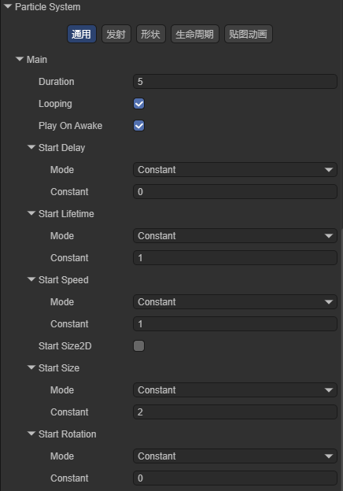

The Constant of Start Lifetime is 1, set the existence time of the particle to 1 second; the Constant of Start Speed is 1, set the initial speed of the particle to 1; the Constant of Start Size is 2, set the size of the particle to 2; the effect is as shown:

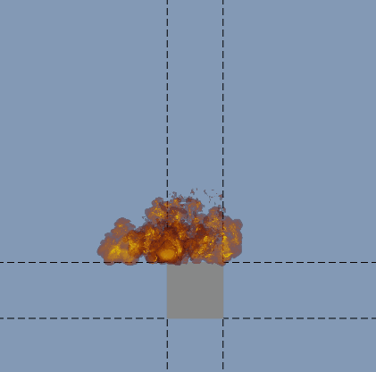

Developers can also adjust other parameters of the particle system to change the effect of the particle. Here we set Start Speed to TwoConstants, the minimum value is 0, and the maximum value is 5; set Rate Over Time to 30 in the emission module; set Shape to Box2DShape in the shape module; the running effect is as follows:

