# 3D Particle Editor

## 1. The Foundation of 3D Particle Editor

### What is 3D Particle

In the encyclopedia, a particle refers to the smallest part of matter that can exist in a free state.

In the LayaAir engine, the particles in the 3D particle system can be used to simulate non-fixed natural phenomena such as smoke, fog, water, fire, rain, snow, and streamer. And the shapes of these natural objects do not have a fixed form, so they cannot be simulated and realized with a fixed model. Multiple models are required to combine into a complete visual effect, and the 3D particle is the smallest unit of the combined effect. But it should be noted that the particle is not a 3D model, but a patch model.

### Flame Effect Display

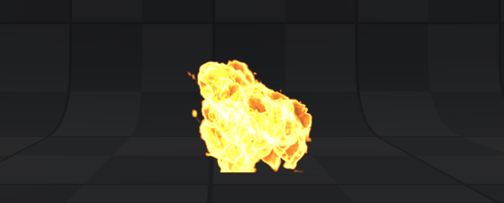 

(Animated Image 1)


## 2. Creating 3D Particles in LayaAir Engine

#### 2.1 Particle Node

Under the Scene3D node in the scene, 3D particles can be created by right-clicking with the mouse

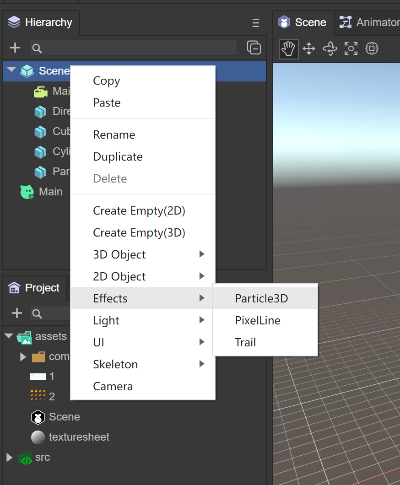 

(Figure 2.1.1-1)

Default particle system addition completed effect

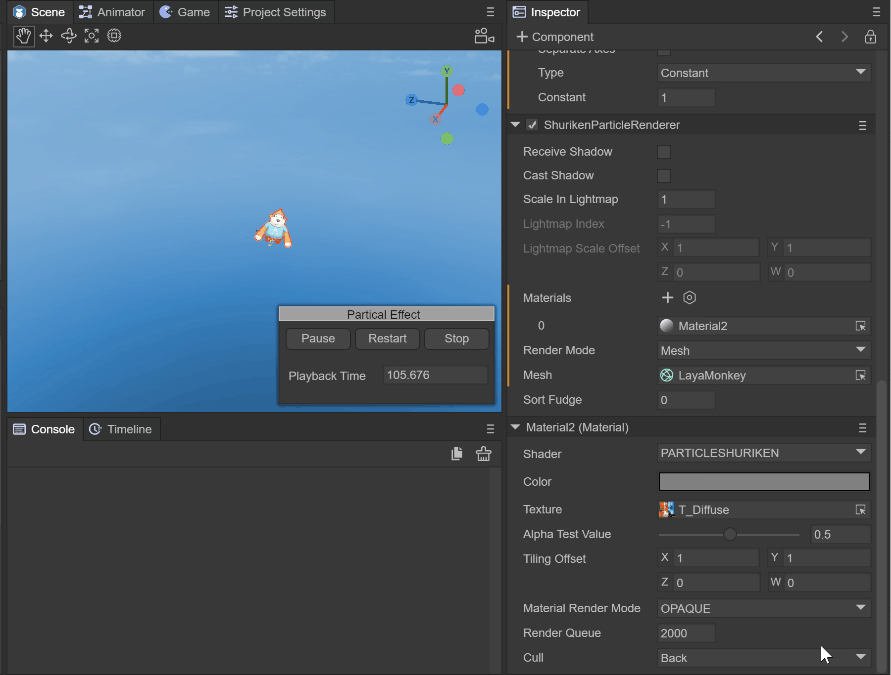 

(Animated Image 2)

#### 2.2 Prefab

If considering that 3D particles need to be reused, it is recommended to use prefabs. Create prefabs under Assets. After double-clicking to open the prefab, create 3D particles by right-clicking under the Sprite3D node

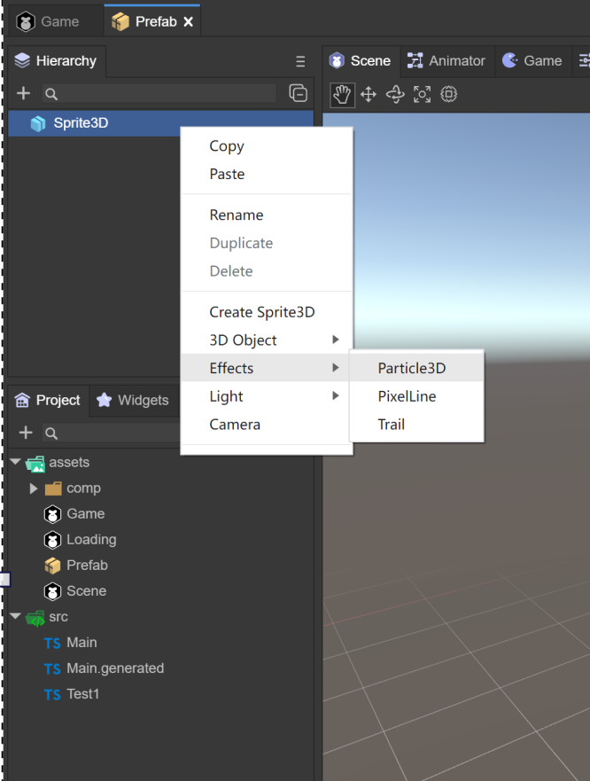 

(Figure 2.1.2)

## 3. The Use of 3D Particles

### The use of 3D particles consists of three parts

- ### **Particle System Component**

- ### **Particle Rendering Module**

- ### **Particle Shader**

  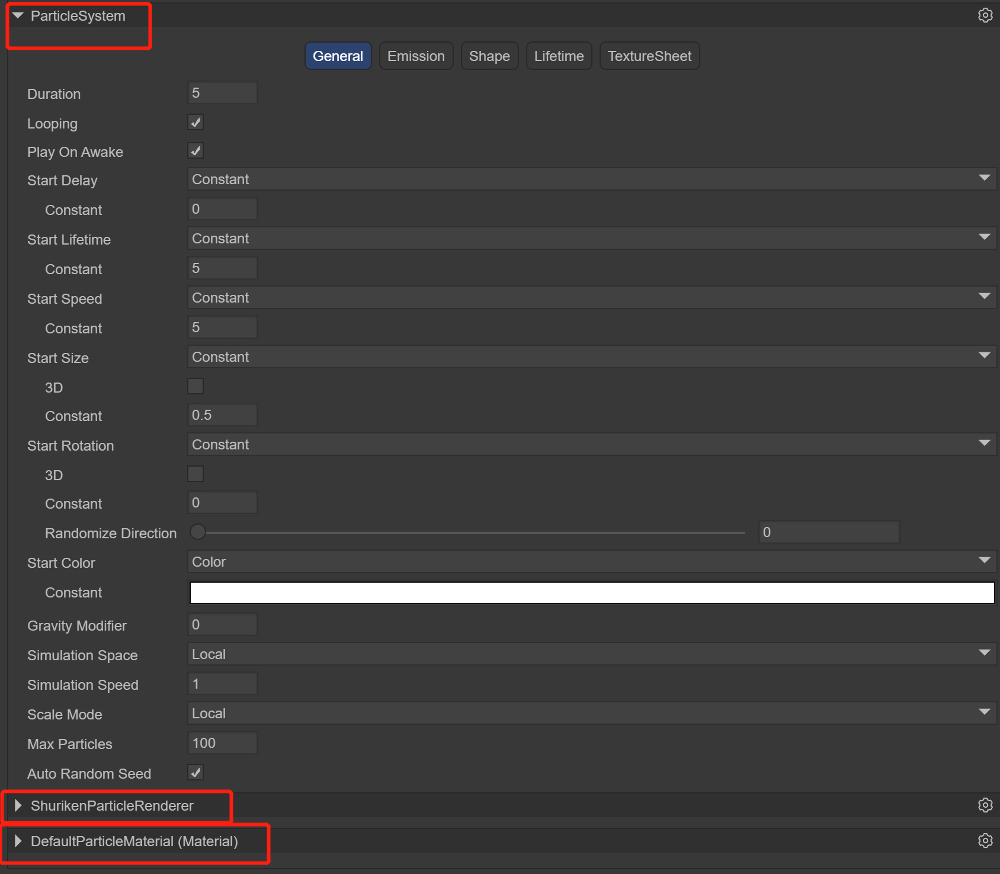 

  (Figure 3.0) As can be seen from Figure 3.0, when a 3D particle is created, these three components will be automatically added. Let's learn about the use of each system in detail below

### 3.1 Particle System Component `ParticleSystem`

The particle system is the basis of the special effect performance of the LayaAir engine. Usually, the position and movement of the particle system in the three-dimensional space are controlled by the emitter. The emitter is mainly represented by a set of particle behavior parameters and the position in the three-dimensional space. Particle behavior parameters can include the generation speed of particles (that is, the number of particles generated per unit time), the initial velocity vector of particles (for example, when and in what direction to move), the lifetime of particles (how long the particles annihilate after), the color of particles, the changes during the particle's lifetime, and other parameters, etc.

#### Classification of Particle System Components

In the LayaAir editor, the particle system component consists of five parts

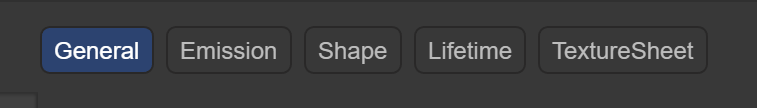 

(Figure 3.1)

#### 3.1.1 Basic Panel `General`

The default is the general module of the particle system, which is used to set the basic settings of the particle system. This module is an inherent module and cannot be disabled. This module defines a series of basic parameters such as the duration of particle initialization, the loop mode, the emission speed, the size, etc.

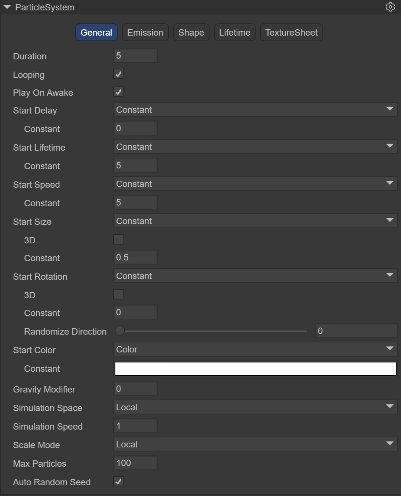 

(Figure 3.1.1-1)

`Duration`: The duration during which the particle system continuously emits particles, or the number of times particles can be emitted within one cycle. After reaching the set time, the particles stop emitting

  *Note: It is not the lifetime of a particle. The lifetime of a particle will be introduced below*

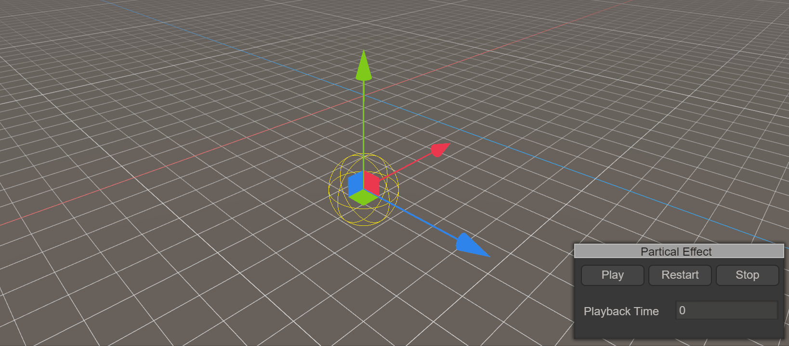 

(Animated Image 3) The effect when Duration is 5. When 5 seconds arrive, the particles no longer emit, and Loop should be set to not start

`Loop`: If enabled, the particle system restarts and continues to repeat the cycle when the above duration ends

`Play On Awake`: If enabled, the particle system automatically starts when the object is created

`Start Delay`: The delay time before the system starts to emit after enabling. Two delay methods can be selected
  `Constant` Fixed time
  `Random Between Two Constant` Randomly take a value from the minimum to the maximum

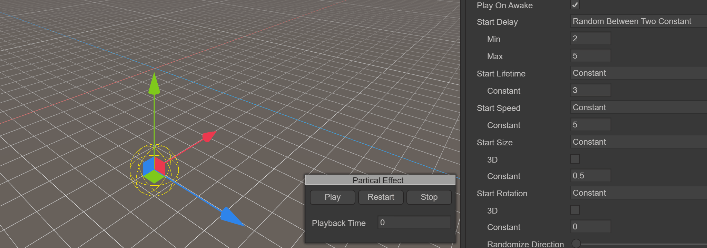 

(Animated Image 4) It shows the random way using the minimum of 2 seconds to the maximum of 5 seconds. It can be seen that when the fourth second, the particles start to emit

`Start Lifetime`: Controls the lifetime of each particle, that is, how long the particle disappears after occurrence. It can be a random value between two numbers

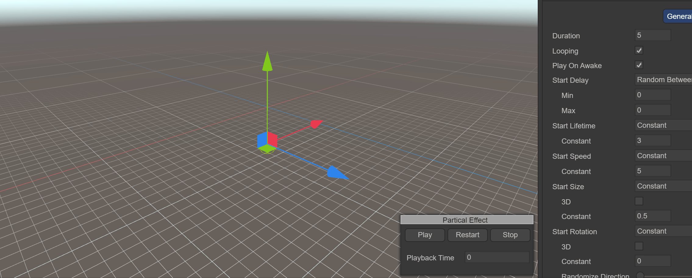 

(Animated Image 5) It shows the effect when Start Lifetime is 3. It shows that each particle disappears 3 seconds after being emitted

`Start Speed`: The initial speed of each particle in the appropriate direction. Two delay methods can be selected
  `Constant` Fixed value
  `Random Between Two Constant` Randomly take a value from the minimum to the maximum

  The speed effect when Start Speed is 5 is shown in Animated Image 5

`Start Size`: The initial size of each particle. If you want to control the size of each axis separately, please enable the 3D option. Two delay methods can be selected
  `Constant` Fixed value
  `Random Between Two Constant` Randomly take a value from the minimum to the maximum

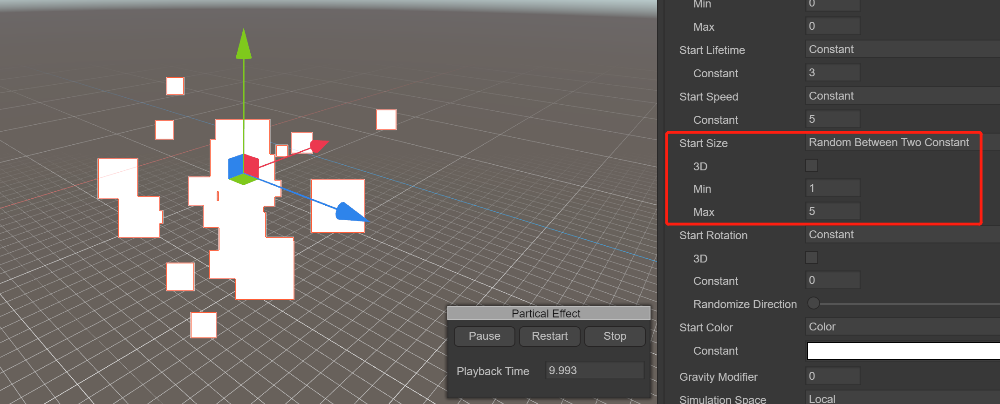 

(Figure 3.1.1-2) It shows that Start Size is random between 1 and 5. It can be seen that the particles on the left are of different sizes

  *Note: The size of the particle has nothing to do with the size of the texture it uses. A 100-pixel texture and a 500-pixel texture draw almost the same size of the same particle. Thus, StartSize specifies the diameter of this particle, not the texture scaling*

`Start Rotation`: The initial rotation angle of each particle. If you want to control the rotation of each axis separately, please enable the 3D option. Two delay methods can be selected
  `Constant` Fixed value
  `Random Between Two Constant` Randomly take a value from the minimum to the maximum

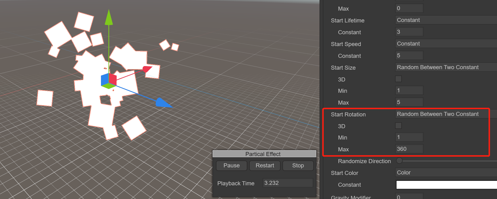 

(Figure 3.1.1-3) It shows that Start Rotation is random between 1 and 360. It can be seen that the particles on the left rotate in various directions

`Start Color`: The initial color of each particle

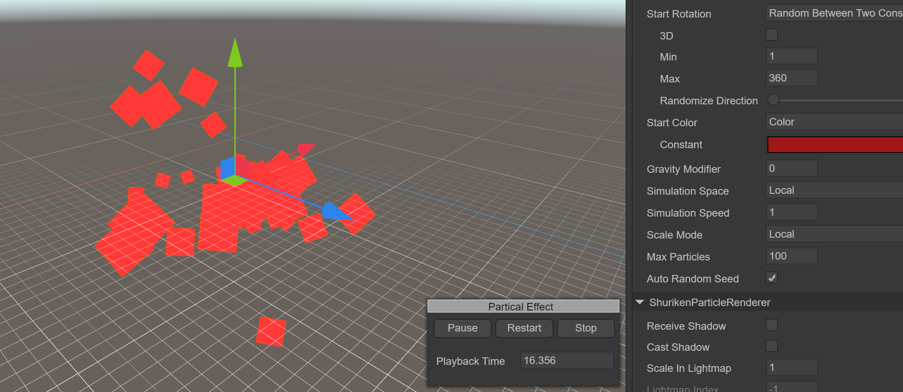 

(Figure 3.1.1-4) It shows the effect when Start Color is red

*Note that even if the particle is specified as red in StartColor, the displayed effect is not pure red. The places where particles and particles, the sky, and the red square are superimposed all become different colors. This is because the final display effect of the picture is regulated by the shader. When we set the particle material, the selected RenderingMode is Additive (superimposed), so the final display effect will be affected by the light coming from behind the particle and change color. You can try to select different shader options to observe the changes*

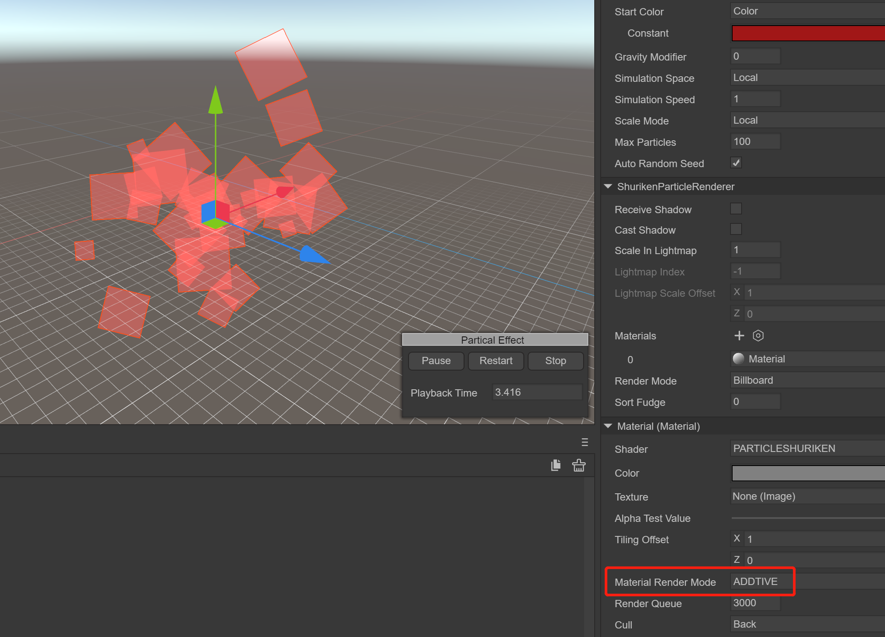 

(Figure 3.1.1-5) It shows the effect of RenderingMode as Additive

`Gravity Modifier`: Set the physical gravity value. A zero value turns off gravity

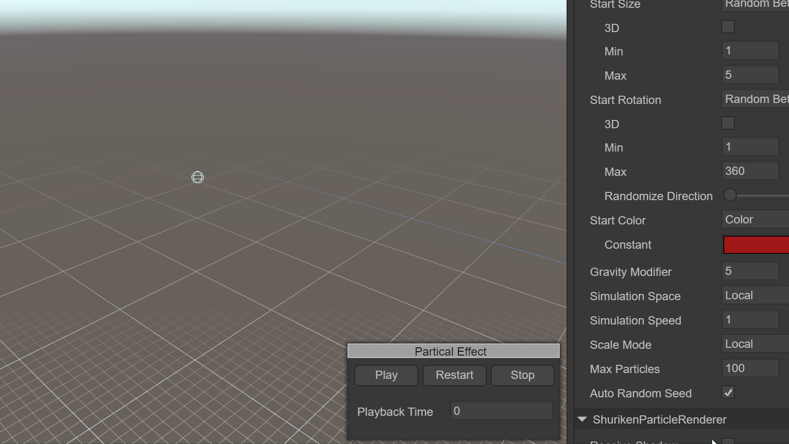 

(Animated Image 6) It shows the effect when using `Gravity Modifier` as 5

`Simulation Space`: Control whether particles follow the movement of the particle emitter

  `Local`: After the particle is generated, it follows the movement of the particle emitter's coordinates. In this mode, the movement of the particle emitter is reflected on each particle.

  `World`: After the particle is generated, it does not follow the particle emitter and moves directly in the world coordinate system.

`Simulation Speed`: Adjust the speed of the entire particle system update

`Scale Mode`: Control the scaling mode of the particle

  `Hierarchy`: Affected by the scaling of itself and the parent node at the same time

  `Local`: Only affected by itself

  `World`: Not affected

`Max Particles`: The maximum number of particles in one system. If the limit is reached, some particles will be removed. If it is set to 1, the particle system will emit particles one by one
`Auto Random Seed`: Automatic particle random seed. Each playback will be different when enabled. After unchecking, you can fill in the value of the random seed. Different values have slightly different particle emission performances

#### 3.1.2 Emission Module `Emission`

This module is part of the particle system component and is used to specify the properties of emitting particles. When creating a new particle system, the Emission module is enabled by default.

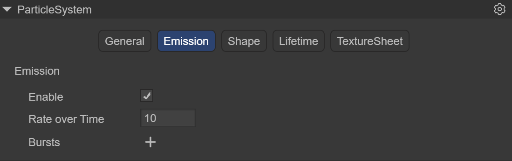 

(Figure 3.1.2)

`Enable`: Whether to enable
`Rate over Time`: The number of particles emitted per second
`Rate over Distance` The number of particles emitted per moving distance unit. This mode is very useful for simulating particles actually generated by the movement of an object (for example, the dust left by wheels on a muddy road)
`Bursts`: Bursts are events that generate particles. These settings allow particles to be emitted at a specified time. Multiple burst points can be set, and the time, minimum number of particles, and maximum number of particles can be modified respectively

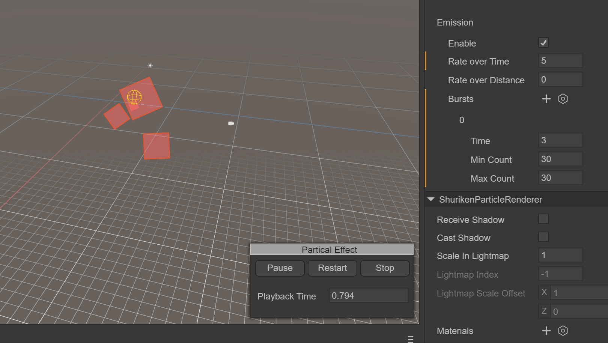 

(Animated Image 7) It shows the effect of using Rate Over Time as 5, emitting 5 particles per second, and using a group of Bursts. At the third second, 30 particles are suddenly emitted

#### 3.1.3 Shape Module `Shape`

This module defines the volume or surface from which particles are emitted and the direction of the initial velocity.

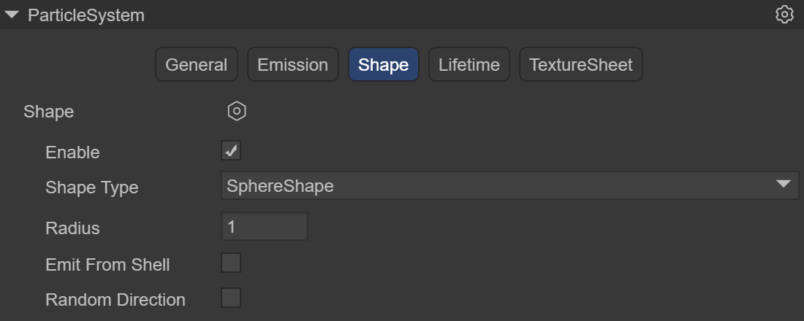 

(Figure 3.1.3-1)

`Shape Type`: The choice of shape will affect the area where particles can be emitted and also affect the initial direction of the particles. For example, a Sphere emits particles in all directions, and a Cone emits a divergent particle stream.
1. `Sphere`: Sphere, which can emit particles in all directions
    `Radius`: Radius
    `Emit from shell`: Emit according to the shell
    `Randomize Direction`: Randomize the direction

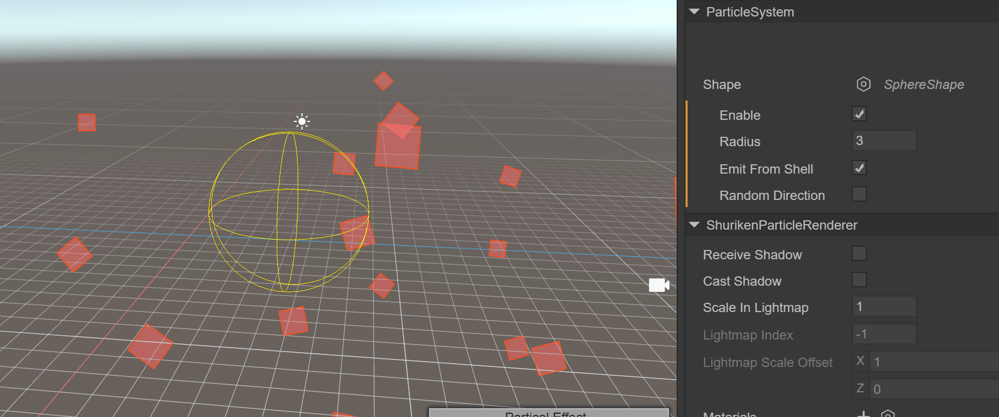 

(Animated Image 8) It shows the use of a sphere with a radius of 3 and emission from the edge of the sphere

2. `Hemisphere`: Hemispherical shape
    `Radius`: Radius
    `Emit from shell`: Emit according to the shell
    `Randomize Direction`: Randomize the direction

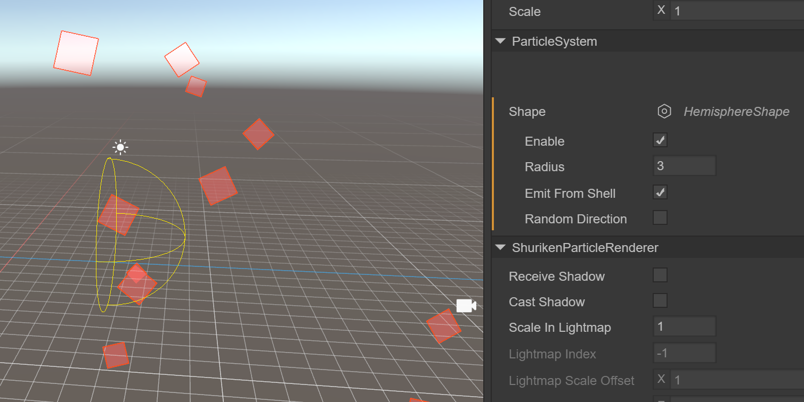 

(Figure 3.1.3-2)

3. `Cone`: Cone, allowing particles to fan out from one point like the light of a flashlight to a circular shape
    `Angle DEG`: The circular aspect angle of the shape
    `Radius`: Radius
    `Length`: Length
    `Emit from`: Emission method
    `Base`: Based on the bottom of the cone
    `Base Shell`: Based on the bottom shell of the cone
    `Volume`: Based on the inside of the cone
    `Volume Shell`: Based on the inside shell of the cone
    `Randomize Direction`: Randomize the direction

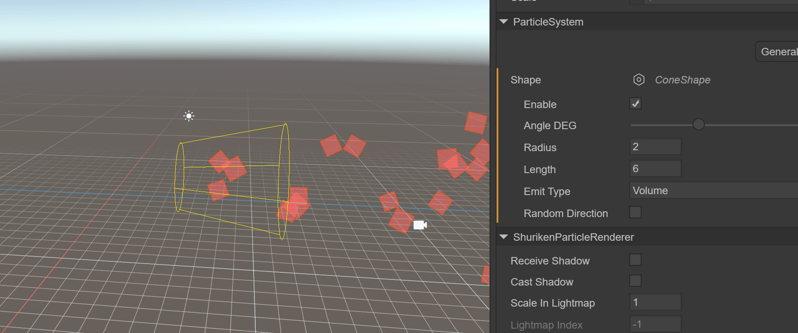 

(Animated Image 9) It shows the use of a cone with a radius of 2 and a cone length of 6, emitting from the inside of the cone

4. `Box`: Box shape, which can allow all particles to emit in a single direction and can well simulate the particle effect of rain and snow
    `Length`: Length in each direction of XYZ
    `Randomize Direction`: Randomize the direction

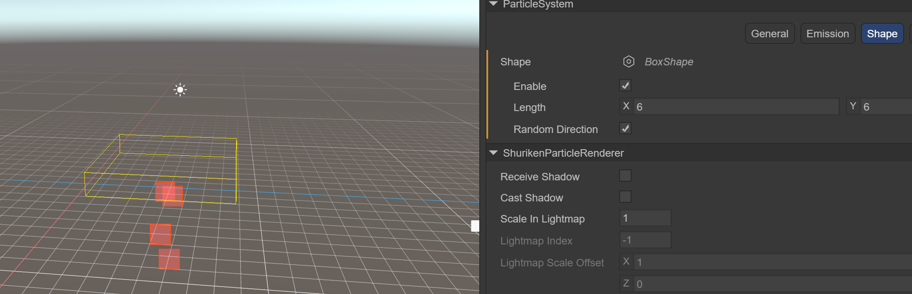 

(Figure 3.1.3-3)

5. `Circle`: Ring shape
    `Radius`: Radius
    `Angle DEG`: The angle of the ring
    `Emit From Edge`: Emit based on the edge
    `Randomize Direction`: Randomize the direction

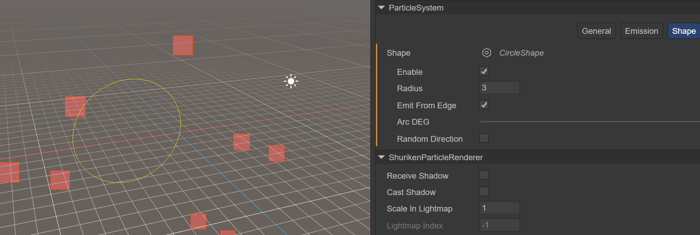 

(Figure 3.1.3-4) 

#### 3.1.4 Lifetime `Lifetime`

This module defines the attributes within the lifetime of the emitted particles

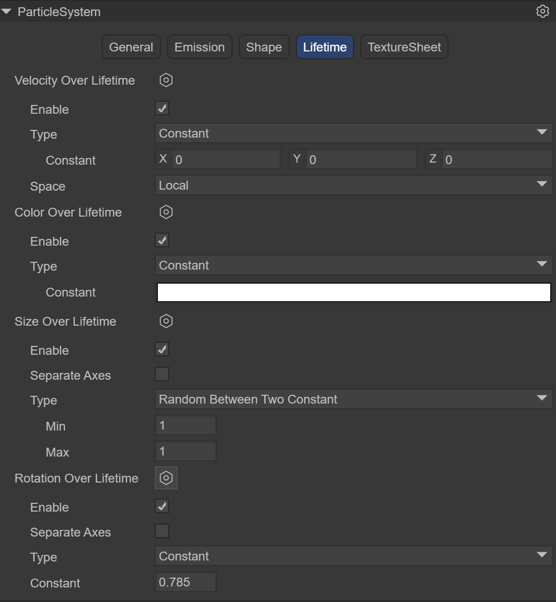 

(Figure 3.1.4)

1. `Velocity over Lifetime`: Velocity during the lifetime
    `Constant`: Constant mode, the velocity is constant
    `Curve`: Curve mode
    `Random from two Constant`: Random velocity mode
    `Random between two Curve`: Randomly take a value between two curves
    `Space`: Space
    `Local`: Model space
    `World`: World space
2. `Color over Lifetime`: Color during the lifetime
    `Constant`: Constant mode, the color is constant
    `Gradient`: Gradient mode
    `Random from two Constant`: Random two-color mode
    `Random between two Gradient`: Randomly take a value between two gradients
3. `Size over Lifetime`: Size during the lifetime
    `Separate Axes`: Separate by axes
    `Curve`: Curve mode
    `Random Between Two Contants`: Randomly take a value between two constants
    `Random between two Curve`: Randomly take a value between two curves

4. `Rotation over Lifetime`: Rotation during the lifetime
    `Separate Axes`: Separate by axes
    `Constant`: Constant
    `Curve`: Curve mode
    `Random Between Two Contants`: Randomly take a value between two constants
    `Random between two Curve`: Randomly take a value between two curves

#### 3.1.5 Texture Animation `Texture Sheet`

The module used to play particle animations. The raw material of particle animations is a texture that contains a set of **frame animations** that can render particles in an animated way.

Frame animation: Use multiple images, each image is a frame, to form a complete animation called frame animation. Or a large image, the image contains all the frame images of an animation

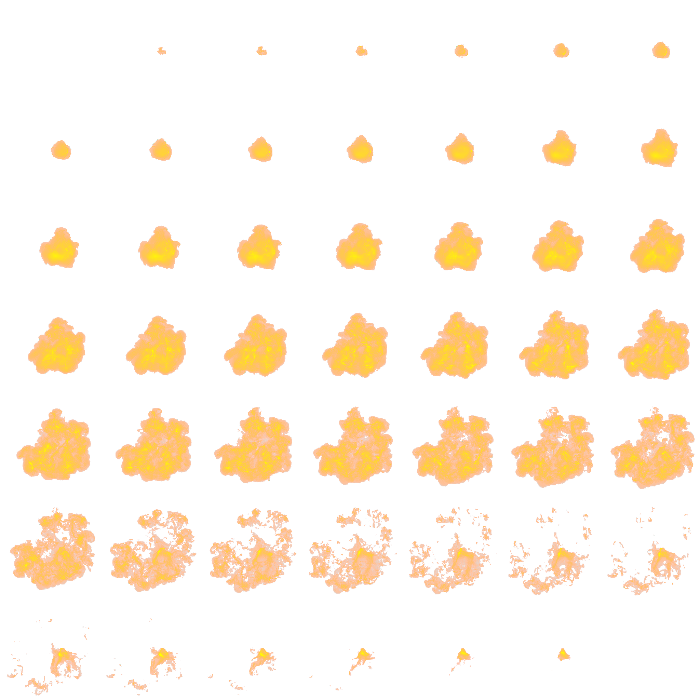 

(Figure 3.1.5-1)

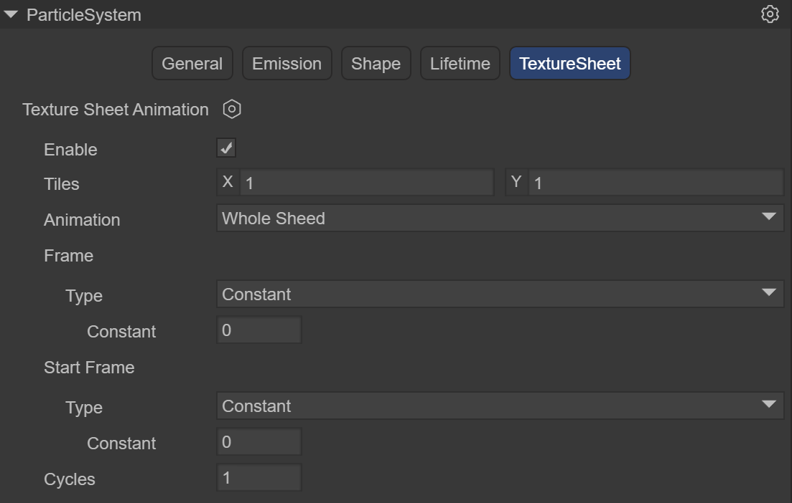 

(Figure 3.1.5-2)

Currently, LayaAir adopts the grid mode (Grid)

`Tiles`: The number of tiles the texture is divided into in the X (horizontal) and Y (vertical) directions

`Animation`: The animation mode can be set to the entire sheet or a single row (that is, each row represents a separate animation sequence)

`Frame`: Set the frame

  `Type`: Frame type

  `Constant`: Fixed frame number

  `Curve`: A curve that specifies how the animation frame increases over time.

  `Random Between two constant`: Random between two fixed frame numbers

  `Random Between two curve`: Random between two curves

`Start Frame`: The starting frame, allowing you to specify which frame the particle animation should start from

`Cycles`: The number of repetitions of the animation sequence within the particle's lifetime

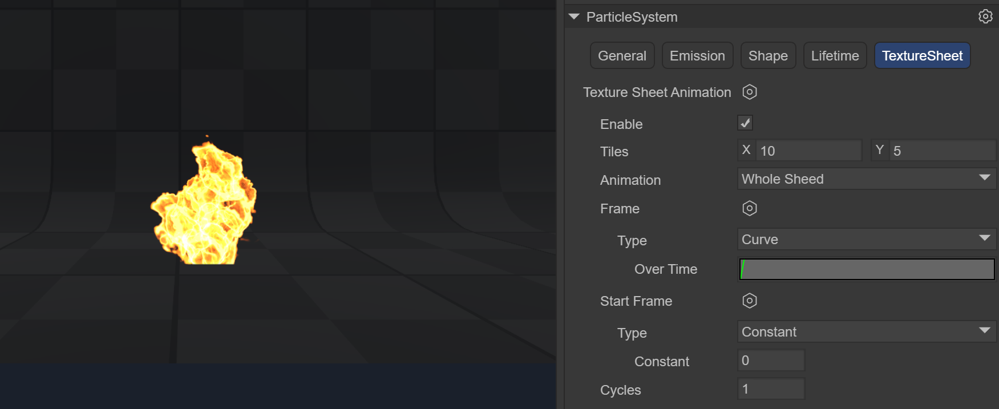 

(Figure 3.1.5-3) The usage process will be introduced in the fourth section of the flame example


### 3.2 Particle Rendering Module `ShurikenParticleRenderer`

The settings of the renderer module determine the image and model of a particle, and how it is transformed, shaded, and overdrawn by other particles.

#### 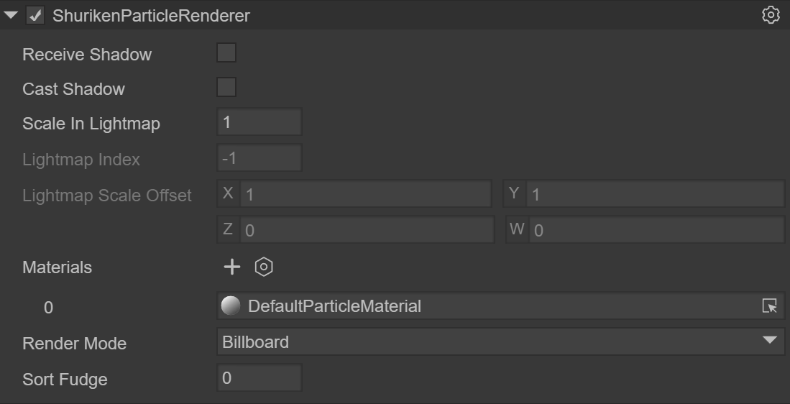

(Figure 3.2)

`Receive Shadows`: Determine whether the particles in this system can receive shadows from other sources. Only opaque materials can receive shadows.

`Cast Shadows`: If this attribute is enabled, the particle system creates shadows when illuminated by a light that casts shadows.

`Scale In Lightmap`: Adjust the pixel density of a specific object in the final LightMap.

`Materials`: Materials used to render particles

`Render Mode`: How to generate a rendered image from a graphic image (or mesh).

1. `Billboard`: Render the particles as billboards that always face the camera

2. `Stretched Billboard`: While the particles face the camera, particle scaling is allowed
    `Speed Scale`: Set the length based on the particle speed
    `Length Scale`: Determine the length of the particle by comparing the width of the particle

3. `Horizontal Billboard`: The particle plane is parallel to the XZ bottom plane

4. `Vertical Billboard`: The particles are upright on the Y-axis but face the camera

5. `Mesh`: Particles are rendered from a 3D mesh instead of a texture

 

(Animated Image)

`Sorting Fudge`: Sorting correction. Using this will affect the drawing order. The particle system with a lower `Sorting Fudge` value is more likely to be drawn last and thus appear in front of transparent objects and other particle systems

### 3.3 Particle Shader `PARTICLESHURIKEN`

Select Laya's particle in the material, and you can add Laya's built-in particle shader (PARTICLESHURIKEN), which can render various particle system effects. All particles use this material.

#### 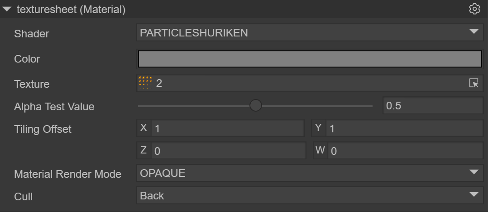

(Figure 3.3)

`Color`: Specify the color of the particle.

`Texture`: Specify the texture map used by the particle

`Alpha Test Value`: When the alpha test is enabled, the current pixel determines whether to output the color based on the set conditions

`Tiling Offset`: Obtain texture tiling and offset

`Material Render Mode`: Set the rendering mode

  `Opaque`: The default setting, suitable for ordinary solid objects without transparent areas.
  `Cutout`: Allows the creation of transparent effects with hard edges between opaque and transparent areas. In this mode, there are no semi-transparent areas, and the texture is either 100% opaque or invisible. This is useful when using transparency to create the shape of materials, such as leaves or torn and ragged cloth.
  `Transparent`: Suitable for rendering realistic transparent materials, such as transparent plastic or glass. In this mode, the material itself adopts the transparency value (based on the alpha channel of the texture and the alpha of the hue color), but reflections and lighting highlights remain visible in full clarity, just like real transparent materials.
  `Additive`: Overlay mode
  `AlphaBlended`: Transparent blending mode

`Cull`: Culling mode


## 4. Fire Effect Production Example

#### 4.1 Create Fire Prefab

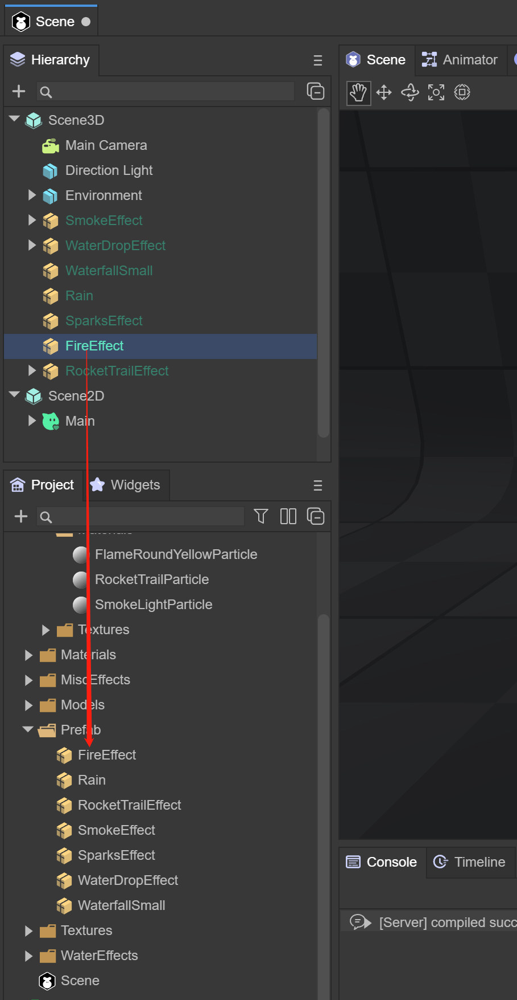 

(Figure 4.1)

Under the Scene3D scene, right-click the mouse and select Create Effects -> Particle3D. A 3D particle system is created by default, named FireEffect, and drag it to the Assets -> Prefab directory to create the prefab.

#### 4.2 Fire Sequence Frame Animation

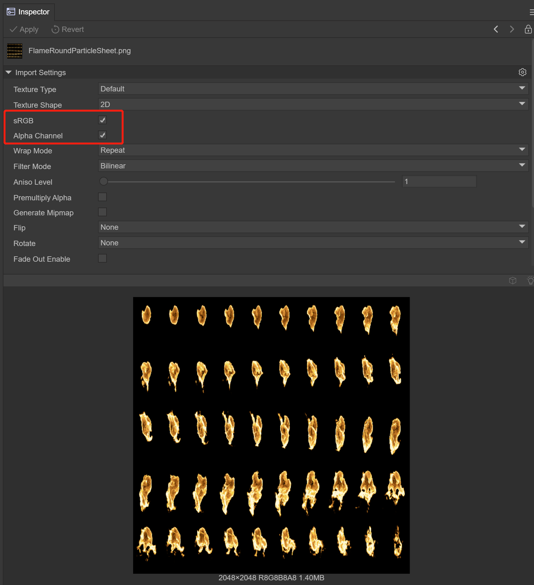 

(Figure 4.2)

Prepare the fire sequence frame animation texture file and place it in the Assets directory. Click on the texture, check sRGB and Alpha Channel. The TextureType is still Default. Click the Apply button to ensure the modification is successful.

#### 4.3 Set Fire Material

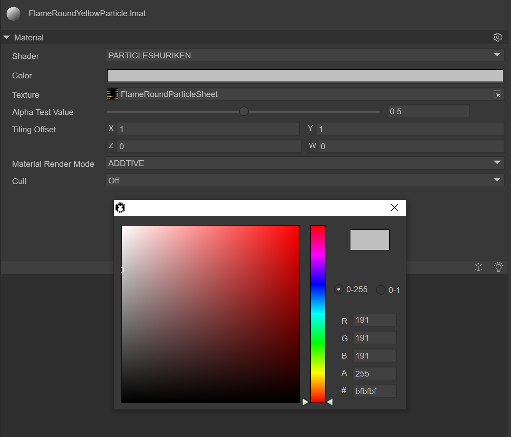 

(Figure 4.3)

Create a material under Assets, named FlameRoundYellowParticle. The Shader uses Laya.Particle. Basically, all particle effects use this Shader. Set Color to 191, 191, 191, 255, select the texture added above for texture, and select ADDITIVE for Material Render Mode.

#### 4.4 Set Particle System Rendering Module

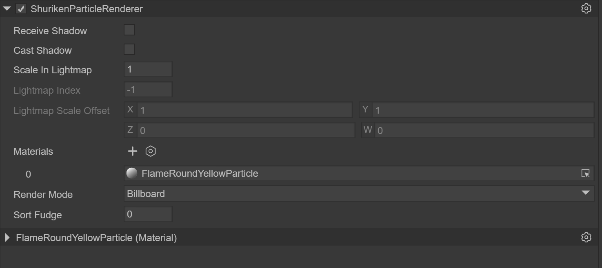 

(Figure 4.4-1)

After creating the particle system, the ShurikenParticleRenderer component is added by default in the Inspector panel. Select the FlameRoundYellowParticle material.

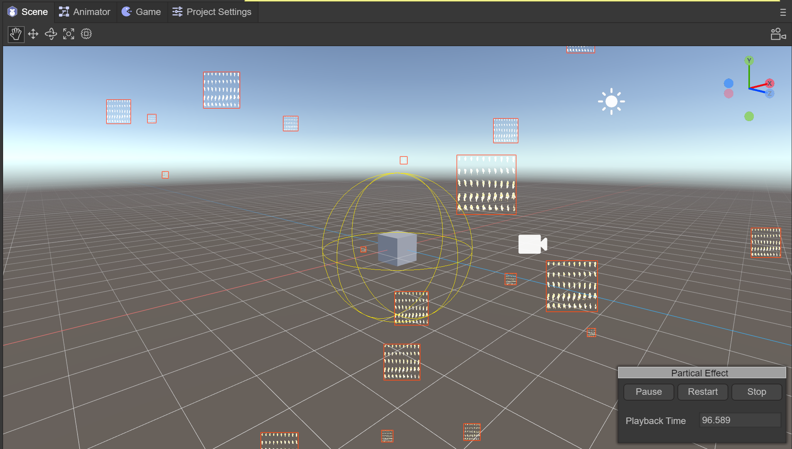 

(Figure 4.4-2)

In the Scene window, you can see that the particle effect has been changed to a texture. Further settings of the texture animation are required.

#### 4.5 Use Texture Animation

 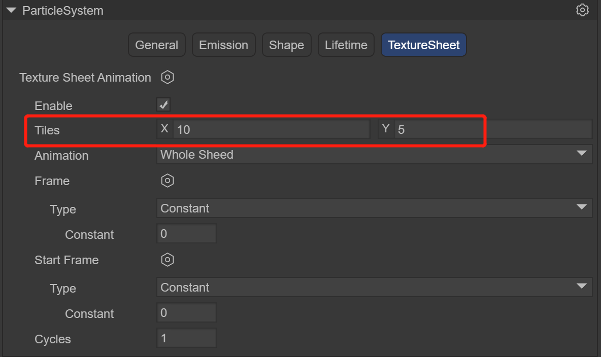 

(Figure 4.5-1)

In the TextureSheet of the particle system, create an Instance. Since the composition of the fire texture is 10x5, modify Tiles to X: 10, Y: 5 at this time. After modification, the texture of the particle system becomes a fire effect, but it is still a static image. Next, modify the Frame animation. Modify Frame -> Type to Curve, click Curve to open the panel. The horizontal axis is the timeline and the vertical axis is the frame number of the frame animation. The effect we hope for is that the fire frame animation is looped once in 1 second, that is, from 0 to 50 frames. Then we modify Curve as shown in the following figure

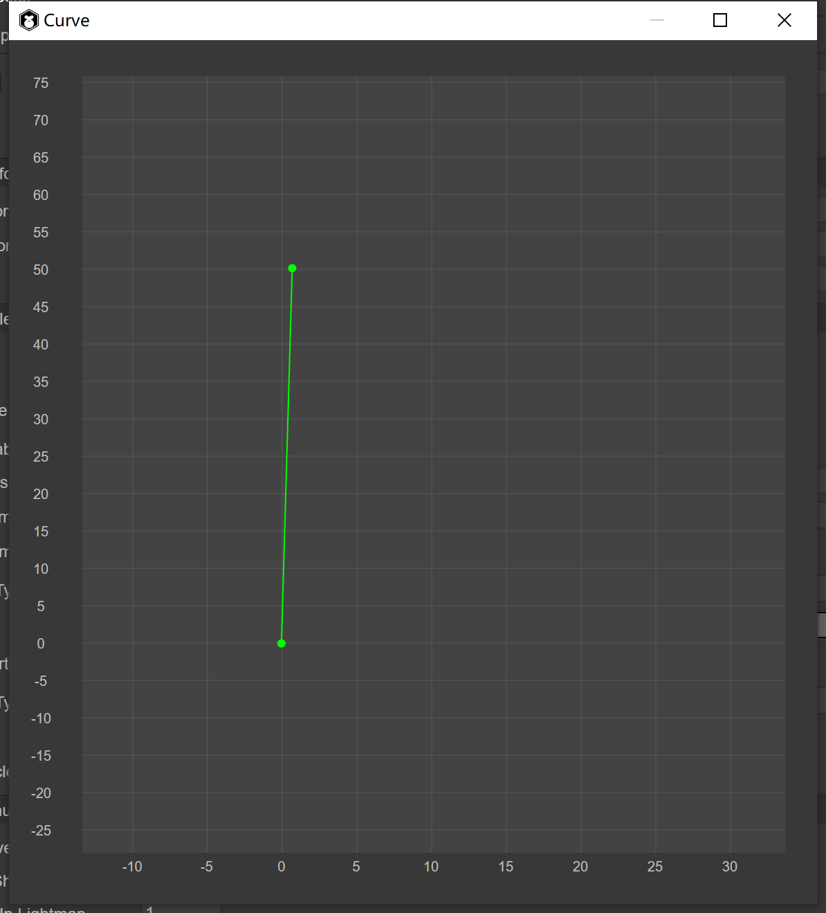 

(Figure 4.5-2)

After completing Curve, you can see that the fire effect can play the frame animation.

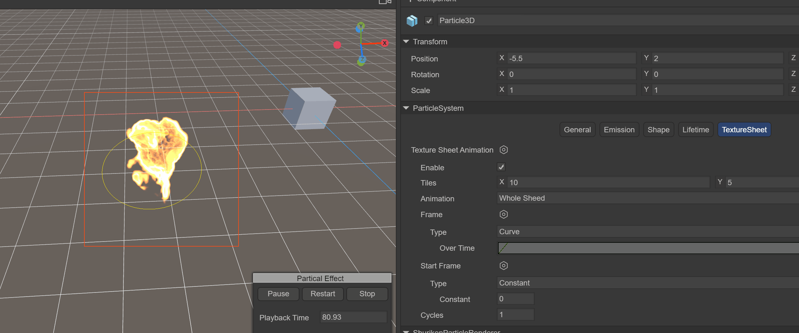 

(Animated GIF 10)

#### 4.6 Set Basic Attributes

 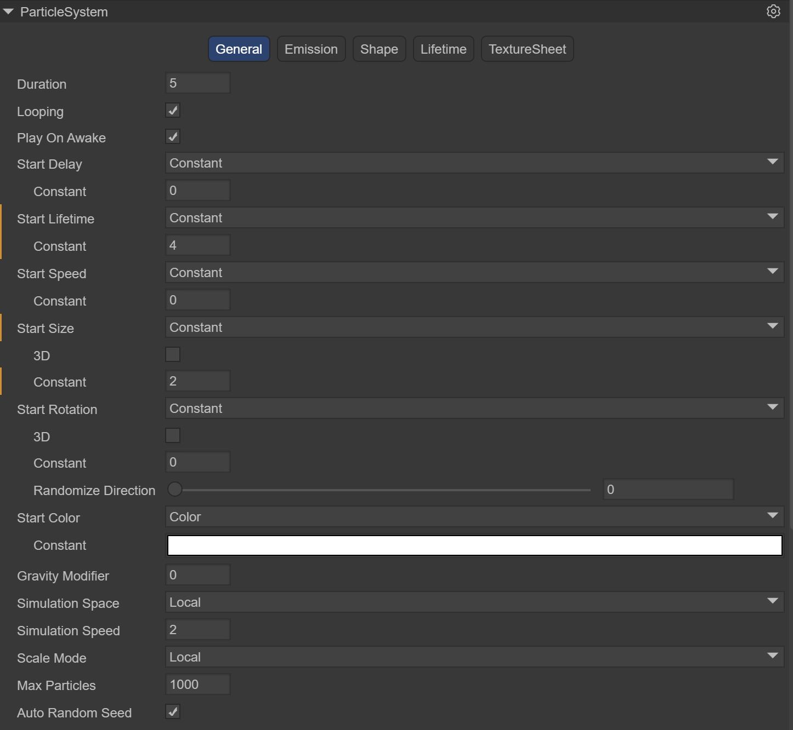

(Figure 4.6) 

The Constant of Start Speed is 0. The initial speed when the fire is emitted is 0. The Constant of Start Size is 2. Enlarge the size of the fire by 2 times. The Simulation Speed is 2, which can speed up the playback speed of the fire.

#### 4.7 Set Emitter

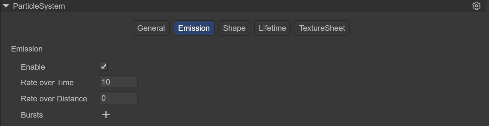 

(Figure 4.7) 

Modify the number of particles emitted per unit time to 5, which is equivalent to burning 5 flames per second.

#### 4.8 Set Shape Module

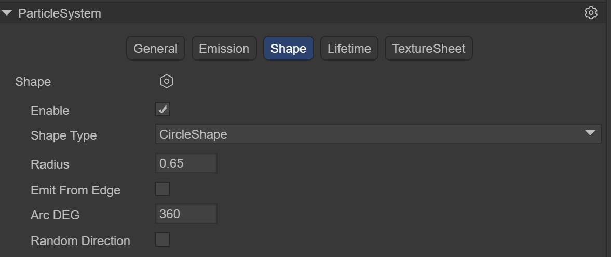 

(Figure 4.8) 

We hope that the particles are emitted within a circle to achieve the effect of the fire gathering and burning.

#### 4.9 Set Particle Lifecycle

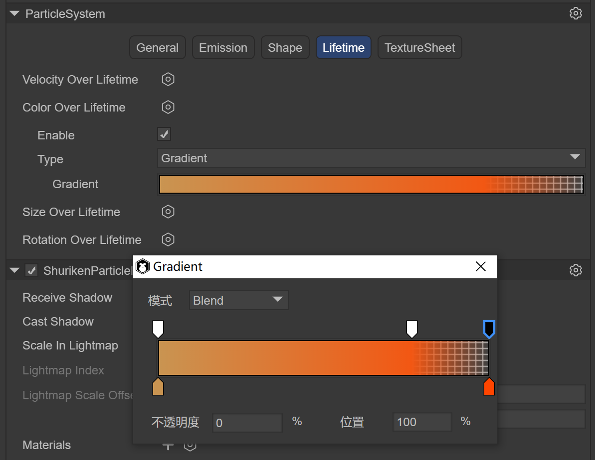 

(Figure 4.9-1) 

The most important part is to set the particle lifecycle. First, set the color process during the fire lifecycle. Create a Color Over Lifetime instance. Set Type to Gradient. Open the Gradient panel. The top 3 downward arrows indicate that the transparency of the color changes from 0% opaque -> 80% opaque -> 100% fully transparent. The bottom 2 upward arrows indicate that the color range changes from c99451 to ff4500.

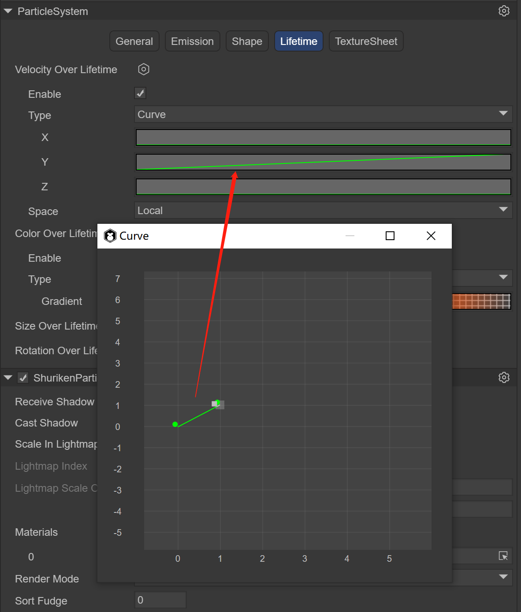 

(Figure 4.9-2) 

Since the fire is the particle moving upward and disappearing, create a Velocity Over Lifetime instance. Select Curve. Only need to modify the displacement on the Y-axis to be from 0 to 1 in 1 second, moving upward by 1 unit.

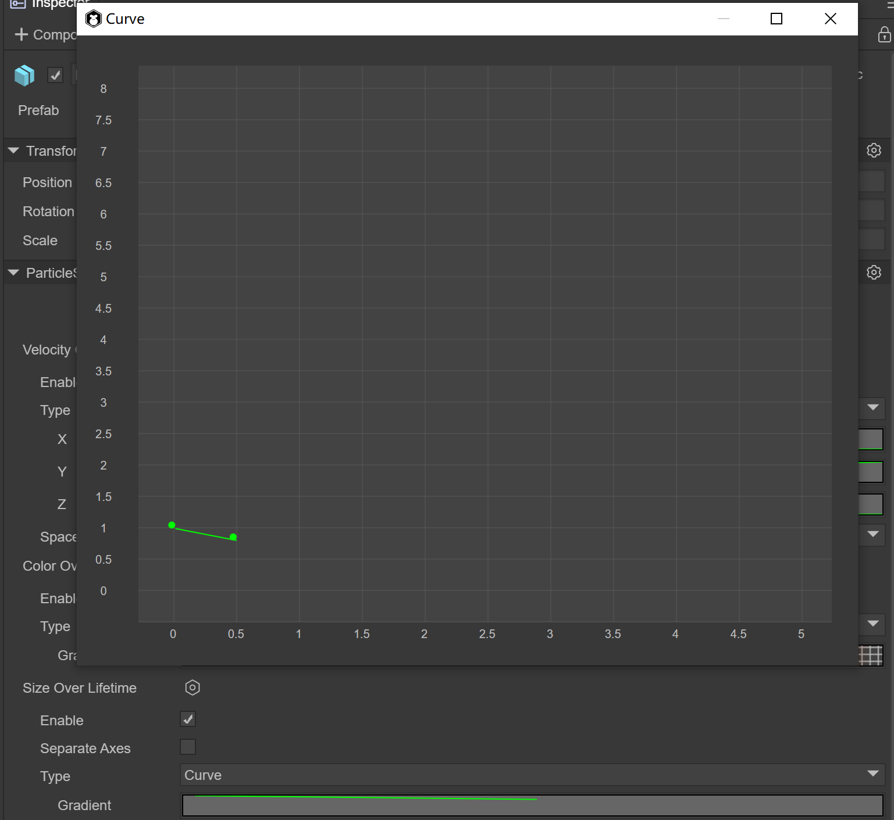 

(Figure 4.9-3) 

Since the fire will shrink in size, create a Size Over Lifetime instance. Select Curve. Only need to modify the Size from 1 to 0.5 within 0.5 seconds, shrinking by half.

 

(Animated GIF 11)

At this time, in the Scene window, it can be seen that the fire effect has been completed.

## Five. Application Scenarios and Code Examples

Often in the combat process of the game, a large number of particles need to be created, then the object pool is required. Object pool optimization is a very important optimization method in game development and is also one of the important factors affecting game performance. In the game, many objects are constantly created and removed, such as the creation and removal of character attack bullets, special effects, the elimination and refreshing of NPCs, etc. The creation process consumes a lot of performance, especially when the number is large. Object pool technology can solve the above problems well. When the object is removed and disappears, it is recycled to the object pool. When a new object is needed, it is directly taken out from the object pool for use. The advantages are to reduce the overhead when instantiating objects, and to allow objects to be reused, reducing the chances of new memory allocation and garbage collector operation.

> *Note: When the object is removed, it is not immediately erased from the memory. Only when the memory is insufficient, the garbage collection mechanism is used to clear it. When clearing, it consumes a lot of memory and is likely to cause stuttering. After using the object pool, the garbage objects of the program will be reduced, effectively improving the running speed and stability of the program.*

### 5.1 Custom Particle3D Class

```typescript
import Node = Laya.Node;
import Sprite3D = Laya.Sprite3D;
import ShuriKenParticle3D = Laya.ShuriKenParticle3D;
import ShurikenParticleSystem = Laya.ShurikenParticleSystem;
import { Pool } from "./Pool";

// The base class of particle effects, including creation, playback, pause, destruction, and cleaning of the object pool
export class Particle3D extends Sprite3D  {

    private _isInited: boolean = false;
    private _filePath: string = null;
    private _particle: Laya.Sprite = null;
    private _shuriKenParticle3D: Array<ShuriKenParticle3D>= [];
    private _shurikenParticleSystem: Array<ShurikenParticleSystem>= [];
    constructor() 
    {
        super();
    }
    
    // Create a particle effect by passing in the path of the particle effect and take one from the object pool
    static Create(path: string): Particle3D
    {
        var ret:Particle3D = Pool.getInstance().getItemByClass("Particle3D@" + path, Particle3D);
        ret.Init(path);
        return ret;
    }
    
    // Particle effect initialization
    private Init(file_path:string): void
    {
        if (this._isInited)
        {
            return;
        }
        this._filePath = file_path;
    
        console.log("Particle3D");
        // Clone one from the obtained particle system
        var res = Laya.loader.getRes(file_path);
        var particle = res.clone();
    
        this._particle = particle;
        // Get all the particle systems of this particle effect for later overall playback
        for (var i = 0, len = this._particle.numChildren; i < len; i++)
        {
            var child:Node = this._particle.getChildAt(i);
            if (child instanceof Laya.ShuriKenParticle3D)
            {
                this._shuriKenParticle3D.push(child);
                this._shurikenParticleSystem.push(child.particleSystem);
            }
        }
    
        this.addChild(this._particle);
        this._isInited = true;
    }
    
    // Particle effect playback. Since a complex particle effect consists of multiple particle systems, at this time, traverse all the particle system objects of the particle effect and call play()
    play(): void 
    {
        for (var i = 0, len = this._shurikenParticleSystem.length; i < len; i++)
        {
            var particle_system = this._shurikenParticleSystem[i];
            particle_system.simulate(0, true);
            particle_system.play();
        }
    }
    
    // Pause and resume of particle effect. Since a complex particle effect consists of multiple particle systems, at this time, traverse all the particle system objects of the particle effect and call pause() and play()
    pause(): void 
    {
        for (var i = 0, len = this._shurikenParticleSystem.length; i < len; i++)
        {
            var particle_system:ShurikenParticleSystem = this._shurikenParticleSystem[i];
            if (this._isPaused)
            {
                particle_system.play();
                this._isPaused = false;
            }
            else
            {
                particle_system.pause();
                this._isPaused = true;               
            }
        }
    }
    
    // Object pool recycling of particle systems
    Recover(): void
    {
        this.removeSelf();
        Pool.getInstance().recover(this._filePath, this);
    };
    
    // Completely destroy and clean a particle effect object
    Clean(): void
    {
        if (this.destroyed)
        {
            return;
        }
    
        this.Recover();
    
        if (this._particle &&!this._particle.destroyed)
        {
            this._particle.removeSelf();
            this._particle.destroy(true);
            this._particle = null;
        }
    
        this._shuriKenParticle3D = null;
        this._shurikenParticleSystem = null;
    
        this._isInited = false;
    
        this.destroy(true);
    };
    
    // Clear the buffer pool by passing in the path of the particle effect
    static ClearPool(root_path: string): void
    {
        if (root_path == null)
        {
            root_path = "";
        }
        Pool.getInstance().ClearGroup("Particle3D@" + root_path, this, function(particle_3d:Particle3D)
        {
            particle_3d.Clean();
        });
    }

}
```

### 5.2 Custom Object Pool Class

```typescript
export class Pool {
    
        private _poolDic:{[key: string]: any;} = {};
        private InPoolSign: string = "__InPool";
    
        constructor() 
        {
        }
    
        private static _instance: Pool = new Pool();
        public static getInstance() {
            return this._instance;
        }
    
        // Find the corresponding object pool by name
        getPoolBySign(sign:string): any
        {
            return this._poolDic[sign] || (this._poolDic[sign] = []);
        };
    
        // Recycle
        recover(sign:string, item:any): void
        {
            item["__InPool"] = true;
        };
    
        // Get an object by name. If there is no object in the object pool, create one
        getItemByClass(sign:string, cls:any): any
        {
            var ret = null;
            var pool = this.getPoolBySign(sign);
            for (var i = 0, len = pool.length; i < len; i++)
            {
                var item = pool[i];
                if (item["__InPool"] && item instanceof cls)
                {
                    ret = item;
                    break;
                }
            } 
            if (!ret)
            {
                ret = new cls();
                pool.push(ret);         
            }
            ret["__InPool"] = false;
            return ret;
        };
    
        // Clear a group of object pools by name
        ClearGroup(head_sign:string, caller:any, func:Function): void
        {
            for (var key in this._poolDic)
            {            
                if (key.indexOf(head_sign) == 0)
                {
                    var pool = this._poolDic[key];
                    if (func)
                    {
                        for (var i = 0, len = pool.length; i < len; i++)
                        {
                            var item = pool[i];
                            func.call(caller, item);
                        }
                    }
                    pool.length = 0;
                }
            }
        };
    
        // Clear all object pools
        ClearAll(caller:any, func:Function): void
        {
            for (var key in this._poolDic)
            {            
                var pool = this._poolDic[key];
                if (func)
                {
                    for (var i = 0, len = pool.length; i < len; i++)
                    {
                        var item = pool[i];
                        func.call(caller, item);
                    }
                }
                pool.length = 0;
            }
        };
}
```

### 5.3 Code Invocation

```typescript
const { regClass, property } = Laya;
import { Particle3D } from "./Particle3D";

@regClass()
export class Main extends Laya.Script {

    // The path of the particle effect
    private filePath = "FireEffect";
    onStart() {
        console.log("Game start");  
        // Load the particle effect resource
        Laya.loader.load(this.filePath, Handler.create(this, () => {    
        }));        
    }
    
    // Every time the mouse is clicked on the screen, a special effect will be created
    mouseDown(e: Event): void {
        var particle = Particle3D.Create(this.filePath);
        this.owner.addChild(particle);             
    }
    
    // When the mouse is lifted, the object pool will be released
    mouseUp(e: Event): void {
        Particle3D.ClearPool(this.filePath);      
    }    
}
```