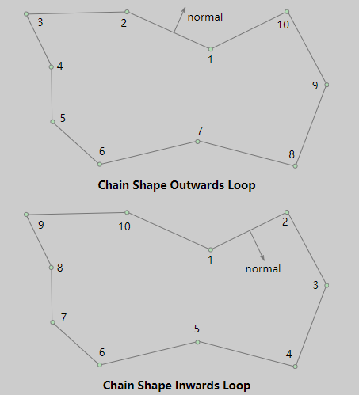
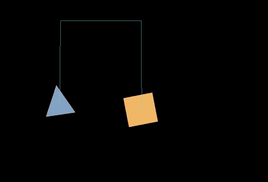

## Detailed explanation of LayaAir3-IDE visual 2D physical editing

> Author : Charley 	Version >= LayaAir 3.1
>

## 1. A must-read for novices

### 1.1 Preface

This article covers the entire content of visual editing in 2D physics IDE, which means that you can complete physical configuration and effect implementation through visual operations without writing a single line of code.

If you are new to the physics engine, this article will inevitably involve some basic concepts related to physics. The document will explain it as briefly as possible to let everyone understand the functions and effects.

However, the focus of this article is to introduce the role and use of the engine physical component attributes. For the sake of document coherence, overly basic concepts may not be described in too much detail.

At this time, if you do not understand a certain basic concept or want to understand it further, you need to search for basic knowledge related to tutoring based on keywords.

### 1.2 What you need to know about the length of the physics engine (required reading)

> The LayaAir3 engine has built-in support for Box2D physics engine version 2.4.1. All contents of this document are based on this version of the physics engine.
>

In the Box2D physics engine, the unit of length is an abstract concept. The physics engine only cares about relative length and proportional relationships, and does not care about the specific actual physical units.

Therefore, this is not intuitive for developers. For intuitive expression, the LayaAir3 engine IDE converts 1 length unit in the physics engine into 50 rendering pixels by default.

Moreover, the length conversion ratio setting is opened in the project settings. Developers can make adjustments independently according to the actual needs of the project. The adjustment position is shown in Figure 1:


(figure 1)

> This setting is different from the native Box2D physics engine and versions before LayaAir3.1. Old users who have used older versions of the engine should pay special attention.

## 2. RigidBody

### 2.1 Add rigid body component

#### 2.1.1 What is a rigid body

As we all know, all tangible substances in nature can be called objects.

**Rigid body** is a scientific abstract concept in mechanics in order to reflect the characteristics of an object. It is also an ideal mechanical expression model. **It means that the shape and size remain unchanged during motion and after being acted upon by force, and An object whose relative positions of internal points remain unchanged. **

> This ideal model cannot exist in reality. After an object is subjected to force, it will decide whether or how much to change based on comprehensive factors such as force, material, elasticity, and plasticity. If the change of the object itself does not affect the entire motion process, in order to simplify the problem under study, the object is still treated as a rigid body and the volume and shape of the object are ignored. In this way, the obtained results are still quite consistent with the actual situation.
>

The 2D rigid body component class in the LayaAir engine is `Laya.RigidBody`, which inherits from the base class Component that creates components.

#### 2.1.2 How to add rigid body components

In LayaAirIDE, we can directly add rigid body components to 2D nodes. As shown in animation 2-1.


(Animation 2-1)

> In actual use, it is rare to add rigid bodies separately, because when adding collision bodies and joints, rigid bodies will be added automatically.

### 2.2 Rigid body type `type`

The rigid body type `type` of the Box2D physics engine is divided into:

Static rigid body `static`, dynamic rigid body `dynamic`, kinematic rigid body `kinematic`, the default is dynamic rigid body `dynamic`. As shown in Figure 2-2.

  

(Figure 2-2)

#### 2.2.1 Static rigid body `static`

**Static Rigid Body** is usually used to represent immovable objects, such as floors, walls, etc. The mass and inertia of static rigid bodies are infinite, so they are not affected by external forces and do not exert forces on other rigid bodies.

The characteristics of a static rigid body are: **always stationary**, will not move no matter what force is applied, **not affected by gravity**, **speed is zero and cannot be set**.

#### 2.2.2 Dynamic rigid body `dynamic`

**Dynamic Rigid Body** is the most common type of rigid body and is used to represent objects that can move and be affected by external forces, such as characters, spheres, etc. Dynamic rigid bodies have mass and inertia and move and rotate in response to external forces and torques.

The characteristics of dynamic rigid bodies are: **will move according to the force received**, **will be affected by gravity, and the speed can be set. **

#### 2.2.3 Kinematic rigid body `kinematic`

 Kinematic rigid bodies are between static and dynamic types. They are not affected by external forces, but can move by setting linear and angular velocities rather than being directly acted upon by external forces. Kinematic rigid bodies are usually used to control joints, platforms, etc.

The characteristics of kinematic rigid bodies are: **does not move according to the force received**, **is not affected by gravity, and can set the speed. **The main difference from a static rigid body is that it usually moves by setting the speed (linear speed and angular speed).

#### 2.2.4 Comparison table of characteristics of three rigid body types

|              	| Static rigid body	| Dynamic Rigid Body	| Kinematic Rigid Body	|
| ---------------- | -------------------------- | ---------------- | -------------- |
| Whether affected by external forces | Stationary and not affected by external forces | **Affected by external forces** | Not affected by external forces |
| Whether it is affected by gravity | Not affected by gravity	| **Affected by gravity** | Not affected by gravity |
| Whether the speed can be set | The speed is zero and **cannot be set** | The speed can be set	| Settable speed	|

### 2.3 Gravity

#### 2.3.1 What is gravity

Gravity is a fundamental force of nature, the mutual attraction between objects due to their mass. According to the law of universal gravitation, the gravitational force between two objects is directly proportional to their masses and inversely proportional to the square of the distance between them. Near the Earth's surface, the Earth's mass causes objects to experience a gravitational pull toward the Earth's center, giving them a downward acceleration, usually defined as 9.8 meters/second².

In physics engines, gravity is one of the key factors in simulating the gravitational effects experienced by objects in the real world. By simulating gravity, the physics engine can cause objects to be pulled, fall to the ground, or roll on an incline in accordance with natural laws in the simulation environment. The engine usually uses the object's mass and a predefined gravity acceleration value to calculate the gravitational force on the object. These calculations can be based on Newton's laws of classical mechanics by using discrete time steps to simulate the motion of an object.

The concept of gravity in the physics engine involves the calculation of forces, mathematical models of motion, and time stepping of simulations. By realistically simulating gravity, the physics engine provides a more realistic virtual environment, making it easier for developers to create games or other applications with natural physics.

#### 2.3.2 Global gravity parameter setting `gravity`
$$
The expression of gravity is: F = m ⋅ g　 (where F is the gravity of the object, m is the mass of the object, and g is the acceleration due to gravity.)
$$

In the LayaAir3-IDE project settings, the `Gravity Acceleration` under the 2D physics group is a global parameter setting for the entire 2D physical gravity. This setting supports gravity settings in both the X and Y directions. The default is the positive direction of the Y axis (vertical downward) gravity acceleration value is 9.8. As shown in Figure 3-1:


(Figure 3-1)

Under the same circumstances, the greater the value of gravity acceleration, the faster the object affected by gravity will fall.

#### 2.3.3 Gravity scaling coefficient `gravity Scale`

In addition to the global gravity acceleration parameter settings, the gravity scaling coefficient attribute of the rigid body is a parameter used to independently affect the gravity effect of a single dynamic rigid body.

This value is multiplied by the gravity value to get the final value of the current rigid body affected by gravity. The value can be positive or negative, including positive and negative decimals. The default value is 1, which is normal global gravity, as shown in Figure 3-2.


(Figure 3-2)

A value of 0 means there is no gravity. A value greater than 1 represents a multiple of normal gravity. The larger the value, the greater the gravity. If the value is negative, it means gravity in the opposite direction. The smaller the value, the greater the gravity in the opposite direction. As shown in animation 3-3.

![Here is a comparison animation of different parameters of the gravity effect: decimals, multiples, forward and reverse gravity] (img/3-3.gif)

(Animation 3-3)

> Note: If you want the rigid body to be affected by gravity, you need to add a collision body physics component.

### 2.4 Angular velocity `angularVelocity`

Angular velocity is the rotation speed of an object around its center of mass. It is a physical quantity that represents the angular displacement per unit time. The standard international unit is radians per second.

Starting from LayaAir 3.1, in order for users to understand and set it more intuitively, you can directly set it to the angle value. For example, set to 90, as shown in Figure 4-1, which means that the speed per second is the radian value corresponding to an angle of 90 degrees.


(Pic 4-1)

When we set the angular velocity attribute to a positive value, it will rotate clockwise. When the angular velocity attribute is negative, it rotates counterclockwise. The greater the absolute value of the attribute value, the faster the rotation speed. The default value of the angular velocity attribute is 0, which means there will be no rotation. The effect is shown in Figure 4-2.


(Animation 4-2)

### 2.5 Angular damping `angularDampin`

In reality, rotating objects usually slow down gradually due to external resistance.

Angular damping is a parameter used to simulate the gradual deceleration of a rigid body during rotation. It is used to represent the gradually declining attenuation characteristics caused by external effects or self-causes.

Specifically, the angular damping of a rigid body is the rotational damping coefficient relative to the angular velocity, which means that angular damping will cause the rotation speed of the rigid body to gradually decrease. By adjusting this value, you can control how much the rigid body decelerates during rotation. The default value is 0, which means no damping.

There is a comparison effect without corner damping, as shown in animation 5.


(Animation 5)

### 2.6 Linear velocity `linearVelocity`

Linear velocity, also referred to as linear velocity, refers to the speed of a rigid body along a straight path in motion, regardless of its rotation.

This attribute is represented by a two-dimensional vector, describing the linear velocity components of the rigid body along the X (horizontal direction) and Y axis (vertical direction) respectively. Starting in 3.1, these two components are in pixels.

Moreover, the vector value is also a vector value, including magnitude and direction.

The actual magnitude of the linear velocity is calculated through the Pythagorean theorem (the root of X square plus Y square), and its magnitude indicates how fast the object is moving. For example, if X is 3 and Y is 4, the magnitude of the linear velocity is 5, which is 5 pixels/second. The calculation formula is shown in Figure 6-1.


(Figure 6-1)

The direction of the linear velocity represents the direction in which the object moves along a straight line. The physics engine obtains the angle by calculating the arctangent (`Math.atan2`) value of the Y component and the X component of the linear velocity vector. This angle reflects the velocity vector relative to the X axis. direction. The calculation formula is shown in Figure 6-2.


(Figure 6-2)

The default value is 0, which means no linear motion is performed when no force is applied. The linear speed effect is shown in animation 6.


(Animation 6-3)

### 2.7 Linear Damping `linearDamping`

Linear damping is usually related to the motion of a rigid body (RigidBody). During the motion of a rigid body, in addition to external forces, it may also receive a damping force proportional to its speed, which is called a linear damping force. The introduction of linear damping can simulate the phenomenon that when an object moves in fluid or air, it gradually slows down and eventually stops due to the obstruction of the medium.

Developers can adjust the strength of the linear damping force experienced by the rigid body during motion by setting the **Linear Damping** property of the rigid body. Ranges from 0 to infinity. The default value is 0, which means no damping. The effect with or without damping is shown in animation 7.


(Animation 7)

> Typically, the damping value is set between 0 and 1
>

### 2.8 Bullet `bullet`

When objects move at very high speeds, traditional collision detection may not be able to accurately capture the occurrence of collisions, leading to problems such as tunneling. This is because between the two time steps of collision detection, the object may have moved a large distance and left the detection range. In this case, enabling the bullet attribute becomes very important.

As shown in animated picture 8, after enabling the bullet attribute, the physics engine uses a more accurate collision detection algorithm (continuous collision detection CCD), which can accurately detect collisions even when moving at high speed. However, the rigid body with elastic properties not turned on exhibits tunneling phenomenon when moving at high speed.


(Animation 8)

In addition to avoiding tunneling, bullet attributes can also be used to avoid errors that may occur when high-speed moving objects collide (such as rebound or rotation errors), and to avoid high-speed rigid bodies that may cause violent impacts to other dynamic rigid bodies in the physical world. This will affect the stability of the entire physical world and other issues.

However, it should be noted that checking Enable Bullet Properties will increase the computational burden of the physics engine. Because more accurate collision detection requires more computing resources. Therefore, it is recommended to only enable this property for rigid bodies that really need to move at high speeds to avoid unnecessary performance overhead.

### 2.9 Rigid body sleep

When the physics engine performs motion simulation, there is a performance consumption. When the rigid body stops moving, we actually don't need to simulate it. If a rigid body is set to sleep state, the simulation of the rigid body will be skipped and it will not wake up until it is released by other rigid bodies (joints are destroyed or manually awakened), thus saving performance consumption.

#### 2.9.1 Allow sleep `allowSleep`

As shown in Figure 9-1, check `Allow sleep`. When the rigid body does not move for a long time or is subject to external force, the physics engine will put it into a sleep state. Allowing rigid bodies to sleep can reduce unnecessary calculations and improve performance.


(Figure 9-1)

But resuming from hibernation to computing may also result in a lack of immediate response. Whether to enable hibernation depends on specific needs and performance tradeoffs. In most cases, enabling hibernation is usually a reasonable choice.

#### 2.9.2 Global rigid body sleep function switch

In addition to the dormant properties of the rigid body component, there is also a switch for the rigid body function globally (project settings panel), as shown in Figure 9-2.


(Figure 9-2)

It should be noted that only the global **rigid body sleep function switch** is **checked** enabled, and **individual rigid bodies can set whether to allow sleep**.

Otherwise, if the global check is unchecked, it means that all rigid bodies must not sleep. It is recommended to keep the global default enabled here.

### 2.10 Allow rotation `allowRotation`

The "allowed rotation" of a rigid body means that when a force or impact acts on the rigid body, it will naturally rotate according to the rules of physics. This rotation can provide more realistic physical interactions, such as natural rolling when vehicles collide or objects fall. As shown in animation 10-1.


(Animation 10-1)

If the default check of `Allow rotation' is removed, the rigid body is forced to remain non-rotated during the entire physical simulation process, no matter what kind of mechanics is applied to it. Such settings are also useful in certain game designs. For example, in some scenes that require a rigid body to move only along a specific axis or maintain a specific posture, disabling rotation can simplify the physical response and make the game experience more direct and controllable. As shown in animation 10-2. However, it is important to note that this unnatural physical limitation may make the results of a collision look less realistic.


(Animation 10-2)

In addition, in situations where performance requirements are high, turning off unnecessary object rotation may also help improve the efficiency of physics simulations, especially when dealing with large numbers of objects.

### 2.11 Collision-related properties

#### 2.11.1 Collision group `group`

For each rigid body, we can assign an integer collision group index value. Determine whether two rigid bodies should collide through the index comparison rules of the collision group.

The collision group rules are as follows:

1. If the collision group indices of two rigid bodies are equal and both are greater than zero, they will always collide.

2. If the **collision group** indexes of two rigid bodies are equal** but both are less than zero, they will never collide.

3. If the **collision group** index** of the two rigid bodies is equal to 0**, or the **collision group index** is not equal**, the detection of the collision behavior no longer relies on the index of the collision group. value, but uses the rigid body's collision class and collision mask to determine whether to collide.

#### 2.11.2 Collision category `category`

The collision category is used to specify which collision category a rigid body belongs to. The value of this **category** usually **uses the N power of 2 as the attribute value**, and the range is [1, 2^31], with a maximum of 32 Different collision categories are available.

| exponent | 2 raised to the N power | exponent | 2 raised to the N power | exponent | 2 raised to the N power | exponent | 2 raised to the N power |
| ---- | -------- | ---- | -------- | ---- | -------- | ---- | ---------- |
| 0	| 1    	| 8	| 256  	| 16   | 65536	| 24   | 16777216   |
| 1	| 2    	| 9	| 512  	| 17   | 131072   | 25   | 33554432   |
| 2	| 4    	| 10   | 1024 	| 18   | 262144   | 26   | 67108864   |
| 3	| 8    	| 11   | 2048 	| 19   | 524288   | 27   | 134217728  |
| 4	| 16   	| 12   | 4096 	| 20   | 1048576  | 28   | 268435456  |
| 5	| 32   	| 13   | 8192 	| 21   | 2097152  | 29   | 536870912  |
| 6	| 64   	| 14   | 16384	| 22   | 4194304  | 30   | 1073741824 |
| 7	| 128  	| 14   | 32768	| 23   | 8388608  | 31   | 2147483648 |

#### 2.11.3 Collision mask `mask`

The collision mask is used to declare which collision categories the current rigid body may collide with other rigid bodies.

##### Collision rules:

When the **collision group** index** of the two rigid bodies is equal to 0**,** or the **collision group index** is not equal**, the collision category and collision mask of the rigid body are `bitwise AND` If the calculation result is non-0, collision is possible; if it is 0, collision is not possible.

For example, the collision category is 2 (10 in binary), the collision mask is 3 (11 in binary), and the binary bitwise AND operation is performed, as shown in Figure 11-1:


(Figure 11-1)

From Figure 11-1, we can see that 10 is the result of the binary `bitwise AND` bit operation, and the decimal corresponding value of 10 is 2, non-0, so the above example can collide.

When developers set uncommon values, they can use the `&` operator to calculate directly with decimal numbers in tools such as the Devtools console to confirm the collision relationship, as shown in Figure 11-2:


(Figure 11-2)

##### The meaning of the mask default value -1:

The default value of the collision mask is -1, as shown in Figure 11-3:


(Figure 11-3)

The bitwise AND operation of -1 (all binary bits are 1) with any Nth power value of 2 is the power value itself, **non-0**, and **can collide**.

So, the equivalent of the default is that everything can collide.

##### Specify a mask for collision targets:

If you want to specify a specific rigid body as the collision target, and which category of rigid body you want to touch, just directly set the `collision category' value for the `collision mask`.

Sometimes, we need to specify a common collision mask for multiple collision categories (different rigid bodies).

In principle, we can directly calculate multiple collision categories through `bitwise OR`, and the result is a collision mask, as shown in Figure 11-4:

  

(Figure 11-4)

Through observation of the above figure, careful developers may find that the result obtained by `bitwise OR` is the sum of the collision categories.

Although it is essentially a binary bit operation, in order to quickly set the collision mask, it is also possible to directly understand the sum of the collision categories of the power of 2 as a collision mask.

> If the collision category is not a power of 2, it cannot be understood as a summation. This is one of the reasons why the value of the collision category is set to a power of 2.

##### Mask to exclude collision targets:

The previous article introduced how to specify who we want to collide with. If we don’t want to collide with certain collision types of rigid bodies, how do we set the mask?

The answer is, use -1 to `XOR` to operate any Nth power value of 2, and then perform a `bitwise AND` operation with the power value to obtain the result. It must be **0**, that is, **not Can collide**.

The calculation process to verify this theory is shown in Figure 11-5:

  

(Figure 11-5)

Through the XOR binary method, we can quickly specify the collision rigid bodies to be excluded. For example, -25 in Figure 11-5 can exclude rigid bodies with collision categories 8 and 16, and other rigid bodies can collide.

In order to simplify understanding and quickly design, the XOR operation also has a simple mask value method. That is to add +1 to the sum of the collision categories to be excluded, and then take the negative value.


## 3. Collider `collider`

The LayaAir engine and IDE encapsulate a collider that is easier to understand and use based on the shape of the Box2D physics engine. The following is an introduction to the LayaAir3 collision body.

### 3.1 Relationship between collision body and rigid body

Collider, as the name suggests, is a shape component used to detect collisions.

**Rigid Body** is the carrier of the collision body. It defines the physical properties of an object (such as rigid body type, gravity, speed, etc.), while **Collision Body** defines the collision shape of the rigid body and its interaction with other objects. physical properties (such as density, friction, etc.).

In the physical world, collision detection and response are actually colliders. If there is no shape area of ​​the collider and only a rigid body, the collision effect cannot be produced.

A rendering node object can have multiple colliders of different shapes, but can only have one rigid body.

### 3.2 Collider base class properties

Colliders all inherit from the collider base class `ColliderBase` and have common base class properties.

Therefore, let's first introduce the common attributes and base class attributes. The unique properties of each collision body will be introduced later.

#### 3.2.1 Offset

The offset of the collider refers to the offset value of the collider shape relative to the coordinates of the node it belongs to. The default values ​​of XY are 0, which is consistent with the node coordinates, as shown in Figure 12-1.

 

(Figure 12-1)

#### 3.2.2 Friction coefficient `friction`

The coefficient of friction is a dimensionless ratio that describes the relative sliding resistance between two contact surfaces and is defined as the ratio of the friction force to the normal force on the two surfaces.

In game development and physics simulation, the friction coefficient is used to ensure the realism and accuracy of object movement. Commonly used values ​​are between 0 and 1, with 0 indicating no friction and 1 indicating strong friction.

For very smooth surfaces (such as ice), the friction coefficient may be close to 0.01; for contact surfaces in daily life, such as rubber and dry pavement, the friction coefficient may be between 0.1 and 1; animated figure 12-2 demonstrates different frictions The effect of the coefficient.


(Animation 12-2)

#### 3.2.3 Recovery coefficient `restitution`

The coefficient of restitution is a property that describes the elasticity of an object during a collision. We can imagine playing table tennis, basketball, etc., and using the recovery properties to make them pop or bounce.

Specifically, the coefficient of restitution represents the proportion of the speed at which an object bounces back upon a collision relative to its speed before the collision. When two objects collide, the relative speed between them affects the outcome of the collision. If the restitution coefficient is 1, it means that the collision is completely elastic, and the objects will rebound at the same speed; and if the restitution coefficient is 0, it means that the collision is inelastic, and the objects will stop after the collision. The effect is shown in Figure 12-3:


(Animation 12-3)

#### 3.2.4 Density `density`

The density property defines the mass per unit area of ​​an object. The role of density is that it can affect multiple physical properties in the game, such as mass, inertia, buoyancy, etc.

>In reality, density is the ratio of an object's mass to its volume. But in the two-dimensional world, since one dimension is missing, area is used instead of volume to simplify calculations.

The density value can be zero or a positive number. If it is zero, the mass will be zero regardless of the area of ​​the shape. This will cause the physical response to be similar to a static rigid body and will not be affected by external forces or gravity.

Density values ​​are usually positive numbers. The greater the density value, the greater its mass under the same area. A density that is too small may cause the object to behave unstable, while a density that is too large may cause the object to be extremely massive and computationally expensive. Properly setting density is crucial to achieve realistic physics simulation, and the default value within the IDE is 10. The contrast effect of different densities is shown in the animation 12-4:


(Animation 12-4)

> When producing multiple objects stacked together, it is recommended to use similar densities. This can make the stack more stable.
>

#### 3.2.5 Whether it is a sensor `isSensor`

When the interaction logic needs to determine whether two colliders collide, but there is no need for a collision reaction. At this time, it can be done through sensors.

After checking this attribute and setting it as a sensor, collision events with other objects can be detected, but there will be no physical collision impact on these objects.

For example, it can be used to detect whether a character reaches a certain area to cause a change in game behavior, or to trigger specific effects such as sounds and animations.

There are different effects depending on whether it is set to the sensor, as shown in the animation 12-5:


(Animation 12-5)

#### 3.2.6 Label `label`

The label of the collision body is used to identify the collision body in scripted physical collision events. When the label name is customized, it is shown in Figure 12-6.


(Figure 12-6)

Sample code to deal with:

```typescript
	onTriggerEnter(other: any): void {
    	//other is the collided object, and the corresponding logic is processed according to the collided label.
    	if (other.label === "buttle") {
        	//After colliding with the bullet, increase points and play sound effects
        	//Omit some code...
    	} else if (other.label === "ground") {
        	//As soon as a box hits the floor, stop the game
        	//Omit some code...
    	}
	}
```

#### 3.2.7 Edit Collider Shape

Click to edit the shape of the collider, which will allow the collider to enter a visual editing state in the scene panel. You can offset its overall position or change its width and height. When the mouse leaves the range of the collider and node, the edit mode will automatically exit. Edit again. The button needs to be clicked again. The demonstration effect is shown in the animation 12-7:


(Animation 12-7)

### 3.3 Rectangular Collider `BoxCollider`

> The public attributes are described in the `collision body base class attributes` above and will not be introduced again in this section.

#### 3.3.1 Width and height `Size`

A rectangular collision body is a closed right-angled parallelogram collision box.

Width and height are unique attributes of the collision body. As shown in Figure 13-1, the size of the collision body can be changed by setting the width and height.

  

(Figure 13-1)

#### 3.3.2 Automatic adaptation of size `autoFit`

After the width and height of the node to which the collision body belongs changes, the size of the collision body will not automatically change accordingly.

Automatic size adaptation means that you can use this button to set the width and height of the node to the width and height of the collision body with one click. As shown in Figure 13-2.


(Figure 13-2)

### 3.5 Circular Collider `CircleCollider`

> The public attributes are described in the `collision body base class attributes` above and will not be introduced again in this section.
>

#### 3.5.1 Radius `radius`

A circular collider is a collision shape used to simulate round objects. It is usually a closed circular box consisting of a center point and a radius.

The **radius** is a unique attribute of the circular collision body. Its size is controlled by the radius. The larger the radius, the larger the circular frame of the collision body. The effect is shown in animation 14-1:


(Animation 14-1)

#### 3.5.2 Automatic adaptation size `autoFit`

The automatic adaptation size of circular collider is different from that of rectangular collider.

After clicking Auto Adapt Size, not only will half of the shortest side of the node width and center be used as the radius, but the anchor point value of the node will also be modified to 0.5.

The advantage of this is that the upper left corner of the node is no longer used as the center point, making it more in line with the common requirements of circular collision bodies. The effect is shown in Figure 14-2.

![Automatically adapt the size first, then modify the width and height, then click Adapt Size to demonstrate the radius adaptation effect, and then modify the radius to see the effect after modifying the anchor point] (img/14-2.gif)

(Animation 14-2)

### 3.6 Polygon Collider `PolygonCollider`

> The public attributes are described in the `collision body base class attributes` above and will not be introduced again in this section.

#### 3.6.1 Settings of polygon point data set `datas`

Polygonal Colliders are used to represent convex polygonal objects composed of multiple vertices. The number of vertices cannot be less than 3 and cannot exceed 8. Polygonal colliders can be used to simulate various planar objects, such as boxes, triangles, or other polygon-shaped objects. Click the point data list button on the right side of `Point Data Set` to set the coordinates (XY) of each vertex through the pop-up panel, as shown in Figure 15-1.


(Figure 15-1)

> The polygonal collider must form a convex shape. If concave polygons must be used, they can be combined and spliced ​​by multiple colliders. Forcing concave polygons may lead to inaccurate or incorrect collision results.
>

#### 3.6.2 Visualizing Set Point Dataset

In addition to accurately setting the data in the pop-up window, we can also visually edit the vertices, or first visually edit the rough basic shape, and then accurately correct it in the data set pop-up window.

To enter the visual editing collision state, first click on the 'Edit Collision Body Shape' at the top of the collision body properties to enter the editing mode of the collision body shape. At this point, you can use the left mouse button, hold down the vertex and drag to change the position of the vertex.

If you want to add vertices, you can hold down `ctrl` and left-click the edge of the collider shape.

If you want to delete a vertex, hold down the `Atl` left mouse button and click on the vertex of the collider.

The effect is shown in Figure 15-2:


(Animation 15-2)

### 3.7 Chain Collider `ChainCollider`

> The public attributes are described in the `collision body base class attributes` above and will not be introduced again in this section.

#### 3.7.1 The main differences between chain collider and polygonal collider

If the chain collider is closed, a polygon with the same appearance is constructed. On the surface, it is no different from the polygon collider, and is also composed of multiple vertices.

However, regardless of whether the chain collider is closed or not, the collider has no area, no mass, and cannot be affected by gravity or collision force, which is completely different from the characteristics of the polygonal collider.

Therefore, chain colliders are usually used for static rigid bodies. Used to create irregular or complex ground, such as mountain outlines or polyline paths.

In addition, in the Box2D engine, when two parties collide, at least one of them must have an area shape, but the chain collider obviously does not. That is to say, when the chain collider collides with other solid shapes (rectangle, circle, polygon ) can collide, but will not collide with non-entity colliders (chain colliders and edge colliders).

#### 3.7.2 Settings of chain point data set `datas`

A chain collider is usually composed of a series of line segments connected by vertices, forming an open or closed chain. This structure does not fill the middle area, it only defines the boundaries of the object.

The data set of the chain collider is set in the same way as the polygon. Click the point data list button on the right side of the point data set to set the coordinates of each vertex through the pop-up panel. There is no picture here.

It is important to remind that the chain collider consists of at least 2 point line segments, usually 3 or more. Line segments of chain-shaped collider cannot intersect through each other. As shown in Figure 16-1.


(Figure 16-1)

> Self-intersection can make it difficult for the physics engine to determine the exact behavior of a collision, making it impossible to clearly distinguish which part should be above or below another.

#### 3.7.3 Visualizing Set Point Dataset

Like the polygonal collider, in addition to accurately setting the data in the pop-up window, we can also visually edit the vertices, or first visually edit the rough basic shape, and then accurately correct it in the data set pop-up window.

To enter the visual editing collision state, first click on the 'Edit Collision Body Shape' at the top of the collision body properties to enter the editing mode of the collision body shape. At this point, you can use the left mouse button, hold down the vertex and drag to change the position of the vertex.

If you want to add vertices, you can hold down `ctrl` and left-click the edge of the collider shape.

If you want to delete a vertex, hold down the `Atl` left mouse button and click on the vertex of the collider.

It should be noted that since the entity of the chain collider is only the line segment itself, even the closed chain collider does not fill the interior, so in edit mode, only the line segment can be dragged and moved, and vertices can be added or deleted. After leaving the width and height range of the node display object, as long as you do not click on the line segment, you will leave the edit mode. So perform editing operations within the node range as much as possible.

The effect is shown in Figure 16-2:

![Demonstrates the operations of changing vertex positions, adding vertices, and deleting vertices, and clicking on non-line segments within the shape outside the node to leave the editing mode] (img/16-2.gif)

(Animation 16-2)

#### 3.7.4 Closing `loop`

Although chain colliders are typically used to create open, unclosed shapes, such as the edges of roads or rivers.

But there will also be closure requirements. For example, when all collision feedback needs to occur only within a rectangular area, or when there are requirements such as a circular lake, the engine's closure function can be used to process a complete chain collision body, eliminating the need for developers to manually connect it. Starting and ending vertices, this not only improves work efficiency, but also reduces the possibility of errors and maintains the consistency and accuracy of the physical simulation.

The different effects of checking and closing are shown in animation 16-3:


(Animation 16-3)

#### 3.7.5 Reverse data `ReversalData`

Since the chain collision body uses one-sided collision, that is, the side toward which the normal line is facing can cause collision. Therefore, the order of the vertices is very important, it will determine the direction of the collision (the direction of the normal).

As shown in Figure 16-4, when the vertices of a chain collider are ordered counterclockwise, the normals face outward. When vertices are ordered clockwise, normals face inward. If we follow the direction of the normal, collision can occur.



(Figure 16-4)

for example,

When the vertices of a closed chain collider are ordered counterclockwise to form a closed area, physical impact from the outside to the closed area will penetrate into it (no collision will occur), and then a collision will occur within the area, making it impossible to penetrate out. The effect is shown in the animation 16-5.


(Animation 16-5)

When the vertices are sorted clockwise, the opposite is true. You can penetrate out of the area (no collision), but cannot enter outside the area (collision will occur). The effect is shown in the animation 16-6.


(Animation 16-6)

Some developers may want to know, how to judge if the chain collision body is not closed?

In fact, it is still the above theory. It is judged based on whether the vertices are sorted counterclockwise or clockwise, and it has nothing to do with whether it is closed or not. The above example is only used to explain and understand the counterclockwise and clockwise sorting characteristics more vividly when closed. For example, the animation in Figure 16-7 demonstrates the unclosed collision effect.

![Demonstrate two types at the same time, one is the collision effect on both sides of the unenclosed counterclockwise right opening, and the other is the collision effect on both sides of the clockwise left opening] (img/16-7.gif)

(Animation 16-7)

In the above example, whether it is closed or not, the clockwise and counterclockwise directions can be clearly identified. So how to judge when the chain-shaped collision body is close to a horizontal straight line?

In fact, it is still the same. The key point is that clockwise starts from left to right and counterclockwise starts from right to left.

When the starting vertex to the final vertex, the direction is from left to right, even if there is no surround and it is horizontal, it is also a clockwise direction, the normal is downward, and collision will only occur from top to bottom.

On the contrary, the direction is from right to left, which is counterclockwise. The normal line is upward, and collision will only occur from bottom to top. The effect is shown in the animation 16-8.


(Animation 16-8)

Through the above examples, we can actually fully understand that the one-sided collision of the chain collider is directly related to the sorting of vertices.

The function of reversing data is to reversely rearrange the vertex data, that is, the shape of the chain remains unchanged, but the order of the vertices is reversed. The effect is to directly change the normal direction and change the collisionable direction.

### 3.8 Edge collider `Edgecollider`

> The public attributes are described in the `collision body base class attributes` above and will not be introduced again in this section.

An edge collider is a collider in the shape of a line segment between two endpoints. It is mainly used to represent the boundaries of terrain or other planes that do not need to be filled. Since it has no volume, no mass-related calculations occur.

This collider, like the chain collider, has no area, no mass, and cannot be affected by gravity or collision force, but produces physical feedback of force, so it is usually used for static rigid bodies.

However, unlike the chain-shaped collider, which can be combined with multiple line segments, the edge collider can only be formed into a line segment shape by two endpoints, as shown in Figure 17-1.


(Figure 17-1)

In addition, in terms of collision relationships,

The same as chain colliders, they can only collide with colliders with area.

Different from the chain-shaped collider, even if it is a line segment shape composed of two points, collision can occur on both sides of the edge collider, while the chain-shaped collider is unilateral. The effect is shown in the animation 17-2.


(Animation 17-2)


## 4. Joint `Joint`

Joints are used to connect two or more rigid bodies, constraining the rigid bodies to the physical world or to each other. Joints define how objects move between each other and are used to simulate the movement of various mechanical structures in the real world, such as hinges, springs, ropes, pendulums, etc. By using different types of joints, developers can create complex physical models that provide more realistic dynamic behavior for games or simulations.

### 4.1 Common functions of joints

The attributes of joints do not have a large number of base class attributes like colliders. As long as they belong to the attributes of the base class of colliders, all colliders will have this attribute.

However, there are also some attributes in joints that appear in several joint attributes. In order to avoid repeated introduction, some common attributes and functions that often appear are explained here.

#### 4.1.1 Edit joint connections

The physical auxiliary editing function of joints is mainly used to edit the anchor point position of the line connecting two joints. Click `Edit Joint Connection', and two points will appear at both ends of the joint connection. The red point represents the anchor point of its own rigid body, and the green point represents the anchor point of another rigid body. As shown in Figure 18-1:


(Figure 18-1)

In the editing mode of the joint connection, you can change the position of the corresponding rigid body anchor point by long pressing and dragging anchor points of different colors.

When the mouse double-clicks a position outside the rigid body and node, the editing of the joint's continuous anchor points will be automatically canceled. If you need to edit again, click the Edit Joint Connection button again.

#### 4.1.2 Bind another rigid body `otherBody`

Among joint components, most of them need to be bound to another rigid body to form a combined joint relationship and effect.

The `Another Rigid Body` in the joint properties is to specify which rigid body the current rigid body is to be bound to, thereby forming a pair of joint combinations.

We can select a node with a rigid body for binding through the rigid body selection pop-up window, or we can directly drag a node with a rigid body component from the hierarchy panel and drag it into the attribute input field of another rigid body. The operation is as shown in Figure 18. -2 shown.


(Animation 18-2)

#### 4.1.3 Set anchor point (self anchor point, another anchor point)

The anchor point specifies the exact location of the joint connecting the rigid body, which tells the physics engine where the joint should act on the rigid body.

The default value of the anchor point is located at the origin of the node. For example, the default node is the upper left corner (0,0 point) as the origin, and the value of the anchor point is based on the offset of this position. If you want to set the anchor point as the center point, it is recommended to directly modify the XY of the node anchor point to 0.5, so that the joint anchor point does not need to set the offset value by default. Otherwise, you need to change the value of the anchor point to the center position.

Regarding the name of the anchor point,

Some joints only need to set the anchor point of their own rigid body, and some joints not only need to set the anchor point of their own rigid body, but also need to set the anchor point of another rigid body bound to the current joint.

When both the own anchor point and the anchor point of another rigid body need to be set, in order to clearly distinguish them, they are called `self anchor point selfAnchor` and `another anchor point otherAnchor` respectively. When there is no need to set another rigid body anchor point, the self anchor point The anchor point of a rigid body is directly called `anchor`. Results as shown below:


(Figure 18-3)

#### 4.1.4 Vibration frequency` frequency`

Vibration frequency is also an attribute that appears in many joints. The larger the value of this attribute, the higher the vibration frequency, which means that a vibration cycle is completed in a shorter time. Therefore, the vibration amplitude is relatively small and the vibration speed is faster. On the contrary, the vibration amplitude is relatively large and the vibration speed is slower. The effect is shown in Figure 18-4:


(Animation 18-4)

Therefore, we can understand that the vibration frequency defines the rate at which the joint rigid body vibrates. Higher vibration frequencies generally correspond to faster vibrations, while lower frequencies correspond to slower vibrations. In some applications, the vibration frequency can be adjusted to simulate different types of motion.

It should be noted that the vibration frequency cannot be too low, especially it cannot be set to 0. Setting it to 0 is equivalent to disabling the spring effect of the joint, which will cause the joint to lose its constraint ability.

#### 4.1.5 Damping `damping`

Damping is generally used to describe the process of gradual loss of energy in a system, such as speed reduction due to friction, air resistance, etc. The basic physical properties of linear damping and angular damping mentioned in the rigid body above are used to reduce the kinetic energy in the system and help the object return to a stable state when there is no external force.

The difference is that rigid body damping acts on a single object, affecting its linear or angular motion.

Joint damping is specifically targeted at two rigid bodies connected together to control the relative motion and vibration between them. It helps control shock and impact transmitted through joint movement, preventing excessive oscillations.

For example, the suspension system of a vehicle is simulated in the game. Proper joint damping can make the vehicle run more smoothly on bumpy roads.

The comparison effect with and without damping is shown in the animation 18-5:


(Animation 18-5)

#### 4.1.6 Collide connected rigid body `collideConnected`

Normally, there is no need for collision between joints connected to each other, which is also the default setting of joints. However, there are also some situations where there is a need for collision between two interconnected joint rigid bodies. In this case, checking `Collision Connection Rigid Body` can cause collision between the rigid bodies connected by the joints to each other. The effect is shown in Figure 18-6:


(Animation 18-6)

> Tip: Even if the collision connection rigid body is checked, the prerequisite for collision is that the two rigid bodies connected by the joint themselves are rigid bodies that can collide.

### 4.2 Distance joint `DistanceJoint`

> This section only introduces the characteristic attributes of distance joints. For other general attributes, please see <<4.1 Common functions of joints>>

The distance joint describes the distance between two rigid body anchor points, and ultimately maintains this constrained distance.

According to the characteristics of distance joints, the characteristic attributes of this joint are length-related, which are length, minimum length, and maximum length, as shown in Figure 19-1:


(Figure 19-1)

#### 4.2.1 Length`length`

The default value of length is 0, which does not mean there is no length, but the length between the two joint anchor points of the joint is automatically obtained.

If we set a length manually, the length here is the final length of the two joints after the oscillation stops.

However, when we set the minimum length and maximum length, the setting of the length will be affected by these two properties. Let's continue reading.

#### 4.2.2 Minimum length `minLength` and maximum length `maxLength`

The minimum length refers to the minimum distance that can be achieved between two rigid bodies connected by a joint. When two rigid bodies are constrained by a joint, the distance between them will not be less than this minimum length. This prevents the two rigid bodies connected by the joint from getting too close, ensuring that the objects do not penetrate or behave abnormally during movement.

Maximum length refers to the maximum distance that can be achieved between two rigid bodies connected by a joint. When two rigid bodies are joint-constrained, they will never be farther apart than this maximum length. This helps limit the distance between the two objects connected by the joint, ensuring they don't separate too far.

Therefore, these two joints are parameters that affect the distance range from the joint. Even large oscillation amplitudes (low frequencies) will be affected by this range.

For example, in the pendulum example, if the minimum and maximum lengths are not set, during the oscillation process, the shortest elastic distance will be smaller than the length setting, and the maximum elastic distance will be larger than the length setting. After setting the minimum and maximum lengths, the minimum and maximum oscillation amplitude ranges will be fixed within these two set ranges. Even when the minimum and maximum lengths are consistent, they no longer vibrate. Just like an iron rod, the two rigid bodies constrained by the joint are fixed at the distance of this length. The effect is shown in Figure 19-2.


(Animation 19-2)

### 4.3 Mouse joint `MouseJoint`

> This section only introduces the special attributes of mouse joints. For other general attributes, please see <<4.1 Common functions of joints>>

Mouse joints are physical constraints used to simulate the user dragging objects with the mouse. It usually allows a rigid body to follow the movement of the mouse, but it can also be affected by other physical effects such as collision, gravity, etc.

#### 4.3.1 Anchor point

The anchor points of mouse joints are somewhat special, so in addition to the introduction of common properties, they are explained here again.

Other joints need to manually specify another rigid body, and the other rigid body anchor point of the mouse joint will automatically point to the position of the mouse. In other words, the mouse joint is a joint in which the mouse point and the rigid body anchor point form a motion constraint.

In addition, other joint anchor points are offset based on the position of node 00, while the mouse anchor point is offset based on the rigid body position in the mouse point.

When the vibration frequency is low, it is easier to observe the connection relationship between the mouse anchor point and the joint's own rigid body anchor point. The effect is shown in Figure 20-1.


(Animation 20-1)

#### 4.3.2 Maximum force `MaxForce`

In the mouse joint, the core attribute is to set the maximum applied force `maxForce`. This force is used to limit the maximum force that the mouse joint can exert when trying to move an object toward the mouse position, to avoid abnormal behavior or abnormal behavior caused by excessive force. Natural effect.

For example, if an object can barely be lifted with 10 Newtons, a force of 100 Newtons can quickly make the rigid body of the mouse joint move with the mouse. The effect is shown in Figure 20-2.


(Animation 20-2)

The greater the value of this attribute, the stronger the traction force that pulls the joint rigid body toward the mouse position, and the faster the movement response speed. Values ​​that are too small may not even overcome the effects of other forces acting on the object (such as gravity).

### 4.4 Welded joint `WeldJoint`

Welded joints are a common type of joint used to fix two rigid bodies together so that their relative position and rotation remain unchanged in physical simulation, as if they were welded, thereby achieving integrated motion.

In games, welded joints can be used to realize the connection and movement of complex objects such as mechanisms and vehicles. In engineering simulation, welded joints can be used to simulate the movement and control of robots, industrial equipment, etc.

The welding joint is a very simple joint component, so simple that its properties have been discussed in the general function. The reason why it is introduced after the mouse joint is simply because the example requires the mouse joint to hit the welding joint to display the Constraint relationships of welded joints.

Animation 21 demonstrates the constraint effect of welded joints.


(Animation 21)

Through the animation effect, we can see that no matter what the impact, the rigid bodies between the joints are as if they are welded by the joint lines, and they can always return to the original state, maintaining the relative position and angle. This is exactly the nature of welded joints.

### 4.5 Pulley joint `PulleyJoint`

Pulley joints simulate the principles of physical pulleys in real life. In a pulley joint, the total rope length between two bodies is constant, one rigid body moves in a straight line along a specified axis, and the other rigid body is constrained to move at a point on that axis. The effect is shown in animation 22-1:



(Animation 22-1)

> In the animation 22-1, dragging the triangle is not the function of the pulley joint itself, but the mouse joint component is superimposed.

#### 4.4.1 Self ground point `selfGroundPoint`, another ground point `otherGroundPoint`

Since the pulley movement is based on the lever principle, the range point is the end of the movement. As shown in the animated picture 18-1, after reaching the range point, it will not continue to move along the original direction of movement. In Figure 18-2 below, the green point in the red circle is the range point `selfGroundPoint` where the pulley constrains itself, and the red point in the red circle is another range point `otherGroundPoint` connected by the pulley constraint.


(Figure 18-2)

The initial range point and anchor point coincide with each other, and are all at the `0,0` point. They need to be adjusted according to project requirements, as shown in animation 18-3.


(Animation 18-3)

##### Movement ratio `ratio`

The `ratio` attribute value can be used to simulate a pulley set, which will make the moving speed and distance of one side a multiple of the other side. For example, we added a pulley joint to the block and set the `ratio` property value to 2.5. The effect is shown in the animated picture 18-4. It is obvious that the descending speed and moving distance of the left triangle are 2.5 times that of the right square rising.


(Animation 18-5)

##### other instructions:

- These properties of the pulley joint are read-only properties and are only valid when set for the first time.
- Other attributes not introduced can be understood by referring to the attribute introduction of distance joints.

#### 2.3.6 Motor joint `motorJoint`

The motor joint is a constraint that allows rigid body A (self) to reach the target position (the offset of rigid body B) by setting the maximum force and maximum torque.

Even if the B rigid body is in motion, the A rigid body will eventually reach the relative target position of the B rigid body offset, and always maintain the relative position and angle.

##### Linear offset `linearOffset`


(Animation 19-1)

The value of the linear offset is based on the position offset of the B rigid body (otherBody). When a force is applied, the left side of the animation 19-2 is the default value `0,0` effect, and the right side is set to `50 ,50`offset value effect.


(Animation 19-2)

##### Angular offset `angularOffset`


(Figure 19-3)

The value of the angle offset is based on the rotation angle offset of the B rigid body (otherBody). When torque is applied, the left side of the animation in Figure 19-4 shows the effect of no angle offset (default value 0), and the right side It is to set the angle offset effect of rotating 180 degrees.


(Animation 19-4)

It should be noted that the attribute value of `angularOffset` is the radian value, not the angle value directly.

> Calculation formula for radian value: Number of degrees × (π / 180)

##### Maximum force `maxForce` and maximum torque `maxTorque`


(Figure 19-5)

In the calculation of the physics engine, in order to satisfy the constraint conditions, a force needs to be calculated, and this force may be very large. Usually in order to improve the stability of the calculation, it is necessary to set a maximum force limit.

In the motor joint,

`maxForce` is used to limit the maximum value of the force when reaching the linear offset `linearOffset` constraint.

`maxTorque` is used to limit the maximum value of torque when reaching the angular offset `angularOffset` constraint.

The default values ​​of maximum force and maximum torque are both 1000, and developers can adjust them according to actual needs. If set to 0, it will be limited to the maximum force of 0, which will result in the constraint being unable to be met. For example, the linear offset position cannot be reached, or the offset angle cannot be reached.

The previous animations 19-2 and 19-4 are the effects of setting the maximum force and maximum torque respectively.

##### Correction factor `correctionFactor`


(Figure 19-6)

The correction coefficient is to correct the displacement speed parameter of the own rigid body when it reaches the target rigid body position. The value range is 0-1. The larger the value, the faster the movement speed.


(Animation 19-7)

The left side of the animation in Figure 19-7 is the default value 0.3, and the right value is 0.05. Obviously, 0.05 is much slower.

#### 2.3.7 Revolving joint `RevoluteJiont`

Rotating a joint forces both bodies to share a common anchor point, often called a hinge point. A rotating joint has only one degree of freedom, and the two rigid bodies are in relative rotation.

> Skip the attributes introduced in the previous section. If you don’t understand, you can read forward.

##### Start the motor `enableMotor`, motor speed `motorSpeed`


(Figure 20-1)

To make the rotary joint rotate, we need to start the motor and set the `enableMotor` property value to `true`.

> The values ​​of motor speed and maximum motor torque will only take effect after the motor is turned on.

Then set the maximum rotation speed of the motor `motorSpeed`. From the effect shown in the animated picture 20-2, we can see that the left side obviously rotates faster. This is the effect of setting the motor speed value on the left side to be higher than the right side.


(Animation 20-2)

In order to only demonstrate the speed comparison effect, the triangular rigid body is fixed in the animation 20-2. If the triangular rigid body returns to the default dynamic rigid body, when the motor speed is high, we can see the relative rotation of the joint motion effect, as shown in Figure 20-3.


(Animation 20-3)

##### Maximum motor torque `maxMotorTorque`


(Figure 20-4)

Maximum motor torque is the maximum torque applied to the motor. The larger the value, the higher the initial rotation force. When it is 0, rotation is not possible.

In the previous animation effect, since `motorSpeed` is the maximum speed value, and the default value of the maximum motor torque `maxMotorTorque` is 10000, there is a higher speed at the beginning.

When we set the `maxMotorTorque` value to a smaller value, we will find that the initial speed will be slower, and then gradually reach the setting of the motorSpeed ​​attribute value. The effect is shown in the middle of the animation 20-5.


(Animation 20-5)

And we can see that the left side of the animation 20-5 does not even rotate. This is due to `maxMotorTorque` being set to 0.

Another thing to note is that even if the `maxMotorTorque` value is set to a large value, when the `motorSpeed` value is set to a small value, the speed will still be limited by the maximum motor speed and will not get faster. The effect is shown on the right side of the animation 20-5.

##### Enable constraints `enableLimit`, lower limit angle `lowerAngle`, upper limit angle `upperAngle`


(Figure 20-6)

When constraints are enabled (`enableLimit` is `true`), the two properties of the lower limit angle `lowerAngle` and the upper limit angle `upperAngle` will take effect.

The lower limit angle `lowerAngle` is a radian value to set the minimum rotation angle of the rotating joint. When the motor's torque is insufficient, this minimum angle setting is still effective even if the motor is not started.

The upper angle `upperAngle` is a radian value that sets the maximum rotation angle of the rotating joint. No matter how high the torque of the motor is, it will still be limited by this maximum angle setting.

The specific effect is shown in the animation 20-7.


(Animation 20-7)

#### 2.3.8 Translation joint `PrismaticJoint`

The joint feature of `PrismaticJoint` is to lock two rigid bodies on a specified translation axis to move toward or away from each other. The translation joint has only one degree of freedom and cannot rotate. So although prismatic literally translates to prism, it is easier to understand and remember that we call `PrismaticJoint` a translation joint or a moving joint.

##### Axial direction `axis`, open motor `enableMotor`, motor speed `motorSpeed`, maximum motor force `maxMotorForce`


(Figure 21-1)

When I introduced the motor joint before, there were two types of forces, action force and torque.

The rotating joint in the previous section only uses the torque of the motor. The translation joint in this section only uses the force of the motor.

Therefore, similar to rotating joints, when using translation joints, the motor must be turned on first (`enableMotor` is set to `true`) before the movement effect will occur. It's just that the maximum motor torque of the rotating joint is replaced by the translational force `maxMotorForce`. The motor speed `motorSpeed` also becomes the maximum movement speed after the motor is enabled.

The direction of movement depends on the axis attribute `axis`. This attribute value is a vector value. The default value `1,0` means moving to the right along the X-axis. Otherwise, moving to the left along the X-axis sets `- 1,0` is enough. For specific effects, please refer to the animation shown in Figure 21-2.


(Animation 21-2)

##### Enable constraints `enableLimit`, lower translation limit `lowerTranslation`, upper translation limit `upperTranslation`


(Figure 21-3)

When the constraints of the translation joint are enabled (`enableLimit` is set to `true`), similar to the rotation joint, the translation range also has a lower limit and an upper limit.

The lower limit of translation `lowerTranslation` refers to the shortest distance of movement from the anchor point `anchor`. Even if the motor power is not enabled, it will be affected by this limitation.

The upper limit of translation `upperTranslation` refers to the maximum distance that can be moved from the anchor point `anchor`. After reaching the limit, no matter how much motor power is set, it will not move anymore.

The comparison effect between the lower limit and the upper limit is shown in the animation 21-4.


(Animation 21-4)

#### 2.3.9 Gear joint `GearJoint`


(Figure 22-1)

The first joint to be bound, the type can be RevoluteJoint or PrismaticJoint

##### Binding joint `joint`

From Figure 22-1, we see that the gear joints `joint1` and `joint2` are no longer bound to a rigid body, but to two joints, and they must be rotational joints or translational joints.

This is because the gear joint uses one gear to drive another gear to rotate or translate, simulating the effect of gears in reality.


(Animation 22-2)

In the animated picture 22-2, we use two translation joints and two rotation joints to form a set of compound gear joints.

The joints of gears seem to be the simplest just from the number of attributes on the IDE. In fact, it is a joint that is not easy to understand intuitively for novices. In this section, the production method of gear joints is described in detail for developers to use as a reference.

First, we need to understand the essence of a gear joint, which is to use the motor power of one joint to drive all associated joints.

Therefore, we first set up a dynamic joint. For example, in Figure 22-2, we use the top translation joint as the dynamic joint of the gear.

> Tips：
>
> If you want to prevent the joint from falling, you need to set the weight value of all joint rigidity to 0, otherwise it will fall directly.
>
> Rigid bodies that need to move under force should not be set to static or kinematic types, otherwise it will not be possible to move them through force.

##### Step one:


(Figure 22-3)

As shown in Figure 22-3, we added a rigid body and a rectangular collision body to a node called box. Then add a translation joint, set the direction of translation (axis `axis`), turn on the motor (`enableMotor`), and set the movement speed (`motorSpeed`).

> Note here that there is no need to bind other constraint rigid bodies (`otherBody`) to the joint attributes.
>
> After this gear example, no other constraint rigid bodies are bound to any joint properties.

##### Step 2:


(Figure 22-4)

As shown in Figure 22-4, we add a rigid body and a circular collision body to a node named laya1, then add a rotating joint, and set the anchor point as the center point. Don't worry about the motor and other switches, just keep them off by default. Because after we add a gear joint to laya1 and associate the rotation joint of the laya1 node with the translation joint of the box node (as pointed by the arrow in Figure 22-4), the translation joint motor of the box node will provide the rotation joint of laya1. power.

In fact, at this point, the complete production method of the gear joint has been completed. When we run it, we can see that the box moving leftward along the x-axis is driving laya1 to rotate counterclockwise.

##### Step N:

When more gear structures are needed, the way we connect all subsequent joints, whether it is a rotation joint or a translation joint, if you want to become a member of the gear group, you must not only add the corresponding physical joints, but also provide The gear joint is also added to the node it belongs to. The binding relationship is to bind your rotation joint or translation joint to joint1 or jonit2 of the gear joint. The other binds the joint you intend to have gear engagement with. Please refer to Figure 22-5 and Figure 22-4. Basically, the second step of the operation process is repeated.

     

(Figure 22-5)

##### Gear coefficient `ratio`

The gear coefficient is similar to the movement ratio introduced previously in the pulley joint and is a ratio value. For translation, it affects the rate of movement, for rotation, it affects the rate of rotation, and its value can be a negative number.

#### 2.3.10 Wheel joint `WheelJoint`

The wheel joint is specially designed for vehicles. It provides both translation and rotation. During translation, there are springs and damping shock absorbers to simulate car suspension. The rotary motor can be used to simulate the starting and braking of a car.

> The attributes introduced in the previous section will not be explained again in this section. If you do not understand, you can read forward.

##### LayaAir2.12.1 new attributes:

Rigid body movement range constraint `enableLimit`


(Figure 23-1)

Whether to constrain the movement range of the rigid body

When constraints are enabled (`enableLimit` is `true`), the lower limit of the movement range `lowerTranslation` and the upper limit of the movement range `upperTranslation` will take effect.

Lower limit of movement range `lowerTranslation`


(Figure 23-2)

After enabling constraints, the lower limit of the rigid body's movement range is the offset from the anchor.

The lower limit of the rigid body movement range `lowerTranslation` refers to how far the shortest distance of movement can be from the anchor point `anchor`. Even if the motor force is not enabled, it will be affected by this limit.

Upper limit of movement range `upperTranslation`


(Figure 23-3)

After starting the constraint, the upper limit of the rigid body's movement range is the offset from the anchor.

The upper limit of the rigid body movement range `upperTranslation` refers to how far the longest distance of movement can be from the anchor point `anchor`. After reaching the limit, no matter how much motor force is set, it will not move anymore.

##### Points to note about wheel joints

###### Bind rigid body

In the wheel joint, all rotating wheels can be bound to the same body rigid body, as shown in Figure 23-1.

  

(Figure 23-4)

###### Anchor point

Since the wheel rotates with its own circle center as the axis, the wheel center point must be used as the control anchor point `anchor` of the wheel joint, as shown in the wheel joint `anchor` attribute configuration on the right side of Figure 23-1.

###### Vibration frequency

The vibration frequency is actually the elastic coefficient of the spring. The default value in the engine is 5. You can adjust it according to business needs, but it should not be too small, otherwise the combination of the wheel and the car body may be unstable.

##### Show results

Finally, we will show the running effect of the wheel joint after adjusting the attribute values, as shown in animation 23-2.


(Animation 23-5)

## 3. Life cycle of physical collision

For all the physical properties introduced before, developers can adjust the property values ​​in the IDE and then run them directly to see the effects without writing a line of code.

From this chapter, we will learn about the physical life cycle methods in the script.

> If there are novices who do not understand the life cycle, please first go to the component development related documents of Layabox official website documents to make up the basics.

### 3.1 onTriggerEnter

`onTriggerEnter` is a life cycle virtual method that is automatically executed when a physical collision occurs, that is, the first collision in the collision life cycle.

### 3.2 onTriggerStay

`onTriggerStay` is a life cycle virtual method that is triggered every frame and automatically executed when a continuous physical collision occurs, that is, from the second collision in the collision life cycle to before the collision leaves.

### 3.3 onTriggerExit

`onTriggerExit` is a life cycle virtual method that is automatically executed when physical collision ends.

> Tips:
>
> The above method occurs within the complete life cycle of each collision, for example, from entry to exit as "Enter, Stay, Stay,..., Exit"
>
> After we set the collision body for the display nodes, developers can attach Script scripts to these nodes. Rewrite the code logic of the above virtual method directly in the script. When these physical collision conditions are triggered during operation, the corresponding code logic can be automatically executed.

