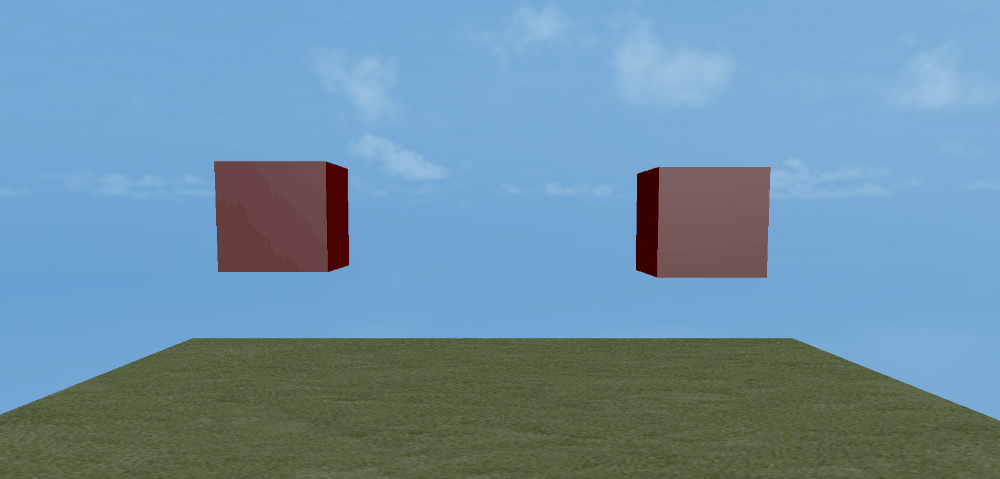
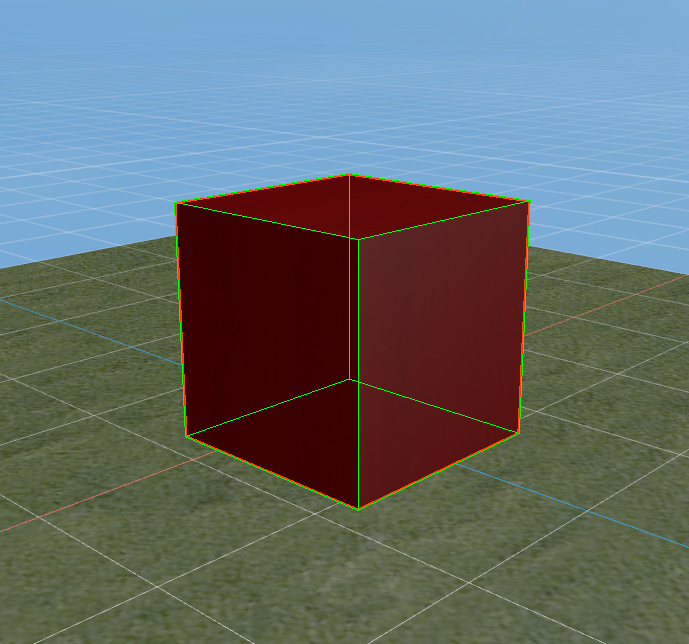
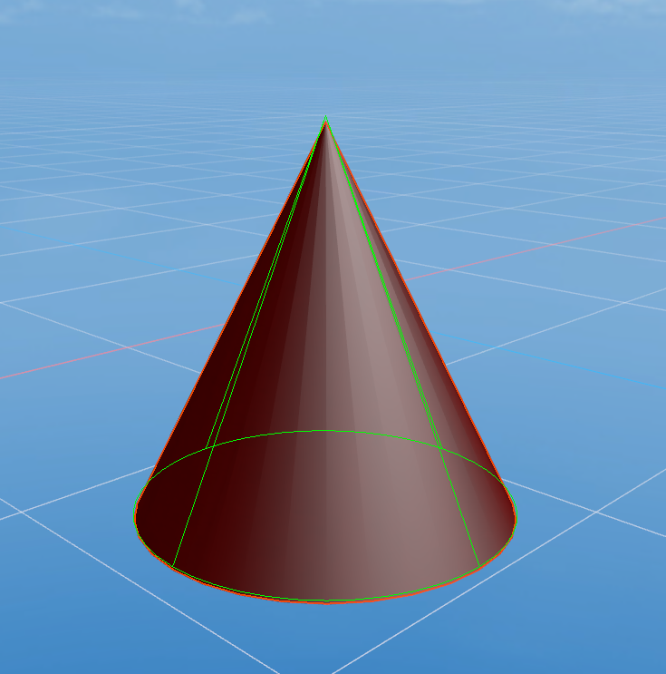

## Detailed explanation of LayaAir3-IDE visual 3D physical editing

> Author : Charley 	Version >= LayaAir 3.1

In the LayaAir3.1 engine version, we have reconstructed the interface architecture of the physics engine, so that 3D physics not only improves the functions of the physical components, but also completely meets the need for free access to third-party physics libraries.

In other words, in addition to the integrated Bullet physics engine and PhysX physics engine, developers can also easily access other physics engines by themselves.

For example, we provide a lightweight physics engine library such as *Cannon.js* in the asset store, which can be introduced into LayaAir by developers in a customized way.

This document will focus on detailed instructions for using visual 3D physics components, the use of physics component scripts, how to introduce third-party physics libraries, etc., to guide developers to quickly get started with the basic use of the physics engine.

### 1. Rigid body

#### 1.1 What is a rigid body

Whether it is 2D or 3D, to start with physics, you need to first understand the rigid body (RigidBody), which is one of the foundations of the physics engine.

As we all know, all tangible substances in nature can be called objects.

Rigid body is a scientific abstract concept in mechanics in order to reflect the characteristics of an object. It is also a mechanical expression model of an ideal state. It means that the shape and size remain unchanged during motion and after being acted upon by force, and the internal points of the rigid body remain unchanged. Objects whose relative position does not change. **

However, such an ideal model cannot exist in reality. After an object is subjected to force, it will decide whether or how much to change based on comprehensive factors such as force, material, elasticity, and plasticity. If the change of the object itself does not affect the entire motion process, in order to simplify the problem under study, the object is still treated as a rigid body and the volume and shape of the object are ignored. In this way, the obtained results are still quite consistent with the actual situation.

#### 1.2 Commonly used rigid body properties

##### Whether `isKinematic` is a kinematic rigid body

The 3D rigid body is a dynamic rigid body by default. Affected by force, it can be displaced.

Once we set the rigid body to a kinematic rigid body type, we set the value of `isKinematic` to `true`.

Then the moving rigid body can trigger physical feedback from the third party, but it is not affected by physics. For example, if a moving rigid body collides with a dynamic rigid body, the dynamic rigid body will rebound due to force, but the moving rigid body will not be affected by the force and will not produce force displacement. The displacement of the moving rigid body can only change the node coordinates through transform.

> Unlike 2D kinematic rigid bodies, the motion rigid bodies of LayaAir 3D are separated from the motion of the physics engine and cannot be displaced even if the speed is set. The advantage of this is that it reduces physical operations and saves performance.

##### `mass` quality

Mass is a measure of the amount of matter, and the unit of mass in the Bullet engine is kg.

The greater the mass of a rigid body, the more difficult it is to change its motion state. For example, if two objects of different masses collide, the one with the larger mass will change smaller, as shown on the left side of the animation 1:

   

(Animation 1)

> Static rigid bodies and moving rigid bodies are equivalent to infinite masses and are not affected by forces.

##### `gravity` Gravity

The force exerted by objects in nature due to the attraction of the earth's center is called gravity. Gravity is also simulated in the physics engine.

For a dynamic rigid body with the same mass, the greater the gravity, the greater the acceleration of falling. The comparison effect is as shown in the animation 1-1.

  

(Animation 1-1)

##### `angularVelocity` angular velocity

The angularVelocity attribute of a rigid body is the angular velocity. The simple understanding of angular velocity is the angular displacement per unit time, which rotates in radians per second. When we set the angularVelocity property of the dynamic rigid body to a positive value, the displacement is rotated clockwise. When the angularVelocity property is a negative value, the displacement is rotated counterclockwise. The greater the absolute value of the attribute value, the faster the rotation displacement speed.

  

(Animation 1-2)

The value of the angulaVelocity attribute is a 3-dimensional vector `Vector3` type value. Bullet uses Euler angles to describe the rotation of the object. Each component of the 3D vector represents the speed of rotation around the x, y, and z axes. The unit is **radians/second. **. Animation 1-2 shows the contrast effects of 3.14 and 31.4 respectively set on the x-axis.

##### `angularDamping` Angular damping

The angular damping of a rigid body is equivalent to applying an opposite force to the direction of rotation of the angular velocity, causing the rotation speed to attenuate.

Animation 1-3 shows the angular damping value of 1 on the left and 0.9 on the right under the same angular velocity of 31.4, for comparison.

  

(Animation 1-3)

##### `angularFactor` Angle factor

The angle factor of a rigid body is the angle factor that scales the physics value in each axis direction (velocity and force)

Animation 1-4 shows the comparative effect of the angle factor of 1 on the left and the angle factor of 2 on the right under the same angular velocity of 31.4.

   

(Animation 1-4)

##### `linearVelocity` linear velocity

The linearVelocity property of a rigid body is called linear velocity or linear velocity, which refers to the linear motion speed of the object.

The linear velocity of a dynamic rigid body is a 3-dimensional vector `Vector3` type value. The direction of the vector is the direction of the velocity, and the length of the vector is the magnitude of the velocity.

Animated picture 1-5 shows the comparison effect of a dynamic rigid body with no linear velocity set and a linear velocity value set on the y-axis with the same gravity value of 0.

  

(Animation 1-5)

##### `linearDamping` Linear damping

The linearDamping attribute of the rigid body refers to the damping coefficient of the linear speed, which causes the linear speed to attenuate.

Animation Figure 1-6 shows the comparative effect of a dynamic rigid body with a linear damping value of 0.9 on the left and a linear damping value of 1 on the right when the gravity is 0 and the y-axis is set to a linear velocity value of -1.

  

(Animation 1-6)

##### `linearFactor` linear factor

The linearFactor attribute of a rigid body refers to the linear factor that scales physical values ​​(velocity and force) in the direction of an axis.

The linearDamping attribute of the rigid body refers to the damping coefficient of the linear speed, which causes the linear speed to attenuate.

Animation Figure 1-7 shows the comparative effect of a dynamic rigid body with a linear factor of 1 on the left and a linear factor of 2 on the right when the gravity is 0 and the y-axis is set to a linear velocity value of -1.

  

(Animation 1-7)


### 2. Physical collision

Collision is the most basic and commonly used function in the physics engine. In this section, we have a comprehensive understanding of 3D physical collision.

#### 2.1 Colliders and triggers

There are two ways to detect 3D physical collisions: collider and trigger. Let's start with conceptual awareness.

##### 2.1.1 Collider

In the 2D physics of the LayaAir engine, physical collisions with a range can be directly realized through encapsulated colliders of different shapes.

In the 3D physics of the LayaAir engine, shape is no longer the most important feature, it is just the three-dimensional shape area used by the collider to detect the collision range.

A complete 3D collider consists of two parts: the collider and the collider shape.

3D colliders are divided into static colliders, rigid body colliders, and character colliders according to different characteristics.

These colliders must add three-dimensional collider shapes (for example: box, sphere, cone, cylinder, capsule, plane, blend, model mesh) to achieve ranged physical collision.

  

(Figure 2-1)

Figure 2 is the editing preview effect of the capsule-shaped character collider.

##### 2.1.2 Trigger

The triggers of LayaAir 3D physics are equivalent to the sensors in 2D physics.

Trigger is an attribute of the collider. After the trigger attribute setting of any collider takes effect, the current collider is converted into a trigger (for example, a rigid body collider can be called a rigid body trigger after setting a trigger). Even if object contact occurs, there will be no physical feedback of collision. For example, as shown on the right side of Figure 3-1. The falling box ignores the physics engine and passes directly through it.

  

(Animation 2-1)

After setting the trigger, although the physics engine feedback is lost, the collision life cycle method of the trigger can be activated to detect the occurrence of collision and contact between objects.

> The activation trigger life cycle also has certain exceptions. The specific rules will be introduced in the physical life cycle chapter below.

When the trigger `isTrigger` is set to true, as shown in Figure 2-2. The trigger can be set to take effect.

  

(Figure 2-2)

How to set triggers through code:

```typescript
/*
...omitting some codes
*/

//Get the physical rigid body component
this.rigidbody1 = this.cube1.getComponent(Laya.Rigidbody3D) as Laya.Rigidbody3D;
this.rigidbody2 = this.cube2.getComponent(Laya.Rigidbody3D) as Laya.Rigidbody3D;

//Set rigidbody1 as a trigger and cancel physical feedback
this.rigidbody1.isTrigger = true;
this.rigidbody2.isTrigger = false;

/*
...omitting some codes
*/
```


#### 2.2 Understand various colliders

##### 2.2.1 Static Collider `PhysicsCollider`

The 3D physics collider class of LayaAir is `PhysicsCollider`. To facilitate memory and understanding, we call it the static collider class. Because its characteristics are that it is not subject to force and does not cause physical movement.

When it physically collides with a dynamic rigid body collider or a character collider, the physical collision lifecycle method can be triggered, but no physical force displacement will be generated.

This kind of collider can be used in application scenarios that do not require physical force displacement and only need to trigger collision logic. For example, if you hit a wall, the game will be over.


(Figure 2-3)

Figure 2-3 is the 3D physical collider component `PhysicsCollider` added to LayaAir

##### 2.2.2 Rigidbody Collider `Rigidbody3D`

LayaAir's 2D physical rigid body and collider are separated, while the 3D physical rigid body and collider are integrated. The `Rigidbody3D` class is both a rigid body and a collider. We can call it a rigid body collider.

By default, `Rigidbody3D` is a **dynamic type** rigid body collider. This is a rigid body type collider that can be affected by force, so we usually use dynamic rigid body collider for interactive feedback of force. For example, rebounding, flying or falling after impact, falling due to the influence of gravity when placed in the air, etc.

When we set the `isKinematic` of the rigid body `Rigidbody3D` to true, the default dynamic rigid body collider is converted into a kinematic rigid body collider.

From the appearance point of view, the moving rigid body collider is basically no different from the static collider. They are not affected by gravity, speed, or other forces. They are always stationary in the physical world and can only be moved by changing the node coordinates through transform.

But in essence, a moving rigid body has physical characteristics. It can be a force-exerting object and can generate force on a non-moving rigid body. For example, moving a moving rigid body through a control node will push the dynamic rigid body in front of it. The application scenario of static collider is that it will never move and cannot exert force. Moreover, moving static collider through nodes also consumes performance. If you need a moving collider, such as a springboard or obstacle that moves back and forth, you can use a kinematic rigidbody collider.

How to set up the motion rigid body through code:

```typescript
/*
...omitting some codes
*/

//Get the rigid body collider
this.rigidbody = this.cube1.getComponent(Laya.Rigidbody3D) as Laya.Rigidbody3D;
//Enable motion type rigid body
this.rigidbody.isKinematic = true;

/*
...omitting some codes
*/
```

The way to set the motion type rigid body in LayaAir is as shown in Figure 2-4:

  

(Figure 2-4)

Since there is a static collider `PhysicsCollider` in LayaAir's 3D physics, there is no static type rigid body collider implemented in `Rigidbody3D`. If there is a need for static collision feedback, just use the static collider directly.

##### 2.2.3 Character Collider `CharacterController`

The character controller class `CharacterController` is often used to control first-person and third-person game characters. It can conveniently control the character's jumping, jumping speed, landing speed, walking, etc.

Because the character controller inherits from `PhysicsComponent`, it also has the characteristics of a collider. It can add three-dimensional collision shapes and generate collision feedback. Therefore, it is also called a character collider and is one of the colliders.

Unlike static colliders and rigid body colliders, which both inherit from the physics trigger component `PhysicsTriggerComponent`, the character controller directly inherits from the parent class `PhysicsComponent` of the physics component. Therefore, character controllers cannot be set as triggers. However, character collider contact with a trigger can still activate the trigger's lifecycle methods.

  

(Figure 2-4)

Figure 2-4 is adding the character controller class `CharacterController`

#### 2.3 Collision shape

Collision shapes are the range used to detect collision contact. Only shapes, colliders and triggers can trigger physics feedback and lifecycles.

The LayaAir engine supports 8 3D collision shapes, which are:

Box-shaped `BoxColliderShape`, spherical `SphereColliderShape`, cylindrical `CylinderColliderShape`, capsule-shaped `CapsuleColliderShape`, conical `ConeColliderShape`, planar shape `StaticPlaneColliderShape`, compound shape `CompoundColliderShape`, mesh shape `MeshColliderShape`.

##### 2.3.1 Collision shapes that can be created in LayaAir

Box collider`, spherical collider`Sphere Collider`, capsule collider`Capsule Collider`, cylindrical`CylinderColliderShape`, conical`ConeColliderShape`, mesh collider`Mesh Collider`, these 6 types Components are available in LayaAir.

Below we briefly introduce the basic attribute settings of these collision body shapes.

###### Box collision shape

The box collision shape is a rectangular (including cube) shape whose length, width and height are adjusted by setting XYZ. It is often used for box-shaped cuboid objects, as shown in Figure 2-6.

  

(Figure 2-6)
In LayaAir, set the size of each XYZ axis of the box collision, as shown in Figure 2-7.

  

(Figure 2-7)

###### Spherical collision shape

The spherical collision shape is a collision shape that adjusts the size of the sphere by setting the radius. Often used for objects with a spherical appearance, as shown in Figure 2-8.

  

(Figure 2-8)

In LayaAir, set the spherical collision radius, as shown in Figure 2-9.


(Figure 2-9)

###### Capsule Collision Shape

The capsule collision shape is composed of two hemispheres and a cylinder. You need to set the radius of the sphere and the height of the cylinder to form the capsule shape. Commonly used with character colliders. As shown in Figure 2-10.

   

(Figure 2-10)

In LayaAir, set the capsule collision radius, height, and axis direction, as shown in Figure 2-11. It can be used after exporting.

  

(Figure 2-11)

###### Cylindrical collision shape

The cylindrical collision shape is a collision shape that adjusts the size of the sphere by setting the radius and height. As shown in Figure 2-12.

  

(Figure 2-12)

In LayaAir, set the cylindrical collision radius and height, as shown in Figure 2-13.


(Figure 2-13)

###### Conical collision shape

The conical collision shape is a collision shape that adjusts the size of the sphere by setting the radius and height. As shown in Figure 2-14.

  

(Figure 2-14)

In LayaAir, set the cone collision radius and height, as shown in Figure 2-15.


(Figure 2-15)

###### Grid-shaped collision shape

The grid-shaped collision shape is a shape constructed using model grid resources, as shown in the monkey in Figure 2-16-1. Compared with other fixed-rule collision shapes (LayaAir's built-in 3D collision basic shape), grid-shaped collision shapes are collision shapes with customized arbitrary appearances and can be applied to any model mesh.


(Figure 2-16-1)

In LayaAir, set the model grid, as shown in Figure 2-16-2.


(Figure 2-16-2)

##### 2.3.2 Other LayaAir collision shapes

In addition to some shapes supported by the collision body component, some basic 3D collision shapes are also built into the LayaAir engine. These can only be added via code.

###### Plane collision shape

The plane collision shape is an infinite 2D plane collision shape. Collision shape usually used for the entire scene ground. The plane orientation in the 3D world is determined by the normal, and the offset from the origin can be adjusted by the offset value. The API description is shown in Figure 2-17.


(Figure 2-17)

Through the API, we can see that normal is a 3-dimensional vector value, representing the normal of the plane. For example, if this value is `Vector3(0, 1, 0)`, it means that the normal is in the positive direction of the Y-axis, and the plane collision shape is in the infinite horizontal plane of its vertical X-axis.

Figures 2-18 and 2-19 are comparisons of the effects when the normal is also located in the positive direction of the Y-axis, and the offset values ​​are 0 (left) and 1 (right) respectively.

   

(Figure 2-18)																			 (Figure 2-19)

##### 2.3.3 Example of adding shape code to collider

###### Example of using LayaAir’s built-in basic collision shape

The idea of ​​using the built-in collider is to create a node object, create a collider, create a collider shape, and add a collision shape to the collider.

Let's take creating a conical rigid body collider as an example and write the code as follows:

```typescript
   /*
	...omitting some codes
   */

/**Add conical rigid body collider */
    private addCone(): void {
    	//Generate random values ​​for radius and height
   	 let raidius = Math.random() * 0.2 + 0.2;
   	 let height = Math.random() * 0.5 + 0.8;
   	 //Create a conical 3D model node object
   	 let cone = new Laya.MeshSprite3D(Laya.PrimitiveMesh.createCone(raidius, height));
   	 //Add the conical 3D node object to the 3D scene node
   	 this.newScene.addChild(cone);
   	 //Set random position
   	 this.tmpVector.setValue(Math.random() * 6 - 2, 6, Math.random() * 6 - 2);
   	 cone.transform.position = this.tmpVector;
   	 //Create a rigid body collider for the conical 3D node object
   	 let _rigidBody = <Laya.Rigidbody3D>(cone.addComponent(Laya.Rigidbody3D));
   	 //Create a cone collider shape (using the value of the node object for consistency)
   	 let coneShape = new Laya.ConeColliderShape(raidius, height);
   	 //Add a collider shape to the rigid body collider
   	 _rigidBody.colliderShape = coneShape;
    }
    
	/*
	...omitting some codes
   */
```

> To create other basic shapes, please refer to the engine example on the official website

###### Example of using composite collision shapes

A compound collision shape is a collider shape that is composed of multiple base shapes. For example, a table or stool can be composed of multiple box-shaped collision shapes, as shown in Figure 2-20.


(Figure 2-20)

The main purpose of compound collision shape is to add multiple different sub-shapes, which is actually very simple after understanding.

The way to create a compound collision shape is not complicated. First instantiate the compound collision shape `CompoundColliderShape()`, and then add the basic collision shape sub-object through the addChildShape method of the compound collision shape object.

We continue to understand through code and comments. Write the code as follows:

```typescript
   /*
	...omitting some codes
   */
Laya.Mesh.load("res/threeDimen/Physics/table.lm", Laya.Handler.create(this, function(mesh:Laya.Mesh) {
	//Read the table model node object and add it to the 3D scene node.
	var table = scene.addChild(new Laya.MeshSprite3D(mesh)) as Laya.MeshSprite3D;
	//Add a rigid body collider to the table node object
	var rigidBody = table.addComponent(Laya.Rigidbody3D) as Laya.Rigidbody3D;
	//Instantiate a composite collision shape object
	var compoundShape:Laya.CompoundColliderShape = new Laya.CompoundColliderShape();
    
	//Create a box collision shape
	var boxShape:Laya.BoxColliderShape = new Laya.BoxColliderShape(0.5, 0.4, 0.045);
	//Get local offset
	var localOffset:Laya.Vector3 = boxShape.localOffset;
	//modify offset
	localOffset.setValue(0, 0, 0.125);
	boxShape.localOffset = localOffset;
	//Add a sub-shape to the composite collision shape object (the box collision shape just created)
	compoundShape.addChildShape(boxShape);
    
	//The following codes are similar, adding each sub-shape to the composite collision shape object. The sub-shape can also be other shapes, such as sphere, cylinder, etc., depending on the actual situation of the model node.
   /*
	...Omit some code similar to boxShapeXX and only keep it up to boxShape4
   */    
	var boxShape4:Laya.BoxColliderShape = new Laya.BoxColliderShape(0.1, 0.1, 0.3);
	var localOffset4:Laya.Vector3 = boxShape4.localOffset;
	localOffset4.setValue(0.2, 0.153, -0.048);
	boxShape4.localOffset = localOffset3;
	compoundShape.addChildShape(boxShape4);
    
	//Add the combined composite collision shape to the collider shape attribute of the rigid body collider
	rigidBody.colliderShape = compoundShape;
    
}));
   /*
	...omitting some codes
   */
```


#### 2.4 Collision life cycle method

The life cycle is a complete cycle process from start to end, with actively triggered main life cycle methods, such as `onAwake()`, `onEnable()`, etc. There are also passively triggered event class life cycle virtual methods, which are automatically activated only when a certain condition is reached, for example, the physical event-related methods discussed in this section.

##### 2.4.1 Description of life cycle methods of physical events

As introduced before, there are two ways to detect physical collisions, and there are also two corresponding methods for physical events. They are the collision event life cycle method and the trigger event life cycle method.

###### Collision event life cycle method description:

An event virtual method that is automatically activated after a collision occurs between colliders.

| Collision event life cycle method name | Collision event life cycle method description	|
| ------------------------ | ------------------------------------------------------------ |
| onCollisionInteger	| **When a physical collision occurs**, that is, the first time a collision occurs in the life cycle of a collision event, the life cycle virtual method is automatically executed. This method will only be executed once. |
| onCollisionStay	| **Continuous physical collision**, that is, the life cycle virtual method that is automatically executed from the second collision in the collision event life cycle to before the collision leaves. This method will be executed every frame during continuous collision. |
| onCollisionExit	| **When physical collision ends**, a life cycle virtual method that is automatically executed. This method will only be executed once. |

###### Trigger event life cycle method description:

After being set as a trigger, the event virtual method is automatically activated due to object contact.

| Trigger event life cycle method name | Trigger event life cycle method description	|
| ------------------------ | ------------------------------------------------------------ |
| onTriggerEnter	| **When an object comes into contact**, that is, the first contact in the life cycle of the trigger event, the life cycle virtual method is automatically executed. This method will only be executed once. |
| onTriggerStay        	| **When the object is in continuous contact**, that is, the life cycle virtual method is automatically executed before the second contact in the trigger event life cycle and before the contact leaves. This method is executed every frame while the contact is ongoing. |
| onTriggerExit	| **When object contact ends**, a life cycle virtual method that is automatically executed. This method will only be executed once. |

###### Special Note:

- The life cycle method of a collision event will never be activated at the same time as the life cycle method of a trigger event. It can only be a collision event or a trigger event. Moreover, if one party is a trigger, then the two parties will definitely not be able to enter the collision event, and can only enter the trigger event.
- Whether it is a collision event or a life cycle method that triggers an event, the order from entry to exit is "Enter, Stay, Stay,..., Exit".

##### 2.4.2 Trigger conditions of collision event life cycle method

Depending on the type of collider, not all colliders will trigger collision feedback and activate the corresponding life cycle methods.

The following is a table that corresponds to the life cycle virtual methods of whether collision events can be triggered between colliders.

|              	| Static Collider | Dynamic Rigid Body Collider | Kinematic Rigid Body Collider | Character Collider |
| ---------------- | ---------- | ---------------- | -------------- | ---------- |
| Static Collider	| ✘      	| ✔            	| ✘          	| ✔      	|
| Dynamic Rigid Body Collider | ✔	| ✔            	| ✔          	| ✔      	|
| Kinematic Rigid Body Collider | ✘	| ✔            	| ✘          	| ✔      	|
| Character Collider	| ✔      	| ✔            	| ✔          	| ✔      	|

###### Summarize:

From the above table, we find that static colliders and moving rigid body colliders can only trigger the collider life cycle method when they collide with dynamic rigid body colliders or character colliders. Static colliders and moving rigid body colliders are mutually exclusive. time, the collider life cycle cannot be triggered.

The dynamic rigid body collider and character collider can trigger the collider life cycle method when colliding with any collider.

##### 2.4.3 Trigger conditions that trigger event life cycle methods

Colliders can only collide with colliders before they can enter the life cycle of the collider.

This is not the case with triggers. Not only is it possible for a trigger to enter the life cycle of the trigger, but when the trigger contacts a collider, it is also possible to enter the life cycle of the trigger. Therefore, we divide it into two tables. understand.

###### Between triggers:

|              	| Static trigger | Dynamic rigid body trigger | Motion rigid body trigger |
| ---------------- | ---------- | ---------------- | -------------- |
| static trigger	| ✘      	| ✔            	| ✔          	|
| Dynamic Rigid Body Trigger | ✔	| ✔            	| ✔          	|
| Motion Rigid Body Trigger | ✔	| ✔            	| ✔          	|

###### Between trigger and collider:

|              	| Static trigger | Dynamic rigid body trigger | Motion rigid body trigger |
| ---------------- | ---------- | ---------------- | -------------- |
| Static Collider	| ✘      	| ✔            	| ✔          	|
| Dynamic Rigid Body Collider | ✔	| ✔            	| ✔          	|
| Kinematic Rigid Body Collider | ✔	| ✔            	| ✔          	|
| Character Collider	| ✔      	| ✔            	| ✔          	|

###### Summarize:

Through the above two tables, we found that whether it is between triggers and triggers, or between triggers and colliders, only static colliders and static triggers collide or contact each other, and they cannot enter the physical trigger event. of.

For other types of contact, even if the collider does not turn on the trigger, or even has no trigger attribute (character collider), as long as either party is a trigger, it will automatically enter the life cycle of the trigger.

##### 2.4.4 Using life cycle methods

###### Create **Script3D** script

Life cycle methods can only be used in script classes, so we need to create a script. 3D games must inherit the 3D script **Script3D**. Sample code for an empty script is as follows:

```typescript
/**
 * 3D script example of TypeScript language
 */
export default class TSDemo extends Laya.Script3D {
	constructor() { super(); }
}
```

> Do not mix 2D scripts and 3D scripts. If the script template is created with an IDE, you need to change the inherited 2D script class (Laya.Script) to the 3D script class (Laya.Script3D).

###### Add physics script

Only by adding our custom script to the node can we make the node use life cycle methods.

The method of adding is very simple. You can easily add a 3D script that inherits the script class to the node directly in the code by using the `addComponent()` method of the node.

For example, we create a 3D box and bind it to the TSDemo script we just created. The sample code is as follows:

```typescript
//Introduce custom script TSDemo
import TSDemo from "./TSDemo";
/**
 *TypeScript language example
 */
export default class GameUI extends GameUIBase {
	/*
	...omitting some codes
	*/
	private addBox(): void {
   	 //Create a box-shaped MeshSprite3D
   	 let box = this.newScene.addChild(new Laya.MeshSprite3D(Laya.PrimitiveMesh.createBox(0.75, 0.5, 0.5))) as Laya.MeshSprite3D;
   	 //Set material
   	 box.meshRenderer.material = this.mat1;
    	//Set the spatial position
   	 let transform = box.transform;
   	 let pos = transform.position;
   	 pos.setValue(1, 6, 0);
   	 transform.position = pos;
   	 //Create a rigid body collider
   	 let _rigidBody = box.addComponent(Laya.Rigidbody3D) as Laya.Rigidbody3D;
   	 //Create a box shape collider
   	 let boxShape = new Laya.BoxColliderShape(0.75, 0.5, 0.5);
   	 //Set the collision shape of the box
   	 _rigidBody.colliderShape = boxShape;
   	 
    	//Add custom script component TSDemo
    	box.addComponent(TSDemo);
	}
	/*
	...omitting some codes
	*/
}
```

###### Override physical life cycle methods

As introduced before, the life cycle methods of physical events are three collision event methods and three trigger event methods. When we use it, we can just rewrite these virtual methods, and when the physical behavior triggers the corresponding physical event, it will be automatically executed.

Sample code for overriding life cycle methods is as follows:

```typescript
/**
 * 3D script example of TypeScript language
 */
export default class TSDemo extends Laya.Script3D {
	constructor() { super(); }

	onTriggerEnter(): void {
    	/*
  	      ...omitting some logic codes
   	 */
    	console.log("Trigger physical event onTriggerEnter");
	}
	onTriggerStay(): void {
    	/*
  	      ...omitting some logic codes
   	 */
    	console.log("Trigger physical event onTriggerStay");
	}    
	onTriggerExit(): void {
    	/*
  	      ...omitting some logic codes
   	 */
    	console.log("Trigger physical event onTriggerExit");
	}

    
	onCollisionEnter(): void {
    	/*
  	      ...omitting some logic codes
   	 */
    	console.log("Collider physics event onCollisionEnter");
	}
	onCollisionStay(): void {
    	/*
  	      ...omitting some logic codes
   	 */
    	console.log("Collider physics event onCollisionStay");
	}
	onCollisionExit(): void {
    	/*
  	      ...omitting some logic codes
   	 */
    	console.log("Collider physics event onCollisionExit");
	}
}
```

#### 2.5 Collision grouping and filtering collision groups

When we have complex collision requirements, for example, which one we want to touch and which one we don’t want to touch. At this time, you need to group them and specify which collision group they can collide with. In addition, setting collision group filtering will also optimize performance.

Various colliders inherit the collisionGroup and canCollideWith properties from the physics component parent class `PhysicsComponent` to implement collision grouping and specify collision groups.

##### 2.5.1 collision group collisionGroup

The value of the collision group is usually set to the Nth power of 2. If the application scenario is more complex, a lot of collision groups need to be used, and you cannot remember too many Nth power of 2 values, you can also directly use the collision group tool class built into the LayaAir engine.

The LayaAir engine has 17 built-in collision group attribute values ​​for filtering unnecessary collisions.

The collision group tool class built into the engine is `Laya.Physics3DUtils`.

###### All collided groups

Since the collision between collision groups is based on the bitwise AND of bit operations, if the calculation result of the bitwise AND is not 0, it can be collided, and if it is 0, it cannot be collided.

The `COLLISIONFILTERGROUP_ALLFILTER` attribute value of the Physics3DUtils tool class is -1. The bitwise AND of -1 with any power value of 2 is not 0, so when this attribute value is used as a group, all collision groups can collide.
Usage examples are:

```typescript
//Specify which collision group the xxx collider belongs to (the -1 group can collide with any built-in group of LayaAir)
xxx.collisionGroup = Laya.Physics3DUtils.COLLISIONFILTERGROUP_ALLFILTER;
```

###### Custom collision grouping

LayaAir's built-in collision groups, excluding the -1 (COLLISIONFILTERGROUP_ALLFILTER) just mentioned, we can use 10 more, which are `COLLISIONFILTERGROUP_CUSTOMFILTER1...10`. All are powers of 2, from 64 to 32768.

In order to facilitate memory, we can not remember the actual value, just remember the difference in ID number from 1 to 10 after CUSTOMFILTER.

Usage examples are:

```typescript
//Specify which collision group the xxx collider belongs to (the corresponding value of COLLISIONFILTERGROUP_CUSTOMFILTER2 is 128)
xxx.collisionGroup = Laya.Physics3DUtils.COLLISIONFILTERGROUP_CUSTOMFILTER2;
```

###### Specific collision grouping

In addition to the above groups, LayaAir also interfaces with some specific groups reserved by the Bullet physics engine for relatively simple collision filtering requirements.

For example, in the current scene we only have dynamic rigid body colliders, static colliders, and kinematic rigid body colliders. We only perform collision filtering between these types of colliders. Then we can use the corresponding default collision group, static collision group, and kinematic collision group respectively. Learn rigid body collision group.

The specific reserved group attributes are described as follows:

| Collision group attribute name	| Attribute value | Description	|
| ------------------------------------ | ------ | ---------------- |
| COLLISIONFILTERGROUP_DEFAULTFILTER   | 1  	|Default collision group	|
| COLLISIONFILTERGROUP_STATICFILTER	| 2  	| Static collision group	|
| COLLISIONFILTERGROUP_KINEMATICFILTER | 4  	| Kinematic Rigid Body Collision Group |
| COLLISIONFILTERGROUP_DEBRISFILTER	| 8  	| Debris Collision Group	|
| COLLISIONFILTERGROUP_SENSORTRIGGER   | 16 	| Sensor trigger	|
| COLLISIONFILTERGROUP_CHARACTERFILTER | 32 	| character filter	|

> The above attributes are directly connected to the Bullet physics engine, such as the concepts of debris collision groups and character filters, which are not yet available in the current engine version. Developers can use it if they want, but it is recommended not to use it. It is recommended to use custom collision grouping, and use ID as the group mark to make it easier to remember.

##### 2.5.2 Filter collision group canCollideWith

###### Specify collision of a single group

The `canCollideWith` attribute of the collider can be used to specify which group to collide with. Whichever group you specify, you can collide with which one. Others cannot collide, which has the effect of filtering other collision groups.

Usage examples are:

```typescript
//Specify the collision group with which the xxx collider can collide (this example only collides with custom group 1)
xxx.canCollideWith = Laya.Physics3DUtils.COLLISIONFILTERGROUP_CUSTOMFILTER1;
```

###### Specify multiple groups to collide with

If we want to collide with multiple groups, we can use bitwise operation `|` to specify multiple collision groups that can collide with them.

Usage examples are:

```typescript
//Specify the collision group with which the xxx collider can collide (this example only collides with custom groups 1, 2, and 5)
xxx.canCollideWith = Laya.Physics3DUtils.COLLISIONFILTERGROUP_CUSTOMFILTER1 | Laya.Physics3DUtils.COLLISIONFILTERGROUP_CUSTOMFILTER2 | Laya.Physics3DUtils.COLLISIONFILTERGROUP_CUSTOMFILTER5;
```

> Regarding the basic principles of bit operations for collision, if you don’t understand, you can refer to [2D Physics](../../../IDE/physicsEditor/physics2D/readme.md)

###### Specify non-collision groups

In the case of multiple collision groups, if we only want to exclude one or a few collision groups from colliding with them, how to deal with collisions with all other collision groups?

This can be achieved through the XOR operator `^`. Use `-1` to XOR `^` any power value of 2, then the collision group of that value will not be collided.

Usage examples are:

```typescript
//Specify the collision group that cannot collide with it (this example will not collide with custom groups 2 and 5, except for custom groups 2 and 5, all collisions can occur)
xxx.canCollideWith = Laya.Physics3DUtils.COLLISIONFILTERGROUP_ALLFILTER ^ Laya.Physics3DUtils.COLLISIONFILTERGROUP_CUSTOMFILTER2 ^ Laya.Physics3DUtils.COLLISIONFILTERGROUP_CUSTOMFILTER5;
```


### 3. Physical constraints

In the physical world, the movement of some objects is affected by other objects, such as human joints, pendulums, chains, pulleys, etc.

This physical method of limiting the movement of an object and preventing its movement from exceeding a certain limit is a constraint. Because they also have the characteristics of joints, some engines are also called joints.

#### 3.1 What constraints does LayaAir support?

Currently, only two types are supported in the LayaAir engine, namely fixed constraints `Fixed Constraint` and configurable constraints `Configurable Constraint`.

**Fixed constraints** are more commonly used constraints, while **Configurable constraints** can simulate the effects of any **constraints**, so these two constraints can meet most common needs.

#### 3.2 Fixed Constraint`Fixed Constraint`

Fixed constraints limit the movement of an object to depend on another object. When one object changes its displacement, the other object constrained to it will also change accordingly. It is somewhat similar to the parent-child node relationship, but it is different from the parent-child node. The displacement is not implemented through transform, but based on the physics engine.

Fixed joints are similar to welded joints in 2D physics (Box2D). They are suitable for objects in the game that are permanently or temporarily stuck together. It is best for two physics objects that have no parent-child relationship to move together. The benefit is that you don't have to script the hierarchical view of the object to achieve the desired effect. The trade-off is that all objects using fixed joints must use rigid bodies.

##### 3.2.1 Set the connection rigid body setConnectRigidBody

`setConnectRigidBody` is used to specify the rigid body to be connected to the fixed constraint. If not specified, the constraint is connected to the world.

##### 3.2.2 breakForce

`breakForce` is used to set the maximum force that needs to be applied to break the fixed constraints.

##### 3.2.3 breakTorque breakTorque

`breakTorque` is used to set the maximum torque that needs to be applied to break the fixed constraints.

#### 3.3 **Configurable Constraint**`Configurable Constraint`

Configurable constraints can realize all the functions of various constraint types, such as the fixed constraints introduced above, which can also be implemented through configurable constraints, and provide more powerful character movement control.

This constraint is particularly useful when a developer wants to customize the ragdoll's movement and enforce certain poses on the character. Using configurable constraints also allows you to modify constraints into highly specialized constraints of your own design.

##### 3.3.1 Set the connection rigid body setConnectRigidBody

`setConnectRigidBody` is used to specify the rigid body to be connected to the fixed constraint. If not specified, the constraint is connected to the world.

##### 3.3.2 Anchor point anchor

The anchor point `anchor` is the point used to define the center of its own rigid body constraint. The physics simulation uses this point as the center point for calculations.

##### 3.3.3 Spindle axis

The main axis `axis` is used to define the local axis of the object's natural rotation based on the physics simulation. This axis determines the direction of the object's natural rotation under the physics simulation.

##### 3.3.4 Connect Anchor connectAnchor

The connection anchor point `connectAnchor` is used to set the constraint anchor point of the connected rigid body.

For example, it is the wheel, and the connected rigid body is the body. The anchor point is the constraint center point of the wheel, and the connection anchor point is the connected body constraint center point.

##### 3.3.5 secondary axis secondaryAxis

The function of the secondary axis `secondaryAxis` is to define the local coordinate system of the constraint together with the main axis `axis`. The third axis will be perpendicular to the plane formed by the two axes.

##### 3.3.6 Translation constraint mode along the XYZ axis (X\Y\Z)Motion

 (X\Y\Z)Motion is a mode that represents translational constraints along the X, Y, and Z axes. The constraint modes are different depending on the attribute settings. The values ​​that can be set are: free movement `Free`, locked movement `Locked`, and restricted movement `Limited`.

Free movement `Free` means moving along an axis without restrictions.

Locked movement `Locked` means there is no movement and is completely fixed.

Limited movement `Limited` is a translational movement limited to user-defined constraints.

##### 3.3.7 Angular motion constraint mode angular (X\Y\Z)Motion rotating around the XYZ axis

angular (X\Y\Z)Motion is an angular motion constraint mode that represents rotation around the X, Y, and Z axes. It is also based on the settings of three values: free movement `Free`, locked movement `Locked`, and restricted movement `Limited`. To distinguish the constraint mode, it is similar to (X\Y\Z)Motion, but the difference is between linear translation and angular motion rotation in the form of motion.

##### 3.3.8 Spring linear limit (linearLimitSpring, linearDamp)

###### Spring force Spring

The spring force `Spring` corresponds to the linear limit spring force `linearLimitSpring` in the LayaAir engine. If the value here is set to zero, the limit cannot be exceeded; values ​​other than zero will make the limit elastic.

###### Damping Damper

The damping `Damper` corresponds to the linear damping `linearDamp` in the LayaAir engine. Setting it to a value greater than zero allows the constraint to suppress oscillation (otherwise it will continue to oscillate).

##### 3.3.9 Linear movement limits (minLinearLimit, maxLinearLimit, linearBounce)

###### LimitLimit

Where `Limit` is the distance from the origin to the limit position. In the LayaAir engine, you need to set the minimum value of the linear movement limit `minLinearLimit` and the maximum value of the linear movement limit `maxLinearLimit` respectively.

###### Boundciness

The rebound force `Bounciness` is the elastic force exerted to pull the object back when it reaches the limit distance. Corresponds to the linear rebound force `linearBounce` in the LayaAir engine.

##### 3.3.10 Spring angle motion limit (angularLimitSpring, angularDamp)

###### Spring force Spring

The spring force `Spring` corresponds to the spring force `angularLimitSpring` that limits the angular motion rotation in the LayaAir engine. If the value here is set to zero, the limit cannot be exceeded; values ​​other than zero will make the limit elastic.

###### Damping Damper

The damping `Damper` corresponds to the angular motion rotation damping `angularDamp` in the LayaAir engine. Setting it to a value greater than zero allows the constraint to suppress oscillation (otherwise it will continue to oscillate).

##### 3.3.11 Angular motion limits (minAngularLimit, maxAngularLimit, angularBounce)

###### LimitLimit

The `Limit` is to limit the rotation angle and set the lower limit of the object's rotation angle. In the LayaAir engine, you need to set the minimum value of the rotation angle limit `minAngularLimit` and the maximum value of the rotation angle limit `maxAngularLimit` respectively. Both values ​​are 3D vector values.

The X of the minimum rotation limit corresponds to the lower limit of the X-axis rotation `Low Angular burden.

The X of the maximum rotation limit corresponds to the upper limit of the X-axis rotation `Hight Angular X Limit` value, Y corresponds to the limit of the Y-axis rotation `Angular Y Limit` value, and Z corresponds to the limit of the Z-axis rotation `Angular Z Limit` value.

###### Boundciness

The rebound force `Bounciness` is the rebound moment exerted on the object when its rotation reaches the limit angle. Corresponds to the angular rebound moment `angularBounce` in the LayaAir engine.

### 4. Physical rays

#### 4.1 What is physical ray

The definition of a ray is a straight line formed by infinite extension with only one endpoint. The mathematical object `Laya.Ray()` of the LayaAir engine is a ray with only a starting point and direction.

In the LayaAir engine, rays are often used for basic collision detection, so they have the emission characteristics of rays, but the rays used for the collision detection function are called physical rays.

> It should be noted that rays can be used for physical ray detection, but physical rays are not the same as rays.

#### 4.2 Create ray

The LayaAir engine provides the class `Laya.Ray()` for creating 3D space rays, and the method `viewportPointToRay()` to generate this ray from a screen space point through the camera.

Sample code looks like this:

```typescript
/*
...omitting some codes
*/
//Create a screen point
let point = new Laya.Vector2();
//Create a ray Laya.Ray (the starting point of the ray, the direction of the ray)
let ray = new Laya.Ray(new Laya.Vector3(0, 0, 0), new Laya.Vector3(0, 0, 0));
//Use the point clicked by the mouse as the origin
point.x = Laya.stage.mouseX;
point.y = Laya.stage.mouseY;
//Compute a ray generated from screen space
_camera.viewportPointToRay(point, ray);
/*
...omitting some codes
*/
```

#### 4.3 Using physical rays

Ray detection is implemented in LayaAir 3D using the physics simulator class `PhysicsSimulation`.

There are four methods of ray detection, namely `raycast` and `raycastFromTo` for ray detection of the first colliding object and `raycastAll` and `raycastAllFromTo` for ray detection of all colliding objects.

The difference between detecting one and all is easier to understand, that is, the ray ends immediately after hitting the first object, and the ray can penetrate all colliding objects and never ends. As shown in Figure 4-1.


(Pic 4-1)

So why do we have the same function name with FromTo and without FromTo? What is the difference?

Unlike the rays of mathematical objects, the physical rays used to detect collisions have a length, or the end position in world space needs to be set.

With FromTo, two points (the starting position point and the ending position point of the ray) are used as parameters.

Without FromTo, the already created ray is used directly. There is no need to set the end position of the ray, but the length needs to be set. If we do not set the length, the default length `2147483647` is used.

If it is ray detection without FromTo, we can continue to use the example of creating rays in the previous section, with a little addition, the specific code is as follows:

```typescript
/*
...omitting some codes
*/
//Create a screen point
let point = new Laya.Vector2();
//Create a ray Laya.Ray (the starting point of the ray, the direction of the ray)
let ray = new Laya.Ray(new Laya.Vector3(0, 0, 0), new Laya.Vector3(0, 0, 0));
//Use the point clicked by the mouse as the origin
point.x = Laya.stage.mouseX;
point.y = Laya.stage.mouseY;
//Compute a ray generated from screen space
_camera.viewportPointToRay(point, ray);
//Get the object that the ray collides with in the 3D scene
_scene3D.physicsSimulation.rayCastAll(ray,this.outs);
//If the ray collides with the object
if (this.outs.length !== 0) {
	for (let i = 0; i < this.outs.length; i++){
    	//Add a cube where the ray hits
    	this.addBoxXYZ(this.outs[i].point.x, this.outs[i].point.y, this.outs[i].point.z );
	}   	 
}
/*
...omitting some codes
*/
```

An example of using ray detection with FromTo, the specific code is as follows:

```typescript
/*
...omitting some codes
*/
/*Perform ray detection to detect all colliding objects
//_scene3D.physicsSimulation.raycastAllFromTo(this.from, this.to, this.outs);
//The use of rays to detect all objects is similar to the previous example
*/

//Perform ray detection to detect the first collision object
_scene3D.physicsSimulation.raycastFromTo(this.from, this.to, this.out);
//Set the object the ray collides with to red
((this.out.collider.owner as Laya.MeshSprite3D).meshRenderer.sharedMaterial as Laya.BlinnPhongMaterial).albedoColor = new Laya.Vector4(1.0, 0.0, 0.0, 1.0);
/*
...omitting some codes
*/
```

#### 4.4 Using alien physical rays

Conventional physical rays use a ray to detect collisions. The LayaAir engine also provides functions similar to physical ray detection, but uses custom collider shape detection instead of physical rays, which is equivalent to the abnormal ray detection function.

Like ordinary ray detection, special-shaped rays also have two detection methods: Detect First and Detect All, which are `shapeCast` and `shapeCastAll` respectively.


(Figure 4-2)

The example in Figure 4-2 uses spherical rays to implement collision detection. The specific code is as follows:

```typescript
//Create a ball collider
var sphereCollider:Laya.SphereColliderShape = new Laya.SphereColliderShape(0.5);

//Switch through the button this.castAll state to detect all or the first one
if (this.castAll) {
	//Use spherical collider for shape detection to detect all colliding objects
	this.scene.physicsSimulation.shapeCastAll(sphereCollider, this.from, this.to, this.outs);
	for (let i = 0; i < this.outs.length; i++){
    	((this.outs[i].collider.owner as Laya.MeshSprite3D).meshRenderer.sharedMaterial as Laya.BlinnPhongMaterial).albedoColor = new Laya.Vector4(1.0, 0.0, 0.0, 1.0);
} else {
	//Use a spherical collider for shape detection to detect the first collision object
	if (this.scene.physicsSimulation.shapeCast(sphereCollider, this.from, this.to, this.out))
    	((this.out.collider.owner as Laya.MeshSprite3D).meshRenderer.sharedMaterial as Laya.BlinnPhongMaterial).albedoColor = new Laya.Vector4(1.0, 0.0, 0.0, 1.0);
}
```

#### 4.5 Set ray collision group

Whether it is an ordinary ray or a special-shaped ray, you can set a collision group and specify the group that the ray can collide with.

How to set the collision group value collisonGroup and how to specify the group value canCollideWith that can cause collision have been introduced in the previous article.

We bring the value into the corresponding method of ray detection to achieve selective collision of rays.

> The parameter collisionMask used to specify the detection collision group in ray detection corresponds to the canCollideWith introduced earlier.


### 5. Use of other physics engines

The previous chapters have been introducing the physics engine API encapsulated by LayaAir based on the Bullet physics engine. Although Bullet is powerful, some developers do not have high requirements for physical accuracy and the use of physics functions is relatively basic. They only have requirements for the size of the physics engine library. For example, the Cannon physics engine library has a size of less than 200k. Currently, the physics engine interface of LayaAir 3.0 is being improved to support more third-party physics engines. Therefore, the Cannon physics engine has been temporarily removed from the IDE. Developers will be notified after subsequent improvements are completed.


