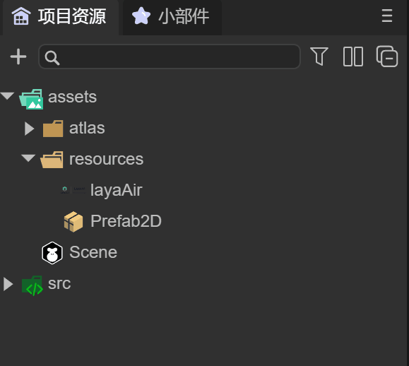
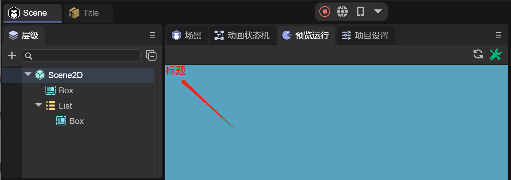

# Prefab module


## 1. Overview

In project development, situations like this often occur:

(1) When the project was established, the art defined a series of standard font colors and font sizes, which were applied in each UI. One day, the art suddenly said that it wanted to change the default font color and font size, and the UI producer needed to modify all interfaces. This would be very troublesome. **For this situation, you can easily deal with it by using prefabs. Only modifying one place can affect the whole situation. **

(2) Different 2D interfaces have partially the same layout. I hope that if I modify it once, the same layout of multiple interfaces will change together. **This situation can be easily solved by using prefabs**.

(3) In 3D project development, once certain objects that are reused in the same scene or in different scenes, such as models, textures, animations and other settings have been made, heroes, monsters, special effects, etc. can be created directly in the scene. We hope that when using it, we only need to load it with code. **For this situation, it can only be achieved by using prefabs. **

For needs similar to the above, LayaAirIDE provides 2D prefabs and 3D prefabs. This article will introduce how to use these two prefabs.


## 2. Create in IDE

The process of creating prefabs can only be completed in the IDE. Usually, prefabs are created as files with the suffix ".lh". This section introduces how to create prefabs (2D) and prefabs (3D) in the IDE

### 2.1 Create prefab (2D)

Prefabs (2D) are prefabs used in the development process of 2D interfaces, usually for repetitively used 2D components, partial interfaces, etc.

As shown in the animation 2-1, under the assets of the project resources in the IDE, developers can select the directory where they want the prefab to be stored. In this directory, create a prefab (2D) in the menu of the right mouse button.


(Animation 2-1)

Developers usually need to rename the created prefab so that the function of the prefab can be identified by name, as shown in animation 2-2.



(Animation 2-2)

Click on the Title prefab and you can see that there is a root node "Box", as shown in Figure 2-3


(Figure 2-3)

Developers can create 2D components under Box, or convert Box nodes into other 2D components for use. We will introduce them in detail later.


### 2.2 Create prefab (3D)

The process of creating a 3D prefab is the same as that of a 2D prefab, as shown in animation 2-4.

  

(Animation 2-4)

The difference is that when you double-click to open the prefab 3D, the root node is "Sprite3D", which is the 3D sprite object we need to create. At the same time, the right side of Figure 2-5 is the default IDE scene, using the sky box that comes with the IDE.


(Figure 2-5)


### 2.3 Modify the prefab editing scene

Developers can change the editing scene of the 3D prefab in the following ways, as shown in animation 2-6


(Animation 2-6)

For example, we have a 3D city scene. In the project settings of the IDE, click the Edit option, and in the prefab editing scene, drag in the 3D city scene file. At this time, view the scene window of the prefab again and you can see the scene change. It’s time for a 3D city. In this case, it is more convenient for developers to create 3D prefabs in the scene more flexibly.


## 3. Use prefabs

### 3.1 2D Prefab

As mentioned in the first section, during the development process, many interfaces will use fonts similar to titles. It is best for developers to implement this through prefabs. When there is a need to change the fonts of all interface titles, they only need to modify One prefab is enough.

#### 3.1.1 Convert node type

Since the created prefab defaults to the Box root node, if you create a title under the Box, then this Box node is redundant. If a large number of titles are created in the interface, a lot of Boxes will be created, which is a strong consideration for performance. It is not recommended, so we hope to use the conversion node to change the Box to a Label component. As shown in animation 3-1


(Animation 3-1)


#### 3.1.2 Set font

Next, we won’t introduce the title production process here. As shown in Figure 3-2, we temporarily create a yellow 30-point bold font as the title and rename it Title


(Figure 3-2)


#### 3.1.3 Using prefabs in IDE

After the prefab is created, it can be dragged into the IDE into the interface we want to use, as shown in animation 3-3.


(Animation 3-3)

There is a List in the scene, and we hope that the item will have a title. We drag the Title prefab into the Box of the List as the Label title of the List item. You can see that the color of the Label name in the node is green, which means that this node is a prefabricated node. Of course, all nodes under this node will be green.


#### 3.1.4 Modify prefab properties

When the requirement says that you want to change all titles to red, that is to say, you modify it once, and multiple interfaces change together. Then you only need to modify the color of the text in the Title prefab, as shown in animation 3-4


(Animation 3-4)

After modifying the prefab, you can see the effect of the modification in the scene interface where the prefab is used. Of course, you can also run it directly on the prefab interface to see the effect. After editing, developers need to remember to save the prefab file when closing the prefab interface, otherwise the previous changes will be lost when the prefab is opened next time.

You can also continue to add new UI components to the prefab. Similarly, the newly added UI components in the scene are synchronized. It is not shown here, developers can try it themselves.

> Note: Any script added to the UI component can also be synchronized to the scene, but the runtime class under the prefab cannot be synchronized.


#### 3.1.5 Overriding Prefab Properties

If we operate the prefab node in the scene, for example, add a new UI component, modify the properties of the UI component, and hang a script on the UI component, as shown in Figure 3-3


(Figure 3-3)

For example, there is an item node under the List in the scene that is a prefabricated body. We have made several changes under the List, which will be marked in Figure 3-3.

- Added LabelScript script to Label component (identified by "+" sign)

- Modified the width attribute of the item node (the attribute setting panel has a yellow line prompt)

- Added Button component (identified by "+" sign)

These modifications can also be overridden into prefabs, let’s see how. As shown in Figure 3-4


(Figure 3-4)

Click the item node, and in the properties panel on the right, click the `Override Properties` button to open the `Override Properties to Item` operation panel.

Since there were three operations before, we click item, LabelScript, Button, and you can see it, as shown in Figure 3-8


(Figure 3-8)

The IDE records these three modification operations. We can undo or apply each item separately, or we can directly undo all or apply all.

When you click Apply or Apply All for each operation and return to the item prefab window, the three modifications will be updated and saved to the prefab, as shown in Figure 3-9.


(Figure 3-9)

Through the above operation, the effect of modifying the prefab can also be achieved by overriding the properties of the prefab.


> Note: If a relative layout is set in the prefab, then when using the prefab object on the scene, the relative layout on the scene cannot be set to null (the IDE does not check it or forces the code to set it to null. This is also not allowed. Useless), the relative layout within the prefab will prevail.
>
> However, if the relative layout value is modified in the scene, the settings on the scene will prevail. For example, if the top of the prefab is set to 10, and when the scene uses this prefab, the top is changed to 20. When running, the scene will use 20 as the benchmark.


#### 3.1.6 Using prefabs in code

Adding a prefab through code is as simple as using a component. As shown in Figure 3-5, we want to put the Title prefab under the Box.


(Animation 3-5)

The sample code is as follows:

```typescript
const { regClass, property } = Laya;

@regClass()
export class ScriptA extends Laya.Script {
	//declare owner : Laya.Sprite3D;

	@property( { type: Laya.Box } )
	private box: Laya.Box;

	constructor() {
    	super();
	}

	onStart(): void {

    	//Load prefab file
    	Laya.loader.load("resources/Title.lh").then( (res)=>{
        	//Create prefab
        	let label: Laya.Label = res.create();
        	//Add the prefabricated Label font to the box node
        	this.box.addChild( label );
    	} );
	}
}
```

The running effect is shown in Figure 3-6



(Figure 3-6)


### 3.2 3D Prefab

The process of using 3D prefabs is the same as that of 2D prefabs. We will not introduce how to make prefabs here. Let’s take a look at the effect of using 3D prefabs through the following example.

#### 3.2.1 Use in IDE

Assume that we have created a 3D prefab and made LayaMonkey by adding components such as models, materials, animation state machines, etc., as shown in Figure 3-7


(Figure 3-7)


At this point, the created LayaMonkey can be dragged into any scene, as shown in animation 3-8


(Animation 3-8)


#### 3.2.2 Used in code

Using 3D prefabs through code is the most common way. Often enemies in game battles are continuously created through code. Like the above situation where the IDE is dragged into LayaMonkey, we use code to implement it as follows:

```typescript
const { regClass, property } = Laya;

@regClass()
export class Main extends Laya.Script {

	@property( { type : Laya.Camera } )
	private camera: Laya.Camera;  
	@property( { type : Laya.Scene3D } )
	private scene: Laya.Scene3D;

	onStart() {
    	console.log("Game start");
    	//Load prefab file
    	Laya.loader.load("resources/Prefab.lh").then( (res)=>{
        	//Create prefab
        	let monkey: Laya.Sprite3D = res.create();
        	//Add prefab to the scene
        	this.scene.addChild( monkey );
        	monkey.transform.position = new Laya.Vector3(-28.9354,0.3,-63.20264);
    	} );
	}
}

```

The running effect is as shown in Figure 3-9


(Animation 3-9)


## 4. Preload prefabs

During the development process, we will implement various functions by creating a large number of prefabs. Therefore, a prefab can also be understood as a collection of resources. When loading a prefab file through code, the associated resources can be loaded together. Therefore, during the project startup loading process, you can directly load all prefabs first, just like the preloading scene, and the engine will load the associated resources together.

In LayaAir's 2D entry sample code, you can see the implementation code by preloading a set of prefabs:

```typescript
import { LoadingRTBase } from "./LoadingRT.generated";

const { regClass, property } = Laya;
@regClass()
export default class LoadingRT extends LoadingRTBase {
	onAwake(): void {
    	Laya.loader.load(
        	//First load what is needed for this scene
        	["resources/UI/image.png", "resources/UI/progress.png", "resources/UI/progress$bar.png"]
    	).then(() => {
        	let resArr: Array<any> = [

            	{ url: "resources/prefab/uiDemo/useUI/ChangeTexture.lh", type: Laya.Loader.HIERARCHY },
            	{ url: "resources/prefab/uiDemo/useUI/MouseThrough.lh", type: Laya.Loader.HIERARCHY },
            	{ url: "resources/prefab/uiDemo/useUI/PhysicalCollision.lh", type: Laya.Loader.HIERARCHY },
            	{ url: "resources/prefab/uiDemo/useUI/Progress.lh", type: Laya.Loader.HIERARCHY },
            	{ url: "resources/prefab/uiDemo/useUI/TextShow.lh", type: Laya.Loader.HIERARCHY },
            	{ url: "resources/prefab/uiDemo/page/IframeElement.lh", type: Laya.Loader.HIERARCHY },
            	{ url: "resources/prefab/uiDemo/page/UsePanel.lh", type: Laya.Loader.HIERARCHY },
            	{ url: "resources/prefab/uiDemo/list/BagList.lh", type: Laya.Loader.HIERARCHY },
            	{ url: "resources/prefab/uiDemo/list/ComboBox.lh", type: Laya.Loader.HIERARCHY },
            	{ url: "resources/prefab/uiDemo/list/LoopList.lh", type: Laya.Loader.HIERARCHY },
            	{ url: "resources/prefab/uiDemo/list/MailList.lh", type: Laya.Loader.HIERARCHY },
            	{ url: "resources/prefab/uiDemo/list/Refresh.lh", type: Laya.Loader.HIERARCHY },
            	{ url: "resources/prefab/uiDemo/list/TreeBox.lh", type: Laya.Loader.HIERARCHY },
            	{ url: "resources/prefab/uiDemo/list/TreeList.lh", type: Laya.Loader.HIERARCHY },
            	{ url: "resources/prefab/uiDemo/animation/AtlasAni.lh", type: Layer.Loader.HIERARCHY },
            	{ url: "resources/prefab/uiDemo/animation/FrameAni.lh", type: Type.Loader.HIERARCHY },
            	{ url: "resources/prefab/uiDemo/animation/SkeletonAni.lh", type: Laya.Loader.HIERARCHY },
            	{ url: "resources/prefab/uiDemo/animation/TimelineAni.lh", type: Laya.Loader.HIERARCHY },
            	{ url: "resources/prefab/uiDemo/animation/TweenAni.lh", type: Laya.Loader.HIERARCHY },
            	{ url: "resources/prefab/uiDemo/interactive/Astar.lh", type: Laya.Loader.HIERARCHY },
            	{ url: "resources/prefab/uiDemo/interactive/Joystick.lh", type: Laya.Loader.HIERARCHY },
            	{ url: "resources/prefab/uiDemo/interactive/ShapeDetection.lh", type: Laya.Loader.HIERARCHY },
            	{ url: "resources/prefab/uiDemo/interactive/tiledMap.lh", type: Laya.Loader.HIERARCHY },

            	{ url: "resources/prefab/Bullet.lh", type: Laya.Loader.HIERARCHY },
            	{ url: "resources/prefab/closeBtn.lh", type: Laya.Loader.HIERARCHY },
            	{ url: "resources/prefab/ComboList.lh", type: Laya.Loader.HIERARCHY },
            	{ url: "resources/prefab/defaultButton.lh", type: Laya.Loader.HIERARCHY },
            	{ url: "resources/prefab/defaultLabel.lh", type: Laya.Loader.HIERARCHY },
            	{ url: "resources/prefab/DropBox.lh", type: Laya.Loader.HIERARCHY },
            	{ url: "resources/prefab/LoopImg.lh", type: Laya.Loader.HIERARCHY },
            	{ url: "resources/prefab/role.lh", type: Laya.Loader.HIERARCHY },

            	{ url: "resources/prefab/ani/cd.lh", type: Laya.Loader.HIERARCHY },
            	{ url: "resources/prefab/ani/refresh.lh", type: Laya.Loader.HIERARCHY },

        	];


        	//3.0 load can load 2D and 3D resources at the same time
        	Laya.loader.load(resArr, null, Laya.Handler.create(this, this.onLoading, null, false)).then(() => {
            	//After loading is completed, process the logic
            	this.progress.value = 0.98;
            	console.log("Loading completed", this.progress.value);
            	//There are too few preloaded things. It is delayed for one second to see the effect locally. Real projects do not need to be delayed.
            	Laya.timer.once(1000, this, () => {
                	//Jump to the entrance scene
                	Laya.Scene.open("Scenes/Index.ls"); //Do not use Laya.Scene.open("./Scenes/Index.ls");
            	});

        	});

        	// Listener loading failed
        	Laya.loader.on(Laya.Event.ERROR, this, this.onError);
    	});
	}

	/**
   * Print errors when reporting errors
   * @param err error message
   */
	onError(err: string): void {
    	console.log("Loading failed: " + err);
	}

	/**
 	* Listen when loading
 	*/
	onLoading(progress: number): void {
    	//When the loading is almost completed, let the displayed progress be a little slower than the actual progress. This is reserved for automatic loading when opening the scene, especially if there are many scene resources to be opened and they are not completely put into preloading, and they need to be automatically loaded again. When loading a section.
    	if (progress > 0.92) this.progress.value = 0.95;
    	else this.progress.value = progress;
    	console.log("Loading progress: " + progress, this.progress.value);
	}
}
```

Through the above code, you can see in the debugging tool in the browser that the engine will load all prefab resources.


