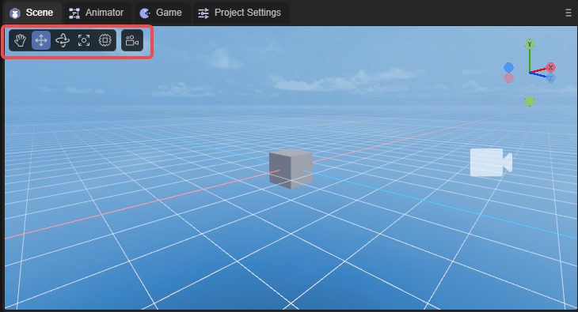
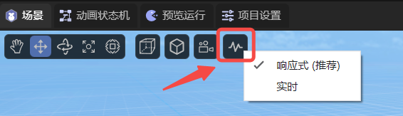
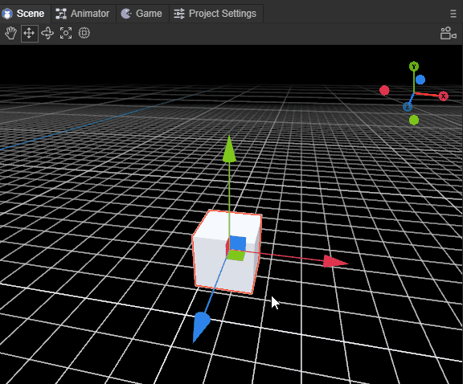

# Basic interaction of 3D scene editing

> Author: Charley, Meng Xingyu

The basic interactions in 3D scenes mainly include two types of basic operations:

First, changing the camera position and angle of the scene window allows developers to observe the 3D scene world just like their own eyes.

The second is to change the position and angle of the model and place the model in an appropriate position in the scene.

We can use the basic tools shown in Figure 1,

(figure 1)

You can also use shortcut keys to switch to the corresponding tool.

In this article, we break it down step by step to let you understand all the basic interactive operations of 3D scene editing.

## 1. Operate the window camera

### 1.1 Rotate window camera: right mouse button

In a 3D scene, just keep pressing the 'right mouse button' to enter the window camera rotation mode, and release the 'right mouse button' to exit the window camera rotation mode.

In this mode, by moving the mouse in the direction of the screen, you can change the angle of the window camera and observe the entire scene from any angle. The effect is as shown in the animation 1-1.

(Animation 1-1)

### 1.2 Spatial displacement window camera

When you hold down the right mouse button + keyboard function keys, you can press the camera up, down, left, and back. The specific function keys are as follows:

| Function description	| Operation	|
| ---------------- | ------------- |
| Camera `up` displacement | Right mouse button + E |
| Camera `Down` displacement | Right mouse button + Q |
| Camera `left` displacement | Right mouse button + A |
| Camera `right` displacement | Right mouse button + D |
| Camera `forward` displacement | Right mouse button + W |
| Camera `backwards` displacement | Right mouse button + S |

The effect of shifting the window camera is shown in the animation 1-2.

(Animation 1-2)

> Up, down, front, left, right, is a relative direction. No matter it is rotated to any angle, it will be displaced in this relative direction.

**Displacement window camera acceleration:**

On the basis of the displacement window camera, hold down Shift to superimpose, and you can accelerate the movement based on the original function.

The operation keys are: right mouse button + shift + (E, Q, A, D, W, S)

### 1.3 Displace the window camera in the screen: Q \ middle mouse button

In addition to using the right mouse button + keyboard function keys (E, Q, A, D) to move the window camera up, down, left, and right, you can also use the shortcut key Q or the middle mouse button to start the screen displacement in any direction.

When using the shortcut key Q, press the left mouse button and drag it to move the window camera in any direction on the screen. The effect is as shown in the animation 1-3.

(Animation 1-3)

To exit this mode, you need to use the shortcut keys of other modes, unless you need to continuously use this mode to move the window camera. Otherwise, it is recommended to use the middle mouse button to initiate screen displacement in any direction.

The middle mouse button mode will only enter this mode when pressed and dragged. Release the middle mouse button and it will automatically return to other modes.

### 1.4 Window camera zoom: mouse wheel

Window camera zoom is essentially the front-to-back displacement of the window camera. Because during the displacement process, the object is observed based on the perspective principle of near and far, and there is an illusion of zooming, so it is called a zoom window camera. The effect is shown in the animation 1-4.

(Animation 1-4)

### 1.5 Rotate the window camera around the focus center: Alt + left-click drag

When observing or operating a specific model, we may need to find a suitable angle that is not frontal. At this point, none of the methods introduced before are inconvenient. So any rotation around the target is the most suitable operation.

Before rotating the window camera, the first thing we have to do is focus (select the 3D object, shortcut key F) and place the model in the center of the window camera.

After focusing, use the combination of `Alt + Left Click` and drag the left button to any angle to rotate around the focus center. The effect is as shown in the animation 1-5.

(Animation 1-5)

### 1.6 Save window camera position

| Shortcut keys	| Function	|
| ------------------------------- | ---------------------------------------------------- |
| Ctrl + Shift +1/2/3/4/5/6/7/8/9 | Each number can store a camera position and 9 positions can be saved	|
| 1/2/3/4/5/6/7/8/9           	| Stored camera positions can be quickly switched by pressing the corresponding number keys |

As shown in the animation 1-6, in the scene panel, after moving the camera to the appropriate position, press the shortcut key `Ctrl + Shift +1`. At this time, the camera position is saved under the number 1. Move the camera Finally, if you want to return to the position of 1, press the numeric key 1.

(Animation 1-6)

The operations for the remaining positions 2 to 9 are the same as 1, and developers can save them according to needs.

### 1.7 Perspective projection and orthogonal projection

As shown in the animation 1-7, `Perspective Projection/Orthogonal Projection` in the basic tools indicates: whether the projection mode of the current scene preview camera is orthogonal projection or perspective projection.

(Animation 1-7)

### 1.8 Local coordinates and global coordinates

As shown in the animated picture 1-8, rotate the Cube 45 degrees around the x-axis. At this time, you can observe the difference between the mobile model relative to the local coordinates and the global coordinates.

(Animation 1-8)

### 1.9 Display settings

Click the display settings shown in Figure 1-9 to set the Camera and Gizmos properties.

(Figure 1-9)

#### 1.9.1 Camera

| Parameters	| Function	|
| --------------- | ------------------------------------------------------------ |
| Field Of View | Field of view in perspective mode	|
| Near Plane  	| The clipping plane closest to the camera's field of view	|
| Far Plane   	| The clipping plane farthest from the camera's field of view	|
| Zoom Speed  	| Camera zoom speed	|
| Transform Speed ​​| Camera displacement speed	|
| Post Process	| After checking, turn on [Post-processing](../../../3D/advanced/PostProcessing/readme.md) |
| Depth Texture | When checked, turn on depth texture	|

#### 1.9.2 Gizmos

| Parameters	| Function	|
| ----------------- | ---------------------------------- |
| 3D Icons      	| Set the size of the camera icon in the scene	|
| Show Grid     	| When checked, horizontal grid lines will be displayed in the scene |
| Selection Outline | When checked, the selected model will display an outer border	|

### 1.10 Scene view refresh frequency

Click on the scene view refresh frequency shown in Figure 1-10 to choose between responsive and real-time. Responsive, it is the current mode, it will be refreshed when there are changes; real-time, it is the scene view refreshed at a frame rate of 30fps.

(Figure 1-10)

## 2. Operation model

There are four tools for operating models, namely displacement, rotation, scaling, and mixed use. Different tool modes can be started through the shortcut keys `W, E, R, T`.

| Shortcut key name | Button |
| ------------ | ---- |
| Model Displacement Tool | W	|
| Model Rotation Tool | E	|
| Model scaling tools | R	|
| Hybrid Edit Model | T	|

### 2.1 Model displacement tool: W

After entering the model displacement tool mode through the shortcut key `W`, red, green and blue axes and pieces will appear on the model.

The three axes of red, green, and blue represent the three directions of X, Y, and Z respectively. The color of the axis corresponds to the coordinate axis in the upper right corner.

The direction pointed by the arrow is the positive direction. Dragging one of the axes will cause the model to move in the positive and negative directions of the axis. The effect is as shown in the animation in Figure 2-1.

(Animation 2-1)

> Pay attention to the attribute panel. If the model does not have any rotation (rotation is all 0), drag one of the axes, and only the attribute value of that axis will change. If there is rotation, it will affect other axis attribute values.

Three adjacent faces, blue is the XY face, green is the XZ face, and red is the YZ face.

By dragging one of the faces, the model can be displaced arbitrarily within the range of the face, as shown in the animation in Figure 2-2.

(Animation 2-2)

### 2.2 Model rotation tool: E

After entering the model rotation tool mode through the shortcut key `E`, red, green and blue intersecting arcs and an outer white circle will appear on the model. When the mouse is drawn over the model, a translucent circle will also appear.

The red, green, and blue arcs represent the directions of the X, Y, and Z axes respectively, and the colors correspond to the coordinate axes in the upper right corner.

After selecting one of the arcs, it will turn into a complete circle, which means rotation along that axis. The effect is as shown in the animated picture 2-3.

(Animation 2-3)

The outer white circle is based on the vertical rotation of the screen, and the effect is shown in the animation 2-4.

(Animation 2-4)

If the mouse is dragged on the translucent circle, it can be rotated at any angle, and the effect is as shown in the animation 2-5.

(Animation 2-5)

### 2.3 Model scaling tool: R

After entering the model zoom tool mode through the shortcut key `R`, there are not only red, green and blue axes on the model, but also a central white block and an outer white circle.

The red, green, and blue axes represent the directions of the X, Y, and Z axes respectively. Pulling one of the axes will scale the mode on that axis. The effect is as shown in the animation 2-6.

(Animation 2-6)

The white block in the center and the white circle in the outer layer are both scaled on three axes at the same time. The only difference between the two is the difference in scaling rate. The effect is shown in the animation 2-7.

(Animation 2-7)

### 2.4 Model tool collection: T

After entering the model tool collection through the shortcut key `T`, the model operation tools introduced above will be gathered together.

The only thing to note is that in blending mode, the scaling of the center block is no longer retained. It can only be scaled overall through the outer white circle, and scaled from a single axis by pulling the squares on each axis. The effect is shown in the animation 2-8.

(Animation 2-8)

### 2.5 Multiple selection of models

The multi-selection methods are box selection, Shift, and Ctrl.

The frame selection of the model is to use the mouse to pull up the rectangular area of ​​the screen. As long as it is within the rectangular area, it will be selected regardless of the distance.

In addition to box selection, you can also use Shift or Ctrl combined with mouse clicks to perform continuous multiple selections.

> Whether it is single selection or multiple selection, the selected model will have a red border.						 

### 2.6 Model adsorption

#### 2.6.1 Lower adsorption: End

Assume there are two cubes, Cube1 is on the top and Cube2 is on the bottom. Select Cube1 and press the End key (Mac: fn + right arrow key). As shown in the animation 2-9, Cube1 will fall directly to Cube2 below.

(Animation 2-9)

#### 2.6.2 Point adsorption: V

Point adsorption refers to adsorption and alignment based on the vertices of the model and the vertices of the target model. After selecting the model, keep pressing the shortcut key V to enter point adsorption mode. At this time, the mouse can be moved to any vertex of the current model, then continue to hold the vertex and drag it to the target model to adsorb and align it with the vertices of the target model. As shown in the animation 2-10, there are two Cubes in the scene. Select one of them, press the V key without releasing it, and move to the vertex of the other Cube. **Do not release the V key during the movement** , you can align the vertices of two Cubes.

(Animation 2-10)

#### 2.6.3 Face adsorption: Ctrl+Shift

Surface adsorption refers to aligning the model based on the mesh surface of the target model. After selecting the model, keep pressing the shortcut key Ctrl+Shift (Mac: control+shift) to enter the surface adsorption mode. Keep pressing the mouse on the model and dragging it to the target model. The center point of the model will be aligned with the grid surface of the target model. At this time, you can move on all sides of the target model, but the center point must not leave the grid surface unless you exit. Surface adsorption mode. As shown in the animation 2-11, move the center point of one Cube to the side of another Cube. The Cube will not move during the mouse movement. It will only move when the center point is dragged to the surface of another Cube. move.

(Animation 2-11)

If you continue to hold down the shortcut key Ctrl+Shift (Mac: control+shift) and continue to press V, you can turn on the combination mode of surface adsorption. In combination mode, Ctrl+Shift+V (Mac: control+shift+V) is no longer limited to the center point. The mouse can be moved to any vertex of the current model, and then continued to hold the vertex, which can be combined with the mesh of the target model. Align the surface. As shown in the animated picture 2-12, in the combination mode of surface adsorption, move the vertex of one Cube to the side of another Cube. The Cube will not move during the mouse movement. You can only drag the vertex to the side of the other Cube. It will only move when it is on the surface.

(Animation 2-12)

## 3. Alignment

### 3.1 Align 3D objects to the window camera with one click: Ctrl+Shift+F

This method directly changes the position of the target object.

A more common situation is that after selecting the camera, you can use the Ctrl+Shift+F shortcut keys to directly align the camera (Main Camera) to the position of the window camera with one click, as shown in GIF 3-1 (pay attention to the Main Camera in the lower right corner) Camera viewport changes). In this way, whatever the window camera sees, the camera (Main Camera) can also see directly. It is convenient for users to adjust, making camera lens adjustment more convenient and precise.

(Animation 3-1)

As shown in GIF 3-2, Ctrl+Shift+F can be applied to other 3D objects.

(Animation 3-2)

### 3.2 Align the window camera to a 3D object with one click: Shift+F

This method does not change the target object position.

A common situation is that after selecting a camera, you can use the Shift+F shortcut keys to directly align the window camera to the position of the camera (Main Camera) with one click, as shown in the animation 3-3. In this way, you can quickly transfer to the viewport of the camera (Main Camera).

(Animation 3-3)

As shown in the animation 3-4, you can also align the window camera to other 3D objects with one click (Shift+F), so that it can quickly have the first-person viewport of the editor.

(Animation 3-4)

