# Use 3D UI

## 1. Overview

2D UI is all pure 2D images displayed hierarchically, and there will be no three-dimensional effect, so they are directly attached to the viewport. The principle of 3D UI (in the engine, variables cannot start with numbers, so it is called UI3D in the code) is that the created UI controls are all in a three-dimensional space, which is completely different from 2D UI because 2D UI has no depth information. Therefore, if there is to be a three-dimensional transformation effect of the UI, 3D UI must be used.

3D UI is also UI and also undertakes the interactive function of UI. For example, when clicking a button on the UI, the button will bring interactive feedback and trigger the set event to achieve the purpose of logical operation.

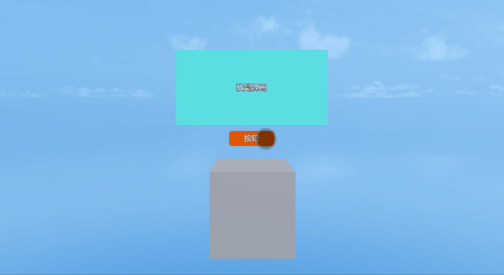

(Animated Image 1-1)

3D UI can be an object located in the 3D scene and has the interactive characteristics of UI.


(Animated Image 1-2)

Moreover, 3D UI is always on the window, just like the conventional UI. But it can move on the XYZ axes, bringing obvious perspective changes.

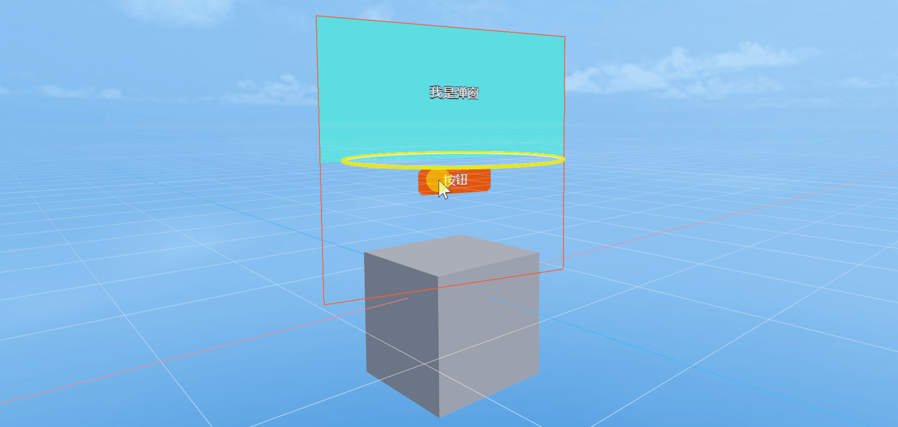

(Animated Image 1-3)


## 2. Use in IDE

### 2.1 Add Components

In the hierarchy panel of LayaAir-IDE, add a Sprite3D node, as shown in Figure 2-1,


(Figure 2-1)

Then add a 3D UI component to the properties of the node. As shown in the animated image 2-2, in the properties panel, click Add Component and select Rendering -> 3D UI Component.

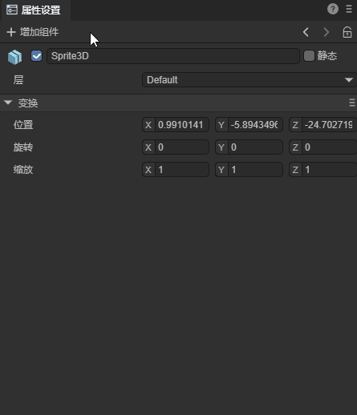

(Animated Image 2-2)


### 2.2 Property Introduction

For the 3D UI component, as shown in Figure 2-3, there are the following properties:

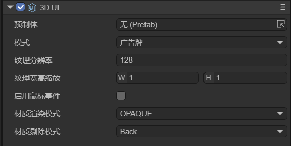

(Figure 2-3)

| Property Name | Property Explanation                                                      |
| --------------------- | ------------------------------------------------------------------------- |
| Prefab                | The Prefab2D resource file that needs to be displayed.                        |
| Mode                  | There are three modes: Camera Space, BillBoard, and Not Billboard.             |
| Resolution Rate       | When dragging in the Prefab, it will automatically recognize the size of the nodes under the Prefab to dynamically adjust the texture resolution. |
| Scale                | The scaling ratio based on the texture resolution. By controlling the scaling, the power-of-two texture can match the width and height of the UI resource. |
| Enable Hit            | Not checked by default. If checked, it can realize the response of the button, the dragging of the slider, the sliding of the List component, etc. |
| Render Mode           | There are five selectable modes: OPAQUE (opaque), CUTOUT (cutout), TRANSPARENT (transparent), ADDTIVE (effect superposition), and ALPHABLENDED (alpha blending). |
| Cull                  | There are three selectable modes: Off (do not cull), Front (cull the front and only show the back), and Back (cull the back and only show the front). |


## 3. Three Modes

### 3.1 Non-Billboard

In the Non-Billboard mode, the UI always faces the Z-axis direction and has a perspective effect in the scene. This mode is more commonly used. Here is a specific example to demonstrate this mode:


#### 3.1.1 Create a Prefab2D

When using 3D UI in the IDE, you first need to create a 2D UI for display in the 3D scene. Here, a 2D prefab (Prefab2D) must be used to achieve this. Then, build a 2D UI that you hope to implement in the prefab. For example, create a health bar above the character's head during the battle in the game, as shown in Figure 3-1.


(Figure 3-1)

In the 2D prefab, create a progress bar (Progress), because the health bar is composed of the current health and the total health, so Progress exactly meets the requirements. And use Label on the health bar to display the character's name. Also, note that the size of the root node Box of the Prefab is preferably changed to the power of 2, which conforms to the principle of the power of 2 of textures.


#### 3.1.2 Create Sprite3D and Add 3D UI Components

Under the Scene3D node in the IDE, create a Sprite3D object and add 3D UI components. The operation can refer to Section 2.1.

It can be seen that after adding the 3D UI component, in the scene at the position of the Sprite3D node, there is an additional displayed texture (black), as shown in Figure 3-2. This texture is used to display the UI.

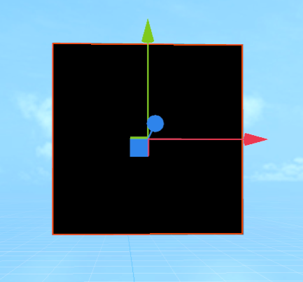

(Figure 3-2)


#### 3.1.3 Add Prefab2D Resources

After preparing the 3D UI component, the next step is to drag the previously created Prefab2D into the Prefab property of the 3D UI component, as shown in the animation 3-3.

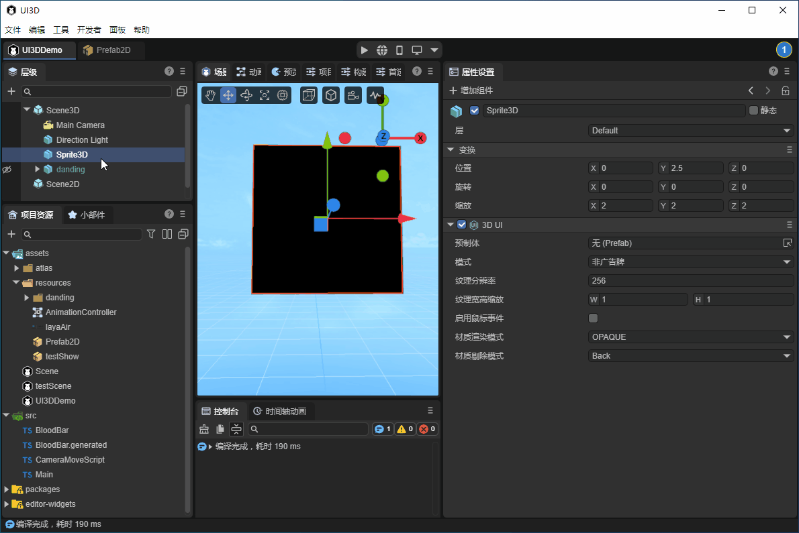

(Animation 3-3)

After dragging in the Prefab, the texture will immediately display the 2D UI. But by default, it is in the OPAQUE rendering mode, and the texture has a black background color.


#### 3.1.4 Change the Rendering Mode

Set the material rendering mode to TRANSPARENT, which supports transparent colors. As shown in Figure 3-4, the background becomes transparent.


(Figure 3-4)


#### 3.1.5 Adjust the Position of 3D UI

The requirement is to create the character's health bar. First, drag the created Dante character into the scene and set the position, as shown in Figure 3-5.

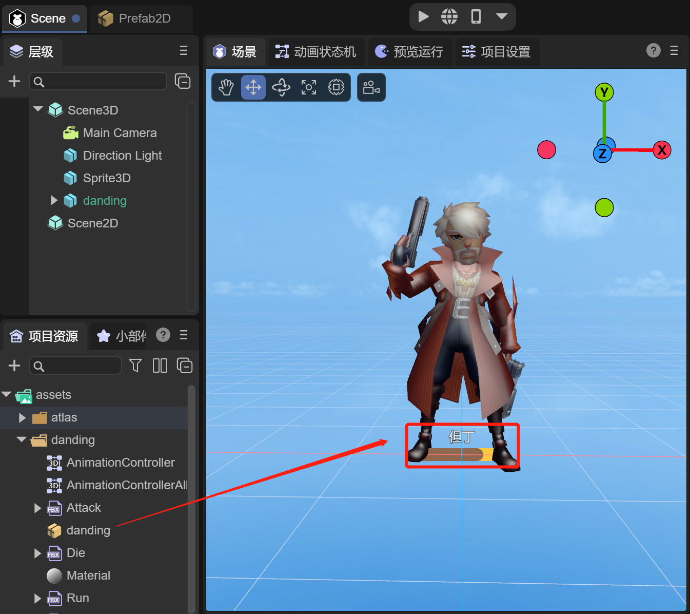

(Figure 3-5)

But the position of Sprite3D is at the character's feet. At this time, the position of Sprite3D needs to be adjusted to achieve the effect of the health bar, as shown in the animation 3-6.

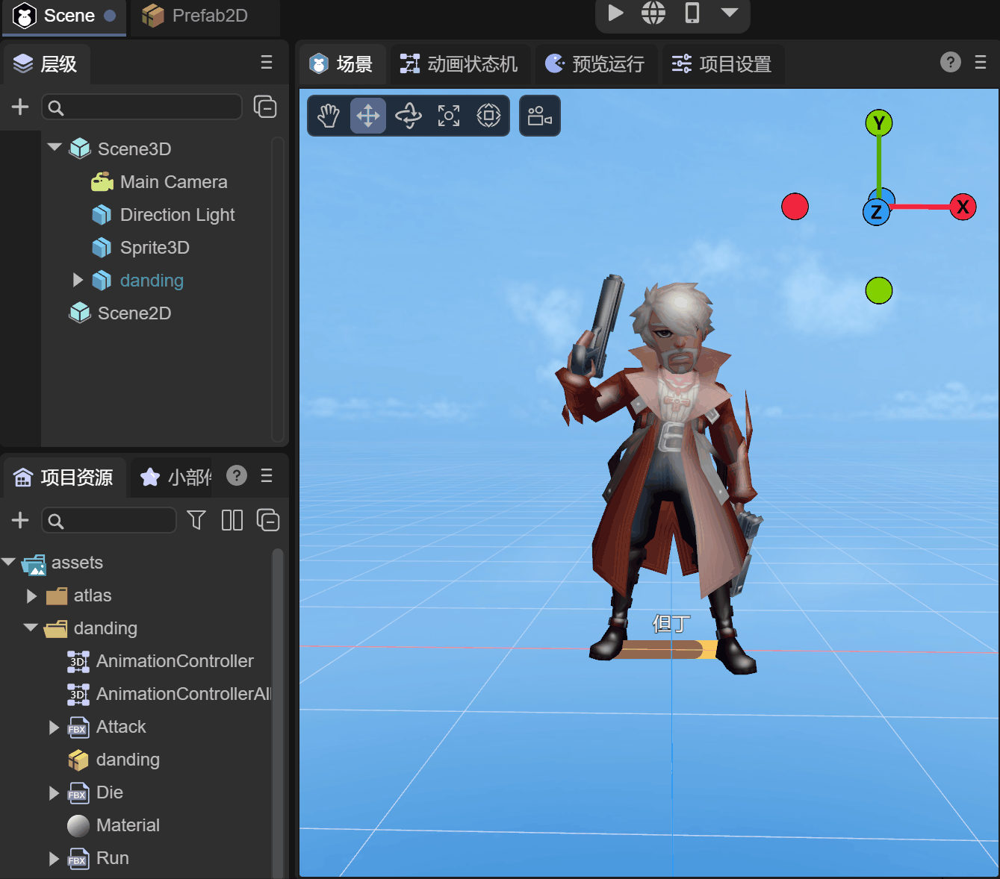

(Animation 3-6)

Now let's take a look at the running effect:


(Animation 3-7)

It can be seen that as the character moves closer and farther away from the camera, the health bar also becomes larger and smaller, which is very consistent with the actual effect. If it is implemented with 2D UI, it is also necessary to dynamically calculate the position of the character relative to the camera to scale the size of the UI.


### 3.2 Billboard

In the Billboard mode, the 3D UI will always face the camera. For example, in the above example, the "Mode" can be selected as "Billboard", and the rotations of the XYZ axes can be adjusted to make the health bar change its orientation as the character rotates. 


(Animated GIF 3-8)


### 3.3 Camera Space

In the Camera Space mode, the 3D UI will always remain at a fixed position in the camera's field of view, and the size of the UI will not change with distance. Compared to the 2D UI, the 3D UI in this mode can be occluded by other objects in the 3D scene. As shown in Figure 3-9, the 3D UI has depth information.


(Figure 3-9)

This mode is to meet the requirement that 2D UI can also be used in VR. 2D is not supported in VR, and the 2D UI cannot be displayed. This function is needed for implementation.

Compared to the previous two modes, the camera space has two different attributes:
-  Attached Camera: As shown in Figure 3-10, simply select the camera in the scene.

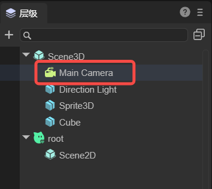

(Figure 3-10)

- Camera Plane Distance: This distance should be between the "near plane" and "far plane" of the camera. As shown in Figure 3 - 11, the distance needs to be greater than 0.3 and less than 1000.


(Figure 3-11)


## 4. Script Control

Developers usually need to operate the content in the UI. For example, changes in the blood volume ratio in the blood bar and the upward floating damage numbers are all achieved by controlling the UI components in Prefab2D. And 3D UI components are usually used to control the display effects, such as perspective effects, position information, etc.

In Prefab2D in Section 3.1, add a Text node, name it "value", and name the progress bar "bar". Then, check the `Define Variable` option for both value and bar. As shown in Figure 4-1,

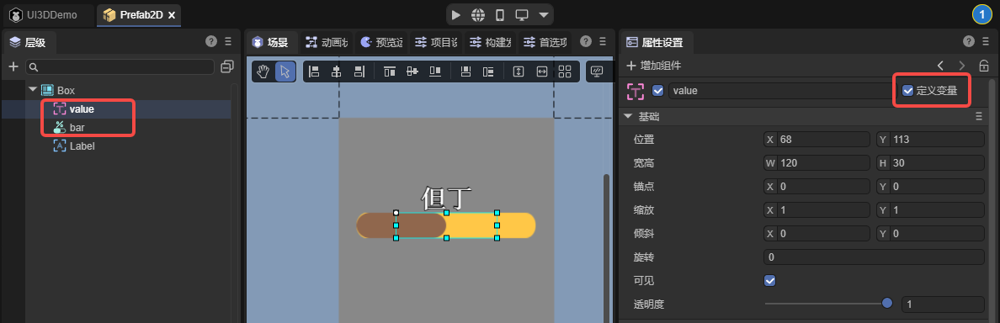

(Figure 4-1)

After saving the scene, just like handling the operations of 2D UI, add a Runtime class to the root node of the 2D prefab and add the following logical code:

```typescript
const { regClass } = Laya;
import { BloodBarBase } from "./BloodBar.generated";
import { Main } from "./Main";

@regClass()
export class BloodBar extends BloodBarBase {
    onAwake(): void {
        this.bar.value = 1;
        this.value.visible = false;
        Laya.stage.on(Laya.Event.CLICK, this, this.onHurt);
    }

    onHurt(): void {
        this.bar.value = this.bar.value - 0.9;
        this.value.y = 35;
        this.value.visible = true;
        Main.instance.animator.play("stun");
        Laya.Tween.create(this.value).to("y", -30).duration(1000);
    }
}
```

The `Main.instance.animator.play("Stun");` in the above code indicates changing the animation state. The purpose is to play the animation of being attacked when the blood volume is reduced. The following script needs to be added in Scene2D of the scene:

```typescript
const { regClass, property } = Laya;

@regClass()
export class Main extends Laya.Script {

    // Set singleton
    static instance: Main;

    constructor() {
        super();
        Main.instance = this;
    }

    @property({type:Laya.Sprite3D})
    private target: Laya.Sprite3D;

    @property({type:Laya.UI3D})
    private ui3d: Laya.UI3D;

    public animator: Laya.Animator;

    onEnable() {
        // Billboard mode
        this.ui3d.billboard = true;
        // Obtain the state machine
        this.animator = this.target.getComponent<Laya.Animator>(Laya.Animator);
    }
}
```

Finally, let's take a look at the running effect: 

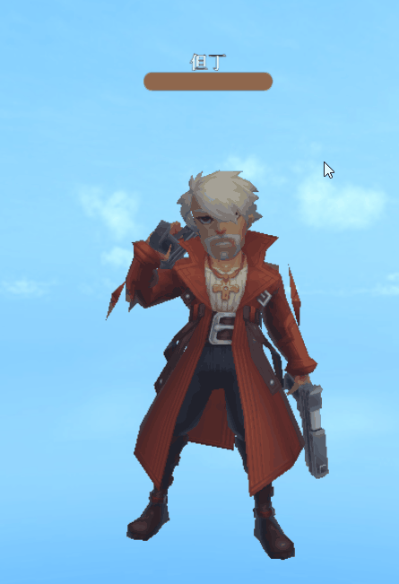

(Animated GIF 4-2)