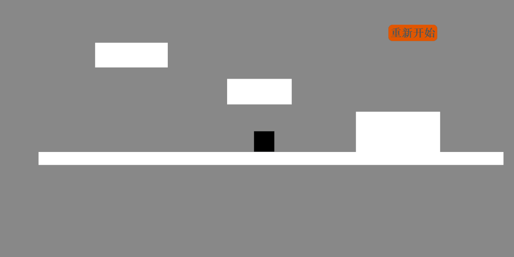
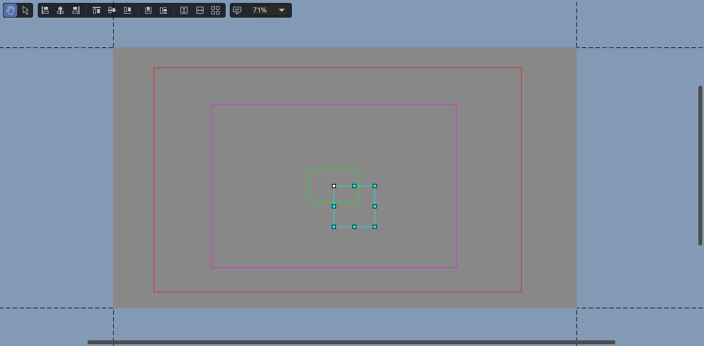
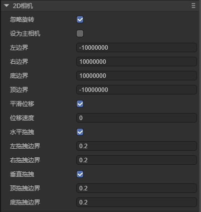
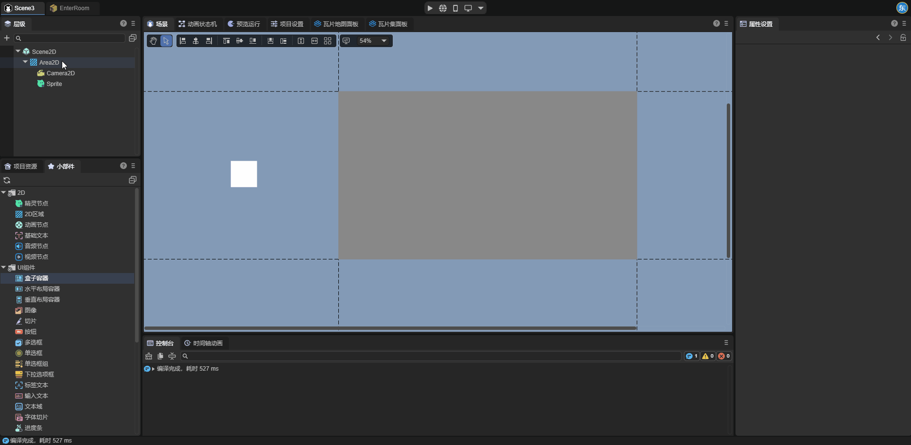

# 2D Camera

The 2D camera is a camera node applied in a 2D scene. It causes the rendered area in the scene to follow the movement of this node. Through the 2D camera, developers can conveniently and quickly achieve many game effects, such as scrolling the scene, following the movement of the character with the viewpoint, etc.



## 1. Creating a 2D Camera

It should be noted that the 2D camera must be used as a child node of the 2D area node. Adding a 2D camera alone to the scene is not allowed.

### 1.1 Creating a 2D Camera through LayaAir IDE

First, we create a 2D area node in the hierarchy panel, or we can also drag and add a 2D area node in the widget window:


Next, add a 2D camera node as a child node of the 2D area node in the hierarchy panel.


### 1.2 Creating a 2D Camera through Code

If developers want to create a 2D camera dynamically during program runtime, they need to create it through code. The sample code is as follows:

```typescript
const { regClass, property } = Laya;

@regClass()
/**
 * Script for creating a 2D camera. Developers can add this script to the 2D scene to view the effect
 */
 export class Script extends Laya.Script {

    declare owner : Laya.Scene;

    area2D: Laya.Area2D;
    camera2D: Laya.Camera2D;

    // Executed after the component is activated. At this time, all nodes and components have been created. This method is executed only once
    onAwake(): void {
        this.createCamera2D();
    }

    createCamera2D() {
        // The 2D camera must be added under the 2D area node, so a 2D area node needs to be created first
        this.area2D = new Laya.Area2D();
        // Set the position and size of the 2D area node
        this.area2D.pos(100, 100);
        this.area2D.size(200, 200);
        this.owner.addChild(this.area2D);

        // Create the 2D camera
        this.camera2D = this.area2D.addChild(new Laya.Camera2D);
     
        // Developers can set various attributes of the camera as needed, for example:
        // Set the camera as the main camera
        this.camera2D.isMain = true;
        // Enable smooth displacement
        this.camera2D.positionSmooth = true;
        // Set the speed of smooth movement
        this.camera2D.positionSpeed = 2;
    }
 }
```

## 2. Attributes of 2D Camera

### 2.1 Visualized Camera in the Scene

After the 2D camera is added to the scene, we can see it in the scene panel:



There are four boxes of different colors on the camera. Let's briefly introduce these four boxes here:

**Red Box**: Camera boundary, representing the movable range of the camera viewport. Movement beyond the boundary will be prevented. (Developers may not be able to see the red box after adding the camera to the scene. This is because the default camera boundary of the engine is very large. Developers can appropriately adjust the boundary value to observe the camera boundary).

**Purple Box**: Camera viewport, similar to the view frustum of the camera in the 3D scene. Only nodes within the range of the camera viewport can be observed. The size of the camera viewport is the same as the size of the 2D area where the camera is located.

**Green Box**: Dragging boundary of the camera, divided into horizontal dragging and vertical dragging, and it takes effect only after the corresponding attribute is enabled. When the camera node moves within the dragging boundary, the camera viewport does not move.

**White Box**: Camera node. The camera viewport is centered on the anchor point of the camera node, and the camera viewport follows the movement of the camera node.


### 2.2 Specific Attributes of 2D Camera

The specific attributes of the 2D camera are as follows:



| Attribute                                  | Function                                                     |
| ------------------------------------------ | ------------------------------------------------------------ |
| Ignore Rotation (ignoreRotation)           | When this attribute is enabled, the rotation value of the 2D camera is always 0. |
| Set as Main Camera (isMain)                | When this attribute is enabled, the 2D camera becomes effective. |
| Left Boundary (limit_Left)                 | Controls the extreme leftward movement distance of the camera viewport through the camera node, with the unit being pixels. |
| Right Boundary (limit_Right)               | Controls the extreme rightward movement distance of the camera viewport through the camera node, with the unit being pixels. |
| Bottom Boundary (limit_Bottom)             | Controls the extreme downward movement distance of the camera viewport through the camera node, with the unit being pixels. |
| Top Boundary (limit_Top)                   | Controls the extreme upward movement distance of the camera viewport through the camera node, with the unit being pixels. |
| Smooth Displacement (positionSmooth)       | When this attribute is enabled, the camera will smoothly move to its target position at the speed of `Position Speed`. |
| Displacement Speed (positionSpeed)         | This attribute takes effect only when the smooth displacement attribute is enabled and is used to control the speed of the camera during smooth movement. |
| Horizontal Dragging (dragHorizontalEnable) | Controls whether the camera enables the dragging and following effect in the horizontal direction. When enabled, the camera maintains a certain dragging range in the horizontal direction, and the size of the dragging range is controlled by the values of the left dragging boundary (drag_Left) and the right dragging boundary (drag_Right). This ensures that the camera viewport does not strictly follow the camera node, and the movement of the camera node within a certain range in the horizontal direction does not cause the camera viewport to move. When disabled, the camera viewport strictly follows the position of the camera node in the horizontal direction without any buffering or dragging effect, and the camera node is always located in the middle of the camera viewport in the horizontal direction. |
| Left Dragging Boundary (drag_Left)         | This attribute takes effect only when the horizontal dragging attribute is enabled. When the camera node moves leftward and exceeds this margin, the camera viewport follows. Its value represents the relative ratio of the camera node's distance from the left edge of the camera viewport. |
| Right Dragging Boundary (drag_Right)       | This attribute takes effect only when the horizontal dragging attribute is enabled. When the camera node moves rightward and exceeds this margin, the camera viewport follows. Its value represents the relative ratio of the camera node's distance from the right edge of the camera viewport. |
| Vertical Dragging (dragVerticalEnable)     | Controls whether the camera enables the dragging and following effect in the vertical direction. When enabled, the camera maintains a certain dragging range in the vertical direction, and the size of the dragging range is controlled by the values of the top dragging boundary (drag_Top) and the bottom dragging boundary (drag_Bottom). This ensures that the camera does not strictly follow the target but moves within a certain range above and below the target in a buffered manner. When disabled, the camera strictly follows the position of the target in the vertical direction without any buffering or dragging effect, and the y-coordinate of the camera is always equal to the y-coordinate of the target. |
| Top Dragging Boundary (drag_Top)           | This attribute takes effect only when the vertical dragging attribute is enabled. When the camera node moves upward and exceeds this margin, the camera viewport follows. Its value represents the relative ratio of the camera node's distance from the top edge of the camera viewport. |
| Bottom Dragging Boundary (drag_Bottom)     | This attribute takes effect only when the vertical dragging attribute is enabled. When the camera node moves downward and exceeds this margin, the camera viewport follows. Its value represents the relative ratio of the camera node's distance from the bottom edge of the camera viewport. |

 

## 3. Using 2D Camera

Before starting to learn about the 2D camera, it is recommended that developers first understand the RenderTexture in the engine. A typical usage of the render texture is to set it as the "target texture" attribute of the 3D camera, which will cause the 3D camera to render to the texture instead of the screen, and thus be used in the Sprite object like an ordinary texture. The usage of the 2D camera has many similarities to the render texture. Let's introduce the usage method of the 2D camera below.

### 3.1 2D Camera and 2D Area

For a 2D area node, if there is no 2D camera with the `isMain` attribute enabled on it, then this node is just a container with no other functions. As mentioned earlier, the 2D camera must be used as a child node of the 2D area node. Therefore, the 2D camera node and the 2D area node are two nodes that need to be used in coordination with each other.


Note: Only the 2D camera added under the 2D area and with the `isMain` attribute enabled can function properly. Therefore, unless otherwise specified, the 2D cameras mentioned in this section are all 2D cameras added under the 2D area and with the `isMain` attribute enabled.


### 3.2 Usage Methods of 2D Camera

After understanding the relationship between the 2D camera and the 2D area, let's explain the usage methods of the 2D camera through several demonstration examples.

As shown in the following figure, set a 2D area within the scene range and add a white Sprite2D on it; move this node outside the scene range but keep it within the camera viewport. Run and view the effect:



(Figure 3-2-1)

Next, we change the position of the white node but keep it within the camera viewport. Run again and we can find that the position of the white node in the scene has changed:


(Figure 3-2-2)

Next, we move the white node outside the camera viewport but keep it within the scene range. After running and viewing, we can find that the white node does not appear in the scene:


(Figure 3-2-2)

Then move the white node into the camera range, and then move the 2D area to the right to leave the scene range but keep the camera and the white node within the scene range. After running and viewing, we can find that the white node does not appear in the scene:


(Figure 3-2-4)

Through these four examples, we explain the usage method of the 2D camera. When a node meets the following conditions:

**1.** The node is added as a child node of the 2D area;

**2.** A 2D camera is added to this 2D area;

**3.** The node is within the camera viewport of the 2D camera;

At this time, this node will be displayed at the corresponding position of the 2D area node (the size of the camera viewport is the same as the size of the 2D area where it is located). The 2D area itself is also a node, and it will be displayed in the scene along with other nodes in the scene. As shown in Figure (3-2-4), like other nodes, when the 2D area node leaves the scene range, it will not appear in the scene.

In the example shown in Figure (3-2-3), we can find that when a node added on the 2D area leaves the camera viewport, even if this node is within the scene range, this node will not be displayed in the scene.

## 4. Usage Examples of 2D Camera

Through the use of the 2D camera, developers can achieve many interesting game effects. Let's show some simple Demos and explain the usage methods of the 2D camera on them.


### 4.1 Switching the Game Scene by Switching the Main Camera

In some games that require frequent scene switching, such as when players need to frequently enter and exit rooms, developers can set the nodes of the two rooms at two distant positions in the scene and add 2D cameras to these two rooms. When players enter and exit the rooms, the `isMain` attribute of the corresponding room camera can be enabled through code.


### 4.2 Limiting the Size of the Game Map

The map size of most games is limited, and players cannot move within an infinitely large range. Therefore, the game needs to limit the player's viewpoint range. Developers can limit the player's viewpoint range by setting the four boundaries of the camera.


It can be seen that within a certain range, the camera follows the movement of the character, but when reaching the boundary, the movement of the camera is limited.


### 4.3 The Camera Follows the Movement of the Player

Sometimes, developers need the game screen to move along with the movement of the player. At this time, we can let the 2D camera follow the player. Combined with the various attributes of the 2D camera, many picture effects can be designed.


In this example, we can find that the position of the restart button in the upper right corner has never changed. If a node is not affected by the 2D camera, then this node will still appear in the scene normally. Developers can add a UI system to the game in this way.